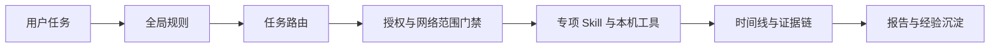

# reverse-skill：面向 AI Agent 的逆向与安全技能路由包

> [!abstract] 一句话介绍
> `reverse-skill` 不是某一款逆向工具，而是一套给 Claude Code、Codex、Cursor、OpenCode 等代码 Agent 使用的**安全任务路由与标准作业包**：它先判断任务类型，再选择对应 Skill、检查本机工具、建立授权与证据链，最后组织执行和报告交付。

项目地址：[zhaoxuya520/reverse-skill](https://github.com/zhaoxuya520/reverse-skill)

## 它解决什么问题

安全任务经常同时涉及多种文件、工具和方法：APK 可能需要 `jadx`、`apktool` 和 Frida，原生二进制可能需要 IDA Pro、Ghidra 或 radare2，前端加密又需要浏览器、Hook 和补环境。让通用 AI Agent 临场选择工具，容易出现三个问题：

- **路由错误**：面对 APK、ELF、JavaScript、PCAP 或固件时，选错工具或分析顺序。
- **环境不一致**：工具、MCP 服务和脚本散落在不同机器，换环境后无法复现。
- **过程不可审计**：缺少授权范围、时间线、证据、发现和利用路径之间的结构化记录。

`reverse-skill` 把这些问题收束成“任务分诊 → 环境检查 → 授权门禁 → 专项 Skill → 证据链 → 报告”的固定流程。它的核心价值不是替代安全工具，而是让 AI Agent **知道何时、按什么顺序、在什么边界内使用这些工具**。

## 核心工作流



对应到仓库中的主要文件：

| 阶段 | 关键入口 | 作用 |
|---|---|---|
| 全局约束 | `RULES.md` | 定义授权、路由和执行边界 |
| 快速分诊 | `skills/MASTER-ROUTING.md` | 根据任务快速选择 PRIMARY Skill |
| 路由事实源 | `skills/config/routing.json` | 集中维护任务到 Skill 的路由规则 |
| 环境识别 | `skills/scripts/refresh-tool-index.*` | 生成当前机器的工具索引 |
| Case 初始化 | `skills/scripts/case-init.*` | 建立 scope、timeline 和 work item |
| 专项执行 | `skills/<场景>/SKILL.md` | 提供具体领域的方法和工具调用规范 |
| 交付审查 | `skills/case-review/` | 检查 Evidence → Finding → Path 证据链及文件完整性 |
| 经验复用 | `skills/field-journal/` | 沉淀脱敏后的可复用经验 |

## 支持的任务类型

项目覆盖面较广，可以大致分为三组：

### 逆向分析

- Android APK、iOS 与移动端应用
- Windows、Linux 原生二进制及 `.NET` 程序
- 前端 JavaScript 签名、加密参数和自定义 DSL/VM
- Go、Rust、macOS、浏览器扩展、固件与 IoT
- 二进制版本差分、补丁差分、OLLVM 脱混淆

### 授权安全测试

- API、数据库、云与 Kubernetes、供应链和 LLM 应用安全
- 渗透测试、攻击链、Pwn、EDR 防御规避研究
- Active Directory、身份联合、邮件、无线、硬件与 OT/ICS
- 恶意软件分析、数字取证、威胁狩猎和代码审计

### 辅助交付

- 浏览器或桌面自动化
- 证据审查、图表生成和技术报告
- CTF 沙箱编排与专项子技能

> [!warning] 授权边界
> 该项目只适用于合法安全研究、教育、CTF，以及对自有或已明确授权目标的测试。它把授权状态和网络范围放在 Case 初始化阶段；未满足条件时，不应对目标执行扫描、利用或其他主动操作。

## 项目的工程化特点

根据当前仓库文档，项目的工程化重点包括：

- **结构化路由**：`routing.json` 是路由单一事实源，当前记录 41 条规则（R0-R40）。
- **回归验证**：维护 163 条中英双语路由用例，避免调整关键词后把任务分到错误 Skill。
- **客户端无关**：核心路由、Case 流程和测试不绑定某个 AI 客户端，客户端适配层是可选项。
- **跨平台检查**：核心 CI 覆盖 Windows 与 Ubuntu，同时提供 macOS、Linux 和 Kali 的部署说明。
- **证据优先**：用 Scope、Timeline、Work Item、Evidence、Finding、Path 组织可审计交付。
- **供应链约束**：自动安装能力要求固定版本、提交或校验策略，降低浮动依赖带来的风险。

截至 2026-08-21，GitHub 公开数据为 27,136 Stars、3,698 Forks、22 个 Open Issues；最新正式版为 `v1.0.1`，发布于 2026-08-08。Stars 等数据会持续变化，只代表采集时点。

## 快速开始

### 前置环境

- Java / JDK：运行 `jadx`、`apktool` 等 Java 工具。
- Node.js 22.12+：运行 JavaScript 工具链和部分 MCP 服务。
- Python 3.x：运行 Frida 及辅助脚本。
- 一个兼容的代码 AI 客户端：如 Claude Code、Codex、Cursor 或 OpenCode。

### macOS / Linux 基础步骤

```bash
git clone https://github.com/zhaoxuya520/reverse-skill.git
cd reverse-skill

# 首次使用先检测本机工具，生成 tool-index.md 和 tool-index.json
bash skills/scripts/refresh-tool-index.sh
```

然后让 AI Agent 阅读仓库中的 `README_AI.md`，按当前操作系统加载平台说明、全局规则和路由入口。也可以直接测试路由：

```bash
bash skills/scripts/master-route.sh --hint "分析一个 Android APK 的证书校验逻辑"
```

正式处理 Case 前，需要初始化工作目录并确认授权范围：

```bash
bash skills/scripts/case-init.sh --hint "分析一个 Android APK 的证书校验逻辑"
```

> [!note] Clone 不等于已经集成
> 克隆仓库只是把 Skill、脚本和规则放到本地。AI 客户端还需要通过自身支持的项目指令、Skill 发现或适配机制加载它们。具体以 `README_AI.md` 和对应平台文档为准。

## 怎么评价这个项目

### 优点

- 把“AI 会不会碰巧选对工具”变成可检查、可回归的路由规则。
- 不只关注分析命令，还覆盖授权、证据、时间线、交接和经验复用。
- 适合多次、多人或多 Agent 重复执行的安全工作，能减少每次从零搭流程的成本。
- 对 Codex、Claude Code 等客户端保持相对中立，迁移时不必重写整个安全方法库。

### 局限与风险

- 它是**方法与编排层**，不能替代 IDA Pro、Frida、Burp Suite 等实际工具，也不能弥补分析者缺少的领域知识。
- 仓库覆盖面很大，首次使用和维护成本高于单个 Skill；只做一次简单样本分析时，整包接入可能偏重。
- 部分工具有商业许可证、平台限制或额外登录配置，路由成功不代表工具一定可用。
- 自动引导和工具自举会执行本地脚本。即使项目加入了版本固定和完整性检查，仍应在运行前审查脚本、权限及下载来源。
- 41 条路由、163 条用例和质量验证结果来自项目自身文档与 Release 说明；本笔记未在本机完整复跑该仓库的全部测试。
- 项目创建于 2026-05，虽然短期内获得较多关注，但仍应结合 Issue、提交活跃度和实际 Case 结果持续评估成熟度。

## 适合谁

比较适合：

- 经常让 AI Agent 参与逆向、安全研究或 CTF 的个人与团队。
- 希望统一不同机器、不同 Agent 客户端安全工作流的团队。
- 需要保留授权范围、证据链和可审计报告的专业场景。
- 想把个人经验沉淀为可复用 Skill，而不是只保存在聊天记录中的研究者。

不太适合：

- 只想下载并打开某一个 APK 或二进制的临时用户。
- 不准备配置本机安全工具链、也不需要标准化交付的人。
- 希望 AI 在无人确认授权和范围的情况下直接执行主动测试的人。

## 我的结论

`reverse-skill` 真正有价值的部分不是“收集了很多安全 Skill”，而是尝试把安全 Agent 的工作变成一个可治理流程：**先确认授权和范围，再路由到正确方法，调用真实工具，保留证据，最后审查交付**。

如果只是偶尔做一次逆向，按需选用其中一个专项 Skill 更轻；如果需要长期让 AI 参与多类型安全任务，这套统一路由、Case 契约和回归测试会更有价值。是否采用整包，关键要看团队是否愿意维护本机工具索引、路由规则和证据流程，而不是只看 Skill 数量。

## 参考资料

- [GitHub 仓库](https://github.com/zhaoxuya520/reverse-skill)
- [中文 README](https://github.com/zhaoxuya520/reverse-skill/blob/a3bdfffcf2e6a611a1cbdcc9a312be44527ac043/README_zh.md)
- [AI Agent 引导文档](https://github.com/zhaoxuya520/reverse-skill/blob/a3bdfffcf2e6a611a1cbdcc9a312be44527ac043/README_AI.md)
- [路由配置](https://github.com/zhaoxuya520/reverse-skill/blob/a3bdfffcf2e6a611a1cbdcc9a312be44527ac043/skills/config/routing.json)
- [v1.0.1 Release](https://github.com/zhaoxuya520/reverse-skill/releases/tag/v1.0.1)
- [更新记录](https://github.com/zhaoxuya520/reverse-skill/blob/a3bdfffcf2e6a611a1cbdcc9a312be44527ac043/CHANGELOG.md)
- [许可证说明](https://github.com/zhaoxuya520/reverse-skill/blob/a3bdfffcf2e6a611a1cbdcc9a312be44527ac043/LICENSE)

