大家好，我是程序员鱼皮。给大家分享一些我自己在用的 AI 编程扩展，帮你大幅提高 AI 编程效率和代码质量。

**万字长文 + 100 多张图**，绝对干货！点个收藏，让我们开始吧~

> 本文已收录到 [鱼皮 AI 导航的《免费 Vibe Coding 教程》](https://link.zhihu.com/?target=https%3A//ai.codefather.cn/) 中，可以在这里免费获取更多 AI 资源。

  

## **一、MCP 服务器类**

MCP 的全称是 Model Context Protocol 模型上下文协议。简单来说，就是让 AI 大模型能够连接外部工具和数据源的一个开放标准。

打个比方，MCP 就像是 AI 的 USB-C 接口，原本 AI 只能根据训练数据来回答问题、生成代码，但有了这个统一接口，它就能连接各种外部工具，比如打开浏览器看网站、搜索并抓取网页内容、部署项目到云端、访问数据库等等，能力一下子就丰富起来了。

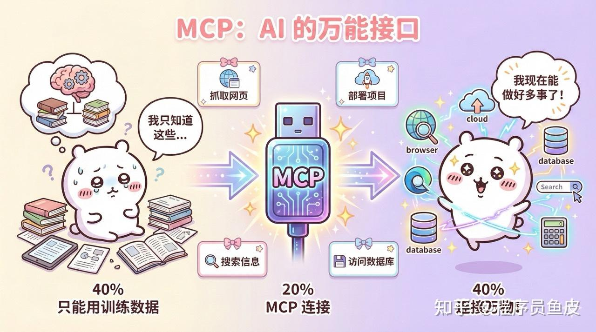

  

### **⭐️ Firecrawl MCP 网页内容抓取**

首先要介绍的是 [Firecrawl MCP](https://link.zhihu.com/?target=https%3A//www.firecrawl.dev/)，让 AI 能够自动抓取和理解网页内容。

我在开发项目时经常需要从网上获取参考资料、阅读官方文档和技术博客，或者分析竞品的功能实现。如果人工来做这件事，需要先打开网站、再手动复制粘贴内容，或者自己写个爬虫脚本，麻烦得一批。

有了 Firecrawl MCP，这事儿就简单多了。我直接在 AI 编程工具中跟 AI 说：

-   帮我获取这个网站的内容
-   帮我读一下这个文档
-   帮我从网上搜索 XX 相关的信息

它就能自动把网页的内容、结构、甚至是动态加载的数据都给我抓下来。

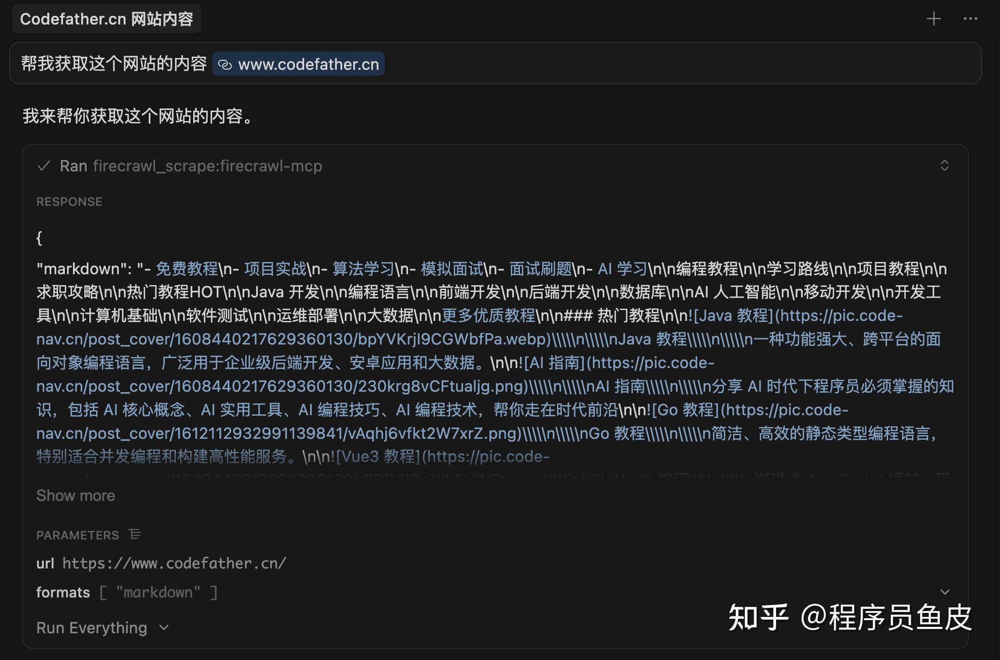

  

**如何使用？**

首先你需要在 [Firecrawl 官网](https://link.zhihu.com/?target=https%3A//www.firecrawl.dev/app/api-keys) 注册账号，并创建一个调用服务的 API Key。

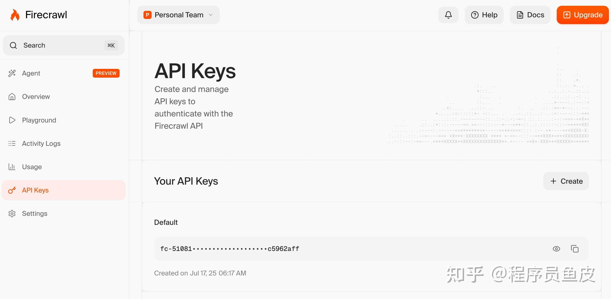

  

然后进入到 AI 编程工具中配置一下 MCP 服务器。这里我以 Cursor 为例，其他 AI 编程工具对接 MCP 的方法可以看各自的官方文档，比如 [Claude Code 接入 MCP 文档](https://link.zhihu.com/?target=https%3A//docs.anthropic.com/en/docs/claude-code/mcp)。

打开 Cursor 设置，找到 Tools & MCP，点击 `+ New MCP Server`。

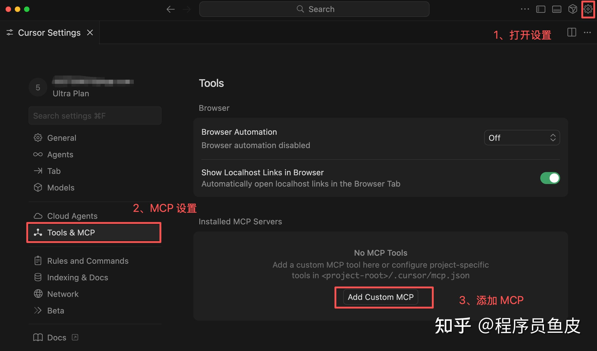

  

本质上就是修改 MCP 配置文件，添加这样的配置：

```json
{
 "mcpServers": {
   "firecrawl-mcp": {
     "command": "npx",
     "args": ["-y", "firecrawl-mcp"],
     "env": {
       "FIRECRAWL_API_KEY": "你的API密钥"
    }
  }
}
}
```

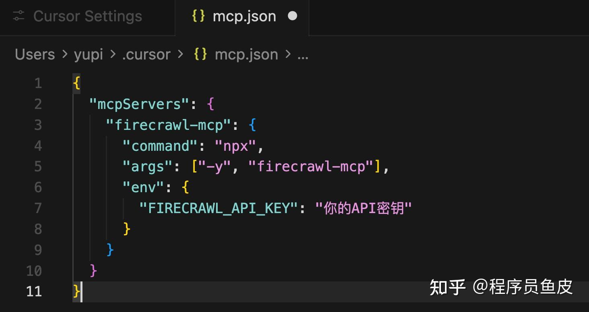

  

这段配置的意思是：通过 npx 命令来运行 firecrawl-mcp 这个工具，并且把你的 API 密钥传给它。如果你电脑上还没有安装 npx，需要先 [到官网安装 Node.js](https://link.zhihu.com/?target=https%3A//nodejs.org/zh-cn)，npx 会随着 Node.js 一起安装。

配置好之后，看到绿色的成功点点，表示能够正常使用了。

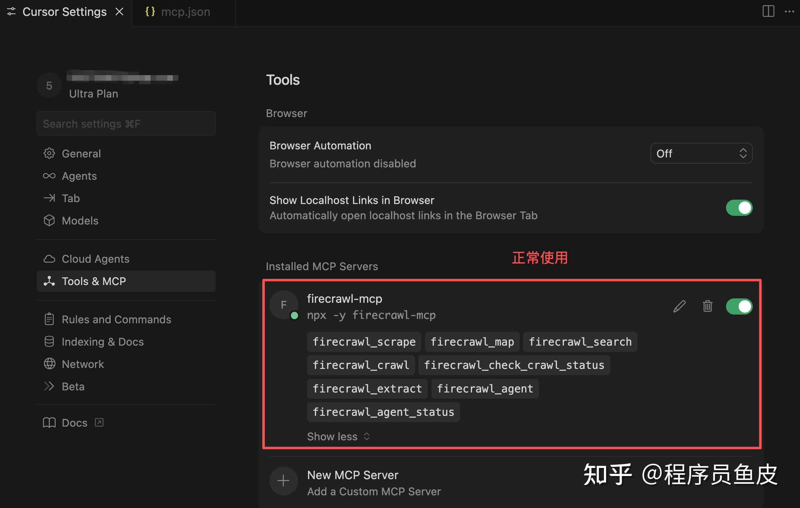

  

除了基础的网页抓取，Firecrawl MCP 还支持批量抓取整站内容、递归抓取网站的多层链接、失败自动重试等高级功能。

  

### **Brave Search MCP 隐私搜索**

接下来是 [Brave Search MCP](https://link.zhihu.com/?target=https%3A//github.com/brave/brave-search-mcp-server)，让 AI 能够进行注重隐私保护的网络搜索。

在开发过程中，我经常需要让 AI 帮我搜索最新的技术资料、查找某个库的使用示例、或者了解某个技术问题的解决方案。传统的做法是自己去搜索引擎查，然后把结果复制给 AI，比较麻烦。

有了 Brave Search MCP，我直接跟 AI 说：

-   帮我搜索一下 React 19 的新特性
-   查一下这个错误怎么解决

它就能通过 Brave 搜索引擎去找答案。而且 Brave 搜索不会追踪你的搜索记录，隐私保护做得很好。

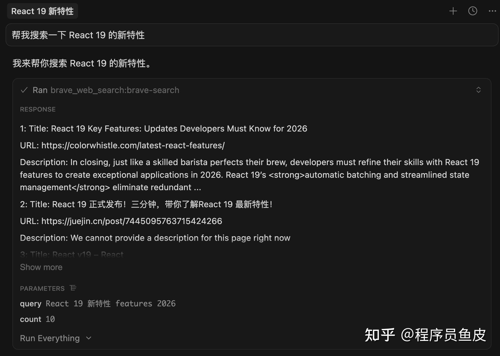

  

**如何使用？**

首先去 [Brave Search API](https://link.zhihu.com/?target=https%3A//brave.com/search/api/) 注册账号，然后进入 API Key 管理页面，首先要选择一个订阅计划。必须选择免费版啊！每月有 2000 次查询额度，对于个人开发来说够用了。

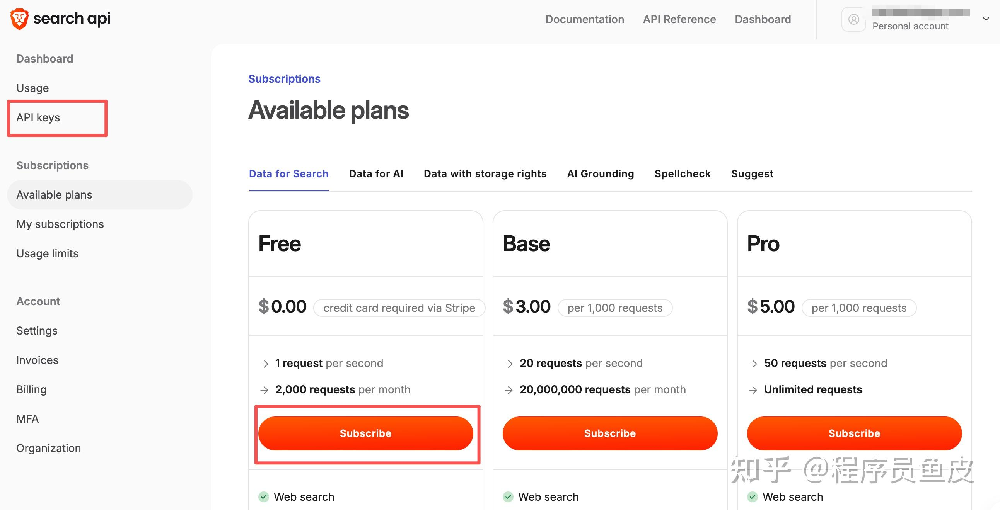

  

但这里比较坑的一点是，即使订阅免费版，也要填写付款方式，没有海外银行卡的朋友可以撤了。

订阅成功后，创建 API Key：

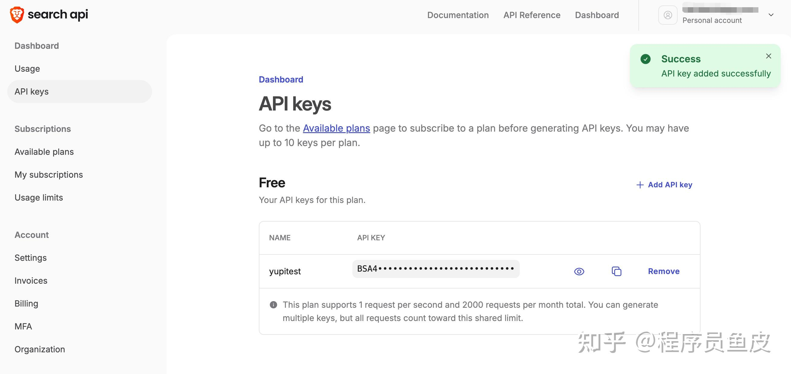

  

拿到 API Key 后，在 Cursor 的 MCP 配置中添加：

```json
{
 "mcpServers": {
   "brave-search": {
     "command": "npx",
     "args": ["-y", "brave-search-mcp"],
     "env": {
       "BRAVE_API_KEY": "你的API密钥"
    }
  }
}
}
```

配置好后，AI 就能随时帮你搜索最新信息了。

支持网页、图片、视频、新闻等多种类型的内容搜索，甚至能搜索本地商家信息（比如附近的咖啡店）。

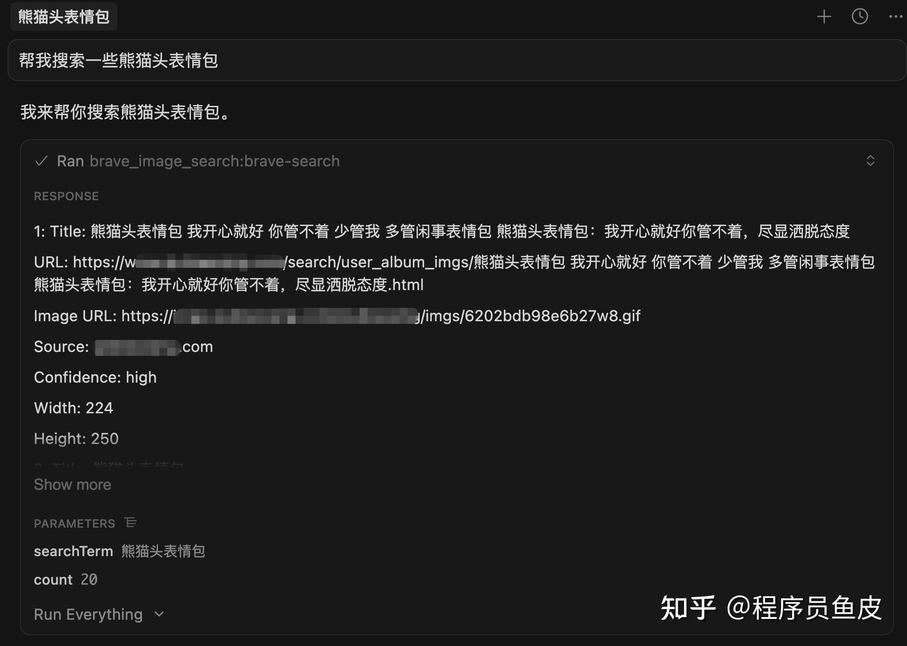

  

它还带有 AI 摘要功能，能把搜索结果自动总结成简洁的答案。

  

### **⭐️ Context7 获取最新文档**

[Context7](https://link.zhihu.com/?target=https%3A//context7.com/) 能帮 AI 获取到最新的技术文档。

我们都知道，AI 的训练数据是有截止时间的，比如 GPT-4 的知识可能只更新到 2023 年。这就导致一个问题，当你问 AI 关于某个框架最新版本的用法时，它给出的答案可能是过时的。

Context7 就是来解决这个问题的。它会自动从官方文档网站抓取最新的、特定版本的文档内容，然后提供给 AI。

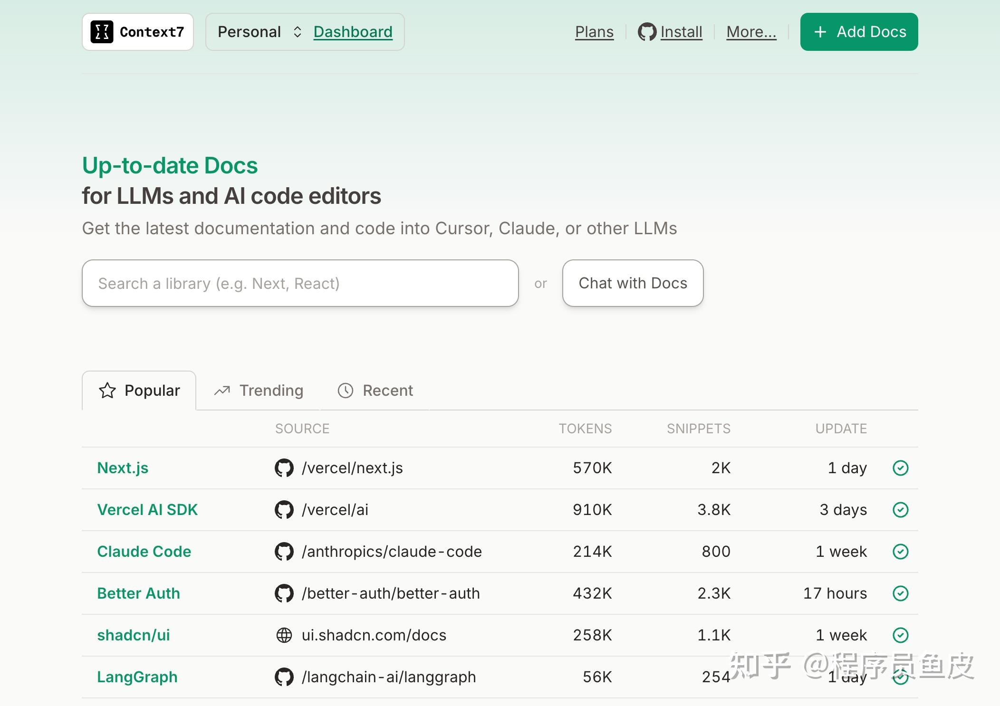

  

这样一来，AI 给出的代码示例和建议就是基于最新文档的，不会去用已经废弃的写法，大大提高了项目能正常运行的概率。

  

**如何使用？**

访问 [Context7 Dashboard](https://link.zhihu.com/?target=https%3A//context7.com/dashboard) 注册账号并获取 API Key，个人使用是免费的。

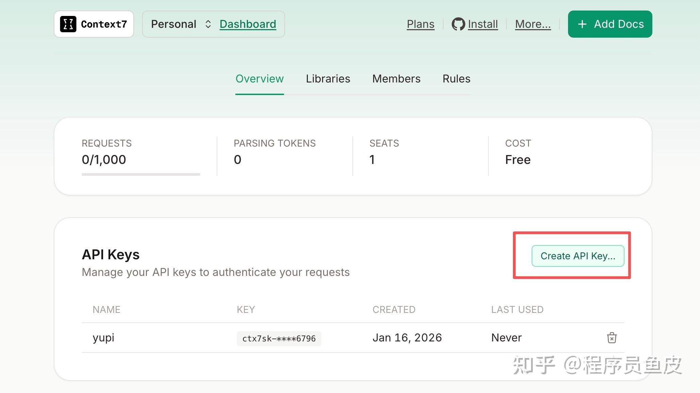

  

然后在 MCP 配置中添加：

```json
{
 "mcpServers": {
   "context7": {
     "url": "https://mcp.context7.com/mcp",
     "headers": {
       "CONTEXT7_API_KEY": "你的API密钥"
    }
  }
}
}
```

之后你在 AI 编程工具中跟 AI 对话时，只要跟技术文档相关，或者主动提一嘴 "use context7"，它就会自动去获取最新文档来回复你。

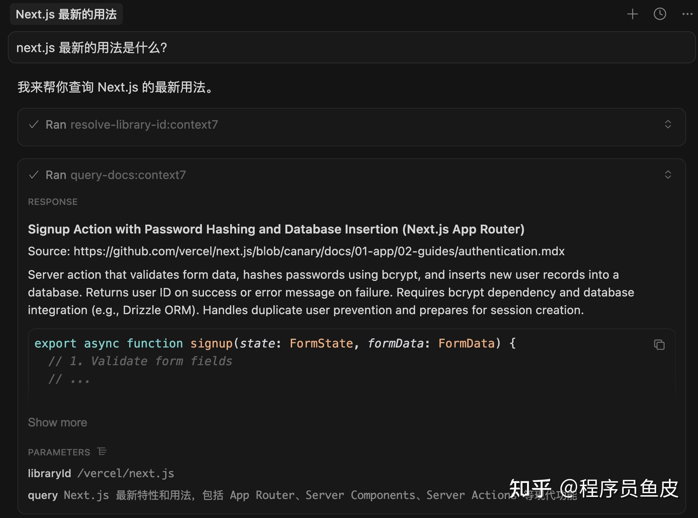

  

### **Web to MCP 复刻网页组件**

[Web to MCP](https://link.zhihu.com/?target=https%3A//web-to-mcp.com/) 是一个 Chrome 扩展，搭配 MCP 使用，能把网页上的任何 UI 组件直接发送给 AI，让 AI 生成对应的代码，用最快的速度抄作业！

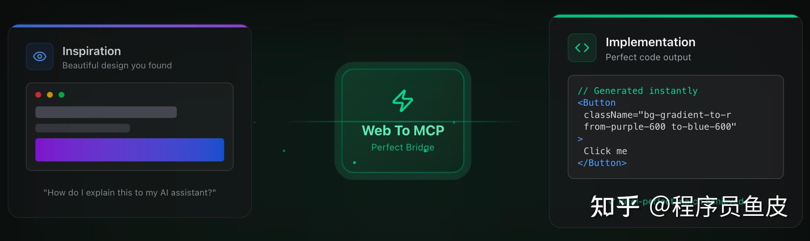

  

很多时候，我在浏览网站时看到一个不错的 UI 组件，想让 AI 帮我实现类似的效果。以前的做法是截图，然后跟 AI 描述：“帮我做一个类似这样的按钮，圆角、渐变色、带阴影……” 既费时又不准确。

有了 Web to MCP，我只需要在网页上点击某个想复刻的元素：

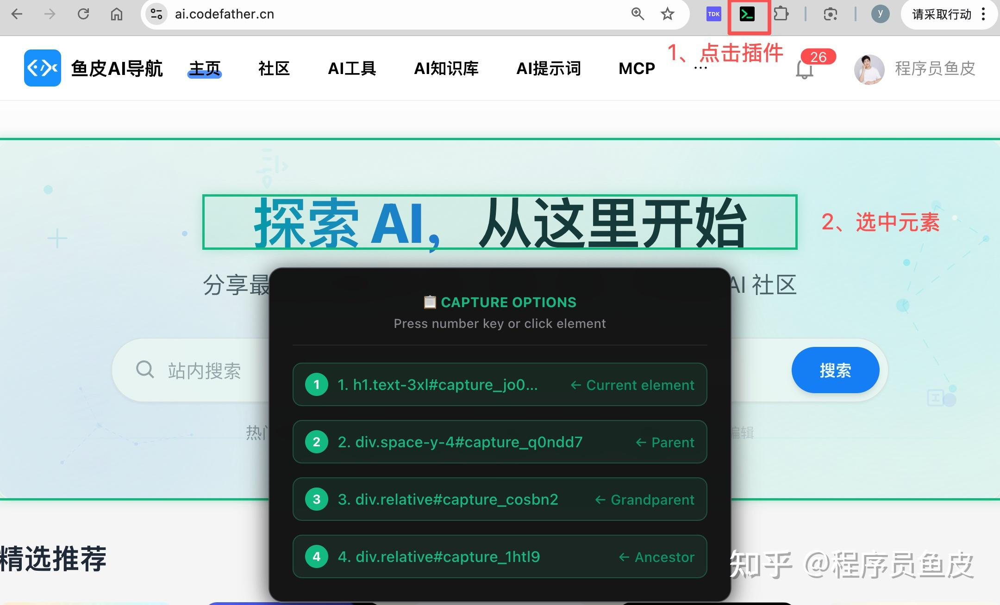

  

它就会自动捕获组件的 DOM 结构、CSS 样式、甚至是交互效果，并且给你一个让 AI 复刻组件的提示词。

你只需要把提示词发送给 AI，AI 会调用 MCP 拿到完整的组件信息，并生成代码来复刻组件。

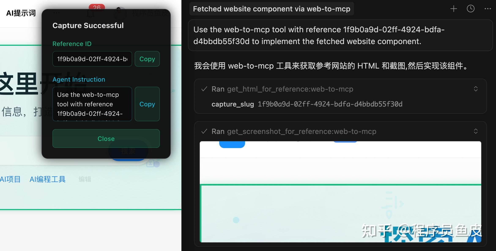

  

相比于直接给 AI 模糊的截图，生成的代码更准确了。


  

**如何使用？**

1）通过官网或者在 Chrome 应用商店搜索 Web to MCP 来安装扩展

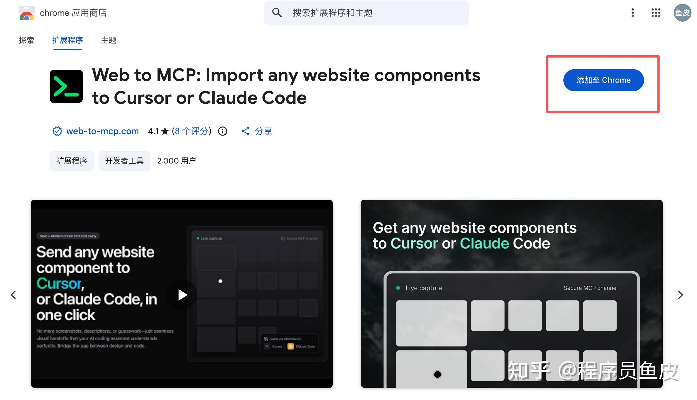

  

2）用 Google 账号登录，获取你的 MCP 配置：

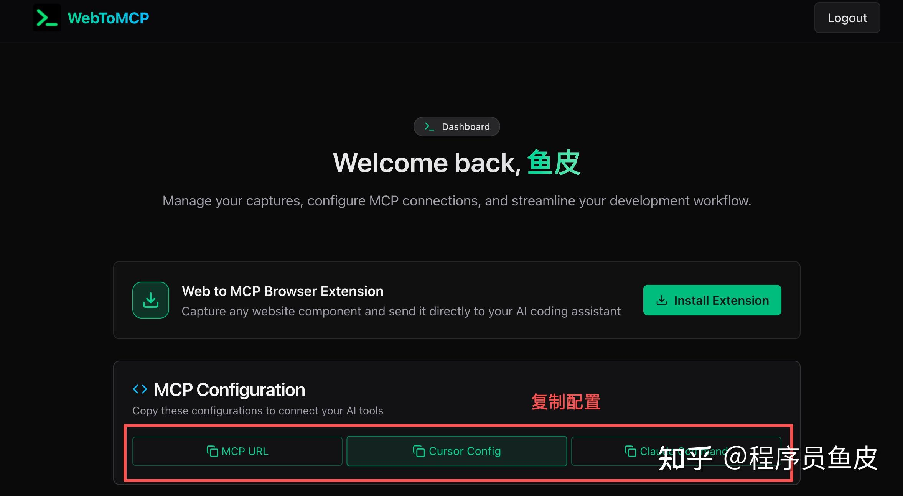

  

3）在 AI 编程工具的 MCP 配置中添加：

```json
{
 "mcpServers": {
   "web-to-mcp": {
     "url": "https://web-to-mcp.com/mcp/你的唯一ID"
  }
}
}
```

之后浏览网页时，点击扩展图标，选中你想要的组件，就能直接在 AI 编程工具里引用它，并且快速生成风格一致的代码了。

  

### **Chrome DevTools MCP 浏览器调试**

[Chrome DevTools MCP](https://link.zhihu.com/?target=https%3A//github.com/ChromeDevTools/chrome-devtools-mcp) 是 Chrome 官方团队开发的 MCP 服务器，让 AI 能够直接控制 Chrome 浏览器进行操作和调试。

在做前端开发时，我经常需要调试页面、查看网络请求、分析性能问题。以前这些都得手动在浏览器的开发者工具里操作，现在有了这个工具，我可以直接让 AI 帮我做这些事。

比如我跟 AI 说：“帮我分析当前这个网站加载慢的原因”，它就能打开 Chrome DevTools，分析网络请求、查看资源加载时间，然后告诉我哪里有问题。

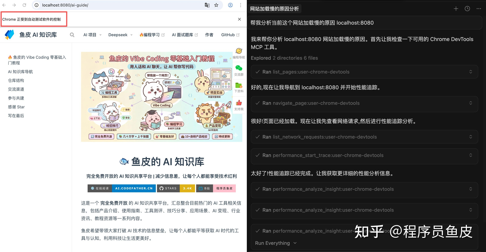

  

或者我说：“帮我测试一下这个表单提交功能”，它就能自动填写表单、点击提交按钮、查看请求响应。

**如何使用？**

在 MCP 配置中添加：

```json
{
 "mcpServers": {
   "chrome-devtools": {
     "command": "npx",
     "args": ["-y", "chrome-devtools-mcp@latest"]
  }
}
}
```

配置好后，AI 就能帮你自动化测试、调试页面了。工具会自动连接到你正在运行的 Chrome 浏览器，无需额外设置。

这个工具还支持元素定位、网络请求监控、性能分析、页面截图等功能，非常适合前端开发和测试。

  

### **EdgeOne Pages MCP 一键部署**

[EdgeOne Pages MCP](https://link.zhihu.com/?target=https%3A//github.com/TencentEdgeOne/edgeone-pages-mcp) 是腾讯云团队开发的部署工具，能把你的项目一键部署到腾讯云的加速网络，让别人能访问你的网站，并且给你的网站提速。

开发完项目后，你一定会想让别人访问你的网站。传统的部署流程很繁琐，需要人工打包代码、上传代码到服务器、配置域名、设置 HTTPS 安全证书，一套流程下来得花不少时间。


  

有了 EdgeOne Pages MCP，我直接在 AI 编程工具里跟 AI 说：“帮我部署这个项目”，它就能自动完成打包、上传、部署的全过程，最后给我一个可以直接访问的 URL。而且部署到全球加速网络，各地访问速度都很快。

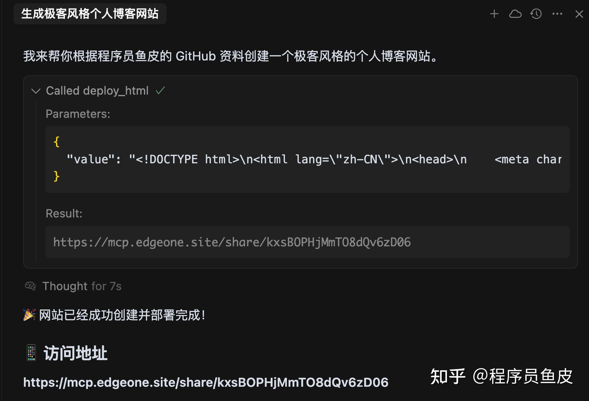

  

**如何使用？**

首先到 [EdgeOne 控制台](https://link.zhihu.com/?target=https%3A//console.cloud.tencent.com/edgeone/pages) 开通 Pages 服务：

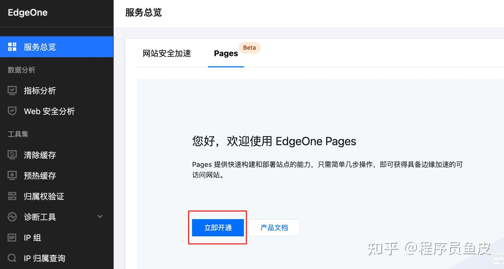

  

然后获取 API Token，作为调用服务的凭证：

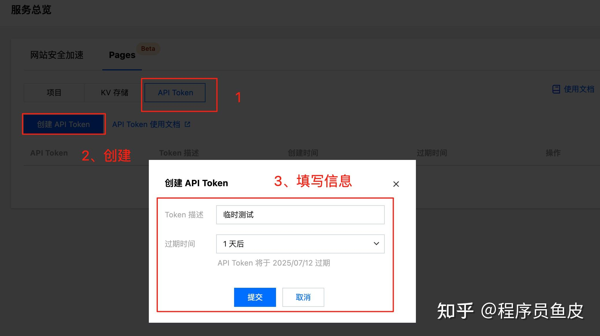

  

在 MCP 配置中添加：

```json
{
 "mcpServers": {
   "edgeone-pages-mcp-server": {
     "command": "npx",
     "args": ["edgeone-pages-mcp"],
     "env": {
       "EDGEONE_PAGES_API_TOKEN": "你的API Token"
    }
  }
}
}
```

配置好后，就能让 AI 帮你一键部署项目了。部署是免费的，支持静态网站、全栈项目、自动配置 HTTPS 和 CDN 加速等功能，非常适合个人项目和小型应用。

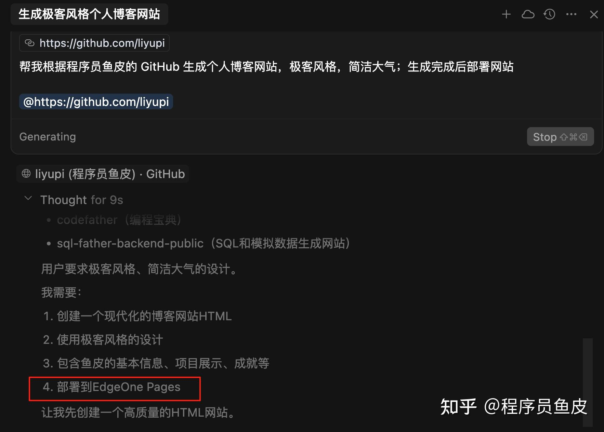

  

### **COS MCP 对象存储**

[COS MCP](https://link.zhihu.com/?target=https%3A//github.com/Tencent/cos-mcp) 能让 AI 直接操作腾讯云对象存储。

对象存储就是云端的文件存储服务，可以理解为云盘。

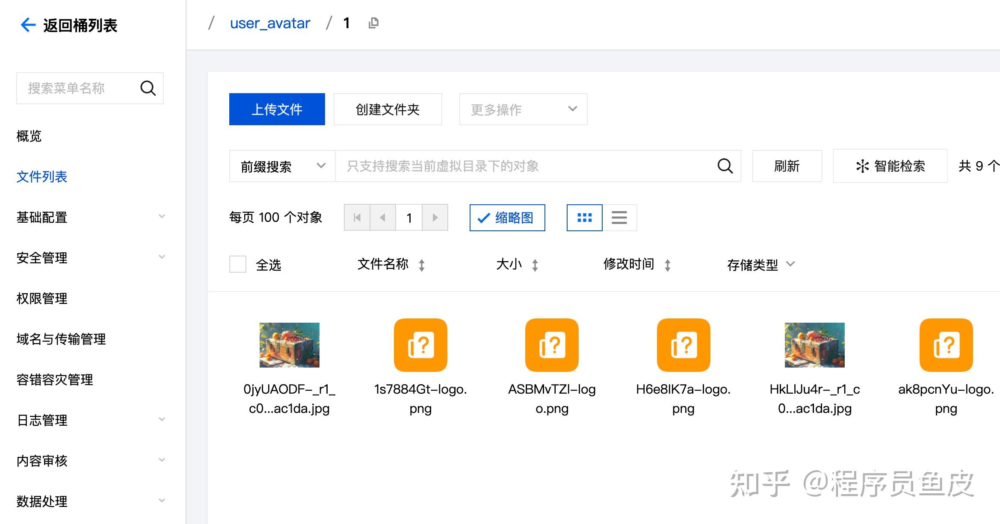

  

在团队协作开发中，我们经常需要让 AI 参考一些项目规范文档、或者引用一些图片。以前的做法是把这些文件放在本地，然后手动上传给 AI，既不方便，也不利于团队维护、修改和共享。

有了 COS MCP，我可以说一句话把这些需要共享的文件存到云端，然后让 AI 直接去读取。

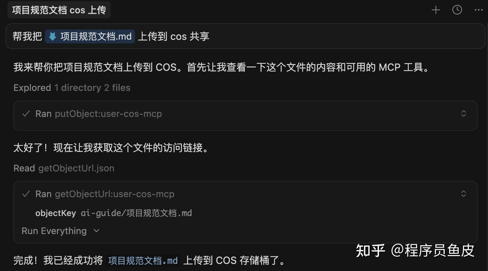

  

比如我跟 AI 说：“按照我们团队 COS 共享的项目规范文档来写这个功能”，它就能自动从 COS 里读取规范文档，然后按照规范来写代码。

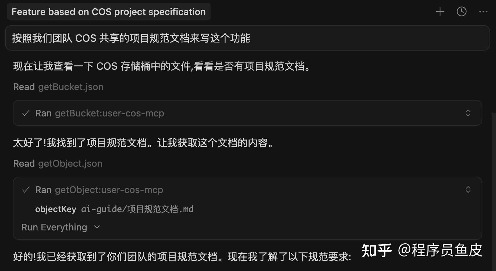

  

**如何使用？**

1）首先需要开通腾讯云 COS 对象存储服务。访问 [腾讯云 COS 控制台](https://link.zhihu.com/?target=https%3A//console.cloud.tencent.com/cos)，创建一个存储桶（Bucket）：

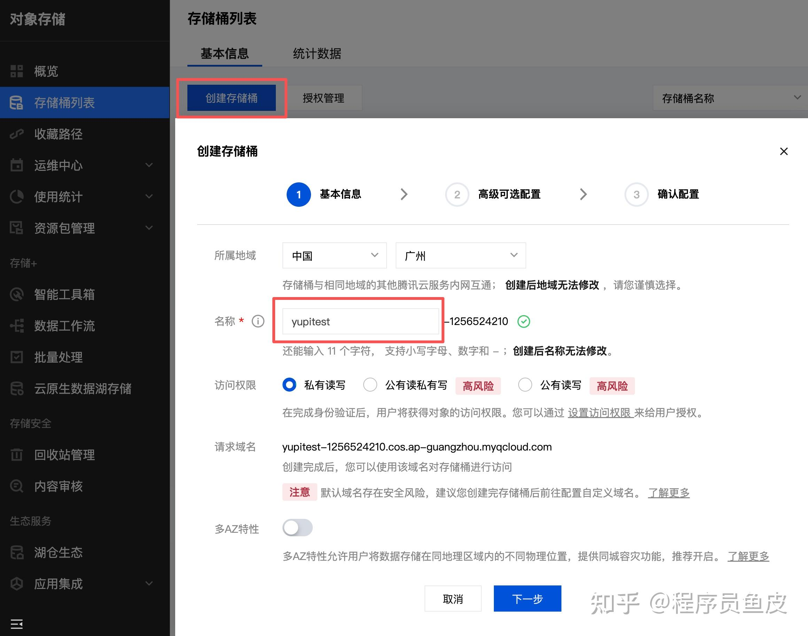

  

2）然后在 "访问管理" > "API 密钥管理" 中获取 SecretId 和 SecretKey，注意一定不要泄露这些信息！

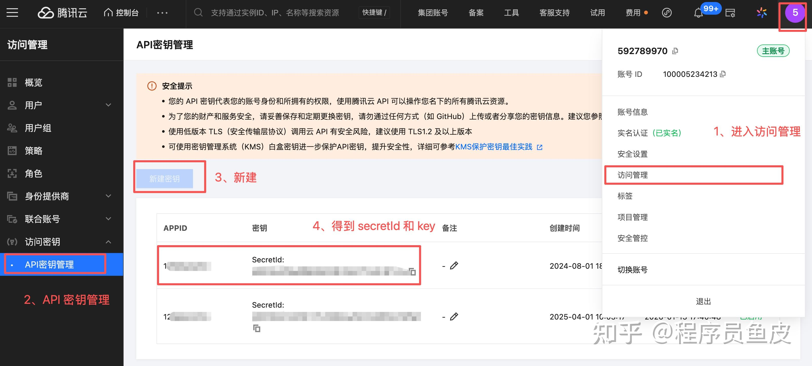

  

3）在 MCP 配置中添加：

```json
{
 "mcpServers": {
   "cos-mcp": {
     "command": "npx",
     "args": [
       "cos-mcp",
       "--Region=你的地域",
       "--Bucket=你的存储桶",
       "--SecretId=你的SecretId",
       "--SecretKey=你的SecretKey"
    ]
  }
}
}
```

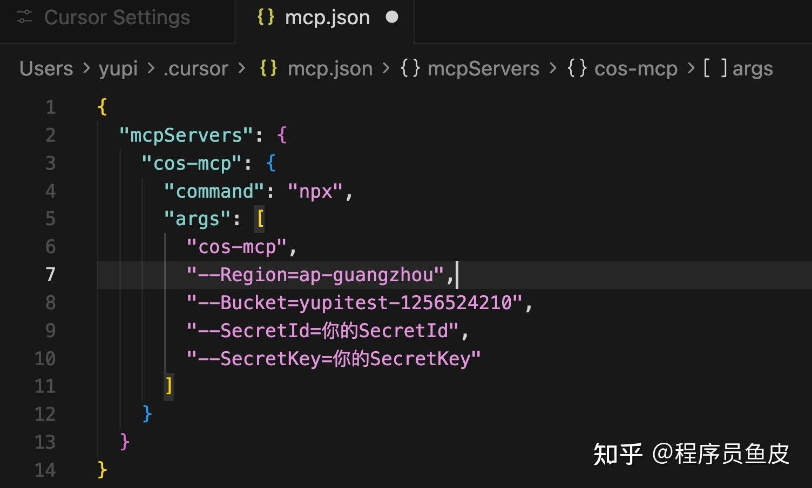

  

配置好后，AI 就能读取和管理你云端的文件了，相当于给了 AI 一个网盘。

此外，这个工具还支持图片搜索、图片处理、文档转换、视频封面生成等功能。

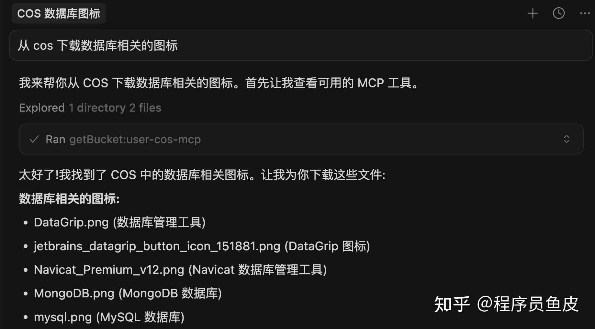

  

### **GitHub MCP 代码仓库管理**

[GitHub MCP](https://link.zhihu.com/?target=https%3A//github.com/github/github-mcp-server) 是 GitHub 官方开发的 MCP 服务器，让 AI 能够直接操作 GitHub 代码仓库。

程序员朋友们对 GitHub 肯定不陌生，这是全球最大的代码托管平台，可以用它来存储代码、团队协作开发。


  

在日常开发中，我可能需要搜索 GitHub 代码仓库、创建 Issue 问题反馈、提交 PR 代码合并请求、查看代码变更、分析提交历史等等。以前这些操作都得在 GitHub 网站上手动完成，现在我可以直接让 AI 帮我做。

比如我跟 AI 说：“我最近在 GitHub 上开源了哪些项目？star 数如何？”

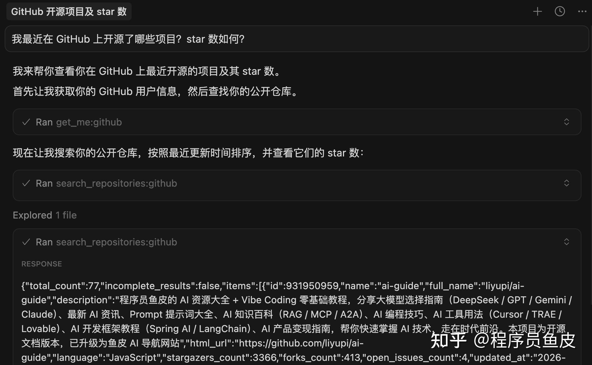

  

它就能快速给我在 GitHub 上的项目生成一份数据报告：

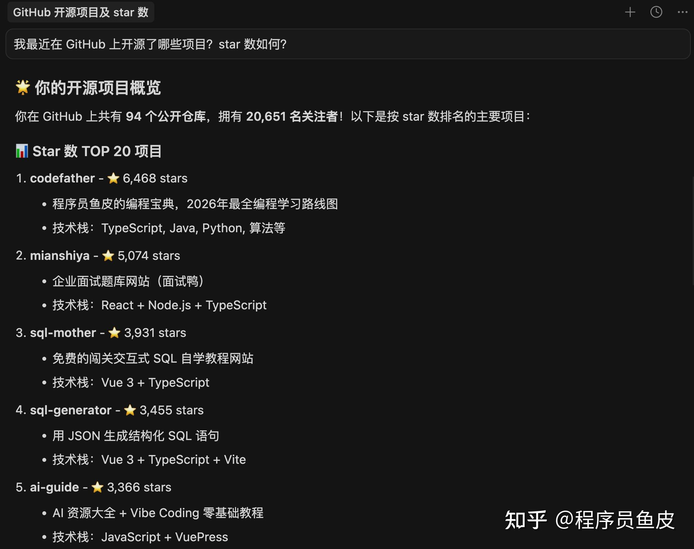

  

或者我说：“帮我看看最近一周的代码变更”，它就能分析 Git 提交记录，告诉我都改了什么。

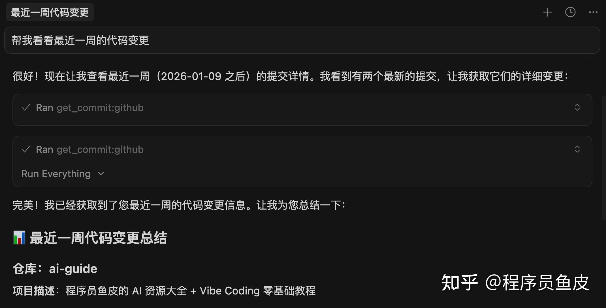

  

**如何使用？**

首先需要在 GitHub 获取到你的 [Access Token](https://link.zhihu.com/?target=https%3A//github.com/settings/tokens)，作为访问你 GitHub 资源的凭证：

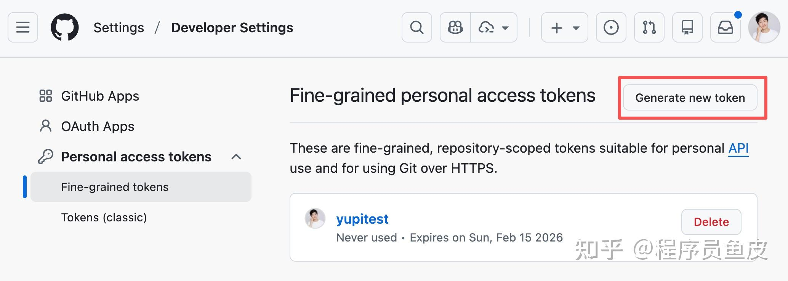

然后在 MCP 配置中添加：

```json
{
 "mcpServers": {
   "github": {
     "url": "https://api.githubcopilot.com/mcp/",
     "headers": {
       "Authorization": "Bearer 你的GitHub凭证"
    }
  }
}
}
```

这个工具还支持代码分析、CI/CD 监控、安全扫描等功能，基本上你在 GitHub 中能做的事，AI 都能帮你做。

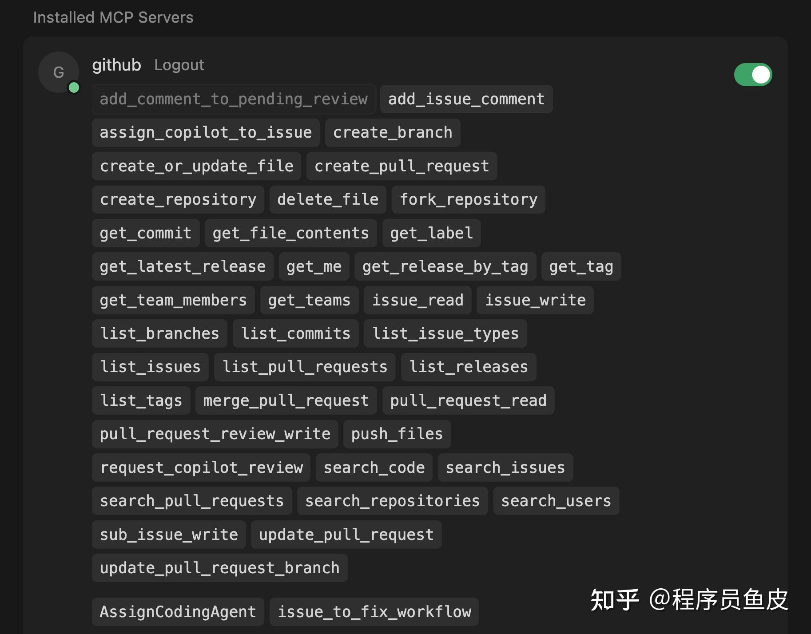

  

## **二、IDE 扩展插件类**

MCP 服务器讲完了，接下来聊聊 IDE 扩展插件。

IDE 就是集成开发环境，简单理解就是写代码的软件，比如 VS Code、JetBrains IDEA 这些，可以通过安装插件来增强编辑器的能力，让你的开发体验更上一层楼。

值得一提的是，现在很多有图形界面的 AI 编程工具（比如 Cursor）都是基于 VS Code 开发的，自然也支持 VS Code 的插件，所以下面我也主要分享 VS Code 插件，装上就能用。

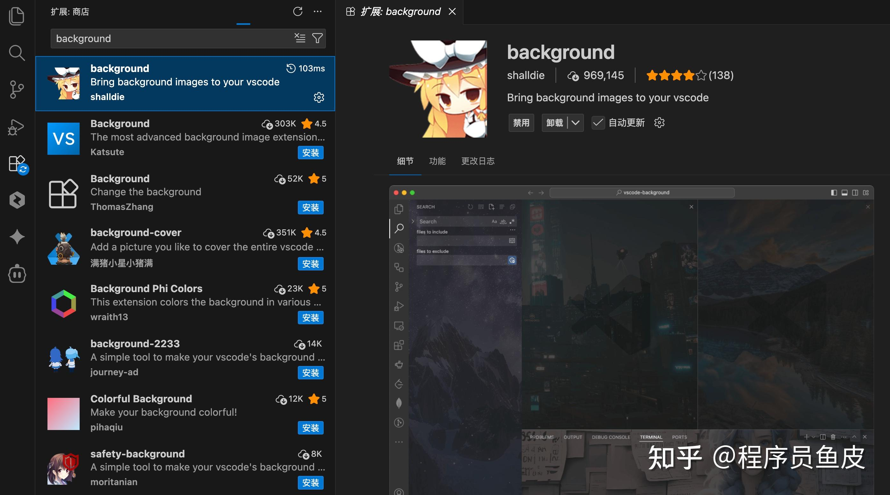

  

### **Claude Code 官方扩展**

Claude Code 是 Anthropic 推出的 AI 编程助手，原本是独立的命令行工具。而 [Claude Code VS Code 扩展](https://link.zhihu.com/?target=https%3A//www.anthropic.com/news/enabling-claude-code-to-work-more-autonomously) 能让你在代码编辑器中直接使用 Claude Code，不用额外打开终端。

在 VS Code 或 Cursor 的扩展商店搜索 "Claude Code" 即可安装：

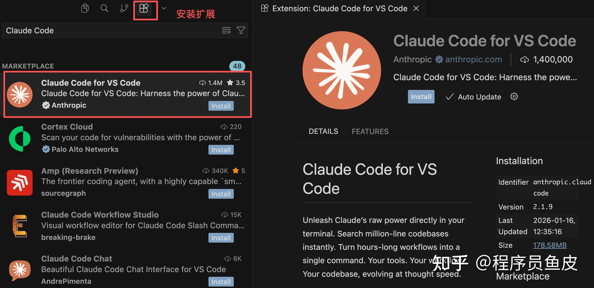

  

这个扩展的优点是提供了图形界面，你可以通过侧边栏面板和 Claude 对话，能够灵活输入文字。

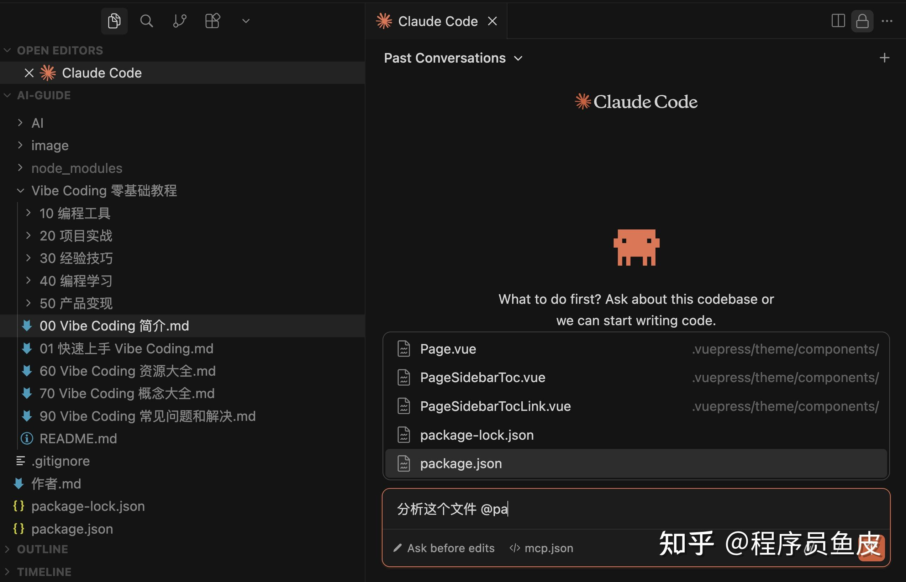

  

当 AI 修改代码时，你能在编辑器里实时看到变化，并且自动显示 diff 对比，让你清楚地知道 AI 改了哪些地方。

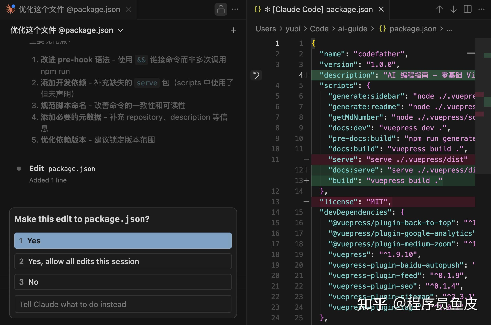

  

我经常用它来重构代码、修复 Bug、添加新功能。它还支持多会话并行，也就是说你可以同时让多个 Claude 代理处理不同的任务，比如一个负责前端，一个负责后端，大大提高开发效率。

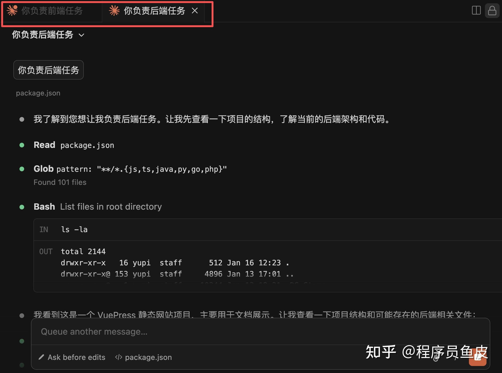

  

顺带一提，类似的插件还有 Cline、GitHub Copilot 等，功能都差不多，大家可以根据自己的喜好选择。

  

### **GitLens Git 可视化**

[GitLens](https://link.zhihu.com/?target=https%3A//www.gitkraken.com/gitlens) 能让你更直观地查看 Git 代码的修改历史。

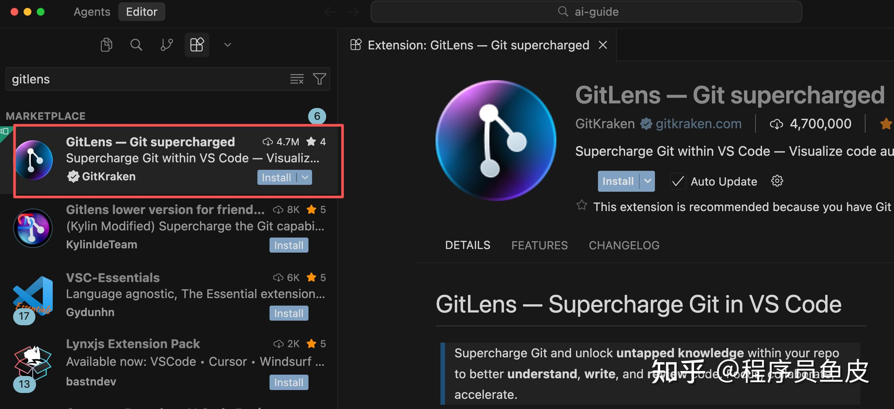

  

Git 是程序员用来管理代码版本的工具，简单理解就是能记录代码的每一次修改，包括谁改的、什么时候改的、为什么改。

有了这些记录，出了 Bug 时我就能快速找到 “凶手” 追责。

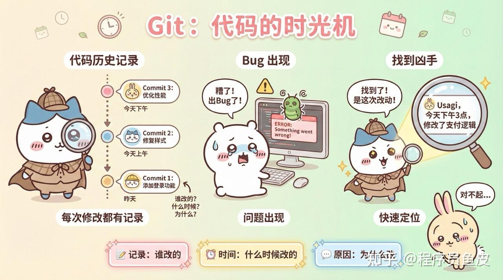

但 Git 只是个命令行工具，想查看历史记录还需要手敲命令，看起来也不太舒服。

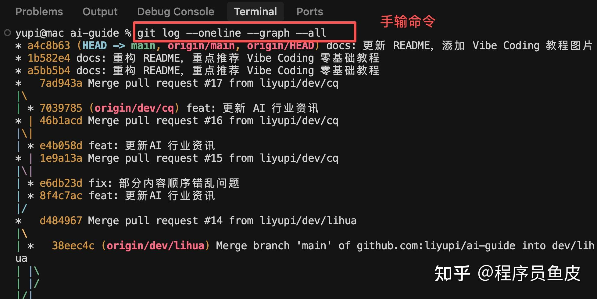

  

当我通过编辑器的扩展商店安装了 GitLens 后，把鼠标放到任意代码行上，GitLens 就会自动显示这行代码的作者、相关的 PR 合并请求等等。

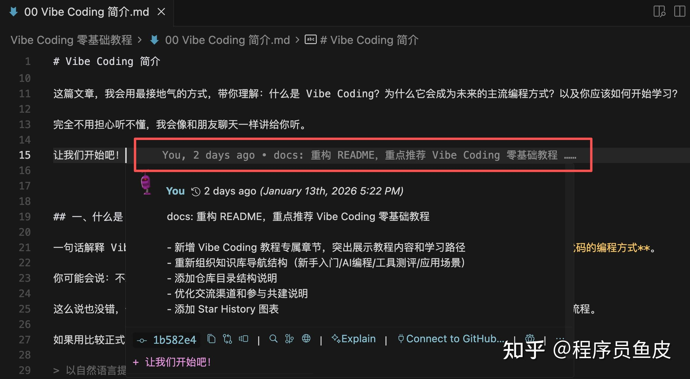

  

进入 Git 管理面板，整个项目的提交记录一目了然。

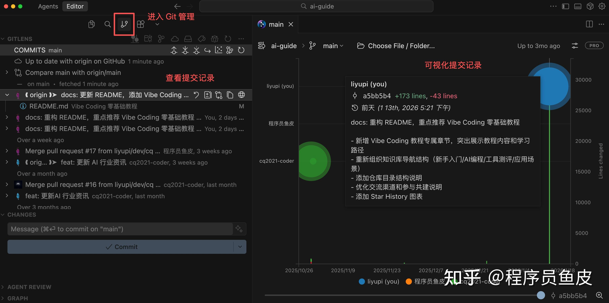

  

此外，它还支持 AI 功能，能自动生成提交信息、解释代码变更、生成变更日志、用 AI 解释某次改动的目的。

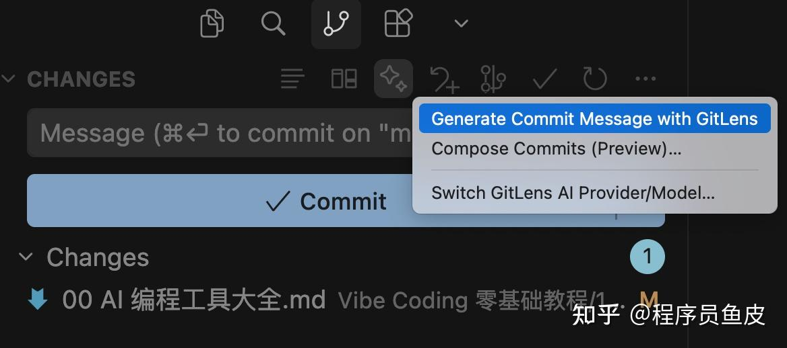

  

### **⭐️ Office Viewer 文档预览**

[Office Viewer](https://link.zhihu.com/?target=https%3A//github.com/cweijan/vscode-office) 能帮你在编辑器里直接预览和编辑各种文档。

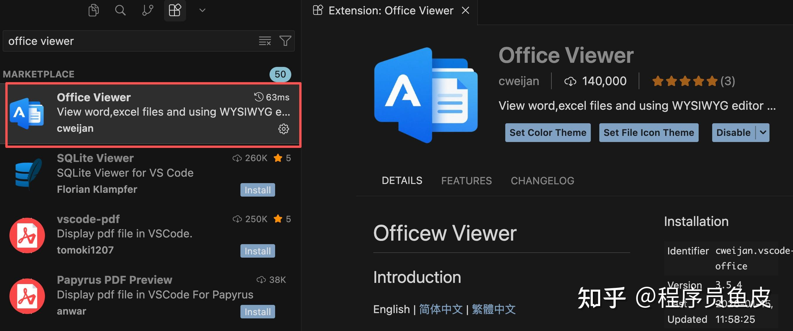

  

我们知道，AI 输出的文档内容以 Markdown 格式为主，默认的编辑器中打开 Markdown 文件只能看到原始的标记语法，不够直观。

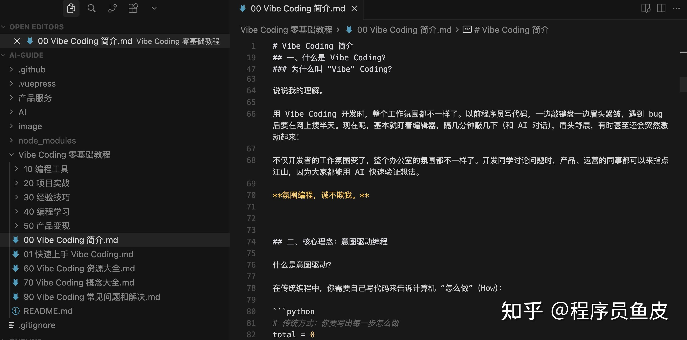

  

看长文的时候，我还要用 Typora 等专业的 Markdown 编辑器打开文档，比较麻烦。

在扩展商店搜索 "Office Viewer" 并安装后，可以直接在编辑器中使用所见即所得的 Markdown 编辑器，看文档、写文档都很方便，不用来回切换窗口。

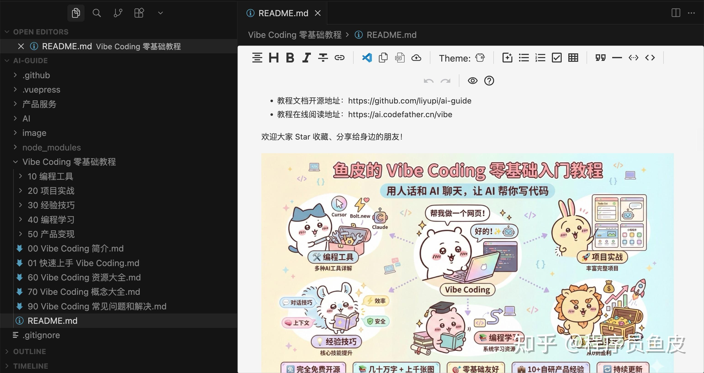

  

此外，这个插件支持 Excel 表格、Word 文档、PDF 文档、SVG、字体文件、压缩包等多种格式，堪称编辑器里的万能文档查看器。

  

### **⭐️ ESLint 代码质量检查**

[ESLint](https://link.zhihu.com/?target=https%3A//eslint.org/) 是前端 JavaScript / TypeScript 项目必备的代码检查工具。

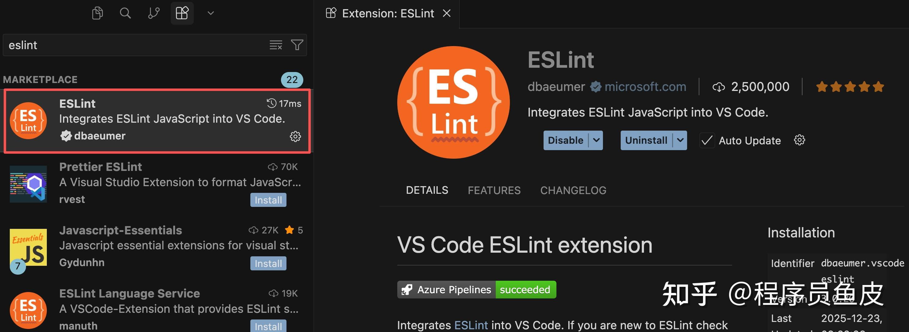

  

虽然编辑器本身也能检查一些基本的语法错误，但对于代码规范、潜在的逻辑漏洞等问题，就需要专业的代码检查工具来把关了。

现在很多 AI 生成的项目代码都会自带 ESLint 配置文件（比如 `.eslintrc.js` 或者 `eslint.config.js`），定义好团队统一的代码检查规则。


  

在扩展商店搜索 "ESLint" 并安装后，插件会自动检测项目中的规则配置文件，然后实时检查代码中的问题，并给出修复建议。


  

这样一来，AI 写的代码如果有不规范的地方，你立刻就能发现并让 AI 修正，避免埋下隐患。

  

### **⭐️ Prettier 代码格式化**

[Prettier](https://link.zhihu.com/?target=https%3A//prettier.io/) 是一个代码格式化工具，能自动统一代码风格。


  

团队协作时，每个人的编码习惯不同，有的代码缩进 4 格、有的缩进 2 格；有的用单引号、有的用双引号。大家的代码风格五花八门，看着就很乱，代码审查时也容易出现 Beef。

这时就需要统一的格式化规范了。现在很多 AI 生成的项目代码都会自带 Prettier 配置文件（比如 `.prettierrc`），定义好统一的格式化规则。


  

在扩展商店搜索 "Prettier" 并安装后，就可以用快捷键一键格式化代码。


  

还可以在 VS Code 的设置里搜索 "Format On Save" 并开启，这样每次保存代码时就会自动格式化，保证整个项目的代码风格一致。


  

  

### **Error Lens 错误实时显示**

[Error Lens](https://link.zhihu.com/?target=https%3A//github.com/usernamehw/vscode-error-lens) 能让你一眼看到代码中的错误。


  

一般情况下，如果代码中有错误，你得把鼠标移到红色波浪线上才能看到错误提示，不够直观。


在扩展商店搜索 "Error Lens" 并安装后，错误信息会直接高亮显示在代码行尾，你一眼就能看到哪里有问题。


  

### **Console Ninja 控制台日志显示**

[Console Ninja](https://link.zhihu.com/?target=https%3A//github.com/wallabyjs/console-ninja) 能让你在编辑器里直接看到代码的运行结果。


  

在调试前端代码时，我经常需要看 `console.log` 打印出来的日志输出。要先切换到浏览器，再按 F12 打开开发者工具来查看控制台，比较麻烦。


  

在扩展商店搜索 "Console Ninja" 并安装后，直接在编辑器里就能看到输出结果，看到每个日志是从哪个文件哪一行输出的，还能显示网络请求和错误堆栈。


有了它，不用频繁切换窗口了，调试效率大大提升。

  

## **三、跨编辑器通用工具**

前面介绍的工具都是对编辑器能力的增强，接下来聊聊跨编辑器通用的工具。这些工具不依赖特定的编辑器，适用于 Cursor、VS Code、Claude Code、GitHub Copilot 等几乎所有主流的 AI 编程工具。

  

### **Spec-kit 规范驱动开发**

[Spec-kit](https://link.zhihu.com/?target=https%3A//speckit.org/) 是 GitHub 推出的规范驱动开发（SDD）框架。

什么是 SDD 呢？

传统开发流程是：想到什么写什么，边写边改，最后再补文档。这样容易导致需求不清晰、代码和文档对不上。

而规范驱动开发的思路正好相反：先把需求写成规范文档，并且把规范文档当作代码的 **唯一真相来源**。你可以把规范文档理解为 **法律条文**，它包含了详细的需求描述、系统设计和接口定义。AI 必须严格遵守这些条文来生成代码，确保产出完全符合预期。


  

  

听起来有些抽象，我们可以跟着 [Spec-kit GitHub 仓库](https://link.zhihu.com/?target=https%3A//github.com/github/spec-kit) 的官方文档来实战一下。

首先打开终端，利用 uvx 命令直接安装运行 Specify 工具，并初始化一个项目：

```bash
uvx --from git+https://github.com/github/spec-kit.git specify init my-project
```


选择你使用的 AI 编程工具，Spec-kit 支持 Claude Code、GitHub Copilot 等几乎所有主流编程工具。这里我选 Claude Code：


  

根据操作系统选择脚本类型，Windows 选下面的，其他选上面的：


  

执行完这个命令后，会在当前目录下创建一个 `my-project` 文件夹：


文件夹里面包含了这些核心文件：

-   `.specify/memory/constitution.md`：项目的基本准则和约定
-   `.specify/scripts/`：一些可执行脚本
-   `.specify/templates/`：模板文件
-   `.claude/commands/`：定义了一套内置的斜杠命令，让你在 AI 编程工具中可以直接调用


初始化程序还给了我们一些指引，告诉我们接下来如何运用这些命令来开发项目。


用 Claude Code 打开这个项目文件夹，就可以在对话中使用定义好的命令了。


接下来就是标准化的开发流程，参考 [官方文档](https://link.zhihu.com/?target=https%3A//github.com/github/spec-kit)，主要分为 7 个步骤：

1）Constitution 制定项目准则

运行 `/speckit.constitution` 命令，定义项目的基本原则、代码规范、性能标准等。这是项目的 “宪法”，后续所有开发都要遵守。

比如：

```text
/speckit.constitution 禁止使用蓝紫渐变色风格的 UI
```

如果你要做中文项目，最好在制定项目准则时就明确告诉 AI “整个网站使用中文”。


  

AI 更新了项目准则文档：


  

建议每一步我们都用 Git 提交一个版本，这样出了问题后能及时回滚，也便于我们看到每一步改动的文件。


  

2）Specify 编写功能规范

运行 `/speckit.specify` 命令，描述要做什么功能、为什么做、用户需求是什么。比如：

```text
/speckit.specify 我想做个【自动提醒我喝水的网站】
```


  

AI 为这次的需求创建了一个新的 Git 分支，防止污染现有项目。在这个分支下创建了一个需求规格文档（spec.md） + 一个需求检查文档（requirements.md）。


需求规格文档非常详细，还包含了边缘测试用例，针对用户各种可能的操作进行处理。


需求检查文档中记录了 AI 对于需求的理解，打钩表示 AI 理解并确认了：


  

3）Clarify 澄清不明确的地方（可选）

如果你发现需求检查文档中有的条目没有打钩，那你需要通过 Clarify 命令来让 AI 引导你进一步明确需求，直到所有的条目都打上勾。

运行 `/speckit.clarify` 命令，AI 会提出结构化的问题，让你来回答。从而帮你填补需求中的空白，比如边界情况、错误处理等。


我运气不错，不需要这一步 AI 就已经理解了所有条目，接下来可以进入制定技术方案阶段。


  

4）Plan 制定技术方案

运行 `/speckit.plan` 命令，让 AI 决定用什么技术栈、系统架构、数据模型、API 接口等。


制定技术方案完成，这次生成了一大堆文档，简单了解一下：

-   CLAUDE.md 项目开发指南，记录技术栈和项目结构，用于指导 Claude Code 接下来如何开发
-   quickstart.md 快速入门指南，包含 6 个实施阶段和部署方案
-   plan.md 实施方案，定义了纯客户端架构、存储策略、宪法合规性检查等
-   data-model.md 数据模型设计，定义了 4 个核心实体（提醒设置、水量日志、每日进度、历史记录）和存储结构
-   research.md 技术研究文档，记录了 8 项关键技术决策
-   contracts/api-contract.md API 接口文档


接下来，我们就可以准备开发实现了。


5）Tasks 拆解任务

运行 `/speckit.tasks` 命令，把计划拆解成可执行的任务列表，并标注依赖关系和优先级。


  

生成了一个任务列表文档，每一步要做什么都非常清晰：


  

6）Analyze 分析检查（可选）

运行 `/speckit.analyze` 命令，检查规范、计划、任务是否完整一致，提前发现设计缺陷。


可以看到，AI 没有检查出问题，还让我自信地进行下一步，真爽死了！

  

7）Implement 执行实现

最后，运行 `/speckit.implement` 命令，让 AI 按照任务列表生成代码。


  

大功告成，看一下效果~


  

因为我这里始终没有提到使用中文输出，所以网站内容都是英文的，不过我感觉效果还可以。

到这里，我们已经学会了如何用 Spec-kit 开发完整项目，再复习一下完整流程：


即使不用 Spec-kit，我们开发完整项目时也可以人工遵循这些步骤。

这种模式最大的好处是 **对齐**。所有人都基于同一份清晰的规范文档工作，大家对需求的理解高度一致，既减少了沟通中的误解，又能确保代码质量。

不过缺点也很明显，对于小项目，本来直接写代码几分钟就能搞定了，上面这套流程走下来差不多要半个小时！

所以这套流程比较适合团队从 0 开始做完整的新项目，虽然流程比直接写代码慢一些，但能大大降低返工的风险，长远来看反而更高效。

  

### **OpenSpec 轻量规范框架**

[OpenSpec](https://link.zhihu.com/?target=https%3A//openspec.dev/) 是一个轻量的规范驱动开发框架，比 Spec-kit 更简单易用。

它的核心理念是把规范文档作为代码库的一部分，每次改功能都 **先写变更提案** => 确认后再实现 => 实现完再把变更归档到规范文档中，让文档和代码始终保持同步。


访问 [OpenSpec 官方仓库](https://link.zhihu.com/?target=https%3A//github.com/Fission-AI/OpenSpec/) 查看文档。

首先确保你的电脑安装了符合要求的 Node.js 版本（比如我这里要求 Node.js >= 20.19.0），然后全局安装 OpenSpec CLI：

```bash
npm install -g @fission-ai/openspec@latest
```

进入你的项目目录，运行初始化命令：

```bash
openspec init
```

初始化过程中会让你选择要集成的 AI 工具（比如 Claude Code、Cursor 等），我这里选择 Cursor。


运行命令后，OpenSpec 会自动在你的项目中生成一个 `openspec/` 目录，里面包含：

-   `openspec/specs/`：存放主规范文档，记录了项目的完整现状
-   `openspec/changes/`：存放变更提案，记录了每次修改的计划
-   ⭐️ `openspec/AGENTS.md`：让 AI 编程助手使用 OpenSpec 进行规范驱动开发的操作指南，包含了如何创建变更提案、编写需求规范、验证和归档变更的完整工作流程。
-   `openspec/project.md`：当前项目的上下文说明（用来记录项目的信息）


此外，还会根据你选择的 AI 编程工具，生成对应的命令文件，比如 Cursor 的：


有了这些文件，我们就可以开始规范化的开发流程了。参考 [官方文档](https://link.zhihu.com/?target=https%3A//github.com/Fission-AI/OpenSpec/)，主要分为 5 个步骤：

1）Draft 起草变更提案

直接在 AI 编程工具中跟 AI 说，让它创建变更提案。比如我想添加用户搜索功能：

```text
创建一个 OpenSpec 的 change，添加功能：根据名称和邮箱搜索用户
```

也可以用 AI 编程工具（比如 Claude Code、Cursor）的斜杠命令：

```text
/openspec:proposal 添加功能：根据名称和邮箱搜索用户
```


  

AI 会给这个功能创建一个独立的目录 `openspec/changes/add-user-search/`，目录下创建一系列文档：

-   `proposal.md`：描述要改什么、为什么改
-   `tasks.md`：实施步骤的任务分解
-   `specs/…/spec.md`：需求变更的具体内容


2）Verify & Review 验证和审查

可以运行下列命令，查看 AI 创建的变更提案是否正确：

```bash
openspec list                        # 查看所有变更
openspec validate add-user-search    # 验证格式是否正确
openspec show add-user-search        # 查看详细内容
```


3）和团队一起审查提案

如果需要完善，可以继续跟 AI 对话，比如：

```text
你能帮我添加更多搜索条件和限制么？
```

AI 会更新规范和任务列表，直到大家达成一致。

  

4）Implement 实现变更

规范确认后，让 AI 开始实现：

```text
规范已经很完美了，开始生成代码吧
```

也可以用斜杠命令：

```text
/openspec:apply add-user-search
```

AI 会按照 `tasks.md` 中的任务列表逐一实现，并标记完成状态。


很快生成完成，AI 的输出非常整齐，所有改动一目了然：


  

5）Archive 归档变更

所有任务完成后，让 AI 归档这次变更：

```text
请归档这次变更
```

也可以用斜杠命令：

```text
/openspec:archive add-user-search
```

或者在终端运行：

```bash
openspec archive add-user-search --yes
```


这个命令会：

-   将变更文件夹移动到 `openspec/changes/archive/` 归档区
-   将需求变更自动合并到 `openspec/specs/` 主规范中
-   保持文档和代码的同步


这样一来，通过 `openspec/changes/` 的历史记录，你可以随时追溯每次变更的来龙去脉。

此外，整个开发过程中，建议大家定期运行 `openspec validate` 验证命令， 确保规范的完整性。

* * *

到这里，相信大家也能感受到 OpenSpec 和 Spec-kit 的区别了。

-   Spec-kit 需要完整的 7 步流程：制定准则 → 写需求 → 澄清疑问 → 定方案 → 拆任务 → 检查 → 写代码），适合从 0 开始做大型新项目
-   OpenSpec 的流程更简化：起草提案 → 审查 → 实现 → 归档 → 验证，上手更快，适合在现有项目上迭代功能。

  

### **⭐️ Agent Skills 通用 AI 技能库**

[Agent Skills](https://link.zhihu.com/?target=https%3A//claude.com/blog/skills) 是 Anthropic 新推出的 AI 技能系统。

它定义了一种 **封装 AI 工作流** 的标准：开发者可以把复杂的任务指令、脚本和资源打包成一个 **技能（Skill）**；作为用户，你只需要安装这些技能，AI 就能立刻学会这项本事，不用重复造轮子。


让我们来实战一下，利用 [frontend-design](https://link.zhihu.com/?target=https%3A//www.claudeskill.site/en/skills/anthropic-agent-skills%3Afrontend-design) 这个 Agent Skills 来优化生成网站的界面。

1）安装 Agent Skills

首先打开 Claude Code，输入一行命令，把官方提供的 Skills 注册为插件市场：

```text
/plugin marketplace add anthropics/skills
```


然后输入 `/plugin`，通过 Tab 键切换到 Marketplaces 界面，批量安装官方提供的 Skills。包括：

-   document-skills：文档技能包，可以处理 Excel、Word、PPT、PDF 等文档。
-   example-skills：示例技能包 ，可以处理技能创建、构建 MCP、视觉设计、算法艺术、网页测试、动图制作、主题样式等。


安装好之后，输入 `/skills` 命令，就能看到所有已经安装完成的技能了，我们要的 `frontend-design` 也在其中。


  

可以在本地找到 Skills 的安装位置，你会发现，SKills 的本质就是一组封装好的提示词文档 + 脚本文件等：


  

还有另外一种安装方式，也可以在 Claude Code 中输入一行命令来安装 [frontend-design](https://link.zhihu.com/?target=https%3A//www.claudeskill.site/en/skills/anthropic-agent-skills%3Afrontend-design) 技能。

```text
skill install anthropic-agent-skills:frontend-design
```

  

2）安装完 SKills 后，你只需要和之前一样跟 AI 对话，程序会自动根据你的任务选择使用什么 Skills。

比如我让 AI 开发一个精美的狼人杀网页游戏，它会询问我是否要使用 `frontend-design` 技能。


使用这个技能后，AI 会选择独特的设计风格，生成的界面既有个性又专业，告别千篇一律的蓝紫渐变色。而且不需要你每次都重复输入一堆设计要求，非常方便！


  

不用技能是这样的，对比一下：


目前 [Anthropic 官方技能仓库](https://link.zhihu.com/?target=https%3A//github.com/anthropics/skills) 已经提供了丰富的技能集合，涵盖编程相关的数据库优化、API 安全、测试策略、代码审查、文档生成，还有办公相关的 PPT 制作、Excel 处理、Word 文档、PDF 生成等各个方面。

如果官方提供的技能不够用，你还可以上传自定义技能，或者访问 [Claude Skills Hub](https://link.zhihu.com/?target=https%3A//www.claudeskill.site/) 下载社区贡献的技能。


值得一提的是，Agent Skills 现已成为 [通用标准](https://link.zhihu.com/?target=https%3A//agentskills.io/)。除了 Claude，[Cursor](https://link.zhihu.com/?target=https%3A//cursor.com/docs/context/skills) 等主流 AI 编程工具也会陆续提供支持。也就是说，你在一个工具里用的技能，在另一个工具里也能复用。

  

### **Superpowers 核心技能库**

[Superpowers](https://link.zhihu.com/?target=https%3A//github.com/obra/superpowers) 是一套让 AI 编程助手变得更专业的 **软件开发流程**。它不仅为 Claude Code 提供了一套可组合的 **编程技能包**，还提供了规范和指令，确保 AI 能够正确使用这些技能。

传统的 AI 编程，你一说需求它就开始噼里啪啦地写，结果可能并不是你想要的。而装了 Superpowers 之后，AI 会先问清楚你到底想做什么，然后出设计方案让你确认，接着制定详细的执行计划，最后才分步骤去实现，每一步还会自我检查。

就像给一个刚进公司啥都不懂的 AI 加上了超能力，瞬间让它有了专业程序员的开发习惯。


  

**如何使用？**

参考 [Superpowers 官方文档](https://link.zhihu.com/?target=https%3A//github.com/obra/superpowers)，在 Claude Code 中运行以下命令安装。

先注册市场：

```bash
/plugin marketplace add obra/superpowers-marketplace
```


  

再从市场安装插件：

```bash
/plugin install superpowers@superpowers-marketplace
```


安装后运行 `/help` 查看可用命令，你会看到这 3 个命令

-   `/superpowers:brainstorm` 通过和用户交互来不断改进设计
-   `/superpowers:write-plan` 创建实现方案
-   `/superpowers:execute-plan` 批量执行方案


下面以开发一个 “用户注册模块” 为例，演示 Superpowers 官方的标准工作流程。

首先，在终端中运行 `claude` 命令来启动 Claude Code，然后按照下面的 7 个步骤操作：

1）Brainstorming 头脑风暴 => 对齐需求

选择 `/superpowers:brainstorm` 命令并输入需求：


Superpowers 不会急着写代码，而是先通过多轮问答和你对齐需求，比如：

-   用户注册模块的主要场景是什么？
-   希望支持哪些注册方式？


通过交互问答，AI 会探索不同方案、不断改进设计。


当需求和方案确认无误后，它会自动将详细的设计文档保存到 `docs/plans/` 目录。


  

2）Using Git Worktrees 创建独立工作空间（可选）

设计方案通过后，Superpowers 会帮你创建一个 Git 工作树（worktree），在新分支上建立隔离的工作空间，运行项目初始化，并验证测试基线是否干净。这样可以避免污染主分支。

这一步是可选的，我这里直接让 AI 继续执行，看看会发生什么：


3）Writing Plans 制定实施计划

运行 `/superpowers:write-plan` 命令，让 Superpowers 生成一份详细的实施计划，把开发任务拆解成多个原子级步骤（每个任务控制在 2 ~ 5 分钟）。

我这里 AI 直接自动执行了，省了一步命令~


查看 AI 生成的实施计划文档，每个任务都包含：

-   精确的文件路径
-   完整的代码内容
-   验证步骤


好家伙，这哪里是实施计划文档啊，感觉大多数代码都写出来了！


  

4）执行任务

运行 `/superpowers:execute-plan` 命令，Superpowers 会采用以下方式之一执行：

-   子代理驱动开发（Subagent-Driven Development）：为每个任务分配一个全新的子代理，经过两阶段审查（规范合规性检查 + 代码质量检查）
-   批量执行（Executing Plans）：分批执行任务，在关键节点暂停让人工检查

我这里 AI 直接问我想要哪种方式：


  

我盲选一手 Subagent-Driven 方式，AI 自动选择了对应的开发技能：


  

然后 AI 就开始干活了：


  

5）Test-Driven Development 测试驱动开发

在实现过程中，Superpowers 会强制执行 `红-绿-重构` 流程：

-   先写失败的测试
-   运行测试，确认失败
-   写最小化的代码让测试通过
-   运行测试，确认通过
-   提交代码


如果发现有代码是在测试之前写的，Superpowers 会删除它，强制你先写测试。

  

6）Code Review 代码审查

每完成一批任务后，Superpowers 会自动触发代码审查，对照计划检查代码，按严重程度报告问题。如果发现严重问题（Critical），会阻止继续进行。


  

7）完成开发

所有任务完成后，Superpowers 会验证所有测试是否通过：


然后 AI 可能会提供几个选项，比如合并到主分支 / 创建 PR / 保留分支 / 丢弃更改。

如果你确定功能没有问题，可以利用 Superpowers 内置的技能来完成开发分支的清理工作。

* * *

这套 “先设计后编码” 的规范流程走下来，代码质量会更有保障，不过代价就是速度确实比让 AI 直接生成代码会慢很多。真的是慢很多！就这么个需求我搞了半个多小时！！！


如果你正在开发大型项目，需要团队协作，那么可以试试 Superpowers，前期多花的时间会在后期省回来。但是如果你只是想写个简单的脚本或者快速验证一个想法，用它就有点儿牛刀杀鸡了，真没必要。

  

### **AIChat 命令行增强工具**

[AIChat](https://link.zhihu.com/?target=https%3A//github.com/sigoden/aichat) 是一个功能完善的 AI 命令行助手，集成了 20+ 主流大模型。

现在主流的 AI 编程工具（Cursor、VS Code 等）都内置了终端，有时我们需要敲命令来执行任务，但是命令记不住怎么办？

用了 AIChat 后，你只需要在终端中说人话，它的 **Shell 助手** 能力就会把你的自然语言自动转换成准确可执行的命令。

使用方法非常简单。打开终端，通过包管理器一行命令就能安装：

```bash
# macOS/Linux
brew install aichat
​
# Windows
scoop install aichat
```

安装完成后，运行 `aichat` 命令，首次执行会引导你创建配置，选择你要用的大模型并填写 API Key：


然后就可以愉快地跟 AI 对话了：


但是我个人主要用它的 Shell 助手能力（给命令添加 `-e` 选项），而不是 AI 对话能力。


比如我想批量重命名文件，但不记得命令怎么写，在终端里执行下列命令：

```text
aichat -e 帮我把当前目录下所有 .txt 文件改成 .md
```

它就会生成对应的 shell 命令，我确认后它就自动执行了。


还可以通过快捷键来智能补全命令：


除了 Shell 助手，AIChat 还有一些进阶功能。比如支持 RAG 检索增强生成，可以让 AI 基于你的本地文档回答问题；支持创建 AI 代理，把指令、工具和文档组合成自动化工作流。


此外，如果你想对比不同模型的效果，运行 `aichat --serve` 可以启动本地网页界面，同时对比多个模型的回答。


  

## **最后**

OK，以上就是我推荐的 AI 编程扩展，其中标星 ⭐️ 的是我强烈建议安装的，其他的你可以按需选择安装。

后续我会深入介绍其中部分扩展的高级用法和实战技巧。如果本期内容对你有帮助，记得点赞收藏三连，欢迎关注鱼皮，不错过更多 AI 编程干货。

这篇文章的文字版我同步到了 [鱼皮的 AI 导航网站](https://link.zhihu.com/?target=https%3A//ai.codefather.cn/)，在这里你还可以获取到更多免费的 AI 学习资源、全面的 AI 工具、最新 AI 资讯等等。

也欢迎在评论区分享你在用的 AI 编程工具，一起进步吧！

  

## **更多**

编程学习交流：编程导航：[编程导航 - 程序员一站式编程学习交流社区，做您编程学习路上的导航员](https://link.zhihu.com/?target=https%3A//www.codefather.cn/)

简历快速制作：老鱼简历：[https://laoyujianli.com](https://link.zhihu.com/?target=https%3A//laoyujianli.com/)

✏️ 面试刷题神器：面试鸭：[https://mianshiya.com](https://link.zhihu.com/?target=https%3A//mianshiya.com/)

AI 学习指南：AI知识库：[鱼皮AI导航｜AI工具提示词大全 - 专业学习资源资讯知识库](https://link.zhihu.com/?target=https%3A//ai.codefather.cn/)