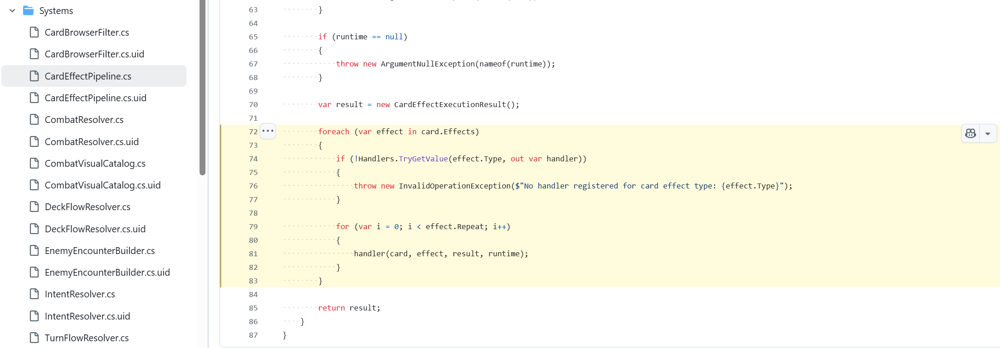
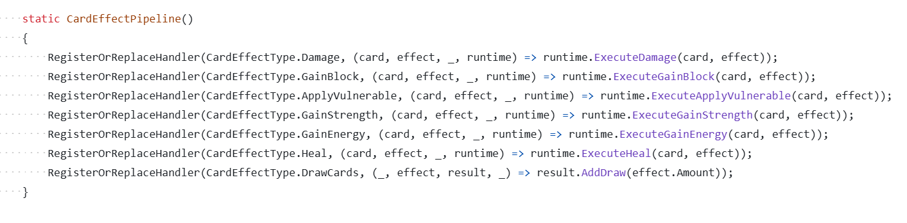

神特么游戏逻辑已经有了，填充素材就能起飞了。

求求你们开发点商业游戏吧，再不济去玩玩 RPG Maker，游戏逻辑和游戏差十万八千里。

* * *

而且我研究了一下源码，这个 demo 连游戏逻辑都不对，作为卡牌游戏框架也是不合格的。

一般我不建议立项卡牌游戏，先不说商业上怎么包装，技术上就有很多的坑。

CCG/DBG 的开发难度在所有游戏类别里是 T0 噩梦级别的，因为你写到最后会发现自己在写虚拟机解释器。

* * *

如果你想做《杀戮尖塔》、《万智牌》、《游戏王》这种强时序逻辑的游戏，框架底层一般要基于结算栈和状态机。

而 [slay-the-hs/CardEffectPipeline.cs#L72-L83](https://link.zhihu.com/?target=https%3A//github.com/frankqwang/slay-the-hs/blob/9001e3a9a5699d902755c42b16329e86eb0c8e7e/Scripts/Systems/CardEffectPipeline.cs%23L72-L83) 直接令人眼前一黑：

简单地说，卡牌游戏的结算绝对不能是线性逻辑，因为任何一个效果执行都会衍生出无数的挂起和中断事件。

所有的挂起和中断会构成一颗事件树，有各自的一大堆触发条件相互覆盖判定，你禁我，我禁你。

而且这个离谱的调用栈可以无限组合无限延申，简单的 `foreach` 根本处理不了这种深度嵌套的动态树状结算流。

所以，卡牌游戏中，每一个 `effect` 都必须被包装成一个 `ICommand` 对象压入一个全局的 `ResolutionStack` 中。

遇到触发器，就把新的 `Command` 压入栈顶，优先结算栈顶，这样才能正确处理带连环触发的遗物。

* * *

然后是典中典之 enum 驱动 effects：

每个机制单独写一套触发，当游戏卡牌达到上百张时，你就会拥有一千个 `if-else` 拼成的上万行的 `CardEffectPipeline.cs`。

为了避免派发爆炸，正确的处理方式是写一套 DSL，底层只提供 `DealDamage`, `DrawCard` 这种原子指令。

* * *

此时再和上面的结算栈结合，恭喜你，你获得了一个虚拟机。

现在，开始为你的卡牌游戏编写解释器吧！

* * *

最后还有各种结算函数里等动画的妙妙逻辑我就懒得说了。

用的什么 AI 连逻辑和表现要分离都不知道？

不过，这些不是底层框架问题，你只要说什么情况下卡了就行，这个 AI 还是很好修的。

此类问题暂且不论。

* * *

然后还有暂时没写出来，但是卡牌游戏一定会遇到的 Buff 优先级判定问题。

这个要定义一堆 Hooks，统称 MBF （Modifier Based Framework），这个东西非常难写。

然后还有 Snapshot，如果你有卡牌允许回到某个状态，这就要求你的虚拟机支持一些纯函数式特性以支持 Rollback 和 Redo。

组合性这东西不是闹着玩的，底层框架要保证无论遭遇多么离谱的组合都能判定的出来。

这种逻辑必须通过顶层设计才能保证完备，靠人工把一个个 bug 发给 AI 去 adhoc 的修复是修不完的。

这就是外行用 AI 最大的问题，从根源上就注定了这楼盖着盖着就会塌。

* * *

当然你可以把我写的这几点发给 AI 写一个稍微好一点的卡牌游戏底层架构。

但是解决了这些架构问题也只是万里长征一小步，只能说得到了一个还算可以的卡牌游戏框架。

游戏框架只是游戏这座大楼的地基罢了，后面盖楼会遇到的各种问题可比浇筑地基难多了。

烂尾楼和商品房远看确实差不多。

可你花了商品房的钱，住进去才发现是烂尾楼。

这就是 AI 游戏现状。