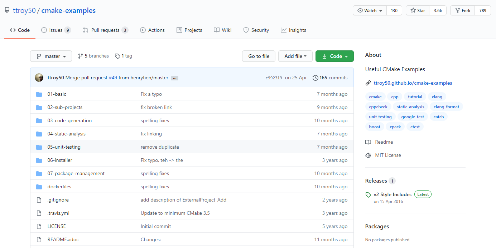
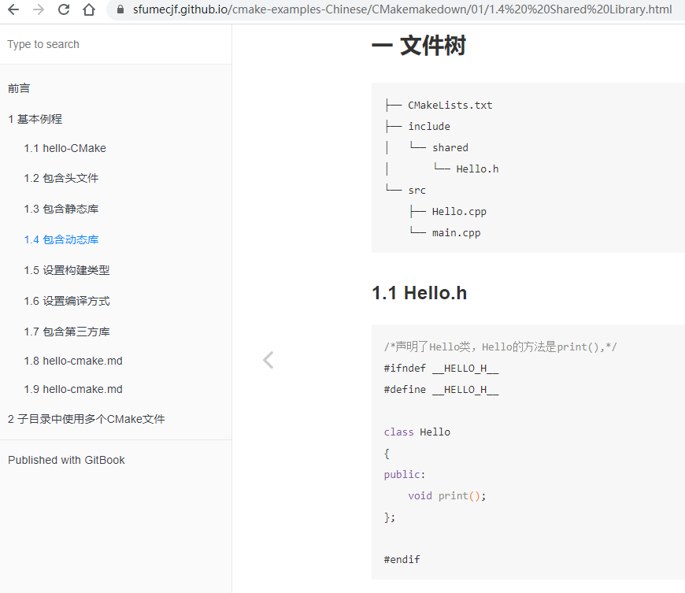

更新：仓库受到的关注度越来越高，考虑到大家学习容易出现问题，现在创建一个CMake的qq交流群：**433323162**。微信群可以扫码加入。

* * *

支持这个问题下最高赞答主0xCCCCCCCC的方法。也就是**学习github项目的cmake-examples。**

这个github很全面，从最简单的例子开始举例，并且对命令做了解释。完美契合learning by doing的学习准则。

这个github已经有3.6star了，页面如下：

我在学完01-basic部分之后，已经能够应付自己的一些小项目了，比如robomaster比赛。但是github中B以及后面的例子我不打算看了，因为也许工作中会用到，但是现在不怎么用的话。也会忘掉。

这个github项目CMake-examples是全英文的。我在学习过程中一方面直接在Linux上运行里面的代码，另一方面也看一下其他人对于该项目的注解。比如下面这个github的电子书，就是对camke-examples的中文阐释。

如果有人也想通过cmake-examples学习，可以辅助这个笔记学习，在线电子书截图如下：

* * *

现在24（划掉） 60(划掉）80(划掉)167(划掉)217(划掉)460个star了。

[SFUMECJF/cmake-examples-Chinese](https://link.zhihu.com/?target=https%3A//github.com/SFUMECJF/cmake-examples-Chinese)

  

PS:不知道为什么这两天这个回答收到了好多赞同！感谢！我的其他回答：

[在「网易」工作或实习是一种怎样的体验？](https://www.zhihu.com/question/341648760/answer/1891272827)