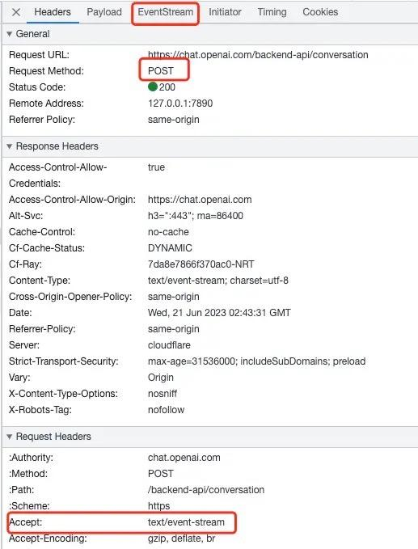

在ChatGPT官网我们可以看到，对话的方式仅仅只有一个`post`请求，而没有使用`IM`中使用的`websocket`链接。

同时我们可以看到与普通的`post`请求不一样的是，返回信息`Response`没有了，取而代之的是`EventStream`。

那么这个`EventStream`是什么东西？

一通查证后，发现这个是Web API中的`EventSource`接口返回的数据。

MDN的官方描述是这样的：

> `EventSource` 接口是 web 内容与服务器发送事件 一个 `EventSource` 实例会对HTTP服务器开启一个持久化的连接，以 `text/event-stream` 格式发送事件，此连接会一直保持开启直到通过调用 `EventSource.close()` 关闭。

好家伙，还有这好东西。是我以前孤陋寡闻了。

经过一番对比，总结了一下 `EventSource` 和 `Websocket` 的区别和优劣：

**EventSource**:

-   优势：

-   简单易用：EventSource API非常简单，易于使用和理解。
-   服务器推送：EventSource适用于服务器主动向客户端推送数据，客户端只能接收服务器发送的事件。
-   自动重连：EventSource会自动处理连接断开和重新连接的情况，适用于长期保持连接并接收事件流的场景。
-   兼容性：EventSource在大多数现代浏览器中得到支持。

-   劣势：

-   单向通信：EventSource只支持从服务器到客户端的单向通信，客户端无法向服务器发送数据。
-   较少的功能：相比于WebSocket，EventSource提供的功能较为有限，仅限于接收服务器发送的事件。

**WebSocket**:

-   优势：

-   双向通信：WebSocket支持双向通信，客户端和服务器可以彼此发送数据。
-   实时性：WebSocket提供了更低的延迟和更快的数据传输速度，适用于实时性要求较高的应用场景。
-   丰富的功能：WebSocket提供了更多的功能，例如数据帧的自定义和二进制数据的传输等。

-   劣势：

-   复杂性：WebSocket API相对于EventSource更为复杂，使用起来可能需要更多的代码和理解。
-   需要服务器支持：使用WebSocket需要服务器端实现对应的WebSocket协议，而EventSource只需要服务器端支持发送事件即可。
-   兼容性：相对于EventSource，WebSocket在某些较旧的浏览器或网络环境中的支持可能不够广泛。

综上所述，`EventSource` 适用于服务器主动推送事件给客户端，并且在保持长期连接和接收事件流时表现良好。 `WebSocket` 适用于需要实时双向通信和更丰富功能的场景，但需要服务器端和客户端都支持 `WebSocket` 协议，选择使用哪种技术应基于具体需求和应用场景进行评估。

那么有了上面的结论我们再来看看，为什么 `ChatGPT`对话为什么不用 `Websocket` 而使用 `EventSource` ？

当然，`ChatGPT` 对话可以使用`Websocket`或`EventSource`进行实时通信，下面是我个人的总结：

1.  服务器推送：`EventSource`专注于服务器向客户端主动推送事件的模型，这对于`ChatGPT`对话非常适用。`ChatGPT`通常是作为一个长期运行的服务，当有新的回复可用时，服务器可以主动推送给客户端，而不需要客户端频繁发送请求。
2.  自动重连和错误处理：`EventSource`具有内置的自动重连机制，它会自动处理连接断开和重新连接的情况。这对于`ChatGPT`对话而言很重要，因为对话可能需要持续一段时间，连接的稳定性很重要。
3.  简单性和易用性：相对于`WebSocket`，`EventSource`的API更加简单易用，只需实例化一个`EventSource`对象，并处理服务器发送的事件即可。这使得开发者可以更快速地实现对话功能，减少了一些复杂性。
4.  广泛的浏览器支持：`EventSource`在大多数现代浏览器中得到广泛支持，包括移动端浏览器。相比之下，`WebSocket`在某些旧版本的浏览器中可能不被完全支持，需要考虑兼容性问题。

需要注意的是，`WebSocket`也是一种很好的选择，特别是当需要实现更复杂的实时双向通信、自定义协议等功能时，或者对浏览器的兼容性要求较高时。最终选择使用`WebSocket`还是`EventSource`应该根据具体的项目需求和技术考虑来确定。

### 2023-08-29更新：

家人们，是我的失误。我原本以为`EventSource`是通过POST发起请求的，但是实际上`EventSource`只支持GET请求。ChatGPT是通过自己重写方法来发起POST请求的，这是我基于Eventsource写的chatgpt的网站，支持gpt4，gpt3.5，如下：

[https://ai.douresources.com](https://link.zhihu.com/?target=https%3A//ai.douresources.com/)