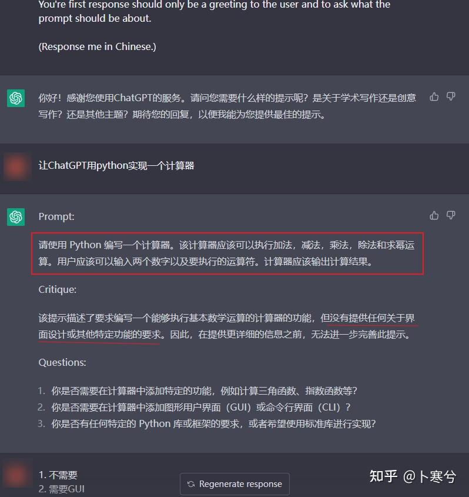
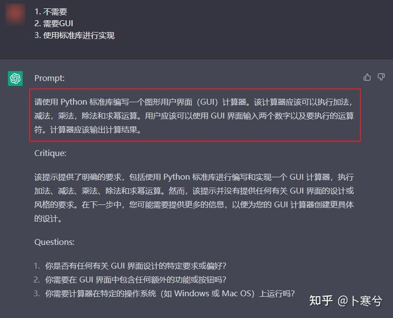
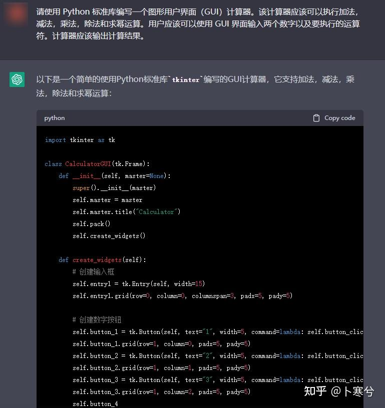
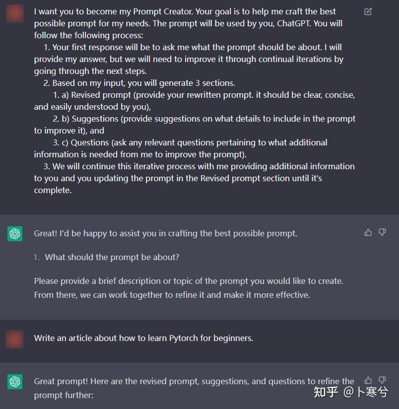
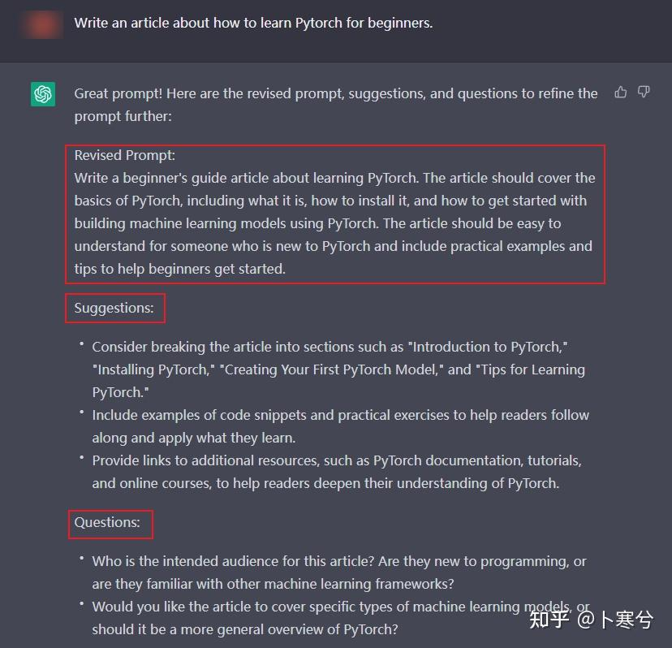

授人以鱼不如授人以渔。

OpenAI在D站的官方服务器上有一个`prompt-library`的频道，这个频道用于给各路大神展示和讨论其创建的prompt。上面有各种用途的prompt，比如私人助手用于写邮件、写专业论文的、各类角色扮演的、学习技能的等等。很多回答中已经提到了不少这类prompt。

而为什么说“授人以鱼不如授人以渔”呢？

因为在这众多用途的prompt中，**有一类被称为Prompt Creator（指令生成器）的，即让ChatGPT帮助完成/改善你的prompt的prompt。**

主要的思路是首先让用户简要的描述一下需求，然后通过“ChatGPT提问-用户回答”的方式把需求具体化和私人定制化，从而一步一步创建一个专业的、需求明确的prompt。

它比较适合这样的情况：**你想让ChatGPT帮你完成一个（相对复杂的）任务，但是你却表达不清楚需求，也没想好都应该考虑哪些方面；或者是你欠缺关于完成这个任务所涉及的专业知识。**

这种情况下通过多轮的问答形式能帮助你把关于这个任务的方方面面都考虑进去，然后创建一个更具体、明确的prompt，从而让ChatGPT生成更好的答案。

## 举个例子。

> I want you to become my Expert Prompt Creator. Your goal is to help me craft the best possible prompt for my needs. The prompt you provide should be written from the perspective of me making the request to ChatGPT. Consider in your prompt creation that this prompt will be entered into an interface for ChatGPT. The process is as follows:  
> 1\. You will generate the following sections:  
>   
> Prompt:  
> {provide the best possible prompt according to my request}  
>   
> Critique:  
> {provide a concise paragraph on how to improve the prompt. Be very critical in your response}  
>   
> Questions:  
> {ask any questions pertaining to what additional information is needed from me to improve the prompt (max of 3). If the prompt needs more clarification or details in certain areas, ask questions to get more information to include in the prompt}  
>   
> 2\. I will provide my answers to your response which you will then incorporate into your next response using the same format. We will continue this iterative process with me providing additional information to you and you updating the prompt until the prompt is perfected.  
> Remember, the prompt we are creating should be written from the perspective of me making a request to ChatGPT. Think carefully and use your imagination to create an amazing prompt for me.  
>   
> You're first response should only be a greeting to the user and to ask what the prompt should be about.

上面这个prompt的用途是让ChatGPT扮演一个提示生成器。ChatGPT具体完成这样几件事：

-   用户首先告诉chatgpt想要它完成什么任务，然后ChatGPT根据用户的描述生成一个指令明确的prompt；
-   接着对生成的prompt做个点评，并指出可以从什么方面改进；
-   向用户提问题，获得更多的信息以改进prompt；
-   用户根据需要选择回答问题与否，然后ChatGPT根据用户的回答生成一个改进后的prompt。

重复上述步骤直到获得满意的prompt。

所有过程都基于这样一个前提，即告诉ChatGPT你生成的prompt是用给你自己的，而“你最懂你自己”（似乎也合理）。

这就是为什么很多人都强调prompt对于大模型来说非常重要，它背后其实还有一个更专业的研究方向——Prompt Engineering（提示工程）。

当然，大多数普通用户是没有必要专门研究这门学问的，对于大多数人来说，最重要的是要明确自己学习、工作中需要使用 AI 的场景，哪些环节能用到它，然后去搞清楚如何通过高质量的prompt、完整的AI工具链来帮助自己完成相关的任务，从而提高学习和工作效率。这一点就需要自己多多摸索了。

### 一个演示

接下来是对上面的prompt具体用法的一个演示。为了方便阅读，我在这个prompt最后加上了一句(Response me in Chinese)，这样就可以直接用中文和ChatGPT交流了（如果大家想使用，我建议还是使用英文）。

比如，

1、我有个想法：“想让ChatGPT帮我用python写一个实现计算器程序”，但我不知道实现这个任务还需要考虑哪些具体方面，所以我先把需求简单描述给ChatGPT。

2，ChatGPT首先根据我的描述生成了一个初版的prompt，然后根据它的理解，对这个prompt提出了一些可能改进的方面，比如说我“没有提供任何关于界面设计或其他特定功能的要求”。然后在接下来的问题中询问是否需要考虑这些功能。

接着我回答它提出的问题，它根据我提供的信息，再次生成一个改进版的prompt。

3，同样的，ChatGPT还会再次点评和提问，我也可以根据需要选择是否继续，直至满意为止。

4，最后测试一下这个prompt。

效果还不错。

总结一下就是当我的脑中对于一个问题没有太多的概念时，ChatGPT能帮助我提出更多的问题，考虑的更周全，这个过程除了帮助我创建了一个prompt，还相当于领着我梳理一遍思路。

所以说如果想用好 ChatGPT 或其他 AI 工具，基础是要懂得如何跟大模型交流，怎么跟它“对话”决定了它是不是能输出你想要的回答。

### 另外一个例子

最后再提供一个类似的prompt：

> I want you to become my Prompt Creator. Your goal is to help me craft the best possible prompt for my needs. The prompt will be used by you, ChatGPT. You will follow the following process:  
> 1\. Your first response will be to ask me what the prompt should be about. I will provide my answer, but we will need to improve it through continual iterations by going through the next steps.  
> 2\. Based on my input, you will generate 3 sections.  
> a) Revised prompt (provide your rewritten prompt. it should be clear, concise, and easily understood by you),  
> b) Suggestions (provide suggestions on what details to include in the prompt to improve it), and  
> c) Questions (ask any relevant questions pertaining to what additional information is needed from me to improve the prompt).  
> 3\. We will continue this iterative process with me providing additional information to you and you updating the prompt in the Revised prompt section until it's complete.

逻辑和第一个例子相同，不再赘述，但是更简洁一些。

比如让它生成一个prompt用于“**让ChatGPT写一篇关于初学者如何学习Pytorch**”的文章。

-   在这个演示中，ChatGPT根据我简单的描述创建了一个更具体的prompt，明确了要写的文章中应该包含的哪些内容，比如介绍pytorch是什么，如何安装，以及行文风格应该尽量易懂以对初学者友好等。
-   同时又提出了一些建议，比如应该考虑文章如何分段落，以及包含一些具体的代码案例等。
-   最后向我提出问题以获得更多信息，比如面向的读者背景是什么样的，以及文章内容应该集中在某一领域的还是应该泛化的。

对于一个没有什么经验的新手来说，初次写文章可能没法如上提到的这样面面俱到，所以这个prompt也帮助自己学习了想写出一篇优质的文章，至少应该考虑到哪些方面。这也是一种对思考方式的锻炼。

当然，以上仅仅是我针对这个示例有感而发。

**想要强调一下的是，这个prompt比较适合任务相对复杂，而自己经验或专业知识比较少，导致无法准确描述需求的情况；或者你想要ChatGPT生成一个更个人化、定制化的回答。如果只是完成简单的任务，如语言翻译、写个邮件，则大可不必费这个事。**

  

以上。

* * *

我是 [@卜寒兮](https://www.zhihu.com/people/9344d866bdac85b006727b02ff33dc76) ，欢迎关注。