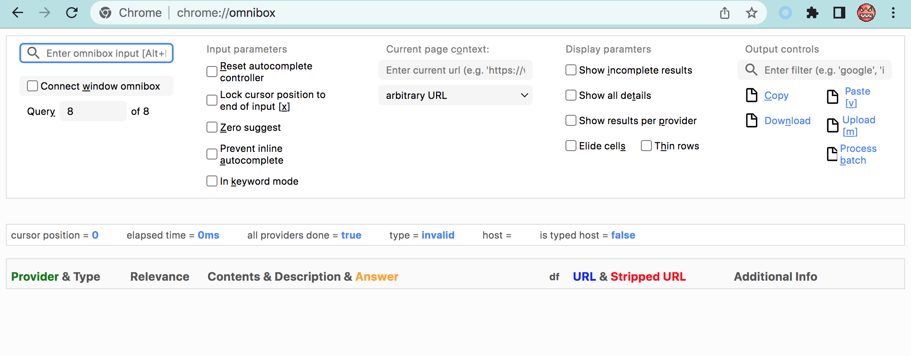
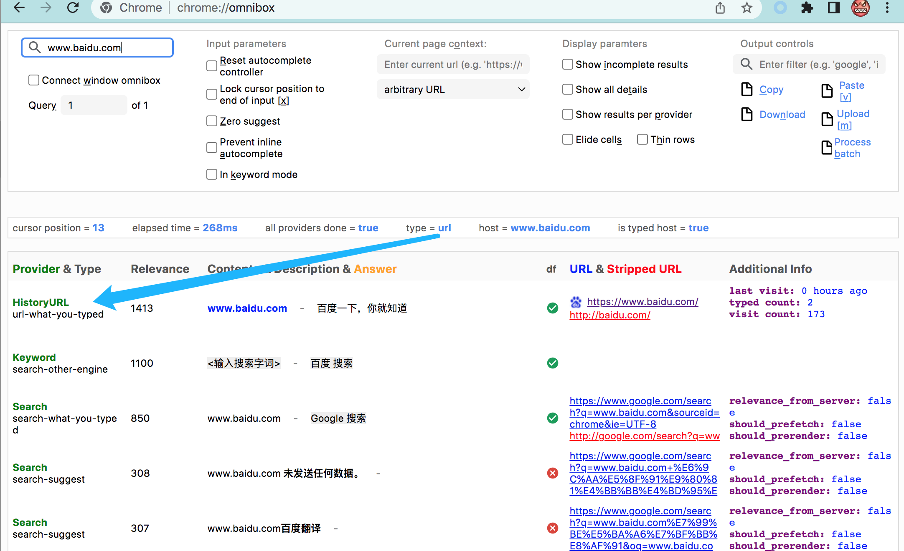
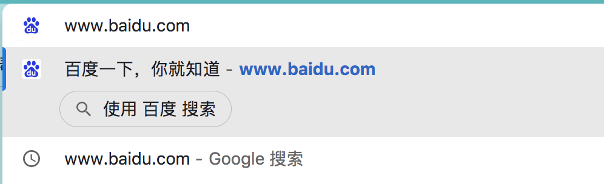
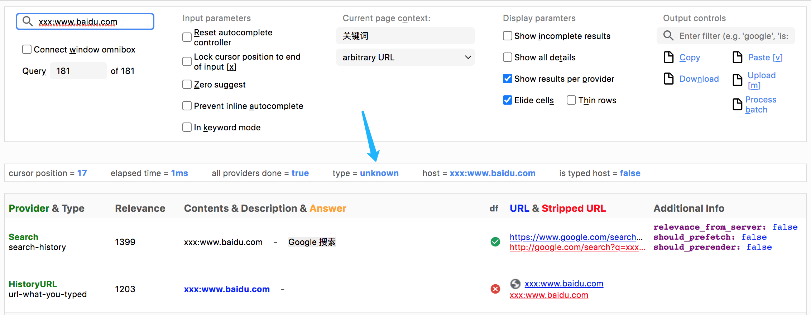
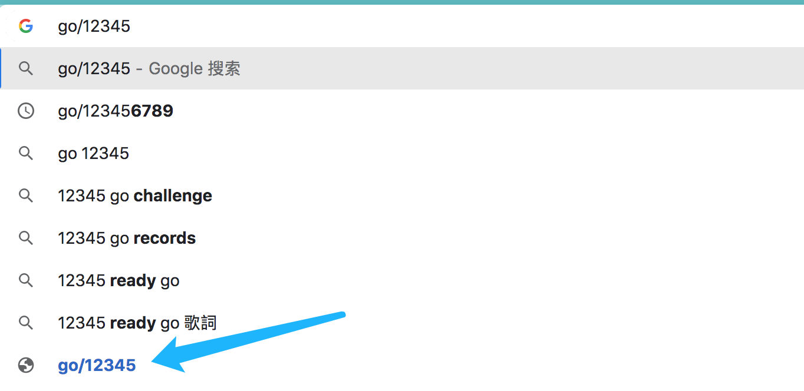
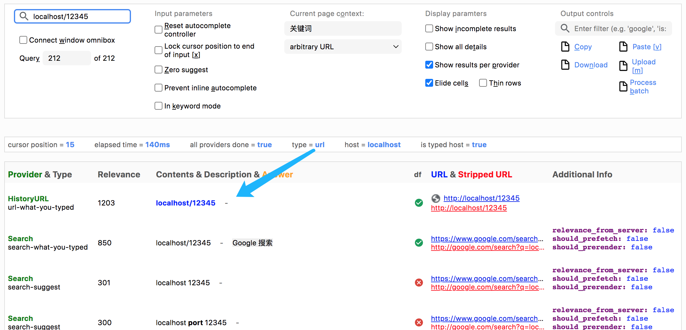
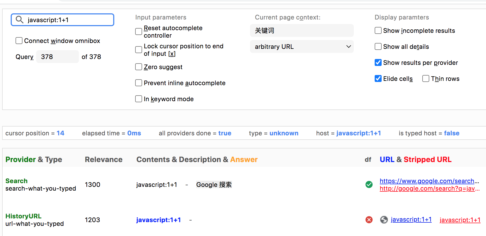
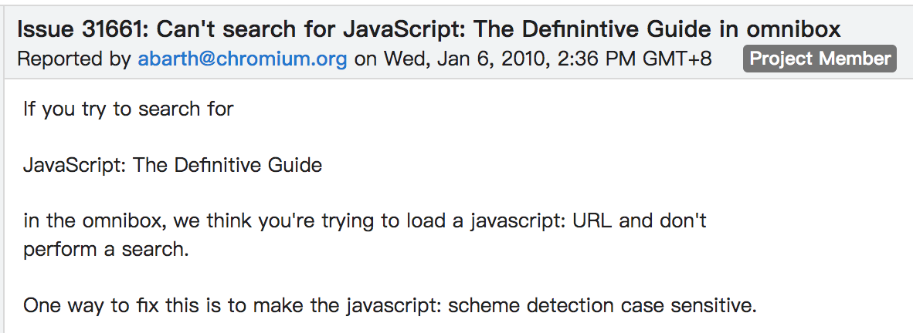
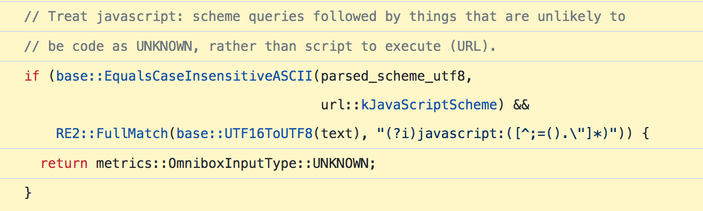
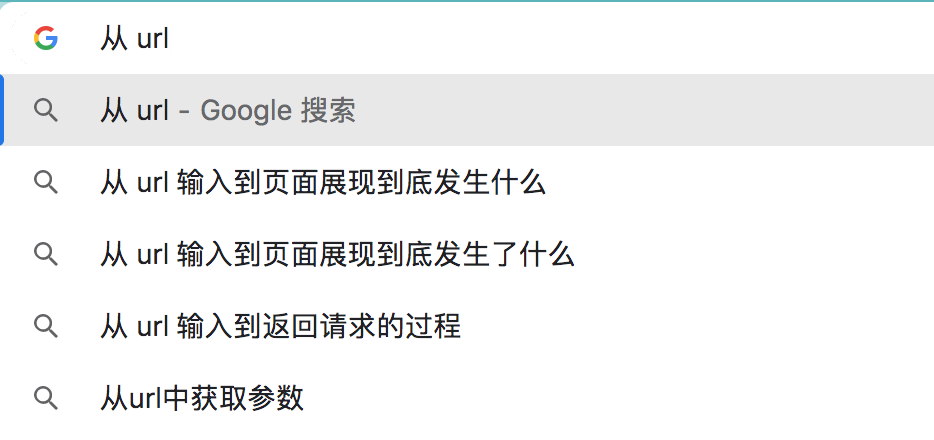

Chrome 的地址栏代号是 Omnibox，omni 是万能、全能的词根，Omnibox 就是全能盒子的意思。在 2008 年 Chrome 发布的时候，其它浏览器都是在一个长的地址栏右侧有个短的搜索框，Omnibox 把搜索和网址输入合二为一是当时一个大的创新。

Omnibox 是个很复杂的东西，远比我们用户想的要复杂，Chrome 就自带一个给他们的开发者调试用的页面，chrome://omnibox：

最核心的功能就是要判断你输入的东西是什么，是个 query 还是个 url，也就是调试页面里展示出的那个 type = 的值。比如当你输入 [http://www.baidu.com](https://link.zhihu.com/?target=http%3A//www.baidu.com)：

Ominibox 判断出了这个字符串是个 url，所以排在第一位的结果，也就是我们立刻回车执行的那个操作，就是 url-what-you-typed，也就是以网址形式打开你输入的内容，当然，我们的输入其实是缺了 https:// 协议头的，所以实际上它会给补上，也就是倒数第二列展示的那个。

而第二位的结果类型叫 search-other-engine，是因为它判断出了 http://www.baidu.com 刚好是浏览器内置的谷歌以外的一个搜索引擎，所以它会提示你，按下 TAB 键，就可以输入关键词，从而打开百度搜索。

第三位叫 search-what-you-typed，就是用默认的搜索引擎搜索输入的字符串，拼接好的谷歌网址也展示了出来。

前三个结果在 Omnibox 里展示出来是这样的：

实际上判断是不是 url 是个非常复杂的逻辑，更何况这里的输入不能期望它是个完整的 url，比如没有协议头的话，JS API 里`new URL('www.baidu.com')` 是可以直接报错说它不是个 url，但这里不行。而且这里还得考虑自己的业务属性，比如不允许的协议类型，xxx:www.baidu.com：

它没有识别成 url 类型，也不是 query 类型，而是 unknown，unknown 类型类似 query，排第一的结果也是默认搜索，但是它和 query 不一样的是，也可以作为网址打开，箭头向下移动到最底部再回车就可以。比如我在之前回答中提到的谷歌公司内部短网址域名 go 的网址，就会被判断成 unknown：

而 localhost 就被特殊处理成了 url 类型：

还有这里还得考虑本地路径格式，比如斜杠 / 表示根目录和波浪线 ~ 表示 Home 目录。

还有个有趣的 javascript: 协议，这是从网景时代 Brendan Eich 手里传下来的调试功能，BE 不在 Mozilla 以后，Firefox 已经完全禁掉了它。在 Omnibox 里，javascript:1+1 默认会是搜索，因为被判定成了 unknown：

而 javascript:alert(1+1) 就会被识别成 url，会弹出 2。这是因为很多年前，有人说搜素 JavaScript 犀牛书的名字 JavaScript: The Definitive Guide，结果没有打开谷歌，而是给当成代码执行了：

所以他们加了个简单的正则：

只有 javascript: 协议后的文本包含一些括号、点、分号等才认为是代码，通常来说，也够了。

我这里只是说一些简单的有趣的 case，其实很多你想都想不到的场景有很多，比如输入 ip，而且还有 ipv4 和 ipv6 的情况，等等。识别这个字符串是不是 url 涉及到的 C++ 代码怎么都有几千行，这不是一个正则能实现的。

现在据说流行一个面试题：

我这里说的就是这道题的答案的第一步的梗概。