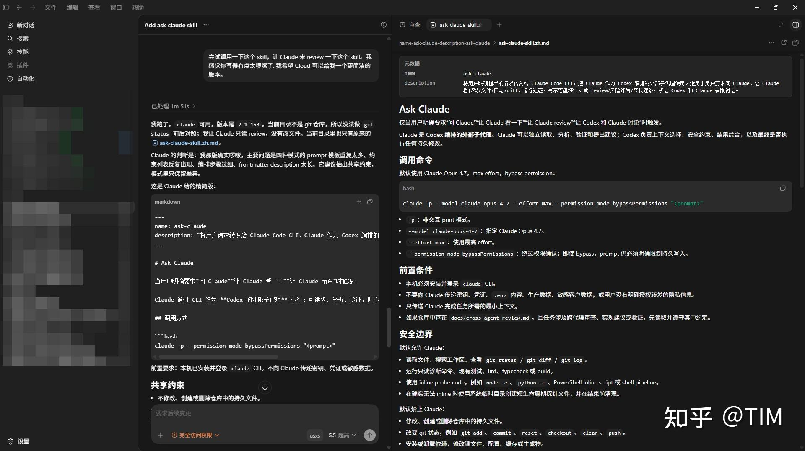

GPT 和 Claude 都很顶，各有所长。然而，codex 桌面端体验完爆 claude desktop，所以我日常开发会以 Codex 为主要的界面，然后利用 "ask claude" skill 让 gpt 像调用子代理一样，调用 claude 完成一些任务。因为我觉得一般需要 "ask claude" 做一些事情的时候，都是比较困难的、Codex 难以解决的事情，所以我直接默认使用 Opus 4.8 Effort Max 来调用 Claude



相关相关 skill 已上传 [Daoming-Chen/AgentSkills](https://link.zhihu.com/?target=https%3A//github.com/Daoming-Chen/AgentSkills)

### Skill 内容(约 607 token)：

* * *

name: ask-claude

description: “将用户的 Claude 请求通过 Codex 子代理转发给 Claude Code CLI，避免中间过程污染主会话上下文。”

## Ask Claude

仅当用户明确要求”问 Claude”“让 Claude 看一下”“让 Claude review”“让 Codex 和 Claude 讨论”时触发。

### 架构

优先通过 Codex 子代理调用 Claude CLI，主会话只负责构造上下文、接收压缩结果、做最终判断。子代理负责调用 CLI、执行用户要求的操作、返回结构化摘要（结论、证据、命令摘要、风险、可信度）。

无法使用子代理时降级为主代理直接调用，但仍只向用户返回压缩后的结论。

### CLI 命令

```text
claude -p --model claude-opus-4-8 --effort max --permission-mode bypassPermissions "<prompt>"
```

### 前置条件

-   本机已安装并登录 `claude` CLI。

### 上下文管理

调用 Claude 前，编排者必须将当前会话中与任务相关的上下文压缩为最小摘要传入 prompt。典型内容包括：

-   用户的目标和约束（从对话中提炼）
-   已尝试的方案及结果
-   当前卡点或分歧
-   相关文件路径、错误信息、关键代码片段

原则：Claude 没有当前会话的记忆，它只能看到 prompt 里传入的内容。编排者负责判断哪些上下文是 Claude 完成任务所必需的，去掉闲聊和无关细节，保持 prompt 精简。

### Prompt 模板

```text
任务：<task>
上下文：<minimal context>
```

### 流程

1.  明确用户要 Claude 回答的问题，选择模式。
2.  构造最小 prompt，只传必要上下文。
3.  优先子代理调用 CLI；不能则主代理降级调用。
4.  涉及仓库时，调用前后检查 `git status --short`，状态变化立即报告。
5.  返回关键结论、证据、命令摘要、综合判断、建议下一步。

### 失败处理

CLI 未安装/未登录/超时/模型不可用时，明确告知用户 Claude 未成功参与，由 Codex 本地给出分析。不假装 Claude 已回答。

### 输出规范

-   说明本次是”子代理参与”还是”降级直接调用”。
-   区分 Claude 原始观点、子代理可信度判断、主 Codex 综合判断。
-   列出 Claude 结论依赖的假设。
-   Claude 或子代理违反约束或造成文件变化时优先报告。