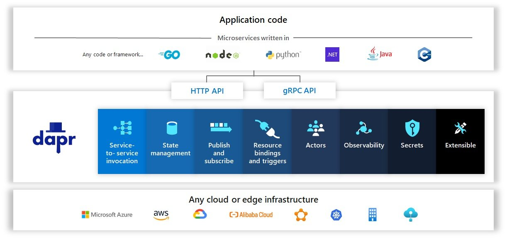
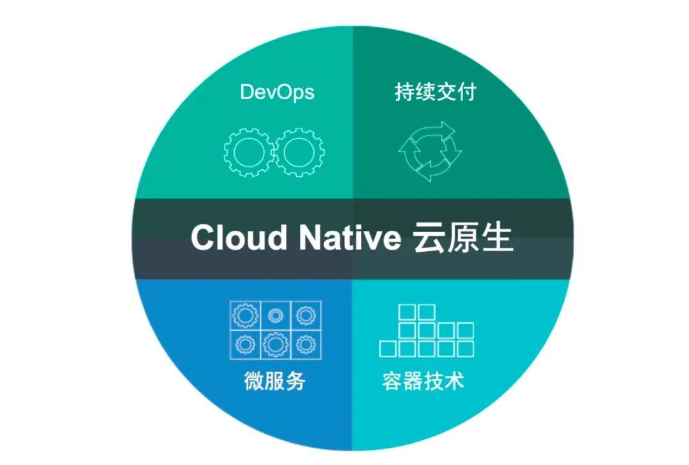

## 0x00.前言

上家公司g了以后，最近入职了新公司负责 研效/DevOps 这块。

这也是我这些年喜欢做的，从前端、后端、美术、策划、QA、PM协作所有流水线都要重新整理，定标准、做自动化、提高工业化水平，每个公司情况也不一样，方案服务的人员也不一样，这也让我多了很多时间思考，也有时间复盘一下上个项目的技术债，于是就有了这篇~

首先声明：

> 我这无意引发语言战争，也不是来推销“web方案、Java”的，标题的几个词也不是拽文。  
> 技术方案、语言对我来说只是工具，所以也不会自称javer C#er goer 之类的.  
> 只是云原生、容器技术发展到现在，带来的整体后端工业化、生态的进步，  
> 让我再次产生了思考**“C#现在到底能不能做游戏全栈”？**

因为一个对项目负责的技术选型，永远不是**“我喜不喜欢”**、**“这个语言多么好”、“这个语言多么快”.**..这么简单。

ps：什么是云原生？简单请看封面图，后文会说明其优势

本文讨论目标是:**unity前端是否能用c#做一套"分布式游戏系统api server "**？

以下讨论暂只对各种游戏系统api接口(登录、签到、养成、抽卡..等)，gameplay同步部分暂不参与…

## 0x01.聊聊之前项目后端架构

我们项目结构类似**明日方舟**这种二游.

简单来说：**弱联网**，**gameplay、战斗** 可以结束再**服务器验算**，

为了抗首日用户量暴增，我们qps按最高10W进行设计，注册规模按300W算。

针对项目人员情况，我们项目主要架构为：**SpringCloud** \+ **微服务**+**Serverless+无状态架构+.netCore战斗验算**

托管在**Alibaba Serverless K8s**服务上.

java到后期也就是写业务接口的工具，分布式基于k8s本身做了，已经很少用SpringCloud的相关技术栈了。

这里要说一下**无状态**：**并不是你用了http协议，你的业务就是无状态的，无状态架构是需要你针对业务进行设计的。**

> 举个不恰当的例子，比如：统计在线时长，有状态的做法是update time++，无状态的做法是“下线时间-上线时间”（当然也一般都这么做，只是想简单说明两种架构的区别）.

换句话说：

**你用tcp也能实现无状态业务，你用http也能做成有状态业务。（无状态业务**和**无状态协议**不强关联）

**无状态架构**带给我们的好处是：

> **任何请求连节点执行结果都一样**，**所有的业务节点可以直接扩容，出现故障重连接即可（底层有个重试机制）.**

其中serverless对我们影响颇深，按serverless的设计：

> **一次api请求，新启动容器=>唤醒你部署的服务，api执行结束，这个容器直接会被释放。（**付费也是按这次消耗来）

当然这只是**云函数**理论情况，实际还有容器申请、冷启动开销，云服务商会让这个容器存活一会~

按Serverless的设计下，运维成本也会大大降低. 整体服务的高可用会提高.

当然以上都是云主机上提供的服务，你要做的就是：**把项目设计成无状态架构~**

  

以上架构个人觉得比较适合这些品类：

明日方舟、1999 这类**弱联网游戏**，或者 像LOL、王者荣耀、雀魂 这类 **大厅**和**gameplay**、**战斗**分离的比较干净的游戏，

在微服务架构上，可以再增加场景服、战斗服、房间逻辑...等节点.

如果你手头有成型方案，就不用再折腾了~

## 0x10.复盘问题

### 1.为什么我上个项目不用C# / .net core?

我是从14年入行那时候用的node+mongo技术栈，17年用go+mongo技术栈，

在经历过几个项目全栈后，深知各个语言选型优缺点，19年带项目就直接定SpringCloud+mysql+redis 做的分布式架构。

其实我对.net core很熟，项目中很多工具都是.net core，然而在后端技术选型中却放弃了，放弃原因如下

> **1.不好招人：**  
> 每个语言选型后面的人才都有一定画像，如：node找的多是web前端转的、go招的早期是c转的(比较贵)后来是php转的比较多、java则各种培训生八股文和电商秒杀项目，c#多是企业oa、工控、unity前端  
> **2.生态**  
> 在分布式架构上 C#生态奇缺，相关资料也不多、各种组件质量也层次不齐。

基于上面两大原因，虽然javer也是各种问题，但也基本接受相对正规的培训，八股文背了总比没背过的好。

java学习资料大而全，分布式资料案例也相对齐全，分布式方案抱着SpringCloud也相对够用（**其实也是抱着alibaba的大腿，阿里云对java生态支持很齐全**）。

现在我也还是这个观点：

**如果你想开始学后端，请直接从java开始，然后再转其他语言！！！**

  

### 2.为什么需要全栈？需要什么样的全栈？

我把我们项目中的后端人员分两种：

**1.专业后端：**负责核心架构、分布式、高并发、gameplay...等专业方案

**2.CURD员：**写写基本接口

在总hc有限的情况下，我们需要Unity客户端去充当上面2型人才，即：

> 负责ui系统的接口编写（如：卡牌数据、抽卡、结算...等）  
> 不需要负责太复杂的模块，如：账号系统、登录注册、gameplay...等复杂模块 交给专业后端，稍微复杂一点业务会有专业后端辅助建表...

因为实际中、小公司情况下，正常能力达标的前、后端都很少，更别说去培养前后端能力都很ok的人才了.

而后端接口业务中，最浪费时间的就是跟策划、客户端去对业务、对表 调试接口 慢慢磨。

所以我们需要一个这样的**“全栈”**：**80%前端技术、20%后端技术既可。**

**因为你再怎么“全栈”工作量也不会少的，甚至对于前端编码任务来说还会增加。**

**所以我们只能想办法减少流程上的损耗，以提高整体效率产出...**

甚至会进一步降低“全栈”的开发难度 **技术栈上引入 GraphQL或者APIJson这类，也减少各种接口的量.**

再用其他DevOps流程来保证接口稳定性（后文会详细提到）

  

### 3.为什么开始考虑选型C#？是C#生态好起来了么？

**i.**语言对于开发后端的人来说其实不是什么大事，但对于上面**unity前端2型人才**就是个极大的阻碍。

比如：不是很想接触其他语言，只会C#...之类的

中小公司不能寄希望于“我们能招到xx的人”，只能通过自己的生产管线培养。此时语言上C#是最优选..

  

**ii.**其次怎么基于C#构建分布式：

这就要感谢**“云原生”**的发展，实际C#这几年生态并没有比以前好太多。云原生带给后端生态开发是质变的.

我在上个项目中早期基于SpringCloud，到了中后期发现 其实完全可以基于k8s本身服务构建分布式架构.

**而“云原生”直接让整个后端所有语言共享生态!!!**

这两年java的使用率下滑也是因为这个，不需要啥都用java一把梭了，每个语言可以只做自己擅长的事情，所以 go、rust、python...这类语言崛起...

**比如：你可以基于Dapr使用任何语言的任何中间件。**

基于dapr，.net core可以只实现游戏接口服务，gm之类的继续java做. 负载均衡、服务注册、服务发现...这些交给K8s.

在**“云原生”**发展下，整个后端生态完全共享~

  

**3.**如何保证稳定性？

> 在微服务架构下，我们只需要保证"全栈"写的接口服务稳健既可。  
> 甚至于如果基于Serverless，无状态架构的设计，每个人只需要保证单个接口正常既可。

首先，接口的测试覆盖率一定要保证达到90%以上，

退而求其次：**每次修bug，必须提交该bug单元测试.**（毕竟人力有限，不过现在Copilot补单元测试很快能节省一定量，单元测试建议能推还是要推）

然后辅助一些**Devops**方案管理：代码review，数据库结构Review，定期的ci测试接口、压测...等

这里分享一个API自动测试的框架

[GitHub - TommyLemon/APIAuto: ☔ 敏捷开发最强大易用的 HTTP 接口工具，机器学习零代码测试、生成代码与静态检查、生成文档与光标悬浮注释，集 文档、测试、Mock、调试、管理 于一体的一站式体验。☔ The most advanced tool for HTTP API. Testing with machine learning, generating codes and static analysis, generating comments and floating hints, one site for document, testing, mocking, debugging and management.](https://link.zhihu.com/?target=https%3A//github.com/TommyLemon/APIAuto)

  

综此，C#做游戏“全栈“似乎也可以一战~

基本架构为：

**k8s** + **DAPR +** **.net core +devops + ApiJson / GraphQL**（当然这个.net core，你可以换成任何语言~）

## 0x11.最后，聊一下什么是“**架构”？**

**“微服务架构”**很多游戏行业老哥看到这个词排斥情绪就上来了:“**又搞web那套！**”**游戏行业不需要微服务！**” 诸如此类…

实际上我想聊一下的是"**xx设计**"和"**xx架构**"的区别，从字面理解微服务作为一种设计把服务一拆，那确实也没啥。**但是作为一种架构，微服务是有一套设计、协作、沟通，乃至于团队管理的标准、规范指导.**

这也是我们常说的**“术”**和**“道”**的区别…

下面我简单解释一下微服务架构部分**核心的业务**与**技术特征**(可能大家已经见过或者用过了，但是这套体系完整提出是在2012年，毕竟每一次工业化进步，都会传导到各个细分行业):

**·围绕业务能力构建（Organized around Business Capability）:**这一条我觉得是最重要的，这里强调了**康威定律**的重要性，有怎样结构、规模、能力的团队，就会产生对应结构、规模、能力的产品。这个结论不是某个团队、某个公司遇到的巧合，而是必然的演化结果。如果本应该归属同一个产品内的功能被划分在不同团队中，必然会产生大量的跨团队沟通协作，而跨越团队边界无论在管理、沟通、工作安排上都有更高昂的成本，因此高效的团队自然会针对其进行改进，当团队、产品磨合稳定之后，团队与产品就会拥有一致的结构。

**·分散治理（Decentralized Governance）：**这里是指服务对应的开发团队有直接对服务运行质量负责的责任，也有不受外界干预地掌控服务各个方面的权力，譬如选择与其他服务异构的技术来实现自己的服务。

**产品化思维（Product not Project）**:避免把软件研发视作要去完成某种功能，而是视作一种持续改进、提升的过程。

**·数据去中心化（Decentralized Data Management）**:微服务明确提倡数据应该按领域分散管理、更新、维护、存储。

**·容错性设计（Design for Failure）：**不再虚幻地追求服务永远稳定，而是接受服务总会出错的现实，要求在微服务的设计中，能够有自动的机制对其依赖的服务进行快速故障检测，在持续出错的时候进行隔离，在服务恢复的时候重新联通。

**·演进式设计（Evolutionary Design）：**容错性设计承认服务会出错，演进式设计则承认服务会被报废淘汰。一个设计良好的服务，应该是能够报废的，而不是期望得到长存永生。假如系统中出现不可更改、无可替代的服务，这并不能说明这个服务多么优秀、多么重要，反而是一种系统设计上脆弱的表现，微服务所追求的自治、隔离，也是反对这种脆弱性的表现。

**·基础设施自动化（Infrastructure Automation）：**基础设施自动化，如CI/CD的长足发展，显著减少了构建、发布、运维工作的复杂性。

\----------------------------------------------------------------------------------

## 结束语：

以上均为一家之言，部分场景只适合中小项目协作, 希望对大家有点帮助.

在新的项目技术栈上，我会采用C#作为业务接口编程语言，并推动“全栈”的执行。

后续会在进行分享...

  

**最后，拥抱大云原生时代~**