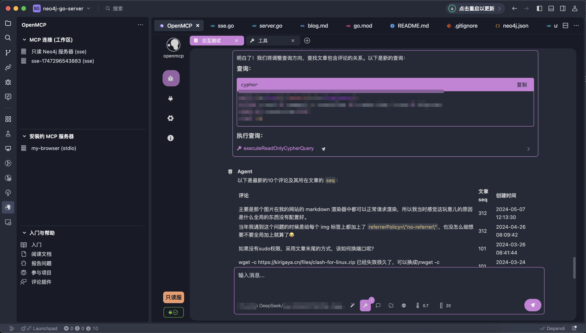
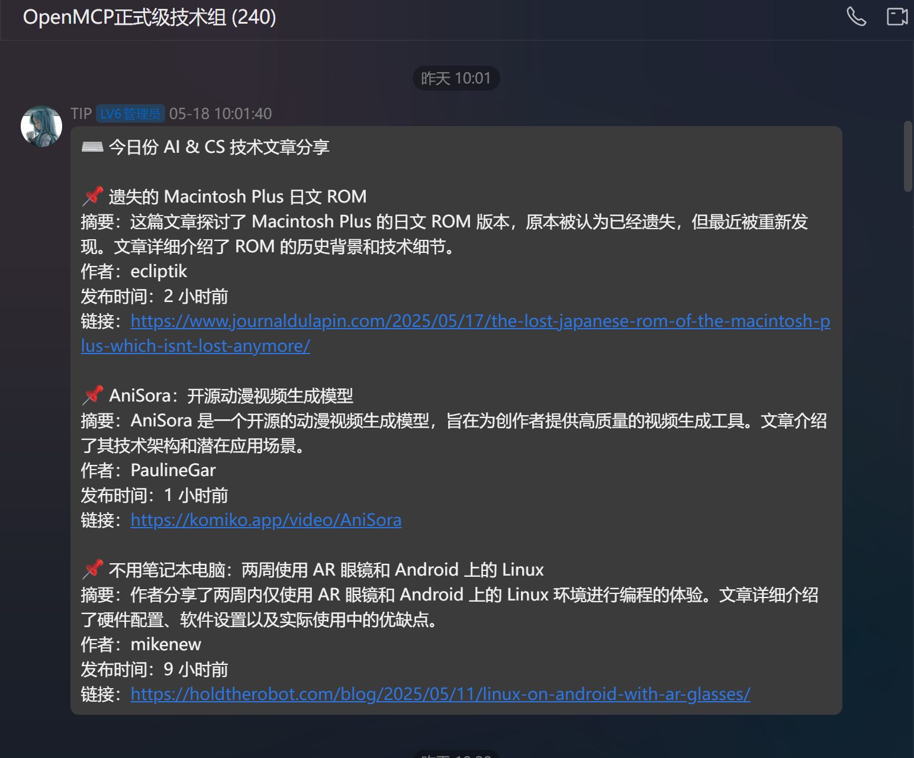
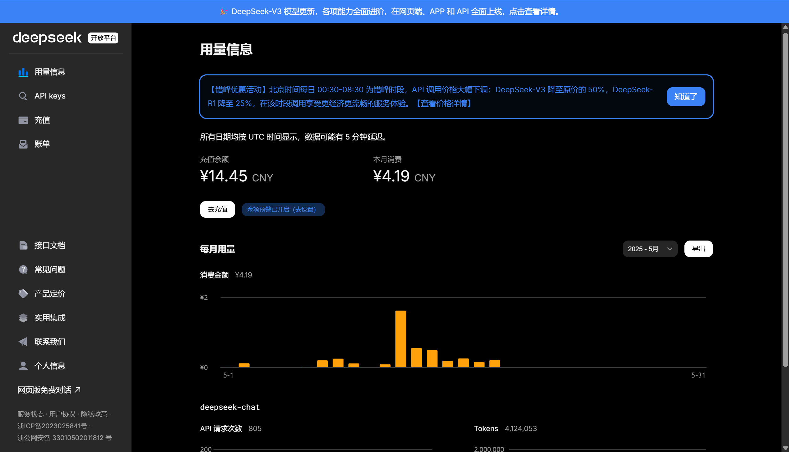

为了说明 ds 性价比到底多高，给大家看个东西吧。

这是我最近开发的 openmcp 工具，支持 mcp 全部协议，使用 deepseek 测试功能测试 openmcp 生产出的 agent 是否好用，比如下面这个是通过自然语言和图数据库 neo4j 进行交互，自动帮我完成后端开发的 agent

这个东西用 deepseek 随随便便就能烧掉几万 token，我开发&测试了一个月。然后我群里的资讯机器人也是通过 openmcp 和 openmcp-sdk 开发和部署的，每天早上10点会为我的群友带来最新的资讯：

这些有关大模型的agent的测试呀，应用呀都要消耗大量的 token。

猜猜这一个月我一共花了多少钱？

注：我上个月余款是 19 块钱。

测试开发了一个月后余款是：

对比一下我好哥们，用的 openai 家的 api 开发 agent，一下午烧掉 60 块钱。（公司报销，所以无所谓）

deepseek 过于廉价（我喜欢凌晨写代码，deepseek 凌晨调api更便宜）让我国公民可以更加畅通无阻地开发自己的 agent，将自己的经验和知识通过 agent 进行表示和封装。

我一年前还打算自己家里建私有部署机器，现在完全不高兴自己部署了，deepseek 这个便宜到和不要钱一样。感谢祖国，感谢 deepseek，能让我这个 AI 开发爱好者能用到如此廉价又还挺好用的大模型 api。

哦，对了，如果对我的 openmcp 感兴趣，请帮我点个 star，谢谢：[https://github.com/LSTM-Kirigaya/openmcp-client](https://link.zhihu.com/?target=https%3A//github.com/LSTM-Kirigaya/openmcp-client)

如果对资讯聚合技术和mcp技术感兴趣的朋友，欢迎加入 OpenMCP交流群进行讨论：782833642