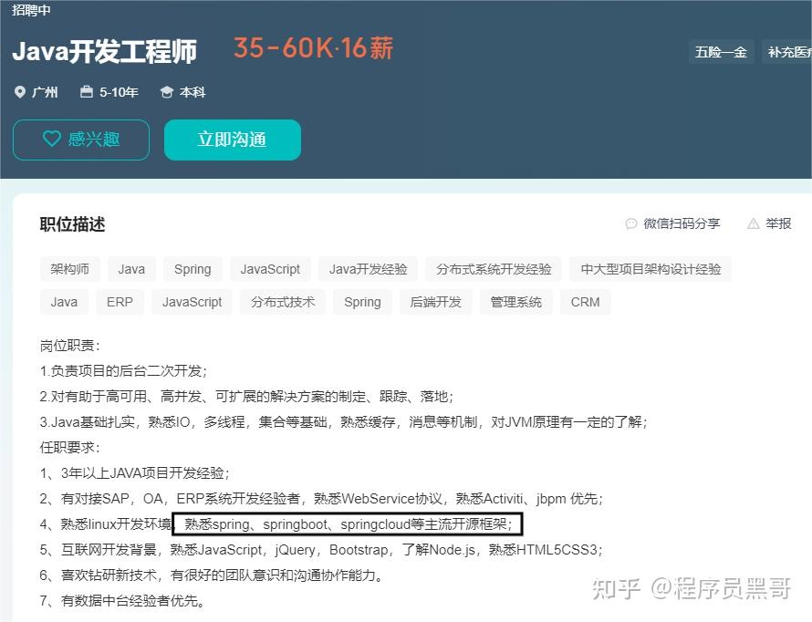
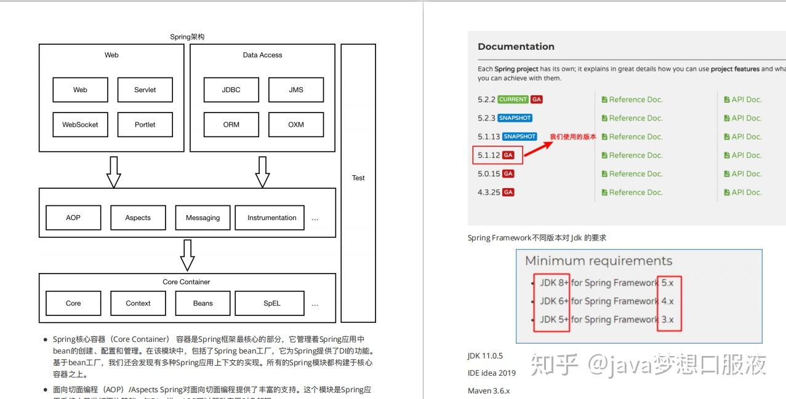
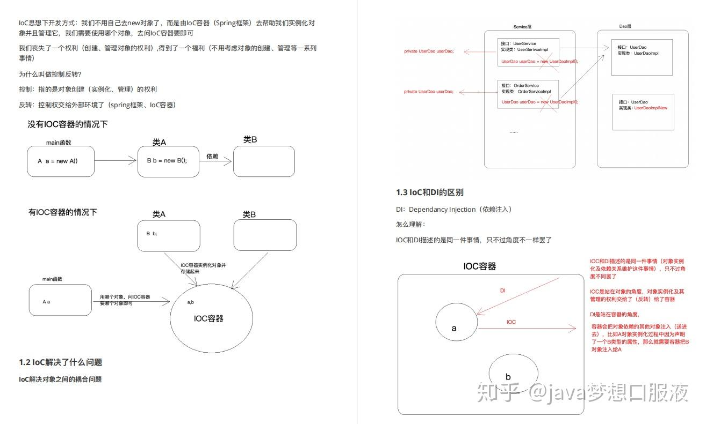
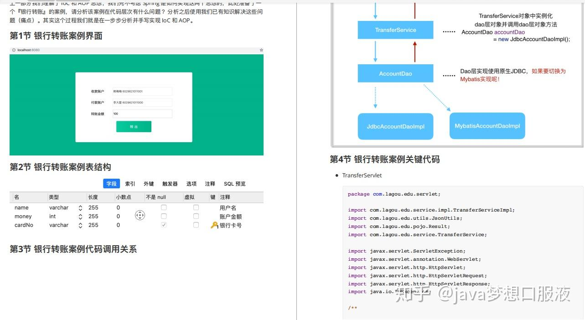
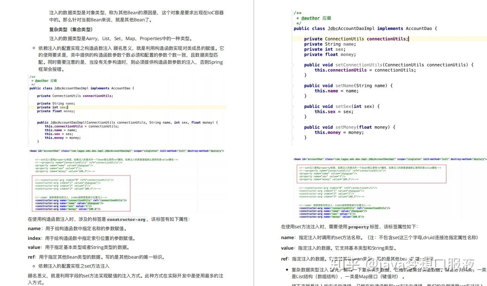
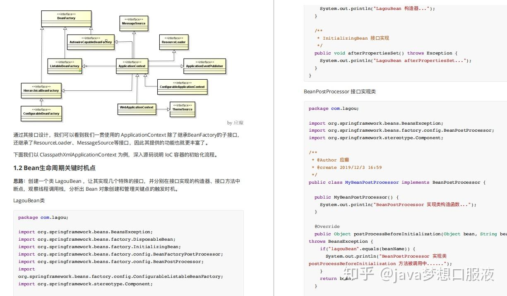
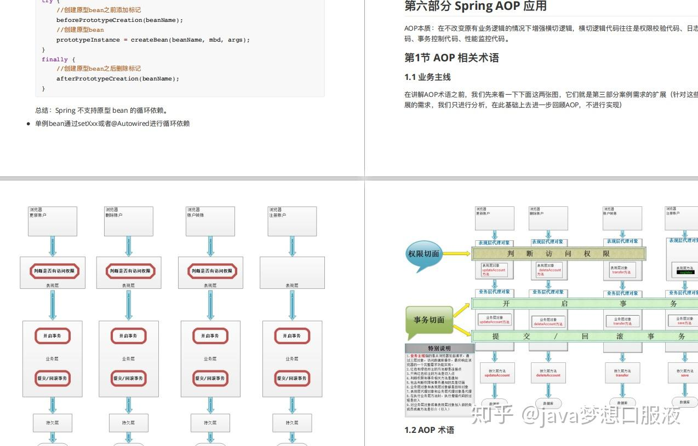
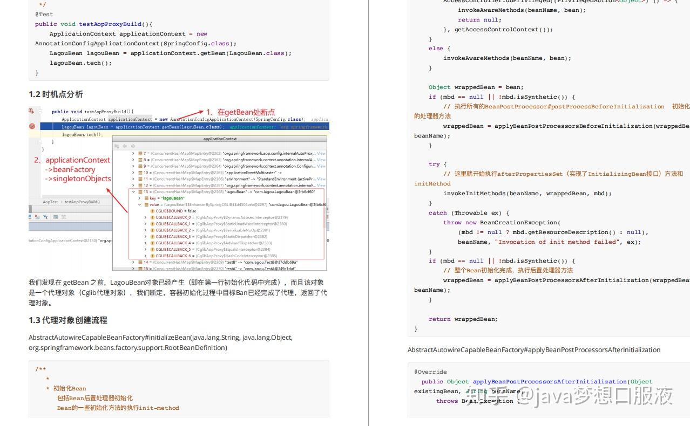
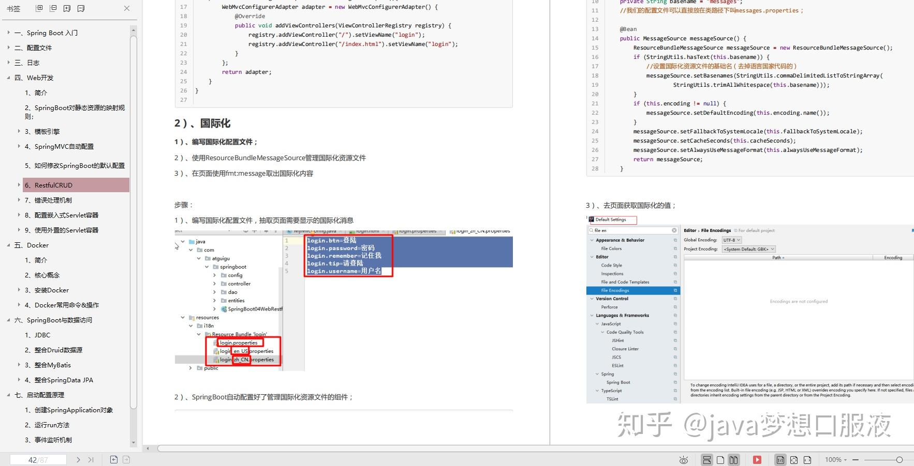

最近看了下身边朋友们的面试情况，发现很多人知道自己的问题和短板在哪里，对自己的技术水平和能力认知也很清晰，都很迫切想要学习提高，奈何自己盲目学习的过程很费力，效果也不佳，遇到好些困难和阻碍。

**比如大部分正在学Spring的程序员兄弟们就反馈：**

1、虽然Spring全家桶的官方文档很全面，但面对庞杂的知识体系，很多兄弟不知从何下手

2、市面上Spring全家桶的书籍很多，但平铺直叙的风格很难让人快速抓住重点

3、网上分析Spring全家桶源码的文章也有，但太分散，都是围绕几个常见知识点“炒冷饭”，不成体系

4、想要深度掌握单个框架或组件已经很难，还要将Spring全家桶整体结合到一起理解学习就更难了

这样的反馈实在太多了，**Spring又确实是面试和工作都绕不开的重难点**，而且想熟练运用spring靠网上那些不成体系的资料说实话也没有多大用处。

**除了要读懂源码，了解整体设计和实现细节，还要具备一定的框架开发经验。**而且如果想要在大厂面试中更顺畅些，还要熟悉大厂的面试套路，更要思考如何将技术在大厂业务中去落地运用。

这里建议还是看一些**专业靠谱的笔记+视频课程**，除了有技术大佬引路避免走弯路和做无用功，还有一个更核心的好处：**直接接触到大厂的实战案例，积累到能真正用于简历、实践和工作中的项目经验。**

可以看下现在对Java开发的**技术要求**：

所以今天小编整理了一下一线架构师的Spring源码高级文档：Spring+Spring Boot+Spring Cloud+Spring IOC，里面的内容很多很详细，分享给大家一起学习一下~

有需要这份Spring源码高级笔记文档的朋友可直接点击下方资料库即可!

[点击免费领取：Spring高级源码入门到实战进阶电子版教程](https://xg.zhihu.com/plugin/90d662131b7072f4bea212727124af52?BIZ=ECOMMERCE)

## 先看目录

## 第一部分Spring概述

-   第1节Spring简介
-   第2节Spring发展历程
-   第3节Spring的优势
-   第4节Spring的核心结构
-   第5节Spring框架版本

## **第二部分核心思想**

-   第1节loC

1.1什么是loC?

1.2 loC解决了什么问题

1.3 loC和DI的区别

-   第2节AOP

2.1什么是AOP

2.2 AOP在解决什么问题

2.3为什么叫做面向切面编程

## **第三部分手写实现loC和AOP**

-   第1节银行转账案例界面
-   第2节银行转账案例表结构
-   第3节银行转账案例代码调用关系
-   第4节银行转账案例关键代码
-   第5节银行转账案例代码问题分析
-   第6节问题解决思路
-   第7节案例代码改造

## **第四部分Spring I0C应用**

-   第1节Spring loC基础

1.1 BeanFactory与ApplicationContext区别

1.2纯xml模式

1.3 xml与注解相结合模式

1.4纯注解模式

第2节Spring I0C高级特性

-   2.1 lazy-lnit 延迟加载
-   2.2 FactoryBean和BeanFactory
-   2.3后置处理器

2.3.1 BeanPostProcessor

2.3.2 BeanFactoryPosProcessor

## **第五部分Spring 10C源码深度剖析**

第1节Spring loC容器初始化主体流程

-   1.1 Spring loC的容器体系
-   1.2 Bean生命周期关键时机点
-   1.3 Spring loC容器初始化主流程

第2节BeanFactory创建流程

-   2.1获取BeanFactory子流程
-   2.2 BeanDeinition加鼓解析及注册子流程

第3节Bean创建流程

第4节lay-init延迟加戴机制原理

第5节Spring loC循环依赖问题

-   5.1什么是循环依赖
-   5.2循环依赖处理机制

## **第六部分Spring AOP应用**

第1节AOP相关术语

-   1.1业务主线
-   1.2 AOP术语

第2节Spring中AOP的代理选择

第3节Spring中AOP的配置方式

第4节Spring中AOP实现

-   4.1 XML模式
-   4.2 XML+注解模式
-   4.3注解模式

第5节Spring声明式事务的支持

-   5.1事务回顾
-   5.1.1事务的概念
-   5.1.2事务的四大特性
-   5.1.3事务的隔离级别
-   5.1.4事务的传播行为
-   5.2 Spring中事务的API
-   5.3 Spring声明式事务配置

## **第七部分Spring AOP源码深度剖析**

第1节代理对象创建

-   1.1 AOP基础用例准备
-   1.2时机点分析
-   1.3代理对象创建流程

第2节Spring声明式事务控制

-   2.1 @Enable TransactionManagement
-   2.2加载事务控制组件

## 再看看内容

**第一部分 Spring基础**

> Spring框架由Rod Johnson开发，2004年发布了Spring框架的第一版。Spring是一个从实际开发中抽取出来的框架，因此它完成了大量开发中的通用步骤，留给开发者的仅仅是与特定应用相关的部分，从而大大提高了企业应用的开发效率。

  

**第二部分 IOC与AOP 核心思想**

> IOC控制反转另外一种说法叫DI，即依赖注入，是利用反射机制，它并不是一种技术实现，而是一种设计思想。在任何一个有实际开发意义的程序项目中，我们会使用很多类来描述它们特有的功能，并且通过类与类之间的相互协作来完成特定的业务逻辑。这个时候，每个类都需要负责管理与自己有交互的类的引用和依赖，代码将会变的异常难以维护和极度的高耦合。  
> 　　而IOC的出现正是用来解决这个问题，我们通过IOC将这些相互依赖对象的创建、协调工作交给spring容器去处理，每个对象只需要关注其自身的业务逻辑关系就可以了。在这样的角度上来看，获得依赖的对象的方式，进行了反转，变成了由spring容器控制对象如何获取外部资源（包括其他对象和文件资料等等）。

  

**第三部分 手写实现 IoC 和 AOP**

> 在Spring中非常核心的内容是 `IOC`和 `AOP` ，相信大家都有所了解。这个的重要性相信就不用我说了把？

**第四部分 Spring IOC 应用**

  

**第五部分 Spring IOC源码深度剖析**

  

**第六部分 Spring AOP 应用**

  

**第七部分 Spring AOP源码深度剖析**

> 有需要Spring源码高级笔记完整文档的，直接点击下方资料库即可获取资料免费领取方式!  
> [点击免费领取：Spring高级源码入门到实战进阶电子版教程](https://xg.zhihu.com/plugin/90d662131b7072f4bea212727124af52?BIZ=ECOMMERCE)

**同时附上：SpringBoot核心笔记文档+spring视频教程！**

