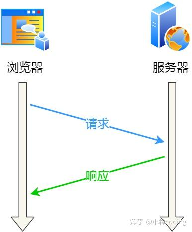
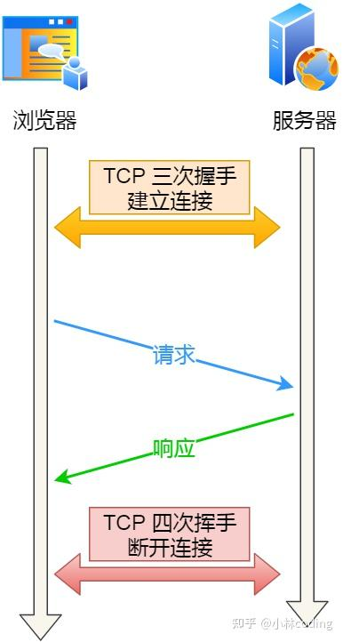
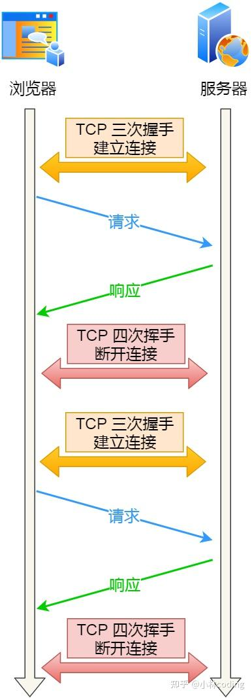
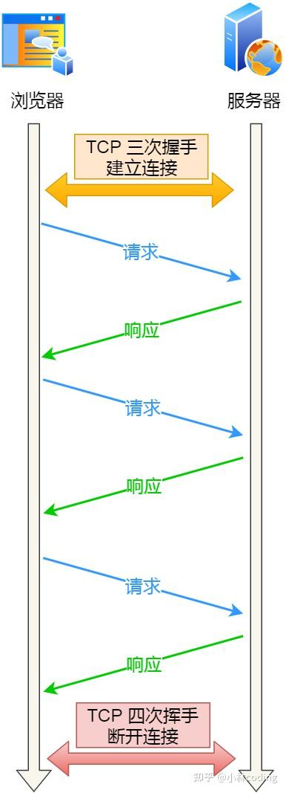
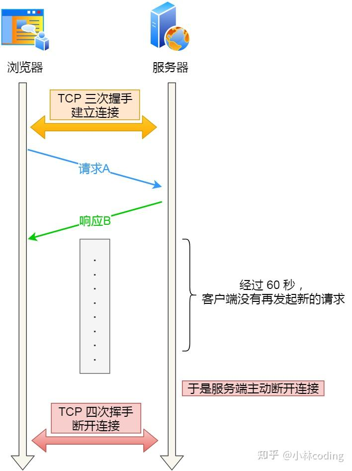
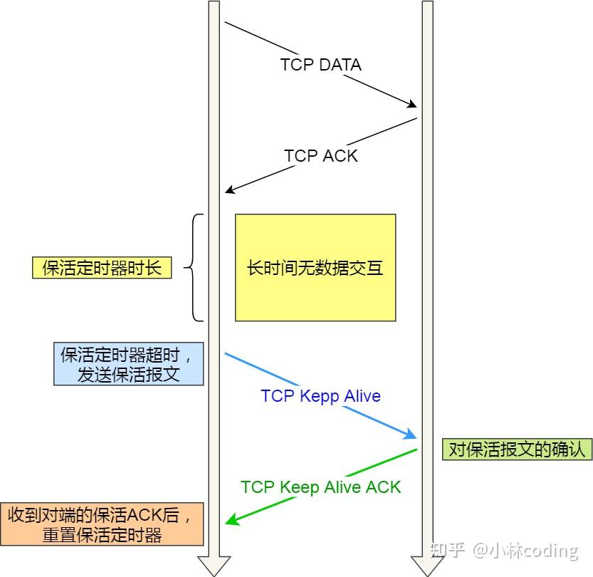
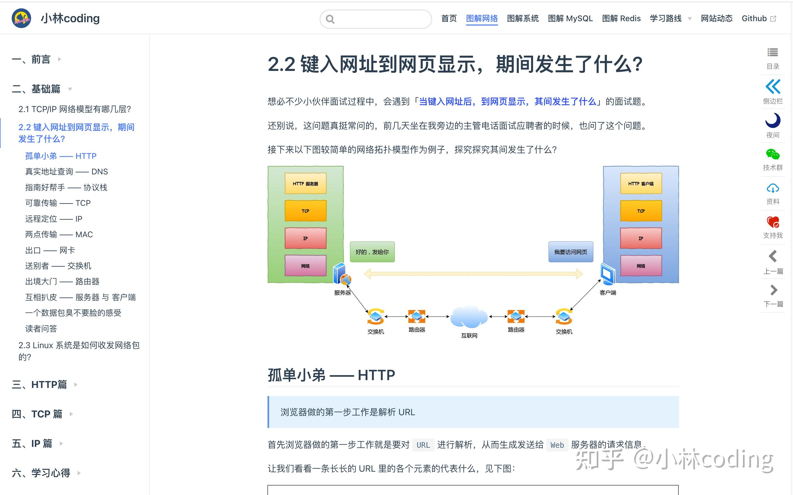

大家好，我是小林。

之前有位读者私信我，他在字节面试时，被问到这两个问题：

-   第一个问题：MySQL 的 NULL 值是怎么存放的？
-   第二个问题：HTTP 长连接和 TCP 长连接有什么区别？

第一个问题，主要是考核你是否清楚 MySQL 一条记录是怎么存储的，我在前几天已经写了一篇文章讲解了，还没看过的同学，可以去看这篇：**[字节一面:MySQL 的 NULL 值是怎么存放的?](https://link.zhihu.com/?target=https%3A//mp.weixin.qq.com/s%3F__biz%3DMzUxODAzNDg4NQ%3D%3D%26mid%3D2247523318%26idx%3D1%26sn%3D7d8f1e436dbc8cdb94b30fde63072218%26scene%3D21%23wechat_redirect)**

第二问题，其实是在问 HTTP 的 Keep-Alive 和 TCP 的 Keepalive 有什么区别？

这是个好问题，应该有不少人都会搞混，因为这两个东西看上去太像了，很容易误以为是同一个东西。

如果认真读过我网站上图解网络系列文章的同学，应该这个问题你们都会，因为我之前就写过。

不过，应该也有不少同学，看过后忘记了，这次就带大家重新复习一波。

事实上，**这两个完全是两样不同东西**，实现的层面也不同：

-   HTTP 的 Keep-Alive，是由**应用层（用户态）** 实现的，称为 HTTP 长连接；
-   TCP 的 Keepalive，是由 **TCP 层（内核态）** 实现的，称为 TCP 保活机制；

接下来，分别说说它们。

## **HTTP 的 Keep-Alive**

HTTP 协议采用的是「请求-应答」的模式，也就是客户端发起了请求，服务端才会返回响应，一来一回这样子。



由于 HTTP 是基于 TCP 传输协议实现的，客户端与服务端要进行 HTTP 通信前，需要先建立 TCP 连接，然后客户端发送 HTTP 请求，服务端收到后就返回响应，至此「请求-应答」的模式就完成了，随后就会释放 TCP 连接。



如果每次请求都要经历这样的过程：建立 TCP -> 请求资源 -> 响应资源 -> 释放连接，那么此方式就是 **HTTP 短连接**，如下图：



这样实在太累人了，一次连接只能请求一次资源。

能不能在第一个 HTTP 请求完后，先不断开 TCP 连接，让后续的 HTTP 请求继续使用此连接？

当然可以，HTTP 的 Keep-Alive 就是实现了这个功能，可以使用同一个 TCP 连接来发送和接收多个 HTTP 请求/应答，避免了连接建立和释放的开销，这个方法称为 **HTTP 长连接**。



HTTP 长连接的特点是，只要任意一端没有明确提出断开连接，则保持 TCP 连接状态。

怎么才能使用 HTTP 的 Keep-Alive 功能？

在 HTTP 1.0 中默认是关闭的，如果浏览器要开启 Keep-Alive，它必须在请求的包头中添加：

```text
Connection: Keep-Alive
```

然后当服务器收到请求，作出回应的时候，它也添加一个头在响应中：

```text
Connection: Keep-Alive
```

这样做，连接就不会中断，而是保持连接。当客户端发送另一个请求时，它会使用同一个连接。这一直继续到客户端或服务器端提出断开连接。

**从 HTTP 1.1 开始， 就默认是开启了 Keep-Alive**，如果要关闭 Keep-Alive，需要在 HTTP 请求的包头里添加：

```text
Connection:close
```

现在大多数浏览器都默认是使用 HTTP/1.1，所以 Keep-Alive 都是默认打开的。一旦客户端和服务端达成协议，那么长连接就建立好了。

HTTP 长连接不仅仅减少了 TCP 连接资源的开销，而且这给 **HTTP 流水线**技术提供了可实现的基础。

所谓的 HTTP 流水线，是**客户端可以先一次性发送多个请求，而在发送过程中不需先等待服务器的回应**，可以减少整体的响应时间。

举例来说，客户端需要请求两个资源。以前的做法是，在同一个 TCP 连接里面，先发送 A 请求，然后等待服务器做出回应，收到后再发出 B 请求。HTTP 流水线机制则允许客户端同时发出 A 请求和 B 请求。

右边为 HTTP 流水线机制

但是**服务器还是按照顺序响应**，先回应 A 请求，完成后再回应 B 请求。

而且要等服务器响应完客户端第一批发送的请求后，客户端才能发出下一批的请求，也就说如果服务器响应的过程发生了阻塞，那么客户端就无法发出下一批的请求，此时就造成了「队头阻塞」的问题。

可能有的同学会问，如果使用了 HTTP 长连接，如果客户端完成一个 HTTP 请求后，就不再发起新的请求，此时这个 TCP 连接一直占用着不是挺浪费资源的吗？

对没错，所以为了避免资源浪费的情况，web 服务软件一般都会提供 `keepalive_timeout` 参数，用来指定 HTTP 长连接的超时时间。

比如设置了 HTTP 长连接的超时时间是 60 秒，web 服务软件就会**启动一个定时器**，如果客户端在完后一个 HTTP 请求后，在 60 秒内都没有再发起新的请求，**定时器的时间一到，就会触发回调函数来释放该连接。**



## **TCP 的 Keepalive**

TCP 的 Keepalive 这东西其实就是 **TCP 的保活机制**，它的工作原理我之前的文章写过，这里就直接贴下以前的内容。

如果两端的 TCP 连接一直没有数据交互，达到了触发 TCP 保活机制的条件，那么内核里的 TCP 协议栈就会发送探测报文。

-   如果对端程序是正常工作的。当 TCP 保活的探测报文发送给对端, 对端会正常响应，这样 **TCP 保活时间会被重置**，等待下一个 TCP 保活时间的到来。
-   如果对端主机崩溃，或对端由于其他原因导致报文不可达。当 TCP 保活的探测报文发送给对端后，石沉大海，没有响应，连续几次，达到保活探测次数后，**TCP 会报告该 TCP 连接已经死亡**。

所以，TCP 保活机制可以在双方没有数据交互的情况，通过探测报文，来确定对方的 TCP 连接是否存活，这个工作是在内核完成的。



注意，应用程序若想使用 TCP 保活机制需要通过 socket 接口设置 `SO_KEEPALIVE` 选项才能够生效，如果没有设置，那么就无法使用 TCP 保活机制。

## **总结**

HTTP 的 Keep-Alive 也叫 HTTP 长连接，该功能是由「应用程序」实现的，可以使得用同一个 TCP 连接来发送和接收多个 HTTP 请求/应答，减少了 HTTP 短连接带来的多次 TCP 连接建立和释放的开销。

TCP 的 Keepalive 也叫 TCP 保活机制，该功能是由「内核」实现的，当客户端和服务端长达一定时间没有进行数据交互时，内核为了确保该连接是否还有效，就会发送探测报文，来检测对方是否还在线，然后来决定是否要关闭该连接。

## 更多网络文章



-   **网络基础篇**

-   [TCP/IP 网络模型有哪几层？](https://link.zhihu.com/?target=https%3A//xiaolincoding.com/network/1_base/tcp_ip_model.html)
-   [键入网址到网页显示，期间发生了什么？](https://link.zhihu.com/?target=https%3A//xiaolincoding.com/network/1_base/what_happen_url.html)
-   [Linux 系统是如何收发网络包的？](https://link.zhihu.com/?target=https%3A//xiaolincoding.com/network/1_base/how_os_deal_network_package.html)

-   **HTTP 篇**

-   [HTTP 常见面试题](https://link.zhihu.com/?target=https%3A//xiaolincoding.com/network/2_http/http_interview.html)
-   [HTTP/1.1如何优化？](https://link.zhihu.com/?target=https%3A//xiaolincoding.com/network/2_http/http_optimize.html)
-   [HTTPS RSA 握手解析](https://link.zhihu.com/?target=https%3A//xiaolincoding.com/network/2_http/https_rsa.html)
-   [HTTPS ECDHE 握手解析](https://link.zhihu.com/?target=https%3A//xiaolincoding.com/network/2_http/https_ecdhe.html)
-   [HTTPS 如何优化？](https://link.zhihu.com/?target=https%3A//xiaolincoding.com/network/2_http/https_optimize.html)
-   [HTTP/2 牛逼在哪？](https://link.zhihu.com/?target=https%3A//xiaolincoding.com/network/2_http/http2.html)
-   [HTTP/3 强势来袭](https://link.zhihu.com/?target=https%3A//xiaolincoding.com/network/2_http/http3.html)
-   [既然有 HTTP 协议，为什么还要有 RPC？](https://link.zhihu.com/?target=https%3A//xiaolincoding.com/network/2_http/http_rpc.html)

-   **TCP 篇**

-   [TCP 三次握手与四次挥手面试题](https://link.zhihu.com/?target=https%3A//xiaolincoding.com/network/3_tcp/tcp_interview.html)
-   [TCP 重传、滑动窗口、流量控制、拥塞控制](https://link.zhihu.com/?target=https%3A//xiaolincoding.com/network/3_tcp/tcp_feature.html)
-   [TCP 实战抓包分析](https://link.zhihu.com/?target=https%3A//xiaolincoding.com/network/3_tcp/tcp_tcpdump.html)
-   [TCP 半连接队列和全连接队列](https://link.zhihu.com/?target=https%3A//xiaolincoding.com/network/3_tcp/tcp_queue.html)
-   [如何优化 TCP?](https://link.zhihu.com/?target=https%3A//xiaolincoding.com/network/3_tcp/tcp_optimize.html)
-   [如何理解是 TCP 面向字节流协议？](https://link.zhihu.com/?target=https%3A//xiaolincoding.com/network/3_tcp/tcp_stream.html)
-   [为什么 TCP 每次建立连接时，初始化序列号都要不一样呢？](https://link.zhihu.com/?target=https%3A//xiaolincoding.com/network/3_tcp/isn_deff.html)
-   [SYN 报文什么时候情况下会被丢弃？](https://link.zhihu.com/?target=https%3A//xiaolincoding.com/network/3_tcp/syn_drop.html)
-   [四次挥手中收到乱序的 FIN 包会如何处理？](https://link.zhihu.com/?target=https%3A//xiaolincoding.com/network/3_tcp/out_of_order_fin.html)
-   [在 TIME\_WAIT 状态的 TCP 连接，收到 SYN 后会发生什么？](https://link.zhihu.com/?target=https%3A//xiaolincoding.com/network/3_tcp/time_wait_recv_syn.html)
-   [TCP 连接，一端断电和进程崩溃有什么区别？](https://link.zhihu.com/?target=https%3A//xiaolincoding.com/network/3_tcp/tcp_down_and_crash.html)
-   [拔掉网线后， 原本的 TCP 连接还存在吗？](https://link.zhihu.com/?target=https%3A//xiaolincoding.com/network/3_tcp/tcp_unplug_the_network_cable.html)
-   [tcp\_tw\_reuse 为什么默认是关闭的？](https://link.zhihu.com/?target=https%3A//xiaolincoding.com/network/3_tcp/tcp_tw_reuse_close.html)
-   [HTTPS 中 TLS 和 TCP 能同时握手吗？](https://link.zhihu.com/?target=https%3A//xiaolincoding.com/network/3_tcp/tcp_tls.html)
-   [TCP Keepalive 和 HTTP Keep-Alive 是一个东西吗？](https://link.zhihu.com/?target=https%3A//xiaolincoding.com/network/3_tcp/tcp_http_keepalive.html)
-   [TCP 有什么缺陷？](https://link.zhihu.com/?target=https%3A//xiaolincoding.com/network/3_tcp/tcp_problem.html)
-   [如何基于 UDP 协议实现可靠传输？](https://link.zhihu.com/?target=https%3A//xiaolincoding.com/network/3_tcp/quic.html)
-   [TCP 和 UDP 可以使用同一个端口吗？](https://link.zhihu.com/?target=https%3A//xiaolincoding.com/network/3_tcp/port.html)
-   [服务端没有 listen，客户端发起连接建立，会发生什么？](https://link.zhihu.com/?target=https%3A//xiaolincoding.com/network/3_tcp/tcp_no_listen.html)
-   [没有 accpet，可以建立 TCP 连接吗？](https://link.zhihu.com/?target=https%3A//xiaolincoding.com/network/3_tcp/tcp_no_accpet.html)
-   [用了 TCP 协议，数据一定不会丢吗？](https://link.zhihu.com/?target=https%3A//xiaolincoding.com/network/3_tcp/tcp_drop.html)

-   **IP 篇**

-   [IP 基础知识全家桶](https://link.zhihu.com/?target=https%3A//xiaolincoding.com/network/4_ip/ip_base.html)
-   [ping 的工作原理](https://link.zhihu.com/?target=https%3A//xiaolincoding.com/network/4_ip/ping.html)

-   **学习心得**

-   [计算机网络怎么学？](https://link.zhihu.com/?target=https%3A//xiaolincoding.com/network/5_learn/learn_network.html)
-   [画图经验分享](https://link.zhihu.com/?target=https%3A//xiaolincoding.com/network/5_learn/draw.html)