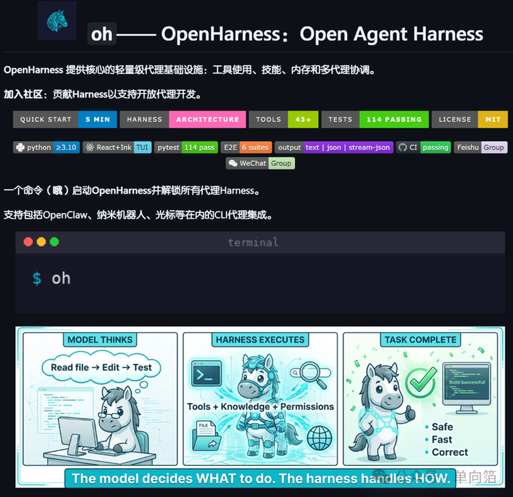
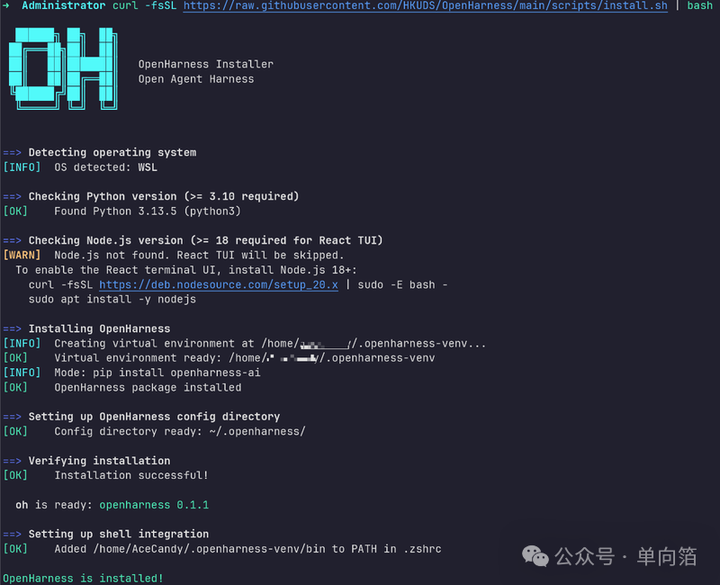
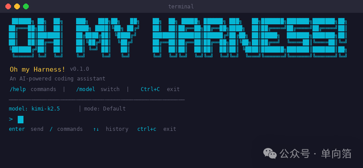
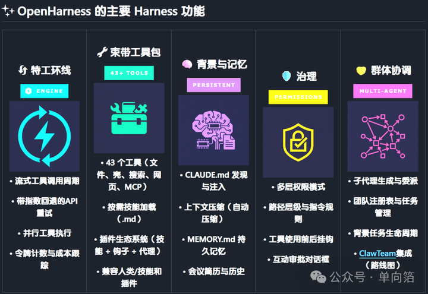

如果之前看过我写的 Harness 相关内容，那这篇我就不再重复解释“什么是 Harness”了。

这次介绍的是一个新开源项目：**OpenHarness**。

香港大学数据科学研究所（HKUDS） 开源的 OpenHarness，4 月 1 日刚发布、已斩获 5k+ Star，还在飞速攀升。

一开始我以为会是又一个新的 Harness 框架，但我实际看了才发现根本不一样。

不同于之前我介绍的 OpenSpec、ECC、Trellis 这类项目。OpenHarness 本身就是一套可运行的、实现 Harness 架构的 Agent Runtime。

说得再简单一些，你可以理解成是**更类似于 ClaudeCode/Codex，但是又在上层直接集成了 Harness 的新 TUI**。

当然，身为 cc/codex 党，暂时还没有切换工具的打算。

所以我看到的第一反应不是“OpenHarness 能帮我做到什么程度”，而是：

**又出现了一个可以认真拆架构的 Harness 实现。**

* * *

## 先做个整体介绍

它的项目Readme直接写了它的定位：**Open Agent Harness**。

从公开资料看，这个项目覆盖的不是单点能力，而是一整套 Agent 运行时链路：Agent Loop、43+ 工具、Skills、Memory、权限、Hooks、Tasks、多代理协调、CLI/TUI、插件生态系统。

  



我看这类项目有个很朴素的习惯：

先不听它讲得多牛逼，先看三件事——**实际上手难度、支持什么能力、能做到什么程度**

OpenHarness 在这三件事上，至少第一眼看过去是成立的。

它的结构也比较清楚，没有那种“功能很多，但不知道核心在哪”的感觉。项目里基本能看到几层很明确的划分：

-   `engine`：负责 Agent Loop  
    
-   `tools`：负责工具注册和执行  
    
-   `skills`：负责按需加载知识  
    
-   `plugins`：负责扩展  
    
-   `permissions` / `hooks`：负责治理  
    
-   `memory` / `tasks` / `coordinator`：负责长期运行和协作  
    
-   `ui`：负责 CLI 和 TUI  
    

说白了，它不是在回答“怎么做一个会调工具的聊天框”，而是在回答：

**如果把 Agent 当成一个真正的系统，它的 Harness 底座应该怎么搭。**

* * *

## 先说安装和上手

最简单的安装方式是一条脚本：

```text
curl -fsSL https://raw.githubusercontent.com/HKUDS/OpenHarness/main/scripts/install.sh | bash
```

如果你想直接从源码装，也可以：

```text
git clone https://github.com/HKUDS/OpenHarness.git
cd OpenHarness
uv sync --extra dev
```

依赖要求也比较标准，这些如果缺失的可以自行安装：

-   Python 3.10+  
    
-   `uv`
-   Node.js 18+（如果要用 React TUI）  
    
-   一个可用的模型 API Key  
    

  



后面按照终端的提示，或者在~/.openharness/settings.json 目录中进行环境配置。

```text
# 这里是举例了kimi的接入
export ANTHROPIC_BASE_URL=https://api.moonshot.cn/anthropic
export ANTHROPIC_API_KEY=your_kimi_api_key
export ANTHROPIC_MODEL=kimi-k2.5
```

这里说一个坑，由于现在项目刚刚开始发展，版本号还处于 0.1.x 版本。如果你想试用的话，我建议主要使用 Linux/MacOS，至少截止4月6号，我自己在 Windows 上，包括 WSL 上都尝试了会报错。

* * *

## 不只局限于做个聊天壳

最直接的方式就是进交互模式：

```text
uv run oh

或者venv启动的话可以直接使用 oh 指令进入
```

  



如果你只是想丢一个 Prompt 测试，也很简单：

```text
oh -p "解释这个代码库"
```

如果你想把它接到自动化流程里，它也支持结构化输出：

```text
oh -p "列出main.py中的所有函数" --output-format json
```

或者流式 JSON：

```text
oh -p "解决登录失败的问题" --output-format stream-json
```

这一点我还算是比较有意思。

因为很多项目的实际使用方式还是停留在“命令行聊天”，OpenHarness 至少已经把几种典型场景都考虑进去了：

-   人在回路里的交互式使用  
    
-   shell 脚本里的自动化调用  
    
-   程序对程序的结构化消费  
    

* * *

## Provider 支持

OpenHarness 支持三种主流供应商 API 形态：

-   Anthropic  
    
-   OpenAI-compatible  
    
-   GitHub Copilot  
    

以我们最常用的 OpenAI 兼容模式为例，你可以这么切：

```text
uv run oh --api-format openai \
  --base-url "https://dashscope.aliyuncs.com/compatible-mode/v1" \
  --api-key "sk-xxx" \
  --model "qwen3.5-flash"
```

也可以走环境变量（当然也可以像前面说的在配置文件中配置）：

```text
export OPENHARNESS_API_FORMAT=openai
export OPENAI_API_KEY=sk-xxx
export OPENHARNESS_BASE_URL=https://dashscope.aliyuncs.com/compatible-mode/v1
export OPENHARNESS_MODEL=qwen3.5-flash
uv run oh
```

不局限于单一模型的这个思想，其实有点类似 OpenCode，但是又有些许不同。至少没有把自己绑死在某个模型供应商上。

* * *

## 特色能力部分

  



OpenHarness 官方文档里已经比较清楚列举了，整体还是以 Harness 体系构建为核心，我就直接拿来了。

### 🔧 工具（43+）

  

| 类别 | 工具 | 描述 |
| ----- | ----- | ----- |
| 文件输入输出 | 敲击、阅读、写作、编辑、glob、grep | 带权限检查的核心文件操作 |
| 搜索 | WebFetch、WebSearch、ToolSearch、LSP | 网页和代码搜索功能 |
| 笔记本 | 笔记编辑 | Jupyter笔记本单元编辑 |
| 代理人 | 代理、发送消息、TeamCreate/Delete | 子代理生成与协调 |
| 任务 | 任务创建/获取/列表/更新/停止/输出 | 后台任务管理 |
| MCP | MCPTool，ListMcpResources，ReadMcpResource | 模型上下文协议集成 |
| 模式 | 进入计划模式、退出计划模式、工作树 | 工作流程模式切换 |
| 赛程 | CronCreate/List/Delete， RemoteTrigger | 定时执行与远程执行 |
| 元文化 | 技能、配置、简报、睡眠、AskUser | 知识加载、配置与交互 |

  

每个工具都具备：

-   **pydantic 输入验证**——结构化、类型安全输入  
    
-   **自描述 JSON 模式**——模型会自动理解工具  
    
-   **权限集成**——每次执行前检查  
    
-   **钩子支持** — PreToolUse/PostToolUse 生命周期事件  
    

### 📚 技能系统

技能是**按需知识**——仅在模型需要时加载：

```text
Available Skills:
- commit: Create clean, well-structured git commits
- review: Review code for bugs, security issues, and quality
- debug: Diagnose and fix bugs systematically
- plan: Design an implementation plan before coding
- test: Write and run tests for code
- simplify: Refactor code to be simpler and more maintainable
- pdf: PDF processing with pypdf (from anthropics/skills)
- xlsx: Excel operations (from anthropics/skills)
- ... 40+ more
```

**兼容人类/技能**——只需复制文件到。`.md``~/.openharness/skills/`

### 🔌 插件系统

**兼容 claude 代码插件**。测试了 12 个官方插件：

  

| 插件 | 类型 | 它的作用 |
| ----- | ----- | ----- |
| commit-commands | 指挥 | git提交、推送、PR工作流程 |
| security-guidance | 钩子 | 文件编辑的安全警告 |
| hookify | 命令 + 代理 | 创建自定义行为钩子 |
| feature-dev | 指挥 | 功能开发工作流程 |
| code-review | 代理人 | 多代理PR评审 |
| pr-review-toolkit | 代理人 | 专业的PR审核代理 |

  

```text
# Manage plugins
oh plugin list
oh plugin install <source>
oh plugin enable <name>
```

### 🤝 生态系统工作流程

OpenHarness 作为轻量级束层，适用于 Claude 风格的工具约定：

-   **面向OpenClaw的工作流程**可以重用Markdown优先的知识和命令驱动的协作模式。  
    
-   **Claude风格的插件和技能**保持可移植性，因为OpenHarness让这些格式保持熟悉。  
    
-   **ClawTeam 风格的多智能体工作**很好地映射到内置的团队、任务和背景执行原语。  
    

关于具体的使用建议而非泛泛的声明，请参见`docs/SHOWCASE.md`。

### 🛡️ 权限

多级安全与细粒度控制：

  

| 模式 | 行为 | 使用场景 |
| ----- | ----- | ----- |
| 默认 | 写/执行前先问问 | 日常发展 |
| 自动 | 允许一切 | 沙盒环境 |
| 计划模式 | 阻止所有写入 | 大型重构，先复习 |

  

**路径层级规则**在：`settings.json`

```text
{
  "permission": {
    "mode": "default",
    "path_rules": [{"pattern": "/etc/*", "allow": false}],
    "denied_commands": ["rm -rf /", "DROP TABLE *"]
  }
}
```

### 🖥️ 终端用户界面

React/Ink TUI 提供完整互动体验：

-   **命令选择器**：输入→方向键选择 → 进入`/`
-   **权限对话框**：互动 y/n 含工具详情  
    
-   **模式切换器**：→从列表中选择`/permissions`
-   **会议简历**：→历史中的精选`/resume`
-   **动画旋转器**：工具执行过程中的实时反馈  
    
-   **键盘快捷键**：底部显示，上下文感知  
    

### 📡 CLI

```text
oh [OPTIONS] COMMAND [ARGS]

Session:     -c/--continue, -r/--resume, -n/--name
Model:       -m/--model, --effort, --max-turns
Output:      -p/--print, --output-format text|json|stream-json
Permissions: --permission-mode, --dangerously-skip-permissions
Context:     -s/--system-prompt, --append-system-prompt, --settings
Advanced:    -d/--debug, --mcp-config, --bare

Subcommands: oh mcp | oh plugin | oh auth
```

* * *

## 关于和同类产品的比较

既然是一整套 TUI 工具，比较的当然就是 Claude Code、OpenCode 了。  
开发者是这么说的：**OpenHarness** = **Claude Code 级别的 agent 能力** + **多 provider 支持** + **多 channel 接入** + **harness engineering 自动化验证**

  

| · | Claude Code / OpenCode | OpenHarness |
| ----- | ----- | ----- |
| 定位 | Terminal AI coding assistant | Agent Harness framework |
| 核心 | 单 agent 对话 | 多 agent 编排 (swarm coordinator + in-process teammates) |
| provider | 绑定单一 provider | 24+ LLM provider 注册表 (Anthropic/OpenAI/DeepSeek/Gemini/Kimi/Ollama...) |
| channels | 仅 CLI | CLI + 11 种 IM channel (Telegram/Slack/Discord/飞书/钉钉/微信...) |
| 可编程性 | 有限 (hooks + MCP) | 完整 (hooks + skills + plugins + agent definitions + permission sync) |
| 验证 | 无 | harness-eval: 在陌生代码库上用真实 API 跑端到端验证 |

  

### 关键差异化能力

-   **Harness Engineering 方法论**：不是"写代码然后手动测"，而是：spawn agent → 自动执行 → 自动验证 → 报告结果。整个开发循环都在 harness 内完成。  
    
-   **Swarm 多 agent 协作**：支持 coordinator 编排多个 in-process teammate 并发工作，不是只有单个 agent 独立对话。  
    
-   **Provider 无关**：同一套 harness 可以跑在 Claude、GPT、Kimi、DeepSeek、Gemini、本地 Ollama 等任何 LLM 上。OpenAI-compatible endpoint 开箱即用。  
    
-   **快速扩充中**：现阶段直接对标 Claude Code 的核心能力（从其源码提取转写），同时在快速扩展到更多应用场景：  
    
-   类 openclaw 的 auth 管理  
    
-   IM channel 集成（可以通过 Telegram/Slack 等使用）  
    
-   一键安装 (`curl | bash`)  
    
-   可换肤 TUI  
    

* * *

## 写在最后

为什么会关注 OpenHarness，不是我觉得它是标准答案，而是看看这个项目能不能给我带来新的思路。

如果你之前已经理解了 Harness 的重要性，那这次看 OpenHarness，重点就不该还是停留在“哦，原来 Harness 很重要”。

更值得看的，其实是：**一个新的开源团队，正在怎么把 Harness 真正做成系统。**

团队里到底如何推进构建，这个最终形态到底是什么样子，现在我还不清楚。

究竟是通过团队自己整理出一份自己的 Harness 架构组成清单呢，还是找到接入一套够轻量成熟完备的 Harness 框架？亦或是连入口工具都统一，OpenHarness 这种整合了 Harness 的入口工具？

像我以前的文章里说的，没有所谓的“标准答案”。

至少现在还没有。

OpenHarness 当然还早，可能现在连正常使用起来都费劲。

但至少它给了我们一个新的思考方向。

对我来说，这就够了。