**工欲善其事，必先利其器！**

就在不久之前，Java领域的开发神器`IntelliJ IDEA`终于迎来2021年的一个重要的大版本更新：`IntelliJ IDEA 2021.1`。

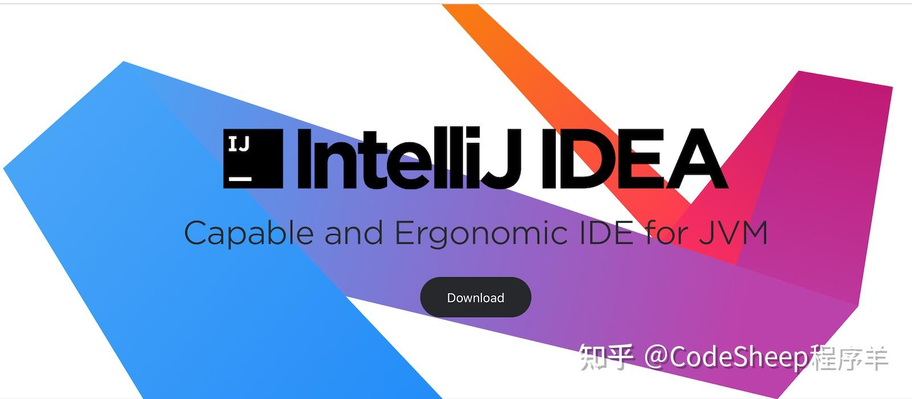

现如今大量的Java开发者深度依赖着这款开发软件，正如网上的段子所言：“可以毫不夸张地说，多少Java程序员离开了IDEA就不会写代码了（狗头）”，由此可见其使用的广泛程度。

新版本一出来，我也迫不及待地想尝试一番。当然，主力开发机我是不敢乱升级的，所以这两天，我在一台平时用来做测试的老开发本子上更新了全新的IDEA。

软件启动界面打开的那一瞬间，我就知道事情并不简单。

> 本文 GitHub **[https://github.com/rd2coding/Road2Coding](https://link.zhihu.com/?target=https%3A//github.com/rd2coding/Road2Coding)** 已经收录，里面有我整理的6大编程方向的自学路线+知识点详细梳理+面试题+简历+资源+配套硬核pdf，以及我的程序员人生。  
> ”

* * *

## **全新的启动页面**

更新后，全新的启动页面更加花里胡哨了。

软件启动速度也是非常之快，就我这多年苦练的火箭般手速，都差点没截来下面这张启动页面图。

* * *

## **Space集成**

JetBrains提供的Space这个功能不知道大家有没有听说过，讲白了就是一套集成的团队协作环境，可以提供包括构建交付、聊天协作、团队管理以及项目管理等在内的一整套协作一体化解决方案。

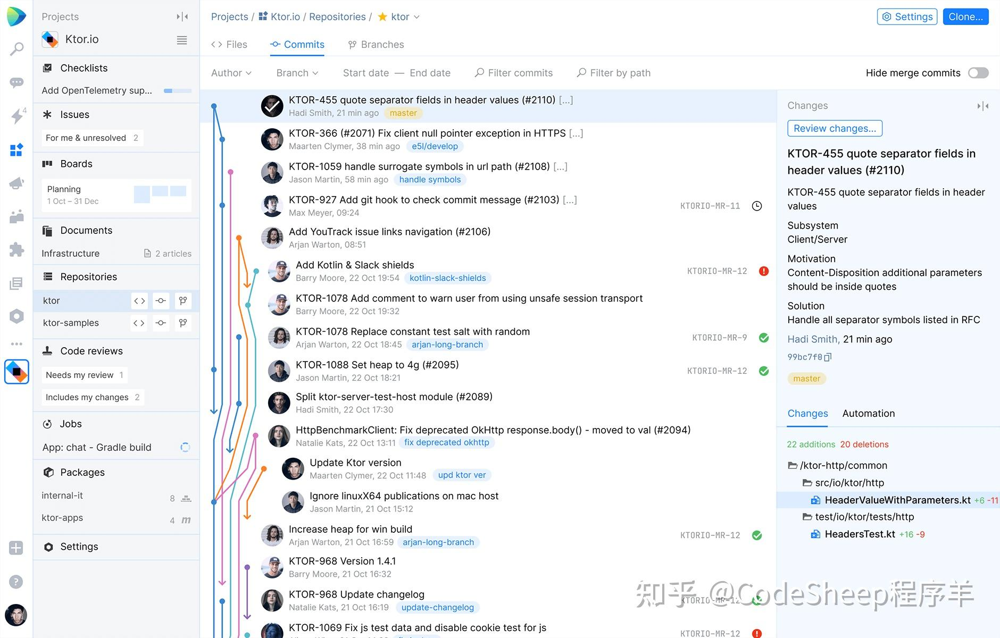

最新的IDEA 2021.1把Space环境给无缝地集成进来了，现在属于开箱即用的状态，软件的右上角就有快捷入口：

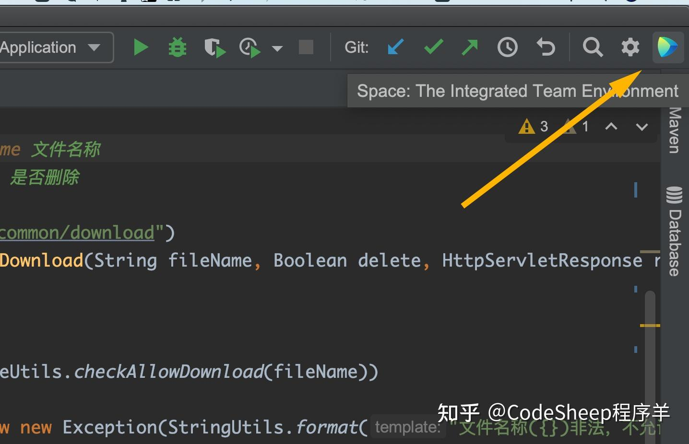

* * *

## **支持WSL 2**

这个功能相信对于很多依赖Windows系统以及WSL功能的用户来说，简直是喜大普奔！

以前WSL就算再好用，但是你的IDE并没有和它打通，多少总是一个遗憾。

这下好了，二者直接打通了，IDEA支持WSL 2。你可以直接在新版IDEA 2021.1中运行并开发WSL 2中的Java项目，包括Gradle类型项目和Maven类型等项目均支持。

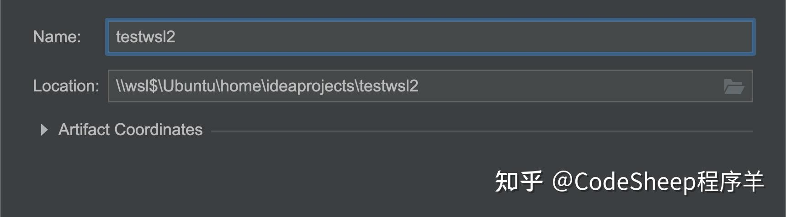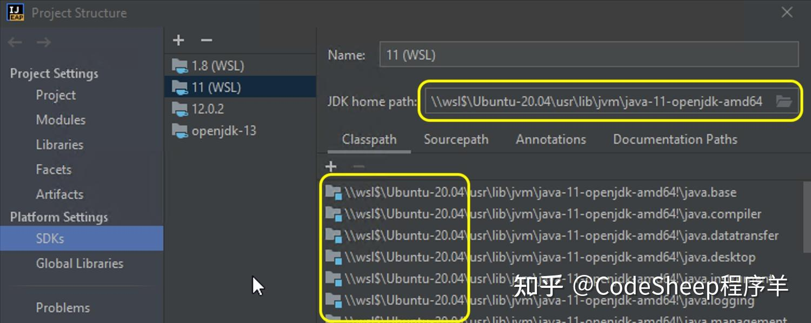

* * *

## **Run Targets**

Run Targets这个功能的意思有点类似于上面刚聊过的WSL 2。它允许开发者直接在远程主机甚至在Docker容器上运行和调试项目。

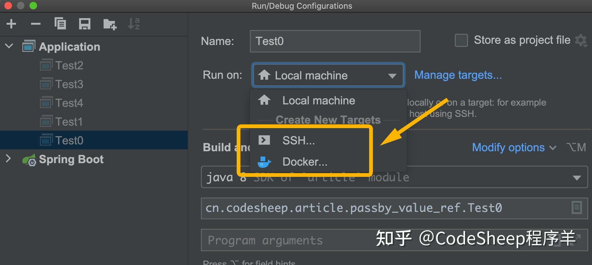

所以到目前为止，新版IDEA 2021允许开发者可以在本地、WSL 2、SSH远程主机、Docker等目标上运行项目，可以说贼香了！

* * *

## **支持Java 16**

这也算是一个比较重磅的更新。

近两年来，Java版本的发布速度也是快如老狗，我还在用Java 8，它都淦到Java 16了。

关于Java 16的新特性，我还准备写篇文章来详细聊一聊呢，包括比如：

-   Records特性转正
-   instanceof模式匹配转正
-   jpackage转正
-   Unix域套接字通道
-   弹性Metaspace
-   ZGC
-   矢量API
-   外部链接API
-   ...

这次IDEA 2021版的一个很重要的更新就是加入了对Java 16的基本支持，注意是基本支持。

除此之外IDEA还新增了几项检查机制，典型比如更加智能的数据流分析检查。

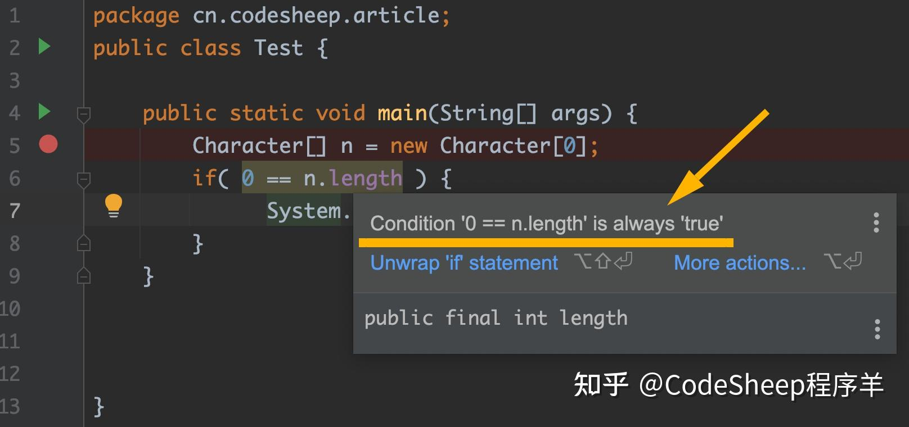

链式构造方式的优化格式设置等等。

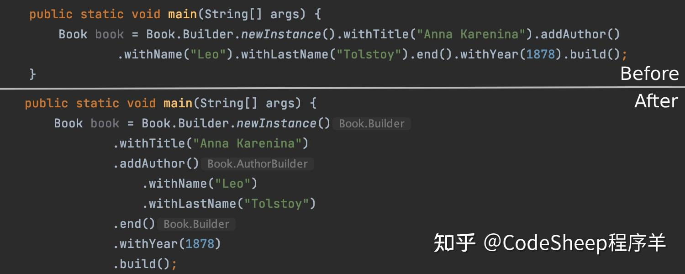

目的都是为了帮助提升可读性，进一步提升用户体验。

* * *

## **Code With Me**

Code With Me是一项用于协作开发与结对编程的服务，可以实现`Host-Guest`模式的“手摸手”（滑稽）结对编程和群体编程。

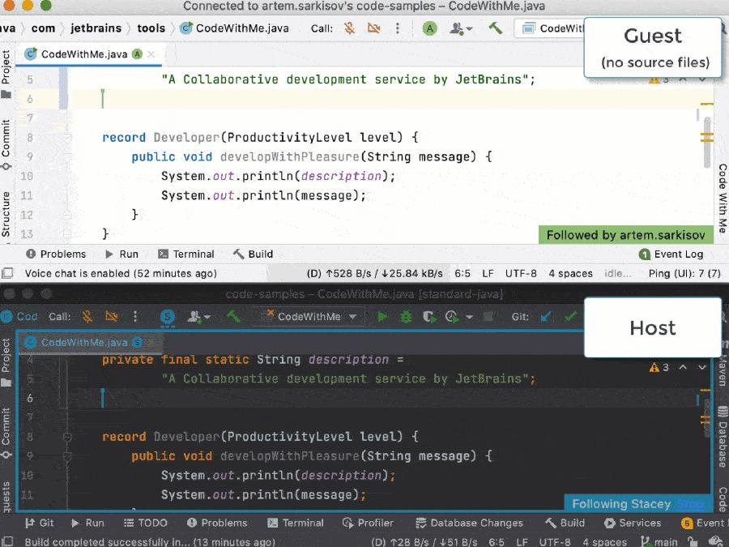

目前，新版IDEA开箱即用地支持了Code With Me功能，同时它还具有音频通话和视频通话功能，可以满足随时随地的沟通需求，这操作简直骚到爆。

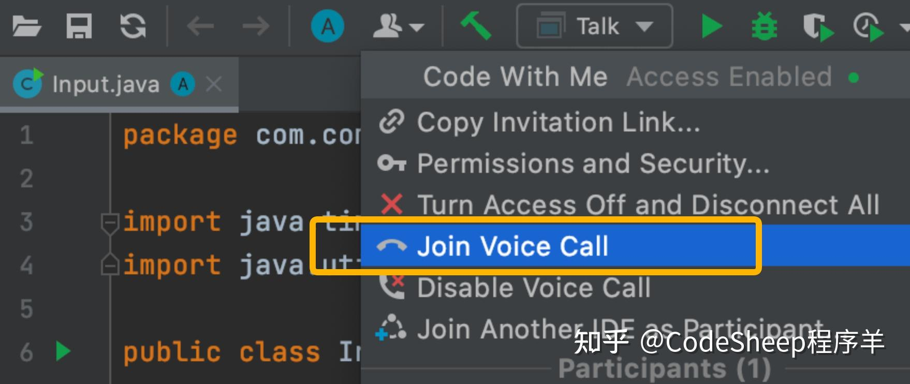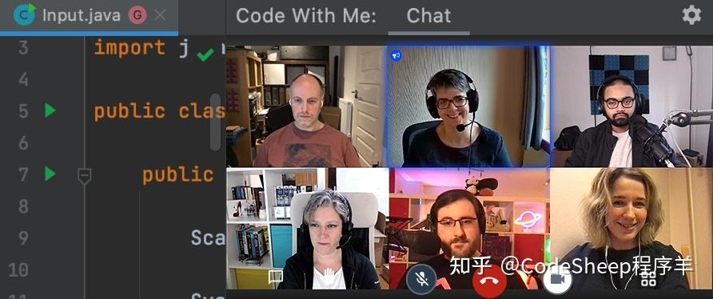

* * *

## **版本控制**

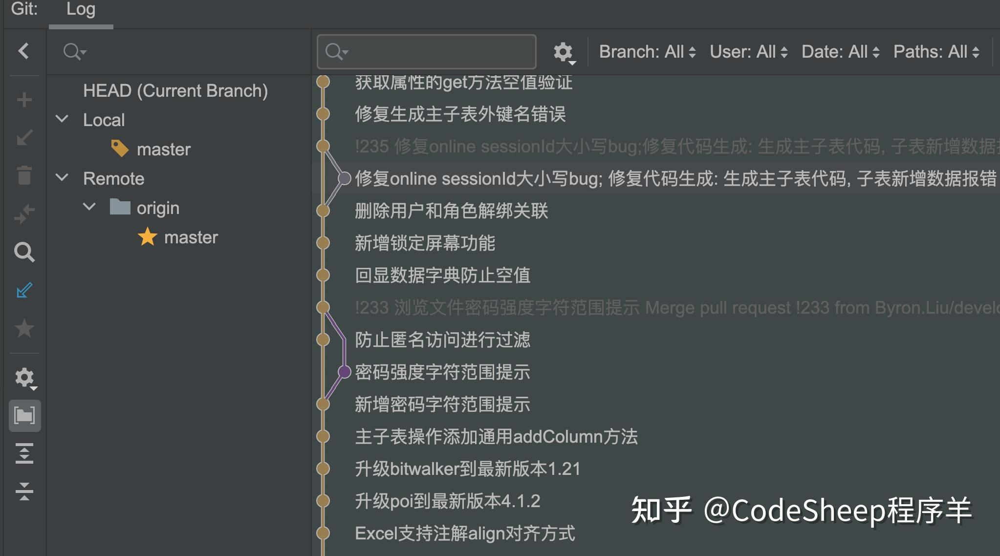

版本控制这一块目前做了不少的更新，包括可以更快地完成PR的创建提交，支持PR模板。

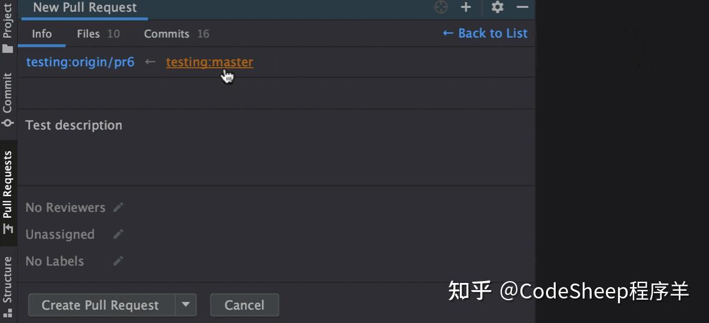

变更提交至代码库前的自定义代码检查配置。

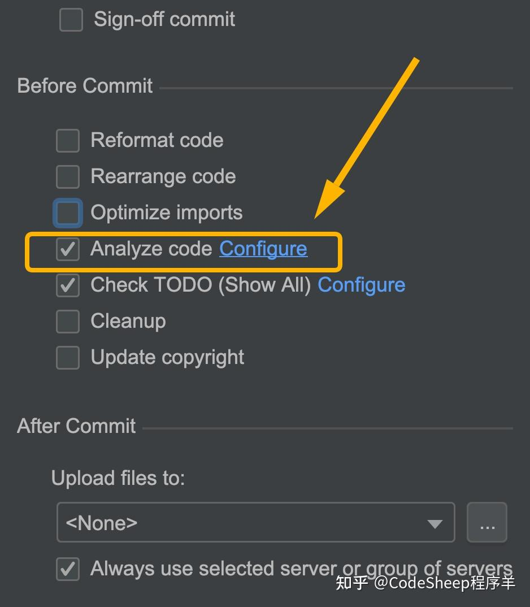

以及支持自定义Git提交模板等等。

* * *

## **其他用户体验提升**

## **IDEA内置HTML网页预览**

以前在IDEA中预览网页得跳到外部浏览器，而现如今IDE的编辑器内部就支持`Built-in`级别的网页预览，只需要在右上角点那个IDEA小图标即可激活，而且可以编辑网页源码时做到同步更新和预览。

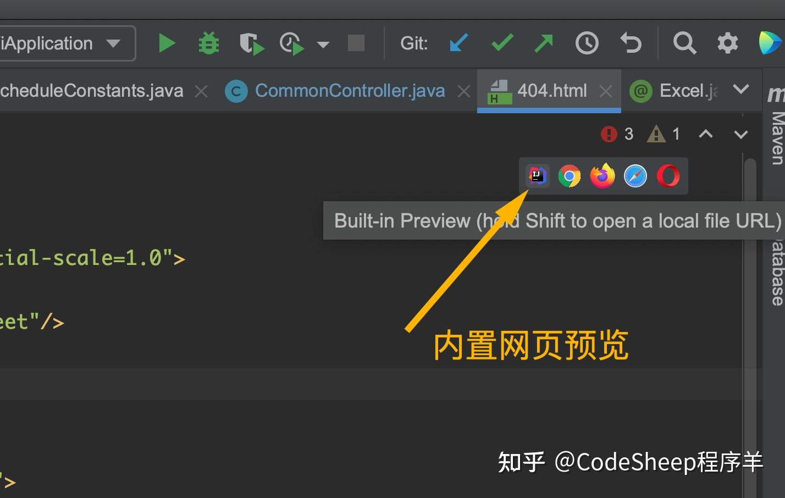

## **Windows版本任务栏增强**

在Windows平台的新版IDEA上，可直接在任务栏（或开始菜单）上右键快捷呼出最近使用的项目。

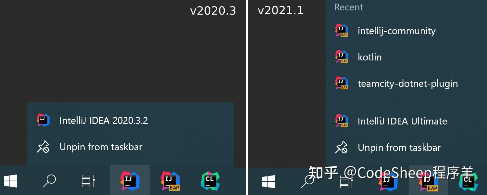

## **搜索时自定义外部依赖项**

讲白了，就是使搜索范围更易于自定义，我们可以直接在设置中进行Scope定义，自行选择External Dependencies的范围是否包含。

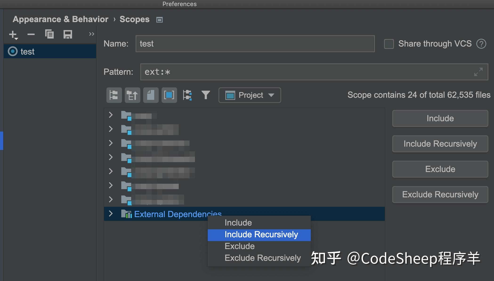

## **窗口拆分优化**

当你对编辑器里的多个文件进行垂直窗口拆分时，双击某个Tab就可以将当前文件窗口最大化，再次双击Tab则会还原。

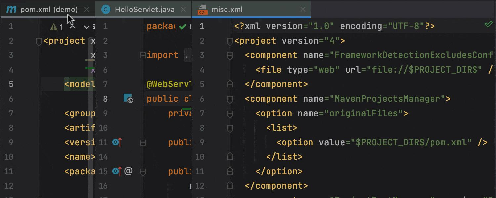

* * *

当然除了这些之外，新版IDEA还新增了很多更新和增强，比如：对Kotlin、Scala、JavaScript等语言的开发优化、对常见框架与技术的优化和支持、对Kubernetes和Docker的更新支持和改进、数据库工具的更新支持等等，由于时间有限，在此就不一一赘述了，有需要的可以按需细究。

最后，让我们一起大喊一句：“IDEA，yyds！”

* * *

## **后 记**

最近花了大把力气，把自用的编程学习资源做了个大整理。

都是纯肝货，目录如下，有需要的可以自取。

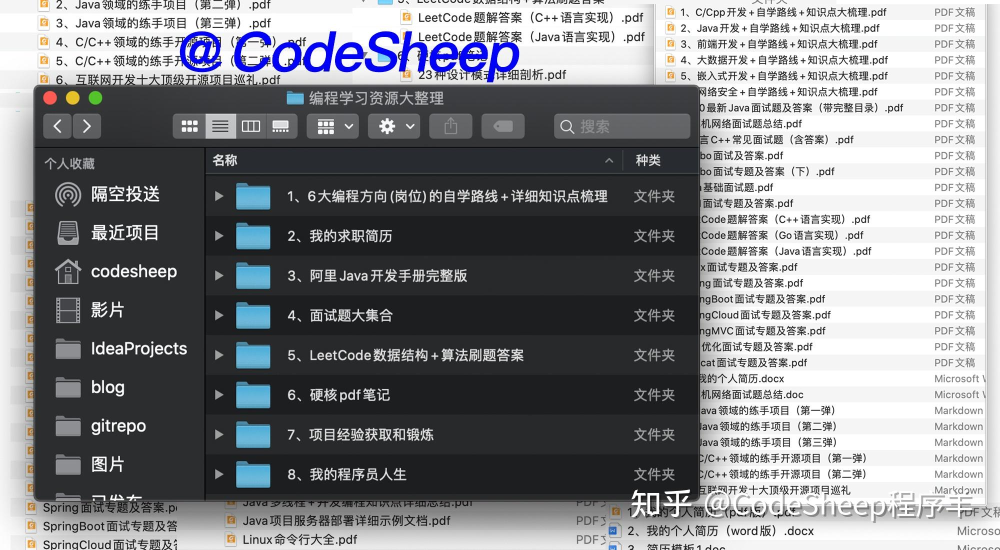

-   链接：[https://pan.baidu.com/s/1jEjcF96iVAXEXaadE1V6RQ](https://link.zhihu.com/?target=https%3A//pan.baidu.com/s/1jEjcF96iVAXEXaadE1V6RQ)
-   提取码：f23d

整理不易，白瞟不好，记得三连支持一波哇。

> 本文 GitHub **[https://github.com/rd2coding/Road2Coding](https://link.zhihu.com/?target=https%3A//github.com/rd2coding/Road2Coding)** 已经收录，里面有我整理的**6大编程方向的自学路线+知识点大梳理**、**我的简历**、**面试考点**、**几本硬核pdf笔记**，以及**我的程序员人生**，欢迎star。  
> ”