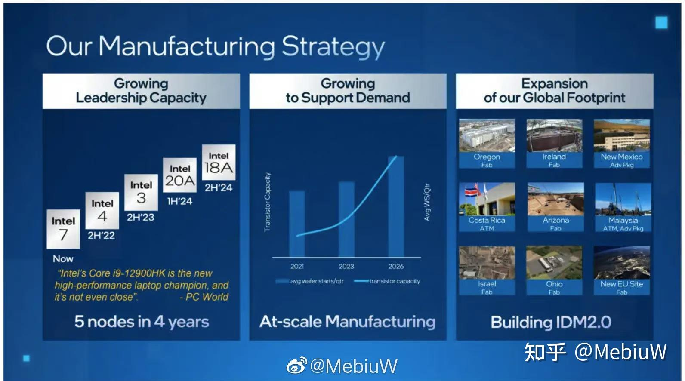
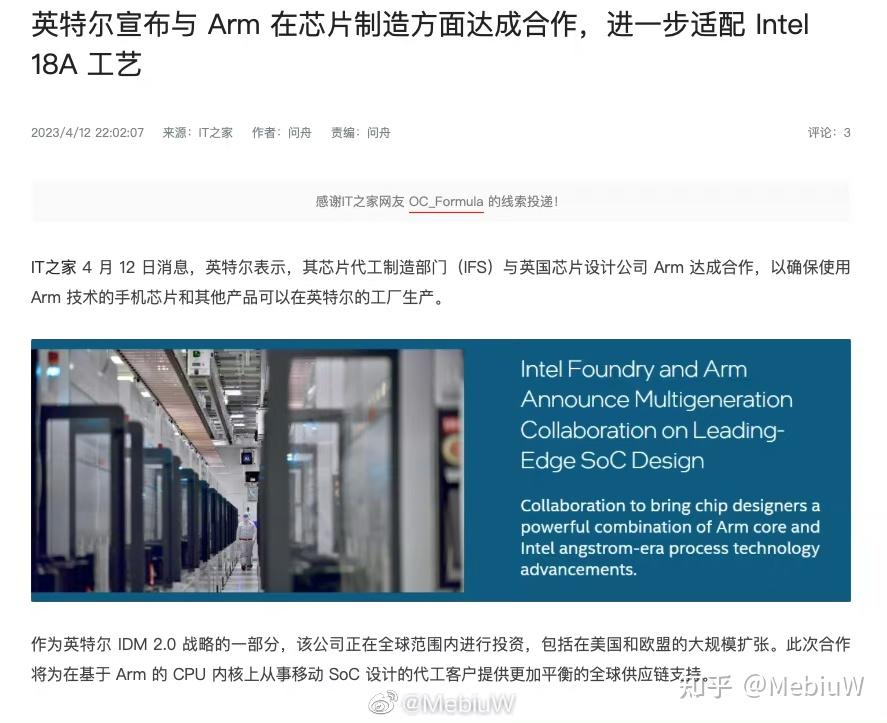

intel的20A/18A这个节点，对于Intel来说意义非凡，如果没有大的延误，Intel过后就是Intel 2.0了。

[聊聊为什么Intel的5nm GAA工艺20A/18A规划激进？](https://zhuanlan.zhihu.com/p/612344696)

首先从技术上说，这个节点的规划进度是领先于台积电N2的，20A，18A规划明年2024量产，反正只要2025能出商用，那么就领先台积电了。

不过最重要的还是18A这个外部节点上，Intel的客户数量和代工达到了一个新高度，开始正式和台积电竞争。

所以Intel能否按时完成，真的太重要了。