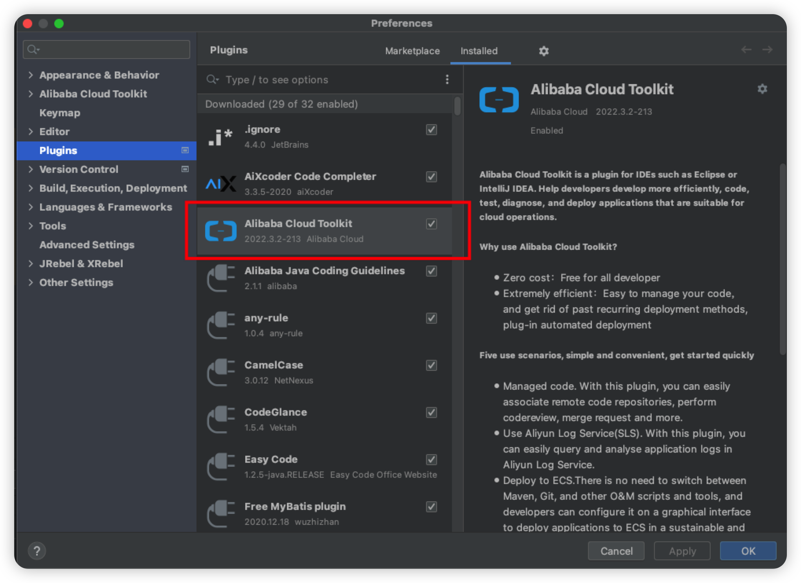
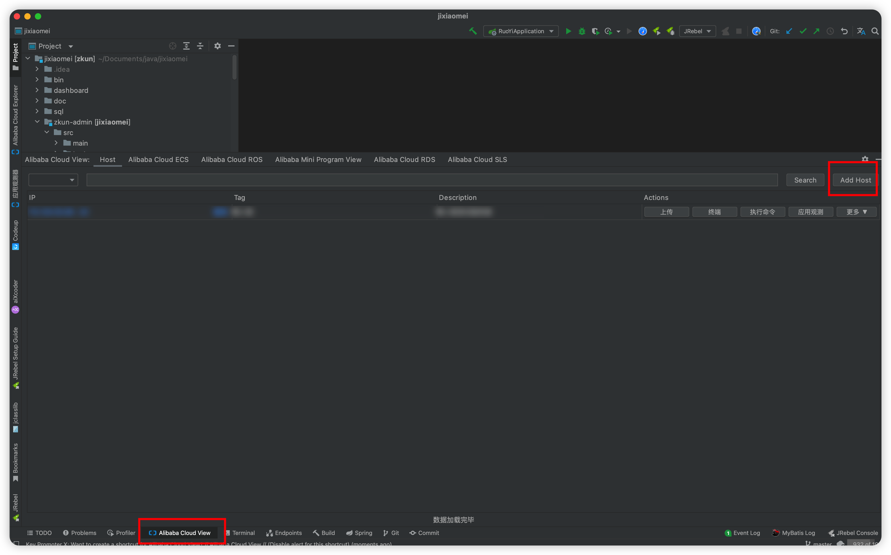
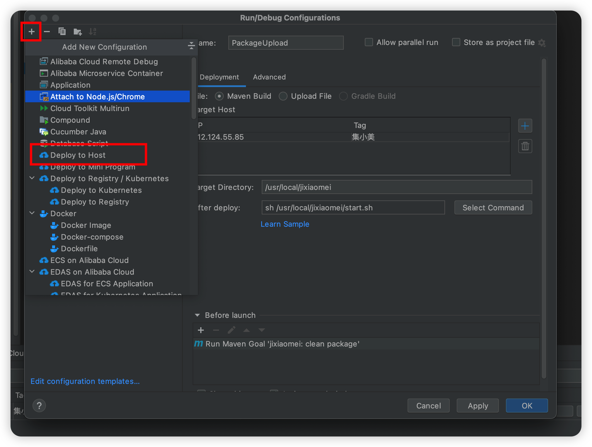
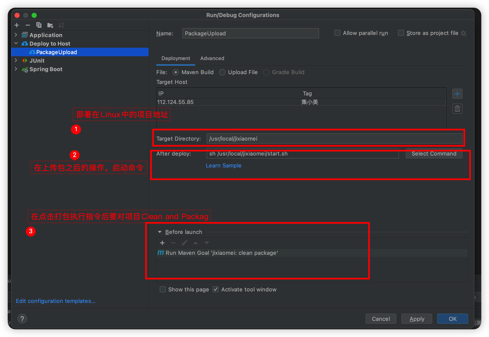
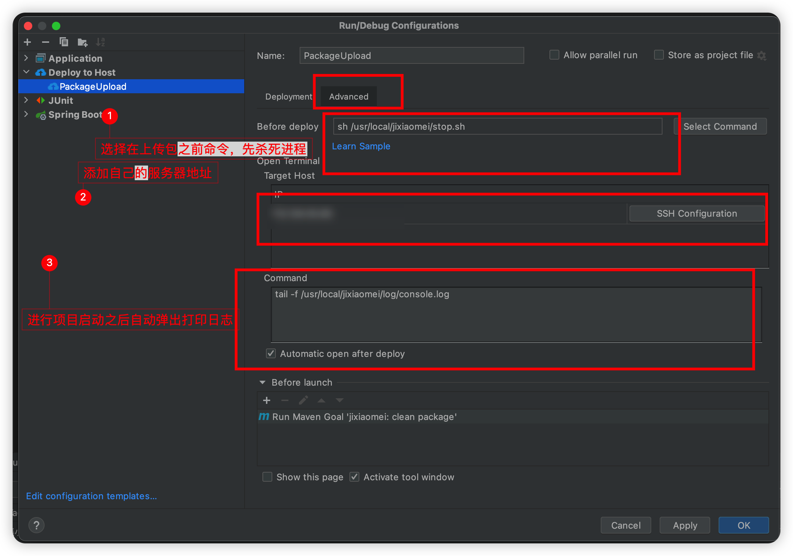
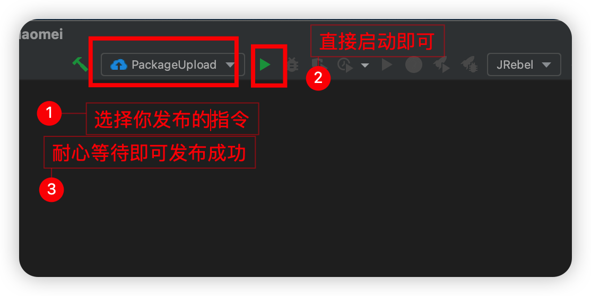
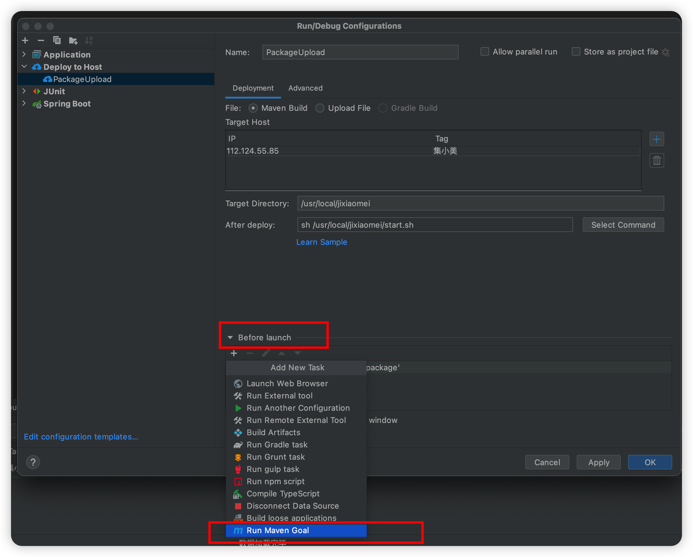
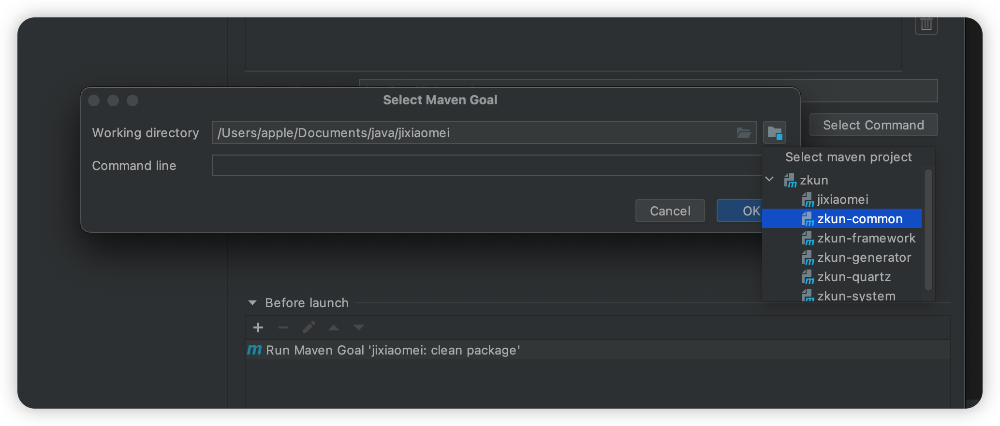

## IDEA自动部署项目

### 1.使用背景

1.如果是项目没有集成Jenkins

2.需要频繁手动打包，然后上传jar，然后启动项目

3.小型项目适用

4.公司项目中没有自己的发布平台，自己也可以研究提升自己的发布效率

### 2.使用方式

1.  IDEA中下载插件

1.  下载之后打开AliBaba cloud view然后Add Host

1.  因为其内置了ssh连接工具终端直接就是ssh页面
2.  配置发布操作

  

  

  

**总结**

-   1.构建打包指令，选择配置项目clean ,package
-   2.选择自己的服务器地址
-   3.配置你要上传到Linux中的地址
-   4.配置你在上传之前之后的命令脚本。其实和jenkins一样差不多
-   5.之前肯定是杀死进程，之后肯定是启动项目，同时配置日志同步打印
-   6.启动部署，完成发布
-   7.如果是多项目依赖的操作，需要在Beftore Lauch中点击加号Run Maven Goal ，然后选择你具体要对那个模块进行打包部署

