**提升？看代码啊，不用看什么spring啊netty之类的庞然大物，说几个力所能及的库，可以好好研究。知识是有索引的，看到不懂得就去查慢慢就提升了。**

1.  lombok，看看怎么实现的，这个牵涉java的编译部分挺有意思；通过注解对几种设计模式的实现很有意思；试着扩展，比如能不能搞个单例的注解？
2.  mockito，这个库挺好玩的，古板的java玩出了dsl的味道。怎么实现的？可以仔细读读源码
3.  MyBatis-Plus，同样的 怎么实现的LambdaQueryWrapper，同类的beetlsql也可以看看
4.  apache的httpclient以及okhttp，不用急着看源码。先用他们写写代码，仔细体会同样的http请求封装的不同，背后体现思想的不同
5.  跳出java，学其他语言体会背后的思想；至少要学一下c/一门脚本语言/haskell等函数式语言

> 作者：银杏林守望者 链接：[https://www.zhihu.com/question/544737924/answer/2587866464](https://www.zhihu.com/question/544737924/answer/2587866464)

**推荐一份Java程序员必看的书单，豆瓣评分都挺不错的，每一本都值得去读！从基础到进阶，满足你每个阶段的学习需求～**

不管是不是科班出身，每一个程序员都应该花时间了解和学习计算机科学相关的基础知识，**因为所有关于如何编程的底层逻辑和原理都在那里了。**

这里有4本手册，**全网累积下载100w次**，几乎程序员人手一套，包含**数据结构与算法、操作系统、计算机组成原理、计算机网络等**硬核基础知识，图文+实战案例，平时开发+搞定面试，帮你快速建立对计算机科学的大局观，夯实计算机基本功，瞬间起飞～

[计算机经典必读书单(含下载方式)](https://link.zhihu.com/?target=https%3A//mp.weixin.qq.com/s%3F__biz%3DMzU4MjgwNjQ0OQ%3D%3D%26mid%3D2247487238%26idx%3D1%26sn%3Dc63594d794bed494ff91bebd4c8de37c%26chksm%3Dfdb3f1d8cac478ce0bb20b69a930567c8790e1c3fe4629aacb805a5c2ac9f39035772855738e%23rd)

切记：**学习资料在于精，不在于多，多反而不是好事，作为一名程序员，大家的学习时间都太宝贵了，我们要把80%时间投入在最有价值20%的学习内容上**，具体内容可以看上面这篇资料贴。

-   专题一：Java 基础篇书单
-   专题二：代码优化篇书单
-   专题三：计算机网络篇书单
-   专题四：操作系统 && 计算机底层书单
-   专题五：数据结构与算法篇书单
-   专题六：缓存篇书单
-   专题七：数据库书单
-   专题八：微服务 && 分布式篇书单
-   专题九：消息中间件书单
-   专题十：容器书单
-   专题十一：面试相关书单
-   专题十二：软件开发&&程序人生书单

  

-   **专题一：Java 基础篇书单**
-   《Java编程思想》
-   《深入理解Java虚拟机：JVM高级特性与最佳实践》
-   《Head First 设计模式》
-   《Effective java》
-   《Java核心技术》
-   《Java8 实战》
-   《Java并发编程实战》
-   《Spring揭秘》
-   《MyBatis技术内幕》

**专题二:优质资源推荐**

1.  **[肝了一个月，终于完成了 24 万字的 Java 面试手册](https://link.zhihu.com/?target=https%3A//mp.weixin.qq.com/s%3F__biz%3DMzU4MjgwNjQ0OQ%3D%3D%26mid%3D2247485336%26idx%3D1%26sn%3D1659e2995ab83d9f8e2ba5df9d5a838d%26chksm%3Dfdb3f946cac47050b18b9b517ebecd894f2818926fdb39e1f15b6e78d212c7369dd61d1ddc97%23rd)**
2.  **[Java入门到精通含面试最全资料包(含下载方式)](https://link.zhihu.com/?target=https%3A//mp.weixin.qq.com/s%3F__biz%3DMzU4MjgwNjQ0OQ%3D%3D%26mid%3D2247484784%26idx%3D1%26sn%3D4c5a04cf05e4f6a0e78f57dc612ecd42%26chksm%3Dfdb3fbaecac472b8b439759fa043477228858fa68bbb015be3f741143bcc6b5dd71734fc6855%23rd)**
3.  **[Java 八股文 113 道（背诵版）](https://link.zhihu.com/?target=https%3A//mp.weixin.qq.com/s%3F__biz%3DMzU4MjgwNjQ0OQ%3D%3D%26mid%3D2247486440%26idx%3D2%26sn%3Ddb73aa811408cc91c711a472f935d127%26chksm%3Dfdb3f536cac47c2021424abf115925226106ecdcf527b0b314e8bd3de1eb6bc0dd9f0e2e834b%23rd)**

**Java编程思想**  

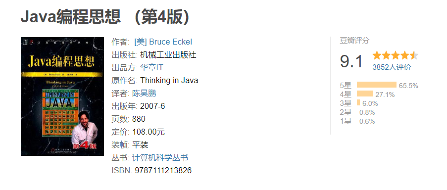

本书赢得了全球程序员的广泛赞誉，即使是最晦涩的概念，作者都会用小而直接的编程示例讲解明白。从Java的基础语法到最高级特性（深入的面向对象概念、多线程、自动项目构建、单元测试和调试等），本书都能逐步指导你轻松掌握。

-   综合评分：9.1
-   个人推荐指数：五星
-   适合对象：初级、中级、高级
-   Java界的神书，如果你是一名Java开发程序员，或者准备进入Java开发领域，都非常推荐你去读一读~

**深入理解Java虚拟机：JVM高级特性与最佳实践**  

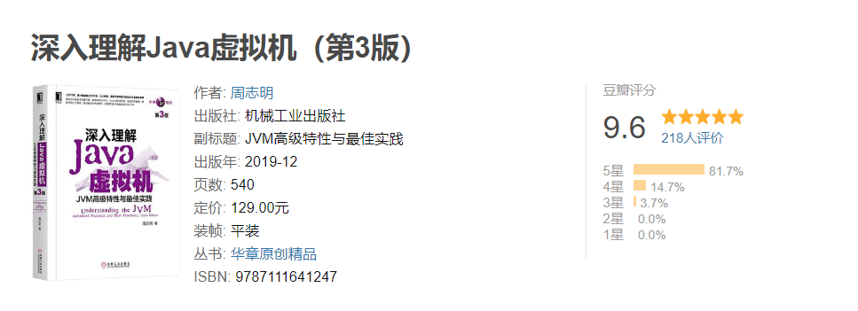

这是一本从工作原理和工程实践两个维度深入剖析JVM的著作，是计算机领域公认的经典。

-   综合评分：9.6
-   个人推荐指数：五星
-   适合对象：初级、中级、高级
-   不会JVM知识的Java程序员，是没有灵魂的。这本书真的超级适合学习JVM方面的知识。

**Head First 设计模式**  
  

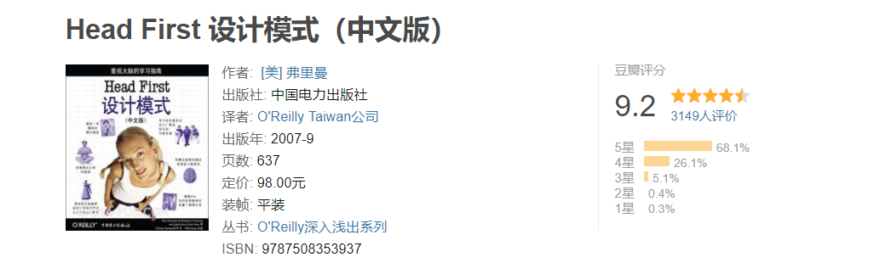

本书涵盖了23个设计模式，例子简单易懂，抛砖引玉，读起来很有意思的。真的是一本非常赞的设计模式入门书籍

-   综合评分：9.2
-   个人推荐指数：五星
-   适合对象：初级、中级
-   对代码有追求的伙伴，想好好学习设计模式的小伙伴，都去看看吧~用设计模式写出优雅代码~

**Effective java**  
  

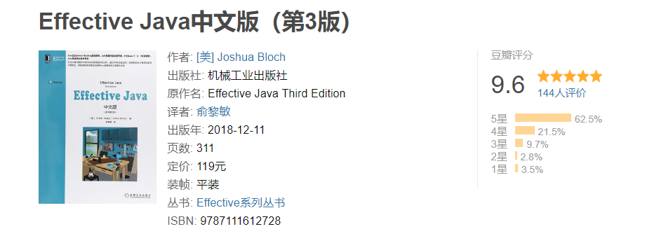

本书一共包含90个条目，每个条目讨论Java程序设计中的一条规则。这些规则反映了最有经验的优秀程序员在实践中常用的一些有益的做法。

-   综合评分：9.6
-   个人推荐指数：五星
-   适合对象：初级、中级、高级
-   学习Java必读的一本书籍，我们写代码从来不是图谁写得多，或者比谁写得多，而是应该思考如何编写出清晰、正确、健壮、易维护的程序代码。

**Java核心技术**  

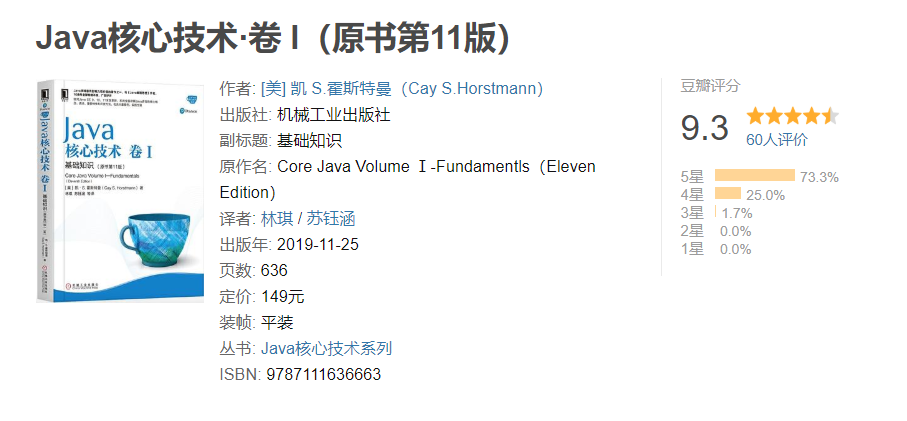

这本书是以为拥有20多年教学与研究经验的资深Java技术专家撰写，是程序员的优选Java指南。

-   综合评分：9.3
-   个人推荐指数：四星
-   适合对象：初级、中级
-   Java入门的工具书，基础知识讲的很细，如果你是入门Java的话，可以去看一看呀~

**Java8 实战**  
  

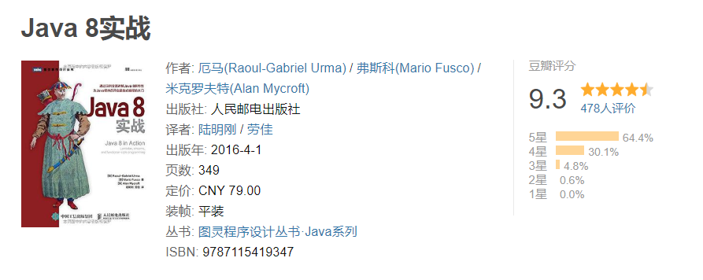

本书全面介绍了Java 8 这个里程碑版本的新特性，包括Lambdas、流和函数式编程。函数式编程，让代码更简洁~  

-   综合评分：9.3
-   个人推荐指数：五星
-   适合对象：初级、中级
-   江湖流传Java版本任你发，我用Java 8，可以知道java 8的地位了。这本书全面系统地讲述了Java8给Java语言带来的改变，例子也很生动，值得一读~

**Java并发编程实战**  
  

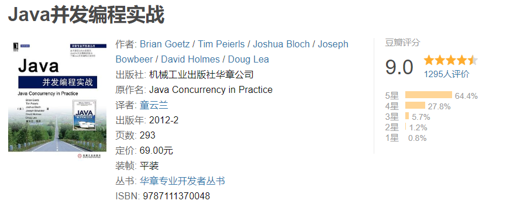

本书深入浅出地介绍了Java线程和并发，是一本完美的Java并发参考手册。  

-   综合评分：9.0
-   个人推荐指数：四星
-   适合对象：初级、中级
-   讲并发的一本书，个人觉得不能算得上Java神书，但是呢，茶余饭后还是值得去读一读的。

**Spring揭秘**  
  

本书内容全面，论述深刻入理，必将成为每个Java专业开发人员必备的Spring图书。  

-   综合评分：9.1
-   个人推荐指数：五星
-   适合对象：初级、中级
-   可以当做spring的入门书籍，想用甜而不腻来形容这本书。

**MyBatis技术内幕**  
  

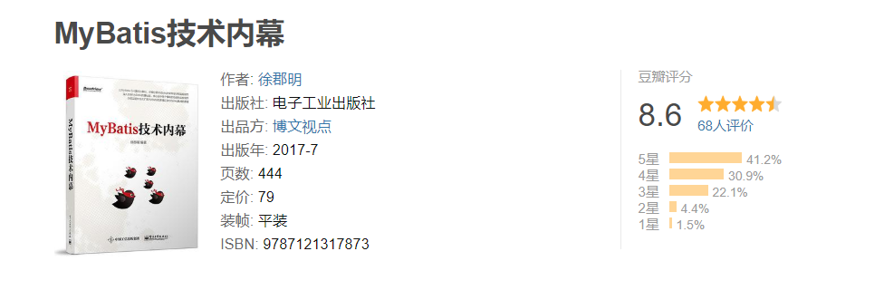

《MyBatis技术内幕》旨在为读者理解MyBatis的设计原理、阅读MyBatis源码、扩展MyBatis功能提供帮助和指导，让读者更加深入地了解MyBatis的运行原理、设计理念。希望《MyBatis技术内幕》能够帮助读者全面提升自身的技术能力，让读者在设计业务系统时，可以参考MyBatis的优秀设计，更好地应用MyBatis。  

-   综合评分：8.6
-   个人推荐指数：四星
-   适合对象：初级、中级、高级
-   还不错，讲的还挺清晰。但是呢一上来就开始讲源码，有些读者可能有点抗拒。

**专题二：代码优化篇书单**  

-   《重构：改善既有代码的设计》
-   《代码整洁之道》
-   《代码整洁之道 程序员的职业素养》

**重构：改善既有代码的设计**  
  

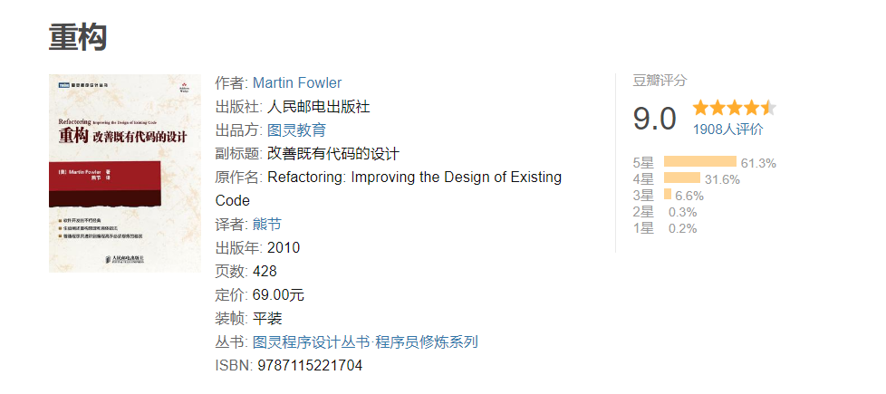

  
本书凝聚了软件开发社区专家多年摸索而获得的宝贵经验，拥有不因时光流逝而磨灭的价值。代码重构，因为这本书，成为了众多普通程序员日常开发工作中不可或缺的一部分。  

-   综合评分：9.0
-   个人推荐指数：五星
-   适合对象：初级、中级、高级
-   花了三周，把这本书看了两遍，真得觉得很有帮助。比如代码的坏味道，讲到重复代码、过长的函数、过长的类、过多的参数等等，都是我们司空见惯的不好代码，我们工作中应该注意、积累、思考，写出优雅、健壮的好代码。

**代码整洁之道**  
  

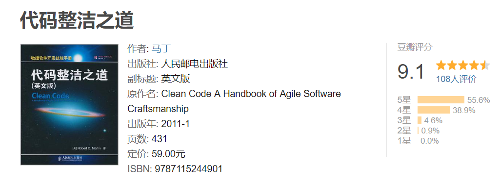

本书作者给出了一系列行之有效的整洁代码操作实践，些实践在本书中体现为一条条规则，并辅以来自现实项目的正、反两面的范例。只要遵循这些规则，就能编写出干净的代码，从而有效提升代码质量。  

-   综合评分：9.1
-   个人推荐指数：五星
-   适合对象：初级、中级、高级
-   个人更加推荐的是英文版，虽然我看的也是中文版，哈哈~

**代码整洁之道 程序员的职业素养**  
  

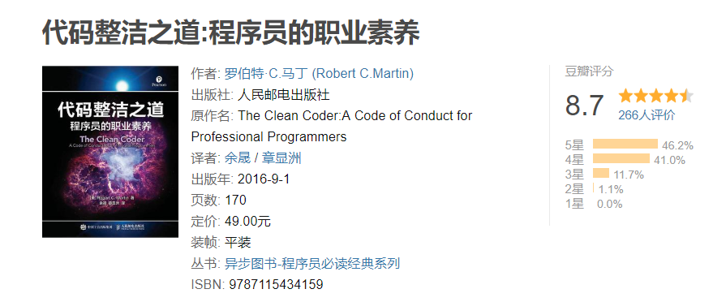

这本书汇聚编程大师40余年编程生涯的心得体会. 阐释软件工艺中的原理、技术、工具和实践. 助力专业软件开发人员具备令人敬佩的职业素养。  

-   综合评分：8.7
-   个人推荐指数：四星
-   适合对象：初级、中级、高级
-   这本书值得多读几遍，坚持以正确的方式做对的事情。生活是这样，写代码也是~

**专题三：计算机网络篇书单**  

-   《计算机网络: 自顶向下方法》
-   《TCP/IP详解》
-   《图解 HTTP》
-   《深入剖析Tomcat》
-   《深入理解Nginx》

**计算机网络: 自顶向下方法**  

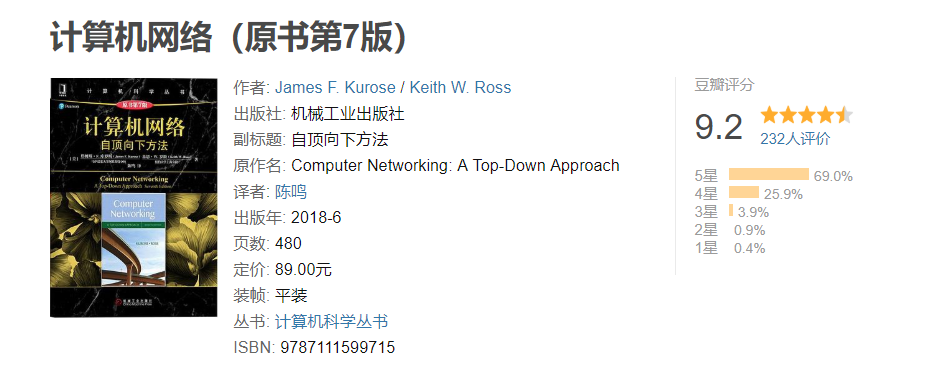

本书是经典的计算机网络教材，采用作者独创的自顶向下方法来讲授计算机网络的原理及其协议，自第1版出版以来已经被数百所大学和学院选作教材，被译为14种语言。  

-   综合评分：9.2
-   个人推荐指数：四星
-   适合对象：初级、中级、高级
-   大学时候的教材，有空可以回过头复习一下的，挺不错的一本书。

**TCP/IP详解**  
  

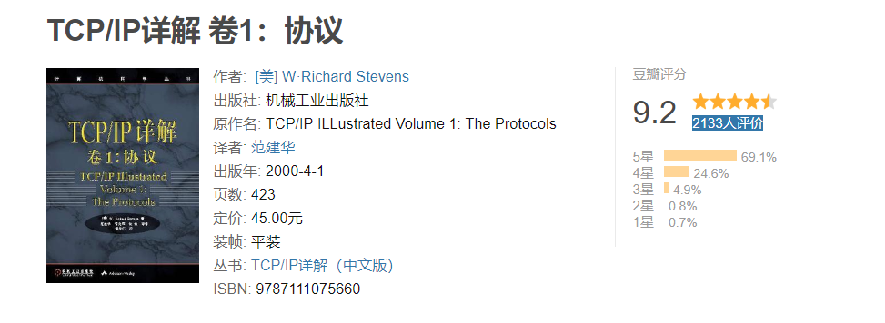

《TCP/IP详解卷1：协议》是一本完整而详细的TCP/IP协议指南。描述了属于每一层的各个协议以及它们如何在不同操作系统中运行。适合作为计算机专业学生学习网络的教材和教师参考书，也适用于研究网络的技术人员。  

-   综合评分：9.2
-   个人推荐指数：四星
-   适合对象：初级、中级、高级
-   有些朋友可能觉得读起来会有点枯燥，但是有时间的话，坚持把它看完吧。作为一名程序员，还是需要对计算机网路相关知识了解的多点才好。

**图解HTTP**  
  

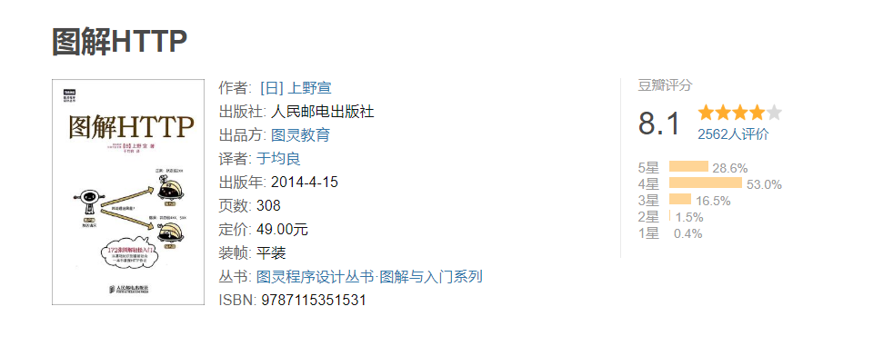

本书对互联网基盘——HTTP协议进行了全面系统的介绍。HTTP协议的发展历史娓娓道来，严谨细致地剖析了HTTP协议的结构，列举诸多常见通信场景及实战案例，最后延伸到Web安全、最新技术动向等方面。  

-   综合评分：8.1
-   个人推荐指数：四星
-   适合对象：初级、中级
-   这本挺还不错的，涵盖了HTTP的主要知识，并且言简意赅，挺适合入门的。

**深入剖析Tomcat**  
  

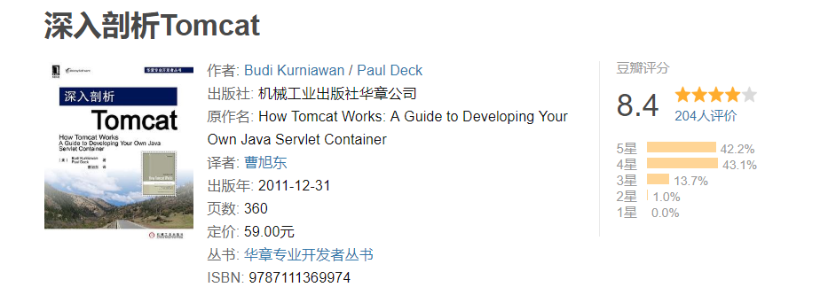

本书深入剖析Tomcat 4和Tomcat 5中的每个组件，并揭示其内部工作原理。通过学习本书，你将可以自行开发Tomcat组件，或者扩展已有的组件。  

-   综合评分：8.4
-   个人推荐指数：四星
-   适合对象：初级、中级、高级
-   对Tomcat感兴趣的朋友可以去读一读~

**深入理解Nginx**  
  

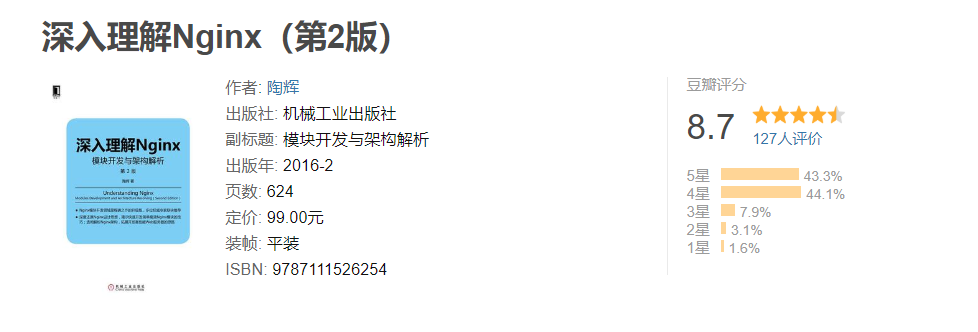

  
本书致力于说明开发Nginx模块的必备知识，深受广大读者的喜爱。  

-   综合评分：8.7
-   个人推荐指数：四星
-   适合对象：初级、中级、高级
-   好书是好书，但是有费咖啡，除了讲解nginx，还深入详解其相关知识。

**专题四：操作系统 && 计算机底层**  

-   《现代操作系统》
-   《鸟哥的Linux私房菜:基础学习篇》
-   《鸟哥的Linux私房菜 （服务器架设篇）》
-   《Linux内核设计与实现》
-   《编码:隐匿在计算机软硬件背后的语言》
-   《程序是怎么跑起来的》

**现代操作系统**  
  

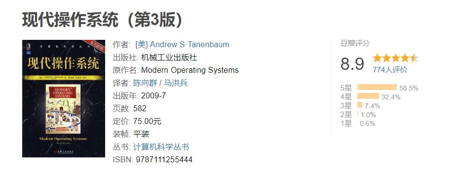

本书是操作系统领域的经典之作.书中集中讨论了操作系统的基本原理，包括进程、线程、存储管理、文件系统、输入/输出、死锁等，同时还包含了有关计算机安全、多媒体操作系统、掌上计算机操作系统、微内核、多核处理机上的虚拟机以及操作系统设计等方面的内容。  

-   综合评分：8.9
-   个人推荐指数：四星
-   适合对象：初级、中级、高级
-   大学的教材，有时间可以复习一下~

**鸟哥的Linux私房菜:基础学习篇**  
  

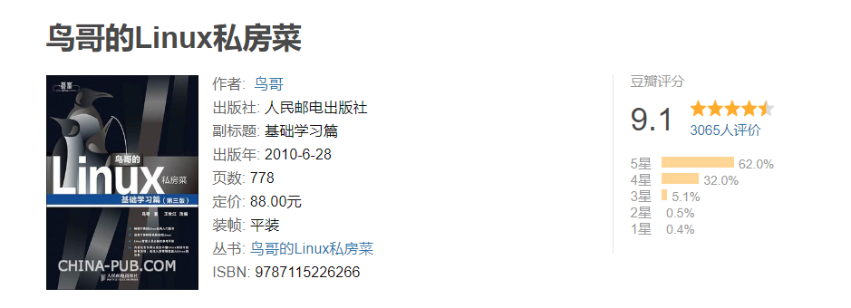

本书内容丰富全面，基本概念的讲解非常细致，深入浅出。各种功能和命令的介绍，都配以大量的实例操作和详尽的解析。  

-   综合评分：9.1
-   个人推荐指数：五星
-   适合对象：初级、中级
-   linux的入门书籍，非常推荐去读~

**鸟哥的Linux私房菜:服务器架设篇**  
  

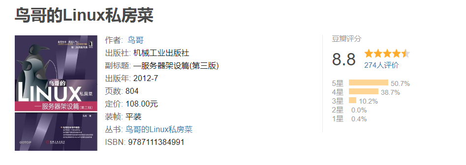

本书针对服务器的维护与管理，以及发生问题时的应对策略都加以说明。作者先从系统基础以及网络基础讲起，再谈到网络攻击与防火墙防护主机后，才进入服务器的架设。  

-   综合评分：8.8
-   个人推荐指数：四星
-   适合对象：初级、中级、高级
-   总体来说，非常不错，可以作为服务器架设的入门书籍。

**Linux内核设计与实现**  
  

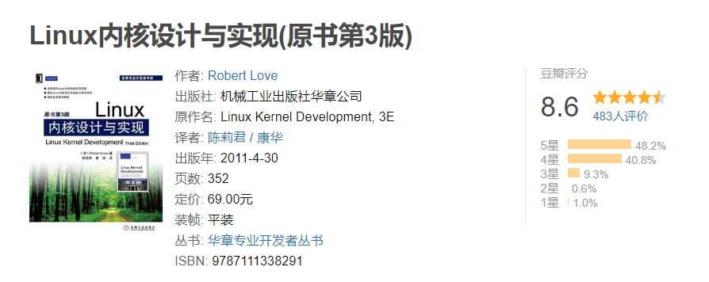

《Linux内核设计与实现(原书第3版)》详细描述了Linux内核的主要子系统和特点，包括Linux内核的设计、实现和接口。从理论到实践涵盖了Linux内核的方方面面，可以满足读者的各种兴趣和需求。  

-   综合评分：8.6
-   个人推荐指数：四星
-   适合对象：初级、中级、高级
-   没有纠缠于内核代码本身，而是把握Linux内核设计的思想，详略得当，特点鲜明，很不错。

**编码:隐匿在计算机软硬件背后的语言**  
  

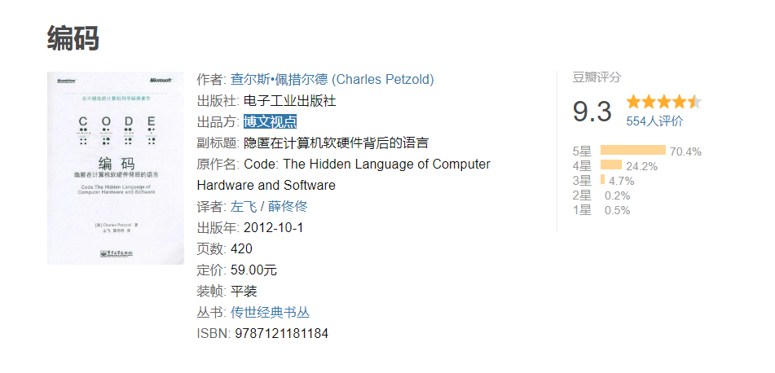

一本讲述计算机工作原理的书，作者用丰富的想象和清晰的笔墨将看似繁杂的理论阐述得通俗易懂，你丝毫不会感到枯燥和生硬。  

-   综合评分：9.3
-   个人推荐指数：四星
-   适合对象：初级、中级、高级
-   大学的时候就值得读的一本书

**程序是怎么跑起来的**  
  

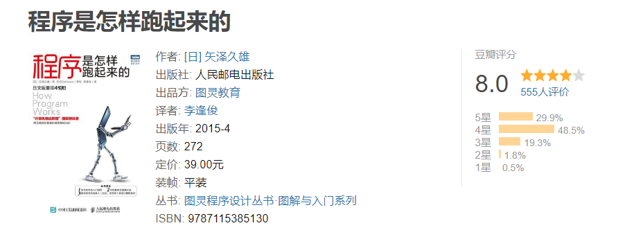

  
本书从计算机的内部结构开始讲起，以图配文的形式详细讲解了二进制、内存、数据压缩、源文件和可执行文件、操作系统和应用程序的关系、汇编语言、硬件控制方法等内容，目的是让读者了解从用户双击程序图标到程序开始运行之间到底发生了什么。同时专设了“如果是你，你会怎样介绍？”专栏，以小学生、老奶奶为对象讲解程序的运行原理，颇为有趣。本书图文并茂，通俗易懂，非常适合计算机爱好者及相关从业人员阅读。  

-   综合评分：8.0
-   个人推荐指数：三星
-   适合对象：初级、中级
-   有空的话可以去看看，通俗易懂、图文并茂~

**专题五：数据结构与算法**  

-   《数据结构与算法分析：Java语言描述》
-   《算法导论》
-   《编程珠玑》
-   《算法》

**数据结构与算法分析：Java语言描述**  
  

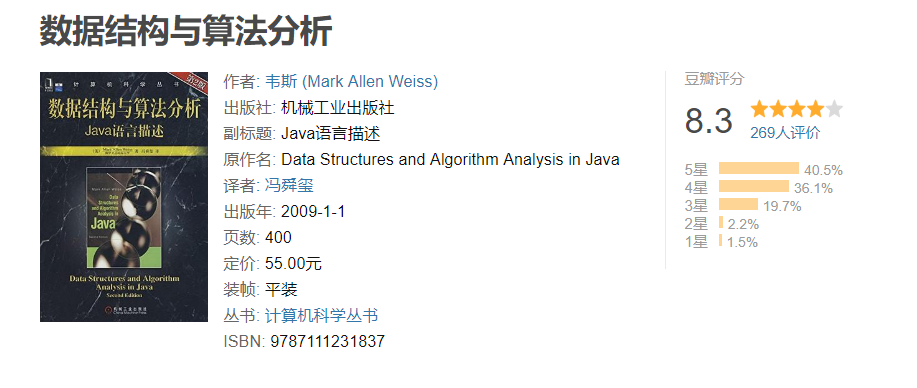

本书是国外数据结构与算法分析方面的经典教材，使用卓越的Java编程语言作为实现工具讨论了数据结构（组织大量数据的方法）和算法分析（对算法运行时间的估计）。  

-   综合评分：8.3
-   个人推荐指数：四星
-   适合对象：初级、中级
-   学习数据结构与算法，做个有想法的程序员。其实源码底层，就有数据结构与算法的体现，如Hashmap底层就是链表、红黑树~

**算法导论**

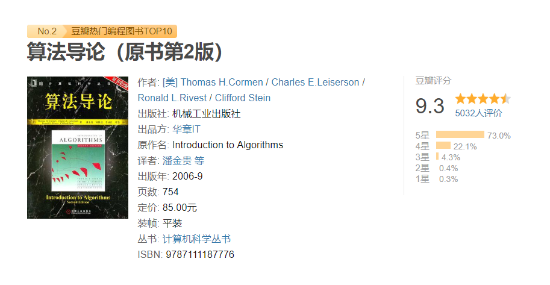

这本书深入浅出，全面地介绍了计算机算法。对每一个算法的分析既易于理解又十分有趣，并保持了数学严谨性。本书的设计目标全面，适用于多种用途。  

-   综合评分：9.3
-   个人推荐指数：五星
-   适合对象：初级、中级、高级
-   读书时代，搞ACM的伙伴必备的一本书，我们大学班主任也非常推荐这本书。这是本经典好书，值得多看几遍。

**编程珠玑**  
  

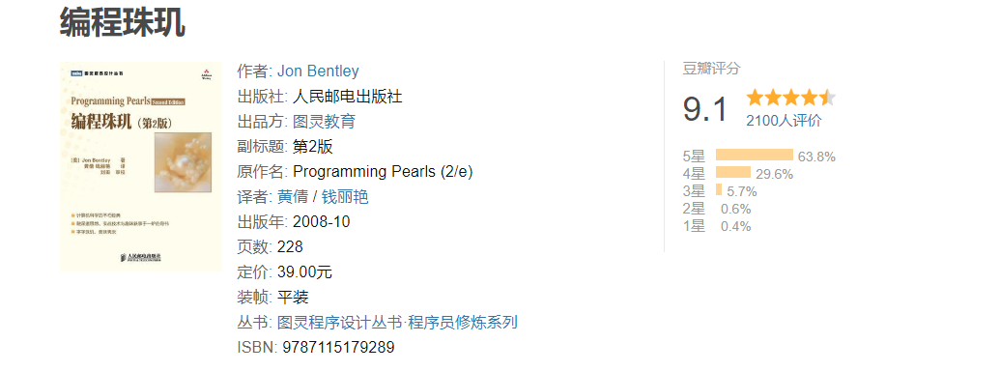

本书的特色是通过一些精心设计的有趣而又颇具指导意义的程序，对实用程序设计技巧及基本设计原则进行了透彻而睿智的描述，为复杂的编程问题提供了清晰而完备的解决思路。本书对各个层次的程序员都具有很高的阅读价值。  

-   综合评分：9.1
-   个人推荐指数：五星
-   适合对象：初级、中级、高级
-   算法导论是经典好书，而这本书的作者是算法导论作者的老师~

**算法**  
  

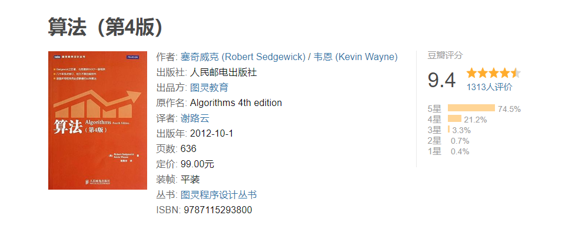

本书全面讲述算法和数据结构的必备知识，具有以下几大特色:算法领域的经典参考书、 内容全面、全新修订的代码、与实际应用相结合、与实际应用相结合等  

-   综合评分：9.4
-   个人推荐指数：五星
-   适合对象：初级、中级、高级
-   非常清晰的算法书，什么叫态度？什么叫好书？这本书就是最好的范例。

**专题六：缓存编程书单**  

-   《[Redis设计与实现](https://www.zhihu.com/search?q=Redis%E8%AE%BE%E8%AE%A1%E4%B8%8E%E5%AE%9E%E7%8E%B0&search_source=Entity&hybrid_search_source=Entity&hybrid_search_extra=%7B%22sourceType%22%3A%22answer%22%2C%22sourceId%22%3A1376048618%7D)》
-   《Redis开发与运维》

**Redis设计与实现**  
  

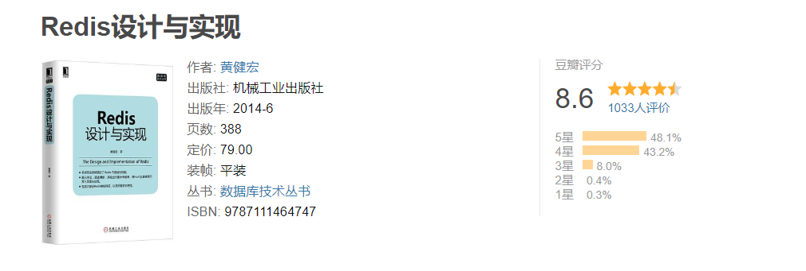

  
系统而全面地描述了 Redis 内部运行机制。图示丰富，描述清晰，并给出大量参考信息，是NoSQL数据库开发人员案头必备。包括大部分Redis单机特征，以及所有多机特性。  

-   综合评分：8.6
-   个人推荐指数：四星
-   适合对象：初级、中级、高级
-   本书通俗易懂，可以先快速读一遍，了解下redis 机制。

**Redis开发与运维**  
  

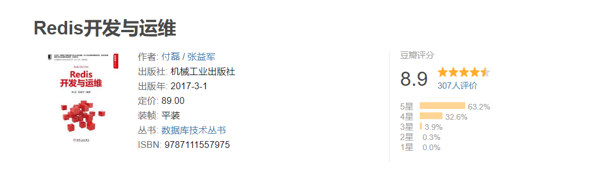

本书全面讲解Redis基本功能及其应用，并结合线上开发与运维监控中的实际使用案例，深入分析并总结了实际开发运维中遇到的“陷阱”，以及背后的原因， 包含大规模集群开发与管理的场景、应用案例与开发技巧，为高效开发运维提供了大量实际经验和建议。  

-   综合评分：8.9
-   个人推荐指数：五星
-   适合对象：初级、中级、高级
-   该书逻辑清晰，深度恰当，尤其适合运维人员和初级开发人员。

**专题七：数据库书单**  

-   《sql必知必会》
-   《高性能Mysql》
-   《MySQL技术内幕：innodb存储引擎》

**[sql必知必会](https://www.zhihu.com/search?q=sql%E5%BF%85%E7%9F%A5%E5%BF%85%E4%BC%9A&search_source=Entity&hybrid_search_source=Entity&hybrid_search_extra=%7B%22sourceType%22%3A%22answer%22%2C%22sourceId%22%3A1376048618%7D)**  
  

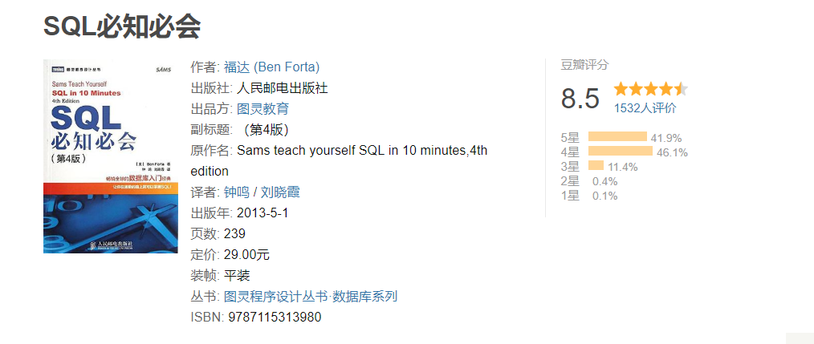

本书是深受世界各地读者欢迎的SQL经典畅销书，内容丰富，文字简洁明快，针对Oracle、SQL Server、MySQL、DB2、PostgreSQL、SQLite等各种主流数据库提供了大量简明的实例。  

-   综合评分：8.5
-   个人推荐指数：四星
-   适合对象：初级、中级
-   本书内容比较简单，适合新手，非常精炼。

**高性能Mysql**  
  

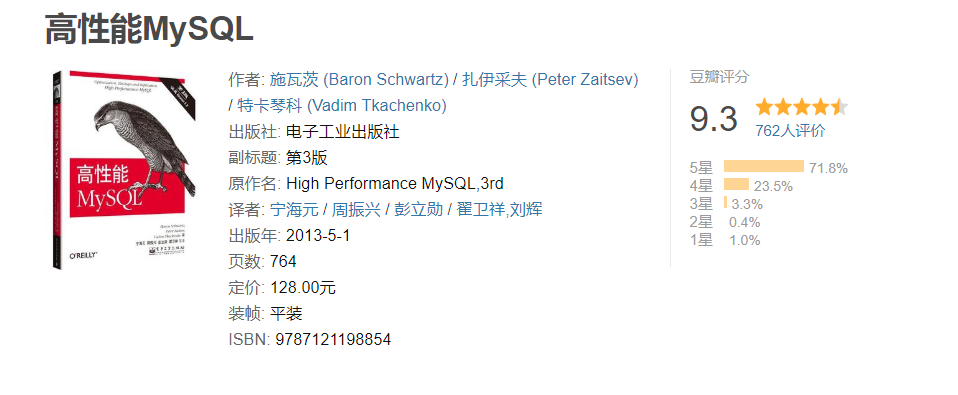

《高性能mysql(第3版)》不但适合数据库管理员（dba）阅读，也适合开发人员参考学习。不管是数据库新手还是专家，相信都能从本书有所收获。  

-   综合评分：9.3
-   个人推荐指数：五星
-   适合对象：初级、中级、高级
-   DBA必读，开发也推荐阅读，全面的一本有关mysql应用的书籍。

**MySQL技术内幕：innodb存储引擎**  
  

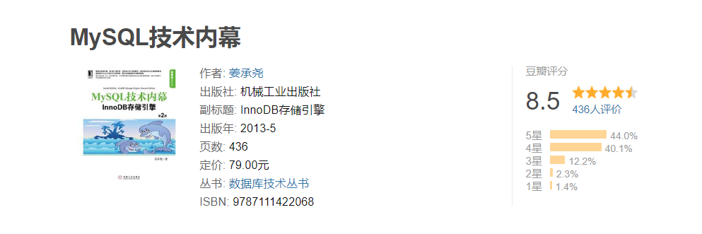

《MySQL技术内幕:InnoDB存储引擎(第2版)》从源代码的角度深度解析了InnoDB的体系结构、实现原理、工作机制，并给出了大量最佳实践，能帮助你系统而深入地掌握InnoDB，更重要的是，它能为你设计管理高性能、高可用的数据库系统提供绝佳的指导。  

-   综合评分：8.5
-   个人推荐指数：四星
-   适合对象：初级、中级、高级
-   简单易懂，讲解比较透彻，值得一读。尤其对InnoDB的事务、锁等方面讲得比较详细。

**专题八：微服务 && 分布式**  

-   《[微服务架构设计模式](https://www.zhihu.com/search?q=%E5%BE%AE%E6%9C%8D%E5%8A%A1%E6%9E%B6%E6%9E%84%E8%AE%BE%E8%AE%A1%E6%A8%A1%E5%BC%8F&search_source=Entity&hybrid_search_source=Entity&hybrid_search_extra=%7B%22sourceType%22%3A%22answer%22%2C%22sourceId%22%3A1376048618%7D)》
-   《从Paxos到Zookeeper分布式一致性原理与实践》

**微服务架构设计模式**  
  

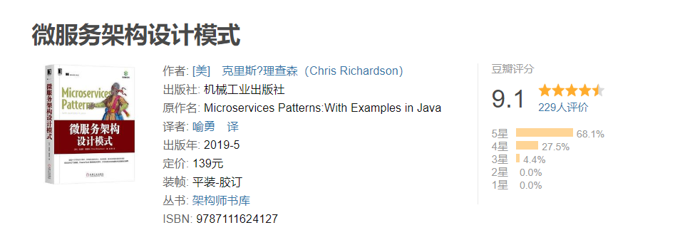

本书将教会你如何开发和部署生产级别的微服务架构应用。这套宝贵的架构设计模式建立在数十年的分布式系统经验之上，Chris 还为开发服务添加了新的模式，并将它们组合成可在真实条件下可靠地扩展和执行的系统。本书不仅仅是一个模式目录，还提供了经验驱动的建议，以帮助你设计、实现、测试和部署基于微服务的应用程序。  

-   综合评分：9.1
-   个人推荐指数：四星
-   适合对象：初级、中级、高级
-   44 个架构设计模式，理论联系实际开发经验，并且涉及涉及接口设计、数据库设计、架构设计等各个方面，很不错的一本书~

**从Paxos到Zookeeper分布式一致性原理与实践**  
  

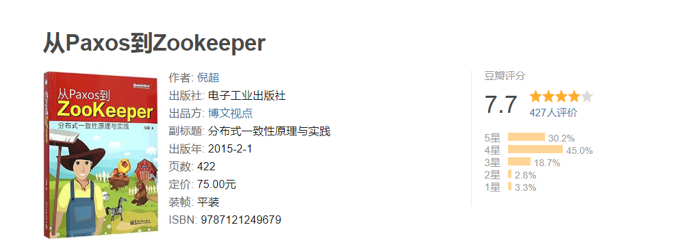

《Paxos到Zookeeper：分布式一致性原理与实践》从分布式一致性的理论出发，向读者简要介绍几种典型的分布式一致性协议，以及解决分布式一致性问题的思路，其中重点讲解了Paxos和ZAB协议。同时，本书深入介绍了分布式一致性问题的工业解决方案——ZooKeeper，并着重向读者展示这一分布式协调框架的使用方法、内部实现及运维技巧，旨在帮助读者全面了解ZooKeeper，并更好地使用和运维ZooKeeper。  

-   综合评分：7.7
-   个人推荐指数：四星
-   适合对象：初级、中级、高级
-   可以当做zookeeper的入门书籍，偏理论，整体看一下是值得的。

**专题九：消息中间件书单**  

-   《Kafka权威指南》
-   《RabbitMQ实战指南》

**《Kafka权威指南》**  
  

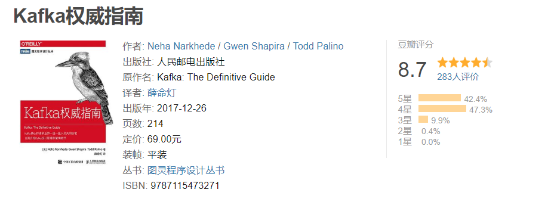

本书详细介绍了如何部署Kafka集群、开发可靠的基于事件驱动的微服务，以及基于Kafka平台构建可伸缩的流式应用程序。通过详尽示例，你将会了解到Kafka的设计原则、可靠性保证、关键API，以及复制协议、控制器和存储层等架构细节。  

-   综合评分：8.7
-   个人推荐指数：四星
-   适合对象：初级、中级
-   学习Kafka入门一本不错的书籍

**RabbitMQ实战指南**  
  

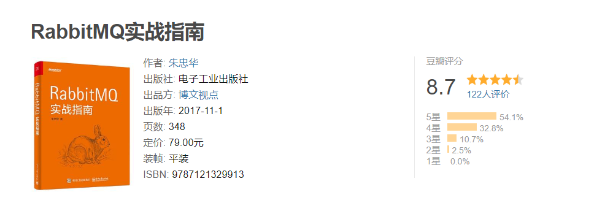

《RabbitMQ实战指南》从消息中间件的概念和RabbitMQ的历史切入，主要阐述RabbitMQ的安装、使用、配置、管理、运维、原理、扩展等方面的细节。  

-   综合评分：8.7
-   个人推荐指数：四星
-   适合对象：初级、中级
-   学习RabbitMQ 一本很不错的书籍

**专题十：容器书单**  

-   《Docker——容器与容器云》

**Docker——容器与容器云（第2版）**  
  

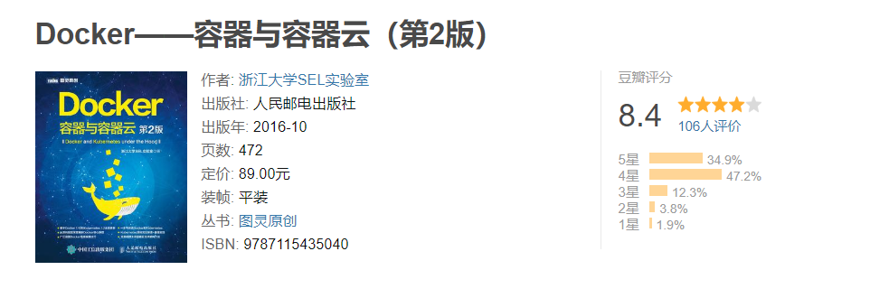

从实践者的角度出发，以Docker和Kubernetes为重点，沿着“基本用法介绍”到“核心原理解读”到“高级实践技巧”的思路，一本书讲透当前主流的容器和容器云技术，有助于读者在实际场景中利用Docker容器和容器云解决问题并启发新的思考。  

-   综合评分：8.4
-   个人推荐指数：四星
-   适合对象：初级、中级、高级
-   市面上Docker的书不多，学习Docker的话，就推荐这本吧

**专题十一：面试相关书单**  

-   《剑指offer》
-   《程序员代码面试指南：IT名企算法与数据结构题目最优解》
-   《编程之美:微软技术面试心得》
-   leetCode

**剑指offer**  
  

本书系统整理基础知识、代码质量、解题思路、优化效率和综合能力这5个面试要点，适合即将走向工作岗位的大学生阅读，也适合作为正在应聘软件行业的相关就业人员和计算机爱好者的参考书。  

-   综合评分：9.2
-   个人推荐指数：四星
-   适合对象：初级、中级
-   非常棒的书，把解题技巧、面试需要的能力等等都讲解到了。

**程序员代码面试指南：IT名企算法与数据结构题目最优解**  
  

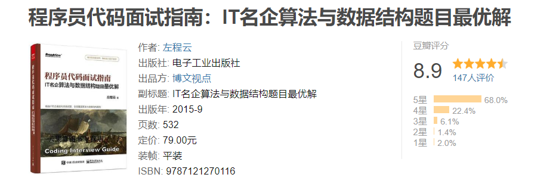

这是一本程序员面试宝典！书中对IT名企代码面试各类题目的最优解进行了总结，并提供了相关代码实现。针对当前程序员面试缺乏权威题目汇总这一痛点，本书选取将近200道真实出现过的经典代码面试题，帮助广大程序员的面试准备做到万无一失。  

-   综合评分：8.9
-   个人推荐指数：四星
-   适合对象：初级、中级
-   书中题目挺经典的，讲解也很详细。

**编程之美:微软技术面试心得**  
  

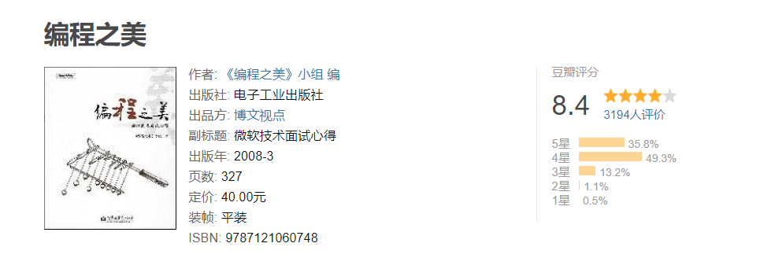

这本书收集了约60道算法和程序设计题目，这些题目大部分在近年的笔试、面试中出现过，或者是被微软员工热烈讨论过。作者试图从书中各种有趣的问题出发，引导读者发现问题，分析问题，解决问题，寻找更优的解法。

-   综合评分：8.4
-   个人推荐指数：四星
-   适合对象：初级、中级
-   以前大四我们班同学找工作的时候，手上都有这基本书《[剑指offer](https://www.zhihu.com/search?q=%E5%89%91%E6%8C%87offer&search_source=Entity&hybrid_search_source=Entity&hybrid_search_extra=%7B%22sourceType%22%3A%22answer%22%2C%22sourceId%22%3A1376048618%7D)》、《编程之美》

**letecode**  

-   综合评分：9.6
-   个人推荐指数：五星
-   适合对象：初级、中级、高级
-   leetCode不是一本书，而是一个编程题网站，如果你面试找工作，尤其是面大厂，一定记得先去leetCode刷题哈。

如果之前没有刷过，是第一-次刷， 我强烈推荐大家刷[leetcode](https://www.zhihu.com/search?q=leetcode&search_source=Entity&hybrid_search_source=Entity&hybrid_search_extra=%7B%22sourceType%22%3A%22answer%22%2C%22sourceId%22%3A2560923293%7D)之前先好好看一遍《[剑指offer](https://www.zhihu.com/search?q=%E5%89%91%E6%8C%87offer&search_source=Entity&hybrid_search_source=Entity&hybrid_search_extra=%7B%22sourceType%22%3A%22answer%22%2C%22sourceId%22%3A2560923293%7D)》，《剑指offer》会快速帮你建立起关于面试题目的一个类别大纲，而且简单和有难度的都会有，有很多经典题目，最好先自己手写一遍，再在电脑上去写一遍debug到运行无误为止，各种边界case都测试通过。

过完了《剑指offer》 ，那就按照经典151题目再去做一-遍leetcode的题目，基本上你做完了这些经典题目，大部分面试题都可以搞定了，遇到没见过的题目，基本也可以举一反三， 想出一-个比较好的解法。比如这份阿里大佬刷Leetcode总结的算法笔记就非常经典，如果你能吃透，那我相信80%的大厂技术面试都会不在话下：

[BAT大佬写的Leetcode刷题笔记，看完秒杀90%的算法题！​mp.weixin.qq.com/s?\_\_biz=MzU4MjgwNjQ0OQ==&mid=2247485348&idx=1&sn=02ede6b715b20a6b981af1d021d77d5d&chksm=fdb3f97acac4706cc193bec80b984255bb33db2b35366682bd566280326b7029f1dae632abb2#rd​mp.weixin.qq.com/s?\_\_biz=MzU4MjgwNjQ0OQ==&mid=2247485348&idx=1&sn=02ede6b715b20a6b981af1d021d77d5d&chksm=fdb3f97acac4706cc193bec80b984255bb33db2b35366682bd566280326b7029f1dae632abb2#rd​mp.weixin.qq.com/s?\_\_biz=MzU4MjgwNjQ0OQ==&mid=2247485348&idx=1&sn=02ede6b715b20a6b981af1d021d77d5d&chksm=fdb3f97acac4706cc193bec80b984255bb33db2b35366682bd566280326b7029f1dae632abb2#rd​mp.weixin.qq.com/s?\_\_biz=MzU4MjgwNjQ0OQ==&mid=2247485348&idx=1&sn=02ede6b715b20a6b981af1d021d77d5d&chksm=fdb3f97acac4706cc193bec80b984255bb33db2b35366682bd566280326b7029f1dae632abb2#rd​mp.weixin.qq.com/s?\_\_biz=MzU4MjgwNjQ0OQ==&mid=2247485348&idx=1&sn=02ede6b715b20a6b981af1d021d77d5d&chksm=fdb3f97acac4706cc193bec80b984255bb33db2b35366682bd566280326b7029f1dae632abb2#rd​mp.weixin.qq.com/s?\_\_biz=MzU4MjgwNjQ0OQ==&mid=2247485348&idx=1&sn=02ede6b715b20a6b981af1d021d77d5d&chksm=fdb3f97acac4706cc193bec80b984255bb33db2b35366682bd566280326b7029f1dae632abb2#rd](https://link.zhihu.com/?target=https%3A//mp.weixin.qq.com/s%3F__biz%3DMzU4MjgwNjQ0OQ%3D%3D%26mid%3D2247485348%26idx%3D1%26sn%3D02ede6b715b20a6b981af1d021d77d5d%26chksm%3Dfdb3f97acac4706cc193bec80b984255bb33db2b35366682bd566280326b7029f1dae632abb2%23rd)

  

**这本书的目录，非常经典：**

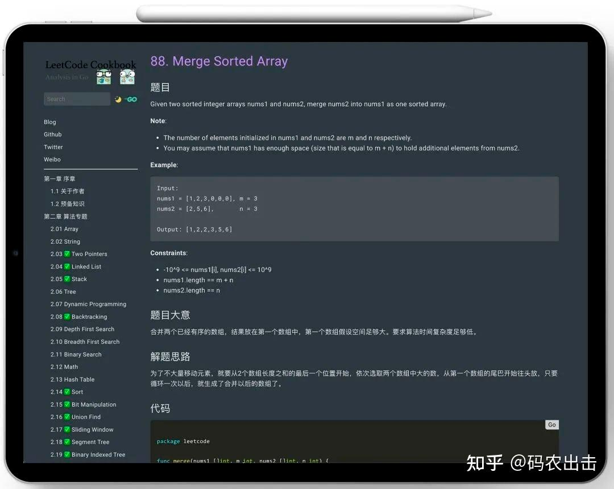

**如果你觉得刷LeetCode上的数据结构+算法题时难免会遇到困难，想要找一本答案题解做参考,需要一本Java语言实现的LeetCode题解答案，最近整理了一下，这里分享几个用Java语言实现的开源LeetCode题解，也要感谢这些优秀的开源作者们。**

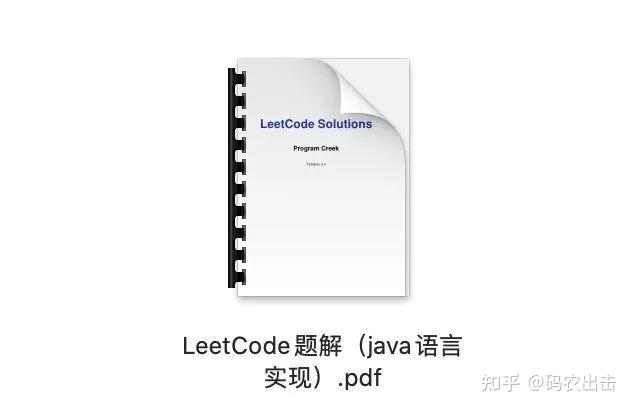

  

[艾玛，终于来了！《LeetCode Java版题解》.PDF​mp.weixin.qq.com/s?\_\_biz=MzU4MjgwNjQ0OQ==&mid=2247486850&idx=2&sn=c8fd9d5ba5808cdbeb64e591cd93019a&chksm=fdb3f35ccac47a4a9702358dbc13f3ae065ccd0fae8920cc9e150607d96ec335d93afe3c4981#rd​mp.weixin.qq.com/s?\_\_biz=MzU4MjgwNjQ0OQ==&mid=2247486850&idx=2&sn=c8fd9d5ba5808cdbeb64e591cd93019a&chksm=fdb3f35ccac47a4a9702358dbc13f3ae065ccd0fae8920cc9e150607d96ec335d93afe3c4981#rd​mp.weixin.qq.com/s?\_\_biz=MzU4MjgwNjQ0OQ==&mid=2247486850&idx=2&sn=c8fd9d5ba5808cdbeb64e591cd93019a&chksm=fdb3f35ccac47a4a9702358dbc13f3ae065ccd0fae8920cc9e150607d96ec335d93afe3c4981#rd​mp.weixin.qq.com/s?\_\_biz=MzU4MjgwNjQ0OQ==&mid=2247486850&idx=2&sn=c8fd9d5ba5808cdbeb64e591cd93019a&chksm=fdb3f35ccac47a4a9702358dbc13f3ae065ccd0fae8920cc9e150607d96ec335d93afe3c4981#rd​mp.weixin.qq.com/s?\_\_biz=MzU4MjgwNjQ0OQ==&mid=2247486850&idx=2&sn=c8fd9d5ba5808cdbeb64e591cd93019a&chksm=fdb3f35ccac47a4a9702358dbc13f3ae065ccd0fae8920cc9e150607d96ec335d93afe3c4981#rd](https://link.zhihu.com/?target=https%3A//mp.weixin.qq.com/s%3F__biz%3DMzU4MjgwNjQ0OQ%3D%3D%26mid%3D2247486850%26idx%3D2%26sn%3Dc8fd9d5ba5808cdbeb64e591cd93019a%26chksm%3Dfdb3f35ccac47a4a9702358dbc13f3ae065ccd0fae8920cc9e150607d96ec335d93afe3c4981%23rd)

  

**建议保存下来pdf，随时随地看。**

**专题十二：软件开发&&程序人生相关书单**  

-   《领域驱动设计 软件核心复杂性应对之道》
-   《人月神话》
-   《[程序员修炼之道](https://www.zhihu.com/search?q=%E7%A8%8B%E5%BA%8F%E5%91%98%E4%BF%AE%E7%82%BC%E4%B9%8B%E9%81%93&search_source=Entity&hybrid_search_source=Entity&hybrid_search_extra=%7B%22sourceType%22%3A%22answer%22%2C%22sourceId%22%3A1376048618%7D)》
-   《软技能：代码之外的生存指南》
-   《程序员思维修炼》
-   《代码大全（第2版）》

**领域驱动设计 软件核心复杂性应对之道**  
  

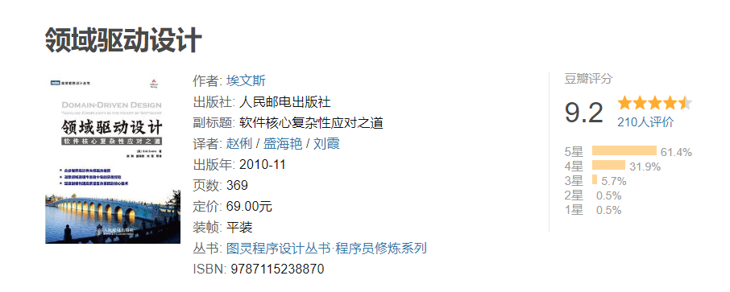

《领域驱动设计:软件核心复杂性应对之道》是领域驱动设计方面的经典之作。全书围绕着设计和开发实践，结合若干真实的项目案例，向读者阐述如何在真实的软件开发中应用领域驱动设计。  

-   综合评分：9.2
-   个人推荐指数：四星
-   适合对象：初级、中级、高级
-   多读几遍，尤其做过几个比较大规模的系统后，再回来看这本书，会有不少收获的。

**人月神话**  
  

在软件领域，很少能有像《[人月神话](https://www.zhihu.com/search?q=%E4%BA%BA%E6%9C%88%E7%A5%9E%E8%AF%9D&search_source=Entity&hybrid_search_source=Entity&hybrid_search_extra=%7B%22sourceType%22%3A%22answer%22%2C%22sourceId%22%3A1376048618%7D)》一样具有深远影响力和畅销不衰的著作。Brooks博士为人们管理复杂项目提供了最具洞察力的见解，既有很多发人深省的观点，又有大量[软件工程](https://www.zhihu.com/search?q=%E8%BD%AF%E4%BB%B6%E5%B7%A5%E7%A8%8B&search_source=Entity&hybrid_search_source=Entity&hybrid_search_extra=%7B%22sourceType%22%3A%22answer%22%2C%22sourceId%22%3A1376048618%7D)的实践。  

-   综合评分：8.6
-   个人推荐指数：五星
-   适合对象：初级、中级、高级
-   软件工程的经典著作，值得细细品味~

**程序员修炼之道(第2版)**  
  

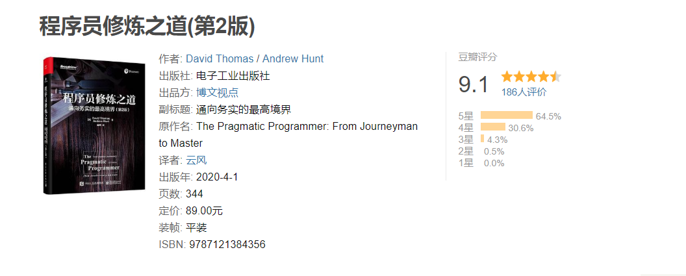

《程序员修炼之道》之所以在全球范围内广泛传播，被一代代开发者奉为圭臬，盖因它可以创造出真正的价值：或编写出更好的软件，或探究出编程的本质，而所有收获均不依赖于特定语言、框架和方法。  

-   综合评分：9.1
-   个人推荐指数：四星
-   适合对象：初级、中级、高级
-   有朋友说，这本书改变了他的一生。

**软技能：代码之外的生存指南**  
  

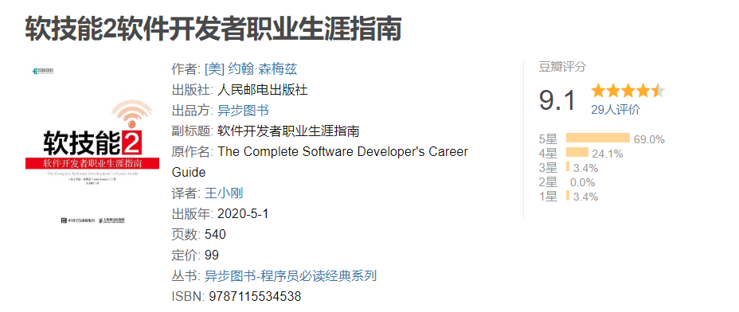

这是一本为软件开发者量身定做的职业发展指南，处于任何发展阶段的软件开发者，都将从本书中获益。  

-   综合评分：9.1
-   个人推荐指数：四星
-   适合对象：初级、中级、高级
-   我们从事软件开发这个行业，真的不仅仅有编码呢，你的职业发展是怎样的？如果迷茫就去看书，可以先看看这本~

**代码大全（第2版）**  
  

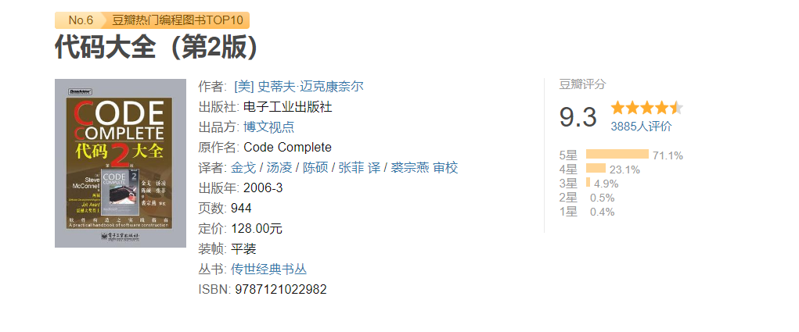

这是一本完整的软件构建手册，涵盖了软件构建过程中的所有细节。它从软件质量和编程思想等方面论述了软件构建的各个问题，并详细论述了紧跟潮流的新技术、高屋建瓴的观点、通用的概念，还含有丰富而典型的程序示例。

-   综合评分：9.1
-   个人推荐指数：五星
-   适合对象：初级、中级、高级
-   作为一名程序员，感觉这本书必读

最后，越努力，越幸运，共勉。

**码字不易，硬核码字更难，希望大家不要吝啬自己的鼓励，给我 ：**

[@码农出击](https://www.zhihu.com/people/654c3abe48a76ba5ac3c116813806075)

**一个点赞，鼓励下我！**