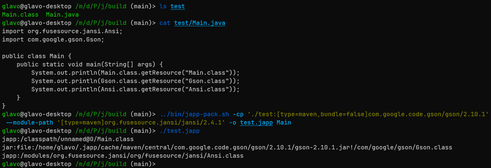

[上一篇文章](https://zhuanlan.zhihu.com/p/661693436)中我介绍了自己正在开发的一个全新的 Java 程序打包格式——JApp。

在经过一段时间的开发后，JApp 计划中的功能已经实现了一半，也跑起来了一些 Demo。本篇文章会介绍 JApp 的设计、目前的阶段性成果以及即将实现的功能，希望能够得到一些反馈来帮助我改进设计。

[Glavo/JApp - GitHub](https://link.zhihu.com/?target=https%3A//github.com/Glavo/japp)

## JApp 是什么？

JApp 是一个全新的 Java 程序打包格式，用于将一个 Java 程序所有必要的类文件、资源和运行时配置打包进单个文件中。

简而言之，你可以认为它是 shadow jar/fat jar 之类的东西的增强版，同时集成了类似 launcher4j 的功能，让执行 Java 程序像 Golang 那么简单。

JApp 有三个核心部分：packer（用于将程序打包为 japp 格式）、launcher（用于启动 Java）和 boot（在用户进程中提供必要的运行时功能），本文接下来的部分会分别介绍它们。

## 将程序打包为 JApp 格式

当前我在项目中提供了一个 `./bin/japp-pack.sh` 脚本用于打包 JApp 文件，使用 `./gradlew build` 构建项目后即可使用此脚本。

对于一个简单的 Java 程序，可以这样将它打包为 JApp 文件：

```text
japp-pack --module-path gson-2.10.1jar --classpath ./build/classes:foo.jar -o myapp.japp myapp.Main
```

`japp-pack` 命令接受类似 `java` 命令的参数，比如用 `--module-path` 和 `--classpath` 选项来指定程序的模块路径和类路径，最后一个参数 `myapp.Main` 则是主类名。

`-o` 选项用来指定输出文件，因此我们得到了名为 `myapp.japp` 的 JApp 文件，类路径和模块路径中的所有类都会被打包进这个 JApp 文件中，我们可以这样执行它：

```text
./myapp.japp
```

在运行时，模块路径上的资源 URL 类似这样：`japp:/modules/com.google.gson/com/google/gson/Gson.class`

而类路径上的资源则类似这样：`japp:/classpath/gson-2.10.1.jar/com/google/gson/Gson.class`

可以看到，我们将来自不同模块和不同 JAR 的资源全部隔离在不同的前缀下，因此 JApp 不会像 shadow jar 那样同名资源之间发生冲突，所有模块也会被保留，不会被合并到同一个匿名模块内。

除此之外，`japp-pack` 还接受这些选项：

-   `--add-opens <module>/<package>=<target-module>(,<target-module>)*`
-   `--add-exports <module>/<package>=<target-module>(,<target-module>)*`
-   `--enable-native-access <module name>[,<module name>...]`
-   `-D<name>=<value>`

`japp-pack` 会将这些选项的值保存在 JApp 文件中，并在启动时传递给 `java` 命令。

## 外部依赖

将所有资源打包至单个文件内固然方便，但这样生成的文件可能过于庞大。为了解决这个问题，JApp 允许用户声明一些来自外部的依赖，比如以下的例子：



可以看到，我们在类路径中使用了 `[type=maven,bundle=false]com.google.code.gson/gson/2.10.1` 这样的格式来引用 Gson。

JApp 允许类路径和模块路径的每个条目包含一些参数，用中括号括起来传递。`type=maven` 告知 JApp 应当从 Maven 仓库中拉取依赖，而 `bundle=false` 告知 `japp-pack` 不应将这个 JAR 打包进 JApp 文件中，而是由 launcher 在运行前下载它。

## 配置组和条件

以上所说的 `--module-path`、`--classpath`、 `-D`、`--add-exports` 等等选项都会被包含进一个**配置组**中。

默认情况下，JApp 文件会有一个根配置组，所有的选项默认被包含进根配置组。每个配置组都可以有一些子配置组，我们可以用 `--group` 和 `--end-group` 选项来声明子组：

```text
japp-pack ... --group ... --end-group
```

配置组的意义在于，每个配置组都能用 `--condition` 声明一个条件，只有条件被满足时才会被应用。

比如，你可以这样声明一个配置组对 Java 的要求：

```text
japp-pack --condition 'java(version: 17)'                                       \
  --group --condition 'java(version: 21)' --classpath foo.jar --end-group       \
  --group --condition 'java(arch: x86-64)' --classpath foo-x86-64.jar --end-group
```

在上面的例子中，我们为根配置组设置了条件 `java(version: 17)`，也就是要求 Java 版本大于等于 17。

根配置组的条件是强制性的，这会要求 launcher 寻找一个版本大于等于 17 的 Java，如果找不到则报错或者自动去下载。

除此之外，我们还创建了两个子配置组并设置了不同的条件。子配置组的条件是可选的，如果不满足则配置组会被跳过，也就是说在 Java 21 或者更高的版本上运行时我们才会将 `foo.jar` 添加至类路径中，而在 `x86-64` 架构上则把 `foo-x86-64.jar` 添加至类路径。

暂时我只实现了 `java` 条件，用户可以用该条件对 Java 版本、系统、架构进行断言，也能用 `&&` 和 `||` 操作符组合条件，这是一些例子：

```text
java(version: 17, arch: x86-64|riscv64) # 要求 Java 版本 >= 17 且架构为 x86-64 或 riscv64
java(arch: !riscv64)                    # 要求架构不可为 riscv64
java(arch: x86-64) && (java(version: 9) || java(os: linux))  # 要求架构为 x86-64，以及 Java 版本 >= 9 或系统为 Linux
```

未来这里会实现更多条件，允许对使用的 VM（J9 或 HotSpot）、Java 供应商（Oracle、Azul、BellSoft 等等）、环境变量等条件进行断言，以及对 Java 版本进行一些更精准的要求。

## launcher

我在文章开头提到了，launcher 是 JApp 的另一个重要部分。

在设计上，它需要管理一组 Java，根据根配置组的条件查询可用的 Java，然后拼接出 Java 参数并启动程序。

TODO：目前 launcher 只实现了最基本的启动功能，在开发的下一阶段我会逐步完成它的功能。

## boot

JApp 的 boot 部分是随 launcher 分发的一个小型 JAR，它应该被应用程序的 Java 进程加载，提供必要的运行时功能，比如从 JApp 中提取类文件和其他资源以供类加载器使用。

TODO：实现基于 JApp 文件的 Java FileSystem。

## 未来的工作

目前 JApp 虽然可以运行一些 Demo 了，但还有大量工作待完成，这是部分计划中的功能：

-   JAR 格式通常只是使用 deflate 压缩每个资源，而 JApp 应该可以通过共享常量池中的字符串减少类文件之间的冗余部分，从而减小 JApp 文件的体积，提高加载速度；
-   JApp 中可以包含更多默认的 JVM 参数，比如设置 GC 以及堆内存等等，同时也应该允许用户在启动程序时自行覆盖它们；
-   JApp 文件可以包含一段更新用的元数据，让 launcher 更新 JApp 文件；
-   launcher 可以缓存 JVM 参数，这样不用每次启动都去解析元数据拼接参数，从而让启动速度更快；
-   用 Rust 重新实现一个 launcher。

  

希望各位看完这篇文章后能给出自己的意见，这能帮助我完善 JApp 格式的设计，谢谢。