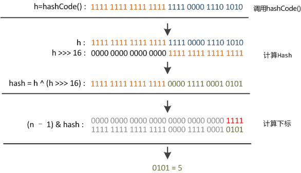
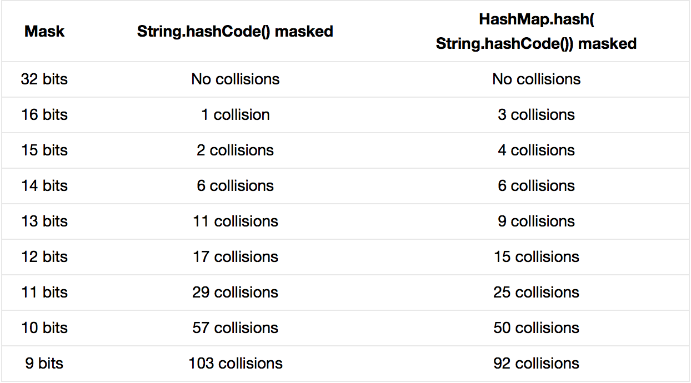

这段代码叫“**扰动函数**”。

题主贴的是Java 7的HashMap的源码，Java 8中这步已经简化了，只做一次16位右位移异或混合，而不是四次，但原理是不变的。下面以Java 8的源码为例解释，

```java
//Java 8中的散列值优化函数
static final int hash(Object key) {
    int h;
    return (key == null) ? 0 : (h = key.hashCode()) ^ (h >>> 16);    //key.hashCode()为哈希算法，返回初始哈希值
}
```

大家都知道上面代码里的**key.hashCode()**函数调用的是key键值类型自带的哈希函数，返回int型散列值。

理论上散列值是一个int型，如果直接拿散列值作为下标访问HashMap主数组的话，考虑到2进制32位带符号的int表值范围从**\-2147483648**到**2147483648**。前后加起来大概40亿的映射空间。只要哈希函数映射得比较均匀松散，一般应用是很难出现碰撞的。

但问题是一个40亿长度的数组，内存是放不下的。你想，HashMap扩容之前的数组初始大小才16。所以这个散列值是不能直接拿来用的。用之前还要先做对数组的长度取模运算，得到的余数才能用来访问数组下标。源码中模运算是在这个**indexFor( )**函数里完成的。

```text
bucketIndex = indexFor(hash, table.length);
```

indexFor的代码也很简单，就是把散列值和数组长度做一个**"与"**操作，

```text
static int indexFor(int h, int length) {
        return h & (length-1);
}
```

顺便说一下，这也正好解释了为什么HashMap的数组长度要取2的整次幂。因为这样（数组长度-1）正好相当于一个“**低位掩码”。**“与”操作的结果就是散列值的高位全部归零，只保留低位值，用来做数组下标访问。以初始长度16为例，16-1=15。2进制表示是**00000000 00000000 00001111**。和某散列值做“与”操作如下，结果就是截取了最低的四位值。

```text
        10100101 11000100 00100101
&	00000000 00000000 00001111
----------------------------------
	00000000 00000000 00000101    //高位全部归零，只保留末四位
```

  

但这时候问题就来了，这样就算我的散列值分布再松散，要是只取最后几位的话，碰撞也会很严重。更要命的是如果散列本身做得不好，分布上成等差数列的漏洞，恰好使最后几个低位呈现规律性重复，就无比蛋疼。

这时候“**扰动函数**”的价值就体现出来了，说到这里大家应该猜出来了。看下面这个图，



右位移16位，正好是32bit的一半，自己的高半区和低半区做异或，就是为了**混合原始哈希码的高位和低位，以此来加大低位的随机性**。而且混合后的低位掺杂了高位的部分特征，这样高位的信息也被变相保留下来。

最后我们来看一下**Peter** **Lawley**的一篇专栏文章《An introduction to optimising a hashing strategy》里的的一个实验：他随机选取了352个字符串，在他们散列值完全没有冲突的前提下，对它们做低位掩码，取数组下标。



结果显示，当HashMap数组长度为512的时候，也就是用掩码取低9位的时候，在没有扰动函数的情况下，发生了103次碰撞，接近30%。而在使用了扰动函数之后只有92次碰撞。碰撞减少了将近10%。看来扰动函数确实还是有功效的。

但明显Java 8觉得扰动做一次就够了，做4次的话，多了可能边际效用也不大，所谓为了效率考虑就改成一次了。

  

\------------------------------------------------------

我的笔记栈 [http://ciaoshen.com](https://link.zhihu.com/?target=http%3A//ciaoshen.com) （笔记向，非教程）