**先说一下Java8**

Java8，也就是jdk1.8，是意义深远的一个新版本

是Java5之后一个大的版本升级，让Java语言和库仿佛获得了新生

新特性包含：

a.随着大数据的兴起，函数式编程在处理大数据上的优势开始体现，引入了Lambada函数式编程

b.使用Stream彻底改变了集合使用方式：只关注结果，不关心过程

c.新的客户端图形化工具界面库：JavaFX

d.良好设计的日期/时间API

e.增强的并发/并行API

f.Java与JS交互引擎 -nashorn

g.其他特性

> James Gosling：对继续坚守 Java8 的朋友，我想说“是时候作出改变了”。新系统全方位性更强、速度更快、错误也更少、扩展效率更高。无论从哪个角度看，大家都有理由接纳 JDK17。确实，大家在从 JDK8 升级到 JDK9 时会遇到一个小问题，这也是 Java 发展史中几乎唯一一次真正重大的版本更替。大多数情况下，Java 新旧版本更替都非常简单。只需要直接安装新版本，一切就能照常运作。长久以来，稳定、非破坏性的升级一直是 Java 的招牌特性之一，我们也不希望破坏这种良好的印象。

这是James Gosling最近在接受采访时，被问及“Java 的版本一直以来更新得比较快，几个月前发布了最新的 Java 17 版本，但 Java 8 仍然是开发人员使用的主要版本，新版本并未‘得宠’，您认为主要的原因是什么？”时的回答。

而随着即将正式发布的Spring framework 6 和Spring Boot 3，最低的Java版本就直接以Java 17起步：

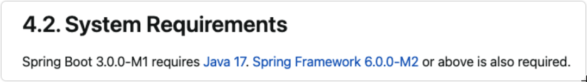

这么一来，如果到时候为了使用最新版本的Spring功能，我们不得不从Java 8升级到Java 17，而期间跳过的版本主要内容如果我们不了解的话，必定会遇到许多问题。

所以，这里，强哥就帮大家总结了Java 9到Java 17的主要内容更新，值得大家收藏。

**Java 9**

主要更新内容：

-   平台模块系统（Jigsaw项目）
-   接口私有方法
-   Try-With Resources
-   @SafeVarargs注释
-   集合工厂方法
-   Process API改进
-   JShell:javashell（REPL）
-   流API改进

Java 9最大特性就是引入了模块化的概念。就是将类型和资源封装在模块中，并仅导出其他模块要访问其公共类型的软件包。有些类似前端框架中的export和import。

如果模块中的软件包未导出或打开，则表示模块的设计人员不想在模块外部使用这些软件包。这样的包可能会被修改或甚至从模块中删除，无需任何通知。

与此同时，模块化将rt.jar包做了拆分，导致了ClassLoader的相应调整：

Java 9之前的ClassLoader

-   Bootstrap ClassLoader加载rt.jar，jre/lib/endorsed
-   Ext ClassLoader加载jre/lib/ext
-   Application ClassLoader加载-cp指定的类

Java 9及之后的ClassLoader

-   Bootstrap ClassLoader加载lib/modules
-   Ext ClassLoader更名为Platform ClassLoader，加载lib/modules
-   Application ClassLoader加载-cp，-mp指定的类
-   Application ClassLoader父类不再是URLClassLoader

  

而接口私有方法，允许我们声明有助于在非抽象方法之间共享公共代码的私有方法。在Java 9之前，在接口中创建私有方法会导致编译时错误。

**Java 10**

主要更新内容：

-   局部变量的类型推断。
-   应用类数据共享。为改善启动和占用空间，在现有的类数据共享（“CDS”）功能上再次拓展，以允许应用类放置在共享存档中
-   向G1引入并行Full GC
-   线程局部管控。允许停止单个线程，而不是只能启用或停止所有线程
-   基于Java的JIT 编译器（试验版本）

局部变量类型推断是Java10中为开发人员提供的最大的新特性。它将类型推断添加到带有初始值设定项的局部变量声明中。局部类型推断只能在以下情况下使用：

-   仅限于具有初始值设定项的局部变量
-   增强for循环的索引
-   在for循环中声明的本地

其实就是类似JS的var变量，用法如下：

```text
var numbers = List.of(1, 2, 3, 4, 5); // inferred value ArrayList<String>
```

向G1引入并行FullGC：G1垃圾收集器在jdk9中是默认的。G1垃圾收集器避免了任何完全的垃圾收集，但是当用于收集的并发线程不能足够快地恢复内存时，用户的体验就会受到影响。

此更改通过使完全GC并行来改善G1最坏情况下的延迟。G1收集器的mark-sweep compact算法作为此更改的一部分被并行化，当用于收集的并发线程不能足够快地恢复内存时，它将被触发。

基于Java的实验性 JIT 编译器：Java 10 中开启了基于Java 的JIT编译器Graal，并将其用作Linux/x64平台上的实验性JIT编译器开始进行测试和调试工作。

Graal 是一个以 Java 为主要编程语言、面向Java bytecode 的编译器。与用C++实现的C1及C2相比，它的模块化更加明显，也更加容易维护。将 Graal 编译器研究项目引入到 Java 中，或许能够为 JVM 性能与当前 C++ 所写版本匹敌（或有幸超越）提供基础。

**Java 11（LTS）**

主要更新内容：

-   GC垃圾回收器
-   本地变量类型推断
-   字符串加强
-   集合加强
-   Stream 加强
-   Optional 加强
-   InputStream 加强
-   HTTP Client API
-   化繁为简，一个命令编译运行源代码

最大变化是Linux版本新增了ZGC。ZGC在Linux X64下的JDK 11以上可用，Mac和Windows上需要JDK 15可用。Java 11 ZGC实测gc时间稳定在3ms左右（当然也许跟场景有关，官方口径一般在10ms以下）。

ZGC一个并发，基于region，压缩型的垃圾收集器，只有root扫描阶段会STW，因此GC停顿时间不会随着堆的增长和存活对象的增长而变长。ZGC和G1停顿时间比较：

```text
ZGC
```

同时，不得不提的一点是：随着Java 11的发布，在2018.9之后，Oracle JDK正式商用（开发不收费，但是运行线上业务收费）。但是与此同时，Oracle宣布，OpenJDK与Oracle JDK在功能上不会有区别。并且，OpenJDK 11 RTS将会由红帽社区进行维护。这样，更加增加了可靠性与保证问题的及时解决。

  

**Java 12**

主要更新内容：  

-   Shenandoah: 低暂停时间的GC
-   Switch表达式
-   JVM常量API
-   默认类数据共享归档文件
-   可终止的G1 Mixed GC
-   G1及时返回未使用的已分配内存

  

Java 12中引入一个新的垃圾收集器：Shenandoah，它是作为一中低停顿时间的垃圾收集器而引入到Java 12中的，其工作原理是通过与Java应用程序中的执行线程同时运行，用以执行其垃圾收集、内存回收任务，通过这种运行方式，给虚拟机带来短暂的停顿时间。

  

同时，Java12中继续改善了G1 GC：为了实现向操作系统返回最大内存量的目标，G1 将在应用程序不活动期间定期执行或触发并发周期以确定整体 Java 堆使用情况。这将导致它自动将 Java 堆的未使用部分返回给操作系统。而在用户控制下，可以可选地执行完整的 GC，以使返回的内存量最大化。

  

如果混合 GC 的 G1 存在超出暂停目标的可能性，则使其可中止。

  

**Java 13**

主要内容：

-   增强 ZGC 释放未使用内存
-   Socket API 重构
-   Switch 表达式扩展（预览功能）
-   文本块（预览功能）

  

Java 13主要功能就是增强ZGC：释放未使用内存。ZGC在Java 11中是实验性的引入，主要用来改善 GC 停顿时间，并支持几百 MB 至几个 TB 级别大小的堆，并且应用吞吐能力下降不会超过 15%。

  

通过在实际中的使用，发现 ZGC 收集器中并没有像 Hotspot 中的 G1 和 Shenandoah 垃圾收集器一样，能够主动将未使用的内存释放给操作系统的功能。对于大多数应用程序来说，CPU 和内存都属于有限的紧缺资源，特别是现在使用的云上或者虚拟化环境中。如果应用程序中的内存长期处于空闲状态，并且还不能释放给操作系统，这样会导致其他需要内存的应用无法分配到需要的内存，而这边应用分配的内存还处于空闲状态，处于"忙的太忙，闲的太闲"的非公平状态，并且也容易导致基于虚拟化的环境中，因为这些实际并未使用的资源而多付费的情况。由此可见，将未使用内存释放给系统主内存是一项非常有用且亟需的功能。

  

Java 13 中对 ZGC 的改进，主要体现在下面几点：

-   释放未使用内存给操作系统
-   支持最大堆大小为 16TB
-   添加参数：-XX:SoftMaxHeapSize 来软限制堆大小

Java 13 中，ZGC 内存释放功能，默认情况下是开启的，不过可以使用参数：-XX：-ZUncommit 显式关闭，同时如果将最小堆大小 (-Xms) 配置为等于最大堆大小 (-Xmx)，则将隐式禁用此功能。

  

还可以使用参数：-XX：ZUncommitDelay = <seconds>（默认值为 300 秒）来配置延迟释放，此延迟时间可以指定释放多长时间之前未使用的内存。

  

**Java 14**

主要内容：

-   改进的switch表达式，第一次出现在Java 12和13中，在Java 14中获得了完全的支持
-   instanceof支持模式匹配（语言特性）
-   record 特性，省去写get，equals（）等方法
-   NullPointerException（JVM特性）,精确到哪一行
-   加入了java打包工具jpackage的预览版。

  

Switch表达式, 可以使用箭头->代替break：

```text
var log = switch (event) {
```

instanceof支持模式匹配（语言特性）

```text
Object obj = "java 14";
```

同时，扩展ZGC，使得ZGC能够在macOS和 Windows（版本有限制）上使用，主要是兼容这两个系统和 linux 系统底层的内存映射机制的不同带来的差异；

  

**Java 15**

主要内容：

-   ZGC将从实验功能升级为产品
-   Char在CharSequence中添加了isEmpty默认方法
-   支持Unicode 13.0
-   JEP 371 隐藏类
-   TreeMap方法的专用实现
-   增加了为远程JMX配置第三个端口的能力

  

Java 15版本，ZGC将从实验功能升级为产品。

  

ZGC已集成到2018年9月发布的JDK 11中，是一个可扩展的低延迟垃圾回收器。引入ZGC是一项实验功能，因为Java的开发人员决定应谨慎而逐步地引入这种大小和复杂性的功能。从那时起，已经添加了许多改进，从并发类卸载，未使用内存的未提交，对数据类共享的支持到改进的NUMA感知和多线程堆预触。此外，最大堆大小已从4 TB增加到16 TB。支持的平台包括Linux，Windows和MacOS。

  

同样的，还有Shenandoah GC。  

  

**Java 16**

主要内容:

-   Record正式使用
-   jpackage 的工具正式使用
-   instanceof正式使用

  
哈哈，这个版本确实没什么太多更新，网上有一个笑话如下：

美国的一个大公司发通知，说公司上周决定要不预装JRE，因为工厂抱怨装了JRE之后，系统启动的时间增加了，即使是1-2分钟，工厂也决定不接受JRE.于是Sun就急了，为我们定制了一版update 16，主要更新就是在安装参数增加了一个命令（好像是noupdate)....

  

**Java 17（LTS）**

主要内容:

-   增强了伪随机数算法。
-   移除AOT提前编译和JIT即时编译的功能，Oracle JDK16 未包含此功能。
-   sealed修饰的类和接口限制其他的类或者接口的扩展和实现。说白了就是限制类的继承或者接口的实现数量。
-   进一步增强了switch语法的模式匹配，万物皆可switch下使用了。

这个版本更新的内容也不多，不过也是个长期支持版本。同时，Oracle JDK宣布可以免费商用了。外加我们文章开头提到的，Spring framework 6 和Spring Boot 3 都将基于Java 17。所以，这个版本对开发者来说还是比较重要的。

  

  

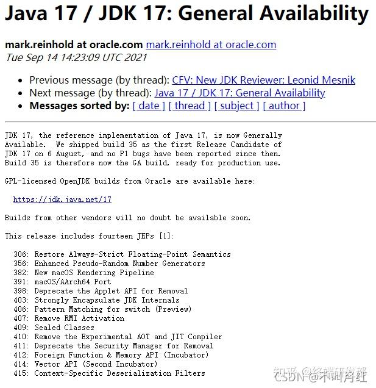

  

  

Java 官方团队已在OpenJDK邮件中确认，8月6号发布的 JDK 17 build 35 可正式作为GA版本使用，期间没有报告任何P1错误。

  

Java 17的14 个 JEP，分别是：

306：恢复始终严格的浮点语义

356：增强型伪随机数发生器

382：新的 macOS 渲染管道

391：macOS/AArch64 端口

398：弃用即将删除的 Applet API

403：强封装JDK的内部API

406：Switch模式匹配（预览）

407：删除 RMI 激活

409：密封类

410：删除实验性 AOT 和 JIT 编译器

411：弃用即将删除安全管理器

412：外部函数和内存 API（孵化器）

414：Vector API（第二次进行特性孵化）

415：特定于上下文的反序列化过滤器

在这14个功能中，哪一个对你最实用。

  

3年后的首个 LTS版本

据Oracle Java SE支持路线图显示，Java 17 是自Java 11以来的首个长期支持版本。Oracle 还提议将 JDK LTS 发布的节奏从每三年一次改为每两年一次，并且每个LTS 版本的服务时间至少8年以上。Java 版本通常是6个月一更新，时间分别在3月和9月，而这些版本的支持时间基本在半年左右。

  

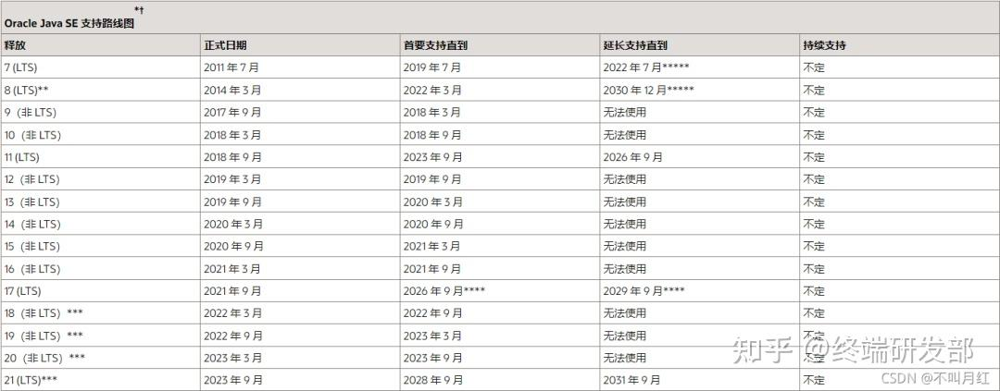

  

  

Java各个版本的生命周期

据Oralce官博透露，虽然6个月版本的使用人数在增长，但大部分组织及企业更倾向于把LTS版本用在生产环境中，从而得到更加稳定可靠的服务。这一点从Snyk发布的2021 Java 社区报告中也可以得到证实，虽然有 61.5% 的人在生产中使用 Java 11，但仍有一半的 Java 11 用户（目前使用最多的版本）在他们的生产堆栈中使用 Java 8。

  

除了上面提到是14个重大更新和更快的LTS服务节奏外，Java 17还有哪些亮点呢？

  

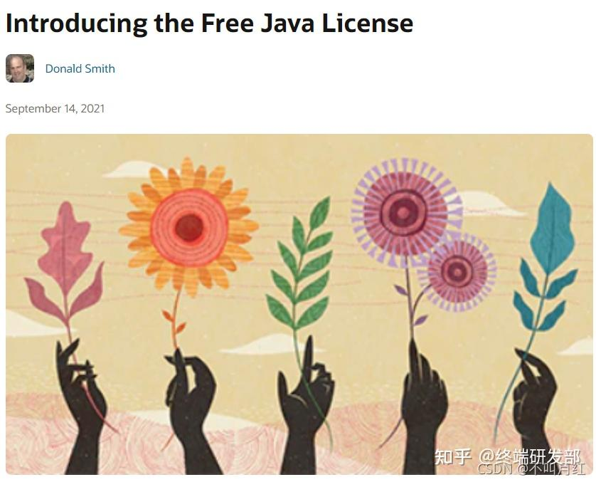

  

Oracle 推出 Free Java License

  

  

截图自Oracle官博

自 Java 被 Oralce 收购以后，付费 JDK 就一直被人诟病，现在好了，Oracle 宣布推出JDK免费服务。什么意思呢？让我们来看一下官方解释：

  

Oracle正在为行业提供免费的，领先的 Oralce JDK，包括所有季度安全更新，并包含商业和生产用途。

  

新许可是“Oracle 免费条款和条件”(NFTC) 许可。此 Oracle JDK 许可证允许所有用户免费使用，甚至可以用于商业和生产用途。只要不收费，再分发是允许的。

  

开发人员和组织现在无需点击即可轻松下载、使用、共享和重新分发 Oracle JDK。

  

Oracle 将从Oracle JDK 17 开始提供这些免费版本和更新，并在下一个 LTS 版本之后继续提供整整一年。以前的版本不受此更改的影响。

  

Oracle 将继续按照自 Java 9 以来的相同版本和时间表提供GPL下的Oracle OpenJDK 版本。

  

总结成一句话，“免费”也并不意味着开发者可以随心所欲，因为 Oracle 的 NFTC 是禁止付费重新分发其 Java 软件。

  

而在 Java 17 正式发布之前，Java 开发框架 Spring 率先在官博宣布，Spring Framework 6 和Spring Boot 3 计划在 2022 年第四季度实现总体可用性的高端基线：

  

Java 17+(来自 Spring Framework 5.3.x 线中的 Java 8-17)

Jakarta EE 9+（来自Spring框架5.3.x 线中的 Java EE 7-8）

通过实际行动来支持 Java 17，间接呼吁开发者，是时候使用 Java 17了。

要不要升级呢？Java 17 到底有多快？

看到如此诚意满满的更新，开发者到底要不要升级呢？尽管只需切换JDK即可体验Java 17。对此，OptaPlanner网站做了一项基准测试：Java到底有多快？通过比较 JDK 17、JDK 16 和 JDK 11 来告诉你答案。

基准方法

硬件：一个稳定的机器不运行任何其他的计算要求苛刻的流程，配置：Intel® Xeon® Silver 4116 @ 2.1 GHz (12 cores total / 24 threads)和128 GiBRAM内存，运行RHEL 8 x86\_64。

JDK版本：

JDK 11

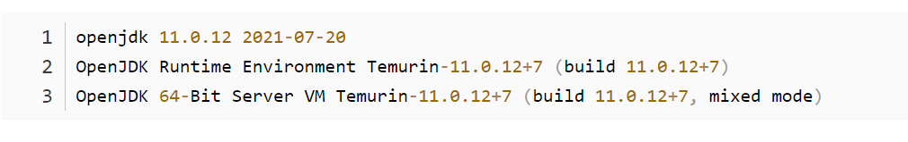

JDK 16

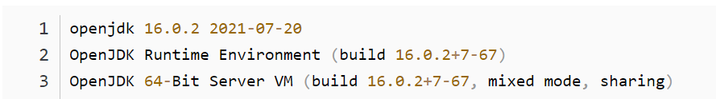

  

JDK 17

  

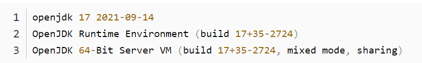

JVM 选项：-Xmx3840M并明确指定垃圾收集器：

\-XX:+UseG1GC 对于 G1GC，低延迟垃圾收集器（所有三个 JDK 中的默认值）。

\-XX:+UseParallelGC 对于 ParallelGC，高吞吐量垃圾收集器。

Main class：org.optaplanner.examples.app.GeneralOptaPlannerBenchmarkApp 来自 optaplanner-examplesOptaPlanner 中的模块8.10.0.Final。

  

每次运行都使用 OptaPlanner 解决 11 个规划问题，例如 员工排班、 学校时间表和云优化。每个规划问题运行 5 分钟。日志记录设置为INFO。基准测试以 30 秒的 JVM 预热（warm up）开始，随后丢弃。

解决规划问题不涉及IO（除了在启动期间加载输入的几毫秒）。单个CPU完全饱和。它不断地创建许多短期存在的对象，然后 GC 将它们收集起来。

基准衡量每秒计算的分数数量，越高越好。为测试计划规划的解决方案计算分数并非易事：它涉及许多计算，包括检查每个实体与每个其他实体之间的冲突。

运行次数：每个 JDK 和每个垃圾收集器组合按顺序运行 3 次。下面的结果是这 3 次运行的平均值。

测试结果

Java 11 (LTS) 和 Java 16 与 Java 17 (LTS)

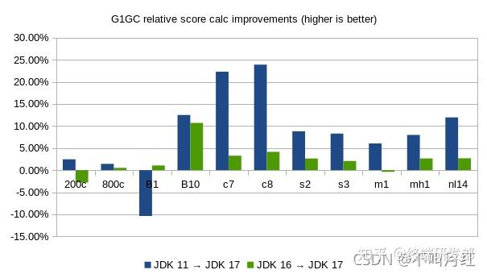

表 1. 在不同 JDK 上使用 G1GC 的每秒计算得分

  

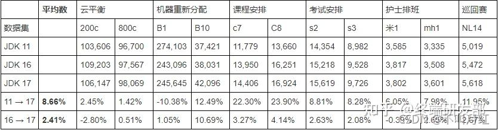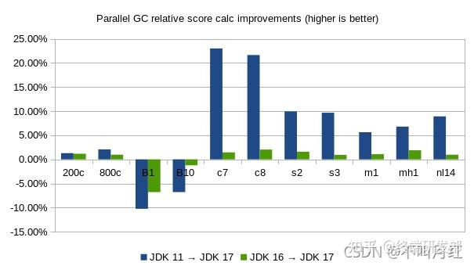

表 2. 在不同 JDK 上使用 ParallelGC 的每秒计算得分

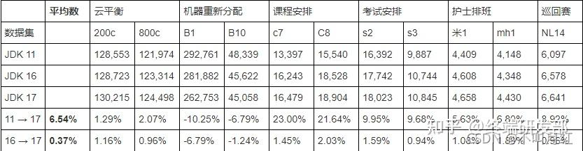

备注：

查看 3 次单独运行的原始数据（此处未显示），机器重新分配数（B1 和 B10）在同一 JDK 和 GC 上的运行之间波动很大，通常超过10%，其他数字不会受到这种不可靠性的影响。

可以以说忽略 Machine Reassignment numbers 更好。但是为了避免挑选数据的问题，这些结果和平均值确实把它们包括进来了。

Java 17 上的 G1GC 与 ParallelGC

  

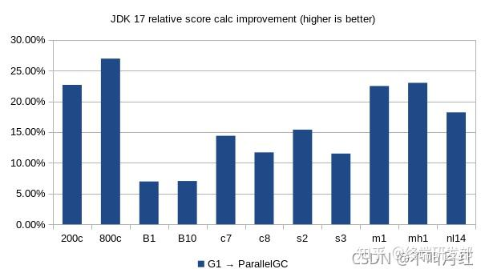

表 3.JDK 17 下不同 GC 每秒的计算得分

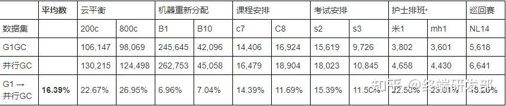

基准测试总结

平均而言，以 OptaPlanner 为例的基准测试结果表明：

对于 G1GC（默认），Java 17 比 Java 11 快 8.66%，比 Java 16 快 2.41%。

对于 ParallelGC，Java 17 比 Java 11 快 6.54%，比 Java 16 快 0.37%。

Parallel GC 比 G1 GC 快 16.39%。

结果并无太大的惊喜表现：最新的 JDK 更快，高吞吐量垃圾收集器比低延迟垃圾收集器更快。

多说一句

在基于 JDK 15 的基准测试中，Java 15 比 Java 11 快 11.24%。现在，Java 17 相对于 Java 11 的增益更少。这是否意味着 Java 17 比 Java 15 慢？

答案是否定的，Java 17 依然比 Java 15 快，因为之前的那些基准测试是在不同的代码库上运行的（OptaPlanner 7.44 而不是 8.10）。不要拿橙子与苹果作比较，不具有可比性。

结论

总而言之，JDK17 的性能表现还是非常值得升级的，至少于OptaPlanner Demo 而言。

此外，这些用例最快的垃圾收集器仍然是ParallelGC, 而不是G1GC（默认）。

作为3年后首次发布的LTS版本的Java 17给你带来了哪些惊喜？面对Go、Kotlion等JVM的强势发展，你觉得Java还能保持霸主地位吗？

好了，终于把Java 9~Java 17的主要更新都整理完了。强哥的整理有部分版本的内容也做了选择性的忽略。主要还是为了突出重点。想要更深入地了解各个版本的具体更新内容，大家也可以到JDK官网查看。

就到这啦~

> PS：如果想学习技术，或者在学习技术的过程中有疑问，对编程方向的选择，可以来这里找小于哥，一个有思想有规划，被代码延误的心灵导师，可咨询offer的选择，职业规划，学习路线，技术开发中的问题

参考：

[https://blog.csdn.net/mengyidan/article/details/120308102](https://link.zhihu.com/?target=https%3A//blog.csdn.net/mengyidan/article/details/120308102)

[https://mp.weixin.qq.com/s/RNQMUuJM8t0g0t55b2SoQQ](https://link.zhihu.com/?target=https%3A//mp.weixin.qq.com/s/RNQMUuJM8t0g0t55b2SoQQ)