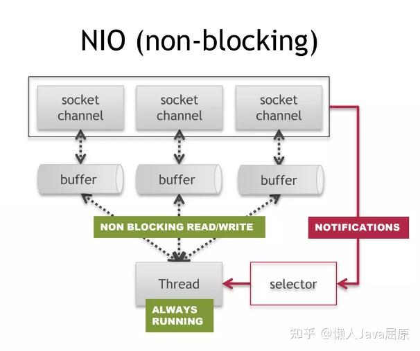
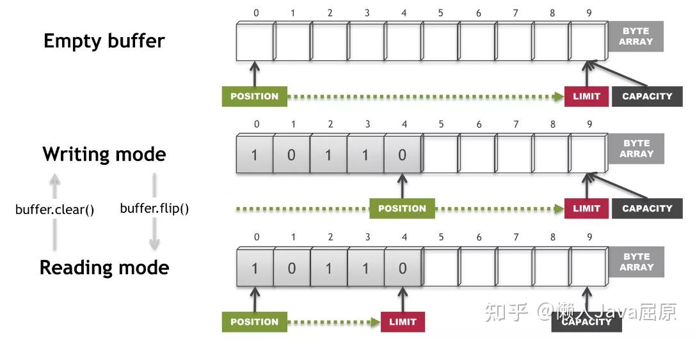
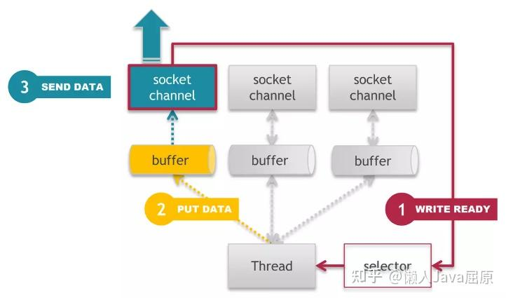
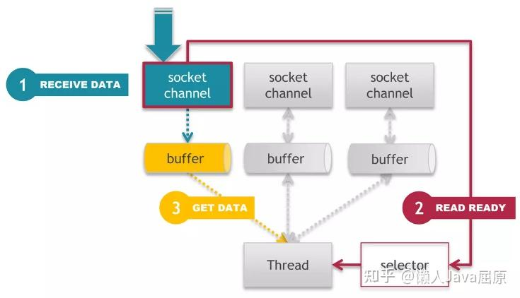
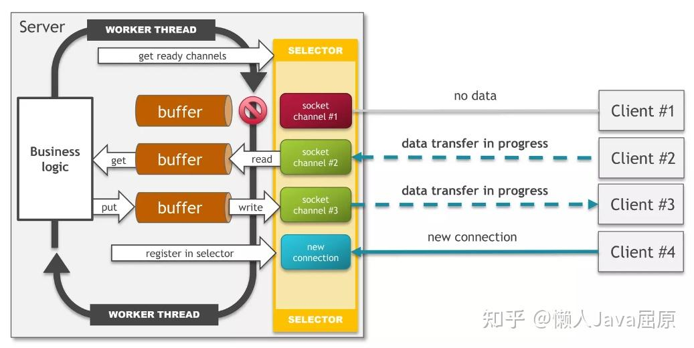

## 什么是NIO

NIO被称作是 New IO或者Non block IO。它是Jdk1.4开发引入的类库。NIO与BIO的最大不同是，BIO是面向流，而BIO是面向缓冲区buffer。Java的IO数据流向是固定的，要么读，要么写。但是NIO则可以同时支持读写。



## NIO三大核心

### 1.Selector

前面的[linux的5种IO模型](https://zhuanlan.zhihu.com/p/639989047) 提到过，NIO模型会不断的轮询，向操作系统确认数据。Jdk中，Selector承当了这个职责。Selector维护着一张Channel列表，然后不断轮询检查channel状态。一旦发生某个channel发生读写事件，就会被检测到，进行后续的IO操作。

```java
        //获取通道
        ServerSocketChannel channel1 = ServerSocketChannel.open();
        //非阻塞
        channel1.configureBlocking(false);
        //绑定连接
        channel1.bind(new InetSocketAddress(8080));
        Selector selector = Selector.open();
        //将channel注册到selector,用作轮询使用
        channel1.register(selector, SelectionKey.OP_ACCEPT);
```

### 2.Channel

应用程序与底层操作系统之间的桥梁，应用程序能通过channel读取数据，也能通过它向操作系统写入数据。

### 3.Buffer

缓冲区buffer是一个对象，它包含了需要写入或者读出的数据。Buffer有3个重要属性：

**capacity**:

存储数据的最大容量，你只能最大往里面写capacity个int、short等类型数据。满了之后，需要通过读取数据或者清楚数据两种方法，才能继续往里面写。

**position**:

读模式（Reading mode）下，代表了从这开始读。

写模式（Writing mode）下，代表了从这开始写。

buffer.clear能将清空重新写入，buffer的flip能将写模式切换为读模式

**limit**:

读模式（Reading mode）下，表示你最多能读多少条数据。在从写模式切换到读模式，position与limit数值相同，代表你能读取之前写入的所有数据。

写模式（Writing mode）下，数值与capacity相同。



```java
        //申请空间
        ByteBuffer byteBuffer=ByteBuffer.allocate(1024);
        //写入数据
        byteBuffer.put("hello world!".getBytes());
        //切换读模式
        byteBuffer.flip();
        //数据读取
        byte[] readByte=new byte[byteBuffer.limit()];
        byteBuffer.get(readByte);
        System.out.println(new String(readByte));
        //clear只是将position与Limit置0，能够从头写入，不会删除数据
        byteBuffer.clear();
        System.out.println((char)byteBuffer.get());
```

## Nio的写

1.selector轮询监听到通道写事件

2.数据写入到buffer缓存

3.buffer缓存数据通过channel通道发送出去



## Nio的读

1.数据通过channel接收数据到buffer

2.selector轮询触发

3.数据读取到应用程序



## Nio的全模式



  

Java的八大基本类型，除了Boolean类型外，其他都有对应的Buffer，至于这是为什么，就留给聪明的你来解答了。