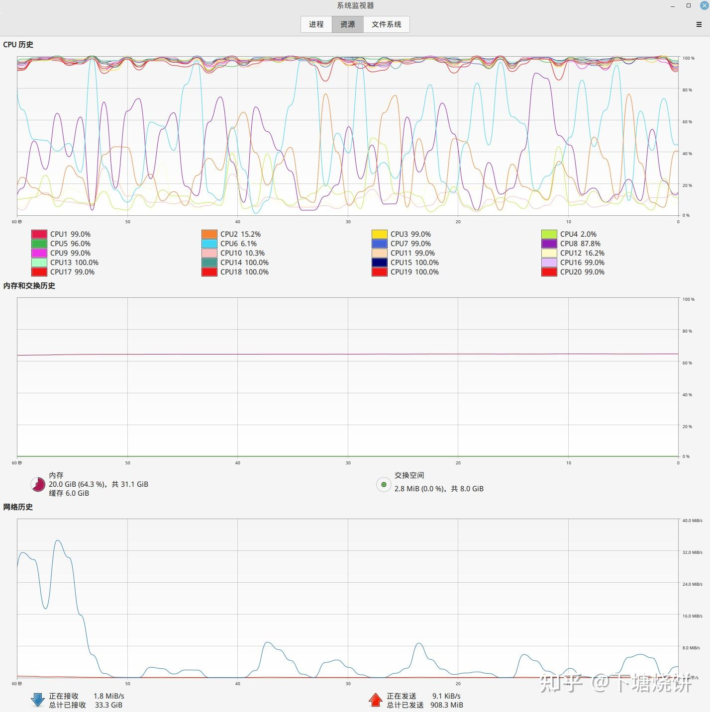
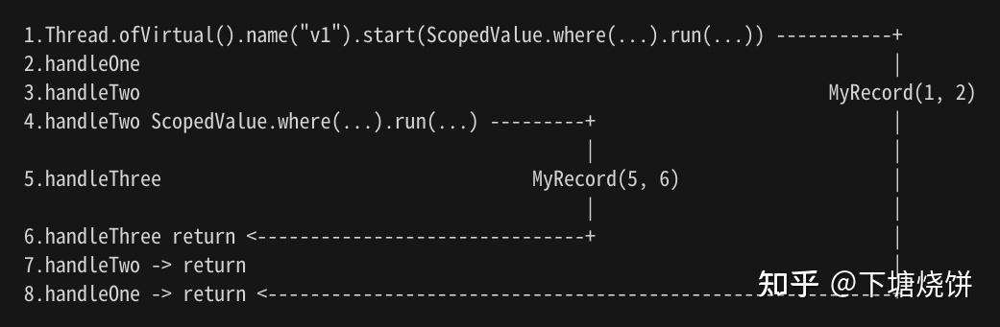
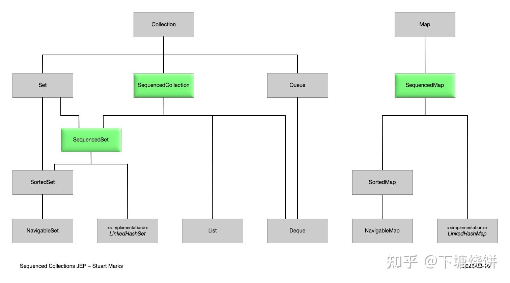
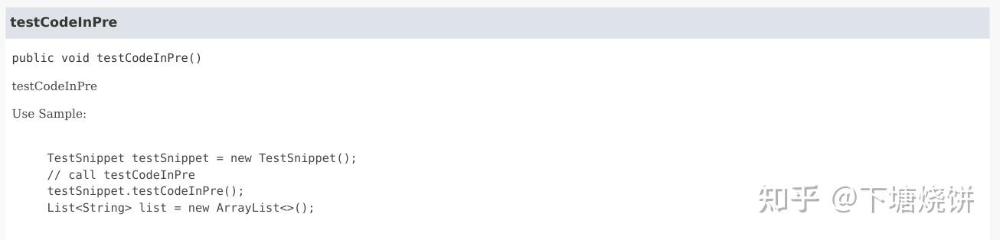
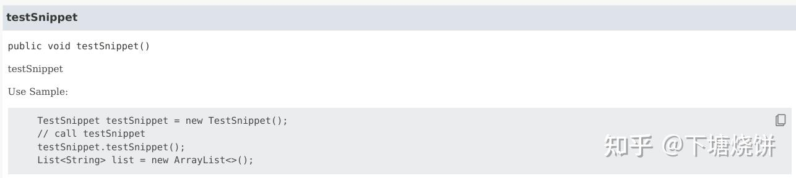
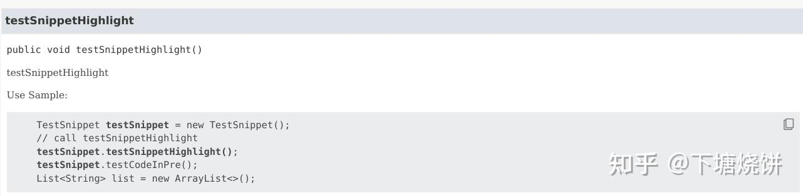
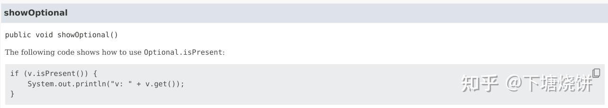

## 一、前言

Java21在2023年9月19日正式发布，这也是继Java17(2021年9月份发布)之后的又一个LTS版本。

> 从Java21开始，Java的LTS版本发布节奏加快到两年一个LTS版本。

Java21是一个重要的LTS版本，包含了一些非常重要的新特性，比如虚拟线程。在spring3.x版本最低需要Java17以后，尽可能升级Java版本与spring版本是一个更优选择。

这里对Java18到Java21的一些新特性进行了整理和学习。

## 1.1 jdk21的下载

官方、社区，以及oracle的JDK下载地址如下：

-   (推荐)openJDK的Adoptium社区下载地址: `https://adoptium.net/zh-CN/temurin/archive`
-   openJDK官方下载地址：`https://jdk.java.net/archive/`
-   openJDK的azul下载地址: `https://www.azul.com/downloads`
-   oracleJDK的下载地址：`https://www.oracle.com/java/technologies/downloads/`
-   microsoftJDK的下载地址：`https://docs.microsoft.com/en-us/java/openjdk/download`

考虑到oracle的尿性，还是建议使用社区构建的openjdk。这里使用的是Adoptium社区提供的免安装包:

```text
OpenJDK21U-jdk_x64_linux_hotspot_21.0.1_12.tar.gz
```

## 1.2 相关文档

从JDK18开始，openJDK提供的新特性文档如下，它们涵盖了几乎全部的java21相对java17的新特性:

```text
https://openjdk.org/projects/jdk/18/
https://openjdk.org/projects/jdk/19/
https://openjdk.org/projects/jdk/20/
https://openjdk.org/projects/jdk/21/
```

## 1.3 历史版本新特性文章

java历史版本的新特性可以参考我以前的文章:

[下塘烧饼：java17相对java11的新特性](https://zhuanlan.zhihu.com/p/552200509)[下塘烧饼：Java从5到11的新特性（一）](https://zhuanlan.zhihu.com/p/355562742)

## 二、新特性整理

这里按照个人偏见从有意思的新特性开始介绍。

## 2.1 Virtual Threads 虚拟线程

虚拟线程在jdk19中由`JEP 425`作为预览特性引入，经过jdk20中`JEP 436`的第二次预览，终于在jdk21中作为`JEP 444`正式转正。

> 毫无疑问，虚拟线程是Java21相对Java17最重要的新特性，没有之一; 甚至可能是自Java8以来最重要的新特性。

虚拟线程是一种轻量级的用户级线程，类似go语言的goroutine，属于有栈协程(Kotlin的coroutine是无栈协程)。虚拟线程配合同步模式可以作为一种强大的并发编程模型来使用，但要注意，它并不能提升单个线程的性能，它的性能优势在于高并发的IO密集型运算场景。比如很多用户同时打开网站页面查询数据，短时间内大量的请求发送到后端从数据库读取数据，就是一个典型的高并发IO密集型运算场景。虚拟线程并不会提升单个请求的响应速度，但在高并发时，它能保证大部分请求依然能在正常时间内响应，并比传统多线程模型消耗更少的资源，提供更高的并发能力。而相比反应式编程，虚拟线程配合同步模式在性能表现上接近，却更易于开发与维护。

为了与以前的Java线程区别，传统的Java线程以后被称为平台线程(Platform Thread)，与虚拟线程(Virtual Thread)对应。

增加虚拟线程并没有去掉平台线程，JVM在运行时默认依然使用的是平台线程，虚拟线程需要主动通过相关API创建并启动。

在运行时，虚拟线程会被挂载到某个平台线程上执行，虚拟线程遇到IO阻塞时，会从平台线程卸载，平台线程就可以挂载其他没有陷入IO阻塞的虚拟线程来执行; 当卸载的虚拟线程的IO阻塞结束时，会被挂载到某个平台线程(不一定是之前的平台线程了)上继续执行。挂载了虚拟线程的平台线程被称为载体。

> 虚拟线程的这种挂载/卸载机制，是一种两极线程模型的实现，用户线程与内核线程之间是多对多的关系; 而Java传统的线程模型是内核线程模型，平台线程和内核线程是1比1关系。

虚拟线程具有以下优势:

1.  性能优势: 虚拟线程相比平台线程要轻量级的多，在高并发的IO密集型运算场景下，这种挂载/卸载的机制能够避免传统多线程模型的频繁的内核线程切换(对于内核线程来说，它不知道虚拟线程的存在，它只能看到平台线程一直在执行非阻塞的任务，于是它也一直在CPU上运行，CPU不会切换到其他内核线程)，从而极大提升了Java的并发能力(主要是吞吐量)。
2.  编程优势: 虚拟线程在面对高并发的请求时，依然是一个请求用一个虚拟线程干到底，整个过程从程序员编程的角度而言，依然是同步的，不像反应式编程那样从编程模式上就需要以异步风格设计和实现，这无疑是一种门槛更低，对程序员更加友好的并发编程模型。
3.  迁移优势: 虚拟线程可以运行任何平台线程可以运行的代码。特别是，虚拟线程也支持线程本地变量和线程中断，就像平台线程一样。这意味着现有的Java代码可以很容易地在虚拟线程中运行处理请求。许多服务器框架将会自动选择这种方式，对于每个传入的请求启动一个新的虚拟线程并在其中运行应用程序的业务逻辑。

想要更好地学习虚拟线程的话，有很多背景知识要了解，不熟悉的同学可以参考我之前的另一篇文章:

[下塘烧饼：Java多线程梳理之四\_其他并发解决方案](https://zhuanlan.zhihu.com/p/350633012)

### 2.1.1 Thread的虚拟线程相关API

看一个例子来说明Thread类新增的或修改的，与虚拟线程相关的API:

```text
// 创建一个名为 v1 的虚拟线程，然后启动它
    // 这个虚拟线程将执行 lambda表达式传入的操作: System.out.println("run v1...")
    Thread v1 = Thread.ofVirtual().name("v1").unstarted(() -> System.out.println("run v1..."));
    v1.start();

    // 创建虚拟线程 v2
    Thread.startVirtualThread(() -> {
        System.out.println("run v2...");
        System.out.println("Is v2 virtual thread : " + Thread.currentThread().isVirtual());
    });

    // 使用同一个任务定义，创建多个虚拟线程，每个线程的name以"v3-"开头，如 v3-0, v3-1, ...
    Thread.Builder builder = Thread.ofVirtual().name("v3-", 0);
    Runnable task = () -> {
        var threadName = Thread.currentThread().getName();
        System.out.println(threadName + " run...");
        System.out.println("Is " + threadName + " virtual thread : " + Thread.currentThread().isVirtual());
    };
    Thread v3_0 = builder.start(task);
    Thread v3_1 = builder.start(task);

    // 打印当前jvm中线程信息
    Thread.getAllStackTraces().keySet().forEach(System.out::println);

    try {
        // 等待这些虚拟线程运行结束
        v1.join();
        v3_0.join();
        v3_1.join();
        MILLISECONDS.sleep(1000);
    } catch (InterruptedException e) {
        throw new RuntimeException(e);
    }

    System.out.println("Main over...");
```

从上面可以看到`java.lang.Thread`中与虚拟线程相关的API:

-   引入了 `Thread.Builder`、`Thread.ofVirtual()` 和 `Thread.ofPlatform()` API 来创建虚拟线程和平台线程。
-   `Thread.startVirtualThread(Runnable)` 是一种便捷的方式，用于创建并启动一个虚拟线程。
-   `Thread.Builder` 可以创建线程或 `ThreadFactory`，然后使用其创建具有相同属性的多个线程。
-   `Thread.isVirtual()` 测试线程是否为虚拟线程。
-   `Thread.getAllStackTraces()` 现在返回的是所有平台线程的跟踪信息，而不是所有线程的跟踪信息。如果有虚拟线程挂载在某个平台线程上执行，你将看到类似这样的信息:Thread\[#34,ForkJoinPool-1-worker-3,5,CarrierThreads\]  
    其中,`#34`是平台线程的ID; `ForkJoinPool-1-worker-3`是该平台线程的调度线程池的信息，可以看到，目前平台线程调度虚拟线程是通过ForkJoinPool完成的; `5`是线程优先级; `CarrierThreads`表示这是一个载体线程，用于挂载虚拟线程。

虚拟线程和平台线程之间的主要API差异是：

-   公共的 Thread 构造函数无法创建虚拟线程。
-   虚拟线程总是守护线程。`Thread.setDaemon(boolean)`方法无法将虚拟线程更改为非守护线程。
-   虚拟线程具有固定的`Thread.NORM_PRIORITY`优先级。`Thread.setPriority(int)`方法对虚拟线程没有影响。这个限制在未来的版本中可能会重新审视。
-   虚拟线程不是线程组的活动成员。在虚拟线程上调用`Thread.getThreadGroup()`方法返回一个名为 "VirtualThreads" 的占位符线程组。`Thread.Builder`API不定义设置虚拟线程线程组的方法。
-   当设置了`SecurityManager`时，虚拟线程没有任何权限。

### 2.1.2 Executors的虚拟线程相关API

除了使用Thread来创建虚拟线程，还可以使用java并发包中的`Executors`来创建虚拟线程，先看一个轻松创建百万虚拟线程的例子:

```text
LocalDateTime startTime = LocalDateTime.now();
    try (var executor = Executors.newVirtualThreadPerTaskExecutor()) {
        List<Future<Boolean>> futures = new ArrayList<>();
        // 创建100万个虚拟线程
        for (int i = 0; i < 1_000_000; i++) {
            futures.add(executor.submit(() -> {
                // 打印当前线程信息
                System.out.println(Thread.currentThread().threadId() + " isVirtual:" + Thread.currentThread().isVirtual());
                Thread.sleep(1000);
                return true;
            }));
        }
        // 遍历并获取这100万虚拟线程的执行结果
        futures.forEach(f -> {
            try {
                f.get();
            } catch (Exception e) {
                e.printStackTrace();
            }
        });
        executor.shutdown();
    }
    LocalDateTime endTime = LocalDateTime.now();
    // 计算耗时
    System.out.println("耗时:" + Duration.between(startTime, endTime).toMillis() + "毫秒");
```

这里使用`Executors.newVirtualThreadPerTaskExecutor()`创建了一个类似线程池(但并不是)的对象executor,并在接下来向executor提交了100万个任务，executor会为每个任务创建一个新的虚拟线程来执行。

> 注意这里的executor并不是线程池，目前openjdk官方认为虚拟线程是不需要池化也不应该池化的，因为它足够轻量，对资源的消耗微乎其微，普通PC都可以轻松创建百万级别的虚拟线程，而池化虚拟线程所需的额外管理消耗是没有必要的。

上面的例子是简单的代码(休眠一秒钟),现代PC的硬件可以轻松支持一百万个虚拟线程同时运行此类代码。JVM只需要在少量OS线程上运行代码。

如果改为每个任务创建一个平台线程的ExecutorService（例如`Executors.newCachedThreadPool()`），情况将很糟糕。ExecutorService会尝试创建一百万个平台线程，因此也会创建一百万个OS线程，程序会崩溃，具体什么时候崩溃取决于机器和操作系统。

如果改为从线程池中获取平台线程的ExecutorService，例如`Executors.newFixedThreadPool(200)`，情况也不会好多少。ExecutorService将创建200个平台线程，供所有一百万个任务共享，因此许多任务将顺序而非并发地运行，程序将需要很长时间才能完成。对于这个程序(sleep 1秒，并去掉`System.out.println`)，拥有200个平台线程的线程池只能实现每秒200个任务的吞吐量，而虚拟线程则可以实现每秒一百万任务的吞吐量（在充分预热后）。

如果这个程序中的任务执行的是一个计算，例如对一个巨大的数组进行排序，而不是仅仅休眠，那么增加线程数量超过处理器核心数量将不会带来帮助，无论这些线程是虚拟线程还是平台线程。虚拟线程并不是更快的线程(它们不会比平台线程更快地运行代码)。它们的存在在于提供规模（更高的吞吐量），而不是速度（更低的延迟）。

换句话说，在以下情况下，虚拟线程可以显著提高应用程序的吞吐量：

-   并发任务的数量很高（超过几千个，
-   任务是IO密集型运算而非CPU密集型运算。对于CPU密集型，任务总要在CPU上运行，拥有比处理器核心更多的线程不能提高吞吐量。

虚拟线程有助于提高典型服务器应用程序的吞吐量，因为这些应用程序由大量并发任务组成，而这些任务在大部分时间都在等待IO阻塞。

> 除了 2.1.1 与 2.1.2 介绍的创建并运行虚拟线程的方法，Java21还引入了一个预览特性`JEP 453: Structured Concurrency (Preview)`来提供一种叫做`结构化并发`的API来提供更好的虚拟线程并发编程。这个新特性将来后续章节介绍。

### 2.1.3 虚拟线程 vs 平台线程

现在来看一个简单的并发连接并查询数据库单表的例子，通过这里我们能够更直观地看到两者在高并发的IO密集型运算场景下的性能差距。

**JVM所在客户端PC:** 20核CPU, 32G内存

**数据库:** Mysql8, 最大连接数500, 8核CPU, 16G内存

**场景描述:** 分别开启300个平台线程与虚拟线程并发地通过JDBC连接Mysql数据库并对一张10万条数据的单表做全表查询，对比300个线程全部结束的耗时以及期间的资源消耗。

**比较结果:**

| 线程类型 | 线程数量 | 总耗时(ms) | 有无失败 | CPU | 内存(G) |
| ----- | ----- | ----- | ----- | ----- | ----- |
| 平台线程 | 300 | 391,916 | 有 | 1525.6% | 8.7 |
| 虚拟线程 | 300 | 59,424 | 无 | 110.2% | 1.9 |

> CPU: 任务执行稳定期的某个时间点操作系统各个cpu core的使用率之和;  
> 内存: 任务执行稳定期的某个时间点的内存使用量 减去 任务结束后某个时间点的内存使用量

通过下面的图片可以更清晰地看到性能差别:

平台线程执行任务时的资源消耗:



  

虚拟线程执行任务时的资源消耗:


  

> 为什么只开了300个虚拟线程，首先这里查询单表10万条数据比较消耗内存，平台线程撑不住更多的并发线程，为了公平，虚拟线程也只开300。。。其次，数据库最大连接数也只有500。。。  
> 事实上，在这个测试环境下，200个线程数量时，虚拟线程执行任务全部结束的耗时并不比平台线程快多少，但到300个线程时，差距一下子就拉大了。这取决于不同的平台硬件配置。  
> 另外要注意，下面的代码为每个线程都创建了一个数据库连接，而没有使用DB连接池。这并不是实际开发时应当使用的做法，这里仅仅是为了比较平台线程与虚拟线程的性能差距，所以采用这种简单粗暴的写法，实际开发时不要这么做，无论平台线程还是虚拟线程。数据库连接是昂贵的资源，为每个线程创建新连接是一件很奢侈的事情，而且容易把数据库最大连接数打爆。

**相关java代码:**

测试方法:

```text
private static final int CNT_THREADS = 300;

    private void testReadDbByPlatformThread() {
        LocalDateTime startTime = LocalDateTime.now();
        try (var executor = Executors.newFixedThreadPool(CNT_THREADS)) {
            List<Future<Boolean>> futures = new ArrayList<>();
            for (int i = 0; i < CNT_THREADS; i++) {
                futures.add(executor.submit(() -> {
                    JDBCTester test = new JDBCTester();
                    test.queryBySql();
                    return true;
                }));
            }
            futures.forEach(f -> {
                try {
                    f.get();
                } catch (Exception e) {
                    e.printStackTrace();
                }
            });
            executor.shutdown();
        }
        LocalDateTime endTime = LocalDateTime.now();
        // 计算耗时
        System.out.println("耗时:" + Duration.between(startTime, endTime).toMillis() + "毫秒");
    }

    private void testReadDbByVirtualThread() {
        LocalDateTime startTime = LocalDateTime.now();
        try (var executor = Executors.newVirtualThreadPerTaskExecutor()) {
            List<Future<Boolean>> futures = new ArrayList<>();
            for (int i = 0; i < CNT_THREADS; i++) {
                futures.add(executor.submit(() -> {
                    JDBCTester test = new JDBCTester();
                    test.queryBySql();
                    return true;
                }));
            }
            futures.forEach(f -> {
                try {
                    f.get();
                } catch (Exception e) {
                    e.printStackTrace();
                }
            });
            executor.shutdown();
        }
        LocalDateTime endTime = LocalDateTime.now();
        // 计算耗时
        System.out.println("耗时:" + Duration.between(startTime, endTime).toMillis() + "毫秒");
    }
```

JDBCTester:

```text
package com.czhao.test.jdbc;

import java.sql.*;
import java.time.LocalDateTime;

/**
 * @author zhaochun
 */
@SuppressWarnings({"SqlDialectInspection", "SqlNoDataSourceInspection"})
public class JDBCTester {

    private static final String JDBC_URL = "jdbc:mysql://xxx:3307/db_web_pm?useUnicode=true&characterEncoding=UTF-8&useSSL=false&rewriteBatchedStatements=true";
    private static final String JDBC_USER = "zhaochun1";
    private static final String JDBC_PASSWORD = "zhaochun@GITHUB";

    private static final String SQL_SELECT = "SELECT * FROM accounts";
    private static final String SQL_TRUCATE = "truncate table accounts";
    private static final String SQL_INSERT = """
            INSERT INTO accounts
            (created_at, updated_at, deleted_at, act_name, act_pwd, act_nick_name, act_introduction, act_status, act_register_date)
            VALUES(?, ?, NULL, ?, ?, ?, ?, 0, ?)
            """;

    // queryBySql 使用jdbc执行传入的select sql
    public void queryBySql() {
        try (
                Connection conn = DriverManager.getConnection(JDBC_URL, JDBC_USER, JDBC_PASSWORD);
                Statement st = conn.createStatement(ResultSet.TYPE_SCROLL_INSENSITIVE, ResultSet.CONCUR_READ_ONLY);
                ResultSet rs = st.executeQuery(SQL_SELECT)) {
            if (rs.next()) {
                System.out.println(rs.getInt("id") + ":" + rs.getString("act_introduction"));
                rs.last();
                System.out.println(rs.getInt("id") + ":" + rs.getString("act_introduction"));
            }
        } catch (SQLException e) {
            throw new RuntimeException(e);
        }
    }

    // 用于清空表
    public void clearTbl() {
        try (
                Connection conn = DriverManager.getConnection(JDBC_URL, JDBC_USER, JDBC_PASSWORD);
                PreparedStatement ps = conn.prepareStatement(SQL_TRUCATE)) {
            ps.execute();
        } catch (SQLException e) {
            throw new RuntimeException(e);
        }
    }

    // 用于分批插入10万条数据
    public void insertTbl() {
        try (
                Connection conn = DriverManager.getConnection(JDBC_URL, JDBC_USER, JDBC_PASSWORD);
                PreparedStatement ps = conn.prepareStatement(SQL_INSERT)) {
            for (int i = 0; i < 100; i++) {
                // 获取当前时间 LocalDateTime 并转为 Timestamp
                Timestamp timestamp = Timestamp.valueOf(LocalDateTime.now());
                for (int j = 0; j < 1000; j++) {
                    ps.setTimestamp(1, timestamp);
                    ps.setTimestamp(2, timestamp);
                    ps.setString(3, "libai");
                    ps.setString(4, "libai@DATANG");
                    ps.setString(5, "诗仙太白");
                    ps.setString(6, "李白，唐朝诗人，字太白，号青莲居士，世称诗仙。");
                    ps.setTimestamp(7, timestamp);
                    ps.addBatch();
                }
                ps.executeBatch();
                System.out.println("insert 1000 rows");
            }
        } catch (SQLException e) {
            throw new RuntimeException(e);
        }
    }
}
```

### 2.1.4 无法卸载虚拟线程的情况

前面说虚拟线程在遇到IO阻塞时会从平台线程上卸载，但有两种情况虚拟线程无法在阻塞操作期间卸载，它会被固定到其载体(某个平台线程)上:

1.  当它在synchronized块或方法中执行代码时。
2.  当它执行本地方法(Native Method)或外部函数(External Function)时, 比如使用JNI调用本地函数库(dll或so)或其他语言函数。

这种情况被称为线程固定(thread pinning)，线程固定不会导致程序运行不正确，但它可能会让平台线程陷入阻塞(比如synchronized导致的固定)，从而导致CPU上的内核线程切换，从而降低虚拟线程的性能表现。

为了避免线程固定问题，jdk修改了一些常用类库中的同步锁实现，比如`java.io`中的`BufferedInputStream`、`BufferedOutputStream`、`BufferedReader`、`BufferedWriter`、`PrintStream` 和 `PrintWriter` 现在在直接使用时使用显式锁(concurrent的Lock)，而不是使用监视器(synchronized锁)。

在未来的jdk版本中，可能能够消除上述的第一个限制，即在synchronized中的固定（pinning）。第二个限制是为了与本地代码正确交互所必需的。

在当前版本中，可以通过使用`java.util.concurrent.locks.ReentrantLock`代替`synchronized`来避免固定。

> 自己的应用程序中不使用`synchronized`相对容易做到，但大量的第三方jar就需要等他们升级了。等待第三方jar的大规模升级，并在自己的项目中升级这些jar的版本，这可能是除了万年java8以外，目前虚拟线程推广最大的拦路虎了。

### 2.1.5 线程局部变量

前面提到过，虚拟线程也支持线程本地变量(ThreadLocal)，然而，由于虚拟线程可能非常多，此时相对比较重量级的线程本地变量的使用就需要仔细考量了。

实际上，java21还有一个预览特性`JEP 446: Scoped Values (Preview)`，引入作用域值这个新特性，并建议在以后的版本中使用它来代替线程本地变量。后面会有具体的介绍。

## 2.2 结构化并发API(预览)

《Thinking In Java》的作者布鲁斯在提到并发的时候，说了一个所谓的"Java并发四定律":

1.  不要使用并发
2.  一切都不可信，一切都很重要
3.  能运行不代表没有问题
4.  你终究要理解并发

这个四定律当然有一些玩笑的成分，但更多的是对java并发编程的无奈，即使你是全世界闻名的大神，也仍然会在Java并发编程上踩坑或犯错。

开发程序时，程序员会天然地通过将任务分解为多个子任务来管理复杂性(分而治之，计算机领域最重要的思想之一)，当程序员因为各种原因决定采用并发编程来实现任务的分而治之时，问题就出现了。Java并发编程如此难缠的原因之一，是因为传统的Java多线程开发技术，比如线程池，并不能直观地从代码看出运行时任务-子任务之间的层次结构。

在普通的单线程代码中，这些子任务按顺序执行，此时代码和运行时可以说是`所见即所得`。就是说，你看到程序里的子任务是什么顺序的，实际运行时，也是按照相同顺序执行的。不管是理解业务、调试代码，这种顺序固定的结构都带来了极大的但平时你意识不到的优势：`所见即所得`。

然而，当我们使用多线程(不管是虚拟线程还是平台线程)来并发执行这些任务时，就失去了这种`所见即所得`的特性。程序员不但要管理线程的生命周期，还需要在脑子里勾勒出主线程与子线程之间的关系，各个子线程之间的关系，以及更抽象的任务/子任务之间的关系。这些关系并不是直接与程序代码一一对应的，往往需要程序员"缓存"在脑子里，遇到问题随时加载这些"缓存"。这不仅增加了出错的可能性，还使得诊断和排除此类错误变得更加困难。有的场景，如果一个子任务出错了，需要终止所有子任务的执行，此时程序员就还需要添加一些显式的错误传播和手动控制取消子任务执行的代码，但这些代码不易编写且容易出错。

在虚拟线程出现后，单机可以创建百万级别的虚拟线程，这在带来更好的高并发性能的同时，也带来了更加困难的并发编程问题。因此，Java21引入了预览特性`JEP 453: Structured Concurrency (Preview)`，尝试减轻这个问题。

### 2.2.1 什么是结构化并发

结构化并发是一种并发编程方法，保留了任务和子任务之间的自然关系，从而导致了更易读、易维护和可靠的并发代码。术语“结构化并发”由`Martin Sústrik`创造，并由`Nathaniel J. Smith`推广。来自其他编程语言的思想，例如Erlang的分层监督者，为结构化并发中的错误处理设计提供了启发。

结构化并发源自一个简单的原则：

```text
如果一个任务分成并发的子任务，那么它们都会返回到同一个地方，即任务的代码块。
```

在结构化并发中，子任务代表任务工作。任务等待子任务的结果并监视它们的失败。与单线程中的结构化编程技术一样，对于多线程中的代码，结构化并发的强大之处来自两个思想：

1.  通过代码块的流程执行的明确定义的入口和出口点
2.  严格嵌套操作的生命周期的方式，与它们在代码中的语法嵌套相对应

由于代码块的入口和出口点被明确定义，所以并发子任务的生命周期被限制在其父任务的语法块内。由于兄弟子任务的生命周期嵌套在其父任务的生命周期内，可以将它们作为一个单元进行推理和管理。由于父任务的生命周期反过来嵌套在其父任务的生命周期内，运行时可以将任务的层次关系实现为树状结构，这是单线程调用栈的并发对应物。这允许代码对任务的整个子树应用策略，如截止日期，并且允许可观察性工具将子任务呈现为从属于其父任务。

结构化并发与由JDK实现的轻量级线程虚拟线程非常匹配。许多虚拟线程共享同一个操作系统线程，允许有大量的虚拟线程。除了数量丰富，虚拟线程足够廉价，可以代表任何并发行为单元，甚至涉及I/O的行为。这意味着服务器应用程序可以使用结构化并发同时处理数千或数百万个传入请求：它可以为处理每个请求的任务分配一个新的虚拟线程，并且当任务通过提交子任务以实现并发执行时，它可以为每个子任务分配一个新的虚拟线程。在幕后，`任务-子任务`关系通过安排每个虚拟线程携带对其唯一父任务的引用来实现为树形结构，类似于调用栈中的帧引用其唯一的调用者。

总之，虚拟线程提供了大量的线程。结构化并发可以正确而健壮地协调它们，并使可观察性工具以开发人员理解的方式显示线程。在JDK中拥有结构化并发的API将使构建可维护、可靠和可观察的服务器应用程序变得更加容易。

要注意，结构化并发还只是一个预览特性，在Java21中启用它的方法如下：

-   使用 `javac --release 21 --enable-preview Main.java` 编译程序，然后使用 `java --enable-preview Main` 运行程序。
-   如果使用源代码启动器，使用 `java --source 21 --enable-preview Main.java` 运行程序。
-   如果使用 jshell，使用 `jshell --enable-preview` 启动 jshell。
-   如果使用IDE，将 language level设置为`21(Preview)`即可。

### 2.2.2 结构化并发编程

下面看一个例子来了解如何进行结构化并发:

```text
private Response queryUserOrder() throws ExecutionException, InterruptedException {
        // 定义一个 结构化任务的作用域 StructuredTaskScope, 并指定关闭策略为 ShutdownOnFailure
        try (var scope = new StructuredTaskScope.ShutdownOnFailure()) {
            // 在作用域上创建一个分支, 传入子任务定义(lambda)，即分派一个子任务
            Supplier<String> user = scope.fork(this::findUser);
            // 在作用域上创建另一个分支, 传入子任务定义(lambda)，即分派一另个子任务
            Supplier<Integer> order = scope.fork(this::fetchOrder);
    
            // join 将已经分派的子任务加入作用域
            scope.join()
                    // 传播错误
                    .throwIfFailed();
    
            // 在这里，两个子任务都成功，因此组合它们的结果
            return new Response(user.get(), order.get());
        }
    }

    private record Response(String user, Integer order) {
    }

    private String findUser() {
        // 打印当前线程信息
        System.out.println("findUser current thread: " + Thread.currentThread().threadId() + " isVirtual: " + Thread.currentThread().isVirtual());
        // 假设这里从表1读取用户名
        return "tester";
    }

    private Integer fetchOrder() {
        // 打印当前线程信息
        System.out.println("fetchOrder current thread: " + Thread.currentThread().threadId() + " isVirtual: " + Thread.currentThread().isVirtual());
        // 假设这里从表2读取订单ID
        return 1;
    }
```

说明一下:

-   上述代码通过`try-with-resources`语句首先创建了一个结构化任务的作用域 StructuredTaskScope
-   在`try-with-resources`语句内部，代码在作用域对象scope上创建了两个分支(`scope.fork`)，并分别分派了两个子任务。每次调用`fork(...)`都会启动一个新线程，默认是虚拟线程。
-   通过`scope.join`将创建好的分支加入scope作用域，即启动它们，并等待所有子任务执行结束或被取消。
-   当前线程和子任务都可以调用作用域的`shutdown()`方法，以取消未完成的子任务并阻止分派新的子任务。注意所有子任务都应该以对中断响应的方式编写。
-   通过隐式使用`try-with-resources`关闭作用域。这会关闭作用域（如果尚未关闭），并等待已取消但尚未完成的任何子任务完成。

使用结构化并发的优势:

-   子任务的虚拟线程的生命周期被严格控制在`try-with-resources`语句块里，所见即所得。
-   短路错误处理: 如果`findUser()`或`fetchOrder()`子任务中的任一失败，另一个如果尚未完成则可以被取消（这由`ShutdownOnFailure`实现的关闭策略来管理，同时配合子任务内部的interrupt处理）。
-   取消传播: 如果运行`queryUserOrder()`的线程在调用`join()`之前或期间被中断，当线程退出范围时，两个子任务将自动被取消(仍然需要子任务具有interrupt处理)。
-   清晰性: 以上代码有一个清晰的结构：设置子任务，等待它们完成或被取消，然后决定是成功（并处理子任务的结果，这些结果已经完成）还是失败（子任务已经完成，所以没有更多需要清理的）。
-   可观测性: jdk的线程转储能够清楚地显示任务层次结构，命令为`jcmd <pid> Thread.dump_to_file -format=json <file>`。

### 2.2.3 关闭策略

前面的例子使用了关闭策略`ShutdownOnFailure`，有一个失败就取消所有任务。下面来看另一个关闭策略(ShutdownOnSuccess)的例子:

```text
private int sum() {
        // 创建结构化任务的作用域，并指定关闭策略为 ShutdownOnSuccess, 即只要有任何一个执行成功即尝试关闭所有其他子任务。
        // 但如果某个子任务一直占用cpu，不会陷入WAITING或TIMED_WAITING状态，那么shutdown依然无法强制让该子任务线程中止，无论这个子任务的线程是不是虚拟线程。
        // 因此对于没有InterruptedException的子任务，一定要在实现该子任务时添加 interrupt 处理，例如下面的 sumFour
        try (var scope = new StructuredTaskScope.ShutdownOnSuccess<Integer>()) {
            // 分派不同的sum子任务
            scope.fork(this::sumOne);
            scope.fork(this::sumTwo);
            scope.fork(this::sumThree);
            // 分派一个不会阻塞的子任务
            scope.fork(this::sumFour);
            // 加入所有子任务, 指定超时时间
            return scope.joinUntil(Instant.now().plus(1000, ChronoUnit.MILLIS)).result();
        } catch (InterruptedException | ExecutionException | TimeoutException e) {
            throw new RuntimeException(e);
        }
    }

    private int sumOne() {
        var threadID = Thread.currentThread().threadId();
        var sleepMillis = new Random().nextInt(1000);
        System.out.println("sumOne sleepMillis:" + sleepMillis + " ThreadId:" + threadID);
        try {
            Thread.sleep(sleepMillis);
        } catch (InterruptedException e) {
            System.out.println(threadID + " interrupted");
            throw new RuntimeException(e);
        }
        System.out.println("sumOne end ThreadId:" + threadID);
        return 1;
    }

    private int sumTwo() {
        var threadID = Thread.currentThread().threadId();
        var sleepMillis = new Random().nextInt(1000);
        System.out.println("sumTwo sleepMillis:" + sleepMillis + " ThreadId:" + threadID);
        try {
            Thread.sleep(sleepMillis);
        } catch (InterruptedException e) {
            System.out.println(threadID + " interrupted");
            throw new RuntimeException(e);
        }
        System.out.println("sumTwo end ThreadId:" + threadID);
        return 2;
    }

    private int sumThree() {
        var threadID = Thread.currentThread().threadId();
        var sleepMillis = new Random().nextInt(1000);
        System.out.println("sumThree sleepMillis:" + sleepMillis + " ThreadId:" + threadID);
        try {
            Thread.sleep(sleepMillis);
        } catch (InterruptedException e) {
            System.out.println(threadID + " interrupted");
            throw new RuntimeException(e);
        }
        System.out.println("sumThree end ThreadId:" + threadID);
        return 3;
    }

    private int sumFour() {
        var threadID = Thread.currentThread().threadId();
        System.out.println("sumFour ThreadId:" + threadID);
        var sum = 0;
        for (; ; ) {
            // 判断当前线程是否接收到 interrupt 信号
            if (Thread.currentThread().isInterrupted()) {
                System.out.println("sumFour interrupted ThreadId:" + threadID);
                break;
            }
            System.out.println("sumFour still running...");
            sum++;
        }
        System.out.println("sumFour end ThreadId:" + threadID);
        return sum;
    }
```

这里需要强调一下，什么样的子任务才能响应`shutdown`的中断请求：

1.  子任务的线程会陷入`WATING`或`TIMED_WAITING`状态，在其InterruptedException处理中完成了中断处理，例如上述代码的sumOne,sumTwo和sumThree
2.  子任务的线程没有抛出InterruptedException(这是一个受检查异常)的代码，需要自行添加isInterrupted判断并给出中断处理，例如上述代码的sumFour

如果对线程的状态，以及线程中断interrupt感到困惑，可以参考我之前的另一篇文章了解一下（主要是第三章 线程状态及相互转换）:

[下塘烧饼：Java多线程梳理之一\_平台线程基础](https://zhuanlan.zhihu.com/p/350440753)

### 2.2.4 处理任务结果

**本节内容是来自openjdk文档的简单翻译**

在通过关闭策略（例如，通过ShutdownOnFailure::throwIfFailed）join并集中处理异常后，作用域的所有者可以使用`fork(...)`返回的`Subtask`对象来处理子任务的结果，如果这些结果没有被策略（例如，由ShutdownOnSuccess::result()）处理。

通常，作用域所有者将调用的唯一Subtask方法是`get()`方法。所有其他Subtask方法通常仅在自定义关闭策略的`handleComplete(...)`方法的实现中使用（见下文）。事实上，我们建议将引用通过`fork(...)`返回的Subtask的变量设置为类似`Supplier<String>`这样的类型，而不是`Subtask<String>`这样的类型（当然，除非您选择使用var）。如果关闭策略本身处理子任务结果（如ShutdownOnSuccess的情况），则应完全避免使用由`fork(...)`返回的Subtask对象，并且应将`fork(...)`方法视为返回void。子任务应将其结果返回为任何在策略进行集中异常处理后由作用域所有者应处理的信息。

如果作用域所有者处理子任务异常以生成复合结果，而不是使用关闭策略，那么异常可以作为从子任务返回的值来返回。例如，下面是一个并行运行任务列表并返回包含每个任务的成功或异常结果的完成Futures列表的方法：

```text
<T> List<Future<T>> executeAll(List<Callable<T>> tasks)
        throws InterruptedException {
    try (var scope = new StructuredTaskScope.ShutdownOnFailure()) {
    	  List<? extends Supplier<Future<T>>> futures = tasks.stream()
    	      .map(task -> asFuture(task))
     	      .map(scope::fork)
     	      .toList();
    	  scope.join();
    	  return futures.stream().map(Supplier::get).toList();
    }
}

static <T> Callable<Future<T>> asFuture(Callable<T> task) {
   return () -> {
       try {
           return CompletableFuture.completedFuture(task.call());
       } catch (Exception ex) {
           return CompletableFuture.failedFuture(ex);
       }
   };
}
```

### 2.2.5 自定义关闭策略

**本节内容是来自openjdk文档的简单翻译**

StructuredTaskScope可以被扩展，并覆盖其受保护的`handleComplete(...)`方法，以实现除了ShutdownOnSuccess和ShutdownOnFailure之外的策略。例如，子类可以：

-   收集成功完成的子任务的结果，并忽略失败的子任务，
-   在子任务失败时收集异常，或者
-   在某些条件出现时调用shutdown()方法以关闭并导致join()唤醒。

当子任务完成后，即使在调用了shutdown()之后，它也会作为Subtask报告给`handleComplete(...)`方法：

```text
public sealed interface Subtask<T> extends Supplier<T> {
    enum State { SUCCESS, FAILED, UNAVAILABLE }

    State state();
    Callable<? extends T> task();
    T get();
    Throwable exception();
}
```

`handleComplete(...)`方法会被已结束的子任务调用，只要该子任务在`shutdown()`之前成功（状态为SUCCESS）或失败（状态为FAILED）。只有当子任务处于SUCCESS状态时，才能调用get()方法，只有当子任务处于FAILED状态时，才能调用exception()方法；在其他情况下调用get()或exception()会导致它们抛出IllegalStateException异常。UNAVAILABLE状态表示以下情况之一：（1）子任务被分叉，但尚未结束；（2）子任务在shutdown之后结束，或者（3）子任务在shutdown之后被分叉，因此尚未启动。`handleComplete(...)`方法从不为UNAVAILABLE状态的子任务调用。

子类通常会定义方法，以使结果、状态或其他结果在`join()`方法返回后执行的代码中可用。收集结果并忽略失败的子任务的子类可以定义一个返回结果集合的方法。实施在子任务失败时关闭的策略的子类可以定义一个方法来获取第一个失败的子任务的异常。

这是一个收集成功完成的子任务结果的StructuredTaskScope子类示例。它定义了方法`results()`，供主任务使用以检索结果。

```text
class MyScope<T> extends StructuredTaskScope<T> {

    private final Queue<T> results = new ConcurrentLinkedQueue<>();

    MyScope() { super(null, Thread.ofVirtual().factory()); }

    @Override
    protected void handleComplete(Subtask<? extends T> subtask) {
        if (subtask.state() == Subtask.State.SUCCESS)
            results.add(subtask.get());
    }

    @Override
    public MyScope<T> join() throws InterruptedException {
        super.join();
        return this;
    }

    // Returns a stream of results from the subtasks that completed successfully
    public Stream<T> results() {
        super.ensureOwnerAndJoined();
        return results.stream();
    }

}
```

可以像这样使用这个自定义策略：

```text
<T> List<T> allSuccessful(List<Callable<T>> tasks) throws InterruptedException {
    try (var scope = new MyScope<T>()) {
        for (var task : tasks) scope.fork(task);
        return scope.join()
                    .results().toList();
    }
}
```

### 2.2.6 扇入(Fan-in)场景

**本节内容是来自openjdk文档的简单翻译**

上述示例主要关注了扇出(Fan-out)场景，即管理多个并发的外向I/O操作。StructuredTaskScope 在扇入(Fan-in)场景中也很有用，即管理多个并发的入站I/O操作。在这种情况下，我们通常会根据传入请求创建未知数量的子任务。

> 在并发场景下，Fan-out 可以简单理解为一个线程创建多个线程去处理子任务，一般处于整个任务处理过程的上游。而 Fan-in 则是指多个线程的子任务被聚合到一个线程，来进行统计或其他统一处理，一般处于整个任务处理过程的下游。

以下是一个示例，展示了如何使用 StructuredTaskScope 处理传入连接的服务器：

```text
void serve(ServerSocket serverSocket) throws IOException, InterruptedException {
    try (var scope = new StructuredTaskScope<Void>()) {
        try {
            while (true) {
                var socket = serverSocket.accept();
                scope.fork(() -> handle(socket));
            }
        } finally {
            // If there's been an error or we're interrupted, we stop accepting
            scope.shutdown();  // Close all active connections
            scope.join();
        }
    }
}
```

从并发的角度来看，这个场景与之前的例子不同，不太关注请求的方向，而是关注任务的持续时间和数量。在这里，与之前的例子不同，作为范围的所有者在其持续时间上是无界的，只有在被中断时才会停止。子任务的数量也是未知的，因为它们会根据外部事件动态创建。

所有连接处理的子任务都在范围内创建，因此在线程转储中很容易看到它们的目的，线程转储将它们显示为范围所有者的子任务。同时，关闭整个服务作为一个单元也变得很容易。

## 2.3 作用域值(预览)

虚拟线程虽然支持使用线程本地变量，但对于虚拟线程来说，线程本地变量相对比较重量级，并且在设计上有一些目前看来是缺陷的点:

-   **不受限制的可变性** - 每个线程本地变量都是可变的:任何可以调用线程本地变量的`get()`方法的代码都可以在任何时间调用该变量的`set(...)`方法。`ThreadLocal` API允许这一点,以支持一个完全通用的通信模型,其中数据可以在组件之间以任何方向流动。然而,这可能导致类似面条代码的数据流,并导致在程序中难以确定哪个组件更新共享状态以及更新顺序。更常见的需求是一个简单的单向数据传输,从一个组件传输到其他组件。
-   **无界限的生命周期** - 一旦线程的线程本地变量实例通过`set(...)`方法写入,该实例将保留线程的生命周期,或者直到线程中的代码调用`remove()`方法。不幸的是,开发人员通常忘记调用`remove()`,因此每个线程的数据通常保留的时间长于必要时间。特别是,如果使用线程池,在一个任务中设置的线程本地变量的值,如果没有正确清除,可能会意外泄露到无关的任务中。此外,对于依赖线程本地变量不受限制可变性的程序,线程调用`remove()`可能没有明确的安全点;这可能导致长期内存泄漏,因为每个线程的数据在线程退出之前不会被垃圾收集。如果线程执行期间的读写每个线程的数据发生在有界的时间段内,这样可以避免泄漏,那就更好了。
-   **昂贵的继承** - 当使用大量线程时,线程本地变量的开销可能会更糟,因为父线程的线程本地变量可以被子线程继承。(线程本地变量实际上不是局限于一个线程的。)当开发者选择创建继承线程本地变量的子线程时,子线程必须为父线程中先前写入的每个线程本地变量分配存储空间。这会增加显著的内存占用。子线程无法共享父线程使用的存储,因为线程本地变量是可变的,并且`ThreadLocal` API要求一个线程中的变化不会在其他线程中看到。这很遗憾,因为在实践中,子线程很少调用它们继承的线程本地变量上的`set(...)`方法。

为此，Java21引入了预览特性`JEP 446: Scoped Values (Preview)`，该特性引入了`作用域值`，即`Scoped Values`，它允许在线程内部和跨线程之间共享不可变数据。与线程本地变量相比,它们在使用大量虚拟线程时更可取。

与结构化并发一样，作为预览特性，需要一些特殊手段来运行它:

-   使用 `javac --release 21 --enable-preview Main.java` 编译程序，然后使用 `java --enable-preview Main` 运行程序。
-   如果使用源代码启动器，使用 `java --source 21 --enable-preview Main.java` 运行程序。
-   如果使用 jshell，使用 `jshell --enable-preview` 启动 jshell。
-   如果使用IDE，将 language level设置为`21(Preview)`即可。

### 2.3.1 作用域值的定义和使用

作用域值允许在大程序的组件之间安全高效地共享数据,而不必求助于方法参数。它是`ScopedValue`类型的变量。通常,它被声明为`final` `static`字段,以便它可以从许多组件轻松访问。

与线程本地变量类似,作用域值对每个线程都有多个实例。使用的特定实例取决于调用其方法的线程。与线程本地变量不同,作用域值只写入一次,然后是不可变的,并且只在线程执行的有界时间段内可用。

作用域值的使用如下所示:

```text
record MyRecord(int a, int b) {}

    // 定义作用域值
    final static ScopedValue<MyRecord> RECORD = ScopedValue.newInstance();

    private void test01() {
        // 虚拟线程1
        Thread.ofVirtual().name("v1").start(() -> {
            System.out.println("v1 start");
            // where为作用域值设置一个不可变的值
            // run 指定在哪个方法的周期内使用where设置的值
            ScopedValue.where(RECORD, new MyRecord(1, 2))
                    .run(() -> handleOne("test1"));
        });

        // 虚拟线程2
        Thread.ofVirtual().name("v2").start(() -> {
            System.out.println("v2 start");
            // 线程2中设置了另一个值
            ScopedValue.where(RECORD, new MyRecord(3, 4))
                    .run(() -> handleOne("test2"));
        });

        try {
            Thread.sleep(1000);
        } catch (InterruptedException e) {
            throw new RuntimeException(e);
        }
    }

    private void handleOne(String str) {
        // 打印当前线程信息，以及这里获取到的作用域值
        System.out.println("RECORD in handleOne of " + Thread.currentThread().getName() + ":" + RECORD.get());
        var result = handleTwo(str);
        System.out.println("result of handleTwo: " + result);
    }

    private int handleTwo(String str) {
        System.out.println("RECORD in handleTwo before ScopedValue.where of " + Thread.currentThread().getName() + ":" + RECORD.get());
//        System.out.println(str);
        // 在 handleTwo 给作用域值设置一个新值，并指定在handleThree的周期内使用它
        ScopedValue.where(RECORD, new MyRecord(5, 6))
                .run(() -> handleThree(str));
        System.out.println("RECORD in handleTwo after ScopedValue.where of " + Thread.currentThread().getName() + ":" + RECORD.get());
        return 1;
    }

    private void handleThree(String str) {
        // 打印在 handleThree 中的 作用域值
        System.out.println("RECORD in handleThree of " + Thread.currentThread().getName() + ":" + RECORD.get());
        System.out.println(str);
    }
```

从上述代码可知:

1.  `ScopedValue.where(...)`用于将一个值绑定到"一个定义好的作用域值在当前线程的实例"。
2.  `run(...)`的作用是，同步调用传入的lambda，并显式声明刚刚where绑定的作用域值将在这个lambda范围内生效。注意这里不会另起线程，被调用的lambda仍在当前线程上运行。如果需要被调用的lambda的返回值，可以改为使用`call(...)`。
3.  方法`handleTwo`做的事情是: 调用handleThree，并设置让handleThree获得的RECORD为`MyRecord(5, 6)`。由此可知，在一个作用域值实例的生命周期内，可以重复使用`ScopedValue.where(...).run(...)`来指定该作用域值的另一个新的实例及其生命周期，新的实例及其生命周期被包含在其原本实例的生命周期内部。这种作用域值在同一个线程内的不同实例的生命周期，可以用下图表达:



  

### 2.3.2 作用域值的继承

如果程序中创建了虚拟线程，虚拟线程将是当前线程的子线程，如果子线程需要共享当前线程的作用域值，可以使用创建虚拟线程的首选机制，前文记述的结构化并发API(JEP 453)。

使用`StructuredTaskScope`创建的子线程会自动继承父线程中的作用域值。子线程中的代码可以使用父线程中为作用域值建立的绑定,开销很小。与线程本地变量不同,不存在将父线程的作用域值绑定复制到子线程的情况。

看一个例子:

```text
final static ScopedValue<TestScopedValue.MyRecord> RECORD = ScopedValue.newInstance();

    private void test03() {
        ScopedValue.where(RECORD, new TestScopedValue.MyRecord(1, 2))
                .run(() -> {
                    try {
                        var res = handle();
                        System.out.println(res);
                    } catch (ExecutionException | InterruptedException e) {
                        throw new RuntimeException(e);
                    }
                });
    }

    private Response handle() throws ExecutionException, InterruptedException {
        // 定义一个 结构化任务的作用域 StructuredTaskScope, 并指定关闭策略为 ShutdownOnFailure
        try (var scope = new StructuredTaskScope.ShutdownOnFailure()) {
            // 在作用域上创建一个分支, 传入子任务定义(lambda)，即分派一个子任务
            Supplier<String> user = scope.fork(this::findUserWithScope);
            // 在作用域上创建另一个分支, 传入子任务定义(lambda)，即分派一另个子任务
            Supplier<Integer> order = scope.fork(this::fetchOrderWithScope);

            // join 将已经分派的子任务加入作用域
            scope.join()
                    // 传播错误
                    .throwIfFailed();

            // 在这里，两个子任务都成功，因此组合它们的结果
            return new Response(user.get(), order.get());
        }
    }

    private String findUserWithScope() {
        // 打印当前线程信息
        System.out.println("findUserWithScope current thread: " + Thread.currentThread().threadId() + " isVirtual: " + Thread.currentThread().isVirtual());
        // 从 RECORD 获取信息并打印
        System.out.println("findUserWithScope RECORD: " + RECORD.get());
        // 假设这里从表1读取用户名
        return "tester";
    }

    private Integer fetchOrderWithScope() {
        // 打印当前线程信息
        System.out.println("fetchOrderWithScope current thread: " + Thread.currentThread().threadId() + " isVirtual: " + Thread.currentThread().isVirtual());
        // 从 RECORD 获取信息并打印
        System.out.println("fetchOrderWithScope RECORD: " + RECORD.get());
        // 假设这里从表2读取订单ID
        return 1;
    }
```

在上述代码中，父线程在`test03`中绑定了作用域值的实例到当前线程，然后在run传入的lambda中调用了`handle()`，则该作用域值在`handle()`内是生效的;

然后在`handle()`中，通过结构化并发fork了两个虚拟线程来分别执行`findUserWithScope`和`fetchOrderWithScope`，这两个子任务在各自的虚拟线程内执行，但同样可以获取到父线程的作用域值实例`RECORD`。

`StructuredTaskScope`提供的`fork/join`模型意味着绑定的动态作用域仍然受`ScopedValue.where(...).run(...)`调用的生命周期限制。在子线程运行时，`RECORD`仍然处于作用域中，而`scope.join()`确保在`run(...)`可以返回之前，子线程会终止并销毁绑定。这避免了使用线程本地变量时可能会出现的无限生命周期问题。

### 2.3.3 Java21并发编程的最佳实践

从前文已记述的三个新特性来看，Java21之后并发编程的最佳实践，应该是虚拟线程+结构化并发+作用域值。即，通过结构化并发API完成使用虚拟线程的并发编程，如果需要在线程内部或父子线程间共享不可变状态，则使用作用域值来实现。

但Java21中，结构化并发与作用域值仍然是预览特性，而生产环境一般不会开启预览特性，因此这个最佳实践大约只能等到下一次LTS版本了。不得不说，还是有点遗憾。

## 2.4 记录模式

记录模式（record patterns）在Java19时通过`JEP 405`预览特性引入，在Java20的`JEP 432`二次预览，最终在Java21作为`JEP 440`转正。

记录模式能够对Record的字段进行析构。而记录模式和类型模式可以嵌套使用，从而实现强大、声明性和可组合的数据导航和处理方式。

下面通过一些代码来说明记录模式的功能:

```text
record Point(int x, int y) {}

    static void printSum(Object obj) {
        // 使用 instanceof 判断类型并直接析构出Record内部字段 x, y
        if (obj instanceof Point(int x, int y)) {
            System.out.println(x + y);
        }
    }

    enum Color {RED, GREEN, BLUE}
    record ColoredPoint(Point p, Color c) {}
    record Rectangle(ColoredPoint upperLeft, ColoredPoint lowerRight) {}

    static void printUpperLeftColoredPointNoNesting(Rectangle r) {
        // instanceof 析构 Rectangle的字段, 没有嵌套析构更底层的字段
        // `ColoredPoint _`是另一个预览特性`443: Unnamed Patterns and Variables (Preview)`不具名模式与变量，将在后续章节介绍
        if (r instanceof Rectangle(ColoredPoint ul, ColoredPoint _)) {
            System.out.println(ul.c());
        }
    }

    static void printColorOfUpperLeftPointNesting(Rectangle r) {
        // 析构嵌套的的字段
        if (r instanceof Rectangle(ColoredPoint(Point _, Color c),
                                   ColoredPoint _)) {
            System.out.println(c);
        }
    }

    static void printXCoordOfUpperLeftPointWithPatterns(Rectangle r) {
        // 析构嵌套的，更底层的字段
        if (r instanceof Rectangle(ColoredPoint(Point(var x, var _), var _),
                                   var _)) {
            System.out.println("左上角横坐标：" + x);
        }
    }
```

## 2.5 switch的模式匹配

switch的模式匹配最初由JEP 406（JDK 17）提出，随后由JEP 420（JDK 18）、JEP 427（JDK 19）和JEP 433（JDK 20）进行了进一步的完善，最终在JEP 441(JDK 21)转正。它与记录模式功能（JEP 440）共同发展，并在其中有相当大的互动。

模式匹配是从`instanceof`开始发展的，但真正在以后更多使用的，应该还是switch的模式匹配。

### 2.5.1 如何使用switch的模式匹配

通过一些例子来看看目前switch的模式匹配能做到哪些事情:

例1: 对 Object 进行null匹配、类型匹配、值匹配、正则匹配等等。

```text
private void testSwitchObject(Object o) {
        switch (o) {
            // 匹配 null
            case null -> System.out.println("o is null");

            // 匹配 String类型 + 空字符串
            case String s when s.isBlank() -> System.out.println("o is blank.");
            // 匹配 String类型 + 前缀
            case String s when s.startsWith("Prefix") -> System.out.println("o starts with Prefix.");
            // 匹配 String类型 + 正则表达式
            case String s when s.matches("^[0-9]+$") -> System.out.println("o is a digit.");
            // 匹配 String类型 (这个String类型匹配不能放到"匹配 String类型 + 空字符串"的前面，否则会导致后续所有 String类型+when的匹配走不到,会引起编译错误)
            case String s -> System.out.println("o is a string: " + s);

            // 匹配 Integer类型 + 正数
            case Integer i when i > 0 -> System.out.println("o is a positive integer.");
            // 匹配 Integer类型 + 负数
            case Integer i when i < 0 -> System.out.println("o is a negative integer.");
            // 匹配 Integer类型 (这里使用了不具名模式变量"_"，需要将编译level调整为 Java21 Preview 预览版本)
            case Integer _ -> System.out.println("o is zero.");

            // 匹配long
            case Long l -> System.out.println("o is a long: " + l);

            // 匹配double
            case Double d -> System.out.println("o is a double: " + d);

            // 匹配 Point类型 + 坐标点位置
            case Point p when p.i > 0 && p.j > 0 -> System.out.println("o is a point of the first quadrant: " + p);
            // 匹配 Point类型
            case Point p -> System.out.println("o is a point: " + p);

            // 匹配 Color[]
            case Color[] colors -> {
                System.out.println("o is a color array:");
                for (Color color : colors) {
                    System.out.println(color);
                }
            }

            // default分支不能去掉，否则会导致switch不能穷尽所有可能
            default -> System.out.println("unknown o");
        }
    }

    record Point(int i, int j) {}
    enum Color { RED, GREEN, BLUE}
```

可以看到switch模式匹配现在可以:

-   匹配 null，省略了本来需要前置的非空判断。
-   匹配各种类型，包括自定义Class类型，包括数组，但还不能匹配集合，比如`ArrayList<Xxxx>`，因为还无法安全地对带泛型的集合做类型转换。
-   匹配到类型后，通过when子句为模式case标签指定守卫条件，例如，`case String s when s.equalsIgnoreCase("YES")`。这样的case标签称为带有守卫的case标签，将布尔表达式称为守卫。通过守卫条件，我们可以实现更灵活复杂的匹配逻辑，包括正则表达式。

从上面的代码中还需要注意到:

1.  switch模式匹配是按case语句的上下顺序来匹配的。此时要注意，匹配类型带守卫的话，带守卫的case要写在不带守卫的类型匹配之前，否则会导致带守卫的case永远匹配不到而编译错误。
2.  switch模式匹配必须穷尽所有可能，而这里的代码很明显，无法穷尽入参Object的所有可能类型，因此需要在最后加一个default分支。

例2: 对String入参做null匹配、常量匹配、正则匹配。

```text
private void testSwitchString(String s) {
        switch (s) {
            case null -> System.out.println("s is null");
            case "const1", "const2" -> System.out.println("s is constant: " + s);
            case String digit when digit.matches("^[0-9]+$") -> System.out.println("s is a digit.");
            // 这里不需要再写 只匹配String类型的case，否则会导致default分支被覆盖(入参类型已经是String了)
//            case String str -> System.out.println("s is a string: " + str);
            default -> System.out.println("s is a string: " + s);
        }
    }
```

注意，这个例子里，分支`case String str -> ...` 与 default 分支只能保留一个，对于入参类型固定为String的场景来说，这两个分支是相互覆盖的。

例3: 对枚举做switch。

```text
private void testSwitchEnum() {
        var c = Coin.HEADS;
        goodEnumSwitch1(c);
        goodEnumSwitch2(c);
    }

    sealed interface Currency permits Coin {}
    enum Coin implements Currency { HEADS, TAILS }

    static void goodEnumSwitch1(Currency c) {
        // 入参是枚举实现的接口而不是枚举类型自身
        switch (c) {
            // 可以直接匹配接口的实现类中的枚举常量
            case Coin.HEADS -> System.out.println("Heads");
            case Coin.TAILS -> System.out.println("Tails");
            default -> System.out.println("Some currency");
        }
    }

    static void goodEnumSwitch2(Coin c) {
        // 入参是枚举类型自身
        switch (c) {
            // 一直以来的写法，case直接匹配枚举常量
            case HEADS -> System.out.println("Heads");
            case TAILS -> System.out.println("Tails");
            default -> System.out.println("Some currency");
        }
    }
```

长期以来，在switch匹配枚举类型时，仅允许使用枚举常量作为有效的case常量。但这是一个强制性要求，在新的、更丰富的switch形式下变得繁琐。

为了保持与现有Java代码的兼容性，在switch枚举类型时，case仍然可以直接简单地匹配枚举常量(例如上述代码中的`goodEnumSwitch2`)。但现在也允许像`goodEnumSwitch1`那样，入参是一个枚举的接口，而case匹配时，可以用限定名称的方式指定具体哪个实现的枚举常量。

### 2.5.2 switch模式匹配的穷尽性

switch模式匹配要求处理所有可能的case，为了达成这个目标，似乎无脑在最后加default分支就可以了，但实际并不推荐总是加default分支。

> 为了兼容性，穷尽性的要求仅适用于模式switch表达式和模式switch语句。即，只有在一个switch语句使用了该新特性中描述的任何switch增强功能，编译器才会检查它是否是穷尽的。  
> 更准确地说，对于任何使用模式或null标签的switch语句，或者其选择表达式不是传统类型（char、byte、short、int、Character、Byte、Short、Integer、String或枚举类型）的switch语句，都要求是穷尽的。

我们看几个例子。

```text
private void testTypeCoverage(Object o, Currency c) {
        var result = switch (o) {
            case Integer i -> i;
            case String s when s.matches("^\\d+$") -> Integer.parseInt(s);
            // 这里适合使用default保证穷尽，因为无法列举出所有可能的类型分支
            default -> 0;
        };
        System.out.println("o: " + result);

        int numLetters = switch (c) {
            case Coin.HEADS -> 1;
            case Coin.TAILS -> 2;
            // 这里不推荐使用default保证穷尽，因为分支较少且明确，不加default有助于编译器检查switch分支有没有遗漏某个case。
        };
        System.out.println("numLetters:" + numLetters);
    }
```

如上所示，对于 Object 的类型匹配，因为无法列举出所有可能的类型，所以加default分支是合理的;

但对于匹配分支较少且明确的swtich场景，不加default有助于编译器检查switch分支有没有遗漏某个case。

因此，只有在无法穷尽所有可能的情况下，才需要添加default语句，否则应该手动写出所有的匹配分支。

但与此同时，穷尽性的概念旨在在覆盖所有合理情况的同时，不强迫编写可能很多罕见边界情况的代码，这些代码可能会污染甚至主导代码，实际价值很小。换句话说：穷尽性是真实运行时穷尽性的编译时近似。

某些情况下，程序员需要仔细考量如何穷尽所有分支，特别是switch密封类的时候。再看一些例子:

```text
sealed interface S permits A, B, C {}
final class A implements S {}
final class B implements S {}
record C(int i) implements S {}    // 隐式final

static int testSealedExhaustive(S s) {
    return switch (s) {
        case A a -> 1;
        case B b -> 2;
        case C c -> 3;
    };
}
```

编译器可以确定switch块的类型覆盖范围是类型A、B和C。由于选择表达式的类型S是一个密封接口，其允许的子类恰好是A、B和C，所以这个switch块是穷尽的。因此，不需要default标签。

```text
sealed interface I<T> permits A, B {}
final class A<X> implements I<String> {}
final class B<Y> implements I<Y> {}

static int testGenericSealedExhaustive(I<Integer> i) {
    return switch (i) {
        // 因为不存在A的情况，所以是穷尽的！
        case B<Integer> bi -> 42;
    };
}
```

I的唯一允许子类是A和B，但编译器可以检测到，为了达到穷尽性，switch块只需要覆盖类B，因为选择表达式的类型是`I<Integer>`，而A的任何泛型都不是`I<Integer>`的子类型。

要注意的是，由于独立编译，有可能在运行时出现接口I的新实现，因此编译器在这种情况下会插入一个合成的default子句，用于抛出异常。但这并不影响编程时尽量不用default，从而让编译器帮助我们检查穷尽性。

### 2.5.3 模式变量声名的作用域

**本节内容是来自openjdk文档的简单翻译**

模式变量（JEP 394）是由模式声明的局部变量。模式变量声明在其作用域是流敏感(flow-sensitive)的情况下是不寻常的。回顾一下以下示例，其中类型模式`String s`声明了模式变量s：

```text
// 截至到Java 21
static void testFlowScoping(Object obj) {
    if ((obj instanceof String s) && s.length() > 3) {
        System.out.println(s);
    } else {
        System.out.println("Not a string");
    }
}
```

s的声明在代码的某些部分中，模式变量s将在这些部分中被初始化。在这个例子中，if表达式`&&`之后的部分和"then"块都是s的作用域。然而，在"else"块则不在s的作用域内：为了使控制转移到"else"块，模式匹配必须失败，在这种情况下模式变量s将不会被初始化。

我们将模式变量声明的这种流敏感范围扩展到包括出现在带有三个新规则的case标签中的模式声明：

1.  发生在有守卫的case标签的模式中的模式变量声明的范围包括条件（即when表达式）。
2.  发生在switch规则的case标签中的模式变量声明的范围包括箭头右侧的表达式、块或抛出语句。
3.  发生在带有switch标签的语句组的case标签中的模式变量声明的范围包括语句组的块语句。禁止通过声明模式变量的case标签进行跳转。

以下示例展示了第一个规则的作用：

```text
// 截至到Java 21
static void testScope1(Object obj) {
    switch (obj) {
        case Character c
        when c.charValue() == 7:
            System.out.println("Ding!");
            break;
        default:
            break;
    }
}
```

在此示例中，模式变量c的声明范围包括守卫，即表达式`c.charValue() == 7`。

这个变体展示了第二个规则的作用：

```text
// 截至到Java 21
static void testScope2(Object obj) {
    switch (obj) {
        case Character c -> {
            if (c.charValue() == 7) {
                System.out.println("Ding!");
            }
            System.out.println("Character");
        }
        case Integer i ->
            throw new IllegalStateException("Invalid Integer argument: "
                                            + i.intValue());
        default -> {
            break;
        }
    }
}
```

在这里，模式变量c的作用域是第一个箭头右侧的块。模式变量i的作用域是第二个箭头右侧的抛出语句。

第三个规则相对复杂。我们首先来看一个只有一个switch标记语句组的案例：

```text
// 截至到Java 21
static void testScope3(Object obj) {
    switch (obj) {
        case Character c:
            if (c.charValue() == 7) {
                System.out.print("Ding ");
            }
            if (c.charValue() == 9) {
                System.out.print("Tab ");
            }
            System.out.println("Character");
        default:
            System.out.println();    
    }
}
```

模式变量c的作用域包括语句组的所有语句，即两个if语句和println语句。但是，作用域不包括default语句组的语句，即使第一个语句组的执行可以通过`fall through`的跳转(前面的case使用`:`且没有break)而执行这些语句。

我们禁止了`fall through`到一个声明了模式变量的标签的可能性。考虑以下错误示例：

```text
// 截至到Java 21
static void testScopeError(Object obj) {
    switch (obj) {
        case Character c:
            if (c.charValue() == 7) {
                System.out.print("Ding ");
            }
            if (c.charValue() == 9) {
                System.out.print("Tab ");
            }
            System.out.println("character");
        case Integer i:                 // 编译时错误
            System.out.println("An integer " + i);
        default:
            break;
    }
}
```

如果允许这样做，并且obj的值是Character，那么执行switch的`case Character c:`块之后会`fall through`到第二个语句组(`case Integer i:`之后的语句)，其中模式变量i尚未定义和初始化。因此，允许`fall through`到一个声明了模式变量的case分支，将是一个编译时错误。

这就是为什么一个由多个模式标签组成的switch标签，例如`case Character c: case Integer i: ...`是不允许的。类似的推理适用于单个case标签中禁止使用多个模式：既不允许`case Character c, Integer i: ...`，也不允许`case Character c, Integer i -> ...`。如果允许这样的case标签，那么在冒号或箭头之后，c和i都将在范围内，但根据obj的值是Character还是Integer，只有其中一个会被初始化。

另一方面，`fall through`到一个不声明模式变量的标签的话，则仍是安全的，就像这个示例所示：

```text
// 截至到Java 21
void testScope4(Object obj) {
    switch (obj) {
        case String s:
            System.out.println("A string: " + s);  // 此处s在范围内！
        default:
            System.out.println("Done");            // 此处s不在范围内
    }
}
```

## 2.6 不具名模式与变量(预览)

不具名模式与变量是Java21引入的一个预览的新特性`JEP 443: Unnamed Patterns and Variables (Preview)`。

该特性用于增强Java语言，引入了不具名模式（unnamed patterns）和不具名变量（unnamed variables），用于匹配记录组件(析构)而无需指定组件的名称或类型，以及可以进行初始化但不可使用的不具名变量。这些特性使用下划线字符 `_` 表示。这是一个预览语言特性。

> 这个特性在一些支持模式匹配或元组解构(析构)的计算机语言中比较常见，比如golang,scala,python等等。

该特性在使用时有三种场景:

-   不具名模式
-   不具名模式变量
-   不具名变量

### 2.6.1 不具名模式

不具名模式由下划线字符 `_`（U+005F）表示。它允许在模式匹配中省略记录组件的类型和名称，例如：

```text
... instanceof Point(int x, _)
case Point(int x, _)
```

不具名模式可以在嵌套位置中代替类型模式或记录模式，例如:

```text
if (r instanceof ColoredPoint(Point(int x, _), _)) { ... x ... }
```

注意，以下写法是不合法的:

-   `r instanceof _`
-   `r instanceof _(int x, int y)`

### 2.6.2 不具名模式变量

不具名模式变量在类型模式中的模式变量由下划线表示时声明。它允许在类型模式中跟随类型或 var 的标识符被省略，例如：

```text
... instanceof Point(int x, int _)
case Point(int x, int _)
```

> 注意这里与不具名模式的区别。

不具名模式变量可以出现在任何类型模式中，无论类型模式是在顶层还是嵌套在记录模式中。例如，以下两种情况都是合法的：

```text
r instanceof Point _
r instanceof ColoredPoint(Point(int x, int _), Color _)
```

通过允许我们省略名称，不具名模式变量使基于类型模式的运行时数据探索在视觉上更加清晰，尤其是在 switch 语句和表达式中使用时。

当一个 switch 语句对多个情况执行相同的操作时，不具名模式变量特别有帮助。例如：

```text
switch (b) {
    case Box(RedBall _), Box(BlueBall _) -> processBox(b);
    case Box(GreenBall _)                -> stopProcessing();
    case Box(_)                          -> pickAnotherBox();
}
```

前两个情况使用了不具名模式变量，因为它们的右侧没有使用 Box 的组件。第三种情况是新情况，它使用不具名模式以匹配具有空组件的 Box。

一个带有多个模式的 case 标签可以有一个守卫（guard）。守卫控制整个 case，而不是case中的各个模式。例如，假设有一个 int 变量 x，前面示例中的第一个 case 可以进一步约束如下：

```text
case Box(RedBall _), Box(BlueBall _) when x == 42 -> processBox(b);
```

不能为每个模式配备一个单独的守卫，这是不允许的：

```text
case Box(RedBall _) when x == 0, Box(BlueBall _) when x == 42 -> processBox(b);
```

不具名模式其实是不具名模式变量`var _`的简写。不具名模式和不具名模式变量都不能在模式的顶层使用，因此以下所有情况都是不允许的：

```text
... instanceof _
... instanceof var _
case _
case var _
```

### 2.6.3 不具名变量

不具名变量在局部变量声明语句中的局部变量、在 catch 子句中的异常参数或在 lambda 表达式中的 lambda 参数由下划线表示时声明。它允许在语句或表达式中跟随类型或 var 的标识符被省略，例如：

```text
int _ = q.remove();
... } catch (NumberFormatException _) { ...
(int x, int _) -> x + x
```

以下类型的声明可以引入一个命名变量（由标识符表示）或一个不具名变量（由下划线表示）：

-   在块中的局部变量声明语句（JLS 14.4.2），
-   在 try-with-resources 语句的资源规范中（JLS 14.20.3），
-   在基本的 for 循环语句头部（JLS 14.14.1），
-   在增强的 for 循环语句头部（JLS 14.14.2），
-   在 catch 块的异常参数中（JLS 14.20），以及
-   在 lambda 表达式的形式参数中（JLS 15.27.1）。

声明一个不具名变量不会将名称置于作用域内，因此在初始化后无法对变量进行写入或读取。在上述每种类型的声明中，都必须为不具名变量提供初始化器。

不具名变量永远不会遮蔽其他变量，因为它没有名称，所以可以在同一个块中声明多个不具名变量。

下面看一些例子。

-   具有副作用(※)的增强型 for 循环：int acc = 0; *// 因为循环内不需要每个order，所以这里可以省略变量命名，使用不具名变量* for (Order \_ : orders) { if (acc < LIMIT) { ... acc++ ... } }  
    基本的 for 循环初始化也可以声明不具名局部变量：for (int i = 0, \_ = sideEffect(); i < 10; i++) { ... i ... }
-   赋值语句，其中不需要右侧表达式的结果：Queue<Integer> q = ... *// x1, y1, z1, x2, y2, z2, ...* while (q.size() >= 3) { var x = q.remove(); var y = q.remove(); *// 这里只需要执行remove操作而不需要其返回值* var \_ = q.remove(); ... new Point(x, y) ... }  
    如果程序只需要处理 x1、x2 等坐标，则可以在多个赋值语句中使用不具名变量：while (q.size() >= 3) { var x = q.remove(); var \_ = q.remove(); var \_ = q.remove(); ... new Point(x, 0) ... }
-   catch 块：String s = ... try { int i = Integer.parseInt(s); ... i ... } catch (NumberFormatException \_) { System.out.println("Bad number: " + s); }  
    不具名变量可以在多个 catch 块中使用：try { ... } catch (Exception \_) { ... } catch (Throwable \_) { ... }
-   try-with-resources：try (var \_ = ScopedContext.acquire()) { ... 无需使用已获取的资源 ... }
-   参数无关的 lambda：...stream.collect(Collectors.toMap(String::toUpperCase, \_ -> "NODATA"))

> ※关于副作用:  
> 在计算机科学中，函数副作用（side effect）指当调用函数时，除了函数返回值之外，还对调用方产生附加的影响。例如修改函数外的变量，修改参数，向调用方的终端、管道输出字符或改变外部存储信息等。  
> 在某些情况下函数副作用会给程序设计带来不必要的麻烦，给程序带来十分难以查找的错误，并降低程序的可读性与可移植性。严格的函数式语言要求函数必须无任何副作用，但功能性静态函数本身的目的正是产生某些副作用。而对于非函数式语言如Java，则没有要求方法或for循环去除副作用的需要。  
> 在生命科学中，副作用往往带有贬义，但在计算机科学中，副作用有时正是“主要作用”。

## 2.7 不具名的类与实例主方法(预览)

与python等语言相比，Java的入门学习显得特别繁琐，为了简化Java入门时写"Hello world"的复杂度，降低新手学习Java的难度，Java21引入了一个预览性质的新特性`JEP 445: Unnamed Classes and Instance Main Methods (Preview)`，看起来跟不具名模式与变量有点关系，其实没啥关系。

通过一个例子简单看一下。

先随便创建一个名为`TestUnnameMain`的目录,然后编写一个`HelloWorld.java`文件，内容如下:

```text
void main() {
   System.out.println("Hello, World!");
}
```

可以看到，没有包，没有类，上来就是一个main方法。。。但开启Java21预览特性后，可以直接编译和运行。

-   该预览特性增强了Java程序启动的协议，以允许实例main方法。这种方法不是静态的，不需要是public的，也不需要有一个String\[\]参数。
-   该预览特性引入了不具名类来使类声明变得隐式。

编译与运行命令如下:

```text
# 编译
javac --release 21 --enable-preview HelloWorld.java

# 运行
java --enable-preview HelloWorld
```

还可以把`HelloWorld.java`改成这样，添加一个方法:

```text
String greeting() { return "Hello, World1!"; }

void main() {
   System.out.println(greeting());
}
```

或者定义一个变量:

```text
String greeting = "Hello, World!!!";

void main() {
    System.out.println(greeting);
}
```

## 2.8 简易网络服务器

Java18引入了`JEP 408: Simple Web Server`简易网络服务器这个新特性，提供一个命令行工具，用于启动一个仅提供静态文件服务的最小化Web服务器。不支持CGI或类似Servlet的功能。这个工具将在原型制作、临时编码和测试等情境中非常有用，尤其在教育环境中。

简易网络服务器是一个用于提供单个目录层次结构的最小HTTP服务器。它基于自2006年以来包含在JDK中的com.sun.net.httpserver包中的网络服务器实现。该包得到了官方支持，我们通过API扩展它以简化服务器创建和增强请求处理。简易网络服务器可以通过专用的命令行工具jwebserver使用，也可以通过其API以编程方式使用。

### 2.8.1 命令行工具

命令方式启动简易网络服务器:

```text
cd ${JDK21_HOME}/bin
./jwebserver
```

此时访问`http://127.0.0.1:8000/`将看到本地`${JDK21_HOME}`下的静态文件。

默认情况下，服务器在前台运行并绑定到回环地址和端口8000。可以使用`-b`和`-p`选项进行更改。例如，要在端口9000上运行服务器，请使用：

```text
jwebserver -p 9000
```

访问URL: `http://localhost:9000/`

默认情况下，jwebserver的文件根目录是执行命令的当前目录，可以通过`-d`选择指定目录。

仅支持幂等的 `HEAD` 和 `GET` 请求。

仅支持幂等的 `HEAD` 和 `GET` 请求。任何其他请求都会收到 `501 - Not Implemented` 或 `405 - Not Allowed` 的响应。`GET` 请求映射到正在提供的目录，如下所示：

-   如果所请求的资源是一个文件，则会提供其内容。
-   如果所请求的资源是一个包含index文件的目录，则会提供index文件的内容。
-   否则，列出目录中所有文件和子目录的名称。不会列出或提供符号链接和隐藏文件。

Simple Web Server仅支持HTTP/1.1，不支持HTTPS。

MIME类型将自动配置。例如，`.html`文件将作为`text/html`提供，`.java`文件将作为`text/plain`提供。

默认情况下，每个请求都会在控制台上进行记录。输出如下所示：

```text
127.0.0.1 - - [10/Feb/2021:14:34:11 +0000] "GET /some/subdirectory/ HTTP/1.1" 200 -
```

日志输出可以使用 `-o` 选项进行更改。默认设置为 `info`。`verbose` 设置还会包括请求和响应头，以及所请求资源的绝对路径。

一旦成功启动，服务器将持续运行直到被停止。在Unix平台上，可以通过发送SIGINT信号（在终端窗口中按下Ctrl+C）来停止服务器。

### 2.8.2 API方式启动简易网络服务器

直接看一个例子:

```text
var server = SimpleFileServer.createFileServer(new InetSocketAddress(9000),
        Path.of("/home/zhaochun/work/sources/github.com/zhaochuninhefei/study/jdk21-test/src/main/resources/simpleWeb"),
        SimpleFileServer.OutputLevel.VERBOSE);
server.start();
```

这里启动了一个静态文件http服务，端口9000，并指定了文件目录。

## 2.9 字符串模板(预览)

以前在Java中想通过模板来生成一段动态文本时，还需要引入一些很重的第三方的渲染引擎，比如Freemaker之类。Java21引入了一个预览性质的新特性`JEP 430: String Templates (Preview)`，有希望在一些简单场景里代替重量级的第三方文本渲染引擎。

> 目前还比较简陋，还不支持直接在模板中写遍历等功能，只是一些简单的插值。

### 2.9.1 STR模板处理器

STR是在Java平台中定义的一个模板处理器。它通过用每个嵌入表达式在模板中的（字符串化的）值替换来执行字符串插值。使用STR的模板表达式的评估结果是一个字符串。

直接看代码例子:

```text
import static java.lang.StringTemplate.STR;

    private void test01() {
        var name = "zhaochun";
        // 要使用 StringTemplate, 请将工程的java编译level调整为 21 的 Preview 预览版本
        var message = STR. "Welcome to use String Template, \{ name } !" ;
        System.out.println(message);

        // 直接埋入变量
        String firstName = "Chun";
        String lastName = "Zhao";
        String fullName = STR. "\{ firstName } \{ lastName }" ;
        System.out.println(fullName);

        String sortName = STR. "\{ lastName }, \{ firstName }" ;
        System.out.println(sortName);

        // 埋入表达式,运行时会执行表达式进行计算 如这里的 x + y
        int x = 10, y = 20;
        String s = STR. "\{ x } + \{ y } = \{ x + y }" ;
        System.out.println(s);

        // 埋入方法，可访问的字段
        Poetry p = new Poetry("李白", "少年行");
        String line1 = STR. "少年负\{ getSomething() }，奋烈自有时。" ;
        String line2 = STR. "作者: \{ p.author } 《\{ p.title }》" ;
        System.out.println(line1);
        System.out.println(line2);

        // 嵌入式表达式内部可以使用双引号字符而无需对其进行转义
        String filePath = "tmp.dat";
        File file = new File(filePath);
        String msg = STR. "The file \{ filePath } \{ file.exists() ? "does" : "does not" } exist" ;
        System.out.println(msg);

        // 嵌入式表达式内部语句可以换行
        String time = STR. "The time is \{
                // The java.time.format package is very useful
                DateTimeFormatter
                        .ofPattern("HH:mm:ss")
                        .format(LocalTime.now())
                } right now" ;
        System.out.println(time);

        // 嵌入的表达式可以是后缀递增表达式
        int index = 0;
        String data = STR. "\{ index++ }, \{ index++ }, \{ index++ }, \{ index++ }" ;
        System.out.println(data);

        // 嵌入的表达式可以又是一个String Template，即可以嵌套模板表达式
        String[] fruit = {"apples", "oranges", "peaches"};
        String temp = STR. "\{ fruit[0] }, \{
                STR. "\{ fruit[1] }, \{ fruit[2] }"
                }" ;
        System.out.println(temp);
    }

    private String getSomething() {
        return "壮气";
    }

    record Poetry(String author, String title) {
    }
```

从上面的代码中可以看到, 使用`StringTemplate.STR`，可以直接定义模板，通过`\{}`插入字符串并返回生成的字符串，`\{}`可以:

-   埋入变量
-   埋入表达式,运行时会执行表达式进行计算
-   埋入方法，或可访问的字段
-   嵌入式表达式内部可以使用双引号字符而无需对其进行转义
-   嵌入式表达式内部语句可以换行
-   嵌入的表达式可以是后缀递增表达式
-   嵌入的表达式可以又是一个String Template，即可以嵌套模板表达式

### 2.9.2 多行模板表达式

我们还可以使用StringTemplate生成一些简单的多行文本，比如html/json/markdown:

```text
// 生成html
    private void testHtmlTemplate() {
        String title = "My Web Page";
        String text = "Hello, world";
        String html = STR. """
            <html>
              <head>
                <title>\{ title }</title>
              </head>
              <body>
                <p>\{ text }</p>
              </body>
            </html>
            """ ;
        System.out.println(html);
    }

    // 生成json字符串
    private void testJsonTemplate() {
        String name = "Joan Smith";
        String phone = "555-123-4567";
        String address = "1 Maple Drive, Anytown";
        String json = STR. """
            {
                "name":    "\{ name }",
                "phone":   "\{ phone }",
                "address": "\{ address }"
            }
            """ ;
        System.out.println(json);
    }

    // 生成markdown
    private void testMdTemplate() {
        Rectangle[] zone = new Rectangle[] {
                new Rectangle("Alfa", 17.8, 31.4),
                new Rectangle("Bravo", 9.6, 12.4),
                new Rectangle("Charlie", 7.1, 11.23),
        };
        String table = STR."""
            | Description | Width | Height | Area |
            | --- | --- | --- | --- |
            | \{zone[0].name} | \{zone[0].width} | \{zone[0].height} | \{zone[0].area()} |
            | \{zone[1].name} | \{zone[1].width} | \{zone[1].height} | \{zone[1].area()} |
            | \{zone[2].name} | \{zone[2].width} | \{zone[2].height} | \{zone[2].area()} |

            Total: \{zone[0].area() + zone[1].area() + zone[2].area()}
            """;
        System.out.println(table);
    }

    record Rectangle(String name, double width, double height) {
        double area() {
            return width * height;
        }
    }
```

### 2.9.3 FMT模板处理器

FMT 是 Java 平台中另一个定义的模板处理器。FMT 与 STR 类似，它执行插值，但它还解释出现在嵌入式表达式左侧的格式说明符。格式说明符与 `java.util.Formatter` 中定义的相同。

看一个例子:

```text
// 生成带格式的文本
    private void testFMT() {
        Rectangle[] zone = new Rectangle[] {
                new Rectangle("Alfa", 17.8, 31.4),
                new Rectangle("Bravo", 9.6, 12.4),
                new Rectangle("Charlie", 7.1, 11.23),
        };
        String table = FMT."""
            Description     Width    Height     Area
            %-12s\{zone[0].name}  %7.2f\{zone[0].width}  %7.2f\{zone[0].height}     %7.2f\{zone[0].area()}
            %-12s\{zone[1].name}  %7.2f\{zone[1].width}  %7.2f\{zone[1].height}     %7.2f\{zone[1].area()}
            %-12s\{zone[2].name}  %7.2f\{zone[2].width}  %7.2f\{zone[2].height}     %7.2f\{zone[2].area()}
            \{" ".repeat(28)} Total %7.2f\{zone[0].area() + zone[1].area() + zone[2].area()}
            """;
        System.out.println(table);
    }
```

### 2.9.4 遍历生成多行文本

有时文本模板需要遍历某个数组或集合来动态生成多行文本，目前StringTemplate还不支持直接在`\{}`里写for循环等语句，目前只能采用嵌套STR的写法:

```text
private void testLoopByNested() {
        Rectangle[] zone = new Rectangle[] {
                new Rectangle("Alfa", 17.8, 31.4),
                new Rectangle("Bravo", 9.6, 12.4),
                new Rectangle("Charlie", 7.1, 11.23),
        };
        String table = STR."""
            | Description | Width | Height | Area |
            | --- | --- | --- | --- |
            \{ createLines(zone) }
            Total: \{ Stream.of(zone).mapToDouble(Rectangle::area).sum() }
            """;
        System.out.println(table);
    }

    private String createLines(Rectangle[] zone) {
        StringBuilder lines = new StringBuilder();
        // 目前还不能将for循环写在`\{}`里
        for (Rectangle z : zone) {
            var line = STR."| \{z.name} | \{z.width} | \{z.height} | \{z.area()} |";
            lines.append(line).append("\n");
        }
        return lines.toString();
    }
```

## 2.10 有序集合接口

Java的集合框架缺乏一种表示具有明确遇合顺序的元素序列的集合类型。它也缺乏一套在这种类型的集合上通用的操作。Java21引入新特性`JEP 431: Sequenced Collections`，为有序集合(collection)、有序集(set)和有序映射(map)定义了新的接口,然后将它们整合到现有的集合类型层次结构中。这些接口中声明的所有新方法都有默认实现。

### 2.10.1 三个新接口

**本节内容是来自openjdk文档的简单翻译**

**1.有序集合(Sequenced collections)**

一个有序集合`sequenced collection`是一个具有定义的遇合顺序的集合。（此处使用的`sequenced`一词是动词`sequence`作为`排序`解释的过去分词形式，意为“将元素按特定顺序排列”。）有序集合具有第一个和最后一个元素，它们之间的元素具有后继(successors)和前驱(predecessors)。有序集合支持两端的常见操作，并支持从第一个到最后一个以及从最后一个到第一个的元素处理（即，正向和反向）。

一个有序集合`sequenced collection`是一个具有定义的遇合顺序的集合。（此处使用的`sequenced`一词是动词`sequence`作为`排序`解释的过去分词形式，意为“将元素按特定顺序排列”。）有序集合具有第一个和最后一个元素，它们之间的元素具有后继(successors)和前驱(predecessors)。有序集合支持两端的常见操作，并支持从第一个到最后一个以及从最后一个到第一个的元素处理（即，正向和反向）。

```text
interface SequencedCollection<E> extends Collection<E> {
    // 新方法
    SequencedCollection<E> reversed();
    // 从 Deque 中提升的方法
    void addFirst(E);
    void addLast(E);
    E getFirst();
    E getLast();
    E removeFirst();
    E removeLast();
}
```

新的 `reversed()` 方法提供了原始集合的反向排序视图。对原始集合的任何修改都会在视图中可见。如果允许，对视图的修改会传递到原始集合。

反向排序的视图使得所有不同的序列化类型都能够使用所有常见的迭代机制在两个方向上处理元素：增强型 for 循环、显式的 iterator() 循环、forEach()、stream()、parallelStream() 和 toArray()。

例如，以前从 LinkedHashSet 获取反向排序的流是相当困难的；现在只需要简单地使用：

```text
linkedHashSet.reversed().stream()
```

`reversed()` 方法实际上是重命名的 `NavigableSet::descendingSet`，提升为 `SequencedCollection`。

下面的 `SequencedCollection` 方法是从 `Deque` 提升而来的。它们支持在两端添加、获取和移除元素：

```text
void addFirst(E)
void addLast(E)
E getFirst()
E getLast()
E removeFirst()
E removeLast()
```

`add*()` 和 `remove*()` 方法是可选的，主要是为了支持不可修改的集合情况。如果集合为空，则 `get*()` 和 `remove*()` 方法会抛出 `NoSuchElementException`。

`SequencedCollection` 中没有 `equals()` 和 `hashCode()` 的定义，因为其子接口具有冲突的定义。

**2.有序集(Sequenced sets)**

有序集(sequenced set)是一个不包含重复元素的 `SequencedCollection` 的 `Set`。

```text
interface SequencedSet<E> extends Set<E>, SequencedCollection<E> {
    SequencedSet<E> reversed();    // covariant override
}
```

SortedSet等集合通过相对比较来定位元素，因此无法支持在SequencedCollection超接口中声明的addFirst(E)和addLast(E)等显式定位操作。因此，这些方法可能会抛出UnsupportedOperationException异常。

对于LinkedHashSet这样的集合，SequencedSet的addFirst(E)和addLast(E)方法具有特殊情况的语义：如果元素已经存在于集合中，则将其移动到适当的位置。这解决了LinkedHashSet长期以来存在的一个缺陷，即无法重新定位元素。

**3.有序映射(Sequenced maps)**

有序映射(sequenced map)是其条目具有定义的遇合顺序的 `Map`。

```text
interface SequencedMap<K,V> extends Map<K,V> {
    // 新方法
    SequencedMap<K,V> reversed();
    SequencedSet<K> sequencedKeySet();
    SequencedCollection<V> sequencedValues();
    SequencedSet<Entry<K,V>> sequencedEntrySet();
    V putFirst(K, V);
    V putLast(K, V);
    // 从 NavigableMap 提升的方法
    Entry<K, V> firstEntry();
    Entry<K, V> lastEntry();
    Entry<K, V> pollFirstEntry();
    Entry<K, V> pollLastEntry();
}
```

新的 `put*(K, V)` 方法具有特殊的语义，类似于 `SequencedSet` 的相应的 `add*(E)` 方法：对于诸如 `LinkedHashMap` 之类的映射，如果条目已经存在于映射中，则它们还具有重新定位条目的额外效果。对于诸如 `SortedMap` 之类的映射，这些方法会抛出 `UnsupportedOperationException`。

以下方法从 `NavigableMap` 提升到了 `SequencedMap`。它们支持在两端获取和删除条目：

```text
Entry<K, V> firstEntry()
Entry<K, V> lastEntry()
Entry<K, V> pollFirstEntry()
Entry<K, V> pollLastEntry()
```

**4.层次结构**

上面定义的三个新接口正好适合现有的集合类型层次结构:



  

具体而言，我们对现有的类和接口进行以下调整以实现适配：

1.  `List` 现在将 `SequencedCollection` 作为其直接超接口，
2.  `Deque` 现在将 `SequencedCollection` 作为其直接超接口，
3.  `LinkedHashSet` 额外实现了 `SequencedSet`，
4.  `SortedSet` 现在将 `SequencedSet` 作为其直接超接口，
5.  `LinkedHashMap` 额外实现了 `SequencedMap`，
6.  `SortedMap` 现在将 `SequencedMap` 作为其直接超接口。

我们在适当的位置为 `reversed()` 方法定义了协变重写。例如，`List::reversed` 被重写为返回类型为 `List` 而不是 `SequencedCollection` 类型的值。

我们还在 `Collections` 实用类中添加了一些新方法，以创建三种新类型的不可修改的包装：

```text
Collections.unmodifiableSequencedCollection(sequencedCollection)
Collections.unmodifiableSequencedSet(sequencedSet)
Collections.unmodifiableSequencedMap(sequencedMap)
```

### 2.10.2 LinkedHashSet与HashSet

通过一个例子来看看LinkedHashSet与HashSet的不同:

```text
private static final String[] C_SOME_STRINGS = new String[]{"a3", "b3", "a2", "a1", "a0", "a10", "b1", "b2", "b0", "b10", "c3", "c2", "c1", "c0", "c10", "d3", "d2", "d1", "d0", "d10"};

    public static void main(String[] args) {
        TestSequencedCollections me = new TestSequencedCollections();
        // 打印 C_SOME_STRINGS
        System.out.println(STR. "C_SOME_STRINGS = \{ Arrays.toString(C_SOME_STRINGS) }" );
        for (int i = 0; i < 20; i++) {
            System.out.println(STR. "----- i = \{ i } -----" );
            me.test01(i + 1);
        }
    }

    private void test01(int i) {
        LinkedHashSet<String> setSquenced = new LinkedHashSet<>();
        HashSet<String> setNotSquenced = new HashSet<>();
        // 按相同的顺序从 STR 中获取元素并加入 setSquenced 与 setNotSquenced
        for (int j = 0; j < i; j++) {
            setSquenced.add(C_SOME_STRINGS[j]);
            setNotSquenced.add(C_SOME_STRINGS[j]);
        }
        System.out.println("setSquenced 正序:" + setSquenced);
        System.out.println("setSquenced 倒序:" + setSquenced.reversed());
        System.out.println("setNotSquenced:" + setNotSquenced);
    }
```

这段代码的输出如下:

```text
C_SOME_STRINGS = [a3, b3, a2, a1, a0, a10, b1, b2, b0, b10, c3, c2, c1, c0, c10, d3, d2, d1, d0, d10]
----- i = 0 -----
setSquenced 正序:[a3]
setSquenced 倒序:[a3]
setNotSquenced:[a3]
----- i = 1 -----
setSquenced 正序:[a3, b3]
setSquenced 倒序:[b3, a3]
setNotSquenced:[b3, a3]
----- i = 2 -----
setSquenced 正序:[a3, b3, a2]
setSquenced 倒序:[a2, b3, a3]
setNotSquenced:[b3, a2, a3]
----- i = 3 -----
setSquenced 正序:[a3, b3, a2, a1]
setSquenced 倒序:[a1, a2, b3, a3]
setNotSquenced:[a1, b3, a2, a3]
----- i = 4 -----
setSquenced 正序:[a3, b3, a2, a1, a0]
setSquenced 倒序:[a0, a1, a2, b3, a3]
setNotSquenced:[a1, b3, a2, a3, a0]
----- i = 5 -----
setSquenced 正序:[a3, b3, a2, a1, a0, a10]
setSquenced 倒序:[a10, a0, a1, a2, b3, a3]
setNotSquenced:[a1, b3, a2, a10, a3, a0]
----- i = 6 -----
setSquenced 正序:[a3, b3, a2, a1, a0, a10, b1]
setSquenced 倒序:[b1, a10, a0, a1, a2, b3, a3]
setNotSquenced:[a1, b3, a2, a10, a3, a0, b1]
----- i = 7 -----
setSquenced 正序:[a3, b3, a2, a1, a0, a10, b1, b2]
setSquenced 倒序:[b2, b1, a10, a0, a1, a2, b3, a3]
setNotSquenced:[a1, b2, b3, a2, a10, a3, a0, b1]
----- i = 8 -----
setSquenced 正序:[a3, b3, a2, a1, a0, a10, b1, b2, b0]
setSquenced 倒序:[b0, b2, b1, a10, a0, a1, a2, b3, a3]
setNotSquenced:[a1, b2, b3, a2, a10, a3, b0, a0, b1]
----- i = 9 -----
setSquenced 正序:[a3, b3, a2, a1, a0, a10, b1, b2, b0, b10]
setSquenced 倒序:[b10, b0, b2, b1, a10, a0, a1, a2, b3, a3]
setNotSquenced:[a1, b2, b10, b3, a2, a10, a3, b0, a0, b1]
----- i = 10 -----
setSquenced 正序:[a3, b3, a2, a1, a0, a10, b1, b2, b0, b10, c3]
setSquenced 倒序:[c3, b10, b0, b2, b1, a10, a0, a1, a2, b3, a3]
setNotSquenced:[a1, b2, b10, c3, b3, a2, a10, a3, b0, a0, b1]
----- i = 11 -----
setSquenced 正序:[a3, b3, a2, a1, a0, a10, b1, b2, b0, b10, c3, c2]
setSquenced 倒序:[c2, c3, b10, b0, b2, b1, a10, a0, a1, a2, b3, a3]
setNotSquenced:[a1, b2, b10, c3, b3, a2, a10, a3, b0, a0, b1, c2]
----- i = 12 -----
setSquenced 正序:[a3, b3, a2, a1, a0, a10, b1, b2, b0, b10, c3, c2, c1]
setSquenced 倒序:[c1, c2, c3, b10, b0, b2, b1, a10, a0, a1, a2, b3, a3]
setNotSquenced:[b10, a10, b0, c1, a0, b1, c2, a1, b2, c3, b3, a2, a3]
----- i = 13 -----
setSquenced 正序:[a3, b3, a2, a1, a0, a10, b1, b2, b0, b10, c3, c2, c1, c0]
setSquenced 倒序:[c0, c1, c2, c3, b10, b0, b2, b1, a10, a0, a1, a2, b3, a3]
setNotSquenced:[b10, a10, c0, b0, c1, a0, b1, c2, a1, b2, c3, b3, a2, a3]
----- i = 14 -----
setSquenced 正序:[a3, b3, a2, a1, a0, a10, b1, b2, b0, b10, c3, c2, c1, c0, c10]
setSquenced 倒序:[c10, c0, c1, c2, c3, b10, b0, b2, b1, a10, a0, a1, a2, b3, a3]
setNotSquenced:[b10, a10, c10, c0, b0, c1, a0, b1, c2, a1, b2, c3, b3, a2, a3]
----- i = 15 -----
setSquenced 正序:[a3, b3, a2, a1, a0, a10, b1, b2, b0, b10, c3, c2, c1, c0, c10, d3]
setSquenced 倒序:[d3, c10, c0, c1, c2, c3, b10, b0, b2, b1, a10, a0, a1, a2, b3, a3]
setNotSquenced:[b10, a10, c10, c0, b0, c1, a0, b1, c2, d3, a1, b2, c3, b3, a2, a3]
----- i = 16 -----
setSquenced 正序:[a3, b3, a2, a1, a0, a10, b1, b2, b0, b10, c3, c2, c1, c0, c10, d3, d2]
setSquenced 倒序:[d2, d3, c10, c0, c1, c2, c3, b10, b0, b2, b1, a10, a0, a1, a2, b3, a3]
setNotSquenced:[b10, a10, c10, c0, b0, c1, d2, a0, b1, c2, d3, a1, b2, c3, b3, a2, a3]
----- i = 17 -----
setSquenced 正序:[a3, b3, a2, a1, a0, a10, b1, b2, b0, b10, c3, c2, c1, c0, c10, d3, d2, d1]
setSquenced 倒序:[d1, d2, d3, c10, c0, c1, c2, c3, b10, b0, b2, b1, a10, a0, a1, a2, b3, a3]
setNotSquenced:[b10, a10, c10, c0, d1, b0, c1, d2, a0, b1, c2, d3, a1, b2, c3, b3, a2, a3]
----- i = 18 -----
setSquenced 正序:[a3, b3, a2, a1, a0, a10, b1, b2, b0, b10, c3, c2, c1, c0, c10, d3, d2, d1, d0]
setSquenced 倒序:[d0, d1, d2, d3, c10, c0, c1, c2, c3, b10, b0, b2, b1, a10, a0, a1, a2, b3, a3]
setNotSquenced:[b10, a10, c10, d0, c0, d1, b0, c1, d2, a0, b1, c2, d3, a1, b2, c3, b3, a2, a3]
----- i = 19 -----
setSquenced 正序:[a3, b3, a2, a1, a0, a10, b1, b2, b0, b10, c3, c2, c1, c0, c10, d3, d2, d1, d0, d10]
setSquenced 倒序:[d10, d0, d1, d2, d3, c10, c0, c1, c2, c3, b10, b0, b2, b1, a10, a0, a1, a2, b3, a3]
setNotSquenced:[b10, a10, d10, c10, d0, c0, d1, b0, c1, d2, a0, b1, c2, d3, a1, b2, c3, b3, a2, a3]
```

可以看到，LinkedHashSet保持了元素加入的顺序，而HashSet是无序的，它按照Hash值匹配位置，并在每次扩容时重新匹配位置。

### 2.10.3 LinkedHashSet/LinkedHashMap的操作

看一个例子:

```text
private void test02() {
        LinkedHashSet<String> setSquenced = new LinkedHashSet<>();
        setSquenced.add("a");
        setSquenced.add("b");
        setSquenced.add("c");
        System.out.println(setSquenced);
        setSquenced.addFirst("d");
        System.out.println(setSquenced);
        setSquenced.addLast("e");
        System.out.println(setSquenced);
        // 已经存在的元素，会被移动到尾部
        setSquenced.addLast("b");
        System.out.println(setSquenced);
        // 已经存在的元素被移动到头部
        setSquenced.addFirst("b");
        System.out.println(setSquenced);
    }

    private void test03() {
        LinkedHashMap<String, String> mapSequenced = new LinkedHashMap<>();
        mapSequenced.put("a", "a");
        mapSequenced.put("b", "b");
        mapSequenced.put("c", "c");
        System.out.println(mapSequenced);
        mapSequenced.putFirst("d", "d");
        System.out.println(mapSequenced);
        mapSequenced.putLast("e", "e");
        System.out.println(mapSequenced);
        mapSequenced.putLast("b", "b");
        System.out.println(mapSequenced);
        mapSequenced.putFirst("b", "b");
        System.out.println(mapSequenced);
    }
```

运行上述代码可知，对于LinkedHashSet这样有序且元素唯一的集合，或LinkedHashMap这样的有序且key唯一的Map:

-   add/put元素不存在时，addFirst/putFirst添加到头部，addLast/putLast添加到尾部;
-   add/put元素已经存在时，addFirst/putFirst将已经存在的元素移动到头部，addLast/putLast将已经存在的元素移动到尾部。

## 2.11 密钥封装机制API

密钥封装是一种现代的加密技术，使用非对称或公钥密码学来保护对称密钥。传统的方法是使用公钥对随机生成的对称密钥进行加密，但这需要填充操作，并且很难证明其安全性。而密钥封装机制（KEM）则使用公钥的属性来派生一个相关的对称密钥，无需进行填充操作。

Java21之前，Java平台中的现有加密API均无法以自然的方式表示KEM，于是Java21引入了新特性`JEP 452: Key Encapsulation Mechanism API`来提供KEM的API。

一个KEM由三个函数组成：

-   密钥对生成函数，返回一个包含公钥和私钥的密钥对。
-   密钥封装函数，由发送者调用，参数是接收者的公钥和加密选项作；它返回一个秘密密钥K和一个密钥封装消息（在ISO 18033-2中称为密文）。发送者将密钥封装消息发送给接收者。
-   密钥解封装函数，由接收者调用，参数是接收者的私钥和接收到的密钥封装消息；它返回秘密密钥K。

看一个例子来说明:

```text
import javax.crypto.KEM;
import java.security.*;
import java.security.spec.PKCS8EncodedKeySpec;
import java.security.spec.X509EncodedKeySpec;
import java.util.Arrays;
import java.util.Base64;

    private void test01() {
        try {
            // Receiver side
            // 接收方选择椭圆曲线X25519来生成自己的公私钥
            var kpg = KeyPairGenerator.getInstance("X25519");
            var kp = kpg.generateKeyPair();
            // 公钥
            var publicKey = kp.getPublic();
            var publicKeyBase64 = encodeToBase64(publicKey);
            System.out.println("pubKeyBase64 = " + publicKeyBase64);
            System.out.println("priKeyBase64 = " + encodeToBase64(kp.getPrivate()));

            // Receiver公开自己的公钥 publicKeyBase64 发送给 Sender

            // Sender side
            // 选择KEM算法，目前只有 DHKEM 可选:
            // https://docs.oracle.com/en/java/javase/21/docs/specs/security/standard-names.html
            var kem1 = KEM.getInstance("DHKEM");
            // 使用接收方公开的公钥来生成 密钥封装器
            var sender = kem1.newEncapsulator(decodePublicKeyFromBase64(publicKeyBase64));
            // 生成密钥并封装为密钥消息
            var encapsulated = sender.encapsulate();
            // 对 encapsulated.encapsulation() 做base64编码
            var encapsulatedBase64 = Base64.getEncoder().encodeToString(encapsulated.encapsulation());
            var k1 = encapsulated.key();
            System.out.println("发送密钥1:" + Base64.getEncoder().encodeToString(k1.getEncoded()));

            // 模拟 Sender 将 encapsulatedBase64 发送给 Receiver

            // Receiver side
            // 接收到 encapsulatedBase64 将其解码
            byte[] encapsulatedInReceiver = Base64.getDecoder().decode(encapsulatedBase64);
            var kem2 = KEM.getInstance("DHKEM");
            var receiver = kem2.newDecapsulator(kp.getPrivate());
            var k2 = receiver.decapsulate(encapsulatedInReceiver);
            System.out.println("接收密钥1:" + Base64.getEncoder().encodeToString(k2.getEncoded()));

            assert Arrays.equals(k1.getEncoded(), k2.getEncoded());

            // Sender side
            // 再次生成密钥并发送
            var encapsulated2 = sender.encapsulate();
            var encapsulatedBase642 = Base64.getEncoder().encodeToString(encapsulated2.encapsulation());
            var k3 = encapsulated2.key();
            System.out.println("发送密钥2:" + Base64.getEncoder().encodeToString(encapsulated2.key().getEncoded()));

            // Receiver side
            byte[] encapsulatedInReceiver2 = Base64.getDecoder().decode(encapsulatedBase642);
            var k4 = receiver.decapsulate(encapsulatedInReceiver2);
            System.out.println("接收密钥2:" + Base64.getEncoder().encodeToString(k4.getEncoded()));

            // 比较 k3 k4
            assert Arrays.equals(k3.getEncoded(), k4.getEncoded());
        } catch (GeneralSecurityException e) {
            throw new RuntimeException(e);
        }
    }

    // 生成公私钥对
    private static KeyPair generateKeyPair() throws NoSuchAlgorithmException {
        KeyPairGenerator keyPairGenerator = KeyPairGenerator.getInstance("X25519");
        return keyPairGenerator.generateKeyPair();
    }

    // 将公钥或私钥进行Base64编码得到字符串
    private static String encodeToBase64(Key key) {
        return Base64.getEncoder().encodeToString(key.getEncoded());
    }

    // 将Base64编码的字符串解码为公钥
    private static PublicKey decodePublicKeyFromBase64(String base64String) throws GeneralSecurityException {
        byte[] keyBytes = Base64.getDecoder().decode(base64String);
        X509EncodedKeySpec keySpec = new X509EncodedKeySpec(keyBytes);
        KeyFactory keyFactory = KeyFactory.getInstance("X25519");
        return keyFactory.generatePublic(keySpec);
    }

    // 将Base64编码的字符串解码为私钥
    private static PrivateKey decodePrivateKeyFromBase64(String base64String) throws GeneralSecurityException {
        byte[] keyBytes = Base64.getDecoder().decode(base64String);
        PKCS8EncodedKeySpec keySpec = new PKCS8EncodedKeySpec(keyBytes);
        KeyFactory keyFactory = KeyFactory.getInstance("X25519");
        return keyFactory.generatePrivate(keySpec);
    }
```

## 2.12 internet地址解析SPI

Java18通过`JEP 418: Internet-Address Resolution SPI`引入了一个主机名和地址解析的服务提供者接口（SPI），以便 `java.net.InetAddress` 可以利用除平台内置解析器以外的解析器。

先看一下InetAddress的功能(InetAddress 不是 java18新特性，一直就有):

```text
// 根据 IP 查找 hostname
    var addressBytes = new byte[] { 127, 0, 0, 1 };
    String resolveHostName;
    try {
        resolveHostName = InetAddress.getByAddress(addressBytes)
                .getCanonicalHostName();
        System.out.println(resolveHostName);
    } catch (UnknownHostException e) {
        throw new RuntimeException(e);
    }

    // 根据 hostname 查找 IP
    String hostname = "localhost";
    try {
        InetAddress address = InetAddress.getByName(hostname);
        System.out.println(Arrays.toString(address.getAddress()));

        InetAddress[] addresses = InetAddress.getAllByName(hostname);
        for (InetAddress ads : addresses) {
            System.out.println(Arrays.toString(ads.getAddress()));
        }
    } catch (UnknownHostException e) {
        throw new RuntimeException(e);
    }
```

上面的代码展示了InetAddress的基本功能，根据IP查找域名或根据域名查找IP。

在Java18引入JEP 418之前，使用的是平台内置的地址解析器，而现在我们可以使用新增的`InetAddressResolverProvider`自定义地址解析器了。

首先自定义一个地址解析器:

```text
package com.czhao.test.jdk18;

import java.net.InetAddress;
import java.net.UnknownHostException;
import java.net.spi.InetAddressResolver;
import java.net.spi.InetAddressResolverProvider;
import java.util.Objects;
import java.util.stream.Stream;

/**
 * @author zhaochun
 */
public class TestInetAddressResolverProvider extends InetAddressResolverProvider {

    @Override
    public InetAddressResolver get(Configuration configuration) {
        return new TestInetAddressResolver(configuration.builtinResolver());
    }

    @Override
    public String name() {
        return "test";
    }

    private record TestInetAddressResolver(InetAddressResolver builtinResolver) implements InetAddressResolver {

        @Override
        public Stream<InetAddress> lookupByName(String host,
                                                LookupPolicy lookupPolicy) throws UnknownHostException {
            System.out.println("lookupByName in TestInetAddressResolver");
            if (Objects.equals(host, "justtest.com")) {
                System.out.println("find justtest.com");
                return Stream.of(InetAddress.getLocalHost());
            }
            return this.builtinResolver.lookupByName(host, lookupPolicy);
        }

        @Override
        public String lookupByAddress(byte[] addr) throws UnknownHostException {
            System.out.println("lookupByAddress in TestInetAddressResolver");
            return this.builtinResolver.lookupByAddress(addr);
        }
    }
}
```

这个例子只是添加一些控制台输出，实际的解析仍然调用内置的解析器。

然后将其作为扩展组件加入Java的SPI定义:

-   位置:`/META-INF/services/java.net.spi.InetAddressResolverProvider`
-   内容:com.czhao.test.jdk18.TestInetAddressResolverProvider

此时执行前面InetAddress的功能测试代码，输出中就会出现新解析器的控制台输出，表明已经使用了自定义的解析器:

```text
lookupByAddress in TestInetAddressResolver
lookupByName in TestInetAddressResolver
localhost
[127, 0, 0, 1]
[127, 0, 0, 1]
```

## 2.13 JavaAPI文档中的代码片段

Java18的新特性`JEP 413: Code Snippets in Java API Documentation`，引入一个 `@snippet` 标签到 JavaDoc 的标准文档生成工具，以简化在 API 文档中包含示例源代码的过程。

以前想在JavaDoc中添加一个方法的使用示例，是这么写的:

```text
/**
     * testCodeInPre
     *
     * <P>Use Sample:</P>
     * <pre>{@code
     *     TestSnippet testSnippet = new TestSnippet();
     *     // call testCodeInPre
     *     testSnippet.testCodeInPre();
     *     List<String> list = new ArrayList<>();
     * }</pre>
     *
     */
    public void testCodeInPre() {
        System.out.println("testCodeInPre...");
    }
```

生成的JavaDoc如下:



  

现在可以这么写:

```text
/**
     * testSnippet
     *
     * <P>Use Sample:</P>
     * {@snippet :
     *     TestSnippet testSnippet = new TestSnippet();
     *     // call testSnippet
     *     testSnippet.testSnippet();
     *     List<String> list = new ArrayList<>();
     * }
     *
     */
    public void testSnippet() {
        System.out.println("testSnippet...");
    }
```

生成的JavaDoc如下:



  

可以对其进行高亮显示:

```text
/**
     * testSnippetHighlight
     *
     * <P>Use Sample:</P>
     * {@snippet :
     *     TestSnippet testSnippet = new TestSnippet(); // @highlight region regex = "\btestSnippet\b"
     *     // call testSnippetHighlight
     *     testSnippet.testSnippetHighlight(); // @highlight substring="testSnippetHighlight()"
     *     testSnippet.testCodeInPre();
     *     List<String> list = new ArrayList<>(); // @end
     * }
     *
     */
    public void testSnippetHighlight() {
        System.out.println("testSnippetHighlight...");
    }
```

生成的JavaDoc如下:



  

还可以直接外联到一个特意编写好的Java类:

```text
/**
     * The following code shows how to use {@code Optional.isPresent}:
     * {@snippet file="ShowOptional.java" region="example"}
     */
    public void showOptional() {
        System.out.println("showOptional...");
    }

// 外联的Java类:
public class ShowOptional {
    void show(Optional<String> v) {
        // @start region="example"
        if (v.isPresent()) {
            System.out.println("v: " + v.get());
        }
        // @end
    }
}
```

生成的JavaDoc如下:



  

这种方式方便我们利用java编译器帮助检查写出来的示例代码的正确性。

## 2.14 默认字符集改为UTF-8

Java18的新特性`JEP 400: UTF-8 by Default`将UTF-8指定为标准Java API的默认字符集。通过这个变更，依赖于默认字符集的API将在所有实现、操作系统、区域设置和配置中保持一致的行为。

**本节内容是来自openjdk文档的简单翻译**

在JDK 17及更早版本中，当Java运行时启动时会确定默认字符集。在macOS上，它是UTF-8，除了在POSIX C区域设置下。在其他操作系统上，它取决于用户的区域设置和默认编码，例如，在Windows上，它是基于代码页的字符集，比如windows-1252或windows-31j。方法java.nio.charsets.Charset.defaultCharset() 返回默认字符集。查看当前JDK的默认字符集的快速方法如下所示：

```text
java -XshowSettings:properties -version 2>&1 | grep file.encoding
```

几个标准的Java API 使用默认字符集，包括：

-   在`java.io` 包中，`InputStreamReader`、`FileReader`、`OutputStreamWriter`、`FileWriter` 和 `PrintStream` 定义了构造函数，用于创建使用默认字符集进行编码或解码的读取器、写入器和打印流。
-   在`java.util` 包中，`Formatter` 和 `Scanner` 定义了构造函数，其结果使用默认字符集。
-   在`java.net` 包中，`URLEncoder` 和 `URLDecoder` 定义了已弃用的方法，这些方法使用默认字符集。

我们提议更改 `Charset.defaultCharset()` 的规范，以说明默认字符集是 `UTF-8`，除非通过实现特定的方式进行了其他配置（有关如何配置 JDK，请参见下文）。UTF-8 字符集由 `RFC 2279` 指定；它所基于的转换格式在 ISO 10646-1 的第二次修正案中进行了规定，也在 `Unicode 标准`中进行了描述。它不应与 `Modified UTF-8` 混淆。

> RFC 2279 : `https://www.ietf.org/rfc/rfc2279.txt`  
> Unicode 标准 : `http://www.unicode.org/standard/standard.html`  
> Modified UTF-8 : `https://docs.oracle.com/en/java/javase/16/docs/api/java.base/java/io/DataInput.html#modified-utf-8`

我们将更新所有使用默认字符集的标准Java API 的规范，以交叉引用 `Charset.defaultCharset()`。这些API 包括上面列出的那些，但不包括 `System.out` 和 `System.err`，它们的字符集将根据 `Console.charset()` 指定。

**file.encoding 和 native.encoding 系统属性**

如 `Charset.defaultCharset()` 规范所设想的那样，JDK 将允许将默认字符集配置为除 UTF-8 之外的其他字符集。我们将修订系统属性 `file.encoding` 的处理方式，以便在命令行上设置它作为配置默认字符集的支持方式。我们将在 `System.getProperties()` 的实现注释中指定如下内容：

-   如果将 `file.encoding` 设置为 "COMPAT"（即 `java -Dfile.encoding=COMPAT`），那么默认字符集将是`JDK 17`及更早版本中基于用户操作系统、区域设置和其他因素的算法选择的字符集。`file.encoding` 的值将设置为该字符集的名称。
-   如果将 `file.encoding` 设置为 "UTF-8"（即 `java -Dfile.encoding=UTF-8`），那么默认字符集将是 `UTF-8`。这个无操作的值是为了保持现有命令行的行为。
-   对于除 "COMPAT" 和 "UTF-8" 之外的其他值的处理未经指定。它们不受支持，但如果在 JDK 17 中这样的值起作用，那么它们很可能在 JDK 18 中继续起作用。

**在部署到默认字符集为UTF-8的JDK之前，强烈建议开发人员通过在当前JDK（8-17）上以** **`java -Dfile.encoding=UTF-8`** **... 启动Java运行时来检查字符集问题。**

JDK 17引入了`native.encoding`系统属性，作为程序获取JDK算法选择的字符集的标准方式，而不管默认字符集是否实际上配置为该字符集。在JDK 18中，如果在命令行上将`file.encoding`设置为`COMPAT`，则`file.encoding`的运行时值将与`native.encoding`的运行时值相同；如果在命令行上将`file.encoding`设置为`UTF-8`，则`file.encoding`的运行时值可能与`native.encoding`的运行时值不同。

在后面的`风险和假设`中，我们将讨论如何减轻由于对`file.encoding`的更改以及`native.encoding`系统属性引起的可能的不兼容性，以及对应用程序的建议。

JDK 内部使用了三个与字符集相关的系统属性。它们仍然未指定并且不受支持，但出于完整性考虑，在这里进行了记录：

-   `sun.stdout.encoding` 和 `sun.stderr.encoding` — 这些是用于标准输出流（System.out）和标准错误流（System.err），以及 `java.io.Console`API 的字符集名称。
-   `sun.jnu.encoding` — 这是在对文件名路径进行编码或解码时，与文件内容相对应的 `java.nio.file` 实现所使用的字符集名称。在 macOS 上，其值为 "UTF-8"；在其他平台上，它通常是默认字符集。

**源文件编码**

Java语言允许源代码在`UTF-16`编码中表示`Unicode字符`，而这不受默认字符集选择UTF-8的影响。然而，`javac`编译器会受到影响，因为它假设 `.java` 源文件使用默认字符集进行编码，除非通过 `-encoding` 选项进行了其他配置。如果源文件以非UTF-8编码保存并在较早的JDK上编译，那么在JDK 18或更高版本上重新编译可能会引发问题。例如，如果非UTF-8源文件中包含包含非ASCII字符的字符串字面量，那么在JDK 18或更高版本中，这些字面量可能会被`javac`错误地解释，除非使用 `-encoding` 选项。

在编译到默认字符集为UTF-8的JDK之前，强烈建议开发人员通过在当前JDK（8-17）上使用 `javac -encoding UTF-8` ... 进行编译，检查字符集问题。或者，更喜欢以非UTF-8编码保存源文件的开发人员可以通过在JDK 17及更高版本上将 `-encoding` 选项设置为 `native.encoding` 系统属性的值，以防止javac假定UTF-8。

**遗留默认字符集**

在JDK 17及更早版本中，名称 "default" 被识别为 `US-ASCII` 字符集的别名。也就是说，`Charset.forName("default")` 产生的结果与 `Charset.forName("US-ASCII")` 相同。默认别名是在JDK 1.5中引入的，以确保使用 `sun.io` 转换器的传统代码可以迁移到在JDK 1.4中引入的 `java.nio.charset` 框架中。

在默认字符集被指定为`UTF-8`时，JDK 18仍然保留"default"作为`US-ASCII`的别名将会非常令人困惑。当用户通过在命令行上设置 `-Dfile.encoding=COMPAT` 将默认字符集配置为其在JDK 18之前的值时，"default"代表`US-ASCII`也会很混淆。重新定义"default"，将其作为默认字符集（无论是UTF-8还是用户配置的字符集）的别名，会在（很少的）调用`Charset.forName("default")`的程序中引起微妙的行为变化。

我们认为在JDK 18中继续识别"default"将会延长一个不好的决定。它没有被Java SE平台定义，也没有被IANA识别为任何字符集的名称或别名。事实上，对于基于ASCII的网络协议，IANA鼓励使用规范名称`US-ASCII`，而不仅仅是`ASCII`或诸如`ANSI_X3.4-1968`这样的模糊别名 — 显然，使用JDK特定的别名"default"与该建议相悖。Java程序可以使用枚举常量`StandardCharsets.US_ASCII`来明确其意图，而不是将字符串传递给`Charset.forName(...)`。

因此，在JDK 18中，`Charset.forName("default")` 将抛出 `UnsupportedCharsetException`。这将使开发人员有机会检测使用这种习惯用法，并迁移到`US-ASCII`或`Charset.defaultCharset()` 的结果之一。

通过一个简单的代码示例查看Java21的相关字符集:

```text
package com.czhao.test.jdk18;

import java.nio.charset.Charset;

/**
 * @author zhaochun
 */
@SuppressWarnings("CallToPrintStackTrace")
public class TestEncoding {
    public static void main(String[] args) {
        System.out.println("encodings in JDK21:");

        System.out.println("Charset.defaultCharset(): " + Charset.defaultCharset().name());
        System.out.println("System.out.charset(): " + System.out.charset().name());

        System.out.println("file.encoding: " + System.getProperty("file.encoding"));
        System.out.println("native.encoding: " + System.getProperty("native.encoding"));

        try {
            Charset.forName("default");
        } catch (Exception e) {
            // UnsupportedCharsetException
            e.printStackTrace();
        }
    }
}
```

## 2.15 分代ZGC

Java21的新特性`JEP 439: Generational ZGC`通过扩展Z垃圾收集器(ZGC)来为年轻对象和老对象维护单独的代，从而提高应用程序性能。这将允许ZGC收集年轻的对象，这些对象往往更容易在年轻时死亡。

这个新特性是ZGC的升级，以前没有分代，现在做了分代。

目前同时提供分代ZGC和非分代ZGC。`-XX:+UseZGC`命令行选项将选择非分代ZGC;要选择分代ZGC,添加`-XX:+ZGenerational`选项:

```text
$ java -XX:+UseZGC -XX:+ZGenerational ...
```

关于更多分代ZGC的内容可以直接看openjdk的文档:

[https://openjdk.org/jeps/439](https://link.zhihu.com/?target=https%3A//openjdk.org/jeps/439)

## 2.16 用方法句柄重新实现核心反射

Java18的新特性`JEP 416: Reimplement Core Reflection with Method Handles`在`java.lang.invoke`方法句柄的基础上重新实现了`java.lang.reflect.Method`、`Constructor`和`Field`。

该特性的目的是减少`java.lang.reflect`和`java.lang.invoke` API的维护和开发成本。该特性没有对`java.lang.reflect` API进行任何更改。这仅仅是一个实现上的改变。

性能方面，openjdk官方给出了如下说法:

```text
为了获得最佳性能,`Method`、`Constructor`和`Field`实例应该保存到`static final`字段中,以便JIT将其折叠为常量。当这样做时,微基准测试显示新实现的性能比旧实现快43-57%。

当`Method`、`Constructor`和`Field`实例保存于非常量字段中时(例如非final字段或数组元素),微基准测试显示一些性能下降。在`Field`实例无法被折叠为常量的情况下,字段访问的性能比旧实现慢51-77%。

但是,这种下降可能对实际应用性能影响不大。我们用实际库运行了几个序列化和反序列化基准测试,没有观察到性能下降:
- 使用Jackson的自定义JSON序列化和反序列化基准测试
- XStream转换器类型基准测试
- Kryo字段序列化基准测试

我们将继续探索改进性能的机会,例如通过优化字段访问的字节码形状,使具体的`MethodHandle`和`VarHandle`实例无论接收者是否为常量都能被JIT可靠地优化。

新实现将减少升级反射机制以支持新语言特性的成本,并且允许以后我们通过去除对`MagicAccessorImpl`子类的特殊处理来进一步简化`HotSpot VM`。
```

## 2.17 弃用finalization以在未来版本中去除

Java18的新特性`JEP 421: Deprecate Finalization for Removal`弃用了finalization以在未来版本中去除。

目前finalization仍然默认启用,但可以禁用以方便提前测试。在未来版本中它将默认禁用,并在后续版本中移除。依赖finalization的库和应用的维护者应考虑迁移到其他资源管理技术,如`try-with-resources`语句和`cleaners`。

在JDK 18中，默认情况下仍然启用了终结器。新的命令行选项`--finalization=disabled`可以禁用终结器。使用带有`--finalization=disabled`选项启动的JVM将不会运行任何终结器，甚至不会运行在JDK内部声明的终结器。

1.  增加一个命令行选项以禁用终结器，从而使GC不会安排执行任何终结器。
2.  在标准Java API中废弃所有终结器和与终结器相关的方法。

需要注意，终结器与final修饰符和try-finally构造中的finally块是不同的。这些措施不会对final或try-finally进行任何更改。

> 很多年前有个著名的Java八股问题: "final, finally, finalize分别什么作用"。。。

## 2.18 弃用对`Windows 32-bit x86`平台的适配以便将来移除

Java21的新特性`JEP 449: Deprecate the Windows 32-bit x86 Port for Removal`，弃用对`Windows 32-bit x86`平台的适配，并打算在将来的版本中删除它。

## 2.19 准备禁止动态加载代理

Java21的新特性`JEP 451: Prepare to Disallow the Dynamic Loading of Agents`，在动态加载代理程序到正在运行的JVM中时发出警告。这些警告旨在为用户准备未来的版本，该版本默认情况下禁止动态加载代理程序，以便默认情况下提高完整性。在任何版本中，会在启动时加载代理程序的可维护性工具不会导致发出警告。

代理程序是一种可以在应用程序运行时修改应用程序代码的组件。代理程序是由JDK 5中的Java平台分析体系结构引入的，作为一种工具（尤其是分析工具）对类进行插装的方式。这意味着修改类中的代码，使其生成事件以供应用程序外的工具使用，而不会改变代码的行为。代理程序通过在类加载过程中转换类，或在先前加载的类中重新定义，来实现此目标。它们可以使用java.lang.instrument API（"Java代理程序"）编写Java代码，或者使用JVM工具接口（"JVM TI代理程序"）编写本机代码。

代理程序的设计初衷是进行良性插装，其中添加插装不会影响应用程序行为。然而，高级开发人员发现了一些用例，例如面向方面的编程（AOP），可以以任意方式更改应用程序行为。另外，没有任何限制可以阻止代理程序修改应用程序外的代码，例如JDK本身的代码。为了确保应用程序的所有者批准了代理程序的使用，JDK 5要求代理程序在命令行上用-javaagent或-agentlib选项指定，并在启动时立即加载。这代表了应用程序所有者的明确授权。

## 2.20 Foreign Function & Memory API

外部函数与内存API，目前处于第三次预览，暂时不关注。

## 2.21 Vector API

矢量API，目前处于第六次孵化，暂时不关注。

## 三、参考代码

前文中涉及到的代码可以参考:

[https://github.com/zhaochuninhefei/study/tree/master/jdk21-test](https://link.zhihu.com/?target=https%3A//github.com/zhaochuninhefei/study/tree/master/jdk21-test)[赵春/study](https://link.zhihu.com/?target=https%3A//gitee.com/zhaochuninhefei/study/tree/master/jdk21-test)