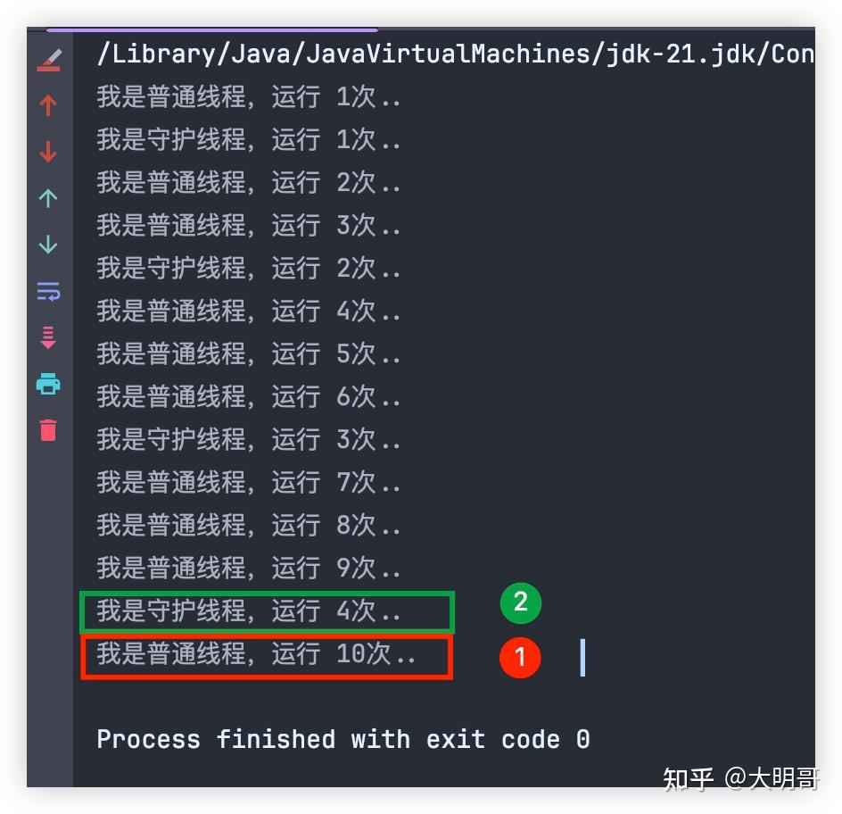
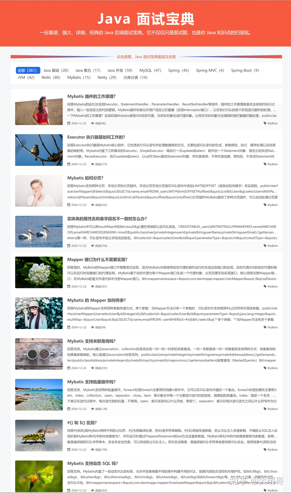

> @谢邀，我是大明哥，一个专注 **「死磕 Java」** 的硬核程序员。

在 Java 语言中，线程分为两类：

-   用户线程（User Thread）
-   守护线程（Deamon Threa）

一般情况下，如果不做特殊配置，我们创建的线程或线程池都是用户线程，所以用户线程也被称之为普通线程，它一般用于执行用户级任务。

而守护线程则是一种比较特殊的线程，它一般都是为其他的线程服务，在后台默认完成一些系统服务，比如垃圾回收线程就是一个典型的守护线程。

所以，在Java中，设计“守护线程”主要是为了处理一些后台任务，其目的是为了支持应用程序的运行，而不直接影响程序的业务逻辑。

这样做有如下几个优势：

-   **资源管理**：  
    

-   **自动清理**：守护线程通常用于一些清理和后台任务，比如垃圾回收（GC）。当应用程序中没有其他非守护线程在运行时，JVM可以自动退出，终止守护线程，这有助于程序退出时释放资源。

-   **不阻碍应用程序结束**：

-   **程序退出时自动结束**：守护线程和普通线程的一个重要区别是，当所有的非守护线程（普通线程）都结束时，守护线程会自动退出。这样，守护线程不会阻止JVM退出，避免了应用程序等待守护线程完成的情况。

-   **后台工作**：

-   守护线程通常用于执行一些后台工作，这些工作不需要用户干预。例如，日志记录、定时任务、数据缓存刷新等。守护线程确保这些任务在程序执行时能够持续进行，但如果所有的非守护线程结束，守护线程会被终止。

-   **性能提升**：

-   通过将某些任务交给守护线程来处理，可以提高程序的效率，避免这些任务与主线程的工作竞争CPU资源。这样，主线程的执行可以更加专注于核心的业务逻辑。

### 扩展

我们可以调用 setDaemon(true) 来设置某个线程为守护线程，但是它必须要放在线程的 `start()` 之前，否则程序会报错。

```text
public class DaemonThreadTest {
    public static void main(String[] args) throws Exception {
        Thread thread = new Thread(() ->{
            System.out.println("我是大明哥，这是大明哥的 Java 面试题 600 讲！！！");
        });

        thread.start();
        thread.setDaemon(true);
    }
}
```

执行结果：

```text
Exception in thread "main" java.lang.IllegalThreadStateException
  at java.base/java.lang.Thread.setDaemon(Thread.java:2239)
  at com.skjava.java.feature.DaemonThreadTest.main(DaemonThreadTest.java:10)
```

调用 `isDaemon()` 可以判断某个线程是否为守护线程：

```text
public class DaemonThreadTest {
    public static void main(String[] args) throws Exception {
        Thread thread1 = new Thread(() ->{
            System.out.println("我是大明哥，这是大明哥的 Java 面试题 600 讲！！！");
        });

        Thread thread2 = new Thread(() ->{
            System.out.println("我是大明哥，这是大明哥的 Java 面试题 600 讲！！！");
        });

        thread1.setDaemon(true);

        System.out.println("thread1 是否为守护线程：" + thread1.isDaemon());
        System.out.println("thread2 是否为守护线程：" + thread2.isDaemon());
    }
}
```

执行结果：

```text
thread1 是否为守护线程：true
thread2 是否为守护线程：false
```

大明哥在上面提过，当应用程序中只剩下守护线程时，JVM 就会退出：

```text
public class DaemonThreadTest {
    public static void main(String[] args) throws Exception {
        Thread thread1 = new Thread(() ->{
            for (int i = 1 ; i <= 10 ; i++) {
                System.out.println("我是守护线程，运行 " + i + "次..");

                try {
                    TimeUnit.MILLISECONDS.sleep(300);
                } catch (InterruptedException e) {
                    throw new RuntimeException(e);
                }
            }
        });
        thread1.setDaemon(true);

        Thread thread2 = new Thread(() ->{
            for (int i = 1 ; i <= 10 ; i++) {
                System.out.println("我是普通线程，运行 " + i + "次..");

                try {
                    TimeUnit.MILLISECONDS.sleep(100);
                } catch (InterruptedException e) {
                    throw new RuntimeException(e);
                }
            }
        });

        thread1.start();
        thread2.start();
    }
}
```

普通线程 for 循环 10 次，每次等待 100 毫秒，而守护线程 for 循环 10 次，每次等待 300 毫秒，运行结果如下：

  



  

普通线程执行了 10 次，而守护线程只执行了 4 次 JVM 就退出了。

如果我们在守护线程中创建线程呢，该线程是守护线程还是普通线程？

```text
public class DaemonThreadTest {
    public static void main(String[] args) throws Exception {
        Thread thread1 = new Thread(() ->{
            Thread thread2 = new Thread(() -> {

            });
            System.out.println("thread2 守护线程子线程是守护线程：" + thread2.isDaemon());
        });
        thread1.setDaemon(true);
        thread1.start();

        TimeUnit.SECONDS.sleep(2);
    }
}
```

执行结果：

```text
thread2 守护线程子线程是守护线程：true
```

所以**守护线程中创建的子线程，默认情况下也属于守护线程**。

* * *

> 以上内容来源大明哥的 \[**Java 面试宝典**\]。Java 面试宝典是大明哥全力打造的 Java 精品面试题，它是一份靠谱、强大、详细、经典的 Java 后端面试宝典。它不仅仅只是一道道面试题，而是一套完整的 Java 知识体系，一套你 Java 知识点的扫盲贴。

[Java 面试宝典 - 死磕 Java](https://link.zhihu.com/?target=https%3A//www.skjava.com/mianshi/baodian/1286795436)