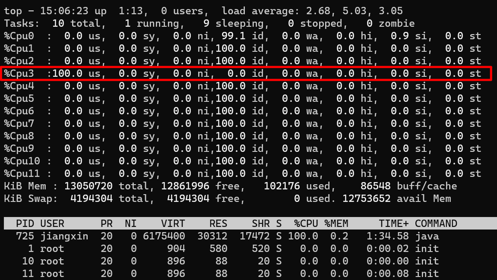
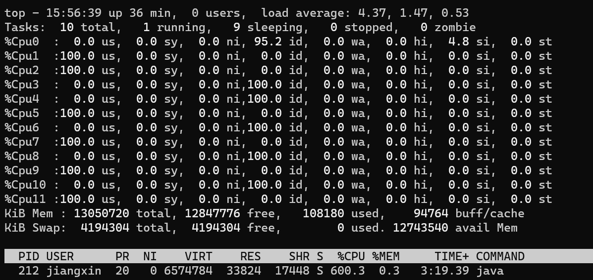
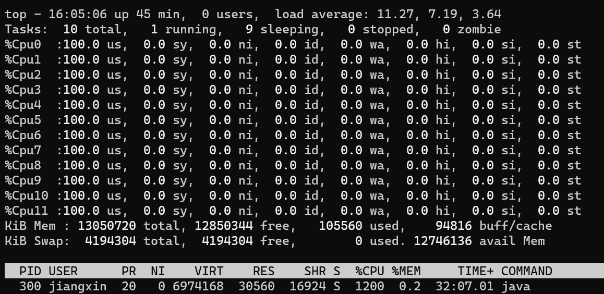
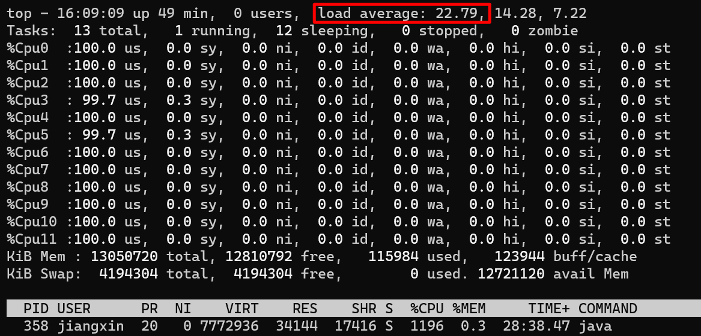
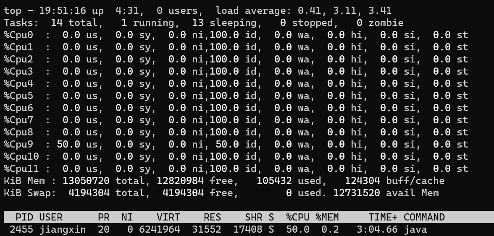
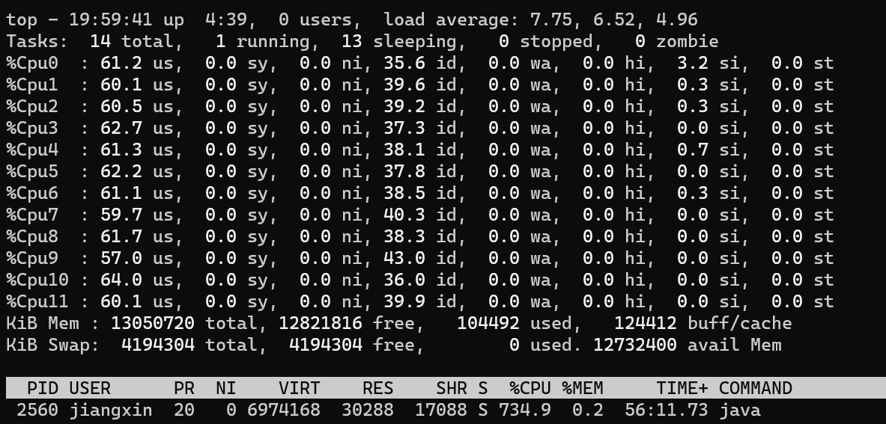
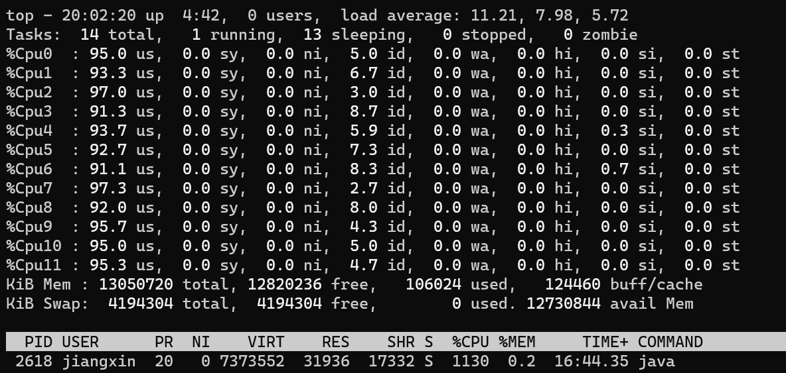
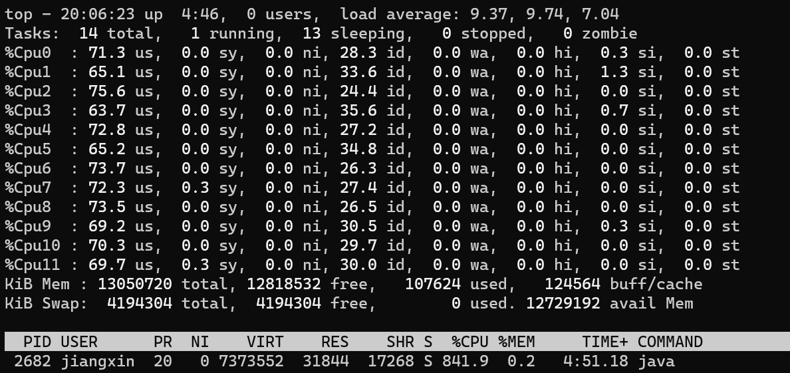
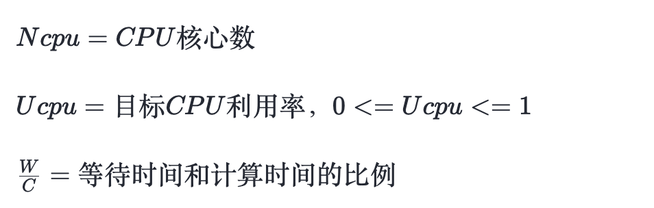
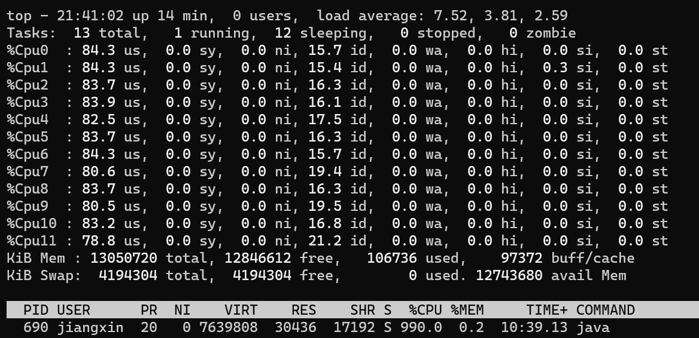

可能很多人都看到过一个线程数设置的理论：

-   CPU 密集型的程序 - 核心数 + 1
-   I/O 密集型的程序 - 核心数 \* 2

不会吧，不会吧，真的有人按照这个理论规划线程数？

## 线程数和 CPU 利用率的小测试

抛开一些操作系统，计算机原理不谈，说一个基本的理论（不用纠结是否严谨，只为好理解）：**一个 CPU 核心，单位时间内只能执行一个线程的指令**

那么理论上，我一个线程只需要不停的执行指令，就可以跑满一个核心的利用率。

来写个死循环空跑的例子验证一下：

**测试环境：AMD Ryzen 5 3600, 6 - Core, 12 - Threads**

```text
public class CPUUtilizationTest {
	public static void main(String[] args) {
		//死循环，什么都不做
		while (true){
		}
	}
}
```

运行这个例子后，来看看现在 CPU 的利用率：  



  
从图上可以看到，我的 3 号核心利用率已经被跑满了

那基于上面的理论，我多开几个线程试试呢？

```text
public class CPUUtilizationTest {
	public static void main(String[] args) {

		for (int j = 0; j < 6; j++) {
			new Thread(new Runnable() {
				@Override
				public void run() {
					while (true){
					}
				}
			}).start();
		}
	}
}
```

此时再看 CPU 利用率，1/2/5/7/9/11 几个核心的利用率已经被跑满：  



那如果开 12 个线程呢，是不是会把所有核心的利用率都跑满？答案一定是会的  



如果此时我把上面例子的线程数继续增加到 24 个线程，会出现什么结果呢？  



从上图可以看到，CPU 利用率和上一步一样，还是所有核心 100%，不过此时负载已经从 11.x 增加到了 22.x（load average 解释参考 [https://scoutapm.com/blog/understanding-load-averages](https://link.zhihu.com/?target=https%3A//www.oschina.net/action/GoToLink%3Furl%3Dhttps%253A%252F%252Fscoutapm.com%252Fblog%252Funderstanding-load-averages)），说明此时 CPU 更繁忙，线程的任务无法及时执行。

现代 CPU 基本都是多核心的，比如我这里测试用的 AMD 3600，6 核心 12 线程（超线程），我们可以简单的认为它就是 12 核心 CPU。那么我这个 CPU 就可以同时做 12 件事，互不打扰。

如果要执行的线程大于核心数，那么就需要通过操作系统的调度了。操作系统给每个线程分配 CPU 时间片资源，然后不停的切换，从而实现 “并行” 执行的效果。

但是这样真的更快吗？从上面的例子可以看出，**一个线程**就可以把**一个核心**的利用率跑满。如果每个线程都很 “霸道”，不停的执行指令，不给 CPU 空闲的时间，并且同时执行的线程数大于 CPU 的核心数，就会导致操作系统**更频繁的执行切换线程执行**，以确保每个线程都可以得到执行。

不过切换是有代价的，**每次切换会伴随着寄存器数据更新，内存页表更新等操作**。虽然一次切换的代价和 I/O 操作比起来微不足道，但如果线程过多，线程切换的过于频繁，甚至在单位时间内切换的耗时已经大于程序执行的时间，就会导致 CPU 资源过多的浪费在上下文切换上，而不是在执行程序，得不偿失。

上面死循环空跑的例子，有点过于极端了，正常情况下不太可能有这种程序。

大多程序在运行时都会有一些 I/O 操作，可能是读写文件，网络收发报文等，这些 I/O 操作在进行时时需要等待反馈的。比如网络读写时，需要等待报文发送或者接收到，在这个等待过程中，线程是等待状态，CPU 没有工作。此时操作系统就会调度 CPU 去执行其他线程的指令，这样就完美利用了 CPU 这段空闲期，提高了 CPU 的利用率。

上面的例子中，程序不停的循环什么都不做，CPU 要不停的执行指令，几乎没有啥空闲的时间。如果插入一段 I/O 操作呢，I/O 操作期间 CPU 是空闲状态，CPU 的利用率会怎么样呢？先看看单线程下的结果：

```text
public class CPUUtilizationTest {
	public static void main(String[] args) throws InterruptedException {

		for (int n = 0; n < 1; n++) {
			new Thread(new Runnable() {
				@Override
				public void run() {
					while (true){
                        //每次空循环 1亿 次后，sleep 50ms，模拟 I/O等待、切换
						for (int i = 0; i < 100_000_000l; i++) { 
						}
						try {
							Thread.sleep(50);
						}
						catch (InterruptedException e) {
							e.printStackTrace();
						}
					}
				}
			}).start();
		}
	}
}
```

  



哇，唯一有利用率的 9 号核心，利用率也才 50%，和前面没有 sleep 的 100% 相比，已经低了一半了。现在把线程数调整到 12 个看看：



单个核心的利用率 60 左右，和刚才的单线程结果差距不大，还没有把 CPU 利用率跑满，现在将线程数增加到 18：



此时单核心利用率，已经接近 100% 了。由此可见，当线程中有 I/O 等操作不占用 CPU 资源时，操作系统可以调度 CPU 可以同时执行更多的线程。

现在将 I/O 事件的频率调高看看呢，把循环次数减到一半，50\_000\_000，同样是 18 个线程：



此时每个核心的利用率，大概只有 70% 左右了。

## 线程数和 CPU 利用率的小总结

上面的例子，只是辅助，为了更好的理解线程数 / 程序行为 / CPU 状态的关系，来简单总结一下：

1.  一个极端的线程（不停执行 “计算” 型操作时），就可以把单个核心的利用率跑满，多核心 CPU 最多只能同时执行等于核心数的 “极端” 线程数
2.  如果每个线程都这么 “极端”，且同时执行的线程数超过核心数，会导致不必要的切换，造成负载过高，只会让执行更慢
3.  I/O 等暂停类操作时，CPU 处于空闲状态，操作系统调度 CPU 执行其他线程，可以提高 CPU 利用率，同时执行更多的线程
4.  I/O 事件的频率频率越高，或者等待 / 暂停时间越长，CPU 的空闲时间也就更长，利用率越低，操作系统可以调度 CPU 执行更多的线程

## 线程数规划的公式

前面的铺垫，都是为了帮助理解，现在来看看书本上的定义。《Java 并发编程实战》介绍了一个线程数计算的公式：



如果希望程序跑到 CPU 的目标利用率，需要的线程数公式为：


公式很清晰，现在来带入上面的例子试试看：

如果我期望目标利用率为 90%（多核 90），那么需要的线程数为：

核心数 12 \* 利用率 0.9 \* (1 + 50 (sleep 时间)/50 (循环 50\_000\_000 耗时)) ≈ 22

现在把线程数调到 22，看看结果：



现在 CPU 利用率大概 80+，和预期比较接近了，由于线程数过多，还有些上下文切换的开销，再加上测试用例不够严谨，所以实际利用率低一些也正常。

把公式变个形，还可以通过线程数来计算 CPU 利用率：


线程数 22 / (核心数 12 \* (1 + 50 (sleep 时间)/50 (循环 50\_000\_000 耗时))) ≈ 0.9

虽然公式很好，但在真实的程序中，**一般很难获得准确的等待时间和计算时间，因为程序很复杂，不只是 “计算”**。一段代码中会有很多的内存读写，计算，I/O 等复合操作，精确的获取这两个指标很难，所以光靠公式计算线程数过于理想化。

## 真实程序中的线程数

那么在实际的程序中，或者说一些 Java 的业务系统中，线程数（线程池大小）规划多少合适呢？

**先说结论：没有固定答案，先设定预期，比如我期望的 CPU 利用率在多少，负载在多少，GC 频率多少之类的指标后，再通过测试不断的调整到一个合理的线程数**

比如一个普通的，SpringBoot 为基础的业务系统，默认 Tomcat 容器 + HikariCP 连接池 + G1 回收器，如果此时项目中也需要一个业务场景的多线程（或者线程池）来异步 / 并行执行业务流程。

此时我按照上面的公式来规划线程数的话，误差一定会很大。因为此时这台主机上，已经有很多运行中的线程了，Tomcat 有自己的线程池，HikariCP 也有自己的后台线程，JVM 也有一些编译的线程，连 G1 都有自己的后台线程。这些线程也是运行在当前进程、当前主机上的，也会占用 CPU 的资源。

**所以受环境干扰下，单靠公式很难准确的规划线程数，一定要通过测试来验证。**

流程一般是这样：

1.  分析当前主机上，有没有其他进程干扰
2.  分析当前 JVM 进程上，有没有其他运行中或可能运行的线程
3.  设定目标  
    

1.  目标 CPU 利用率 - 我最高能容忍我的 CPU 飙到多少？
2.  目标 GC 频率 / 暂停时间 - 多线程执行后，GC 频率会增高，最大能容忍到什么频率，每次暂停时间多少？
3.  执行效率 - 比如批处理时，我单位时间内要开多少线程才能及时处理完毕
4.  ……

5.  梳理链路关键点，是否有卡脖子的点，因为如果线程数过多，链路上某些节点资源有限可能会导致大量的线程在等待资源（比如三方接口限流，连接池数量有限，中间件压力过大无法支撑等）
6.  不断的增加 / 减少线程数来测试，按最高的要求去测试，最终获得一个 “满足要求” 的线程数 \*\*

**而且而且而且！不同场景下的线程数理念也有所不同：**

1.  Tomcat 中的 maxThreads，在 Blocking I/O 和 No-Blocking I/O 下就不一样
2.  Dubbo 默认还是单连接呢，也有 I/O 线程（池）和业务线程（池）的区分，I/O 线程一般不是瓶颈，所以不必太多，但业务线程很容易称为瓶颈
3.  Redis 6.0 以后也是多线程了，不过它只是 I/O 多线程，“业务” 处理还是单线程

**所以，不要纠结设置多少线程了。没有标准答案，一定要结合场景，带着目标，通过测试去找到一个最合适的线程数。**

可能还有同学可能会有疑问：“我们系统也没啥压力，不需要那么合适的线程数，只是一个简单的异步场景，不影响系统其他功能就可以”

很正常，很多的内部业务系统，并不需要啥性能，稳定好用符合需求就可以了。那么我的推荐的线程数是：**CPU 核心数**

## 附录

### Java 获取 CPU 核心数

```text
Runtime.getRuntime().availableProcessors()//获取逻辑核心数，如6核心12线程，那么返回的是12
```

### Linux 获取 CPU 核心数

```text
# 总核数 = 物理CPU个数 X 每颗物理CPU的核数 
# 总逻辑CPU数 = 物理CPU个数 X 每颗物理CPU的核数 X 超线程数

# 查看物理CPU个数
cat /proc/cpuinfo| grep "physical id"| sort| uniq| wc -l

# 查看每个物理CPU中core的个数(即核数)
cat /proc/cpuinfo| grep "cpu cores"| uniq

# 查看逻辑CPU的个数
cat /proc/cpuinfo| grep "processor"| wc -l
```

如果我的文章对您有帮助，请点赞 / 收藏 / 关注鼓励支持一下吧❤❤❤❤❤❤

> 作者：京东保险 蒋信  
> 来源：京东云开发者社区 转载请注明来源