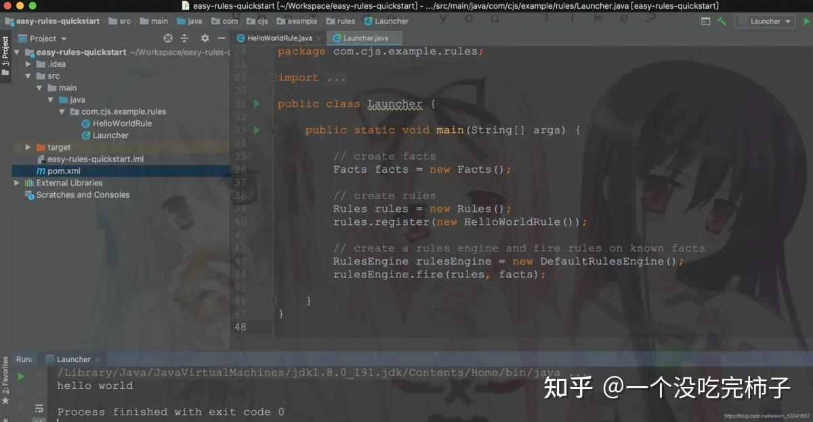
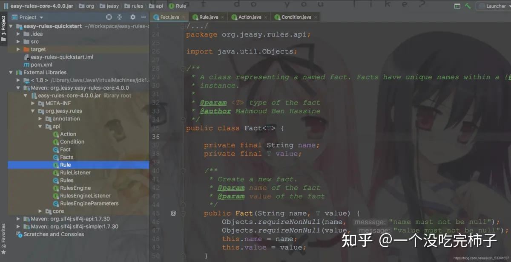
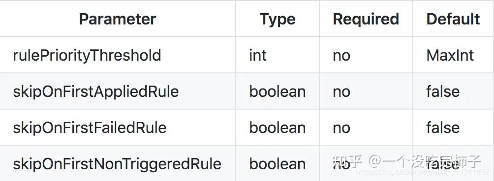
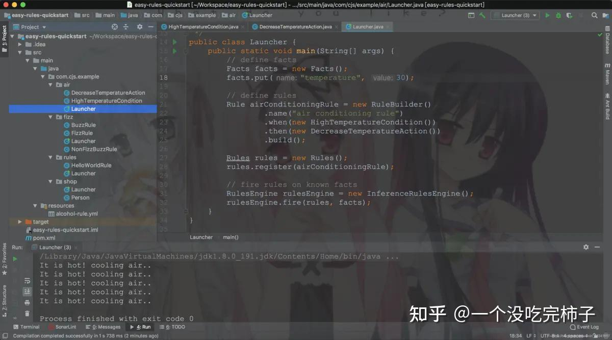

**1\. Easy Rules 概述**  
Easy Rules是一个Java规则引擎，灵感来自一篇名为《Should I use a Rules Engine?》的文章  
规则引擎就是提供一种可选的计算模型。与通常的命令式模型（由带有条件和循环的命令依次组成）不同，规则引擎基于生产规则系统。这是一组生产规则，每条规则都有一个条件（condition）和一个动作（action）———— 简单地说，可以将其看作是一组if-then语句。  
精妙之处在于规则可以按任何顺序编写，引擎会决定何时使用对顺序有意义的任何方式来计算它们。考虑它的一个好方法是系统运行所有规则，选择条件成立的规则，然后执行相应的操作。这样做的好处是，很多问题都很自然地符合这个模型：  

```java
if car.owner.hasCellPhone then premium += 100;
if car.model.theftRating > 4 then premium += 200;
if car.owner.livesInDodgyArea && car.model.theftRating > 2 then premium += 300;
```

规则引擎是一种工具，它使得这种计算模型编程变得更容易。它可能是一个完整的开发环境，或者一个可以在传统平台上工作的框架。生产规则计算模型最适合仅解决一部分计算问题，因此规则引擎可以更好地嵌入到较大的系统中。  
你可以自己构建一个简单的规则引擎。你所需要做的就是创建一组带有条件和动作的对象，将它们存储在一个集合中，然后遍历它们以评估条件并执行这些动作。  
Easy Rules它提供Rule抽象以创建具有条件和动作的规则，并提供RuleEngine API，该API通过一组规则运行以评估条件并执行动作。  
Easy Rules简单易用，只需两步：  
首先，定义规则，方式有很多种  
  
**方式一：注解**

```java
@Rule(name = "weather rule", description = "if it rains then take an umbrella")
public class WeatherRule {

    @Condition
    public boolean itRains(@Fact("rain") boolean rain) {
        return rain;
    }
    
    @Action
    public void takeAnUmbrella() {
        System.out.println("It rains, take an umbrella!");
    }
}
```

**方式二：链式编程**

```java
Rule weatherRule = new RuleBuilder()
        .name("weather rule")
        .description("if it rains then take an umbrella")
        .when(facts -> facts.get("rain").equals(true))
        .then(facts -> System.out.println("It rains, take an umbrella!"))
        .build();
```

**方式三：表达式**

```java
Rule weatherRule = new MVELRule()
        .name("weather rule")
        .description("if it rains then take an umbrella")
        .when("rain == true")
        .then("System.out.println(\"It rains, take an umbrella!\");");
```

**方式四：yml配置文件**

例如：weather-rule.yml

```java
name: "weather rule"
description: "if it rains then take an umbrella"
condition: "rain == true"
actions:
  - "System.out.println(\"It rains, take an umbrella!\");"
```

  

```java
VELRuleFactory ruleFactory = new MVELRuleFactory(new YamlRuleDefinitionReader());
Rule weatherRule = ruleFactory.createRule(new FileReader("weather-rule.yml"));
```

接下来，应用规则

```java
public class Test {
    public static void main(String[] args) {
        // define facts
        Facts facts = new Facts();
        facts.put("rain", true);

        // define rules
        Rule weatherRule = ...
        Rules rules = new Rules();
        rules.register(weatherRule);

        // fire rules on known facts
        RulesEngine rulesEngine = new DefaultRulesEngine();
        rulesEngine.fire(rules, facts);
    }
}
```

入门案例：Hello Easy Rules

```java
mvn archetype:generate \
    -DarchetypeGroupId=org.jeasy \
    -DarchetypeArtifactId=easy-rules-archetype \
    -DarchetypeVersion=4.0.0
```

通过骨架创建maven项目：

```java
mvn archetype:generate \
    -DarchetypeGroupId=org.jeasy \
    -DarchetypeArtifactId=easy-rules-archetype \
    -DarchetypeVersion=4.0.0
```

默认给我们生成了一个HelloWorldRule规则，如下：

```java
package com.cjs.example.rules;

import org.jeasy.rules.annotation.Action;
import org.jeasy.rules.annotation.Condition;
import org.jeasy.rules.annotation.Rule;

@Rule(name = "Hello World rule", description = "Always say hello world")
public class HelloWorldRule {

    @Condition
    public boolean when() {
        return true;
    }

    @Action
    public void then() throws Exception {
        System.out.println("hello world");
    }

}
```



**2\. 规则定义**

**2.1. 定义规则**

大多数业务规则可以用以下定义表示：

> Name : 一个命名空间下的唯一的规则名称  
> Description : 规则的简要描述  
> Priority : 相对于其他规则的优先级  
> Facts : 事实，可立即为要处理的数据  
> Conditions : 为了应用规则而必须满足的一组条件  
> Actions : 当条件满足时执行的一组动作  
> Easy Rules为每个关键点提供了一个抽象来定义业务规则。

在Easy Rules中，Rule接口代表规则

```java
public interface Rule {

    /**
    * This method encapsulates the rule's conditions.
    * @return true if the rule should be applied given the provided facts, false otherwise
    */
    boolean evaluate(Facts facts);

    /**
    * This method encapsulates the rule's actions.
    * @throws Exception if an error occurs during actions performing
    */
    void execute(Facts facts) throws Exception;

    //Getters and setters for rule name, description and priority omitted.

}
```

evaluate方法封装了必须计算结果为TRUE才能触发规则的条件。execute方法封装了在满足规则条件时应该执行的动作。条件和操作由Condition和Action接口表示。  
定义规则有两种方式：

> 通过在POJO类上添加注解  
> 通过RuleBuilder API编程

可以在一个POJO类上添加@Rule注解，例如：

```java
@Rule(name = "my rule", description = "my rule description", priority = 1)
public class MyRule {

    @Condition
    public boolean when(@Fact("fact") fact) {
        //my rule conditions
        return true;
    }

    @Action(order = 1)
    public void then(Facts facts) throws Exception {
        //my actions
    }

    @Action(order = 2)
    public void finally() throws Exception {
        //my final actions
    }

}
```

@Condition注解指定规则条件  
@Fact注解指定参数  
@Action注解指定规则执行的动作

RuleBuilder支持链式风格定义规则，例如：

```java
Rule rule = new RuleBuilder()
                .name("myRule")
                .description("myRuleDescription")
                .priority(3)
                .when(condition)
                .then(action1)
                .then(action2)
                .build();
```

**组合规则**  
CompositeRule由一组规则组成。这是一个典型地组合设计模式的实现。  
组合规则是一个抽象概念，因为可以以不同方式触发组合规则。  
Easy Rules自带三种CompositeRule实现：  

> UnitRuleGroup : 要么应用所有规则，要么不应用任何规则（AND逻辑）  
> ActivationRuleGroup : 它触发第一个适用规则，并忽略组中的其他规则（XOR逻辑）  
> ConditionalRuleGroup : 如果具有最高优先级的规则计算结果为true，则触发其余规则

复合规则可以从基本规则创建并注册为常规规则：

```java
//Create a composite rule from two primitive rules
UnitRuleGroup myUnitRuleGroup = new UnitRuleGroup("myUnitRuleGroup", "unit of myRule1 and myRule2");
myUnitRuleGroup.addRule(myRule1);
myUnitRuleGroup.addRule(myRule2);

//Register the composite rule as a regular rule
Rules rules = new Rules();
rules.register(myUnitRuleGroup);

RulesEngine rulesEngine = new DefaultRulesEngine();
rulesEngine.fire(rules, someFacts);
```

每个规则都有优先级。它代表触发注册规则的默认顺序。默认情况下，较低的值表示较高的优先级。可以重写compareTo方法以提供自定义优先级策略。  
**2.2. 定义事实**  
在Easy Rules中，Fact API代表事实

```java
public class Fact<T> {
     private final String name;
     private final T value;
}
```



举个栗子：

```java
Fact<String> fact = new Fact("foo", "bar");
Facts facts = new Facts();
facts.add(fact);
```

或者，也可以用这样简写形式

```java
Facts facts = new Facts();
facts.put("foo", "bar");
```

用@Fact注解可以将Facts注入到condition和action方法中

```java
@Rule
class WeatherRule {

    @Condition
    public boolean itRains(@Fact("rain") boolean rain) {
        return rain;
    }

    @Action
    public void takeAnUmbrella(Facts facts) {
        System.out.println("It rains, take an umbrella!");
        // can add/remove/modify facts
    }

}
```

**2.3. 定义规则引擎**  
Easy Rules提供两种RulesEngine接口实现：

> DefaultRulesEngine : 根据规则的自然顺序应用规则  
> InferenceRulesEngine : 持续对已知事实应用规则，直到不再适用任何规则为止

创建规则引擎：

```java
RulesEngine rulesEngine = new DefaultRulesEngine();

// or

RulesEngine rulesEngine = new InferenceRulesEngine();
```

然后，注册规则

```java
rulesEngine.fire(rules, facts);
```

规则引擎有一些可配置的参数，如下图所示：



举个栗子：

```java
RulesEngineParameters parameters = new RulesEngineParameters()
    .rulePriorityThreshold(10)
    .skipOnFirstAppliedRule(true)
    .skipOnFirstFailedRule(true)
    .skipOnFirstNonTriggeredRule(true);

RulesEngine rulesEngine = new DefaultRulesEngine(parameters);
```

**2.4. 定义规则监听器**

通过实现RuleListener接口

```java
public interface RuleListener {

    /**
     * Triggered before the evaluation of a rule.
     *
     * @param rule being evaluated
     * @param facts known before evaluating the rule
     * @return true if the rule should be evaluated, false otherwise
     */
    default boolean beforeEvaluate(Rule rule, Facts facts) {
        return true;
    }

    /**
     * Triggered after the evaluation of a rule.
     *
     * @param rule that has been evaluated
     * @param facts known after evaluating the rule
     * @param evaluationResult true if the rule evaluated to true, false otherwise
     */
    default void afterEvaluate(Rule rule, Facts facts, boolean evaluationResult) { }

    /**
     * Triggered on condition evaluation error due to any runtime exception.
     *
     * @param rule that has been evaluated
     * @param facts known while evaluating the rule
     * @param exception that happened while attempting to evaluate the condition.
     */
    default void onEvaluationError(Rule rule, Facts facts, Exception exception) { }

    /**
     * Triggered before the execution of a rule.
     *
     * @param rule the current rule
     * @param facts known facts before executing the rule
     */
    default void beforeExecute(Rule rule, Facts facts) { }

    /**
     * Triggered after a rule has been executed successfully.
     *
     * @param rule the current rule
     * @param facts known facts after executing the rule
     */
    default void onSuccess(Rule rule, Facts facts) { }

    /**
     * Triggered after a rule has failed.
     *
     * @param rule the current rule
     * @param facts known facts after executing the rule
     * @param exception the exception thrown when attempting to execute the rule
     */
    default void onFailure(Rule rule, Facts facts, Exception exception) { }

}
```

**3\. 示例**

```java
<project xmlns="http://maven.apache.org/POM/4.0.0" xmlns:xsi="http://www.w3.org/2001/XMLSchema-instance"
  xsi:schemaLocation="http://maven.apache.org/POM/4.0.0 http://maven.apache.org/maven-v4_0_0.xsd">
    <modelVersion>4.0.0</modelVersion>
    <groupId>com.cjs.example</groupId>
    <artifactId>easy-rules-quickstart</artifactId>
    <version>1.0.0-SNAPSHOT</version>
    <packaging>jar</packaging>
    <dependencies>
        <dependency>
            <groupId>org.jeasy</groupId>
            <artifactId>easy-rules-core</artifactId>
            <version>4.0.0</version>
        </dependency>
        <dependency>
            <groupId>org.jeasy</groupId>
            <artifactId>easy-rules-support</artifactId>
            <version>4.0.0</version>
        </dependency>
        <dependency>
            <groupId>org.jeasy</groupId>
            <artifactId>easy-rules-mvel</artifactId>
            <version>4.0.0</version>
        </dependency>
        <dependency>
            <groupId>org.slf4j</groupId>
            <artifactId>slf4j-simple</artifactId>
            <version>1.7.30</version>
        </dependency>
    </dependencies>
</project>
```



**. 扩展**  
规则本质上是一个函数，如y=f(x1,x2,..,xn)  
规则引擎就是为了解决业务代码和业务规则分离的引擎，是一种嵌入在应用程序中的组件，实现了将业务决策从应用程序代码中分离。  
还有一种常见的方式是Java+Groovy来实现，Java内嵌Groovy脚本引擎进行业务规则剥离。

[这里有一份JAVA架构基础知识已经各大厂面试试题](https://link.zhihu.com/?target=https%3A//shimo.im/docs/kjIGLMdAL2QX6jTZ/)各位感兴趣的点击领取