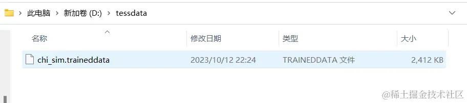
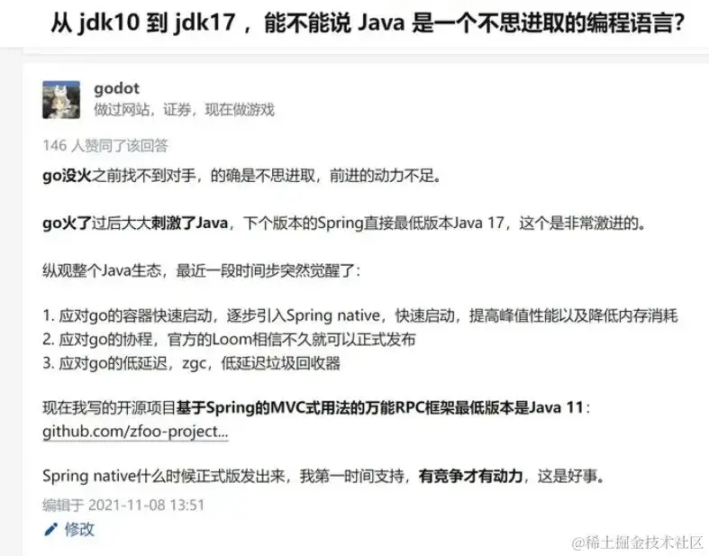
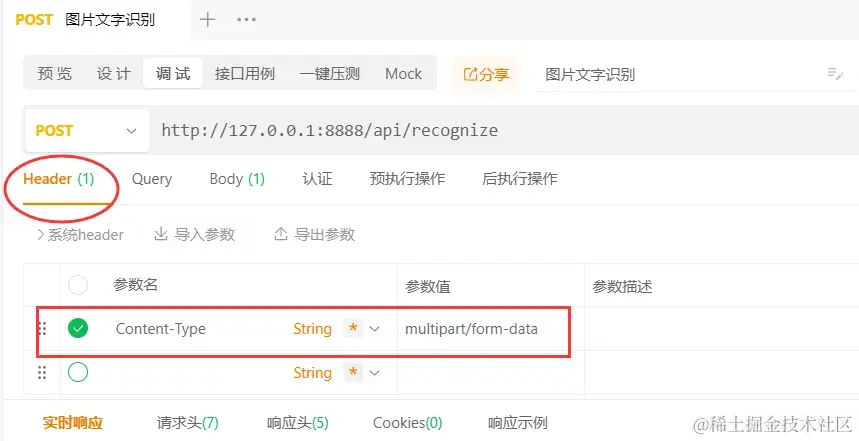
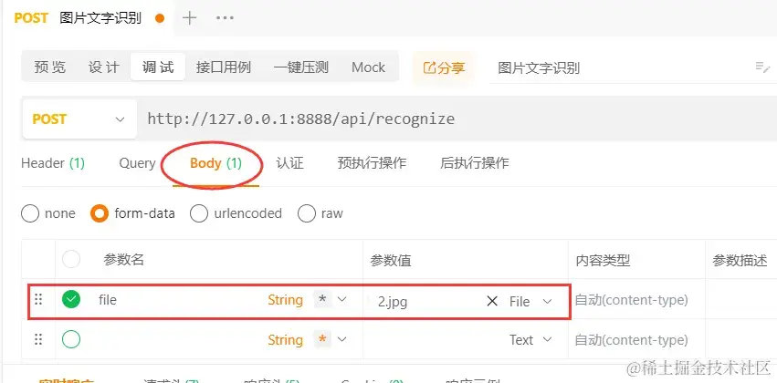
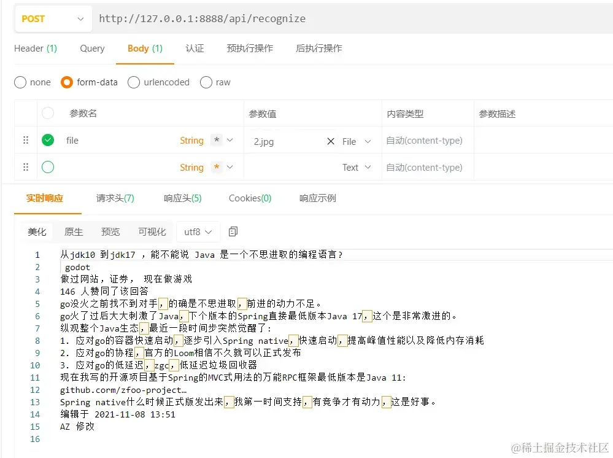

## 什么是Tess4j库

先简单给没听过的xdm解释下，这里要分清楚Tesseract和Tess4j的区别。

Tesseract是一个开源的光学字符识别（OCR）引擎，它可以将图像中的文字转换为计算机可读的文本。支持多种语言和书面语言，并且可以在命令行中执行。它是一个流行的开源OCR工具，可以在许多不同的操作系统上运行。

Tess4J是一个基于Tesseract OCR引擎的Java接口，可以用来识别图像中的文本，说白了，就是封装了它的API，让Java可以直接调用。

搞清楚这俩东西，就足够了。

## 案例

## 1、引入依赖

既然是SpringBoot，基础依赖我就不赘述了，这里贴下Tess4J的依赖，是可以用maven下载的。

```text
<!-- tess4j -->
<dependency>
    <groupId>net.sourceforge.tess4j</groupId>
    <artifactId>tess4j</artifactId>
    <version>4.5.4</version>
</dependency>
```

## 2、yml配置

这里，我特地把训练数据的目录路径配置在yml里，后续可以扩展到配置中心。

```text
server:
  port: 8888

# 训练数据文件夹的路径
tess4j:
  datapath: D:/tessdata
```

然后我解释下什么是训练数据

Tesseract OCR库通过训练数据来学习不同语言和字体的特征，以便更好地识别图片中的文字。

在安装Tesseract OCR库时，通常会生成一个包含多个子文件夹的训练数据文件夹，其中每个子文件夹都包含了特定语言或字体的训练数据。

比如我这里是下载后放到了D盘的tessdata目录下，如图所示，其实就是一个.traineddata为后缀的文件，大小约2M多。



如果你没有特定的训练数据需求，使用默认的训练数据文件即可，我这里就是直接下载默认的来用的。

还有一点要注意的是，直接读resource目录下的路径是读不到的哈，所以我放到了D盘，训练数据本身也是更推荐放到独立的位置，方便后续训练数据。

## 3、config配置类

我们新建一个配置类，初始化一下Tesseract类，交给Spring管理，这样借用了Spring的单例模式。

```text
package com.example.tesseractocr.config;

import net.sourceforge.tess4j.Tesseract;
import org.springframework.beans.factory.annotation.Value;
import org.springframework.context.annotation.Bean;
import org.springframework.context.annotation.Configuration;

/**
 * @作者: 
 * @日期: 2023/10/12 22:58
 * @描述:
 */
@Configuration
public class TesseractOcrConfiguration {

   @Value("${tess4j.datapath}")
   private String dataPath;

   @Bean
   public Tesseract tesseract() {

      Tesseract tesseract = new Tesseract();
      // 设置训练数据文件夹路径
      tesseract.setDatapath(dataPath);
      // 设置为中文简体
      tesseract.setLanguage("chi_sim");
      return tesseract;
   }
}
```

## 4、service实现

> 就几行代码，非常简单。

```text
package com.example.tesseractocr.service;

import lombok.AllArgsConstructor;
import net.sourceforge.tess4j.*;
import org.springframework.stereotype.Service;
import org.springframework.web.multipart.MultipartFile;

import javax.imageio.ImageIO;
import java.awt.image.BufferedImage;
import java.io.ByteArrayInputStream;
import java.io.IOException;
import java.io.InputStream;

@Service
@AllArgsConstructor
public class OcrService {

    private final Tesseract tesseract;

   /**
    * 识别图片中的文字
    * @param imageFile 图片文件
    * @return 文字信息
    */
    public String recognizeText(MultipartFile imageFile) throws TesseractException, IOException {

        // 转换
        InputStream sbs = new ByteArrayInputStream(imageFile.getBytes());
        BufferedImage bufferedImage = ImageIO.read(sbs);

        // 对图片进行文字识别
        return tesseract.doOCR(bufferedImage);
    }
}
```

## 5、新增rest接口

> 我们新建一个rest接口，用来测试效果，使用上传图片文件的方式。

```text
package com.example.tesseractocr.controller;

import com.example.tesseractocr.service.OcrService;
import lombok.AllArgsConstructor;
import net.sourceforge.tess4j.TesseractException;
import org.springframework.http.MediaType;
import org.springframework.web.bind.annotation.PostMapping;
import org.springframework.web.bind.annotation.RequestMapping;
import org.springframework.web.bind.annotation.RequestParam;
import org.springframework.web.bind.annotation.RestController;
import org.springframework.web.multipart.MultipartFile;

import java.io.IOException;

@RequestMapping("/api")
@RestController
@AllArgsConstructor
public class OcrController {
    private final OcrService ocrService;

    @PostMapping(value = "/recognize", consumes = MediaType.MULTIPART_FORM_DATA_VALUE)
    public String recognizeImage(@RequestParam("file") MultipartFile file) throws TesseractException, IOException {

      // 调用OcrService中的方法进行文字识别
      return ocrService.recognizeText(file);
    }
}
```

## 6、测试效果

这里我用ApiPost工具来测试下最终效果

我准备的一张图片如下，是从知乎上随便截取的一张。



我们调接口试一下，这里要设置Header的Content-Type，别忘了哈。



这里是body中的参数，我们选择form-data中的File属性，表示以上传文件形式来调接口。



看下效果，其实还是挺不错的，我和图片比对了一下，基本上都识别出来了。



## 相关地址

1）、Tesseract-ocr官方Github地址：[http://github.com/tesseract-o](https://link.zhihu.com/?target=http%3A//github.com/tesseract-o)…

2）、Tesseract-ocr安装下载：[http://digi.bib.uni-mannheim.de/tesseract/](https://link.zhihu.com/?target=http%3A//digi.bib.uni-mannheim.de/tesseract/)

PS：这里我没有用官方Github文档中给的地址，因为太慢了，找了一个下载比较快的，你们可以往下拉找到win64位的安装即可，如果没有训练需求，不用下也可以）

3）、训练文件：[http://digi.bib.uni-mannheim.de/tesseract/t](https://link.zhihu.com/?target=http%3A//digi.bib.uni-mannheim.de/tesseract/t)…

PS：在2）的路径下，有一个tessdata\_fast目录，点进去就能直接下载到默认训练文件，这种比较简便，省去了前面安装下载的过程。

4）、案例代码：[http://gitee.com/fangfuji/ja](https://link.zhihu.com/?target=http%3A//gitee.com/fangfuji/ja)…

PS：代码放在Gitee上，在同名博文目录里面，包含代码+安装文件+训练文件。

## 总结

是不是非常简单xdm，反正我觉得挺有意思的，后面抽空再试试训练数据。

好了，今天的小知识，你学会了吗？