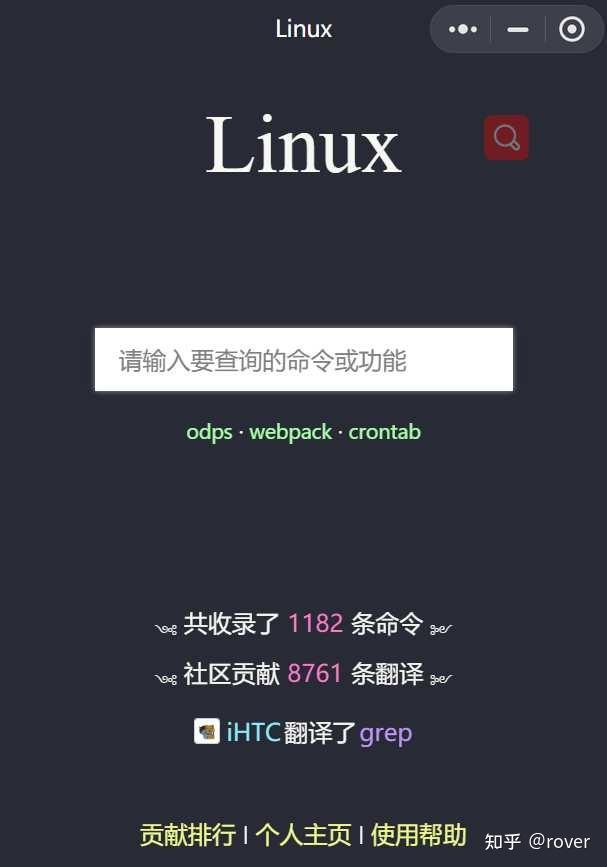
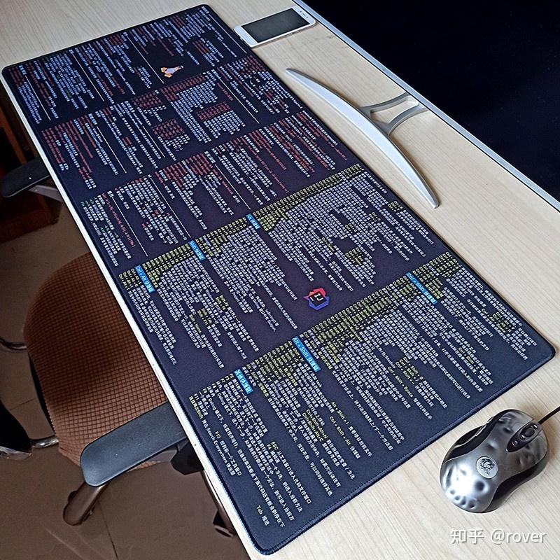

曾经常年使用Linux，这题我会！先说结论，其实不需要记住太多命令和参数，刻意去背命令、背参数更没必要。

> 更新：没想到获得大家这么多认可，文末再更新2个实用技巧。

**1、真正常用的不多。**

如果你的操作相对固定，只要记住20个左右的命令，基本就能满足需要了，大都是增删改查一些文件、目录或进程等，比如ls/cd/cp/mv/rm/ps/pwd/mkdir/vi等，其他不常用的，再去现用现查就行。

**2、结合英文含义记忆。**

什么？20个也记不住？结合命令的英文含义吧，是不是清晰了很多？比如

> ls = list  
> cd = change directory  
> cp = copy  
> rm = remove  
> mv = move  
> pwd = print work directory  
> ps = process status  
> df = disk free  
> du = disk usage  
> mkdir = make directory  
> rmdir = remove directory  
> su = switch user  
> chown = change owner  
> chmod = change mode

不只是命令，参数也是类似的，可以用英文含义辅助记忆，比如：

> \-a = all  
> \-l = list  
> \-f = force  
> \-h = -human-readable  
> \-n = number  
> \-u = user  
> \-z = zip

**3、活用补全和帮助**

太长的命令记不住时，用tab补全，比如iptables那一堆；具体的参数记不住时，用man或者help。

输入很长的文件名或路径名时，也可以使用tab补全，很省劲，不用一点点敲了。

**4、建立个人知识库**

对于那些常用的、带有多个参数的命令行，或是用了awk/grep/sed进行了复杂嵌套的，不需要特地背下来，如果敲错一点点，整个命令的输出都会有问题，甚至有可能酿成大祸！

建议把这些用一个文档保存下来，不单单要保存命令，还要注明这些命令是做什么的。等到需要的时候，直接打开文档复制就好，又准确又省事。

**5、TLDR工具**

TLDR是著名的Linux命令行手册开源项目，是英语Too Long Didn't Read（太长不看）的缩写，就是想反对冗长的man和help内容，建立一个简化的、社区驱动的手册集合。

-   TLDR的GitHub地址：[tldr-pages/tldr](https://link.zhihu.com/?target=https%3A//github.com/tldr-pages/tldr)

TLDR可以安装在Linux上，然后使用tldr <commandname>就能快速查找，也有Web、Android 和 iOS 版本可以使用。

-   TLDR的Web页面：[tldr | simplified, community driven man pages](https://link.zhihu.com/?target=https%3A//tldr.ostera.io/)

**6、Linux命令查询中文资源**

TLDR虽好，但毕竟是英文网站。很多人遇到不会的命令，还是习惯随手去百度查，但查出来的不一定是最合适的命令，甚至可能是错误的。

那么有Linux命令查询的中文资源吗？当然有！我在大量查询和对比之后，推荐这两个：

-   [Linux命令大全(手册) - 真正好用的Linux命令在线查询网站](https://link.zhihu.com/?target=https%3A//www.linuxcool.com/)

这个站应该是著名的《Linux就该这么学》的作者建立的，可以根据命令或功能进行双向查询。

-   Linux（微信小程序）

是的，名字就叫Linux，是“Linux中国”公众号开发的，基于TLDR项目翻译，同样可以命令或功能双向查询。有兴趣的同学也可以参与编辑，共同完善。

**7、利用工具辅助**

虽然不提倡死记硬背，但我认为，初学者还是有必要完整过一遍常用命令，可以对哪些命令能做什么有一个整体印象，对理解Linux也很有帮助。建议跟着纸质书学习，看起来更舒服一些，也可以作为工具书，放在手边随时翻阅。

-   工具书

命令行方面的Linux工具书，强烈推荐以下几本经典教材，当时都看了不止一遍。

大家可以点进去看看目录，对比一下哪本更适合自己。

-   鼠标垫

还有一种做法，就是买一个大鼠标垫，大小和内容都能定制，类似这样的：

不单单是Linux，连Java、Python、MySQL、Android等等，都不用刻意记了，低头就能查，哈哈。实在查不到或者更加冷门的，再去查书或者搜索也不迟。

-   机械键盘

Linux命令记熟了，不展示一下怎么行，必须再配个机械键盘啊！噼里啪啦一通，命令行输入+各种快捷键，半天不碰鼠标，周围人不由地投来仰慕的眼神。

**总结一下，以上主要介绍了这些办法：**

1、常用的命令建议记住，其实没多少

2、记忆的时候结合英文含义，会更容易

3、善用自动补全和帮助

4、建立个人知识库

5、安装TLDR工具

6、使用中文网站或小程序

7、利用工具书或鼠标垫进行辅助

**纯手打，如果各位觉得有帮助，别光收藏，请双击点个赞吧，抱拳感谢！**

