作者：sakychen，腾讯 CSIG 后台开发工程师

MongoDB 是一个强大的分布式存储引擎，天然支持高可用、分布式和灵活设计。MongoDB 的一个很重要的设计理念是：服务端只关注底层核心能力的输出，至于怎么用，就尽可能的将工作交个客户端去决策。这也就是 MongoDB 灵活性的保证，但是灵活性带来的代价就是使用成本的提升。与 MySql 相比，想要用好 MongoDB，减少在项目中出问题，用户需要掌握的东西更多。本文致力于全方位的介绍 MongoDB 的理论和应用知识，目标是让大家可以通过阅读这篇文章之后能够掌握 MongoDB 的常用知识，具备在实际项目中高效应用 MongoDB 的能力。

本文既有 MongoDB 基础知识也有相对深入的进阶知识，同时适用于对 MonogDB 感兴趣的初学者或者希望对 MongoDB 有更深入了解的业务开发者。


### **前言**

以下是笔者在学习和使用 MongoDB 过程中总结的 MongoDB 知识图谱。本文将按照一下图谱中依次介绍 MongoDB 的一些核心内容。由于能力和篇幅有限，本文并不会对图谱中全部内容都做深入分析，后续将会针对特定条目做专门的分析。同时，如果图谱和内容中有错误或疏漏的地方，也请大家随意指正，笔者这边会积极修正和完善。

本文按照图谱从以下 3 个方面来介绍 MongoDB 相关知识：

1.  **基础知识**：主要介绍 MongoDB 的重要特性，No Schema、高可用、分布式扩展等特性，以及支撑这些特性的相关设计
2.  **应用接入：**主要介绍 MongoDB 的一些测试数据、接入方式、spring-data-mongo 应用以及使用 Mongo 的一些注意事项。
3.  **进阶知识：**主要介绍 MongoDB 的一些核心功能的设计实现，包括 WiredTiger 存储引擎介绍、Page/Chunk 等数据结构、一致性/高可用保证、索引等相关知识。

（ps：如果大家对某部分知识感兴趣，这里又没有讲解的话，可以自行在网上搜索相关知识，或者连续我，大家共同讨论学习进步）

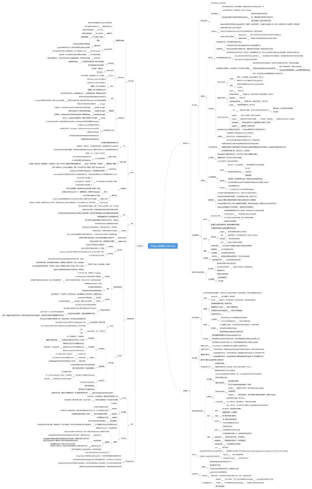

### **第一部分：基础知识**

MongoDB 是基于文档的 NoSql 存储引擎。MongoDB 的数据库管理由数据库、Collection（集合，类似 MySql 的表）、Document（文档，类似 MySQL 的行）组成，每个 Document 都是一个类 JSON 结构 BSON 结构数据。

MongoDB 的核心特性是：No Schema、高可用、分布式（可平行扩展），另外 MongoDB 自带数据压缩功能，使得同样的数据存储所需的资源更少。本节将会依次介绍这些特性的基本知识，以及 MongoDB 是如何实现这些能力的。

### **1.1 No Schema**

MongoDB 是文档型数据库，其文档组织结构是 BSON(Binary Serialized Document Format) 是类 JSON 的二进制存储格式，数据组织和访问方式完全和 JSON 一样。支持动态的添加字段、支持内嵌对象和数组对象，同时它也对 JSON 做了一些扩充，如支持 Date 和 BinData 数据类型。正是 BSON 这种字段灵活管理能力赋予了 Mongo 的 No Schema 或者 Schema Free 的特性。

No Schema 特性带来的好处包括：

-   强大的表现能力：对象嵌套和数组结构可以让数据库中的对象具备更高的表现能力，能够用更少的数据对象表现复杂的领域模型对象。  
    
-   便于开发和快速迭代：灵活的字段管理，使得项目迭代新增字段非常容易  
    
-   降低运维成本：数据对象结构变更不需要执行 DDL 语句，降低 Online 环境的数据库操作风险，特别是在海量数据分库分表场景。  
    MongoDB 在提供 No Schema 特性基础上，提供了部分可选的 Schema 特性：Validation。其主要功能有包括：  
    
-   规定某个 Document 对象必须包含某些字段  
    
-   规定 Document 某个字段的数据类型 $type（MongoDB 中$ 开头的都是关键字）  
    
-   规定 Document 某个字段的取值范围：可以是枚举 $in，或者正则$regex  
    上面的字段包含内嵌文档的，也就是说，你可以指定 Document 内任意一层 JSON 文件的字段属性。validator 的值有两种，一种是简单的 JSON Object，另一种是通过关键字 $jsonSchema 指定。以下是简单示例，想了解更多请参考官方文档： **[MongoDB JSON Schema 详解](https://link.zhihu.com/?target=https%3A//www.docs4dev.com/docs/zh/mongodb/v3.6/reference/reference-operator-query-jsonSchema.html)**。  
    

方式一：

```text
db.createCollection("saky_test_validation",{validator:
  {
    $and:[
      {name:{$type: "string"}},
      {status:{$in:["INIT","DEL"]}}]
  }
})
```

方式二：

```text
db.createCollection("saky_test_validation", {
   validator: {
      $jsonSchema: {
         bsonType: "object",
         required: [ "name", "status", ],
         properties: {
            name: {
               bsonType: "string",
               description: "must be a string and is required"
            },
            status: {

               enum: [ "INIT", "DEL"],

               description: "can only be one of the enum values and is required"

           }

} }})
```

### **1.2 MongoDB 的高可用**

高可用是 MongoDB 最核心的功能之一，相信很多同学也是因为这一特性才想深入了解它的。那么本节就来说下 MongoDB 通过哪些方式来实现它的高可用，然后给予这些特性我们可以实现什么程度的高可用。

相信一旦提到高可用，浮现在大家脑海里会有如下几个问题：

-   是什么：MongoDB 高可用包括些什么功能？它能保证多大程度的高可用？  
    
-   为什么：MongoDB 是怎样做到这些高可用的？  
    
-   怎么用：我们需要做些怎样的配置或者使用才能享受到 MongoDB 的高可用特性？  
    那么，带着这些问题，我们继续看下去，看完大家应该会对这些问题有所了解了。  
    

### **1.2.1 MongDB 复制集群**

MongoDB 高可用的基础是复制集群，复制集群本质来说就是一份数据存多份，保证一台机器挂掉了数据不会丢失。一个副本集至少有 3 个节点组成：

-   **至少一个主节点（Primary）：**负责整个集群的写操作入口，主节点挂掉之后会自动选出新的主节点。  
    
-   **一个或多个从节点（Secondary）：**一般是 2 个或以上，从主节点同步数据，在主节点挂掉之后选举新节点。  
    
-   **零个或 1 个仲裁节点（Arbiter）：**这个是为了节约资源或者多机房容灾用，只负责主节点选举时投票不存数据，保证能有节点获得多数赞成票。  
    从上面的节点类型可以看出，一个三节点的复制集群可能是 PSS 或者 PSA 结构。PSA 结构优点是节约成本，但是缺点是 Primary 挂掉之后，一些依赖 majority（多数）特性的写功能出问题，因此一般不建议使用。  
    复制集群确保数据一致性的核心设计是：  
    
-   **Oplog**：oplog 是 MongoDB 的变更记录，类似 MySQL 的 binlog。MongoDB 的写操作都由 Primary 节点负责，Primary 节点会把每一个变更写到内存和 oplog，然后 100ms 一次将 oplog 刷盘。Secondary 节点通过拉取 oplog 信息，回放操作实现数据同步。  
    
-   **Checkpoint**：上面提到了 MongoDB 的写只写了内存和 oplog ，并没有做数据持久化，Checkpoint 就是将内存变更刷新到磁盘持久化的过程。MongoDB 会每 60s 一次将内存中的变更刷盘，并记录当前持久化点（checkpoint），以便数据库在重启后能快速恢复数据。  
    
-   **节点选举：**MongoDB 的节点选举规则能够保证在 Primary 挂掉之后选取的新节点一定是集群中数据最全的一个，在 3.3.1 节点选举有说明具体实现  
    

从上面 3 点我们可以得出 MongoDB 高可用的如下结论：

1.  **MongoDB** **宕机重启之后可以通过 checkpoint 快速恢复上一个 60s 之前的数据。**
2.  **MongoDB** **最后一个 checkpoint 到宕机期间的数据可以通过 oplog 回放恢复。**
3.  **oplog**因为是 100ms 刷盘一次，因此至多会丢失 100ms 的数据（这个可以通过 WriteConcern 的参数控制不丢失，只是性能会受影响，适合可靠性要求非常严格的场景）
4.  **如果在写数据开启了多数写，那么就算 Primary 宕机了也是至多丢失 100ms 数据（可避免，同上）**

### **1.2.2 读写策略**

从上一小节发现，MongoDB 的高可用机制在不同的场景表现是不一样的。实际上，MongoDB 提供了一整套的机制让用户根据自己业务场景选择不同的策略。这里要说的就是 MongoDB 的读写策略，根据用户选取不同的读写策略，你会得到不同程度的数据可靠性和一致性保障。这些对业务开放者非常重要，因为你只有彻底掌握了这些知识，才能根据自己的业务场景选取合适的策略，同时兼顾读写性能和可靠性。

**Write Concern ——** **写策略**

控制服务端一次写操作在什么情况下才返回客户端成功，由两个参数控制：

-   w 参数：控制数据同步到多少个节点才算成功，取值范围**0\*\*～节点个数/majority。0 表示服务端收到请求就返回成功，**majority\***\*表示同步到大多数（大于等于 N/2）**节点才返回成功。其它值表示具体的同步节点个数。**默认为 1，表示 Primary 写成功**就返回成功。
-   j 参数：控制单个节点是否完成 oplog 持久化到磁盘才返回成功，取值范围 true/false。默认 false，因此可能最多丢 100ms 数据。

**Read Concern ——** **读策略**

控制客户端从什么节点读取数据，默认为 primary，具体参数及含义：

-   primary：读主节点
-   primaryPreferred：优先读主节点，不存在时读从节点
-   secondary：读从节点
-   secondaryPreferred：优先读从节点，不存在时读主节点
-   nearest：就近读，不区分主节点还是从节点，只考虑节点延时。

更多信息可参考**[MongoDB 官方文档](https://link.zhihu.com/?target=https%3A//www.mongodb.com/docs/v4.0/reference/read-preference/index.html%3F_ga%3D2.71414227.1531435120.1648536327-1778944104.1630835426)**

**Read Concern Level ——** **读级别**

这是一个非常有意思的参数，也是最不容易理解的异常参数。它主要控制的是读到的数据是不是最新的、是不是持久的，最新的和持久的是一对矛盾，最新的数据可能会被回滚，持久的数据可能不是最新的，这需要业务根据自己场景的容忍度做决策，前提是你的先知道有哪些，他们代表什么意义：

-   local：直接从查询节点返回，不关心这些数据被同步到了多少个节点。存在被回滚的风险。  
    
-   available：适用于分片集群，和 local 差不多，也存在被回滚的风险。  
    
-   majority：返回被大多数节点确认过的数据，不会被回滚，前提是 WriteConcern=majority  
    
-   linearizable：适用于事务，读操作会等待在它开始前已经在执行的事务提交了才返回  
    
-   snapshot：适用于事务，快照隔离，直接从快照去。  
    

为了便于理解 local 和 majority，这里引用一下 MongoDB 官网上的一张 WriteConcern=majority 时写操作的过程图：

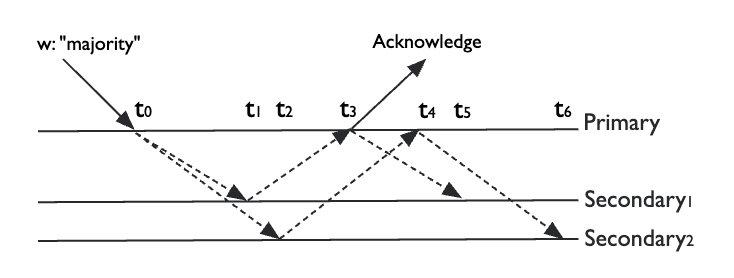

通过这张图可以看出，不同节点在不同阶段看待同一条数据满足的 level 是不同的：

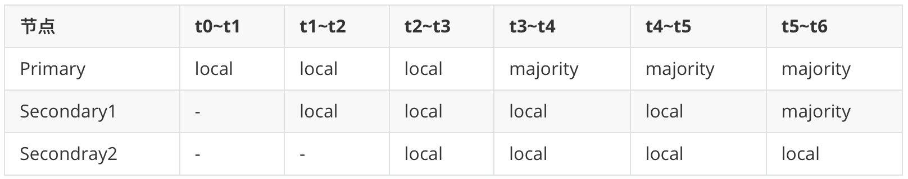| 节点 | t0~t1 | t1~t2 | t2~t3 | t3~t4 | t4~t5 | t5~t6 |
| ----- | ----- | ----- | ----- | ----- | ----- | ----- |

### **1.3 MongoDB 的可扩展性 —— 分片集群**

水平扩展是 MongoDB 的另一个核心特性，它是 MongoDB 支持海量数据存储的基础。MongoDB 天然的分布式特性使得它几乎可无限的横向扩展，你再也不用为 MySQL 分库分表的各种繁琐问题操碎心了。当然，我们这里不讨论 MongoDB 和其它存储引擎的对比，这个以后专门写下，这里只关注分片集群相关信息。

### **1.3.1 分片集群架构**

MongoDB 的分片集群由如下三个部分组成：

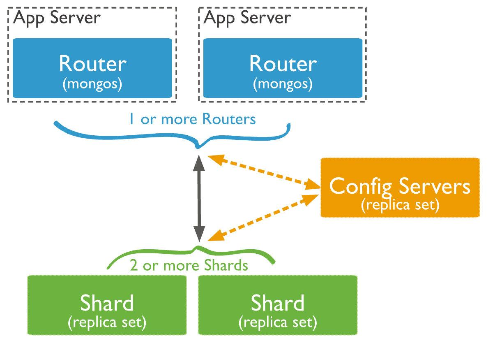

-   **Config**：配置，本质上是一个 MongoDB 的副本集，负责存储集群的各种元数据和配置，如分片地址、chunks 等
-   **Mongos**：路由服务，不存具体数据，从 Config 获取集群配置讲请求转发到特定的分片，并且整合分片结果返回给客户端。
-   **Mongod**：一般将具体的单个分片叫 mongod，实质上每个分片都是一个单独的复制集群，具备负责集群的高可用特性。

其实分片集群的架构看起来和很多支持海量存储的设计很像，本质上都是将存储分片，然后在前面挂一个 proxy 做请求路由。但是，**MongoDB** **的分片集群有个非常重要的特性是其它数据库没有的，这个特性就是数据均衡**。数据分片一个绕不开的话题就是数据分布不均匀导致不同分片负载差异巨大，不能最大化利用集群资源。

MongoDB 的数据均衡的实现方式是：

1.  分片集群上数据管理单元叫 chunk，一个 chunk 默认 64M，可选范围 1 ～ 1024M。
2.  集群有多少个 chunk，每个 chunk 的范围，每个 chunk 是存在哪个分片上的，这些数据都是存储在 Config 的。
3.  chunk 会在其内部包含的数据超过阈值时分裂成两个。
4.  MongoDB 在运行时会自定检测不同分片上的 chunk 数，当发现最多和最少的差异超过阈值就会启动 chunk 迁移，使得每个分片上的 chunk 数差不多。
5.  chunk 迁移过程叫 rebalance，会比较耗资源，因此一般要把它的执行时间设置到业务低峰期。

关于 chunk 更加深入的知识会在后面进阶知识里面讲解，这里就不展开了。

### **1.3.2 分片算法**

MongoDB 支持两种分片算法来满足不同的查询需求：

-   **区间分片：**可以按 shardkey 做区间查询的分片算法，直接按照 shardkey 的值来分片。
-   **hash**分片：用的最多的分片算法，按 shardkey 的 hash 值来分片。hash 分片可以看作一种特殊的区间分片。

区间分片示例：

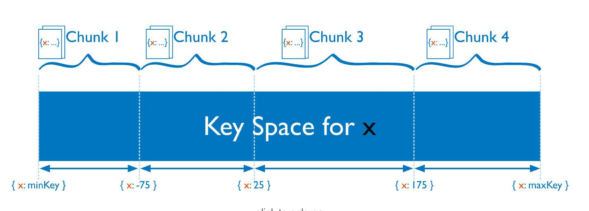

hash 分片示例：

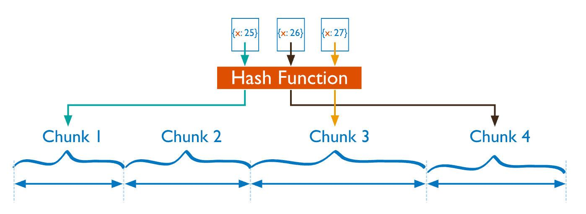

从上面两张图可以看出：

-   分片的本质是**将 shardkey 按一定的函数变换 f(x) 之后的空间划分为一个个连续的段**，每一段就是一个 chunk。
-   区间分片 f(x) = x；hash 分片 f(x) = hash(x)
-   每个 chunk 在空间中起始值是存在 Config 里面的。
-   当请求到 Mongos 的时候，根据 shardkey 的值算出 f(x) 的具体值为 f(shardkey)，找到包含该值的 chunk，然后就能定位到数据的实际位置了。

### **1.4 数据压缩**

MongoDB 的另外一个比较重要的特性是数据压缩，MongoDB 会自动把客户数据压缩之后再落盘，这样就可以节省存储空间。MongoDB 的数据压缩算法有多种：

-   Snappy：默认的压缩算法，压缩比 3 ～ 5 倍
-   Zlib：高度压缩算法，压缩比 5 ～ 7 倍
-   前缀压缩：索引用的压缩算法，简单理解就是丢掉重复的前缀
-   zstd：MongoDB 4.2 之后新增的压缩算法，拥有更好的压缩率

现在推荐的 MongoDB 版本是 4.0，在这个版本下推荐使用 snappy 算法，虽然 zlib 有更高的压缩比，但是读写会有一定的性能波动，不适合核心业务，但是比较适合流水、日志等场景。

### **第二部分：应用接入**

在掌握第一部分的基础上，基本上对 MongoDB 有一个比较直观的认识了，知道它是什么，有什么优势，适合什么场景。在此基础上，我们基本上已经可以判定 MongoDB 是否适合自己的业务了。如果适合，那么接下来就需要考虑怎么将其应用到业务中。在此之前，我们还得先对 MonoDB 的性能有个大致的了解，这样才能根据业务情况选取合适的配置。

### **2.1 基本性能测试**

在使用 MongoDB 之前，需要对其功能和性能有一定的了解，才能判定是否符合自己的业务场景，以及需要注意些什么才能更好的使用。笔者这边对其做了一些测试，本测试是基于自己业务的一些数据特性，而且这边使用的是分片集群。因此有些测试项不同数据会有差异，如压缩比、读写性能具体值等。但是也有一些是共性的结论，如写性能随数据量递减并最终区域平稳。

**压缩比**

对比了同样数据在 Mongo 和 MySQL 下压缩比对比，可以看出 snapy 算法大概是 MySQL 的 3 倍，zlib 大概是 6 倍。

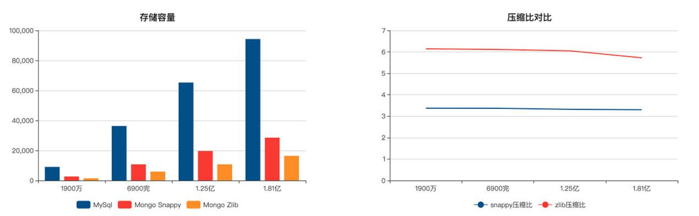

**写性能**

分片集群写性能在测试之后得到如下结论，这里分片是 4 核 8G 的配置：

-   写性能的瓶颈在单个分片上
-   当数据量小时是存内存读写，写性能很好，之后随着数量增加急剧下降，并最终趋于平稳，在 3000QPS。
-   少量简单的索引对写性能影响不大
-   分片集群批量写和逐条写性能无差异，而如果是复制集群批量写性能是逐条写性能的数倍。这点有点违背常识，具体原因这边还未找到。

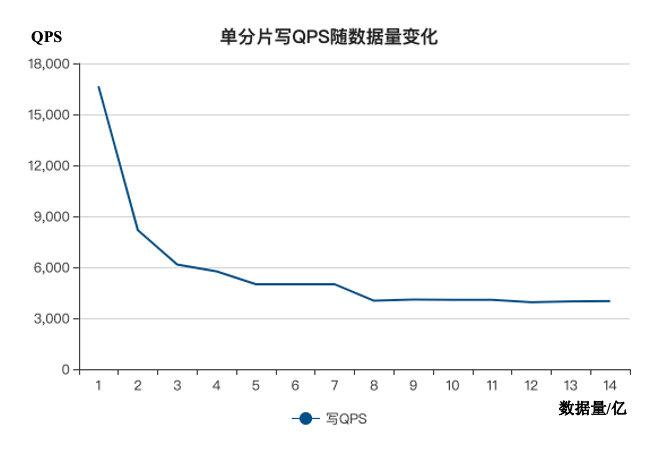

**读性能**

分片集群的读分为三年种情况：按 shardkey 查询、按索引查询、其他查询。下面这些测试数据都是在单分片 2 亿以上的数据，这个时候 cache 已经不能完全换成业务数据了，如果数据量很小，数据全在 cache 这个性能应该会很好。

-   按 shardkey 查下，在 Mongos 处能算出具体的分片和 chunk，所以查询速度非常稳定，不会随着数据量变化。平均耗时 2ms 以内，4 核 8G 单分片 3 万 QPS。这种查询方式的瓶颈一般在 分片 Mongod 上，但也要注意 Mongos 配置不能太低。  
    
-   按索引查询的时候，由于 Mongos 需要将数据全部转发到所有的分片，然后聚合全部结果返回客户端，因此性能瓶颈在 Mongos 上。测试 Mongos 8 核 16G + 10 分片情况下，单个 Mongos 的性能在 1400QPS，平均时延 10ms。业务场景索引是唯一的，因此如果索引数据不唯一，后端分片数更多，这个性能还会更低。  
    
-   如果不按 shardkey 和索引查询因为涉及全表扫描，因此在数据量上千万之后基本不可用  
    Mongos 有点特殊情况要注意的，就是客户端请求会到哪个 Mongos 是通过客户端 ip 的 hash 值决定的，因此同一个客户端所有请求一定会到同一个 Mongos，如果客户端过少的时候还会出现 Mongos 负载不均问题。  
    

### **2.2 分片选择**

在了解了 MongoDB 的基本性能数据之后，就可以根据自己的业务需求选取合适的配置了。如果是分片集群，其中最重要的就是分片选取，包括：

-   需要多少个 Mongos  
    
-   需要分为多少个分片  
    
-   分片键和分片算法用什么  
    

关于前面两点，其实在知道各种性能参数之后就很简单了，前人已经总结出了相关的公式，我这里就简单把图再贴一下。

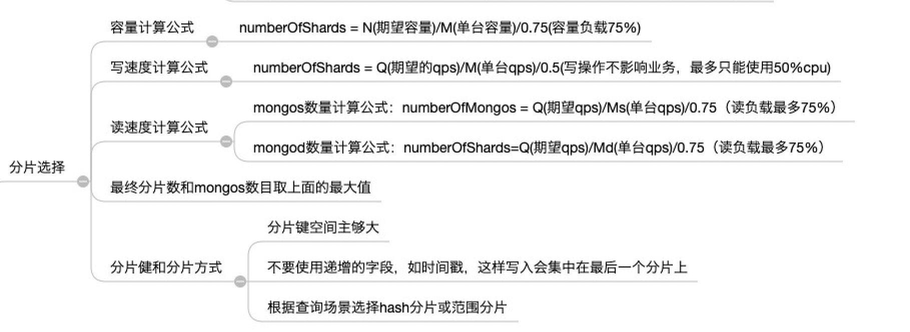

### **2.3 spring-data-mongo**

MonogDB 官方提供了各种语言的 Client，这些 Client 是对 mongo 原始命令的封装。笔者这边是使用的 java，因此并未直接使用 MongoDB 官方的客户端，而是经过二次封装之后的 spring-data-mongo。好处是可以不用他关心底层的设计如连接管理、POJO 转换等。

### **2.3.1 接入步骤**

spring-data-mongo 的使用方式非常简单。

**第一步：引入 jar 包**

```text
        <dependency>
            <groupId>org.springframework.boot</groupId>
            <artifactId>spring-boot-starter-data-mongodb</artifactId>
        </dependency>
```

**第二步：ymal 配置**

```text
spring:
  data:
    mongodb:
      host: {{.MONGO_HOST}}
      port: {{.MONGO_PORT}}
      database: {{.MONGO_DB}}
      username: {{.MONGO_USER}}
      password: {{.MONGO_PASS}}
```

这里有个两个要注意：

-   权限，MongoDB 的权限是到数据级别的，所有配置的 username 必须有 database 那个库的权限，要不然会连不上。
-   这种方式配置没有指定读写 concern，如果需要在连接上指定的话，需要用 uri 的方式来配置，两种配置方式是不兼容的，或者自己初始化 MongoTemplate。

关于配置，跟多的可以在 IDEA 里面搜索 *Mongo*AutoConfiguration 查看源码，具体就是这个类 org.springframework.boot.autoconfigure.mongo.MongoProperties

关于自己初始化 MongoTemplate 的方式是：

```text
@Configuration
public class MyMongoConfig {
    @Primary
    @Bean
    public MongoTemplate mongoTemplate(MongoDbFactory mongoDbFactory,  MongoConverter mongoConverter){
        MongoTemplate mongoTemplate = new MongoTemplate(mongoDbFactory,mongoConverter);
        mongoTemplate.setWriteConcern(WriteConcern.MAJORITY);
        return mongoTemplate;
    }
}
```

第三步：使用 MongoTemplate

在完成上面这些之后，就可以在代码里面注入 MongoTemplate，然后使用各种增删改查接口了。

### **2.3.2 批量操作注意事项**

MongoDB Client 的批量操作有两种方式：

-   **一条命令操作批量数据：**insertAll，updateMany 等  
    
-   **批量提交一批命令：**bulkOps，这种方式节省的就是客户端与服务端的交互次数  
    bulkOps 的方式会比另外一种方式在性能上低一些。  
    这两种方式到引擎层面具体执行时都是一条条语句单独执行，它们有一个很重要的参数：**ordered**，这个参数的作用是控制批量操作在引擎内最终执行时是并行的还是穿行的。其默认值是 true。  
    
-   **true**：批量命令窜行执行\*\*，遇到某个命令错误时就退出并报错，这个和事物不一样，它不会回滚已经执行成功的命令，如批量插入如果某条数据主键冲突了，那么它前面的数据都会插入成功，后面的会不执行。  
    
-   **false**：批量命令并行执行，单个命令错误不影响其它，在执行结构里会返回错误的部分。还是以批量插入为例，这种模式下只会是主键冲突那条插入失败，其他都会成功。  
    显然，false 模式下插入耗时会低一些，但是 MongoTemplate 的 insertAll 函数是在内部写死的 true。因此，如果想用 false 模式，需要自己继承 MongoTemplate 然后重写里面的 insertDocumentList 方法。  
    

```text
 public class MyMongoTemplate extends MongoTemplate {
    @Override
    protected List<Object> insertDocumentList(String collectionName, List<Document> documents) {
                .........
                InsertManyOptions options = new InsertManyOptions();
                options = options.ordered(false);  // 要自己初始化一个这对象，然后设置为false
                long begin = System.currentTimeMillis();
                if (writeConcernToUse == null) {
                    collection.insertMany(documents, options); // options这里默认是null
                } else {
              collection.withWriteConcern(writeConcernToUse).insertMany(documents,options);
                }
                return null;
            });
            return MappedDocument.toIds(documents);
    }
```

### **2.3.3 一些常见的坑**

因为 MongoDB 真的将太多自主性交给的客户端来决策，因此如果对其了解不够，真的会很容易踩坑。这里例举一些常见的坑，避免大家遇到。

**预分片**

这个问题的常见表现就是：为啥我的数据分布很随机了，但是分片集群的 MongoDB 插入性能还是这么低？

首先我们说下预分片是什么，预分片就是提前把 shard key 的空间划分成若干段，然后把这些段对应的 chunk 创建出来。那么，这个和插入性能的关系是什么呢？

我们回顾下前面说到的 chunk 知识，其中有两点需要注意：

1.  当 chunk 内的数据超过阈值就会将 chunk 拆分成两个。
2.  当各个分片上 chunk 数差异过大时就会启动 rebalance，迁移 chunk。

那么，很明显，问题就是出在这了，chunk 分裂和 chunk 迁移都是比较耗资源的，必然就会影响插入性能。

因此，如果提前将个分片上的 chunk 创建好，就能避免频繁的分裂和迁移 chunk，进而提升插入性能。预分片的设置方式为：

```text
  sh.shardCollection("saky_db.saky_table", {"_id": "hashed"}, false,{numInitialChunks:8192*分片数})
```

numInitialChunks 的最大值为 8192 \* 分片数

**内存排序**

这个是一个不容易被注意到的问题，但是使用 MongoDB 时一定要注意的就是避免任何查询的内存操作，因为用 MongoDB 的很多场景都是海量数据，这个情况下任何内存操作的成本都可能是非常高昂甚至会搞垮数据库的，当然 MongoDB 为了避免内存操作搞垮它，是有个阈值，如果需要内存处理的数据超过阈值它就不会处理并报错。

继续说内存排序问题，它的本质是索引问题。MongoDB 的索引都是有序的，正序或者逆序。如果我们有一个 Collection 里面记录了学生信息，包括年龄和性别两个字段。然后我们创建了这样一个复合索引：

```text
{gender: 1, age: 1} // 这个索引先按性别升序排序，相同的再按年龄升序排序
```

当这个时候，如果你排序顺序是下面这样的话，就会导致内存排序，如果数据两小到没事，如果非常大的话就会影响性能。避免内存排序就是要查询的排序方式要和索引的相同。

```text
{gender: 1, age: -1} // 这个索引先按性别升序排序，相同的再按年龄降序排序
```

**链式复制**

链式复制是指副本集的各个副本在复制数据时，并不是都是从 Primary 节点拉 oplog，而是各个节点排成一条链，依次复制过去。

优点：避免大量 Secondary 从 Primary 拉 oplog ，影响 Primary 的性能。

缺点： 如果 WriteConcern=majority，那么链式复制会导致写操作耗时更长。

因此，是否开启链式复制就是一个成本与性能的平衡，默认是开启链式复制的：

-   是关闭链式复制，用更好的机器配置来支持所有节点从 Primary 拉 oplog。  
    
-   还是开启链式复制，用更长的写耗时来降低对节点配置的需求。  
    链式复制关闭时，节点数据复制对 Primary 节点性能影响程度目前没有专业测试过，因此不能评判到底开启还是关闭好，这边数据库同学从他们的经验来建议是关闭，因此我这边是关闭的，如果有用到 MongoDB 的可以考虑关掉。  
    

### **第三部分：进阶知识**

接下来终于到了最重要的部分了，这部分将讲解一些 MongoDB 的一些高级功能和底层设计。虽然不了解这些也能使用，但是如果想用好 MongoDB，这部分知识是必须掌握的。

### **3.1 存储引擎 Wired Tiger**

说到 MongoDB 最重要的知识，其存储引擎 Wired Tiger 肯定是要第一个说的。因为 MongoDB 的所有功能都是依赖底层存储引擎实现的，掌握了存储引擎的核心知识，有利于我们理解 MongoDB 的各种功能。存储引擎的核心工作是管理数据如何在磁盘和内存上读写，从 MongoDB 3.2 开始支持多种存储引擎：Wired Tiger，MMAPv1 和 In-Memory，其中默认为 Wired Tiger。

### **3.1.1 重要数据结构和 Page**

**B+ Tree**

*（ps：这里感谢 biliwang 指出这里的问题，Wired Tiger 具体使用的是 B 树的进阶版 B+ 树，直接说 B 树不严谨，且容易产生误导，因此这里做了更正）*

存储引擎最核心的功能就是完成数据在客户端 - 内存 - 磁盘之间的交互。客户端是不可控的，因此如何设计一个高效的数据结构和算法，实现数据快速在内存和磁盘间交互就是存储引擎需要考虑的核心问题。目前大多少流行的存储引擎都是基于 B/B+ Tree 和 LSM(Log Structured Merge) Tree 来实现，至于他们的优势和劣势，以及各种适用的场景，暂时超出了笔者的能力，后面到是有兴趣去研究一下。

Oracle、SQL Server、DB2、MySQL (InnoDB) 这些传统的关系数据库依赖的底层存储引擎是基于 B+ Tree 开发的；而像 Cassandra、Elasticsearch (Lucene)、Google Bigtable、Apache HBase、LevelDB 和 RocksDB 这些当前比较流行的 NoSQL 数据库存储引擎是基于 LSM 开发的。MongoDB 虽然是 NoSQL 的，但是其存储引擎 Wired Tiger 却是用的 B+ Tree，因此有种说法是 MongoDB 是最接近 SQL 的 NoSQL 存储引擎。好了，我们这里知道 Wired Tiger 的存储结构是 B+ Tree 就行了，至于什么是 B+ Tree，它有些啥优势网都有很多文章，这里就不在赘述了。

**Page**

Wired Tiger 在内存和磁盘上的数据结构都 B+ Tree，B+ 的特点是中间节点只有索引，数据都是存在叶节点。Wired Tiger 管理数据结构的基本单元 Page。

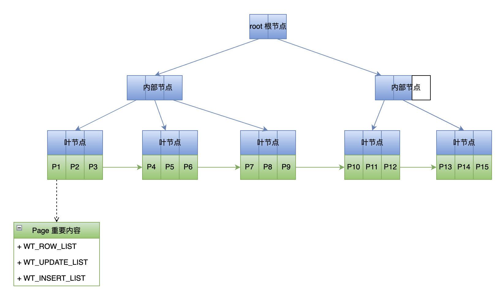

上图是 Page 在内存中的数据结构，是一个典型的 B+ Tree，Page 上有 3 个重要的 list WT\_ROW、WT\_UPDATE、WT\_INSERT。这个 Page 的组织结构和 Page 的 3 个 list 对后面理解 cache、checkpoint 等操作很重要：

-   内存中的 Page 树是一个 checkpoint
-   叶节点 Page 的 WT\_ROW：是从磁盘加载进来的数据数组
-   叶节点 Page 的 WT\_UPDATE：是记录数据加载之后到下个 checkpoint 之间被修改的数据
-   叶节点 Page 的 WT\_INSERT：是记录数据加载之后到下个 checkpoint 之间新增的数据

上面说了 Page 的基本结构，接下来再看下 Page 的生命周期和状态扭转，这个生命周期和 Wired Tiger 的缓存息息相关。

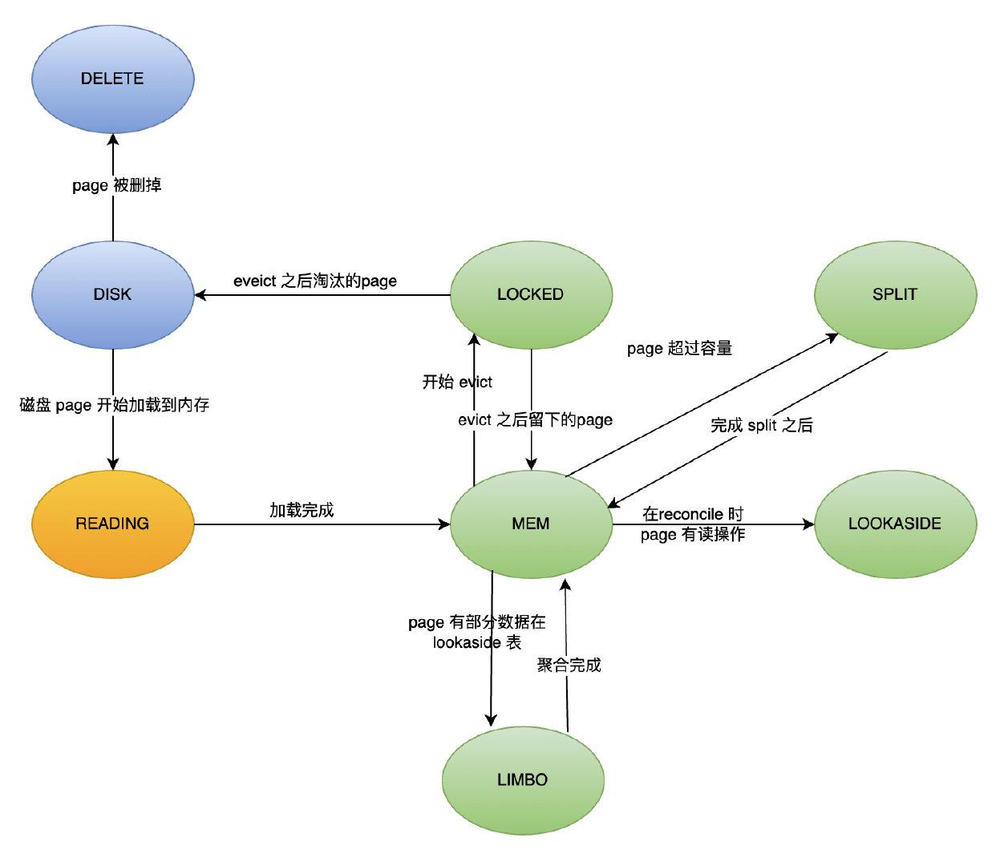

Page 在磁盘和内存中的整个生命周期状态机如上图：

-   DIST：Page 在磁盘中
-   DELETE：Page 已经在磁盘中从树中删除
-   READING：Page 正在被从磁盘加载到内存中
-   MEM：Page 在内存中，且能正常读写。
-   LOCKED：内存淘汰过程（evict）正在锁住 Page
-   LOOKASIDE：在执行 reconcile 的时候，如果 page 正在被其他线程读取被修改的部分，这个时候会把数据存储在 lookasidetable 里面。当页面再次被读时可以通过 lookasidetable 重构出内存 Page。
-   LIMBO：在执行完 reconcile 之后，Page 会被刷到磁盘。这个时候如果 page 有 lookasidetable 数据，并且还没合并过来之前就又被加载到内存了，就会是这个状态，需要先从 lookasidetable 重构内存 Page 才能正常访问。

其中两个比较重要的过程是 reconcile 和 evict。

其中 reconcile 发生在 checkpoint 的时候，将内存中 Page 的修改转换成磁盘需要的 B+ Tree 结构。前面说了 Page 的 WT\_UPDATE 和 WT\_UPDATE 列表存储了数据被加载到内存之后的修改，类似一个内存级的 oplog，而数据在磁盘中时显然不可能是这样的结构。因此 reconcile 会新建一个 Page 来将修改了的数据做整合，然后原 Page 就会被 discarded，新 page 会被刷新到磁盘，同时加入 LRU 队列。

evict 是内存不够用了或者脏数据过多的时候触发的，根据 LRU 规则淘汰内存 Page 到磁盘。

### **3.1.2 cache**

MongoDB 不是内存数据库，但是为了提供高效的读写操作存储引擎会最大化的利用内存缓存。MongoDB 的读写性能都会随着数据量增加到了某个点出现近乎断崖式跌落最终趋于稳定。这其中的根本原因就是内存是否能 cover 住全部的数据，数据量小的时候是纯内存读写，性能肯定非常好，当数据量过大时就会触发内存和磁盘间数据的来回交换，导致性能降低。所以，如果在使用 MongoDB 时，如果发现自己某些操作明显高于常规，那么很大可能是它触发了磁盘操作。

接下来说下 MongoDB 的存储引擎 Wired Tiger 是怎样利用内存 cache 的。首先，Wired Tiger 会将整个内存划分为 3 块：

-   **存储引擎内部 cache：**缓存前面提到的内存数据，默认大小 Max((RAM - 1G)/2,256M )，服务器 16G 的话，就是(16-1)/2 = 7.5G 。这个内存配置一定要注意，因为 Wired Tiger 如果内存不够可能会导致数据库宕掉的。
-   **索引 cache：**换成索引信息，默认 500M
-   **文件系统 cache：**这个实际上不是存储引擎管理，是利用的操作系统的文件系统缓存，目的是减少内存和磁盘交互。剩下的内存都会用来做这个。

内存分配大小一般是不建议改的，除非你确实想把自己全部数据放到内存，并且主够的引擎知识。

引擎 cache 和文件系统 cache 在数据结构上是不一样的，文件系统 cache 是直接加载的内存文件，是经过压缩的数据，可以占用更少的内存空间，相对的就是数据不能直接用，需要解压；而引擎中的数据就是前面提到的 B+ Tree，是解压后的，可以直接使用的数据，占有的内存会大一些。

**Evict**

就算内存再大它与磁盘间的差距也是数据量级的差异，随着数据增长也会出现内存不够用的时候。因此内存管理一个很重要的操作就是内存淘汰 evict。内存淘汰时机由 eviction\_target（内存使用量）和 eviction\_dirty\_target（内存脏数据量）来控制，而内存淘汰默认是有后台的 evict 线程控制的。但是如果超过一定阈值就会把用户线程也用来淘汰，会严重影响性能，应该避免这种情况。用户线程参与 evict 的原因，一般是大量的写入导致磁盘 IO 抗不住了，需要控制写入或者更换磁盘。

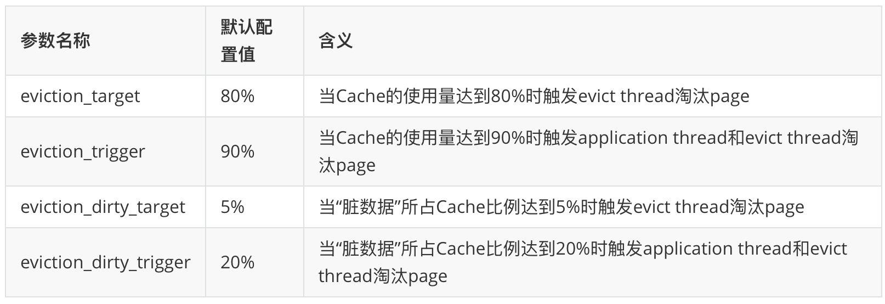| 参数名称 | 默认配置值 | 含义 |
| ----- | ----- | ----- |

### **3.1.3 checkpoint**

前面说过，MongoDB 的读写都是操作的内存，因此必须要有一定的机制将内存数据持久化到磁盘，这个功能就是 Wired Tiger 的 checkpoint 来实现的。checkpoint 实现将内存中修改的数据持久化到磁盘，保证系统在因意外重启之后能快速恢复数据。checkpoint 本身数据也是会在每次 checkpoint 执行时落盘持久化的。

一个 checkpoint 就是一个内存 B+ Tree，其结构就是前面提到的 Page 组成的树，它有几个重要的字段：

-   root page：就是指向 B+ Tree 的根节点  
    
-   allocated list pages：上个 checkpoint 结束之后到本 checkpoint 结束前新分配的 page 列表  
    
-   available list pages：Wired Tiger 分配了但是没有使用的 page，新建 page 时直接从这里取。  
    
-   discarded list pages：上个 checkpoint 结束之后到本 checkpoint 结束前被删掉的 page 列表  
    

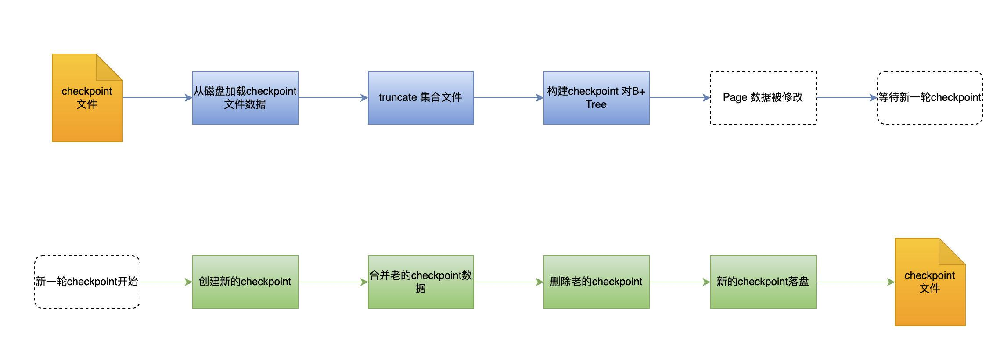

checkpoint 的大致流程入上图所述：

1.  在系统启动或者集合文件打开时，从磁盘加载最新的 checkpoint。
2.  根据 checkpoint 的 file size truncate 文件。因为只有 checkpoint 确认的数据才是真正持久化的数据，它后面的数据可能是最新 checkpoint 之后到宕机之间的数据，不能直接用，需要通过 oplog 来回放。
3.  根据 checkpoint 构建内存的 B+ Tree。
4.  数据库 run 起来之后，各种修改操作都是操作 checkpoint 的 B+ Tree，并且会 checkpoint 会有专门的 list 来记录这些修改和新增的 page
5.  在 60s 一次的 checkpoint 执行时，会创建新的 checkpoint，并且将旧的 checkpoint 数据合并过来。然后执行 reconcile 将修改的数据刷新到磁盘，并删除旧的 checkpoint。这时候会清空 allocated，discarded 里面的 page，并且将空闲的 page 加到 available 里面。

### **3.2 Chunk**

Chunk 为啥要单独出来说一下呢，因为它是 MongoDB 分片集群的一个核心概念，是使用和理解分片集群读写实现的最基础的概念。

### **3.2.1** **基本信息**

首先，说下 chunk 是什么，chunk 本质上就是由一组 Document 组成的逻辑数据单元。它是分片集群用来管理数据存储和路由的基本单元。具体来说就是，分片集群不会记录每条数据在哪个分片上，这不现实，它只会记录哪一批（一个 chunk）数据存储在哪个分片上，以及这个 chunk 包含哪些范围的数据。而数据与 chunk 之间的关联是有数据的 shard key 的分片算法 f(x) 的值是否在 chunk 的起始范围来确定的。

前面说过，分片集群的 chunk 信息是存在 Config 里面的，而 Config 本质上是一个复制集群。如果你创建一个分片集群，那么你默认会得到两个库，admin 和 config，其中 config 库对应的就是分片集群架构里面的 Config。其中的包含一个 Collection chunks 里面记录的就是分片集群的全部 chunk 信息，具体结构如下图：

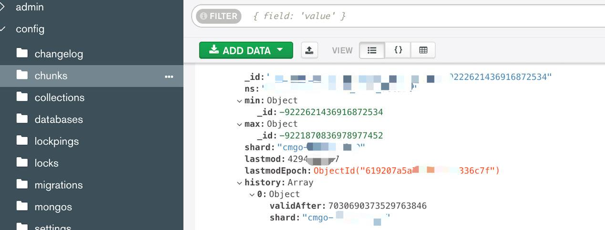

chunk 的几个关键属性：

-   \_id：chunk 的唯一标识
-   ns：命名空间，就是 DB.COLLECTION 的结构
-   min：chunk 包含数据的 shard key 的 f(x) 最小值
-   max：chunk 包含数据的 shard key 的 f(x) 最大值
-   shard：chunk 当前所在分片 ID
-   history：记录 chunk 的迁移历史

### **3.2.2 chunk 分裂**

chunk 是分片集群管理数据的基本单元，本身有一个大小，那么随着 chunk 内的数据不断新增，最终大小会超过限制，这个时候就需要把 chunk 拆分成 2 个，这个就 chunk 的分裂。

chunk 的大小不能太大也不能太小。太大了会导致迁移成本高，太小了有会触发频繁分裂。因此它需要一个合理的范围，默认大小是 64M，可配置的取值范围是 1M ～ 1024M。这个大小一般来说是不用专门配置的，但是也有特例：

-   如果你的单条数据太小了，25W 条也远小于 64M，那么可以适当调小，但也不是必要的。  
    
-   如果你的数据单条过大，大于了 64M，那么就必须得调大 chunk 了，否则会产生 jumbo chunk，导致 chunk 不能迁移。  
    导致 chunk 分裂有两个条件，达到任何一个都会触发：  
    
-   **容量达到阈值：**就是 chunk 中的数据大小加起来超过阈值，默认是上面说的 64M  
    
-   **数据量到达阈值：**前面提到了，如果单条数据太小，不加限制的话，一个 chunk 内数据量可能几十上百万条，这也会影响读写性能，因此 MongoDB 内置了一个阈值，chunk 内数据量超过 25W 条也会分裂。  
    

### **3.2.3 rebalance**

MongoDB 一个区别于其他分布式数据库的特性就是自动数据均衡。

**chunk** **分裂是 MongoDB 保证数据均衡的基础**：数据的不断增加，chunk 不断分裂，如果数据不均匀就会导致不同分片上的 chunk 数目出现差异，这就解决了分片集群的**数据不均匀问题发现**。然后就可以通过将 chunk 从数据多的分片迁移到数据少的分片来实现数据均衡，这个过程就是 rebalance。

如下图所示，随着数据插入，导致 chunk 分裂，让 AB 两个分片有 3 个 chunk，C 分片只有一个，这个时候就会把 B 分配的迁移一个到 C 分分片实现集群数据均衡。

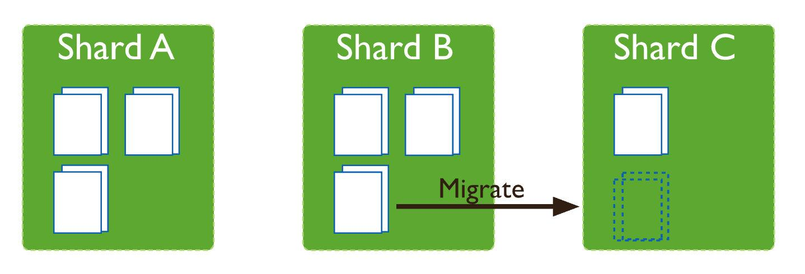

执行 rebalance 是有几个前置条件的：

-   数据库和集合开启了 rebalance 开关，默认是开启的。
-   当前时间在设置的 rebalance 时间窗，默认没有配置，就是只要检测到了就会执行 rebalance。
-   集群中分片 chunk 数最大和最小之差超过阈值，这个阈值和 chunk 总数有关，具体如下：

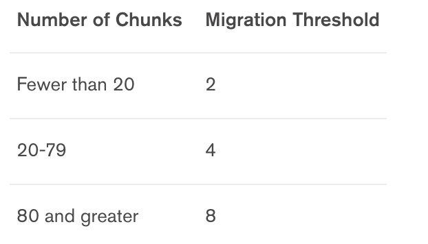

rebalance 为了尽快完成数据迁移，其设计是尽最大努力迁移，因此是非常消耗系统资源的，在系统配置不高的时候会影响系统正常业务。因此，为了减少其影响需要：

-   预分片：减少大量数据插入时频繁的分裂和迁移 chunk
-   设置 rebalance 时间窗
-   对于可能会影响业务的大规模数据迁移，如扩容分片，可以采取手段迁移的方式来控制迁移速度。

### **3.3 一致性/高可用**

分布式系统必须要面对的一个问题就是数据的一致性和高可用，针对这个问题有一个非常著名的理论就是 CAP 理论。CAP 理论的核心结论是：一个分布式系统最多只能同时满足一致性（Consistency）、可用性（Availability）和分区容错性（Partition tolerance）这三项中的两项。关于 CAP 理论在网上有非常多的论述，这里也不赘述。

CAP 理论提出了分布式系统必须面临的问题，但是我们也不可能因为这个问题就不用分布式系统。因此，BASE（Basically Available 基本可用、Soft state 软状态、Eventually consistent 最终一致性）理论被提出来了。BASE 理论是在一致性和可用性上的平衡，现在大部分分布式系统都是基于 BASE 理论设计的，当然 MongoDB 也是遵循此理论的。

### **3.3.1 选举和 Raft 协议**

MongoDB 为了保证可用性和分区容错性，采用的是副本集的方式，这种模式就必须要解决的一个问题就是怎样快速在系统启动和 Primary 发生异常时选取一个合适的主节点。这里潜在着多个问题：

-   系统怎样发现 Primary 异常？
-   哪些 Secondary 节点有资格参加 Primary 选举？
-   发现 Primary 异常之后用什么样的算法选出新的 Primary 节点？
-   怎么样确保选出的 Primary 是最合适的？

**Raft** **协议**

MongoDB 的选举算法是基于 Raft 协议的改进，Raft 协议将分布式集群里面的节点有 3 种状态：

-   leader：就是 Primary 节点，负责整个集群的写操作。
-   candidate：候选者，在 Primary 节点挂掉之后，参与竞选的节点。只有选举期间才会存在，是个临时状态。
-   flower：就是 Secondary 节点，被动的从 Primary 节点拉取更新数据。

节点的状态变化是：正常情况下只有一个 leader 和多个 flower，当 leader 挂掉了，那么 flower 里面就会有部分节点成为 candidate 参与竞选。当某个 candidate 竞选成功之后就成为新的 leader，而其他 candidate 回到 flower 状态。具体状态机如下：

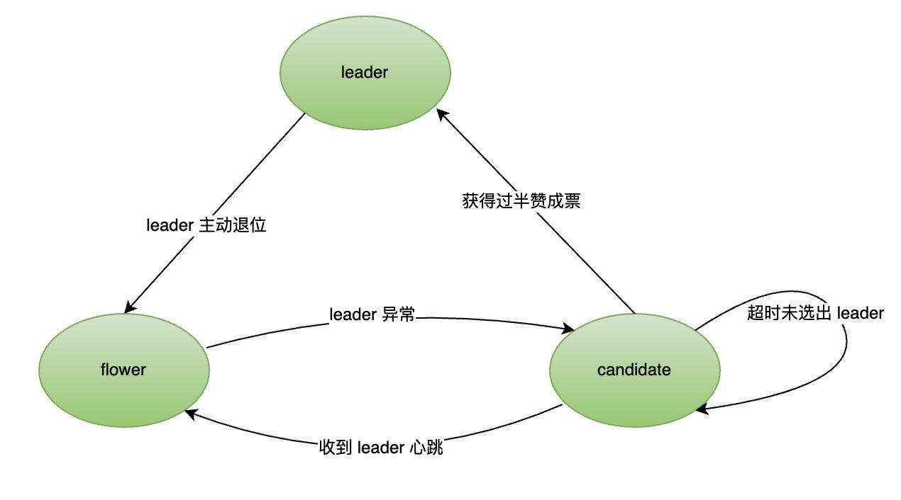

Raft 协议中有两个核心 RPC 协议分别应用在选举阶段和正常阶段：

-   **请求投票：**选举阶段，candidate 向其他节点发起请求，请求对方给自己投票。
-   **追加条目：**正常阶段，leader 节点向 flower 节点发起请求，告诉对方有数据更新，同时作为心跳机制来向所有 flower 宣示自己的地位。如果 flower 在一定时间内没有收到该请求就会启动新一轮的选举投票。

**投票规则**

Raft 协议规定了在选举阶段的投票规则：

-   一个节点，在一个选举周期（Term）内**只能给一个** candidate 节点投赞成票，且**先到先得**
-   只有在 candidate 节点的 oplog 领先或和自己相同时才投赞成票

**选举过程**

一轮完整的选举过程包含如下内容：

1.  某个/多个 flower 节点超时未收到 leader 的心跳，将自己改变成 candidate 状态，增加选举周期（Term），然后先给自己投一票，并向其他节点发起投票请求。
2.  等待其它节点的投票返回，在此期间如果收到其它 candidate 发来的请求，根据投票规则给其它节点投票。
3.  如果某个 candidate 在收到过半的赞成票之后，就把自己转换成 leader 状态，并向其它节点发送心跳宣誓即位。
4.  如果节点在没有收到过半赞成票之前，收到了来自 leader 的心跳，就将自己退回到 flower 状态。
5.  只要本轮有选出 leader 就完成了选举，否则超时启动新一轮选举。

**catchup**（追赶）

以上就是目前掌握的 MongoDB 的选举机制，其中有个问题暂时还未得到解答，就是最后一个，怎样确保选出的 Primary 是最合适的那一个。因为，从前面的协议来看，存在一个逻辑 bug：**由于 flower 转换成 candidate 是随机并行的，再加上先到先得的投票机制会导致选出一个次优的节点成为 Primary**。但是这一点应该是笔者自己掌握知识不够，应该是有相关机制保证的，怀疑是通过节点优先级实现的。这点也和相关同学确认过，因此这里暂定此问题不存在，等深入学习这里的细节之后补充其设计和实现。

针对 Raft 协议的这个问题，下来查询了一些资料，结论是：

-   Raft 协议确实不保证选举出来的 Primary 节点是最优的
-   MongoDB 通过在选举成功，到新 Primary 即位之前，新增了一个 \*\*catchup\*\*\*\*（追赶）\*\*操作来解决。即在节点获取投票胜利之后，会先检查其它节点是否有比自己更新的 oplog，如果没有就直接即位，如果有就先把数据同步过来再即位。

### **3.3.2 主从同步**

MongoDB 的主从同步机制是确保数据一致性和可靠性的重要机制。其同步的基础是 oplog，类似 MySQL 的 binlog，但是也有一些差异，oplog 虽然叫 log 但并不是一个文件，而是一个集合（Collection）。同时由于 oplog 的并行写入，存在尾部乱序和空洞现象，具体来说就是 oplog 里面的数据顺序可能是和实际数据顺序不一致，并且存在时间的不连续问题。为了解决这个问题，MongoDB 采用的是混合逻辑时钟（HLC）来解决的，HLC 不止解决乱序和空洞问题，同时也是用来解决分布式系统上事务一致性的方案。

主从同步的本质实际上就是，Primary 节点接收客户端请求，将更新操作写到 oplog，然后 Secondary 从同步源拉取 oplog 并本地回放，实现数据的同步。

**同步源选取**

同步源是指节点拉取 oplog 的源节点，这个节点不一定是 Primary ，链式复制模式下就可能是任何节点。节点的同步源选取是一个非常复杂的过程，大致上来说是：

-   节点维护整个集群的全部节点信息，并每 2s 发送一次心跳检测，存活的节点都是同步源备选节点。
-   落后自己的节点不能做同步源：就是源节点最新的 opTime 不能小于自己最新的 opTime
-   落后 Primary 30s 以上的不能作为同步源
-   太超前的节点不能作为同步源：就是源节点最老的 opTime 不能大于自己最新的 opTime，否则有 oplog 空洞。

在同步源选取时有些特殊情况：

-   用户可以为节点指定同步源
-   如果关闭链式复制，所有 Secondary 节点的同步源都是 Primary 节点
-   如果从同步源拉取出错了，会被短期加入黑名单

**oplog**拉取和回放

整个拉取和回放的逻辑非常复杂，这里根据自己的理解简化说明，如果想了解更多知识可以参考**[《MongoDB 复制技术内幕》](https://link.zhihu.com/?target=https%3A//mongoing.com/archives/72571)**

节点有一个专门拉取 oplog 的线程，通过 Exhausted cursor 从同步源拉取 oplog。拉取下来之后，并不会执行回放执行，而是会将其丢到一个本地的阻塞队列中。

然后有多个具体的执行线程，从阻塞队列中取出 oplog 并执行。在取出过程中，同一个 Collection 的 oplog 一定会被同一个线程取出执行，线程会尽可能的合并连续的插入命令。

整个回放的执行过程，大致为先加锁，然后写本店 oplog，然后将 oplog 刷盘（WAL 机制），最后更新自己的最新 opTime。

### **3.4 索引**

索引对任何数据库而言都是非常重要的一个功能。数据库支持的索引类型，决定的数据库的查询方式和应用场景。而正确的使用索引能够让我们最大化的利用数据库性能，同时避免不合理的操作导致的数据库问题，最常见的问题就是 CPU 或内存耗尽。

### **3.4.1 基本概念**

MongoDB 的索引和 MySql 的索引有点不一样，它的索引在创建时必须指定顺序（1：升序，-1：降序），同时所有的集合都有一个默认索引 \_id，这是一个唯一索引，类似 MySql 的主键。

MongoDB 支持的索引类型有：

-   单字段索引：建立在单个字段上的索引，索引创建的排序顺序无所谓，MongoDB 可以头/尾开始遍历。
-   复合索引：建立在多个字段上的索引。
-   多 key 索引：我们知道 MongoDB 的一个字段可能是数组，在对这种字段创建索引时，就是多 key 索引。MongoDB 会为数组的每个值创建索引。就是说你可以按照数组里面的值做条件来查询，这个时候依然会走索引。
-   Hash 索引：按数据的哈希值索引，用在 hash 分片集群上。
-   地理位置索引：基于经纬度的索引，适合 2D 和 3D 的位置查询。
-   文本索引：MongoDB 虽然支持全文索引，但是性能低下，暂时不建议使用。

### **3.4.2 注意事项**

索引功能强大，但是也有很多限制，使用索引时一定要注意一些问题。

**复合索引**

复合索引有几个问题需要注意：

-   复合索引遵循前缀匹配原则：{userid:1,score:-1} 的索引隐含了 {userid:1} 的索引
-   避免内存排序：复合索引除第一个字段之外，其他字段的查询排序方式，必须和索引排序方式一致，否则会导致内存排序。如前面的索引，可以支持 {userid:-1,score:-1} 的查询，同时也能支持 {userid:1,score:1} 的查询，只是后一种需要内存排序 score 字段。
-   索引交集：索引交集时查询优化器的优化方案，很少用到，尽量不要依赖这个功能。索引交集本质上就有创建两个独立的单字段索引，在查询保护两个字段时，优化器自动做索引交集。如 {user:1} + {score:-1} 两个索引的交集可以支持前面的 {userid:1,score:1} 的查询

**后台创建索引**

在对一个已经拥有较大数据集的 Collection 创建索引时，建议通过创建命令参数指定后台创建，不会阻塞命令和意外中断。但是，在后台创建多个索引时，不能命令执行完就接着下一个。因为是后台创建，命令行虽然推出了，但是索引还没创建完。这个时候如果同事输入多个创建索引命令，会因为**大量的写操作和数据复制导致系统 cpu 耗尽**。这个时候需要观察系统监控，确定第一个索引创建完了再执行下一个。

### **3.4.3 explain**

explain 是 MongoDB 的查询计划工具，和 MySql 的 explain 功能相同，都是用来分析一条语句的索引使用情况、影响行数、执行时间等。

explain 有三种参数分别对应结果输出的三部分数据：

-   **queryPlanner**：MongoDB 运行查询优化器对当前的查询进行评估并选择一个最佳的查询计划。
-   **exectionStats**：mongoDB 运行查询优化器对当前的查询进行评估并选择一个最佳的查询计划进行执行。在执行完毕后返回这个最佳执行计划执行完成时的相关统计信息。
-   **allPlansExecution**：即按照最佳的执行计划执行以及列出统计信息，如果有多个查询计划，还会列出这些非最佳执行计划部分的统计信息。

explain 是一个非常有用的工具，建议在一个数据量较大的数据库上开发新功能时，一定要用 explain 分析一下自己的语句是否合理、索引是否合理，避免在项目上线之后出现问题。