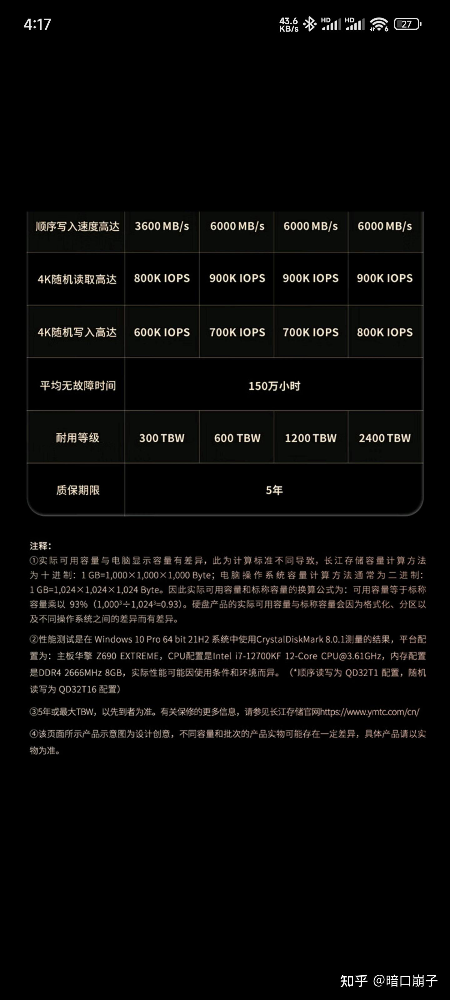

这是2010年代基于小内存和hdd的经验。2000w行差不多就是三层b+树。现在人均64g以上的内存，知道MySQL有缓存吧，几乎整个索引都能放进内存里，然后ssd的随机io性能几乎是hdd的两个数量级也就是100倍以上。有个测量随机io性能指标的数据叫IOPS。看看京东上国产长江存储致态7100的数据是多少呢。

答案是800kIOPS，也就是每秒能接受80w个随机读。同样的hdd性能如何呢，差不多5kIOPS。性能差距我都说小了，差不多3个数量级差距。如果索引全在内存里，每次都能命中，实际数据都在外存里，每次都需要一次io。那么这个数据库的Tps就是800ktps，这是个很恐怖的数字。相当于你只内存和硬盘给够（这个成本当下是很低的，1T内存+10T SSD不会超过20w rmb），就能达成这个TPS。实际上绝大多数企业的需求都不会超过1ktps，而现在的硬件轻轻松松就能够提供800ktps。

所以说现在这个时代业务数据库性能真的不是多大的问题，硬件不够用了再上主从，再上大机器，再分库分表也是很简单的。现在服务端的主要的问题是大数据的存储和计算。随便一个企业面临的大数据问题都是TB级别的，大一点的都是PB级别的。