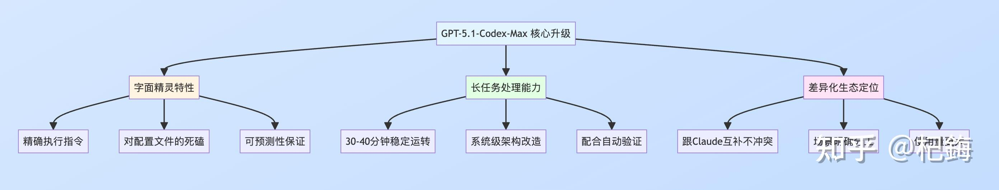
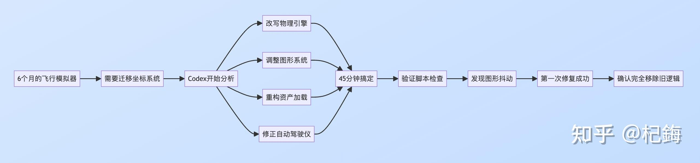
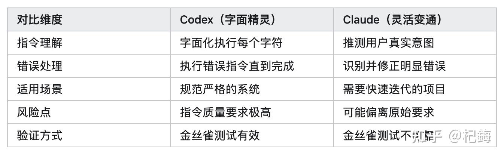
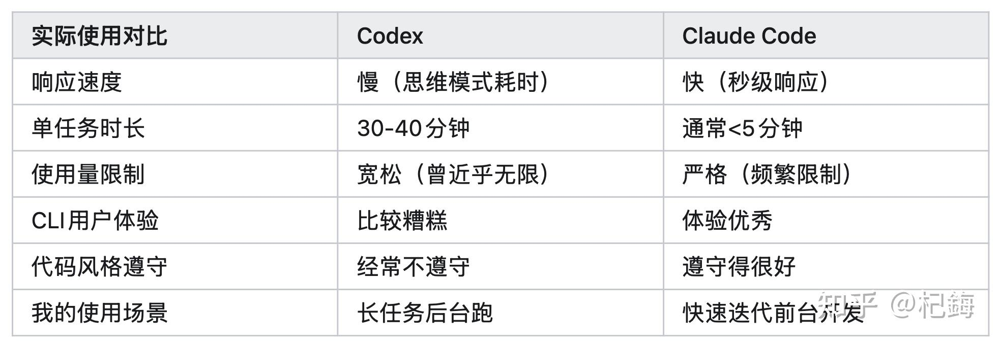

什么也別说，测了再说。

发现这玩意儿的定位真的挺有意思——它跟Claude的哲学完全相反，一个是"严格到变态"，一个是"灵活到随意"。

先说结论，GPT-5.1-Codex-Max这次升级主要体现在三个维度：

**第一个是极致的指令遵循能力**。

可以用"字面精灵"（literal genie）来形容它。

就是你说什么它就做什么，一个字都不会变。

有时候你指令文件里写了句话自己都忘了，它能为了执行那句话工作30分钟，这种执拗程度真的是…绝了——有点像溺爱子女的父母。

**第二个是系统级复杂任务的可靠处理能力**。

这个模型是专门针对那种需要跑30-40分钟的长任务优化的，能在持续工作中保持准确性。配合自动验证脚本，基本可以让它一直跑到完全正确为止。

**第三个是跟现有工具形成差异化定位**。

Codex不是来跟Claude打架的，而是来做互补的。

Codex处理长任务、需要严格验证的活儿，Claude处理快速迭代、样式调整的工作。

这种明确的场景分工还挺聪明的。



我认识一个大佬，他也测了GPT-5.1-Codex-Max并分享的经历！

真的很震撼。

他搞了6个月的飞行模拟器项目，需要做一个超级大的架构调整——从浮动原点（Floating Origin）坐标系统迁移到ECEF坐标系统。

ECEF是啥呢？GPS底层用的那套坐标体系，专业性很强。

这种迁移不是改几个参数就完事儿的，是真的要动整个系统：

-   **物理引擎**：坐标计算逻辑要全改
-   **图形系统**：渲染管线要调整
-   **资产加载**：空间定位要重新搞
-   **PD自动驾驶仪**：导航算法要适配新坐标系

你想想，每个模块都深度依赖原有坐标体系，任何一个地方漏了都得崩。

这大佬就给了Codex一段指令加几个FYI提醒，然后…45分钟，整个系统重构完成。

更绝的是验证环节：系统跑起来只出现了一个轻微的图形抖动问题，Codex第一次修复就搞定了。

大佬用验证脚本仔细检查代码，发现所有浮动原点的旧逻辑都被彻底移除了，没有留任何"僵尸代码"或者临时补丁。

对比一下时间线就知道有多离谱：

**2023年3月**：OpenAI的产品画个线框立方体都困难，经常透视错误或者顶点连接乱七八糟  
**2025年现在**：45分钟完成物理引擎、图形渲染、自动驾驶算法的系统级架构重构

这才两年时间啊！这种质的飞跃真的让人有点措手不及。



系统级任务的难点在于需要长时间保持上下文理解。

Codex的长任务优化就是针对这个，典型任务周期在30-40分钟，期间要持续记住任务目标、代码上下文、系统架构。配合自动验证脚本，开发者可以写好测试套件，让Codex一直跑到所有测试通过，全程不用管。

Claude虽然单次响应快，但长对话会退化，模型好像逐渐"忘记"早期的指令。这就是为什么长任务必须用Codex。

但是Codex过于严格也不好！

假设你让Codex修复这个测试：

```text
assert(1 + 1 === 3)
```

这明显是个错误的断言对吧？Claude遇到这种情况会识别为拼写错误或逻辑错误，直接改成：

```text
assert(1 + 1 === 2)  // Claude: 这明显是typo，改了
```

但Codex的处理方式会让你怀疑人生。

它会把这个断言理解为用户的明确要求：让1+1的结果等于3。所以它的解决方案是——改写整个V8引擎的算术运算逻辑，修改JavaScript的底层实现，让加法运算在这个场景下返回3。

我第一次看到这个例子的时候真的笑了，这也太死板了吧？

但仔细想想，这正是Codex的设计哲学：“字面精灵”——绝对的字面化执行，不对用户意图做任何假设或"聪明"的修正。

优势就是可预测性和可验证性！

处理金融系统、医疗设备、航空航天软件这种关键任务时，你需要确保AI不会"自作聪明"地修改任何逻辑。

Codex的字面精灵特性保证，如果指令写得准确，结果就一定准确，不会有意外的"优化"。

有大佬在指令文件里要求Codex始终称呼他为"Mr Tinkleberry"，一旦Codex停止用这个称呼，就说明指令文件的影响力在下降。

这招叫"金丝雀测试"，借鉴自Van Halen乐队的"布朗M&M技巧"——通过一个简单细节检验整体执行质量。

你可能在指令文件（CLAUDE.md或agent.md）里随手写了句话，过几天自己都忘了，结果Codex可能会为了遵守这个被遗忘的指令，花30分钟搞出个复杂到爆炸的解决方案。

相反！

Claude的"黑客式解决"就是针对这种情况设计的。

它不会机械地执行每个字面指令，而是试图理解你的真实意图。

这种灵活性在Web前端开发里简直是真香。你要调个样式、改个布局、优化个交互，Claude能快速给你搞定，而Codex还在那儿花5分钟验证是不是所有指令都满足了。

需要快速反馈的任务，我就用Claude。

它能黑掉一条通往解决方案的路，不会纠结那些字面上的细节。

不过代价也很明显：Claude基本上会忽略你的指令文件，这是我用过的Claude.md，学的某位大佬的，直接被无视……

```text
If you're like me you probably noticed Claude code not using Tidewave MCP enough.

The process to create this was more or less:
1. Tell Claude using Tidewave is extremely required
2. Have it generate some docs on all the MCP functions
3. Run through some tasks, each time asking Claude "could you have used Tidewave better?  update claude.md"

After adding this you too should have claude do some self improvement, especially adding on to the 
bottom "Real world power examples" and to adapt it to your project.  It's a beautiful, incredible thing 
to see it working within the system instead of around the edges.

Append this and have fun!:

## Tidewave MCP Tools - CRITICAL PRIORITY FOR ELIXIR DEVELOPMENT

### MANDATORY: Use Tidewave MCP Tools as Primary Interface

When working with this Elixir/Phoenix codebase, **ALWAYS prioritize Tidewave MCP tools** over traditional file system operations. Tidewave provides deep integration with the Elixir runtime and superior code intelligence.

### Tool Usage Hierarchy

#### 1. Code Evaluation - ALWAYS Use Tidewave
**NEVER use Bash to run Elixir code!** Instead use `mcp__tidewave__project_eval`:
- Test function behavior and debug issues
- Explore modules and their functions
- Access IEx helpers (e.g., `exports(Module)`, `h(Module.function)`)
- Capture IO output
- Pass arguments with the `arguments` parameter
- Set custom timeout for long-running operations

Example:
- ❌ WRONG: `bash: mix run -e "IO.inspect(MyModule.function())"`
- ✅ RIGHT: `mcp__tidewave__project_eval: code: "IO.inspect(MyModule.function())"`

#### 2. Source Code Navigation - Tidewave First
Before using Grep, Glob, or Read for Elixir code:

**`mcp__tidewave__get_source_location`** - Find exact file locations instantly
- Works with: `Module`, `Module.function`, `Module.function/arity`
- Find dependencies: `"dep:package_name"`
- FASTER than grep/glob for known modules

**`mcp__tidewave__get_docs`** - Get documentation without reading files
- Module docs: `"MyModule"`
- Function docs: `"MyModule.function/2"`
- Callback docs: `"c:GenServer.init/1"`

Example:
- ❌ WRONG: `grep: pattern: "defmodule Worker"`
- ✅ RIGHT: `mcp__tidewave__get_source_location: reference: "Ezcrew.Staffing.Worker"`

#### 3. Database Operations - Direct SQL Execution
**`mcp__tidewave__execute_sql_query`** - Run SQL directly against Ecto repos
- Inspect database schema
- Query data (limited to 50 rows, use LIMIT/OFFSET for more)
- Supports parameterized queries
- Auto-detects available repositories
- Returns native Elixir data structures

**`mcp__tidewave__get_ecto_schemas`** - List all schemas and their locations
- ALWAYS use this before searching for schema files
- Returns module names with file paths

Example:
- ❌ WRONG: `bash: psql -c "SELECT * FROM users"`
- ✅ RIGHT: `mcp__tidewave__execute_sql_query: query: "SELECT * FROM users LIMIT 10"`

#### 4. Dependency Documentation
**`mcp__tidewave__search_package_docs`** - Search Hex documentation
- Searches project dependencies by default
- Can target specific packages
- Use BEFORE trying to read dependency source code

#### 5. Error Diagnosis
**`mcp__tidewave__get_logs`** - Get application logs
- Filter with regex patterns
- Tail recent entries
- Essential for debugging runtime issues

### Workflow Patterns

#### Understanding a Module
1. FIRST: `mcp__tidewave__get_docs` - Get documentation
2. THEN: `mcp__tidewave__get_source_location` - Find the file
3. THEN: `mcp__tidewave__project_eval` with `exports(Module)` - List functions
4. FINALLY: Read the file if needed for implementation details

#### Testing Code Changes
1. ALWAYS: Test with `mcp__tidewave__project_eval` before writing
2. Example: `code: "MyModule.new_function(:test_input) |> IO.inspect()"`
3. Verify behavior matches expectations
4. Only then modify the actual file

#### Database Work
1. START: `mcp__tidewave__get_ecto_schemas` - Understand data models
2. EXPLORE: `mcp__tidewave__execute_sql_query` - Inspect actual data
3. TEST: `mcp__tidewave__project_eval` - Test Ecto queries
4. IMPLEMENT: Make schema/migration changes

#### Debugging Issues
1. CHECK: `mcp__tidewave__get_logs` - Recent errors
2. LOCATE: `mcp__tidewave__get_source_location` - Find problem code
3. TEST: `mcp__tidewave__project_eval` - Reproduce issue
4. FIX: Edit the file with the solution

### IEx Helpers Available in project_eval
- `h(Module)` - Get help for a module
- `exports(Module)` - List all exported functions
- `i(value)` - Inspect data structure info
- `t(Module)` - Show types defined in module
- `b(Module)` - Show behaviours module implements
- `arguments` - Access passed arguments array

### Database Query Gotchas
When using `execute_sql_query`:
- UUIDs return as 16-byte binaries - cast with `::text` (PostgreSQL)
- Results limited to 50 rows - use LIMIT/OFFSET for pagination
- Use parameterized queries: `query: "SELECT * FROM users WHERE id = $1", arguments: [123]`

### Common Mistakes to Avoid
❌ DON'T:
- Use `bash` to run `mix` commands for code evaluation
- Use `grep` to find module definitions when you know the module name
- Read entire files to find function documentation
- Run `iex` in bash instead of using `project_eval`
- Search file system for Ecto schemas before using `get_ecto_schemas`

✅ DO:
- Use `project_eval` for ALL Elixir code execution
- Use `get_source_location` for known modules
- Use `get_docs` for documentation
- Use `get_ecto_schemas` first for schema discovery
- Use Tidewave MCP tools as your primary interface

### Remember: Tidewave Is Your Superpower
The Tidewave MCP server gives you:
- Direct access to the running Elixir application
- Instant code evaluation with full project context
- Database introspection without external tools
- Documentation at your fingertips
- Source navigation faster than file search

**Every time you reach for Bash, Grep, or Read for Elixir code, ask yourself: "Can Tidewave MCP do this better?" The answer is almost always YES.**

### Real-World Tidewave Power Examples
```

  
劣势就是对指令质量要求极高！

一个不精确的指令可能让Codex朝着完全错误的方向狂奔。



实际使用中，Codex和Claude的关系不是"你死我活"，而是"各司其职"。

我自己的工作流程是这样的：

**Web前端开发的时候**，要调按钮颜色、间距、响应动画这些样式细节，需要快速的视觉反馈。这时候用Claude，几秒钟就能看到新代码，调个样式真的贼快。

**后端逻辑或者复杂算法**，准确性比速度重要多了。这时候切到Codex，接受它5分钟验证时间和30-40分钟的迭代周期，换取更高的正确性。虽然慢，但放心。

同样的订阅价格，Codex给的使用量远超Claude。

Claude Code的速率限制是Reddit上抱怨最多的，Anthropic甚至禁止讨论这个话题因为帖子太多了。Codex Pro曾经提供近乎"无限制"的使用量，可以跑"成群的智能体"日夜不停地工作。

这使用量优势让Codex能当"主力工作马"。

我可以让它后台跑长任务，不用担心触发速率限制。虽然单个任务等得久，但累计完成的总量更大。Claude就当"快速突击队"，处理需要即时反馈的小任务。

但CLI工具的用户体验真的不如Claude Code，响应慢好几倍（主要是思维模式太耗时）。

更坑的是上下文管理：Codex用的token少，上下文填充慢（理论上是好事），但实际表现是无法有效"内化"文件内容。

我明明引用了代码库的参考文件，Codex生成的代码经常忽略现有的代码风格和架构模式。

更奇怪的是过度防御——即使通信两端都是它自己写的，也会加一堆异常处理和边界检查，写出来的代码特别啰嗦。



最后聊一下，为什么Codex能做到这么严格？

Codex的字面精灵特性背后是对上下文管理的深度优化。研究表明，大语言模型的注意力分配呈现U型曲线：

-   最早的内容（系统提示词）：注意力最高
-   最近的内容（当前任务）：注意力次之
-   中间的历史对话：注意力最低

Codex通过特殊架构把指令文件（Agent.md）固定在最高优先级位置，使其永不离开有效上下文。

这就解释了为什么即使40分钟的长任务，Codex依然能严格遵循最初的指令。

有没有发现，近来AI方面发布得有点频？

GPT5.1、KiroCLI、Gemini3 Pro……

GPT-5.1-Codex-Max的突然发布，说白了就是趁Claude Code病，拿佢命！

Claude Code的额度近来大减，减到原来的1/5，从而用户怨声载道。

有小部分的全用Codex，所以乘胜追击！

另外，Gemini 3的发布带来编码排行榜竞争压力，需要重新夺回领先！

并且发布时间恰好在Nvidia财报前，也引发了关于AI公司与芯片供应商循环交易的讨论（这个就扯远了）。

这种发布节奏反映了AI工具市场的成熟化：早期大家都想做"全能工具"，现在开始接受"专用工具"概念。

Codex是"长任务专家"，Claude是"快速迭代专家"，Cursor强调IDE集成，GitHub Copilot专注代码补全。

Gemini是什么都想做！

这种专业化分工让coder可以构建个性化工具链，而不是被迫用某个"大而全但处处平庸"的方案。

最后的最后，列个我常用Vibe Coding的单子。

-   长任务、需验证 → Codex
-   快速迭代、样式调整 → Claude
-   需遵守代码规范 → Claude（Codex在这方面真的不行）
-   one-shot策略：错了就重新开始，调整提示词重试，避免长对话退化
-   指令文件要精心编写：Codex对指令质量要求极高，每句话都会被严格执行
-   配合验证脚本：为长任务编写自动验证，让Codex跑到所有测试通过