最近使用网上众多绘图skill进行创作，包括excalidraw-skill、drawio-skill、mermaid-skill等，覆盖了excalidraw、drawio、mermaid等主流格式。经过实际体验后，主要发现两个问题：

-   图形复杂时易出现线条、元素错乱，影响美观度
-   图形整体风格过于简陋，缺乏专业感

为了解决这些问题，我经过反复调整和优化，最终完成了两个实用且美观的skill。  
  
skill地址如下：  
  
[https://github.com/BeWaterMyFriend7/SKILL-PROJECT](https://link.zhihu.com/?target=https%3A//github.com/BeWaterMyFriend7/SKILL-PROJECT)

### 使用方法

安装好opencode或者claude code、openclaw等支持skill的工具即可，提示语很简单。

```text
请使用 XXXX  skill  为我生成XXXX图（例如抢红包架构图和流程图）
```

## 输出效果

### 2026-03-13 更新，增加xml-diagram skill，方便drawio二次编辑。

### xml-diagram skill 【推荐】效果

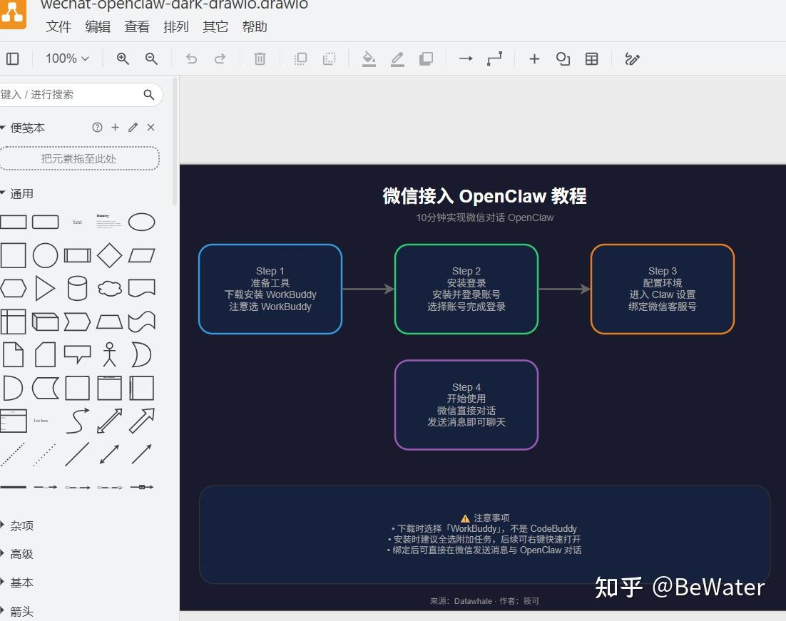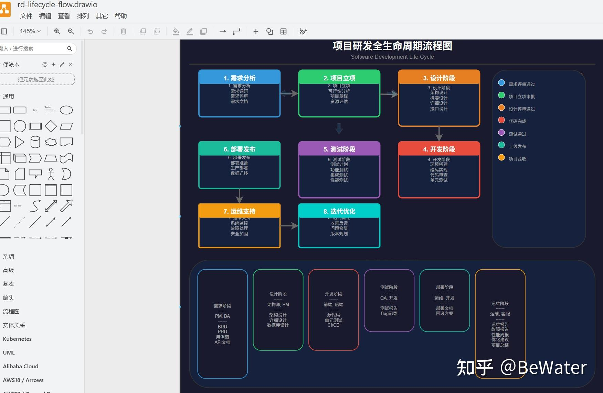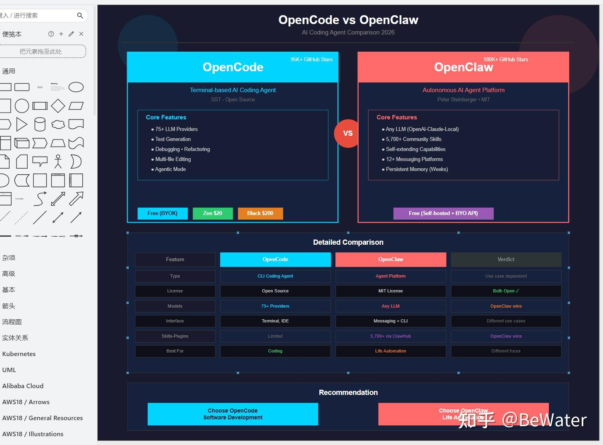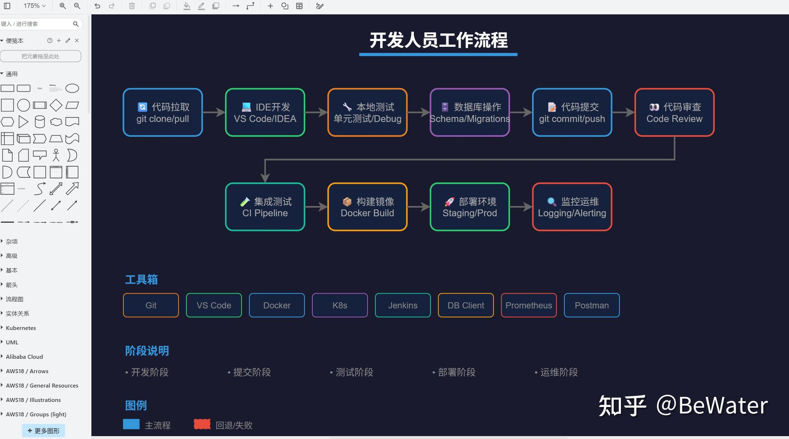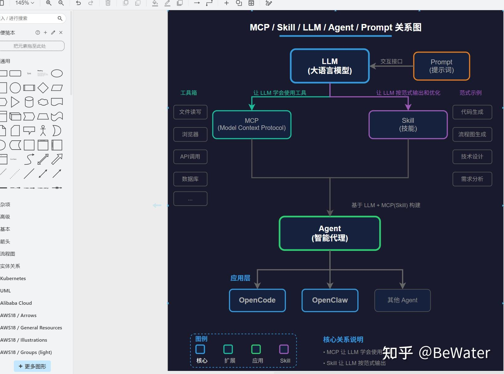

### svg-generator skill【推荐】 效果

svg-generator skill输出SVG格式图形，视觉效果更加专业美观。以下是几个示例图：

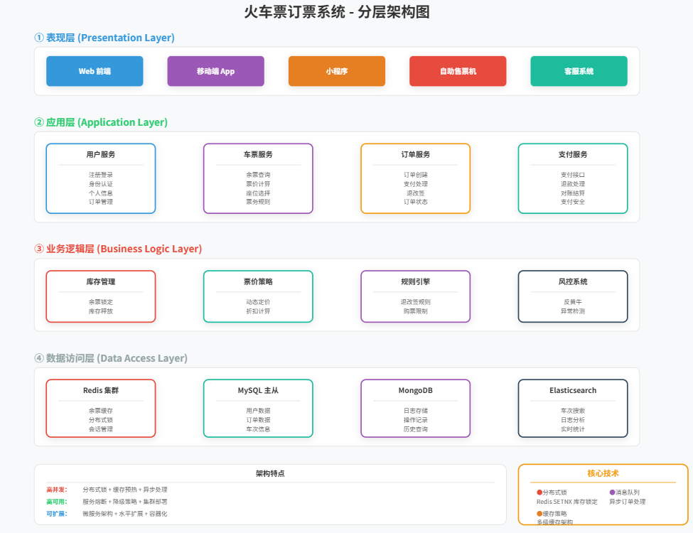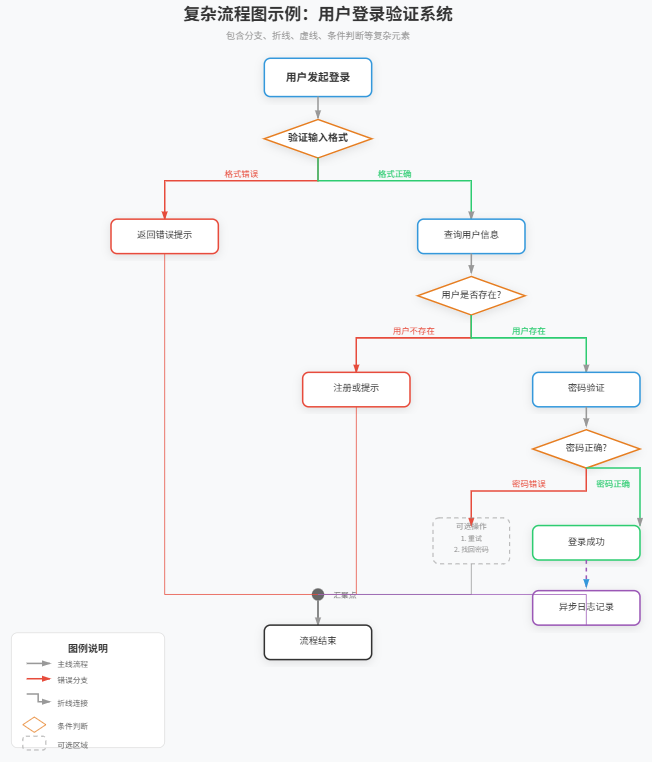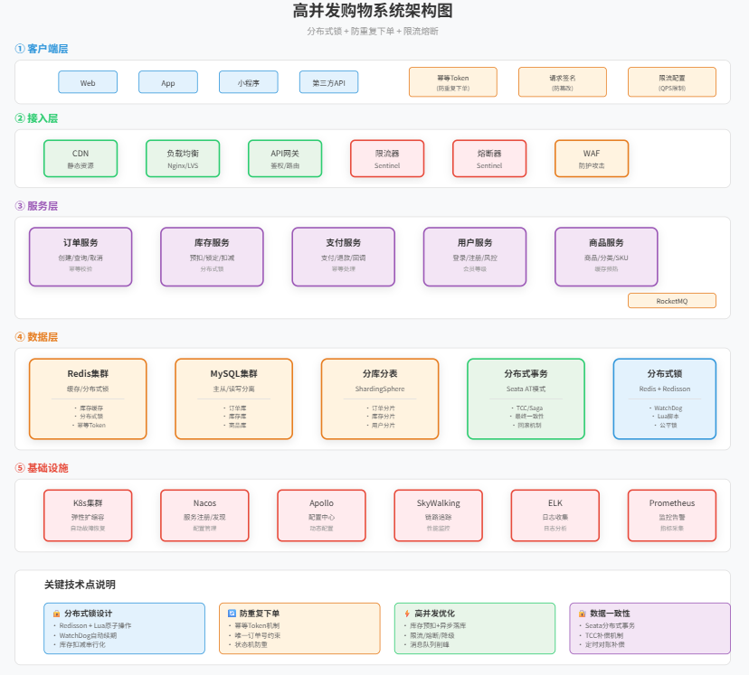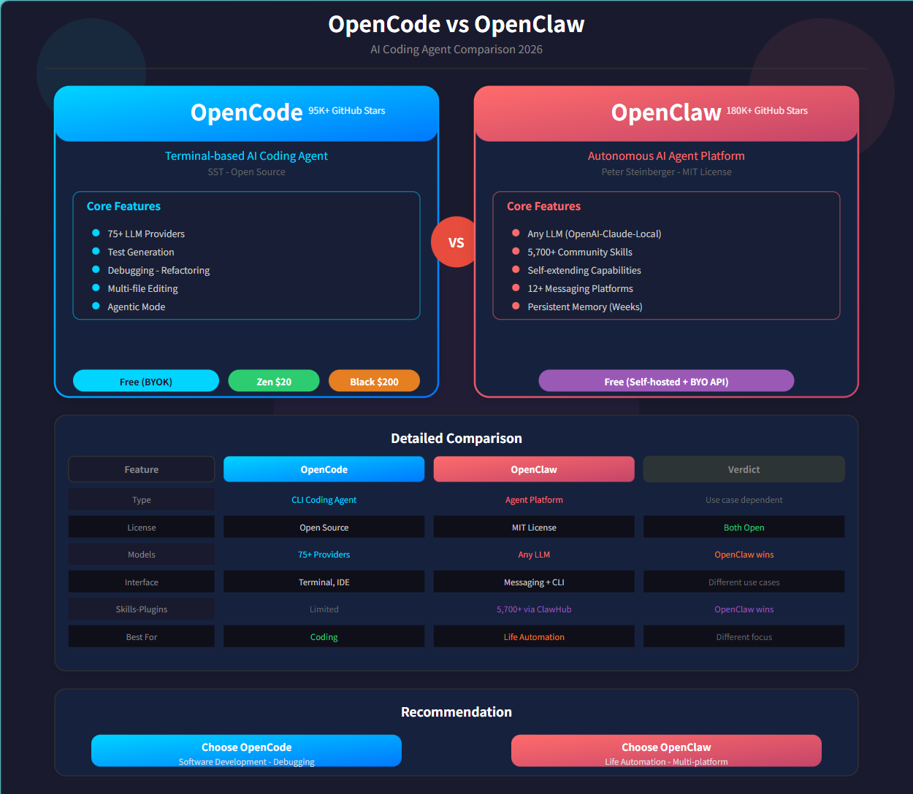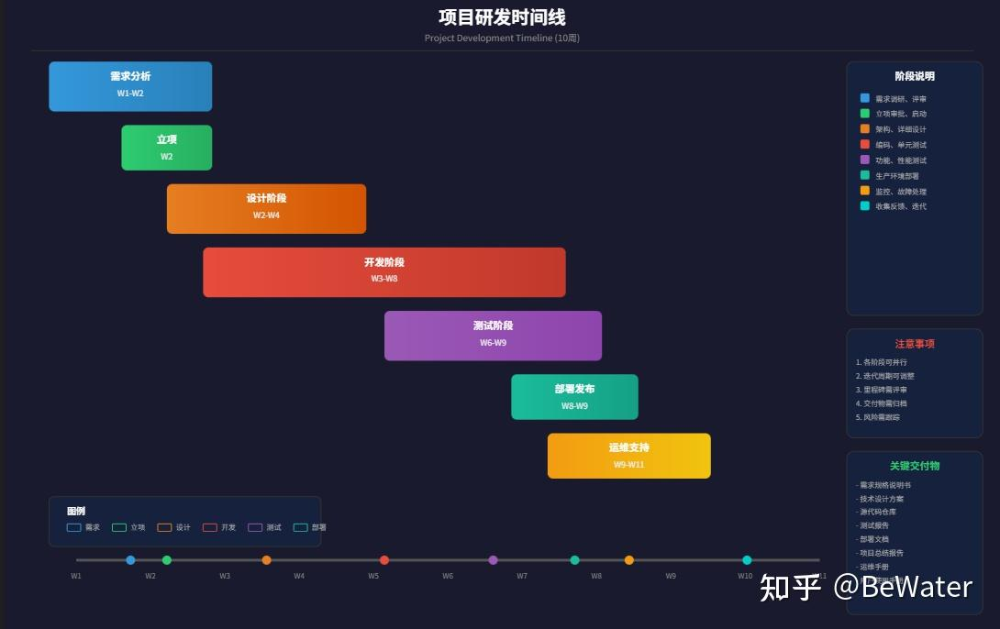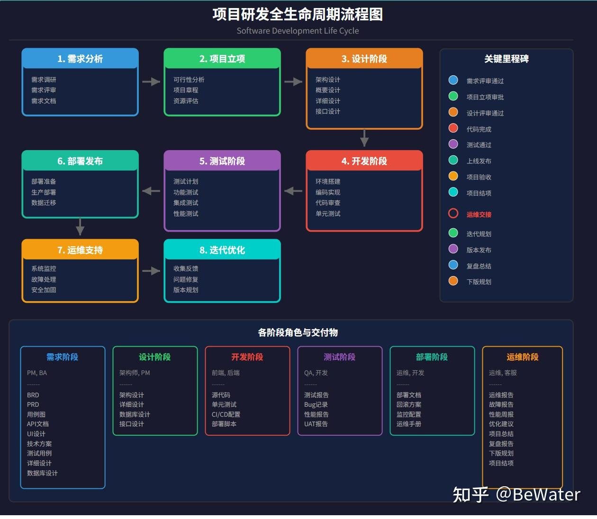

### drawio-diagram skill 效果（需要人工二次调整）

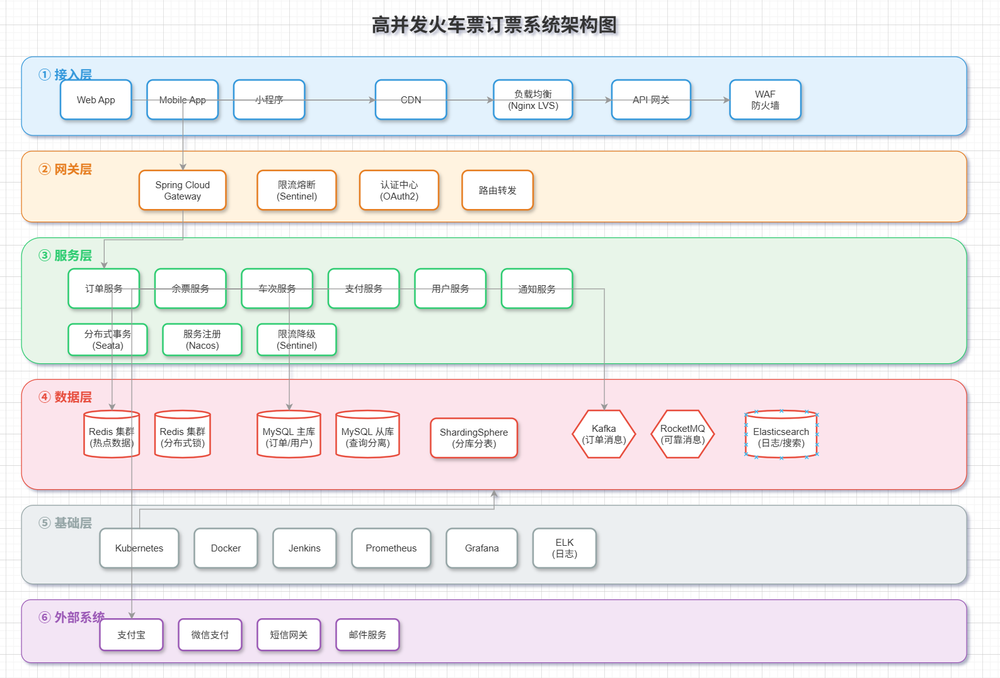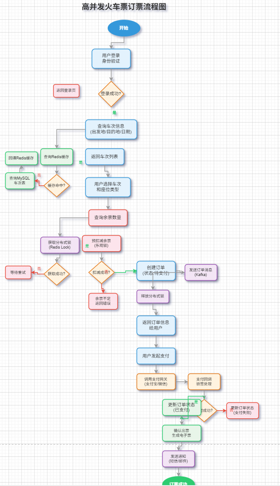

  

### 不足与优化方向

目前这几个skill在处理复杂流程图时（尤其是分支较多的情况），仍可能出现线条错乱问题。后续将重点针对这一问题进行调整和优化。

如果追求更高质量的流程图效果，建议尝试使用mermaid或flowchart等文本绘图方式。这类基于文本生成的流程图不会出现错乱问题，尽管样式可能相对单调一些。

## skill 风格共享

如果大家也希望自行调试和优化，我很乐意分享skill中的绘图风格规范供大家参考。同时也欢迎大家分享自己实践中发现好用的skill，让我们共同学习进步。

````text
### 2.1 主色调

  

| 用途 | 颜色代码 | 说明 |

|------|---------|------|

| 主色（蓝色） | `#3498db` | 流程入口、开始节点 |

| 辅助色（绿色） | `#2ecc71` | 成功、验证通过 |

| 强调色（橙色） | `#e67e22` | 关键节点、网关 |

| 警示色（红色） | `#e74c3c` | 错误、警告、锁 |

| 紫色 | `#9b59b6` | 消息队列、第三方 |

| 青色 | `#1abc9c` | 数据库、存储 |

  

### 2.2 中性色

  

| 用途 | 颜色代码 |

|------|---------|

| 背景色 | `#f8f9fa` |

| 卡片背景 | `#ffffff` |

| 标题文字 | `#333333` |

| 正文文字 | `#666666` |

| 辅助文字 | `#999999` |

| 边框色 | `#e0e0e0` |

  

### 2.3 图层颜色

  

| 图层类型 | 边框颜色 | 填充颜色 |

|---------|---------|---------|

| 客户端层 | `#3498db` | `#E3F2FD` |

| 网络层 | `#e67e22` | `#FFF3E0` |

| 服务层 | `#2ecc71` | `#E8F5E9` |

| 数据层 | `#e74c3c` | `#FCE4EC` |

| 基础层 | `#95a5a6` | `#ECEFF1` |

  

## 3. 箭头规范

  

### 3.1 箭头标记定义

  

```xml

<!-- 灰色箭头 -->

<marker id="arrowhead" markerWidth="6" markerHeight="4" refX="5" refY="2" orient="auto">

  <polygon points="0 0, 6 2, 0 4" fill="#999999"/>

</marker>

  

<!-- 蓝色箭头 -->

<marker id="arrowhead-blue" markerWidth="6" markerHeight="4" refX="5" refY="2" orient="auto">

  <polygon points="0 0, 6 2, 0 4" fill="#3498db"/>

</marker>
````

  

````text
### 3.2 箭头样式

  

| 属性 | 标准值 | 说明 |

|------|-------|------|

| markerWidth | 6 | 箭头宽度 |

| markerHeight | 4 | 箭头高度 |

| refX | 5 | 箭头尖端偏移 |

| refY | 2 | 箭头垂直居中 |

| stroke-width | 2 | 连接线粗细 |

  

### 3.3 箭头颜色

  

- **灰色箭头**：使用 `#999999`（推荐用于连接线）

- **蓝色箭头**：使用 `#3498db`（可用于强调流程主线）

- **红色箭头**：使用 `#e74c3c`（用于错误分支）

  

### 3.4 线条样式规范

  

| 样式类型 | 使用场景 | stroke-dasharray | 颜色 |

|---------|---------|------------------|------|

| 实线 | 主线流程、正确分支、错误分支 | 无（默认） | `#999999` 或 `#e74c3c` |

| 虚线 | 仅用于异步/回调流程 | `5,5` | `#9b59b6` 或 `#999999` |

| 点划线 | 可选流程（不推荐） | `10,5` | `#999999` |

  

**重要原则**：

- 错误分支必须使用实线，用颜色（红色）区分，不可用虚线

- 虚线仅用于表示异步、回调、定时任务等非同步场景

- 避免过度使用虚线，保持图形简洁清晰

  

## 4. 图形元素规范

  

### 4.1 卡片/节点

  

```xml

<rect x="100" y="100" width="140" height="60" rx="8" ry="8"

      fill="#ffffff" stroke="#3498db" stroke-width="2"

      filter="url(#shadow)"/>
````

  

````text
| 属性 | 标准值 | 说明 |

|------|-------|------|

| rx | 8 | 圆角半径 |

| stroke-width | 2 | 边框宽度 |

| filter | url(#shadow) | 阴影效果 |

  

### 4.2 阴影滤镜

  

```xml

<filter id="shadow" x="-20%" y="-20%" width="140%" height="140%">

  <feDropShadow dx="0" dy="3" stdDeviation="6" flood-opacity="0.1"/>

</filter>
````

  

````text
### 4.3 标题文字

  

```xml

<text x="400" y="30" text-anchor="middle"

      font-size="20" font-weight="bold" fill="#333333">

  图形标题

</text>
````

  

````text
### 4.4 节点文字

  

```xml

<text x="170" y="130" text-anchor="middle"

      font-size="14" font-weight="bold" fill="#333333">

  节点名称

</text>
````