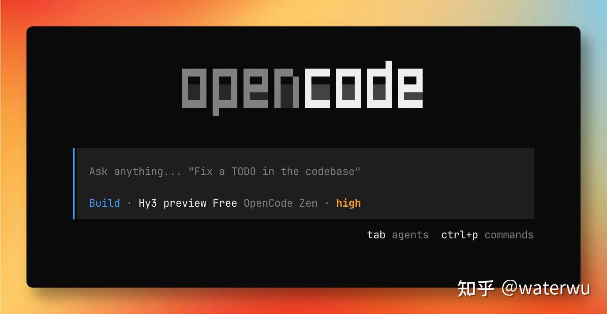

我反正是 OpenCode 的重度用户，反而 Claude Code 每次用都不得劲。

尤其是思考过程不展示，CC 那边近期 Opus 思考参数调整居然这么久都没被发现，这个特性功不可没。当然，国外御三家模型不公开思考过程，这个居功甚伟。我自己反正是很在意模型思考过程的，因为这会更方便我随时打断调整，也能让我了解到不少模型的执行思路。

还有就是生态问题，的确 CC 的开源插件生态很强，这在我看来是个悲哀——这么强的开源生态，底层构建在一个不开放源码的黑盒之上。而 opencode 生态的确不强，但从源码和数据库都全开放的视角来看，很适合开发者自己折腾，而不是直接用别人已经搞完了的东西。就比如一个 CC Switch，谁也不知道 Claude 官方会不会有一天开始尝试封堵，而且切换过程也极其诡异。归根究底是 Claude 本身就不是为多模型切换做的设计，跟自己的模型矩阵高度绑定，在这基础上硬套其他模型，真的是个悲哀。

最让我费解的是国内自媒体以及海外中文圈对于 Claude Code 以及 Claude 的热衷，高度怀疑背后就是由庞大的利益群体驱使的，主要构成估计是培训机构以及中转站运营商。反而是海外英文社区其实对 OpenCode 好评甚多。

还有人说 OpenCode 不稳定啥。近期新版本有出一些问题我承认，但说得好像 Claude Code 那边就没有问题？那边直接花样秀操作把用户的 token 烧光，claude 官方还不肯重置额度，海外都炸锅了，国内社区几乎听不到什么声音…… 海外的真实情况是，大批开发者都在转向 Codex，人家那边也是直接开源的，用的还是 rust，国内也听不到多少声音。

skills 在 claude code 才用得好，高度绑定 claude 生态，这怎么感觉味道也很不对。实际上真的良心 skills 从来都是在不同平台都运转良好，否则 openclaw / cline 啥的就都别玩 skill 了。反而是某些群体强推的 skills，的确是跟 claude code 高度绑定的。

差多少？我自己的体感，当你的 prompt 写得到位，两边相差无几。而 system prompt 的确是 claude 那边的更多更长，他们自己倒是说你们的 CLAUDE md 别太长，两百行差不多了；然而他们自己的内置 prompt 随随便便就是五百行起步，好笑。而 opencode 就是在这方面吃了不少亏，system prompt 短得要命，skills 好像也不是直接引入，难怪被人说 skill 不生效。

反正我自己体感，不同的 coding agent 差异没有那么大，看哪个顺手用哪个。我就觉得 qwen code 也不错。不过 opencode 现在反而是现在跟国产模型关系最好的那个，最新的模型在上面经常会有免费体验，比如现在 hy3 preview 就是免费体验期。

我反正是主要用国产模型的，用 opencode 就很舒服。

