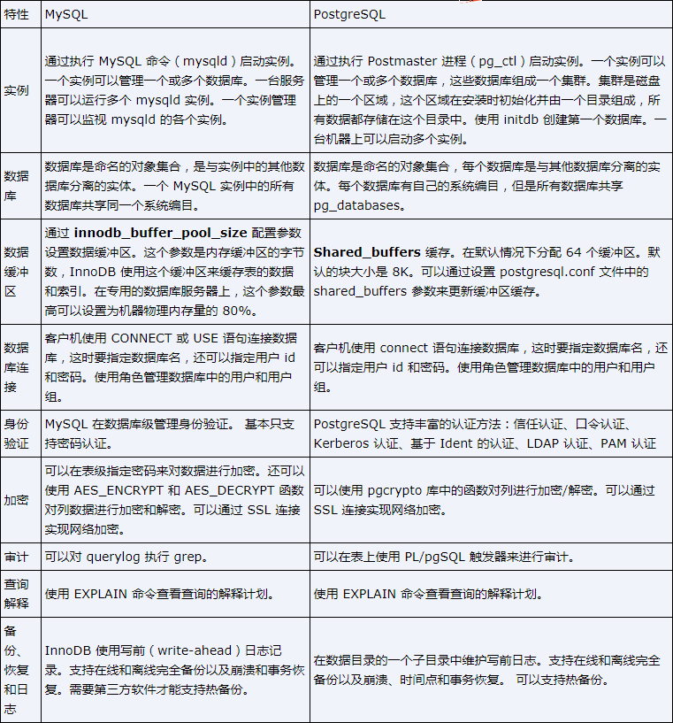
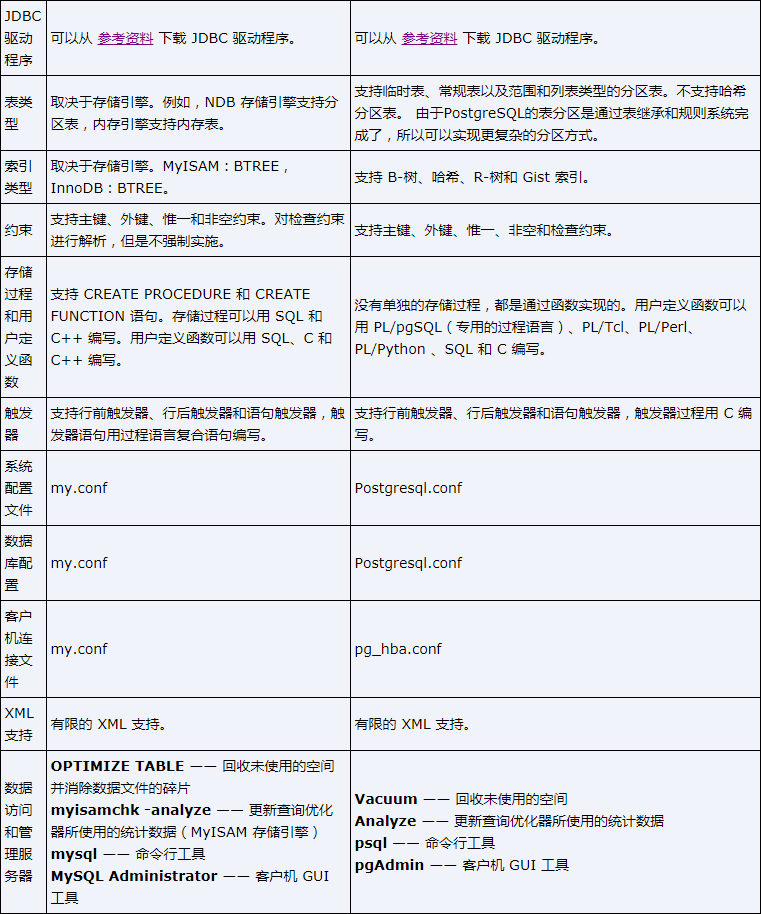

## 可以看看这篇PostgreSQL 与 MySQL 的相互对比。

本文是转载文章。

MySQL相对于PostgreSQL的劣势：

PostgreSQL主要优势：

　　1. PostgreSQL完全免费，而且是BSD协议，如果你把PostgreSQL改一改，然后再拿去卖钱，也没有人管你，这一点很重要，这表明了PostgreSQL数据库不会被其它公司控制。oracle数据库不用说了，是商业数据库，不开放。而MySQL数据库虽然是开源的，但现在随着SUN被oracle公司收购，现在基本上被oracle公司控制，其实在SUN被收购之前，MySQL中最重要的InnoDB引擎也是被oracle公司控制的，而在MySQL中很多重要的数据都是放在InnoDB引擎中的，反正我们公司都是这样的。所以如果MySQL的市场范围与oracle数据库的市场范围冲突时，oracle公司必定会牺牲MySQL，这是毫无疑问的。

　　2. 与PostgreSQl配合的开源软件很多，有很多分布式集群软件，如pgpool、pgcluster、slony、plploxy等等，很容易做读写分离、负载均衡、数据水平拆分等方案，而这在MySQL下则比较困难。

3\. PostgreSQL源代码写的很清晰，易读性比MySQL强太多了，怀疑MySQL的源代码被混淆过。所以很多公司都是基本PostgreSQL做二次开发的。

4\. PostgreSQL在很多方面都比MySQL强，如复杂SQL的执行、存储过程、触发器、索引。同时PostgreSQL是多进程的，而MySQL是线程的，虽然并发不高时，MySQL处理速度快，但当并发高的时候，对于现在多核的单台机器上，MySQL的总体处理性能不如PostgreSQL，原因是MySQL的线程无法充分利用CPU的能力。

目前只想到这些，以后想到再添加，欢迎大家拍砖。

**PostgreSQL与oracle或InnoDB的多版本实现的差别**

PostgreSQL与oracle或InnoDB的多版本实现最大的区别在于最新版本和历史版本是否分离存储，PostgreSQL不分，而oracle和InnoDB分，而innodb也只是分离了数据,索引本身没有分开。  
PostgreSQL的主要优势在于：  
1\. PostgreSQL没有回滚段，而oracle与innodb有回滚段，oracle与Innodb都有回滚段。对于oracle与Innodb来说，回滚段是非常重要的，回滚段损坏，会导致数据丢失，甚至数据库无法启动的严重问题。另由于PostgreSQL没有回滚段，旧数据都是记录在原先的文件中，所以当数据库异常crash后，恢复时，不会象oracle与Innodb数据库那样进行那么复杂的恢复，因为oracle与Innodb恢复时同步需要redo和undo。所以PostgreSQL数据库在出现异常crash后，数据库起不来的几率要比oracle和mysql小一些。  
2\. 由于旧的数据是直接记录在数据文件中，而不是回滚段中，所以不会象oracle那样经常报ora-01555错误。  
3\. 回滚可以很快完成，因为回滚并不删除数据，而oracle与Innodb，回滚时很复杂，在事务回滚时必须清理该事务所进行的修改，插入的记录要删除，更新的记录要更新回来(见row\_undo函数)，同时回滚的过程也会再次产生大量的redo日志。  
4\. WAL日志要比oracle和Innodb简单，对于oracle不仅需要记录数据文件的变化，还要记录回滚段的变化。  
**PostgreSQL的多版本的主要劣势在于：**  
1、最新版本和历史版本不分离存储，导致清理老旧版本需要作更多的扫描，代价比较大，但一般的数据库都有高峰期，如果我们合理安排VACUUM，这也不是很大的问题，而且在PostgreSQL9.0中VACUUM进一步被加强了。  
　　2、由于索引中完全没有版本信息，不能实现Coverage index scan，即查询只扫描索引，直接从索引中返回所需的属性，还需要访问表。而oracle与Innodb则可以;

**进程模式与线程模式的对比**  
PostgreSQL和oracle是进程模式，MySQL是线程模式。  
进程模式对多CPU利用率比较高。  
进程模式共享数据需要用到共享内存，而线程模式数据本身就是在进程空间内都是共享的，不同线程访问只需要控制好线程之间的同步。  
线程模式对资源消耗比较少。  
所以MySQL能支持远比oracle多的更多的连接。  
对于PostgreSQL的来说，如果不使用连接池软件，也存在这个问题，但PostgreSQL中有优秀的连接池软件软件，如pgbouncer和pgpool，所以通过连接池也可以支持很多的连接。

**堆表与索引组织表的的对比**  
  
Oracle支持堆表，也支持索引组织表  
PostgreSQL只支持堆表，不支持索引组织表  
Innodb只支持索引组织表  
索引组织表的优势：  
表内的数据就是按索引的方式组织，数据是有序的，如果数据都是按主键来访问，那么访问数据比较快。而堆表，按主键访问数据时，是需要先按主键索引找到数据的物理位置。  
索引组织表的劣势：  
索引组织表中上再加其它的索引时，其它的索引记录的数据位置不再是物理位置，而是主键值，所以对于索引组织表来说，主键的值不能太大，否则占用的空间比较大。  
对于索引组织表来说，如果每次在中间插入数据，可能会导致索引分裂，索引分裂会大大降低插入的性能。所以对于使用innodb来说，我们一般最好让主键是一个无意义的序列，这样插入每次都发生在最后，以避免这个问题。  
由于索引组织表是按一个索引树，一般它访问数据块必须按数据块之间的关系进行访问，而不是按物理块的访问数据的，所以当做全表扫描时要比堆表慢很多，这可能在OLTP中不明显，但在数据仓库的应用中可能是一个问题。

　 PostgreSQL9.0中的特色功能：  
PostgreSQL中的Hot Standby功能  
也就是standby在应用日志同步时，还可以提供只读服务，这对做读写分离很有用。这个功能是oracle11g才有的功能。

PostgreSQL异步提交（Asynchronous Commit）的功能：  
　 这个功能oracle中也是到oracle11g R2才有的功能。因为在很多应用场景中，当宕机时是允许丢失少量数据的，这个功能在这样的场景中就特别合适。在PostgreSQL9.0中把synchronous\_commit设置为false就打开了这个功能。需要注意的是，虽然设置为了异步提交，当主机宕机时，PostgreSQL只会丢失少量数据，异步提交并不会导致数据损坏而数据库起不来的情况。MySQL中没有听说过有这个功能。

PostgreSQL中索引的特色功能：

PostgreSQL中可以有部分索引，也就是只能表中的部分数据做索引，create index 可以带where 条件。同时PostgreSQL中的索引可以反向扫描，所以在PostgreSQL中可以不必建专门的降序索引了。

来源：博客

作者：osdba

原文：[PostgreSQL与MySQL比较 - PostgreSQL-Chinaunix](https://link.zhihu.com/?target=http%3A//bbs.chinaunix.net/thread-1688208-1-1.html)