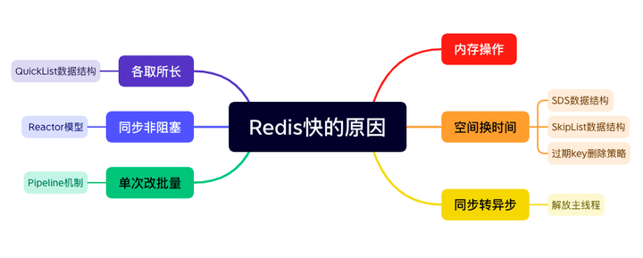
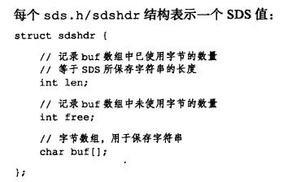
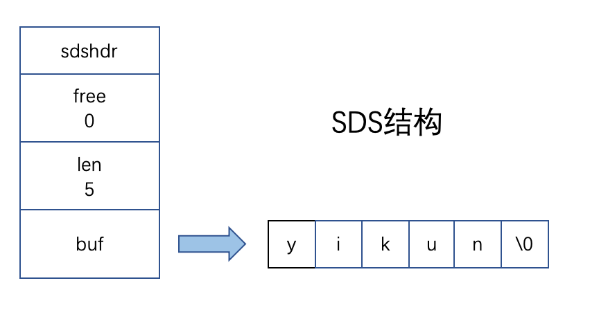
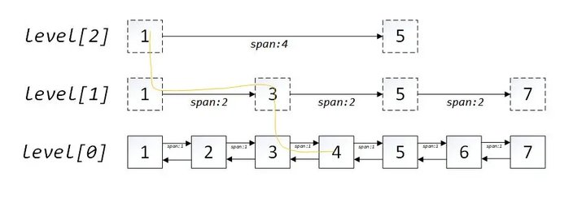
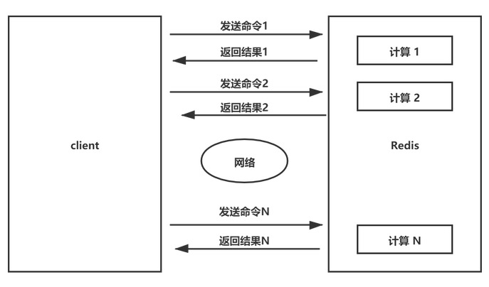
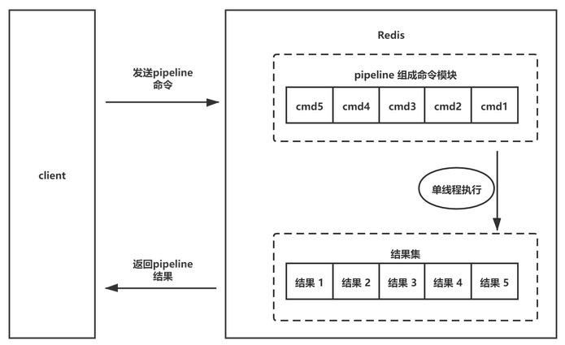
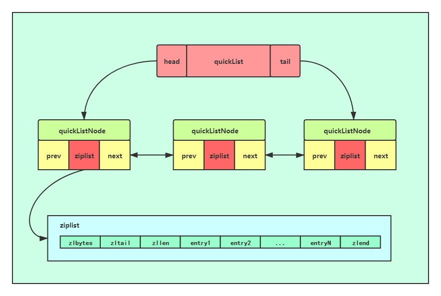
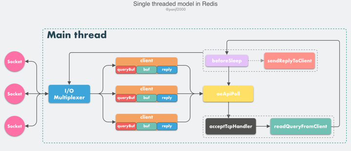
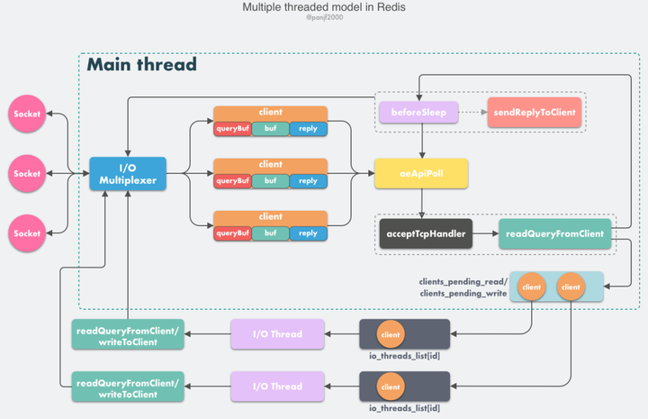
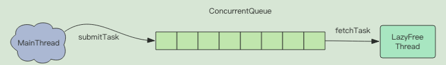

这个问题，在问到Redis方向的时候，经常会以当头炮的方式出现。

一般面试官说：“我们来聊聊Redis吧”，接下来就会问到：“能说下Redis为什么这么快吗”。

我听到最多的答案就是：“因为它是内存数据库，不用往硬盘上写，所以快啊。”

btw：这么说除了俗点儿，肯定也没毛病。

我听到最好玩儿的答案是：“因为它是单线程模型，不会涉及到锁机制，所以就快了。”

btw：艾玛，这个锅多线程不背，合着是线程越多就越慢呗。

下面我们就来详细分析一下，正在备战面试的同学也可以记一下，算是个蛮高频的问题。

“基于内存实现”这个原因就不详细展开了哈，毕竟地球人都懂的。

  



  
空间换时间 —— SDS数据结构

这里所说的空间为”内存空间“。

Redis是用C语言写的，但它的String数据类型，并没有直接用C语言中的char\*字符数组字符串，而是通过简单动态字符串（Simple Dynamic String，SDS）的数据结构来实现的。

《Redis设计与实现》一书中，片段如下：



-   free属性的值为0，表示这个SDS没有分配任何未使用空间；
-   len 属性的值为 5，表示这个SDS保存了一个五字节长的字符串；
-   buf属性是char类型的字节数组，前五个字节保存了'y'、'i'、'k'、'u'、'n'，最后一个字节保存了空字符 '\\0'；

  
相比较于C语言字符串，SDS记录了已使用和未使用字节的数量，目的有两点：

1.  获取字符串长度时，无需遍历整个字符串，将操作复杂度从O(N)降低为O(1)；
2.  为减少修改字符串操作所带来的内存重分配次数，提供了数据结构上的支持；

第二点不太容易理解，我们详细解释一下。

C语言字符串修改场景的实现方式是：

-   如果字符串在修改后变长了，会进行内存重分配操作，让其可以存下修改后的字符串大小；
-   如果字符串在修改后变短了，则会进行内存释放操作；

这样做比较节省内存空间，但频繁地内存分配释放操作对性能是有影响的。

我们看看Redis SDS是如何进行优化的。

**空间预分配**

如果SDS在修改后变长了，Redis不仅会为SDS分配修改所需的空间, 还会为SDS分配额外的未使用空间。

如果修改后SDS长度小于1MB，Redis会分配和len属性同样大小的未使用空间，这时SDS的len和free属性的值是相同的；如果修改后SDS长度大于等于1M，Redis会分配1MB的未使用空间。

**惰性空间释放**

如果SDS在修改后变短了， Redis不会立即将内存进行回收，而是使用free属性将这些字节的数量记录起来，以备将来使用。当然，SDS也有真正释放SDS未使用空间的机制，不用担心该策略会带来内存浪费。

Redis SDS通过空间预分配和惰性空间释放的方式，减少操作内存次数，提升性能。

## 空间换时间 —— SkipList数据结构

Redis的ZSet数据类型的底层实现比较复杂。

默认情况下，ZSet使用ListPack做为存储结构，当集合中的元素大于等于512个，或是单个值的字节数大于等于64，存储结构会修改为SkipList + Hash。

其中，Hash用来支持高效单点查询，而SkipList的优势是能在 O(logN) 复杂度进行高效的范围查询。

SkipList是通过多层有序链表的方式实现的，上面每一层链表的节点个数，是下面一层的节点个数的一半，这样查找过程就非常类似于一个二分查找，使得查找的时间复杂度可以降低到 O(logn)。

相当于多耗费了链表上层存储的空间，但是通过快捷的二分查找节省了时间，即：用空间换时间。



## 空间换时间 —— 过期key删除策略

Redis过期key删除策略为：定期删除和惰性删除两种策略配合使用。

**定期删除**

Redis会将每个设置了过期时间的key放入到一个独立的字典中，以后会定期遍历这个字典来删除到期的key，默认每秒进行十次过期扫描，过期扫描不会遍历过期字典中所有的key，而是采用了一种简单的贪心策略。  
  
步骤如下：

1.  从过期字典中随机20个key；
2.  删除这20个key中已经过期的key；
3.  如果过期的key比率超过1/4，那就重复步骤1；

该线程不仅处理定时任务，还处理客户端请求，为了保证过期扫描不会出现循环过度，导致客户端请求堆积和处理缓慢的现象，算法还增加了扫描时间的上限，默认不会超过25ms。

**惰性删除**

除了定期遍历之外，它还会使用惰性策略来删除过期的key，在客户端访问这个key的时候，Redis对key的过期时间进行检查，如果过期了就立即删除。定期删除是集中处理，惰性删除是零散处理。

  
Redis通过定期删除的25ms上限机制和惰性删除机制，也都是以一种空间换时间的策略，让客户端请求的响应时间得到保障。

## 单次改批量 —— Pipeline机制

正常情况下，客户端发送一个命令后等待Redis应答，Redis在接收到命令后处理应答，而下一个命令必须要等到第一个命令处理完才能进行。



而Redis的Pipeline机制，允许客户端先将执行的命令写入到缓冲中，最后再一次性发送Redis服务器端，而不等待上一条命令执行的结果。



Pipeline机制是一种通过同时发出多个命令（单次改批量）来提高性能的技术，而无需等待对每个单独命令的响应，相当于N个连续的读写操作总共只会花费一次网络来回。

btw：Pipeline机制并不是Redis服务器端提供的技术方案，而是其客户端提供的。

代码如下：

```text
private void setCache(List<String> names, String key) {
    Pipeline pipeline = redis.pipelined();
    for (String name : names) {
        pipeline.zadd(key, name, score);
    }
    pipeline.expire(key, CACHE_EXPIRE_SECONDS);
    pipeline.sync();
}
```

  
我们执行10000次set命令，Pipeline机制和非Pipeline机制的执行时间对比如下：

| 网络环境 | 延迟 | 非Pipeline | Pipeline |
| ----- | ----- | ----- | ----- |
| 本机 | 0.17ms | 573ms | 134ms |
| 同机房 | 0.41ms | 1610ms | 240ms |
| 跨机房 | 7ms | 78499ms | 1104ms |

  
由此可见，极端场景下，非Pipeline机制是Pipeline机制的执行时间的70多倍。

## 各取所长 —— QuickList数据结构

Redis 3.2 之前的版本，List数据类型实现方式为：

-   当列表的长度小 512，并且所有元素的长度都小于64字节时，使用ziplist存储；
-   否则使用 linkedlist 存储；

两者各有优缺点：

-   ZipList的优点是内存紧凑，访问效率高，缺点是更新效率低，且连锁更新会产生大量的内存复制；
-   LinkedList的优点是节点修改的效率高，但是需要额外的内存开销；

为了结合两者的优点，在Redis 3.2之后，List的底层实现变为快速列表QuickList。

QuickList是由多个节点组成的双向链表，每个节点都是一个ZipList，每个ZipList包含了多个元素，每个元素可以是一个整数或一个字节数组。



通过各取所长，QuickList解决了ZipList连锁更新的大量内存复制，从而导致性能低下的问题，也解决了LinkedList产生内存碎片所导致的性能下降问题。

## 同步非阻塞 —— Reactor模型

之前我在介绍Netty的时候写过，其实Redis也是用的Reactor模型。

**Reactor模型思想：**

分而治之 + 事件驱动，这种方式的优点为：把一个大任务拆分为若干个小任务，这样可以减少其阻塞时间。

**分而治之**

一个连接里完整的网络处理过程一般分为accept、read、decode、process、encode、send（write）这几步。

Reactor模式将每个步骤映射为一个Task，服务端线程执行的最小逻辑单元不再是一次完整的网络请求，而是Task，且采用非阻塞方式执行。

**事件驱动**

相应的Task（accept、read、write）对应特定网络事件。当Task准备就绪时，Reactor收到对应的网络事件通知，并将Task分发给绑定了对应网络事件的Acceptor和Handler执行。

Redis是基于Reactor模式开发了网络事件处理器，这个处理器叫做文件事件处理器(file event handler)。由于这个文件事件处理器是单线程的，所以 Redis 才叫做单线程的模型。采用IO多路复用机制同时监听多个 Socket，根据 socket 上的事件来选择对应的事件处理器来处理这个事件。

  
在Redis 6.0以前，Redis的核心网络模型选择用单线程来实现的。



而在Redis 6.0的时候引入了多线程。因为单线程模式会导致系统消耗很多时间在网络IO上，从而降低吞吐量。



Redis作者Antirez在RedisConf 2019分享时曾提到：Redis 6 引入的多线程IO特性对性能提升至少是一倍以上。  
  

### 同步转异步 —— 解放主线程

Redis的del命令可以用来进行key删除的操作，它是一个同步阻塞的命令。

如果你要删除的是一个超大的键值对，里面有几百万个对象，这条命令会阻塞好几秒，而且事件循环是单线程的，会阻塞后面的其他命令，导致这些命令都变慢很多。

Redis 4.0 版本增加了del的异步版本 —— unlink命令，它不会同步删除数据，只是会将这个 key 的内存回收操作包装成一个任务，塞进异步任务队列，由后台线程去执行删除操作。



除了unlink以外，flushall async和flushdb async命令也是这种同步转异步的思想，去解放主线程，提升用户操作的性能。

## 结语

做这个总结，应对各式面试官是出发点之一，此外理解其背后所蕴含的思想，也可以应用到我们的系统设计中。

分享一套我自己逐字写的、深入浅出、细致易懂的高频面试题详解，旨在以**一站式刷题 + 解惑**的方式帮你提升学习效率，需要的请自取。

[大厂Java高频面试题详解](https://link.zhihu.com/?target=https%3A//mp.weixin.qq.com/s%3F__biz%3DMzkxMDUxNzM2Nw%3D%3D%26mid%3D2247484894%26idx%3D1%26sn%3D920715e633964de11dfa47bff3b6b12c%26chksm%3Dc12b70c6f65cf9d0feb54b096976ee6b986195fa1584c183a67c327a0fe6df8ecaccb12d51e5%26token%3D1790900296%26lang%3Dzh_CN%23rd)

强烈建议近期有求职诉求的Javaer好好看看。