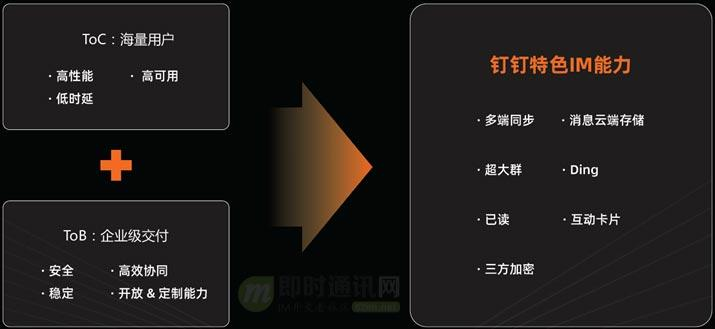
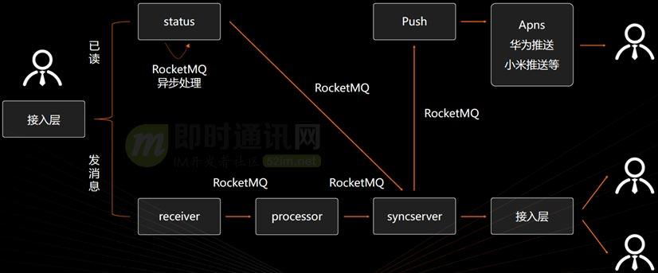
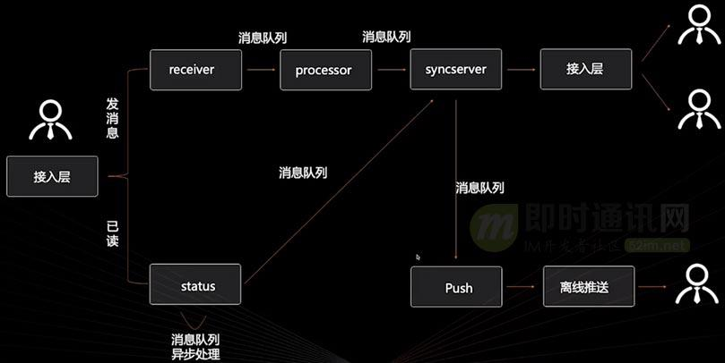
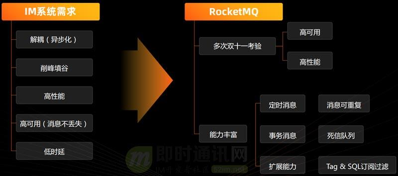
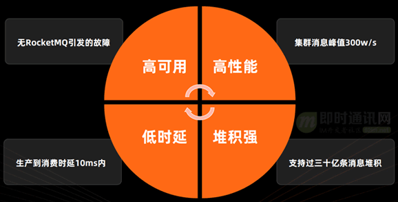
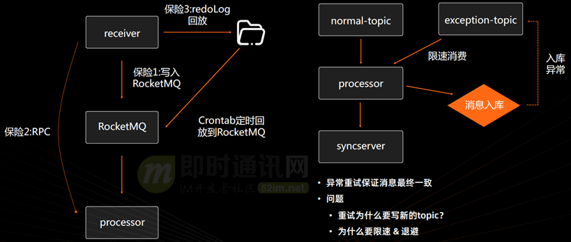
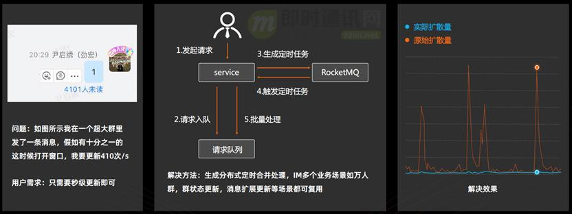
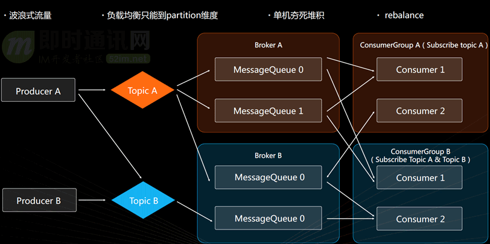
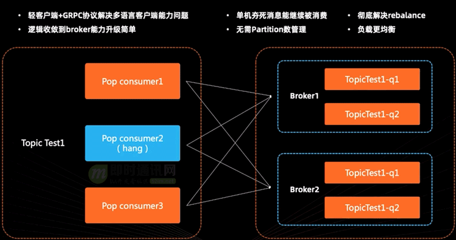

本文由钉钉技术专家尹启绣分享，有修订和重新排版。

## **1、引言**

短短的几年时间，钉钉便迅速成为一款国民级应用，发展速度堪称迅猛。

IM作为钉钉最核心的功能，每天需要支持海量企业用户的沟通，同时还通过 PaaS 形式为淘宝、高德等 App 提供基础的即时通讯能力，是日均千亿级消息量的 IM 平台。

**在钉钉的IM中，我们通过 RocketMQ实现了系统解耦、异步削峰填谷，还通过定时消息实现分布式定时任务等高级特性。同时与 RocketMQ 深入共创，不断优化解决了很多RocketMQ本身的问题，并且孵化出 POP 消费模式等新特性，使 RocketMQ 能够完美支持对性能稳定性和时延要求非常高的 IM 系统。本文将为你分享这些内容。**

## **2、系列文章**

**本文是系列文章的第9篇，总目录如下：**

-   《[阿里IM技术分享(一)：企业级IM王者——钉钉在后端架构上的过人之处](https://link.zhihu.com/?target=http%3A//www.52im.net/thread-2848-1-1.html)》
-   《[阿里IM技术分享(二)：闲鱼IM基于Flutter的移动端跨端改造实践](https://link.zhihu.com/?target=http%3A//www.52im.net/thread-3615-1-1.html)》
-   《[阿里IM技术分享(三)：闲鱼亿级IM消息系统的架构演进之路](https://link.zhihu.com/?target=http%3A//www.52im.net/thread-3699-1-1.html)》
-   《[阿里IM技术分享(四)：闲鱼亿级IM消息系统的可靠投递优化实践](https://link.zhihu.com/?target=http%3A//www.52im.net/thread-3706-1-1.html)》
-   《[阿里IM技术分享(五)：闲鱼亿级IM消息系统的及时性优化实践](https://link.zhihu.com/?target=http%3A//www.52im.net/thread-3726-1-1.html)》
-   《[阿里IM技术分享(六)：闲鱼亿级IM消息系统的离线推送到达率优化](https://link.zhihu.com/?target=http%3A//www.52im.net/thread-3748-1-1.html)》
-   《[阿里IM技术分享(七)：闲鱼IM的在线、离线聊天数据同步机制优化实践](https://link.zhihu.com/?target=http%3A//www.52im.net/thread-3856-1-1.html)》
-   《[阿里IM技术分享(八)：深度解密钉钉即时消息服务DTIM的技术设计](https://link.zhihu.com/?target=http%3A//www.52im.net/thread-4012-1-1.html)》
-   《[阿里IM技术分享(九)：深度揭密RocketMQ在钉钉IM系统中的应用实践](https://link.zhihu.com/?target=http%3A//www.52im.net/thread-4106-1-1.html)》（**\* 本文**）

## **3、钉钉IM面临的巨大技术挑战**

### **3.1 概述**

钉钉作为企业级 IM 领先者，面临着巨大的技术挑战。市面上DAU过亿的App里，只有钉钉是2B产品，我们不仅需要和其他 2C 产品一样，支持海量用户的低时延、高并发、高性能、高可用，还需保证企业级用户在使用钉钉时能够提升沟通协同效率。

**下图是概括的是钉钉的主要能力：**

### **3.2 技术挑战1：ToB与ToC的差异**

作为企业级应用，需要保证帮助用户提升沟通体验。

ToB 的工作沟通和 ToC 的场景生活沟通存在较大差异， ToC的IM产品比如微信，在有完整的关系链后，只需满足大部分用户需求即可。

然而微信的很多体验其实并不友好：比如聊天消息中的视频图片在固定时间内没有打开则会无法下载，卸载重装之后聊天记录全部丢失。

**而 ToB 场景下：**聊天记录是非常重要的内容，钉钉为保证用户消息不丢失，提供了多端同步和消息云端存储的能力，用户任意换端都能查看完整的聊天记录。

在工作过程中，大量会议是工作效率杀手，钉钉还提供了已读、Ding 等效率套件，为工作沟通提供新选项。

### **3.3 技术挑战2：安全要求高**

在ToB 的工作场景下，用户对信息安全要求非常高，信息安全是企业的生命线。

钉钉提供了人和组织架构打通的工作群，用户离开组织后自动退出企业工作群，这样就很好地保障了企业信息的安全。

同时，在已经支持的全链路加密能力上提供了三方加密能力，可以最大程度保障企业用户的信息安全性。

### **3.4 技术挑战3：稳定性要求高**

企业用户对稳定性的要求也非常高，如果钉钉出现故障，深度使用钉钉的企业都会受到巨大影响。

因此，钉钉 IM 系统在稳定性上也做了非常深入的建设，架构上对依赖和流量做了深入治理，核心能力所有依赖都为双倍。

比如虽然 RocketMQ 已经非常稳定，也没有发生过故障，但是对 RocketMQ 可能出现故障的产品依然做了很好的保护，使用 RocketMQ 定时消息和堆积能力做热点治理和流量防护，让系统面对大规模流量时能从容应对，并且建设了异地多活和可弹性扩缩容能力，疫情期间很好地保证了学生们的在线课堂。

在稳定性机制上，常态化容灾演练、突袭演练、自动化健康巡检等也能很好地保证线上稳定性。比如波浪式流量就是在做断网演练时发现。

### **3.5 技术挑战4：业务多样性**

针对不同行业的业务多样性，还要尽可能地满足用户的通用性需求，比如万人群、全员群等，目前钉钉已经做到能够支持 10 万人级别的群。

更多的业务需求将依赖于我们抽象出的通用开放能力，将 IM 能力尽可能地开放给企业和三方 ISV，使得不同形态的业务都能在钉钉平台上得到满足 。

## **4、消息队列在钉钉IM系统中的重要作用**

### **4.1 概述**

在如此丰富的企业级能力下，钉钉IM要与微信等 ToC 产品一样，支持亿级用户低时延沟通，系统架构需要具备高并发、高性能、高可用的能力，挑战非常之大。

IM 本身是异步化沟通系统，与开会或者电话沟通相比，让沟通双方异步处理消息能够减少打断次数，提升沟通效率。这种异步的特性和消息队列的能力很契合，消息队列可以很好地帮助 IM 完成异步化解耦、失败重试、削峰填谷等能力。

这里，我们以钉钉IM系统最核心的发消息和已读链路简化流程（如下图所示），来详细说明消息队列在系统里的重要作用。

### **4.2 发消息链路**

**钉钉IM系统的发消息链路流程如下：**

-   *1）*处于登录状态的钉钉用户发送一条消息时，首先会将请求发送到 receiver 应用；
-   *2）*为保证发消息体验和成功率，receiver 应用只做这条消息能否发送的校验，其他如消息入库、接收者推送等都交由下游应用完成；
-   *3）*校验完成之后将消息投递给消息队列，成功后即可返回给用户；
-   *4）*消息发送成功，processor 会从消息队列里订阅到这条消息，并对消息进行入库处理，再通过消息队列将消息交给同步服务 syncserver 做处理，将消息同步给在线接收者。

上述过程中，对于不在线的用户：可以通过消息队列将消息推给离线 push 系统。离线 push 系统可以对接接苹果、华为、小米等推送系统进行离线推送。

用户发消息过程中的每一步，失败后都可通过消息队列进行重试处理。如 processor 入库失败，可将消息打回消息队列，继续回旋处理，达到最终一致。同时，可以在订阅的过程中对消费限速，避免线上突发峰值给系统带来灾难性的后果。

### **4.3 消息已读链路**

**钉钉IM系统的消息已读链路流程如下：**

-   *1）*用户对一条消息做读操作后，会发送请求到已读服务；
-   *2）*已读服务收到请求后，直接将请求放到消息队列进行异步处理，同时可以达到削峰填谷的目的；
-   *3）*已读服务处理完之后，将已读事件推给同步服务，让同步服务将已读事件推送给消息发送者。

从上面两个链路可以看出，消息队列是 IM 系统里非常重要的组成部分。

## **5、钉钉IM选择RocketMQ的原因**

阿里内部曾有 notify、RocketMQ 两套应用消息中间件，也有其他基于 MQTT 协议实现的消息队列，最终都被 RocketMQ 统一。

**IM 系统对消息队列有如下几个基本要求：**

-   *1）*解耦和削峰填谷（这是消息队列的基础能力）；
-   *2）*高性能、低时延；
-   *3）*高可用性。

**对于第 *3）*点：**要求消息队列的高可用性方面不仅包括系统可用性，也包括数据可用性，要求写入消息队列时消息不丢失（钉钉 IM 对消息的保证级别是一条都不丢）。

RocketMQ 经过多次双 11 考验，其堆积性能、低时延、高可用已成为业届标杆，完全符合对消息队列的要求。

同时它的其他特性也非常丰富，如定时消息、事务消息，能够以极低的成本实现分布式定时任务，消息可重放和死信队列提供了后悔药的能力，比如线上系统出现 bug ，很多消息没有正确处理，可以通过重置位点、重新消费的方式，订正之前的错误处理。

**另外：**消息队列的使用场景非常丰富，RocketMQ 的扩展能力可以在消息发送和消费上做切面处理，实现通用性的扩展封装，大大降低开发工作量。 Tag & SQL 过滤能让下游针对性地订阅定业务需要的消息，无需订阅整个 topic 里的所有消息，大幅降低下游系统的订阅压力。

RocketMQ 至今从未发生故障，集群峰值 TPS 可达 300w/s，从生产到消费时延能够保证在 10 ms 以内，支持 30 亿条消息堆积，核心指标数据表现抢眼，性能异常优秀。

## **6、RocketMQ的消息必达3重保险**

如上图所示，发消息流程中，很重要的一步是 receiver 应用做完消息能否发送的校验之后，通过 RocketMQ 将消息投递给 processor做消息入库处理。

投递过程中，将提供三重保险，以保证消息发送万无一失。

***第一重保险：***receiver 将消息写进 RocketMQ 时， RocketMQ SDK 默认会重试五次（每次尝试不同的 broker ，保障了消息写失败的概率非常小）。

***第二重保险：***写入 RocketMQ 失败的情况下，会尝试以 RPC 形式将消息投递给 processor 。

***第三重保险：***如果 RPC 形式也失败，会尝试将本地 redoLog 通过 Crontab 任务定时将消息回放到 RocketMQ 里面。

此外，**如何在系统异常的情况下做到消息最终一致？**

Processor 收到上游投递的消息时，会尝试对消息做入库处理。即使入库失败，依然会将消息投给同步服务，将消息下发，保证实时消息收发正常。异常情况时会将消息重新投递到异常 topic 进行重试，投递过程中通过设置RocketMQ 定时消息做退避处理，对异常 topic 做限速消费。

重试写不同的 topic 是为了与正常流量隔离，优先处理正常流量，防止因为异常流量消费而导致真正的线上消息处理被延迟。

**另外：**Rocket MQ 的一个 broker 默认只有一个 Retry 消息队列，如果消费失败量特别大的情况下，会导致下游负载不均，某些机器打死。

**此外：**如果系统持续发生异常，则会不断地进行回旋重试，如果不做限速处理，线上容易出现流量叠加，导致整个系统雪崩。

## **7、RocketMQ的独门绝技——分布式定时任务**

在几千人的群里发一条消息，假设有 1/4 的成员同时开着聊天窗口，如果不对服务端已读服务和客户端需要更新的已读数做合并处理，更新的 QPS 会高达到 1000/s。钉钉能够支持十几万人的超大群，超大群的活跃对服务端和客户端都会带来很大冲击，而实际上用户的需求只需实现秒级更新。

**针对以上场景：**可以利用 RocketMQ 的定时消息能力实现分布式定时任务。

以已读流程为例（如下图所示），用户发起请求时，会将请求放入集中式请求队列，再通过 RocketMQ 定时消息生成定时任务，比如 5 秒后批量处理。5秒之后，RocketMQ 订阅到任务触发消息，将队列里面所有请求都取出处理。

▲ 用 RocketMQ 实现分布式定时任务的流程原理

我们抽象了一个分布式定时任务的组件，提供了很多其他实时性可达秒级的功能，如万人群的群状态更新、消息扩展更新都接入了此组件。通过组件的定时合并处理，大幅降低系统压力。

如上图（右边部分），在一些大群活跃的时间点成功地让流量下降并保持平稳状态。

## **8、钉钉IM使用RocketMQ遇到的技术问题**

### **8.1 概述**

**RocketMQ 的生产端策略如下：**

-   *1）*生产者获取到对应 topic 所有 broker 和 Queue 列表，然后轮询写入消息；
-   *2）*消费者端也会获取到 topic 所有 broker 和Queue列表；
-   *3）*还需要要从 broker 中获取所有消费者 IP 列表进行排序（按照配置负载均衡，如哈希、一次性哈希等策略计算出自己应该订阅哪些 Queue）。

**上图中：**ConsumerGroupA的Consumer1被分配到MessageQueue0和MessageQueue1，则它订阅MessageQueue0和MessageQueue1。

在RocketMQ的使用过程中，我们面临了诸多问题，下面我们来逐一分享。

### **8.2 问题1：波浪式流量**

我们发现订阅消息集群滚动时，CPU 呈现波浪式飙升。

经过深入排查发现，断网演练后进行网络恢复时，大量 producer 同时恢复工作，同时从第一个 broker 的第一个 Queue 开始写入消息，生产消息波浪式写入 RocketMQ ，进而导致消费者端出现波浪式流量。

最终，我们联系 RocketMQ 开发人员，调整了生产策略，每次生产者发现 broker 数量或状态发生变化时，都会随机选取一个初始Queue写入消息，以此解决问题。

另一个导致波浪式流量的问题是配置问题。

排查线上问题时，从 broker 视角看，每个 broker 的消息量都是平均的，但 consumer 之间流量相差特别大。最终通过在 producer 侧尝试抓包得以定位到问题，是由于 producer 写入消息时超时率偏高。

梳理配置后发现，是由于 producer 写入消息时配置超时太短，Rocket MQ 在写消息时会尝试多次，比如第一个 broker 写入失败后，将直接跳到下一个 broker 的第一个 Queue ，导致每个 broker 的第一个 Queue 消息量特别大，而靠后的 partition 几乎没有消息。

### **8.3 问题2：负载均衡维度太粗**

负载均衡只能到Queue维度，导致需要不时地关注 Queue 数量。

比如线上流量增长过快，需要进行扩容，而扩容后发现机器数大于 Queue 数量，导致无论怎么扩容都无法分担线上流量，最终只能联系 RocketMQ 运维人员调高 Queue 数量来解决。

虽然调高 Queue 数量能解决机器无法订阅的问题，但因为负载均衡策略只到 Queue 维度，负载始终无法均衡。从下图可以看到， consumer 1 订阅了两个 Queue 而 consumer 2 只订阅了一个 Queue。

### **8.4 问题3：单机夯死导致消息堆积**

单机夯死导致消息堆积，这也是负载均衡只能到 Queue 维度带来的副作用。

比如 Broker A 的 Queue 由 consumer 1 订阅，出现宿主机磁盘 IO 夯死但与 broker 之间的心跳依然正常，导致 Queue 消息长时间无法订阅进而影响用户接收消息。最终只能通过手动介入将对应机器下线来解决。

### **8.5 问题4：rebalance**

Rocket MQ 的负载均衡由 client 自己计算，导致有机器异常或发布时，整个集群状态不稳定，时常会出现某些 Queue 有多个 consumer 订阅，而某些 Queue 在几十秒内没有 consumer 订阅的情况。

因而导致线上发布的时候，出现消息乱序或对方已回消息但显示未读的情况。

### **8.6 问题5：C++ SDK 能力缺失**

钉钉IM的核心处理模块Receiver、processor 等应用都是通过 C++ 实现，而RocketMQ 的 C++ SDK 相比于 Java 存在较大缺失。经常出现内存泄漏或 CPU 飙高的情况，严重影响线上服务的稳定。

## **9、钉钉IM与RocketMQ的相互促进**

面对以上困扰，在经过过多次讨论和共创后，最终孵化出 RocketMQ 5.0 POP 消费模式。

这是 RocketMQ 在实时系统里程碑式的升级，解决了大量实时系统使用 RocketMQ 过程中遇到的问题（如下图所示）。

***1）***Pop消费模式下，每一个 consumer 都会与所有 broker 建立长连接并具备消费能力，以 broker 维护整个消息订阅的负载均衡和位点。重云轻端的模式下，负载均衡、订阅消息、位点维护都在客户端完成，而新客户端只需做长链接管理、消息接收，并且通用 gRPC 协议，使得多语言比如 C++、Go、 Python 等语言客户端都能轻松实现，无需持续投入力去升级维护 SDK 。

***2）***broker能力升级更简单。重云轻端很好地解决了客户端版本升级问题，客户端改动的可能性和频率大大降低。以往升级新特性或能力只能推动所有相关 SDK 应用进行升级发布，升级过程中还需考虑新老兼容等问题，工作量极大。而新模式只需升级 broker 即可完成工作。

***3）***单机夯死消息能继续被消费。新模式下 consumer 和 broker 进行网状连接和消息订阅，由 broker 通过负载均衡策略平均分配消息给 consumer 进行消费，以往宕机夯死导致的 Queue 消息堆积问题也迎刃而解。如果 broker 发现 consumer 长时间没有进行消息 ACK ，则将不再对其投递消息，彻底解决单机夯死问题。

***4）***无需关注partition数量。

***5）***彻底解决rebalance。

***6）***负载更均衡。通过新的订阅模式，不管上游流量如何偏移，只要不超过单个 broker 的容量上限，消费端都能实现真正意义上的负载均衡。

POP 模式消费模式已经在钉钉 IM 场景磨合得非常成熟，在对可用性、性能、时延方面要求非常高的钉钉 IM 系统证明了自己，也证明了不断升级的 RocketMQ 是即时通讯场景消息队列的不二选择。

## **10、相关资料**

\[1\] [现代IM系统中聊天消息的同步和存储方案探讨](https://link.zhihu.com/?target=http%3A//www.52im.net/thread-1230-1-1.html)

\[2\] [企业级IM王者——钉钉在后端架构上的过人之处](https://link.zhihu.com/?target=http%3A//www.52im.net/thread-2848-1-1.html)

\[3\] [深度解密钉钉即时消息服务DTIM的技术设计](https://link.zhihu.com/?target=http%3A//www.52im.net/thread-4012-1-1.html)

\[4\] [钉钉——基于IM技术的新一代企业OA平台的技术挑战(视频+PPT)](https://link.zhihu.com/?target=http%3A//www.52im.net/thread-527-1-1.html)

\[5\] [企业微信的IM架构设计揭秘：消息模型、万人群、已读回执、消息撤回等](https://link.zhihu.com/?target=http%3A//www.52im.net/thread-3631-1-1.html)

\[6\] [IM系统的MQ消息中间件选型：Kafka还是RabbitMQ？](https://link.zhihu.com/?target=http%3A//www.52im.net/thread-1647-1-1.html)

**学习交流：**

> \- 移动端IM开发入门文章：《[新手入门一篇就够：从零开发移动端IM](https://link.zhihu.com/?target=http%3A//www.52im.net/thread-464-1-1.html)》  
> \- 开源IM框架源码：[https://github.com/JackJiang2011/MobileIMSDK](https://link.zhihu.com/?target=https%3A//github.com/JackJiang2011/MobileIMSDK)（[备用地址点此](https://link.zhihu.com/?target=https%3A//gitee.com/jackjiang/MobileIMSDK)）

（本文已同步发布于：[http://www.52im.net/thread-4106-1-1.html](https://link.zhihu.com/?target=http%3A//www.52im.net/thread-4106-1-1.html)）