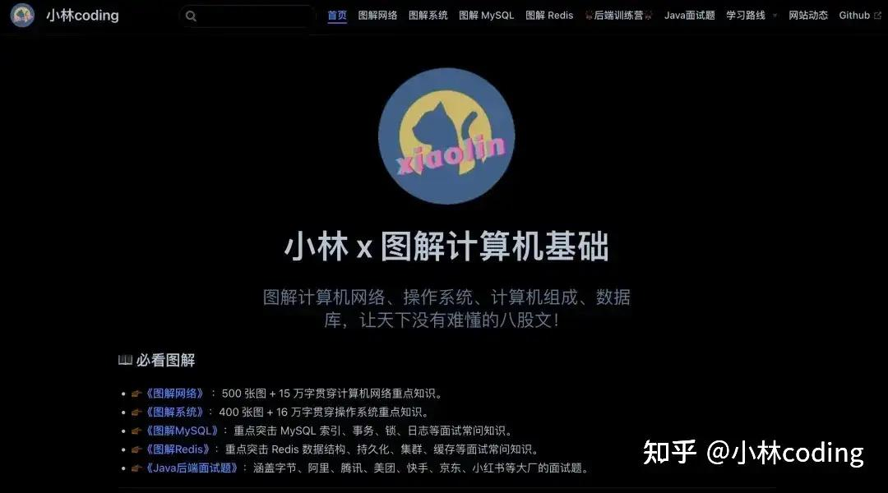
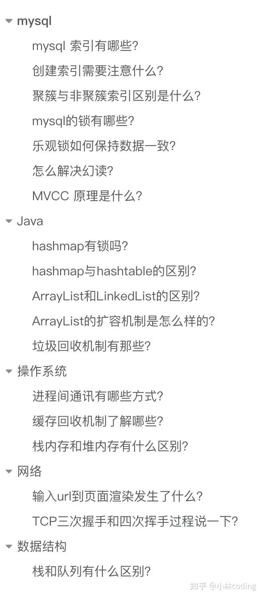
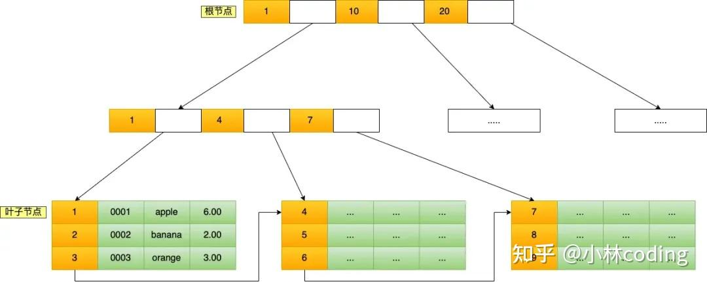
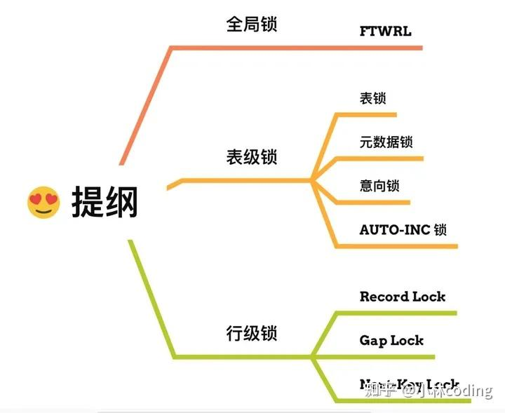
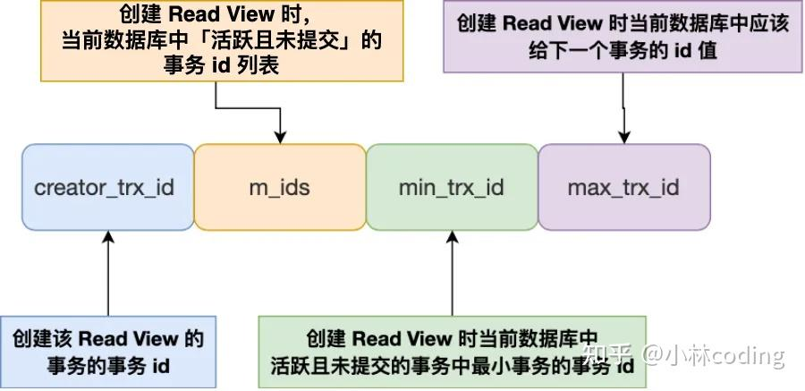
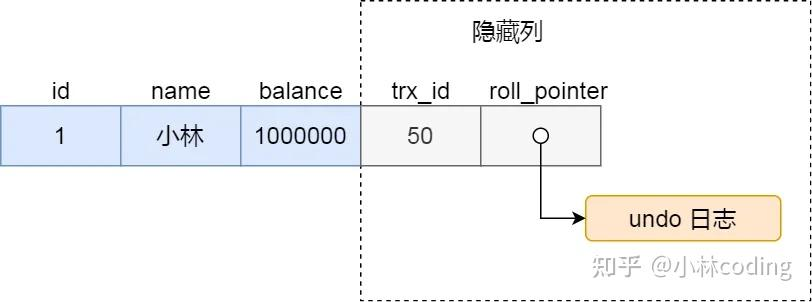
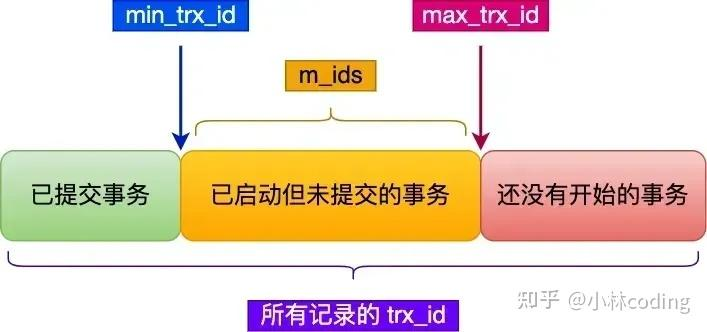
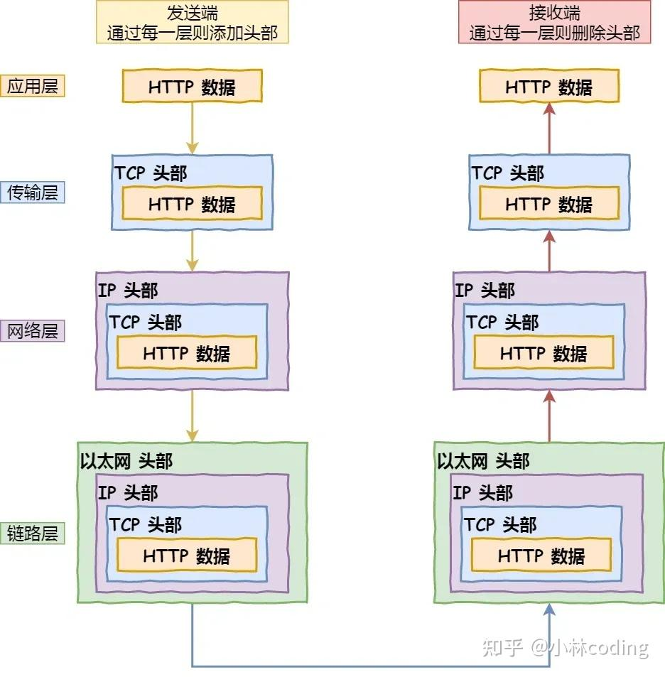
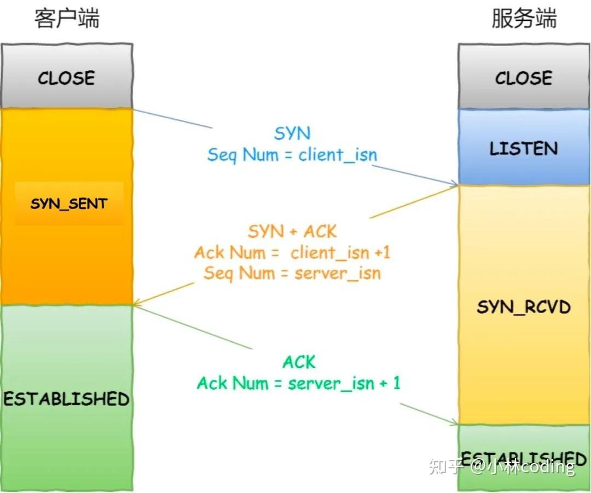
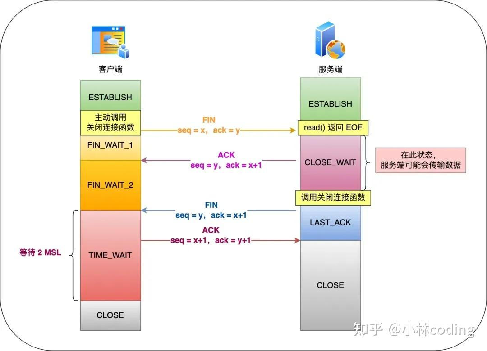

> [《Java后端面试题》](https://link.zhihu.com/?target=https%3A//xiaolincoding.com/interview/)：20万字超全Java 面试题，涵盖字节、阿里、腾讯、美团、快手、京东、小红书等大厂的面试题，地址：[Java面试题介绍](https://link.zhihu.com/?target=https%3A//xiaolincoding.com/interview/)

大家好，我是小林。

之前发生过一个有意思的事情，去年有校招同学拿到了虾皮（Shopee） 30k+ 的 offer，刚毕业拿到这种薪资水平，妥妥羡慕了，肯定很多人都会毫不犹豫接了。

可惜，实际并不是这样的，有不少同学觉得开的太高了，导致都不敢去，总怕去了之后，很快被毁约，大部分最后选择了低个 2-4k 的其他大厂 offer，所以现在校招生选择 offer 的时候，也不会光只看薪资，还会考虑 offer 的稳定性。

虾皮上个月就开展秋招了，也看到有一些同学已经在面试了，这次我们就来看看**Shopee校招后端开发面经**。

同学反馈，这次的 Shopee 面试官很温柔，整体面试感受没什么压迫感，虽然整体不难，但是自己刚学后端不久，有些知识准备不够充分，回答的不是很好。

主要考察了 mysql、java、操作系统、网络、数据结构这些方面的内容，面试时长 35 分钟，都是不算太难的八股，大家觉得呢？

  



考察的知识点，我帮大家罗列一下：

-   mysql：索引、事务、锁、mvcc
-   java：hashmap、集合、jvm
-   操作系统：进程间通信、缓存回收、堆与栈
-   网络；键入网址、tcp 三次和四次挥手
-   数据结构：栈和队列

## **mysql**

### **mysql 索引有哪些？**

MySQL可以按照四个角度来分类索引。

-   按「数据结构」分类：**B+tree索引、Hash索引、Full-text索引**。
-   按「物理存储」分类：**聚簇索引（主键索引）、二级索引（辅助索引）**。
-   按「字段特性」分类：**主键索引、唯一索引、普通索引、前缀索引**。
-   按「字段个数」分类：**单列索引、联合索引**。

从数据结构的角度来看，MySQL 常见索引有 B+Tree 索引、HASH 索引、Full-Text 索引，每一种存储引擎支持的索引类型不一定相同，我在表中总结了 MySQL 常见的存储引擎 InnoDB、MyISAM 和 Memory 分别支持的索引类型。

  


InnoDB 是在 MySQL 5.5 之后成为默认的 MySQL 存储引擎，B+Tree 索引类型也是 MySQL 存储引擎采用最多的索引类型。

B+Tree 是一种多叉树，叶子节点才存放数据，非叶子节点只存放索引，而且每个节点里的数据是**按主键顺序存放**的。每一层父节点的索引值都会出现在下层子节点的索引值中，因此在叶子节点中，包括了所有的索引值信息，并且每一个叶子节点都有两个指针，分别指向下一个叶子节点和上一个叶子节点，形成一个双向链表。主键索引的 B+Tree 如图所示：



  

索引分为聚簇索引（主键索引）、二级索引（辅助索引）。它们的主要区别如下：

-   主键索引的 B+Tree 的叶子节点存放的是实际数据，所有完整的用户记录都存放在主键索引的 B+Tree 的叶子节点里；
-   二级索引的 B+Tree 的叶子节点存放的是主键值，而不是实际数据。

所以，在查询时使用了二级索引，如果查询的数据能在二级索引里查询的到，那么就不需要回表，这个过程就是覆盖索引。

**如果查询的数据不在二级索引里，就会先检索二级索引，找到对应的叶子节点，获取到主键值后，然后再检索主键索引，就能查询到数据了，这个过程就是回表**。

### **创建索引需要注意什么？**

> 什么时候适用索引？

-   字段有唯一性限制的，比如商品编码；
-   经常用于 `WHERE` 查询条件的字段，这样能够提高整个表的查询速度，如果查询条件不是一个字段，可以建立联合索引。
-   经常用于 `GROUP BY` 和 `ORDER BY` 的字段，这样在查询的时候就不需要再去做一次排序了，因为我们都已经知道了建立索引之后在 B+Tree 中的记录都是排序好的。

> 什么时候不需要创建索引？

-   `WHERE` 条件，`GROUP BY`，`ORDER BY` 里用不到的字段，索引的价值是快速定位，如果起不到定位的字段通常是不需要创建索引的，因为索引是会占用物理空间的。
-   字段中存在大量重复数据，不需要创建索引，比如性别字段，只有男女，如果数据库表中，男女的记录分布均匀，那么无论搜索哪个值都可能得到一半的数据。在这些情况下，还不如不要索引，因为 MySQL 还有一个查询优化器，查询优化器发现某个值出现在表的数据行中的百分比很高的时候，它一般会忽略索引，进行全表扫描。
-   表数据太少的时候，不需要创建索引；
-   经常更新的字段不用创建索引，比如不要对电商项目的用户余额建立索引，因为索引字段频繁修改，由于会带来索引结构的变动，会影响写入性能。

### **聚簇与非聚簇索引区别是什么？**

-   **数据存储**：在聚簇索引中，数据行按照索引键值的顺序存储，也就是说，索引的叶子节点包含了实际的数据行。这意味着索引结构本身就是数据的物理存储结构。非聚簇索引的叶子节点不包含完整的数据行，而是包含指向数据行的指针或主键值。数据行本身存储在聚簇索引中。
-   **索引与数据关系**：由于数据与索引紧密相连，当通过聚簇索引查找数据时，可以直接从索引中获得数据行，而不需要额外的步骤去查找数据所在的位置。当通过非聚簇索引查找数据时，首先在非聚簇索引中找到对应的主键值，然后通过这个主键值回溯到聚簇索引中查找实际的数据行，这个过程称为“回表”。
-   **唯一性**：聚簇索引通常是基于主键构建的，因此每个表只能有一个聚簇索引，因为数据只能有一种物理排序方式。一个表可以有多个非聚簇索引，因为它们不直接影响数据的物理存储位置。
-   **效率**：对于范围查询和排序查询，聚簇索引通常更有效率，因为它避免了额外的寻址开销。非聚簇索引在使用覆盖索引进行查询时效率更高，因为它不需要读取完整的数据行。但是需要进行回表的操作，使用非聚簇索引效率比较低，因为需要进行额外的回表操作。

### **mysql的锁有哪些？**

在 MySQL 里，根据加锁的范围，可以分为**全局锁、表级锁和行锁**三类。



  

-   **全局锁**：通过flush tables with read lock 语句会将整个数据库就处于只读状态了，这时其他线程执行以下操作，增删改或者表结构修改都会阻塞。全局锁主要应用于做**全库逻辑备份**，这样在备份数据库期间，不会因为数据或表结构的更新，而出现备份文件的数据与预期的不一样。
-   **表级锁**：MySQL 里面表级别的锁有这几种：

-   表锁：通过lock tables 语句可以对表加表锁，表锁除了会限制别的线程的读写外，也会限制本线程接下来的读写操作。
-   元数据锁：当我们对数据库表进行操作时，会自动给这个表加上 MDL，对一张表进行 CRUD 操作时，加的是 **MDL 读锁**；对一张表做结构变更操作的时候，加的是 **MDL 写锁**；MDL 是为了保证当用户对表执行 CRUD 操作时，防止其他线程对这个表结构做了变更。
-   意向锁：当执行插入、更新、删除操作，需要先对表加上「意向独占锁」，然后对该记录加独占锁。**意向锁的目的是为了快速判断表里是否有记录被加锁**。

-   **行级锁**：InnoDB 引擎是支持行级锁的，而 MyISAM 引擎并不支持行级锁。
-   记录锁，锁住的是一条记录。而且记录锁是有 S 锁和 X 锁之分的，满足读写互斥，写写互斥
-   间隙锁，只存在于可重复读隔离级别，目的是为了解决可重复读隔离级别下幻读的现象。
-   Next-Key Lock 称为临键锁，是 Record Lock + Gap Lock 的组合，锁定一个范围，并且锁定记录本身。

### **乐观锁如何保持数据一致？**

乐观锁的基本思想是：在更新数据时，先不加锁，而是在提交时检查数据是否被其他事务修改过。

下面是实现乐观锁的常用方法：

在表中增加一个版本号字段，每次更新时检查版本号并递增：

-   **表结构设计**：

```text
CREATE TABLE example (
    id INT PRIMARY KEY,
    data VARCHAR(255),
    version INT DEFAULT 0
);
```

-   **操作步骤**：

1.  读取数据时也读取当前版本号。

```text
SELECT data, version FROM example WHERE id = 1;

2. 在更新时使用 `WHERE` 子句检查版本号是否一致，并递增版本号。

UPDATE example
SET data = 'new data', version = version + 1
WHERE id = 1 AND version = current_version;

3. 检查更新行数，如果为 0，表示数据已被其他事务修改。
```

### **怎么解决幻读？**

幻读（Phantom Read）是指在一个事务中，当一次查询后再次执行相同的查询时，发现结果集发生了变化，新增的行影响了查询结果。

这种情况通常在并发事务中发生，可以通过不同的隔离级别和锁机制来解决。

-   **可串行化（SERIALIZABLE）：**这是最高的事务隔离级别，它通过强制事务串行执行，完全避免了幻读。当一个事务在执行时，其他事务必须等待它完成。
-   在 InnoDB 中，**可重复读隔离级别**可以通过行级锁和多版本并发控制（MVCC）来一定程度上避免幻读，但在某些情况下仍然可能遇到，如果要彻底解决，**尽量在开启事务之后，马上执行 select ... for update 这类锁定读的语句**，因为它会对记录加 next-key lock，从而避免其他事务插入一条新记录，就避免了幻读的问题。

### **MVCC 原理是什么？**

MVCC允许多个事务同时读取同一行数据，而不会彼此阻塞，每个事务看到的数据版本是该事务开始时的数据版本。

这意味着，如果其他事务在此期间修改了数据，正在运行的事务仍然看到的是它开始时的数据状态，从而实现了非阻塞读操作。

对于「读提交」和「可重复读」隔离级别的事务来说，它们是通过 Read View 来实现的，它们的区别在于创建 Read View 的时机不同，大家可以把 Read View 理解成一个数据快照，就像相机拍照那样，定格某一时刻的风景。

-   「读提交」隔离级别是在「每个select语句执行前」都会重新生成一个 Read View；
-   「可重复读」隔离级别是执行第一条select时，生成一个 Read View，然后整个事务期间都在用这个 Read View。

Read View 有四个重要的字段：



  

-   m\_ids ：指的是在创建 Read View 时，当前数据库中「活跃事务」的**事务 id 列表**，注意是一个列表，**“活跃事务”指的就是，启动了但还没提交的事务**。
-   min\_trx\_id ：指的是在创建 Read View 时，当前数据库中「活跃事务」中事务 **id 最小的事务**，也就是 m\_ids 的最小值。
-   max\_trx\_id ：这个并不是 m\_ids 的最大值，而是**创建 Read View 时当前数据库中应该给下一个事务的 id 值**，也就是全局事务中最大的事务 id 值 + 1；
-   creator\_trx\_id ：指的是**创建该 Read View 的事务的事务 id**。

对于使用 InnoDB 存储引擎的数据库表，它的聚簇索引记录中都包含下面两个隐藏列：



  

-   trx\_id，当一个事务对某条聚簇索引记录进行改动时，就会**把该事务的事务 id 记录在 trx\_id 隐藏列里**；
-   roll\_pointer，每次对某条聚簇索引记录进行改动时，都会把旧版本的记录写入到 undo 日志中，然后**这个隐藏列是个指针，指向每一个旧版本记录**，于是就可以通过它找到修改前的记录。

在创建 Read View 后，我们可以将记录中的 trx\_id 划分这三种情况：



一个事务去访问记录的时候，除了自己的更新记录总是可见之外，还有这几种情况：

-   如果记录的 trx\_id 值小于 Read View 中的 min\_trx\_id 值，表示这个版本的记录是在创建 Read View **前**已经提交的事务生成的，所以该版本的记录对当前事务**可见**。
-   如果记录的 trx\_id 值大于等于 Read View 中的 max\_trx\_id 值，表示这个版本的记录是在创建 Read View **后**才启动的事务生成的，所以该版本的记录对当前事务**不可见**。
-   如果记录的 trx\_id 值在 Read View 的 min\_trx\_id 和 max\_trx\_id 之间，需要判断 trx\_id 是否在 m\_ids 列表中：
-   如果记录的 trx\_id **在** m\_ids 列表中，表示生成该版本记录的活跃事务依然活跃着（还没提交事务），所以该版本的记录对当前事务**不可见**。
-   如果记录的 trx\_id **不在** m\_ids列表中，表示生成该版本记录的活跃事务已经被提交，所以该版本的记录对当前事务**可见**。

**这种通过「版本链」来控制并发事务访问同一个记录时的行为就叫 MVCC（多版本并发控制）。**

## **Java**

### **hashmap有锁吗？**

没有锁，hashmap不是并发安全的，hashmap在多线程会存在下面的问题：

-   JDK 1.7 HashMap 采用数组 + 链表的数据结构，多线程背景下，在数组扩容的时候，存在 Entry 链死循环和数据丢失问题。
-   JDK 1.8 HashMap 采用数组 + 链表 + 红黑二叉树的数据结构，优化了 1.7 中数组扩容的方案，解决了 Entry 链死循环和数据丢失问题。但是多线程背景下，put 方法存在数据覆盖的问题。

如果要保证线程安全，可以通过这些方法来保证：

-   多线程环境可以使用Collections.synchronizedMap同步加锁的方式，还可以使用HashTable，但是同步的方式显然性能不达标，而ConurrentHashMap更适合高并发场景使用。
-   ConcurrentHashmap在JDK1.7和1.8的版本改动比较大，1.7使用Segment+HashEntry分段锁的方式实现，1.8则抛弃了Segment，改为使用CAS+synchronized+Node实现，同样也加入了红黑树，避免链表过长导致性能的问题。

### **hashmap与hashtable的区别？**

-   **HashMap线程不安全**，效率高一点，可以存储null的key和value，null的key只能有一个，null的value可以有多个。默认初始容量为16，每次扩充变为原来2倍。创建时如果给定了初始容量，则扩充为2的幂次方大小。底层数据结构为数组+链表，插入元素后如果链表长度大于阈值（默认为8），先判断数组长度是否小于64，如果小于，则扩充数组，反之将链表转化为红黑树，以减少搜索时间。
-   **HashTable线程安全**，效率低一点，其内部方法基本都经过synchronized修饰，不可以有null的key和value。默认初始容量为11，每次扩容变为原来的2n+1。创建时给定了初始容量，会直接用给定的大小。底层数据结构为数组+链表。它基本被淘汰了，要保证线程安全可以用ConcurrentHashMap。

### **ArrayList和LinkedList的区别？**

ArrayList和LinkedList都是Java中常见的集合类，它们都实现了List接口。

-   **底层数据结构不同**：ArrayList使用数组实现，通过索引进行快速访问元素。LinkedList使用链表实现，通过节点之间的指针进行元素的访问和操作。
-   **插入和删除操作的效率不同**：ArrayList在尾部的插入和删除操作效率较高，但在中间或开头的插入和删除操作效率较低，需要移动元素。LinkedList在任意位置的插入和删除操作效率都比较高，因为只需要调整节点之间的指针。
-   **随机访问的效率不同**：ArrayList支持通过索引进行快速随机访问，时间复杂度为O(1)。LinkedList需要从头或尾开始遍历链表，时间复杂度为O(n)。
-   **空间占用**：ArrayList在创建时需要分配一段连续的内存空间，因此会占用较大的空间。LinkedList每个节点只需要存储元素和指针，因此相对较小。
-   **使用场景**：ArrayList适用于频繁随机访问和尾部的插入删除操作，而LinkedList适用于频繁的中间插入删除操作和不需要随机访问的场景。
-   **线程安全**：这两个集合都不是线程安全的，Vector是线程安全的

### **ArrayList的扩容机制是怎么样的？**

ArrayList在添加元素时，如果当前元素个数已经达到了内部数组的容量上限，就会触发扩容操作。ArrayList的扩容操作主要包括以下几个步骤：

-   计算新的容量：一般情况下，新的容量会扩大为原容量的1.5倍（在JDK 10之后，扩容策略做了调整），然后检查是否超过了最大容量限制。
-   创建新的数组：根据计算得到的新容量，创建一个新的更大的数组。
-   将元素复制：将原来数组中的元素逐个复制到新数组中。
-   更新引用：将ArrayList内部指向原数组的引用指向新数组。
-   完成扩容：扩容完成后，可以继续添加新元素。

ArrayList的扩容操作涉及到数组的复制和内存的重新分配，所以在频繁添加大量元素时，扩容操作可能会影响性能。为了减少扩容带来的性能损耗，可以在初始化ArrayList时预分配足够大的容量，避免频繁触发扩容操作。之所以扩容是 1.5 倍，是因为 1.5 可以充分利用移位操作，减少浮点数或者运算时间和运算次数。

```text
// 新容量计算
int newCapacity = oldCapacity + (oldCapacity >> 1);
```

### **垃圾回收机制有那些？**

-   **标记-清除算法**：标记-清除算法分为“标记”和“清除”两个阶段，首先通过可达性分析，标记出所有需要回收的对象，然后统一回收所有被标记的对象。标记-清除算法有两个缺陷，一个是效率问题，标记和清除的过程效率都不高，另外一个就是，清除结束后会造成大量的碎片空间。有可能会造成在申请大块内存的时候因为没有足够的连续空间导致再次 GC。
-   **复制算法**：为了解决碎片空间的问题，出现了“复制算法”。复制算法的原理是，将内存分成两块，每次申请内存时都使用其中的一块，当内存不够时，将这一块内存中所有存活的复制到另一块上。然后将然后再把已使用的内存整个清理掉。复制算法解决了空间碎片的问题。但是也带来了新的问题。因为每次在申请内存时，都只能使用一半的内存空间。内存利用率严重不足。
-   **标记-整理算法**：复制算法在 GC 之后存活对象较少的情况下效率比较高，但如果存活对象比较多时，会执行较多的复制操作，效率就会下降。而老年代的对象在 GC 之后的存活率就比较高，所以就有人提出了“标记-整理算法”。标记-整理算法的“标记”过程与“标记-清除算法”的标记过程一致，但标记之后不会直接清理。而是将所有存活对象都移动到内存的一端。移动结束后直接清理掉剩余部分。
-   **分代回收算法**：分代收集是将内存划分成了新生代和老年代。分配的依据是对象的生存周期，或者说经历过的 GC 次数。对象创建时，一般在新生代申请内存，当经历一次 GC 之后如果对还存活，那么对象的年龄 +1。当年龄超过一定值(默认是 15，可以通过参数 -XX:MaxTenuringThreshold 来设定)后，如果对象还存活，那么该对象会进入老年代。

## **操作系统**

### **进程间通讯有哪些方式？**

Linux 内核提供了不少进程间通信的方式：

-   管道：管道是一种单向的通信机制，允许一个进程的输出作为另一个进程的输入。管道分为「匿名管道」和「命名管道」。

-   **匿名管道**顾名思义，它没有名字标识，匿名管道是特殊文件只存在于内存，没有存在于文件系统中，shell 命令中的「|」竖线就是匿名管道，通信的数据是**无格式的流并且大小受限**，通信的方式是**单向**的，数据只能在一个方向上流动，如果要双向通信，需要创建两个管道，再来**匿名管道是只能用于存在父子关系的进程间通信**，匿名管道的生命周期随着进程创建而建立，随着进程终止而消失。
-   **命名管道**突破了匿名管道只能在亲缘关系进程间的通信限制，因为使用命名管道的前提，需要在文件系统创建一个类型为 p 的设备文件，那么毫无关系的进程就可以通过这个设备文件进行通信。另外，不管是匿名管道还是命名管道，进程写入的数据都是**缓存在内核**中，另一个进程读取数据时候自然也是从内核中获取，同时通信数据都遵循**先进先出**原则，不支持 lseek 之类的文件定位操作。

-   消息队列：**消息队列**克服了管道通信的数据是无格式的字节流的问题，消息队列实际上是保存在内核的「消息链表」，消息队列的消息体是可以用户自定义的数据类型，发送数据时，会被分成一个一个独立的消息体，当然接收数据时，也要与发送方发送的消息体的数据类型保持一致，这样才能保证读取的数据是正确的。消息队列通信的速度不是最及时的，毕竟**每次数据的写入和读取都需要经过用户态与内核态之间的拷贝过程。**
-   共享内存：**共享内存**可以解决消息队列通信中用户态与内核态之间数据拷贝过程带来的开销，**它直接分配一个共享空间，每个进程都可以直接访问**，就像访问进程自己的空间一样快捷方便，不需要陷入内核态或者系统调用，大大提高了通信的速度，享有**最快**的进程间通信方式之名。但是便捷高效的共享内存通信，**带来新的问题，多进程竞争同个共享资源会造成数据的错乱。**
-   信号：与信号量名字很相似的叫**信号**，它俩名字虽然相似，但功能一点儿都不一样。信号是**异步通信机制**，信号可以在应用进程和内核之间直接交互，内核也可以利用信号来通知用户空间的进程发生了哪些系统事件，信号事件的来源主要有硬件来源（如键盘 Cltr+C ）和软件来源（如 kill 命令），一旦有信号发生，**进程有三种方式响应信号 1. 执行默认操作、2. 捕捉信号、3. 忽略信号**。有两个信号是应用进程无法捕捉和忽略的，即 SIGKILL 和 SIGSTOP，这是为了方便我们能在任何时候结束或停止某个进程。
-   信号量：**信号量不仅可以实现访问的互斥性，还可以实现进程间的同步**，信号量其实是一个计数器，表示的是资源个数，其值可以通过两个原子操作来控制，分别是 **P 操作和 V 操作**。
-   socket：前面说到的通信机制，都是工作于同一台主机，如果**要与不同主机的进程间通信，那么就需要 Socket 通信了**。Socket 实际上不仅用于不同的主机进程间通信，还可以用于本地主机进程间通信，可根据创建 Socket 的类型不同，分为三种常见的通信方式，一个是基于 TCP 协议的通信方式，一个是基于 UDP 协议的通信方式，一个是本地进程间通信方式。

### **缓存回收机制了解哪些？**

-   **LRU：**最近最少使用算法，当缓存满时，会回收那些在最近一段时间内最少被访问的缓存项。这是一种广泛使用的回收策略，能有效利用缓存空间。
-   **LFU：**最近最少使用频率算法，回收使用频率最低的缓存项。与LRU不同的是，LFU是根据访问次数来决定哪些数据被回收。

### **栈内存和堆内存有什么区别？**

-   **分配方式**：堆是动态分配内存，由程序员手动申请和释放内存，通常用于存储动态数据结构和对象。栈是静态分配内存，由编译器自动分配和释放内存，用于存储函数的局部变量和函数调用信息。
-   **内存管理**：堆需要程序员手动管理内存的分配和释放，如果管理不当可能会导致内存泄漏或内存溢出。栈由编译器自动管理内存，遵循后进先出的原则，变量的生命周期由其作用域决定，函数调用时分配内存，函数返回时释放内存。
-   **大小和速度**：堆通常比栈大，内存空间较大，动态分配和释放内存需要时间开销。栈大小有限，通常比较小，内存分配和释放速度较快，因为是编译器自动管理。

## **网络**

### **输入url到页面渲染发生了什么？**



-   解析URL：分析 URL 所需要使用的传输协议和请求的资源路径。如果输入的 URL 中的协议或者主机名不合法，将会把地址栏中输入的内容传递给搜索引擎。如果没有问题，浏览器会检查 URL 中是否出现了非法字符，则对非法字符进行转义后在进行下一过程。
-   缓存判断：浏览器会判断所请求的资源是否在缓存里，如果请求的资源在缓存里且没有失效，那么就直接使用，否则向服务器发起新的请求。
-   DNS解析：如果资源不在本地缓存，首先需要进行DNS解析。浏览器会向本地DNS服务器发送域名解析请求，本地DNS服务器会逐级查询，最终找到对应的IP地址。
-   获取MAC地址：当浏览器得到 IP 地址后，数据传输还需要知道目的主机 MAC 地址，因为应用层下发数据给传输层，TCP 协议会指定源端口号和目的端口号，然后下发给网络层。网络层会将本机地址作为源地址，获取的 IP 地址作为目的地址。然后将下发给数据链路层，数据链路层的发送需要加入通信双方的 MAC 地址，本机的 MAC 地址作为源 MAC 地址，目的 MAC 地址需要分情况处理。通过将 IP 地址与本机的子网掩码相结合，可以判断是否与请求主机在同一个子网里，如果在同一个子网里，可以使用 APR 协议获取到目的主机的 MAC 地址，如果不在一个子网里，那么请求应该转发给网关，由它代为转发，此时同样可以通过 ARP 协议来获取网关的 MAC 地址，此时目的主机的 MAC 地址应该为网关的地址。
-   建立TCP连接：主机将使用目标 IP地址和目标MAC地址发送一个TCP SYN包，请求建立一个TCP连接，然后交给路由器转发，等路由器转到目标服务器后，服务器回复一个SYN-ACK包，确认连接请求。然后，主机发送一个ACK包，确认已收到服务器的确认，然后 TCP 连接建立完成。
-   HTTPS 的 TLS 四次握手：如果使用的是 HTTPS 协议，在通信前还存在 TLS 的四次握手。
-   发送HTTP请求：连接建立后，浏览器会向服务器发送HTTP请求。请求中包含了用户需要获取的资源的信息，例如网页的URL、请求方法（GET、POST等）等。
-   服务器处理请求并返回响应：服务器收到请求后，会根据请求的内容进行相应的处理。例如，如果是请求网页，服务器会读取相应的网页文件，并生成HTTP响应。

### **TCP三次握手和四次挥手过程说一下？**

> TCP 三次握手过程



-   一开始，客户端和服务端都处于 CLOSE 状态。先是服务端主动监听某个端口，处于 LISTEN 状态
-   客户端会随机初始化序号（client\_isn），将此序号置于 TCP 首部的「序号」字段中，同时把 SYN 标志位置为 1，表示 SYN 报文。接着把第一个 SYN 报文发送给服务端，表示向服务端发起连接，该报文不包含应用层数据，之后客户端处于 SYN-SENT 状态。
-   服务端收到客户端的 SYN 报文后，首先服务端也随机初始化自己的序号（server\_isn），将此序号填入 TCP 首部的「序号」字段中，其次把 TCP 首部的「确认应答号」字段填入 client\_isn + 1, 接着把 SYN 和 ACK 标志位置为 1。最后把该报文发给客户端，该报文也不包含应用层数据，之后服务端处于 SYN-RCVD 状态。
-   客户端收到服务端报文后，还要向服务端回应最后一个应答报文，首先该应答报文 TCP 首部 ACK 标志位置为 1 ，其次「确认应答号」字段填入 server\_isn + 1 ，最后把报文发送给服务端，这次报文可以携带客户到服务端的数据，之后客户端处于 ESTABLISHED 状态。
-   服务端收到客户端的应答报文后，也进入 ESTABLISHED 状态。

> TCP 四次挥手过程

  



具体过程：

-   客户端主动调用关闭连接的函数，于是就会发送 FIN 报文，这个 FIN 报文代表客户端不会再发送数据了，进入 FIN\_WAIT\_1 状态；
-   服务端收到了 FIN 报文，然后马上回复一个 ACK 确认报文，此时服务端进入 CLOSE\_WAIT 状态。在收到 FIN 报文的时候，TCP 协议栈会为 FIN 包插入一个文件结束符 EOF 到接收缓冲区中，服务端应用程序可以通过 read 调用来感知这个 FIN 包，这个 EOF 会被**放在已排队等候的其他已接收的数据之后**，所以必须要得继续 read 接收缓冲区已接收的数据；
-   接着，当服务端在 read 数据的时候，最后自然就会读到 EOF，接着 **read() 就会返回 0，这时服务端应用程序如果有数据要发送的话，就发完数据后才调用关闭连接的函数，如果服务端应用程序没有数据要发送的话，可以直接调用关闭连接的函数**，这时服务端就会发一个 FIN 包，这个 FIN 报文代表服务端不会再发送数据了，之后处于 LAST\_ACK 状态；
-   客户端接收到服务端的 FIN 包，并发送 ACK 确认包给服务端，此时客户端将进入 TIME\_WAIT 状态；
-   服务端收到 ACK 确认包后，就进入了最后的 CLOSE 状态；
-   客户端经过 2MSL 时间之后，也进入 CLOSE 状态；

## **数据结构**

### **栈和队列有什么区别？**

-   **栈：**是一种后进先出（LIFO, Last In First Out）的数据结构。即最后插入的元素最先被移除，可以想象成一叠盘子，拿出最上面的盘子。
-   **队列**：是一种先进先出（FIFO, First In First Out）的数据结构。即最早插入的元素最先被移除，可以想象成排队的人，第一个到达的人最先离开队列。