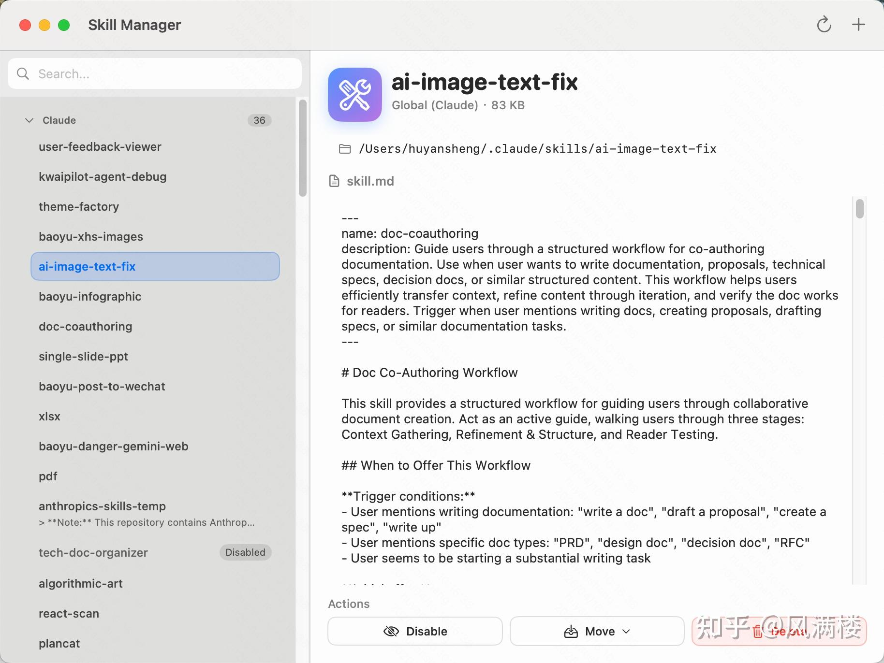
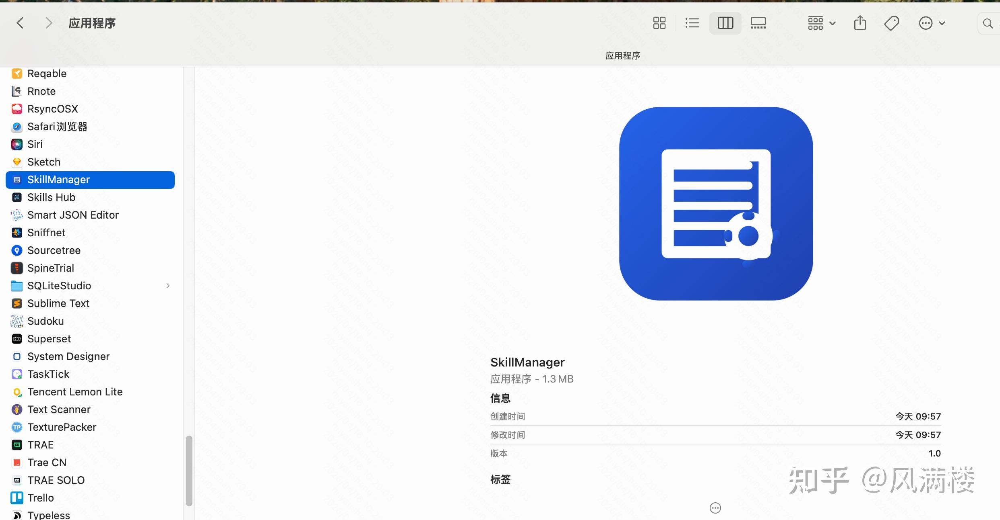
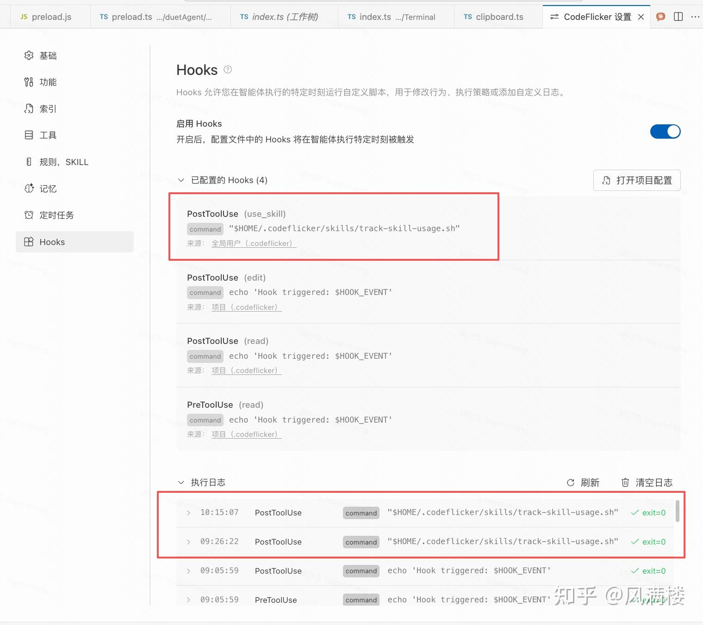
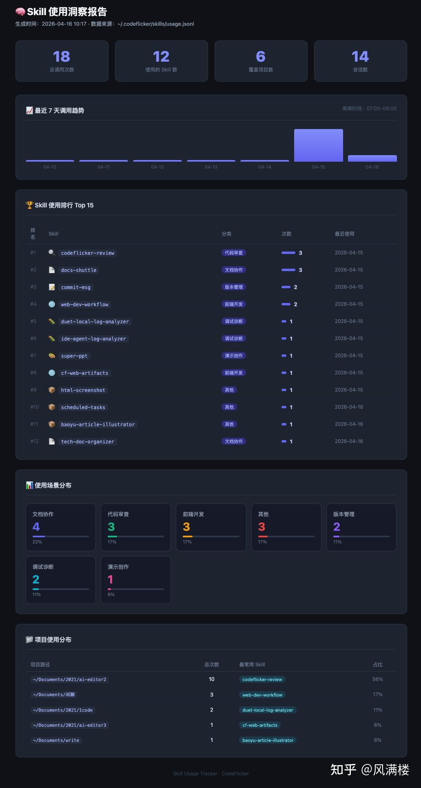

## 最近我让 AI 扫描了本机 Skill，已经超过 100 条。问题不在数量本身，而在于这会持续占用上下文预算并稀释模型注意力。

按主流 Agent / Claude Skills 的渐进式披露估算：

-   单个 Skill 元数据约 40–100 token
-   100 个 Skill 默认加载约 4K–10K token

在 200K 上下文窗口里，这已经是可感知的前置成本。**所以 Skill 管理不是收纳问题，而是上下文工程与执行质量问题。**

  

## **我的治理思路**

1.  **分层**：全局最小化，项目优先。
2.  **控态**：Skill 可启用、可停用、可迁移。
3.  **度量**：用数据判断 Skill 价值，不靠感觉。

  

因此我使用 CodeFlicker 简单vibe 了两个工具来解决这方面的诉求。

## **两个工具：一个管资产，一个管数据**

我把实践拆成两类工具，组合成闭环。

  



  

## **1）Skill 管理端（资产治理）**

定位：管理全局与项目 Skill 的归属和状态，降低“全局污染”。

### **安装**

  

```text
curl -fsSL https://raw.githubusercontent.com/huyansheng3/skill-manager/main/install.sh | bash && ls -la /Applications/SkillManager.app && open /Applications/SkillManager.app
```

  

  



  

原生macos 实现，体积只有1m多，安装无忧。

### **使用（典型动作）**

-   打开应用后先看全局与项目两层分布
-   把高相关 Skill 下沉到项目级
-   把低频或临时 Skill 停用，不做破坏性删除
-   定期清理冗余 Skill，保持全局层克制
-   不想删除但暂时用不到的skill，可以禁用

一句话：它解决“**该怎么动手治理**”。当然管理也可以让 AI 来帮你操作。

  

## **2）Skill 使用统计与洞察（数据治理）**

定位：记录 use\_skill 行为，回答“哪些 Skill 真有价值”。

### **安装**

  

```text
curl -fsSL https://h3.static.yximgs.com/kcdn/cdn-kcdn112115/skill-usage-tracker/install-skill-tracker-v2.sh | bash
```

  

  



  

打开 CodeFlicker 设置，确认下任意触发skill ，确实这里的日志正常记录即可。

### **使用**

生成洞察报告：

  

```text
python3 ~/.codeflicker/skills/generate-insight-report.py
```

  

  



  

关注三类信息即可：

-   高频 Skill（核心能力）
-   低频 Skill（可下沉/停用候选）
-   项目分布（结构是否健康）

一句话：它解决“**该优先治理谁**”。

  

## **为什么必须两者一起用**

-   只有管理端：你能操作，但不一定知道先动谁。
-   只有统计端：你能看见问题，但不一定高效执行。

正确方式：

1.  用统计找出低效结构；
2.  用管理端执行迁移、停用、收敛；
3.  下个周期再看数据，持续迭代。

这就是 Skill 治理闭环。

  

## **面向未来：我更看重三件事**

1.  **技能包发布机制**：版本、来源、分发、回滚要标准化。
2.  **项目与全局协同管理**：全局稳定、项目灵活、双向可迁移。
3.  **质量把控体系**：看有效性、稳定性、可维护性、可解释性。

Skill 生态还在早期，但治理应该先于规模化。越早建立这套机制，后续扩张成本越低。