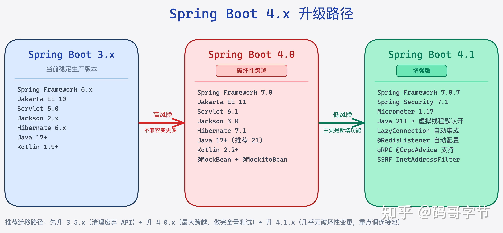
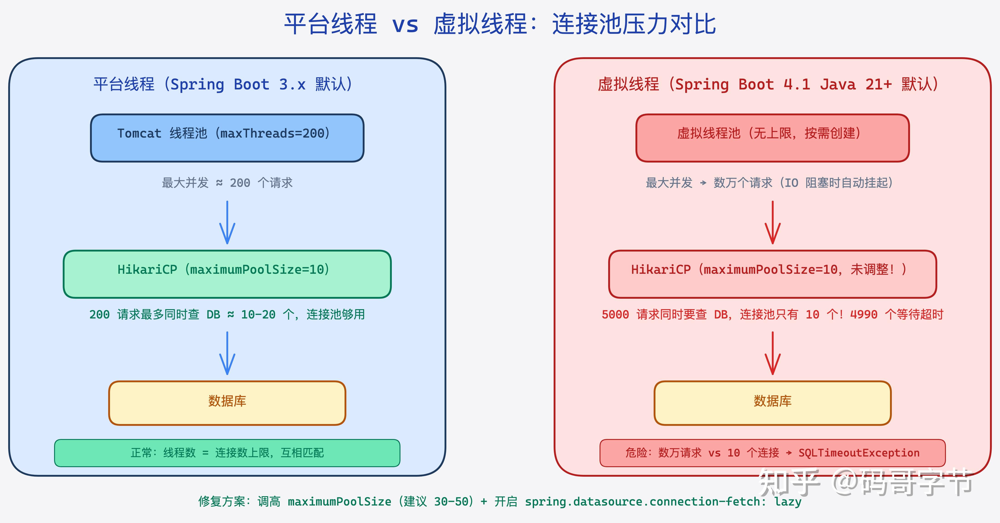
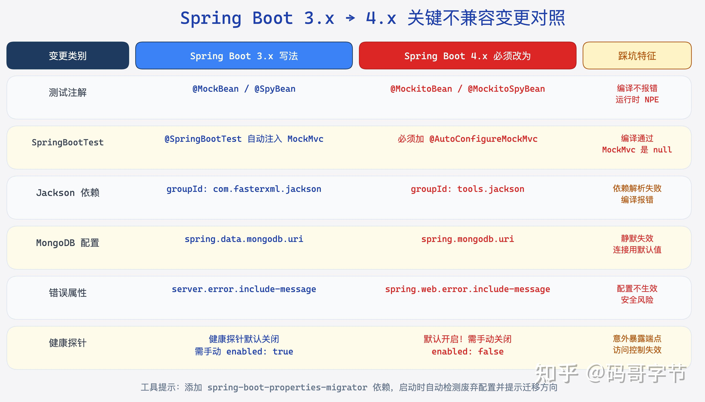

你有没有遇到过这种情况：照着官方 Migration Guide 一步步升级，CI/CD 全绿，Deploy 上线，结果压测第一轮就有几十个请求卡死——监控一看，HikariCP 连接池全满，等待超时。

这不是我编的故事。Spring Boot 4.x 把虚拟线程设为默认以后，这个问题开始在社区里反复出现。原因很反直觉：虚拟线程号称能让你开 **百万级并发**，但它跟传统连接池的设计假设是冲突的。不搞清楚这一点，盲目升级只会把问题从慢查询变成连接池耗尽。

4.1.0-RC1 在 2026 年 4 月 23 日正式发布，包含 113 个改进。如果你在维护 3.x 的生产服务，现在是做技术决策的窗口期。这篇文章的核心问题只有一个：**升不升，升了有什么好处，升坏了怎么办**。

> 一句话摘要：Spring Boot 4.1 最值得升的是虚拟线程 + LazyConnection 双剑合并带来的吞吐量提升，但必须同步调低 HikariCP 的 `maximumPoolSize`，否则适得其反。

### 为什么 4.1 是个重要的升级窗口？

Spring Boot 4.0 是破坏性最强的一次大版本跃迁——它要求 Java 17+、Jakarta EE 11、Spring Framework 7，连 Jackson 都从 `com.fasterxml.jackson` 搬家到 `tools.jackson`。如果你还在 3.x，跨过 4.0 的代价已经很高了。

4.1 不一样。**4.1 是在 4.0 底座上的增强版**，破坏性变更极少，主要是把 4.0 里还需要手动配置的能力变成「默认开启」。这意味着从 4.0 升到 4.1 的成本远低于从 3.x 升到 4.0。

但如果你还在 3.x，现在的问题是：3.5.x 是最后一个 3.x 大版本，进入维护窗口期不会太远。4.1 RC1 的发布意味着稳定版 GA 很快就会到来。**现在做技术预研，总比到时候被迫升级要从容得多。**

Spring Boot 4.x 整个版本线的依赖基线如下，看完你就明白为什么说「跨度很大」：

| 组件 | Spring Boot 3.x | Spring Boot 4.0 | Spring Boot 4.1 |
| ----- | ----- | ----- | ----- |
| Java 最低要求 | Java 17 | Java 17 | Java 17 |
| Spring Framework | 6.x | 7.0 | 7.0+ |
| Jakarta EE | 10（Servlet 5.0） | 11（Servlet 6.1） | 11（Servlet 6.1） |
| Jackson | 2.x | 3.0（组件迁移） | 3.x |
| Hibernate | 6.x | 7.1 | 7.x |
| Kotlin | 1.9+ | 2.2+ | 2.3+ |

**4.0 → 4.1 几乎没有追加破坏性变更**，这是关键。4.1 的主要新增内容：

-   虚拟线程成为 Java 21+ 环境的默认选项
-   `LazyConnectionDataSourceProxy` 自动集成（连接惰性获取）
-   Redis 注解驱动监听器（`@RedisListener`）自动配置
-   HTTP Client SSRF 防护（`InetAddressFilter`）
-   gRPC `@GrpcAdvice` 异常处理支持
-   OpenTelemetry 环境变量读取
-   Spring Framework 7.0.7、Spring Security 7.1.0-RC1、Micrometer 1.17.0-RC1

  



*图：Spring Boot 4.x 版本线依赖基线对比，3.x→4.0 是最大跨越，4.0→4.1 几乎无破坏性变更*

### 虚拟线程默认开启：好处和陷阱

这是 4.1 最重要的改变，也是最容易踩坑的地方，必须单独讲透。

### 什么叫「平台线程」和「虚拟线程」？

传统 Java 线程（平台线程）和操作系统线程是 1:1 绑定的。创建一个线程，OS 就要分配一个内核线程，每个线程默认栈大小 512KB～1MB。一台 8GB 内存的机器，理论上最多能撑几千个线程。

Tomcat 的 `maxThreads` 默认是 200，就是因为超过这个数字，线程上下文切换的开销会比 IO 等待的收益更大。

虚拟线程是 Java 21 引入的 Project Loom 成果。它是 JVM 层面的线程，不和 OS 线程 1:1 绑定。当虚拟线程执行到阻塞操作（IO、数据库查询、`Thread.sleep`）时，JVM 会自动把它「卸载」到载体线程（carrier thread），让载体线程去做别的事，等 IO 完成再重新挂载。整个过程对代码完全透明，你的 `synchronized`、`Thread.currentThread()` 照样能用。

**实际效果**：同样的机器，用虚拟线程可以轻松维持数万个并发「连接」，因为绝大多数线程都在等 IO，不占 CPU。

Spring Boot 4.1 在 Java 21+ 环境下，自动用虚拟线程替换 Tomcat 的工作线程池（相当于配置了 `spring.threads.virtual.enabled=true`）。你不需要改任何代码。

### 陷阱在哪里？

问题出在数据库连接池。

HikariCP 的设计哲学是：**连接数越少越好**。因为数据库端的并发连接本身就是昂贵资源，HikariCP 的 `maximumPoolSize` 默认是 10，官方文档甚至建议单个服务不要超过 20-30。

传统架构下这个设计很合理：你只有 200 个 Tomcat 线程，最多 200 个并发请求，200 个请求也不可能同时在做数据库操作，所以 10-20 个连接够用。

虚拟线程改变了这个前提。

当你用虚拟线程后，Tomcat 可以同时接受 **数万个**请求。假设有 5000 个请求同时到达，全都要查数据库——HikariCP 的连接池只有 10 个！剩下 4990 个请求全部挂起等待连接，等待超时时间到了（默认 30 秒），一波 `SQLTimeoutException` 涌出来。

这就是文章开头那个问题的根源：**虚拟线程让 IO 并发能力提升了 100 倍，但连接池的容量没有跟上**。

修复方案有两个方向，不是二选一，最好同时做：

**方向一：调高 HikariCP 连接数上限**

```text
spring:
  datasource:
    hikari:
      # 虚拟线程环境下，适当提高连接数
      # 但不要无限拉高——数据库端连接是有限的
      maximum-pool-size: 50
      # 连接等待超时适当缩短，快速失败而非长时间堵塞
      connection-timeout: 3000
      # 连接最大生命周期，防止数据库侧超时
      max-lifetime: 1800000
```

**方向二：启用 `LazyConnectionDataSourceProxy`（4.1 新功能）**

Spring Boot 4.1 内置了对 `LazyConnectionDataSourceProxy` 的自动集成，通过配置 `spring.datasource.connection-fetch` 属性启用。惰性连接的意思是：只有当你真正执行 SQL 语句时，才从连接池获取物理连接，而不是在事务开始时就占用一个连接。

```text
spring:
  datasource:
    # Spring Boot 4.1 新增，启用惰性连接获取
    connection-fetch: lazy
```

这个改动看起来小，但效果显著：对于那些开启了事务但不一定会执行数据库操作的代码路径（比如先读缓存，缓存命中就直接返回），可以大幅减少无效的连接占用。

**组合策略**：连接池调到 50，同时开启 lazy connection，加上虚拟线程，实际上你可以用比传统架构少 3⁄4 的连接数服务更多的并发请求。

  



*图：虚拟线程下数万请求 vs HikariCP 默认 10 个连接的根本冲突*

### 有一个更隐蔽的坑：`synchronized` 锁钉死

虚拟线程有一个已知限制：如果虚拟线程在持有 `synchronized` 锁的情况下遇到阻塞，它无法被 JVM 卸载，会直接占用载体线程（pinning）。这意味着那段时间这个载体线程完全被堵死，无法执行其他虚拟线程。

Java 21 里这还是个问题，Java 24 已经修复了 `synchronized` 的 pinning 问题，但如果你在用 Java 21，需要留意：

-   项目里的第三方库如果大量使用 `synchronized`（比如某些老版本 JDBC 驱动），在虚拟线程下表现可能不如预期
-   可以通过 JVM 参数 `-Djdk.tracePinnedThreads=full` 来检测 pinning 发生的位置

### 3.x 升到 4.x：不兼容变更清单

如果你现在在 3.x，计划升到 4.1，必须过一遍这张清单。有些变更没有错误提示，只会在运行时悄悄行为异常。

### 测试框架：`@MockBean` 和 `@SpringBootTest` 行为变了

这是最容易踩的坑，因为它**不会在编译时报错**。

```text
// Spring Boot 3.x：这样写可以
@MockBean
private UserService userService;

// Spring Boot 4.x：必须改成
@MockitoBean
private UserService userService;
```

更严重的是 `@SpringBootTest` 的行为变了。在 3.x 里，`@SpringBootTest` 会自动注入 `MockMvc` 和 `TestRestTemplate`。在 4.x 里，你必须明确加注解：

```text
// 3.x 写法（4.x 里这样写，MockMvc 是 null，但不报错！）
@SpringBootTest
class UserControllerTest {
    @Autowired
    MockMvc mockMvc; // 会是 null，调用时才 NPE
}

// 4.x 必须这样写
@SpringBootTest
@AutoConfigureMockMvc // 必须加这个
class UserControllerTest {
    @Autowired
    MockMvc mockMvc; // 这才有值
}
```

### Jackson：从 2.x 迁到 3.x，组件 ID 变了

如果你在 pom.xml 里直接依赖了 Jackson 模块，4.x 要改 Group ID：

```text
<!-- Spring Boot 3.x -->
<dependency>
    <groupId>com.fasterxml.jackson.core</groupId>
    <artifactId>jackson-databind</artifactId>
</dependency>

<!-- Spring Boot 4.x（Jackson 3.x） -->
<dependency>
    <groupId>tools.jackson.core</groupId>
    <artifactId>jackson-databind</artifactId>
</dependency>
```

Spring Boot 4.0 的 starter 已经帮你引入了正确版本，但如果你有直接依赖，要手动改。另外 Jackson 的注解名也有变化，`@JsonComponent` 改为 `@JacksonComponent`。

### MongoDB 配置命名空间调整

```text
# Spring Boot 3.x
spring:
  data:
    mongodb:
      uri: mongodb://localhost:27017/mydb

# Spring Boot 4.x
spring:
  mongodb:
    uri: mongodb://localhost:27017/mydb
```

只有 Spring Data MongoDB 专属的配置还在 `spring.data.mongodb.*` 下，连接相关的基础配置全部搬到 `spring.mongodb.*`。

### 健康探针：默认开启了

```text
# Spring Boot 3.x：默认关闭，需要手动开
management:
  endpoint:
    health:
      probes:
        enabled: true

# Spring Boot 4.x：默认已开启
# 如果你不想要，反而需要手动关：
management:
  endpoint:
    health:
      probes:
        enabled: false
```

如果你的 Kubernetes Pod 没有配 livenessProbe 和 readinessProbe，升级后 Spring Boot 会自动暴露 `/actuator/health/liveness` 和 `/actuator/health/readiness`。这通常是好事，但如果你的基础设施有严格的 Actuator 访问控制，要提前确认权限策略。

### `server.error.*` 属性迁移

```text
# Spring Boot 3.x
server:
  error:
    include-message: always
    include-stacktrace: never

# Spring Boot 4.x
spring:
  web:
    error:
      include-message: always
      include-stacktrace: never
```

官方提供了 `spring-boot-properties-migrator` 工具，加到 pom.xml 里可以在运行时自动识别废弃配置并给出迁移提示：

```text
<dependency>
    <groupId>org.springframework.boot</groupId>
    <artifactId>spring-boot-properties-migrator</artifactId>
    <scope>runtime</scope>
</dependency>
```

记得迁移完成后要把这个依赖删掉，别带上生产。

  



*图：6 类关键不兼容变更速查，红色标注最容易踩坑的静默失效场景*

### AOT 编译和 GraalVM 原生镜像：进展如何？

这块功能对大多数业务团队来说还比较遥远，但有几个进展值得记录。

Spring Boot 4.x 系列在 AOT（Ahead-Of-Time）编译上持续投入。AOT 的核心价值是：在编译阶段把 Spring 的 Bean 注册、条件判断、依赖注入等运行时逻辑预先生成为静态代码，这样用 GraalVM 编译成原生镜像后，启动速度可以从秒级降到毫秒级，内存占用也能减少 50-80%。

4.1 对 GraalVM 的要求是 native-image v25+（Spring Boot 4.0 就开始要求这个了）。

**适合使用原生镜像的场景：**

-   Serverless / FaaS 函数（冷启动时间是核心指标）
-   边缘计算节点（内存限制严格）
-   CLI 工具（需要快速启动）

**不适合的场景：**

-   长期运行的业务服务（JIT 预热后的性能往往优于 AOT）
-   频繁变更的服务（每次改代码都要重新编译原生镜像，几十分钟起）
-   有大量反射操作的遗留代码（AOT 需要手动声明反射元数据，改造成本高）

坦白说，对于大多数维护中等规模 Spring Boot 服务的团队，现阶段上原生镜像的收益不够明显，维护成本太高。虚拟线程才是 4.x 最值得立即用起来的改进。

### 迁移路径：最稳妥的升级策略

直接从 3.3⁄3.4 跳到 4.1 RC1 对生产服务来说风险太大。建议按这个顺序走：

**第一步：先升到 3.5.x**

3.5.x 是 3.x 的最后一个大版本，它会把 4.0 的许多不兼容变更以「废弃」形式提前暴露出来。这步的目标是：**让编译器帮你找出所有会在 4.x 里出问题的代码**。

```text
<!-- pom.xml -->
<parent>
    <groupId>org.springframework.boot</groupId>
    <artifactId>spring-boot-starter-parent</artifactId>
    <version>3.5.0</version>
</parent>
```

升到 3.5 后，打开所有 deprecation warning，把所有废弃 API 的调用全部清掉（`@MockBean` → `@MockitoBean` 等），确保 0 警告。

**第二步：升到 4.0.x（当前稳定版 4.0.6）**

4.0 是最大的跨越，主要工作：

-   Jackson Group ID 迁移
-   配置命名空间调整（用 properties-migrator 工具辅助）
-   测试代码的 `@SpringBootTest` 检查
-   删掉 Undertow（如果你在用的话）

这一步建议只在非生产环境做，做完全量测试。

**第三步：升到 4.1.x（目前是 RC1，GA 版很快到来）**

4.1 从 4.0 升基本无破坏性变更，主要是加功能。升完后重点检查：

-   连接池配置（`maximum-pool-size` 需要复估）
-   开启 `spring.datasource.connection-fetch: lazy`
-   在 Java 21+ 环境下确认虚拟线程已自动启用（可以看日志确认）

**回滚策略**

万一升级后出问题，最快的回滚方式是版本号回滚，不要动业务代码。所以升级时要确保：

1.  pom.xml 里的 Spring Boot 版本是唯一控制入口（不要散落 spring-framework.version 等 overrides）
2.  升级前跑完全量集成测试，记录基线响应时间和连接池指标
3.  上线后监控 HikariCP 连接等待时间（`hikaricp.connections.pending`）和连接超时次数

### 我的判断

Spring Boot 4.1 值得升，但要搞清楚先后顺序。

**如果你现在在 3.x**，当前最重要的动作是：把代码里所有对废弃 API 的调用清掉，这一步不管你升不升 4.x 都应该做，做了就是降低技术债。

**如果你已经在 4.0**，升 4.1 几乎是白赚——连接惰性获取、Redis 注解监听器、SSRF 防护这些功能不升你就得手动配，升了就直接有了。唯一要做的事是检查连接池配置。

**虚拟线程的真实收益**取决于你的服务是否 IO 密集。如果你的服务主要是 CPU 密集型计算（图像处理、加解密、复杂规则引擎），虚拟线程帮助有限；如果你的服务大量时间花在等数据库返回、等下游 HTTP 接口、等 Redis 响应，那虚拟线程在不增加机器的情况下能明显提升吞吐量。

说到底，框架升级这件事没有时间表压力的话，最好的策略是：先在一个非核心服务上试水，跑一个月，把坑踩完，再推广到核心链路。强行「全部一起升」往往是生产事故的温床。

下一篇打算深入拆解 Spring Boot 4.x 里 AOT 编译的实现机制——它到底在编译阶段生成了什么代码，为什么能让原生镜像启动这么快。感兴趣的话关注一下，发布了会第一时间推送。

如果你的团队正在评估 4.x 升级计划，这篇可以直接甩给负责升级的工程师做前置阅读，省得他踩到虚拟线程和连接池这个坑。

### 常见问题

**Q：Java 17 能用虚拟线程吗？必须 Java 21 才行？**

A：必须 Java 21+。虚拟线程在 Java 19⁄20 是 Preview 特性，Java 21 才是正式稳定版本。Spring Boot 4.x 的虚拟线程自动配置只在 Java 21+ 环境下生效，Java 17⁄21 只是最低要求，不代表 Java 17 能用虚拟线程。

**Q：HikariCP 的 `maximumPoolSize` 设多少合适？**

A：没有万能答案，取决于你的数据库能接受多少并发连接。通用建议：先用公式 `(核心数 × 2) + 磁盘并发数` 作为起点（这是 HikariCP 官方建议），对于支持虚拟线程的场景可以适当提高到 30-50，但绝对不要盲目提到 200+。数据库端的连接是有成本的，连接数越多，数据库内存开销越大，反而会拖慢总体响应。

**Q：升级后，原来用 `spring.mvc.async.request-timeout` 控制异步超时的配置还有效吗？**

A：4.x 里这个属性没有被移除，但行为有细微变化。虚拟线程下，请求处理变成了同步阻塞模式（虽然底层是异步 IO），所以 `request-timeout` 主要影响的是同步请求的超时控制。如果你之前依赖 WebFlux 的响应式超时，建议用 `Mono.timeout()` 在代码层面显式控制。

**Q：生产环境能直接用 RC1 吗？**

A：不建议。RC1 的意思是 Release Candidate，功能冻结了但还在做 bug 修复，不会追加破坏性变更。现在做技术预研、搭测试环境是合理的，但生产还是等 GA 版本，一般 RC1 发布后 2-4 周会出 GA。

**Q：有没有办法在 4.x 里把虚拟线程关掉，先「静默升级」？**

A：有。在 `application.yml` 里明确配置：

```text
spring:
  threads:
    virtual:
      enabled: false
```

这样可以先完成版本升级，把虚拟线程的影响评估和连接池调优放到下一个迭代。这是风险最小的升级策略。

### 参考资料

-   [Spring Boot 4.1.0-RC1 Release Notes](https://link.zhihu.com/?target=https%3A//github.com/spring-projects/spring-boot/wiki/Spring-Boot-4.1.0-RC1-Release-Notes)
-   [Spring Boot 4.0 Migration Guide](https://link.zhihu.com/?target=https%3A//github.com/spring-projects/spring-boot/wiki/Spring-Boot-4.0-Migration-Guide)
-   [Spring Boot 4.0 Configuration Changelog](https://link.zhihu.com/?target=https%3A//github.com/spring-projects/spring-boot/wiki/Spring-Boot-4.0-Configuration-Changelog)
-   [HikariCP About Pool Sizing](https://link.zhihu.com/?target=https%3A//github.com/brettwooldridge/HikariCP/wiki/About-Pool-Sizing)
-   [JEP 444: Virtual Threads（Java 21 官方提案）](https://link.zhihu.com/?target=https%3A//openjdk.org/jeps/444)