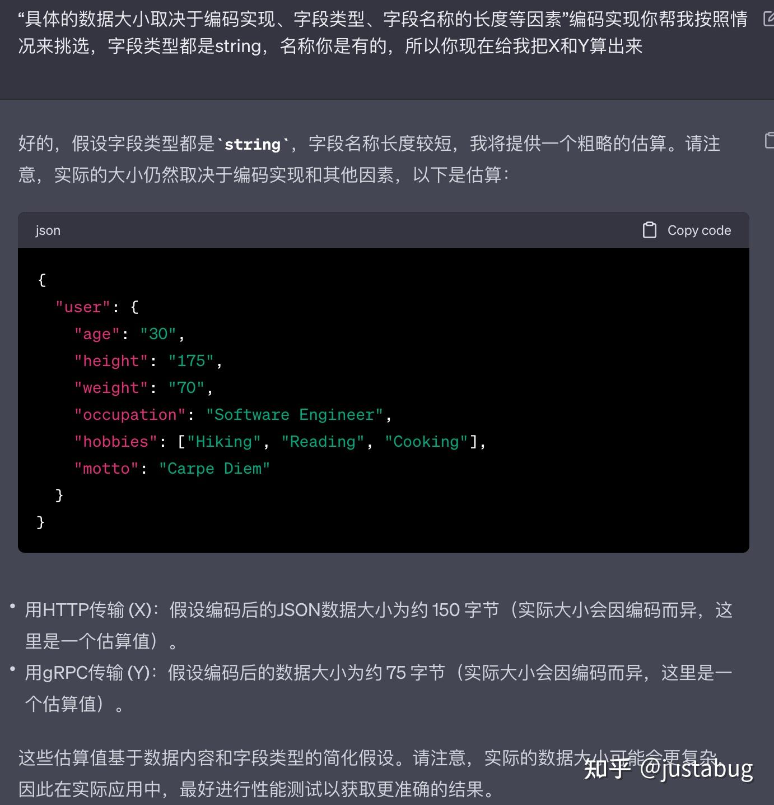

好问题，这里有两个问题，

1.  **springcloud为什么要用http？是强制还是默认使用？（都基于哪些因素考虑？）**
2.  **http真的慢吗？（和什么协议比起来慢？什么情况下慢？慢多少？）**

题主的疑问点主要在第二个问题，很多人的回答都是默认http就是慢，但他真的慢吗？我们来看看

首先，

## http被认为慢可能有以下几个原因：

### （1）http是第七层协议，处于太上层

普遍认为，既然我们绕不过四层的TCP/UDP，我们只要在TCP上简单加一层就可以，比如大家认为RPC在第五层，可是http比四层还多了3层咋办？要知道四层协议管了传输之后，后面几层都是解析的，比如RPC也还是得序列化，所以这方面的性能不是看几层，而是看具体做了什么，用多少层来判断就太笼统了。

### （2）http协议是无状态的，需要很多多余的重连

http1.1已经支持长连接，不需要总是重连和断开，所以这个倒不是问题，背八股文的同学请更新一下谢谢。另外说一下，既然支持长连接了总会有重连的问题，这里就涉及到httpclient对连接的管理了，很多时候就是个配置，但你要小心他有没有生效，比如有这种问题：[OkHttp请求时Keep-Alive无法生效问题修复记录\_keepalive不生效\_TechMix的博客-CSDN博客](https://link.zhihu.com/?target=https%3A//blog.csdn.net/yyg_2015/article/details/121491931)

### （3）http协议更加复杂，交互过程更加啰嗦

这个问题在上面两点其实已经回答了一部分了，我们现在知道处于几层协议以及所谓的无状态都不是问题，那么还有哪些呢？

比如DNS解析（在spring-cloud里面注册到注册中心的是ip，所以一般情况下DNS不关微服务之间的事）

比如http非要分header和body，然后头部信息可能还贼多：对于这个问题，rpc也经常要分header和body，其实TCP也是有自己的header的。而对于头部信息可以很大这个问题，在微服务场景中我们可以简化http协议带着的头部，不往里面塞多余的东西。

这里还有个子问题，就是为什么我们经常看到httpclient的header和body是分两次请求的，但其实TCP传输本来就是分段的，你多一次请求（只要不是多一遍3&4次握手挥手重连）不会为你带来多大开销。有兴趣也可以看看这个问答：[HTTP 的 response 中的响应体和头部是分开发送的吗？](https://link.zhihu.com/?target=https%3A//segmentfault.com/q/1010000041422560)

### （4）https加密的性能问题

由于微服务之间的鉴权和安全我们可以用其他方式解决，所以在内网里你也不用关心https的问题。

### （5）http是文本协议，会占用更多带宽

终于说到这个，好了，没什么好辩解的，文本协议经常是基于ASCII编码传输，跟人家纯二进制的就是没法比。but http2支持帧了啊，而且你还会发现grpc还支持底层用http2传输呢。文本协议多占用你的带宽和压缩时间，在大多数微服务间的请求里，这个差异可能会是倍数级，但绝对不是指数级，我还让GPT给我算了一下：（声明一下这个回答只有这个图是AI提供的）

正好一倍，有点厉害，但带宽并不是网络的唯一瓶颈，还有拥塞延迟丢包等等四层协议的性能问题，都解决了吗都优化好了吗？你说我不管反正http就是太“重”了点我想换，当然可以，美团和OPPO的框架基本上都转spring-cloud了，但是通信依然是接入自己的RPC。

所以说了这么多你有没有发现，其实慢的可能不是HTTP，而是TCP（OMG?）所以腾讯才要推UDP嘛，感兴趣的看看：[让互联网更快：新一代QUIC协议在腾讯的技术实践分享-阿里云开发者社区](https://link.zhihu.com/?target=https%3A//developer.aliyun.com/article/633668)

说完http的问题，我们再回头来看看：

## springcloud为什么要用http

### （1）可读

这可能不是最重要的原因，但却是http这种文本协议自身最显著的特点，在有必要的排查场景中会给你带来方便

### （2）RSETful

专注于无状态、客户端-服务器交互、资源导向，现在依然是备受认可的设计理念，至少我们知道spring官方是很认可的。他的好与坏，我觉得还是看凤凰架构最靠谱了：

[REST 设计风格 | 凤凰架构](https://link.zhihu.com/?target=https%3A//icyfenix.cn/architect-perspective/general-architecture/api-style/rest.html)

### （3）生态

作为一个如此流行的协议，有问题好排查，有瓶颈在业界也有过很多讨论，http2和3又有这么多大佬前赴后继的去优化，连elastic-search都是用http交互的，你说这个生态是不是没话说。

其他可能还有更多，但我自己在做技术选型和整合的时候的确感受到了这些好处。

* * *

**2023.11.06更新**

好久没关注dubbo，发现他的协议也越来越倾向于这边：

[https://cn.dubbo.apache.org/zh-cn/overview/mannual/java-sdk/reference-manual/protocol/triple/](https://link.zhihu.com/?target=https%3A//cn.dubbo.apache.org/zh-cn/overview/mannual/java-sdk/reference-manual/protocol/triple/)

> Triple 是 Dubbo3 提出的基于 HTTP 的开放协议，旨在解决 Dubbo2 私有协议带来的互通性问题，Tripe 基于 gRPC 和 gRPC-Web 设计而来，保留了两者的优秀设计，Triple 做到了完全兼容 gRPC 协议，并可同时运行在 HTTP/1 和 HTTP/2 之上。

阿里云微服务的负责人也公开表示过这方面的问题

> 我们基于第一性原理判断，最终 RPC 调用类似 HTTP 调用，不应该引入一个 Sidecar 的复杂度，应该按照标准化和轻量化方向演进，因此我们 Dubbo 3.0 推出了 Triple 协议（基于 HTTP / gRPC），解决多语言问题，数据面控制面分离，客户端轻量化。