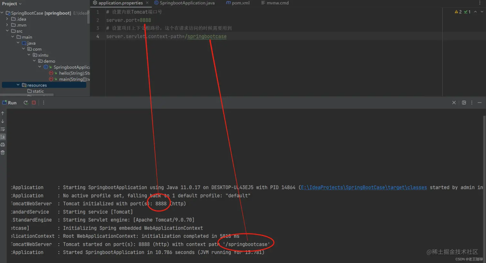
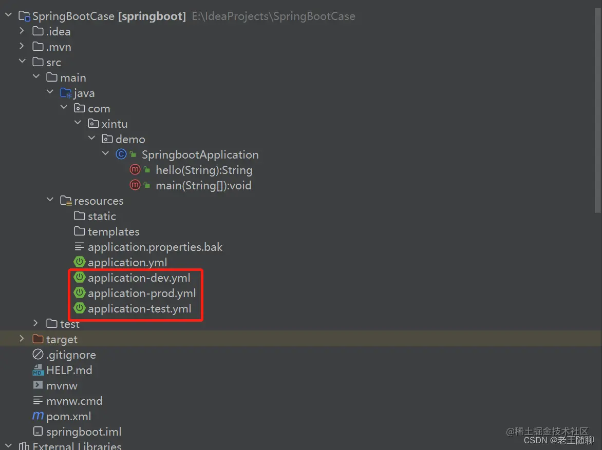
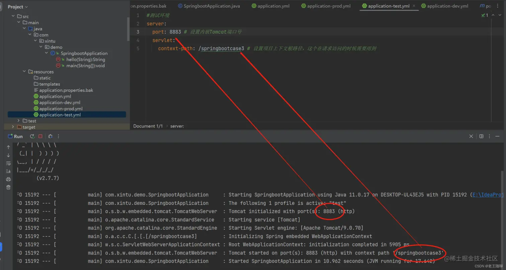
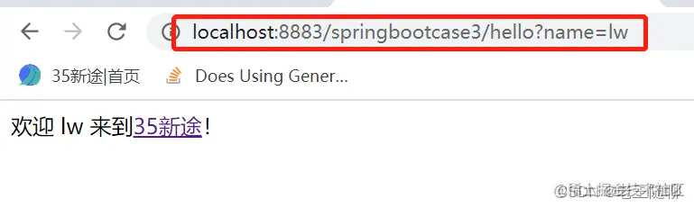
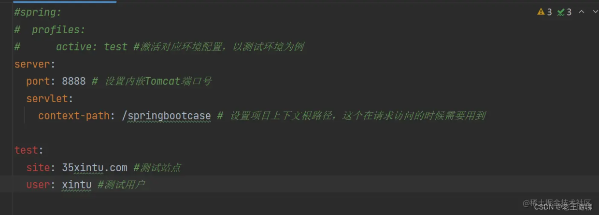
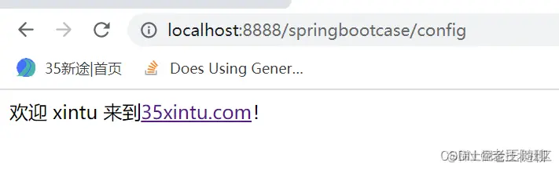
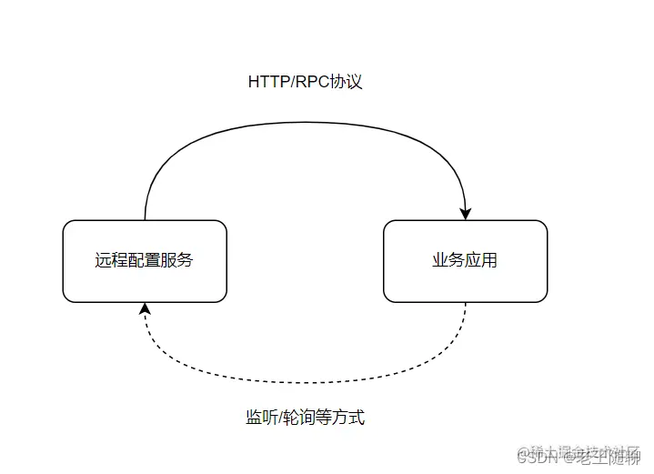

> Spring Boot的核心配置文件用于配置Spring Boot程序，文件名字必须以application开始。这个既是底层源码的强制要求，也是SpringBoot的一种代码规约，有助于在开发层面利于代码规范管理。

说明：以下内容接着i前面的SpringBootCase项目进行演示。

## 1、application. properties核心文件

格式：以键值对的方式进行配置，key=value 示例：name=xintu 我们修改application.properties配置文件。比如修改默认tomcat端口号及项目上下文件根。

设置内嵌Tomcat端口号

server.port=8888

设置项目上下文根路径，这个在请求的时候需要用到

server.servlet.context-path=/springbootcase

配置完毕之后，启动测试。



浏览器输入地址：[http://localhost:8888/springbootcase/hello?name=lw](https://link.zhihu.com/?target=http%3A//localhost%3A8888/springbootcase/hello%3Fname%3Dlw) ， 页面验证结果如下。


2、 application.yml配置文件（推荐配置风格） yml 是一种 yaml 格式的配置文件，主要采用一定的空格、换行等格式排版进行配置。格式如下，

> key: 空格+value, 表示一对键值对。

配置YNML时，需要注意以下4点：

> 1）以空格的缩进来控制层级关系。 2）只要是左对齐的一列数据，都是属于同一层级。 3）空格必须有。 4）属性和值对大小写敏感。

```text
server:
  port: 8888 # 设置内嵌Tomcat端口号
  servlet:
    context-path: /SpringBootCase # 设置项目上下文根路径，这个在请求访问的时候需要用到
```

特点：与 application. properties 相比，yaml更能直观地被计算机识别，而且容易被人类阅读。 yaml 类似于 xml，但是语法比xml 简洁很多，值与前面的冒号配置项必须要有一个空格， yml 后缀也可以使用 yaml 后缀。当两种格式配置文件同时存在，使用的是 .properties 配置文件，为了演示yml，可以先将其改名，重新运行SpringbootApplication，查看启动的端口及上下文根。

我们在后面的学习过程中，均使用 .yml格式 。如果想改.properties形式也可以，按照自己喜欢的风格 或 团队约定即可。

## 3、SpringBoot多环境配置

在实际开发的过程中，我们的项目会经历很多的阶段，开发、测试、上线， 尤其时很大厂，在进行一些重要需求迭代时，还会包括预发、灰度等。每个阶段的配置会因应用所依赖的环境不同而不同，例如：数据库配置、缓存配置、依赖第三方配置等，那么这个时候为了方便配置在不同的环境之间切换，SpringBoot提供了多环境profile配置功能。

> 命名格式：application-环境标识.yml（或 .properties）。

下面我们为每个环境创建3个配置文件，分别命名为：application-dev.yml（开发环境）、application-dev.yml（测试环境）、application-dev.yml（生产环境）。



各配置文件内容如下，

1.  application-dev.yml

## 开发环境

```text
server:
  port: 8881 # 设置内嵌Tomcat端口号
  servlet:
    context-path: /springbootcase1 # 设置项目上下文根路径，这个在请求访问的时候需要用到
```

1.  application-test.yml

```text
#测试环境
server:
  port: 8883 # 设置内嵌Tomcat端口号
  servlet:
    context-path: /springbootcase3 # 设置项目上下文根路径，这个在请求访问的时候需要用到
```

1.  application-prod.yml

```text
#生产环境
server:
  port: 8882 # 设置内嵌Tomcat端口号
  servlet:
    context-path: /springbootcase2 # 设置项目上下文根路径，这个在请求访问的时候需要用到
```

4）总配置文件application.yml进行环境的激活

```text
spring:
  profiles:
      active: test #激活对应环境配置，以测试环境为例
```

说明：除此之外，还可以使用maven编译打包的方式配置profile。通常这种情况比较少见，需要根据各公司环境情况而定。

启动并测试验证如下，



浏览器输入： [http://localhost:8883/springbootcase3/hello?name=lw](https://link.zhihu.com/?target=http%3A//localhost%3A8883/springbootcase3/hello%3Fname%3Dlw)， 结果如下，



## 4、SpringBoot自定义配置

在SpringBoot核心配置文件中，除以上使用内置的配置项之外，我们还可以在自定义配置，然后采用注解方式去读取配置。

## 1）@Value注解

步骤1：在核心配置文件applicatin.yml中，添加两个自定义配置项test.site和test.user。在IDEA中可以看到这两个属性不能被SpringBoot识别，背景是红色的。



步骤2：在SpringbootApplication中定义属性，并使用@Value注解或者自定义配置值，并对其方法进行测试 。

```text
package com.xintu.demo;

import org.springframework.beans.factory.annotation.Value;
import org.springframework.boot.SpringApplication;
import org.springframework.boot.autoconfigure.SpringBootApplication;
import org.springframework.web.bind.annotation.GetMapping;
import org.springframework.web.bind.annotation.RequestParam;
import org.springframework.web.bind.annotation.RestController;

@RestController
@SpringBootApplication
public class SpringbootApplication {

    @Value("${test.site}") //获取自定义属性test.site
    private String site;

    @Value("${test.user}")  //获取自定义属性test.user
    private String user;
    public static void main(String[] args) {
        SpringApplication.run(SpringbootApplication.class, args);
    }

    @GetMapping("/hello")
    public String hello(@RequestParam(value = "name", defaultValue = "World") String name) {
        return String.format("欢迎 %s 来到<a href=\"http://www.35xintu.com\">35新途</a>！", name);
    }

    @GetMapping("/value")
    public String testValue() { //测试@Value注解
        return String.format("欢迎 %s 来到<a href=\"http://www.35xintu.com\">%s</a>！" , user,site);
    }

}
```

步骤3： 重新启动后，在浏览器中进行测试验证： [http://localhost:8888/springbootcase/value](https://link.zhihu.com/?target=http%3A//localhost%3A8888/springbootcase/value)。


## 2） @ConfigurationProperties

将整个文件映射成一个对象，用于自定义配置项比较多的情况。

步骤1：在 com.xintu.demo.config 包下创建 XinTuConfigInfo 类，并为该类加上@Component和@ConfigurationProperties注解，prefix可以不指定，如果不指定，那么会去配置文件中寻找与该类的属性名一致的配置，prefix的作用可以区分同名配置。

```text
package com.xintu.demo.config;

import org.springframework.boot.context.properties.ConfigurationProperties;
import org.springframework.stereotype.Component;

@Component
@ConfigurationProperties(prefix = "test")
public class XinTuConfigInfo {
    private String site;
    private String user;

    public String getSite() {
        return site;
    }

    public void setSite(String site) {
        this.site = site;
    }

    public String getUser() {
        return user;
    }

    public void setUser(String user) {
        this.user = user;
    }
}
```

步骤2： 在SpringbootApplication中注入XinTuConfigInfo 配置类。

```text
package com.xintu.demo;

import com.xintu.demo.config.XinTuConfigInfo;
import org.springframework.beans.factory.annotation.Autowired;
import org.springframework.beans.factory.annotation.Value;
import org.springframework.boot.SpringApplication;
import org.springframework.boot.autoconfigure.SpringBootApplication;
import org.springframework.web.bind.annotation.GetMapping;
import org.springframework.web.bind.annotation.RequestParam;
import org.springframework.web.bind.annotation.RestController;

@RestController
@SpringBootApplication
public class SpringbootApplication {

    @Autowired
    private XinTuConfigInfo configInfo; //测试@ConfigurationProperties

    @Value("${test.site}")
    private String site;

    @Value("${test.user}")
    private String user;
    public static void main(String[] args) {
        SpringApplication.run(SpringbootApplication.class, args);
    }

    @GetMapping("/hello")
    public String hello(@RequestParam(value = "name", defaultValue = "World") String name) {
        return String.format("欢迎 %s 来到<a href=\"http://www.35xintu.com\">35新途</a>！", name);
    }

    @GetMapping("/value")
    public String testValue() { //测试 @Value 注解
        return String.format("欢迎 %s 来到<a href=\"http://www.35xintu.com\">%s</a>！" , user,site);
    }

    @GetMapping("/config")
    public String config() { //测试 @ConfigurationProperties 注解
        return String.format("欢迎 %s 来到<a href=\"http://www.35xintu.com\">%s</a>！" , configInfo.getUser(),configInfo.getSite());
    }

}
```

步骤3：重新启动并在浏览器中进行测试。



## 5\. 远程配置中心（目前生产常用的方式）

## 1）配置中心流程图



主要包含两大核心内容：

① 远程配置中心负责属性键值的新增、变更、发布等操作。

② 业务应用端，则通过配置远程配置中心地址获取自己锁需要的配置数据。 另外通过客户端监听的方式，近实时地获取远端配置的修改或删除。

## 2）开源配置中心对比（按开源时间顺序）

目前市面上用的比较多的配置中心有：Disconf、Spring Cloud Config、Apollo、Nacos。

① Disconf

2014年7月百度开源的配置管理中心，同样具备配置的管理能力，不过目前已经不维护了。

② Spring Cloud Config

2014年9月开源，Spring Cloud 生态组件，可以和Spring Cloud体系无缝整合。

③ Apollo

2016年5月，携程开源的配置管理中心，具备规范的权限、流程治理等特性。

④ Nacos

2018年6月，阿里开源的配置中心，也可以做DNS和RPC的服务发现。

以上各配置服务在配置管理领域的概念和原理基本相同，但是也存在一些不同的点。另外也有一些内部私有配置中心，比如京东的DUCC，美团的MCC等，设计思路基本大同小异，感兴趣的可以自己深入研究。

以上！