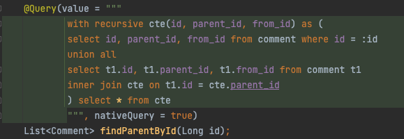

都用过，建议先了解下 cqrs，如果你明白typesafe 在如今的软件工程中多么重要，你就很少会用 mybatis 这类东西了。在用过其他类型安全的工具后，mybatis-plus 这类东西就绝对不会再使用了

模型设计的好代码可以少很多，jpa 的检查或者 querydsl jooq 这类工具的使用可以大大降低重构的难度，严格的约束会逼你仔细思考领域模型是否合理，而不是有需求就上，国内很多软件都不会这么设计所以你看到国内mybatis很多，而老外基本不用。

有人说国内人多并发大，jpa/h 性能差，讲真的很多人用都用错了，几个常见原因：

1.  只用关系数据库的下限：mysql，不肯使用商业版本（不想花钱），各种优秀的数据库特性都不用（被某些大厂或培训忽悠），数据库差怪 orm
2.  没有做 cqrs，一个 Java 对象搞的所有查询映射需求，各种可选字段
3.  压根没认真去学其他方案，只会 mybatis

如果正确使用 jpa，缓存高并发更好做。

* * *

评论有说到具体操作怎么做，我写下自己的一些小技巧：

### CQRS 的技巧

cqrs 只是一种解耦方法，具体使用的时根据项目情况怎么方便怎么来。

1\. 对于小项目可以直接 controller/service 分文件夹做命令查询分离（代码还是在一个包里面，mybatis 和 jpa 可以同时在一个项目中使用）。

2\. 项目复杂时可以分不同微服务，这时写操作还是 jpa 严格的模型，读操作你用什么都可以 mybatis，缓存，没强一致性需求的直接rpc都可以。

3\. 并发上去的时候自己做数据库读写分离，可以撑很长时间，或者使用云厂商的计算存储分离版本，比如华为高斯，阿里polardb，亚马逊 aurora 这种都可以做到 100%兼容 mysql，包括bug兼容，性能都能提升5-7倍，远比纠结用 mybatis 还是 jpa 强的多。

4\. 恭喜你项目非常成功，aurora 这类方案都撑不住了，这时 ORM 基本都需要重构、各种性能分析了（非常消耗程序员发量），你可以考虑使用 newsql 的方案，放弃 mysql 等开源方案了。

注意上面的步骤，如果没有使用 mybatis 或者 mybatis-plus 这类工具，而是 typesafe 的 query，进入到步骤 3 的时候你一行代码都不需要改。走到步骤 3 也说明项目成功了，不差数据库那点钱了，省下人力更划算，走到步骤 4 ，如果是 typesafe 的 query，做性能分析和重构都会方便很多。

### 查询和模型设计的技巧

具体模型可以简单分读和写两个，写操作的模型严格按照 JPA 的方法设计，不可随意改动，没有多余的字段，读模型可以根据产品需求大量改动，有大量的可选字段，两个模型的对接可以抽象出一个工厂类（就是单纯的 set/get，属性拷贝），举个微博的例子：

```ts
// 写模型
interface User {
  id: string;
  nickname: string;
}

interface Weibo {
  id: string;
  content: string;
  author: User;
}

// 读模型
interface WeiboVO {
  id: string;
  content: string;
  author: User;
  activeUsers: User[];
}
```

上面读模型多了个字段，用来表示这个微博下面的活跃用户，根据最新评论拉取。

如果你只用 mybatis，很容易写成一个模型，然后 activeUsers 使用 left join 子查询去拉取，如果仔细想，activeUsers 不应该存在于 Weibo 这个实体中，这个字段只有读需求，没有写需求，应该分离模型，WeiboVO 可以通过 jpa 的子查询，或者 querydsl 查询拼接，对于批量查询，可以 stream 获得 ids，分两次查询优化。

### 复杂嵌套对象查询只用 getByIds 方法

对于每个模型都实现 getByIds 的批量查询接口，然后再实现 getById 接口：

```java
public List<User> getByids(List<Long> ids) {
  // querydsl...
  // leftJoin...
  // where id in ids...
  return users;
}

public User getById(Long id) {
  var users = getByIds(List.of(id));
  if (users.isEmpty()) {
    throw new NotFoundException(); 
  }
  return users.get(0);
}
```

这种写法简单易懂，且缓存友好，rpc 友好，复杂嵌套对象的批量查询可以使用 java8 的 stream 转换为 ids 分几个独立的查询再拼接，复杂度O(n)，n 为嵌套字段的数量，不是批大小。

### 需要原生 SQL 特性怎么办？

很多时候 SQL 还是少不了，比如需要 mysql 的 cte 语法、基于自然语言的文本搜索语法，你会发现 querydsl 等方案很难写出来，有两种办法解决：

1.  不要使用这些特性，比如 cte，可以用父子表替代，搜索的功能交给 elasticsearch 单独去做
2.  使用 jpa 的原生查询语法，但只查 id，之后使用 getByIds 方法查具体对象，随便举个例子：



上面图片可以看到使用 JPA 的另一个好处：IDE 自动提示原生语法，自动检查语法错误，使用 mybatis 就很难做到这一点了。