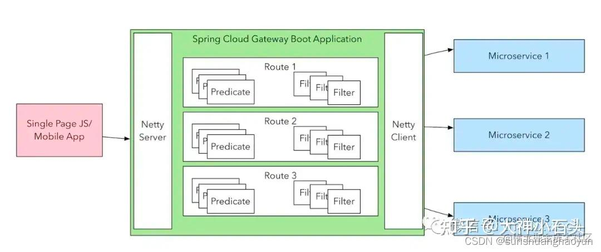
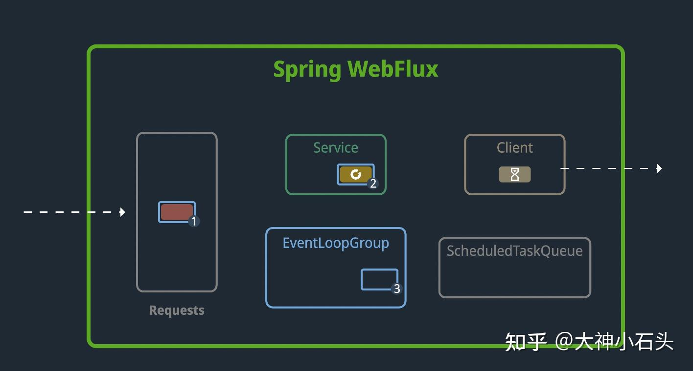

最近对公司的现有网关进行压测，发现在下游服务无甚压力的情况下，压测却只有 60tps，请求响应超时严重。

Spring gateway 网关的常见请求链路是这样的：

1.  自定义 filter 中 请求“权限服务”，判定请求合法性
2.  转发请求到 “下游服务”

其中 1 我们使用的是 feign 调用，2 是 gateway 的转发 。

具体排查过程就不细说了，最后问题定位在 1 这一步，我们自己开发的鉴权 filter。

gateway 使用 reactive 编程，实际请求的处理线程（EventLoop）数量是 “cpu 核数”，如果在整个 gateway 处理链路中存在 io blocking 则会导致线程的阻塞从而严重降低处理性能。解决方案就是将 feign 替换为 reactive feign，reactive feign 的原理是将阻塞的 网络io请求转为异步，从而不占用 EventLoop 线程数。如下图：

Client 的请求结果会放在队列中供核心线程获取，而 Server 端（我们的权限服务）无需任何改动。

修改后压测，改用 reactive feign 后网关不在是瓶颈，吞吐量取决于权限及下游服务，可以说是质的飞跃。

类似的问题及解决方案同样适用于 gateway 调用 redis、mysql 等存储服务。

关于 Reactive 的具体实现强烈大家看下这个博客文章，文中通过动画讲的很易懂。

[https://www.stefankreidel.io/blog/spring-webflux](https://link.zhihu.com/?target=https%3A//www.stefankreidel.io/blog/spring-webflux)

欢迎有对基础架构感兴趣的技术爱好者交流。

github 示例代码库：[https://github.com/ddavidzhang/spring-cloud-gateway-feign](https://link.zhihu.com/?target=https%3A//github.com/ddavidzhang/spring-cloud-gateway-feign)