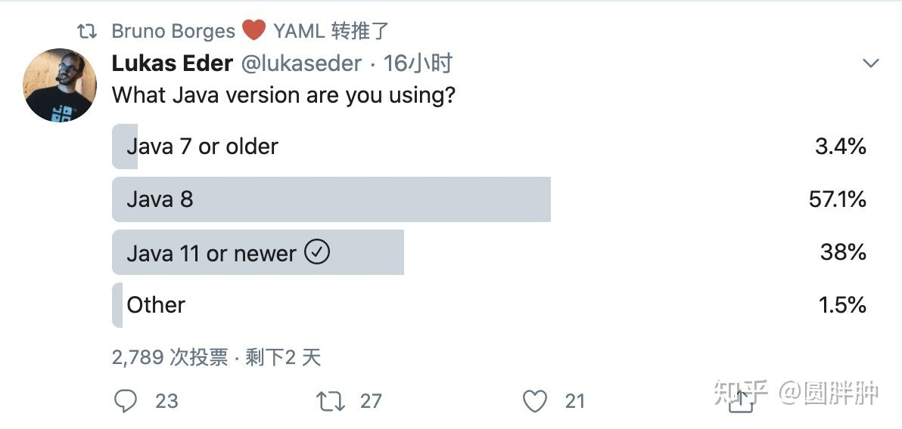

先说一个笑话：

电梯里有三个人，一个人拼命做俯卧撑，一个人在跑圈，还有一个人拿头撞墙，电梯升到了10楼，然后人家问他们怎么上来的，一个人说我做俯卧撑上来的，还有一个人说我跑圈上来的，最后一个人我撞墙撞上来的……

* * *

当然不是java的巅峰

**是这些年，国内这种搞技术的闭关自守，不思进取给你带来的错觉**

因为你没有在国内看到这些技术的进步，所以你觉得，哇，这应该就是巅峰了

你应该看看老外在说什么，再对比国内这些信息

你就会觉得，国内这些人就像是满清，墙外的世界已经各种科技革命了，墙内还在做着天朝上国的迷梦，还在骑马射箭，人家已经船坚炮利了

所以英语很重要，你要学会英语，**这样搞技术的二道贩子就骗不了你了**，就没有中间商赚差价了，不要怕学不会英语，英语也是工具，use it or lose it，用多了自然会，不用担心语法错误，老外看得懂，看不懂痛苦的也是老外，管他那么多

这其实是我国政府的牛逼之处，政府牛逼，所以我国长期处于一种增量市场中，也就是技术其实不重要，不需要改良，重复做以前做过的事，因为市场自然在增长，所以不愁没有客户，所以牛逼的是我国的政府，跟墙内这帮搬砖的没关系，这群搬砖的放墙外早就被开掉了，因为在墙内被政府保护得很好，所以不思进取，就以为自己引领了世界潮流了，其实只是沾了政府的便宜，现在行情不好了，资本家自己都养不活，也就不想养这些搬砖的了，于是一堆人就开始焦虑

我国政府和市场就是那台上升的电梯，而这些搬砖的就是电梯里那些拿头撞墙的家伙

然后你看看java这些年做了什么，我一个一个说，提醒你注意，这些技术都是近10年出现的

graal，世界各国的大学，研究了7，8年之后，正式发布，特性是：polgylot，native image，请问你会用吗？你听说过吗？

就算你只是一个后端，那么native image可以解决faas和cloud native的问题，你了解过吗？

好，graal不算是java，只能算是java的扩展，我就说java自身，你看这些年的项目

zgc，shenandoah，panama，amber，metropolis，valhalla，loom，skara……

这些项目你用了吗？你知道这些项目在解决什么问题吗？

我一个个说吧

zgc解决了java gc停顿太长的问题，一定在10ms以内完成，实测在1-2ms之间完成gc，代价是吞吐下降不超过15%

shenandoah类似zgc，但是它没有承诺一定在10ms以内完成，但是同样没有代价，所以是一个比较合适的g1的替代品

panama，强化java跟c，c++等native代码的互操作性，就是方便java调用c，c++写的代码，对jni做出了优化，不仅是代码写起来更加简单，而且性能更好

amber，强化java的语法，增强java代码的可读性，确切滴说是简化java的写法，比如可以在switch中使用->和yield，就很像kotlin的when

metropolis，替换jdk里面缺省的c1，c2编译器，用graal的编译器

valhalla，这是java的value type，值类型

loom，这是java的虚拟线程

skara，将openjdk迁移到github上去

这些都是大的项目，具体到每一个java的技术细节，jcp会发布jep，这是jep的列表

[JEP 0: JEP Index](https://link.zhihu.com/?target=https%3A//openjdk.java.net/jeps/0)

你看这里有多少个jep，你能看懂每一个jep并想出如何使用这些新增加的特性吗？

比如开了zgc之后，有些实时系统就可以开始尝试了，比如短程货运的自动驾驶，就那种送快递的带轮子的自动运输车

而且java现在也有了arm上的build，你可以在树莓派上build java，java也可以写手机app了，对此你试过吗？你知道吗？

你看maven central上，java写的jar依赖都上千万了，还在以每年几百万的速度递增，而你只会用其中很小的一部分，which is spring related，你觉得你对java真的了解吗？maven central上那么多类库，你会用吗？我随便选一个类库，你能在短时间内上手用起来吗？比如这个[guava](https://link.zhihu.com/?target=https%3A//mvnrepository.com/artifact/com.google.guava/guava)

这个生态里面什么都有，比如hadoop，这个你总知道吧？会用吗？cassandra？kafka？上千万的类库我一个个列举过去不可能，自己看吧

请问你对此了解多少？

不，你不了解，**你只会用spring，你不是java程序员**，你是spring程序员，你不会java，你只会spring，所以spring如果不给你的工具，你就不会用了，连最简单的升级都不敢升，连unit test都不会写，不信你面试spring开发的时候，让写一个unit test试试看，信不信很多人写不出来？

你要说这些需求都不存在吗？肿么可能，不会做所以自我欺骗说，需求不存在

需求当然存在，技术也客观存在，只是你不会用而已

你看完我说的java，graal和maven central上的依赖，你还认为spring是巅峰吗？

就这么说吧，spring在这里面，犹如php之于整个挨踢生态

没说错吧？

php就是一个web framework，傻瓜化使用，用spring的不就正在做跟php同样的事？

所以很多时候我都在想，这帮人天天嘲笑php，哪里来的勇气哦，做出来的玩意不也是另外一种php嘛？从需求上看，spring做的，跟php做的，有多大区别？不都是搞了个网站吗？

然后一天到晚在那边强调大病发，先不说php也有异步的实现

就说需求面，有多少公司的网站有大病发的需求？

小病发才是大多数企业网站和内部信息管理系统的常态吧？

那你整那些大病发给谁用？

就算做到了大病发，你也有钱了，因为你有足够的用户了，那优化php就是了，facebook不就这么干的？要是不懂就抄fb的开源

当然问题不是只有你一个，其它领域的程序员也有同样的问题

比如ios的开发很多都只会objc，不会swift，安卓也类似

**但是世界不会因为你的保守而停止进步**

这些先进技术一定会在现在或者将来冲击现有的陈旧的技术体系，你要小心，将来你有可能会因为你的保守而付出代价，而这个代价其实也很简单，就是裁员失业，其实现在已经开始了

因为你不会，中国这么大，有的是人会，而且新技术上手难度也不高，没啥难的，压根不需要什么985或者本科才能学会，随便一个智商正常的人都能学会，你要想，老外那种连100以内加减乘除都算不清楚的，都能噼里啪啦写出代码来，难道你比这种人还笨？显然不是，原因是你不会做，而不是你学不会，学不会的原因估计是没有人教你，但是教会他人，只是一层窗户纸，很容易就捅破了，找个会的人给你解释一下就行了，都是些概念，没啥难的，比初中数学简单多了

最直接的方式就是直接阅读老外的英语材料，这样效率最高，也不需要麻烦他人给你解释

现在愿意花上万工资去养一个web开发（无论前端还是后端）的老板，我都很佩服，贵司素真滴有钱，因为上万块钱，拿去外包，都能找到很好用的，想怎么整都行，你可以指定技术栈，php，spring还有node这种烂大街的技术外包到处都是

* * *

果然评论区又有人开始比烂了，恰好twitter上有一个调查

