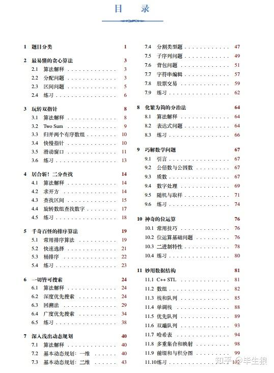
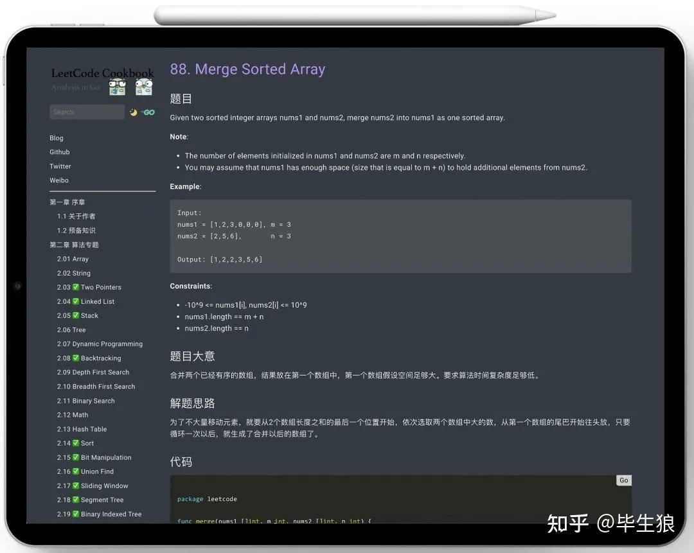

为什么会有如此奇怪的想法？我认为Spring仅仅是java在工程中的应用方式而已。

甚至，我都不建议你看spring源码，因为现在的spring生态圈有些臃肿了。

JDK一些经典的源码，这个必读。除此之外，netty、dubbo、rocketmq源码，这些读完了对你的收获也一定很大。

最初级的工程师，无非是根据业务需求写CRUD，会用个Spring和mybatis而已，但随着往资深工程师和架构师方向的进阶，有一些技术栈就不可避免的必须掌握了。

这里所说的掌握，不仅仅是停留在只会使用而已，应该是包括其内部原理和核心源码的范畴。

由浅及深包括这些领域：Java、MySQL、Redis、ES、Kafka、Netty、Dubbo、ClickHouse、Doris。

MySQL：90%的项目挑战，都是出现在数据库上。因此，搞定主流数据库的运行机制和实现原理是必不可少的。  
需要掌握：索引、事务、锁机制、日志、主从备份、高可用、故障排查等。  
推荐书籍：《[MySQL技术内幕](https://www.zhihu.com/search?q=MySQL%E6%8A%80%E6%9C%AF%E5%86%85%E5%B9%95&search_source=Entity&hybrid_search_source=Entity&hybrid_search_extra=%7B%22sourceType%22%3A%22answer%22%2C%22sourceId%22%3A2697607514%7D)》、《高性能MySQL》

Redis：关系型数据库的强力补充，性能优化利器。  
需要掌握：Redis Cluster、主从同步、持久化机制、LRU、[线程模型](https://www.zhihu.com/search?q=%E7%BA%BF%E7%A8%8B%E6%A8%A1%E5%9E%8B&search_source=Entity&hybrid_search_source=Entity&hybrid_search_extra=%7B%22sourceType%22%3A%22answer%22%2C%22sourceId%22%3A2697607514%7D)、缓存穿透雪崩等。  
推荐书籍：《[Redis设计与实现](https://www.zhihu.com/search?q=Redis%E8%AE%BE%E8%AE%A1%E4%B8%8E%E5%AE%9E%E7%8E%B0&search_source=Entity&hybrid_search_source=Entity&hybrid_search_extra=%7B%22sourceType%22%3A%22answer%22%2C%22sourceId%22%3A2697607514%7D)》、《Redis核心原理与实践》

ES：MySQL不能无限建索引，这样会导致写数据的性能变得很差。于是，所有后端工程师都知道，[多样化查询](https://www.zhihu.com/search?q=%E5%A4%9A%E6%A0%B7%E5%8C%96%E6%9F%A5%E8%AF%A2&search_source=Entity&hybrid_search_source=Entity&hybrid_search_extra=%7B%22sourceType%22%3A%22answer%22%2C%22sourceId%22%3A2697607514%7D)走ES。  
需要掌握：调优策略、事务日志、索引段、核心参数、路由策略、执行偏好、故障检测等。  
推荐书籍：《[ElasticSearch权威指南](https://www.zhihu.com/search?q=ElasticSearch%E6%9D%83%E5%A8%81%E6%8C%87%E5%8D%97&search_source=Entity&hybrid_search_source=Entity&hybrid_search_extra=%7B%22sourceType%22%3A%22answer%22%2C%22sourceId%22%3A2697607514%7D)》、《ElasticSearch实战》

Kafka：异步、消峰、解耦，微服务时代不可缺少的利器。  
需要掌握：生产者和消费者核心参数、同步副本认定原理、日志文件格式、日志清理策略、[控制器原理](https://www.zhihu.com/search?q=%E6%8E%A7%E5%88%B6%E5%99%A8%E5%8E%9F%E7%90%86&search_source=Entity&hybrid_search_source=Entity&hybrid_search_extra=%7B%22sourceType%22%3A%22answer%22%2C%22sourceId%22%3A2697607514%7D)、再均衡策略、事务等。  
推荐书籍：《Kafka权威指南》、《深入理解Kafka：核心设计与实现原理》

Netty：高性能的Java NIO框架，想自研RPC框架的朋友必学。  
需要掌握：核心组件、线程模型、内存管理实现、服务启动核心源码、accept、read、write事件核心源码等。  
推荐书籍：《Netty权威指南（第二版）》、《Netty原理剖析与实战》

Dubbo：[阿里梁飞](https://www.zhihu.com/search?q=%E9%98%BF%E9%87%8C%E6%A2%81%E9%A3%9E&search_source=Entity&hybrid_search_source=Entity&hybrid_search_extra=%7B%22sourceType%22%3A%22answer%22%2C%22sourceId%22%3A2697607514%7D)开发的高性能RPC框架，默认的dubbo协议集成了Netty 4.0。  
需要掌握：主要模块，SPI思想，服务暴露和服务调用核心源码。  
推荐书籍：《深度剖析Apache Dubbo核心技术内幕》

ClickHouse：MPP列式存储数据库，适用于即席查询场景。大小表性能极佳，缺点是不适合两大表场景。  
需要掌握：MergeTree存储结构、MergeTree系列表引擎、[副本协同原理](https://www.zhihu.com/search?q=%E5%89%AF%E6%9C%AC%E5%8D%8F%E5%90%8C%E5%8E%9F%E7%90%86&search_source=Entity&hybrid_search_source=Entity&hybrid_search_extra=%7B%22sourceType%22%3A%22answer%22%2C%22sourceId%22%3A2697607514%7D)、跳数索引、数据字典及字典表、数据分区原理等。  
推荐书籍：《[ClickHouse原理解析与应用实践](https://www.zhihu.com/search?q=ClickHouse%E5%8E%9F%E7%90%86%E8%A7%A3%E6%9E%90%E4%B8%8E%E5%BA%94%E7%94%A8%E5%AE%9E%E8%B7%B5&search_source=Entity&hybrid_search_source=Entity&hybrid_search_extra=%7B%22sourceType%22%3A%22answer%22%2C%22sourceId%22%3A2697607514%7D)》

Doris：百度开源的基于 MPP 架构的高性能、实时的分析型数据库，跟ClickHouse有些功能趋同，但适合两大表场景。  
需要掌握：数据模型、Tablet & Partition、索引、物化视图、Bucket Shuffle Join和Colocation Join原理、Runtime Filter、SQLCache & PartitionCache等。  
推荐书籍：官方文档

  

此外，下面是我总结出来的基于[后端技术栈](https://www.zhihu.com/search?q=%E5%90%8E%E7%AB%AF%E6%8A%80%E6%9C%AF%E6%A0%88&search_source=Entity&hybrid_search_source=Entity&hybrid_search_extra=%7B%22sourceType%22%3A%22answer%22%2C%22sourceId%22%3A2697607514%7D)的面试资料，能够涵盖面试中至少80%的问题。

  

[经典面试资料](https://link.zhihu.com/?target=https%3A//mp.weixin.qq.com/s%3F__biz%3DMzg5OTU1NzU0NQ%3D%3D%26mid%3D2247484278%26idx%3D1%26sn%3D2f9618e7fab69c964ed86cef54f58a16%26chksm%3Dc05032b0f727bba6a41085030281b1bb2bcaeb7d96feee661dc224964f5e2285b477fea27a51%26token%3D289406341%26lang%3Dzh_CN%23rd)

  

篇幅不长，基础好的同学在20天左右突击期即可全部记忆掌握。

基础一般的同学，因该面试资料有些深度，建议以长线方式循序渐进地进行学习，预计两个月左右可在技术深度和广度上产生质变。

另外，现在行业内卷比较严重，所以建议大家早日把leetcode刷起来，最好的方式是未雨绸缪，一天抽时间刷一两道题。

下面这套刷题笔记是谷歌无人车部门技术大神高畅（changgyhub）和阿里霜神（halfrost）整理的，每题都是追求极致的 runtime beats 100%。

[谷歌、阿里技术大神的Leetcode刷题笔记](https://link.zhihu.com/?target=https%3A//mp.weixin.qq.com/s%3F__biz%3DMzg5OTU1NzU0NQ%3D%3D%26mid%3D2247484382%26idx%3D1%26sn%3D079d639f2ebf709d45c6698e142a0ccd%26chksm%3Dc0503218f727bb0edaf9759222ff8a56038fa20ef9b87eb5f91d6228030b9eb560aa2825babe%26token%3D2049201847%26lang%3Dzh_CN%23rd)

磨刀不误砍柴工，有了工具利器后，往往能达到事半功倍的效果。

行业的未来依然是星辰大海，想象力有多大，天地就有多广阔。

最后祝愿大家都能成为offer收割机，早日实现年薪百万的小目标。