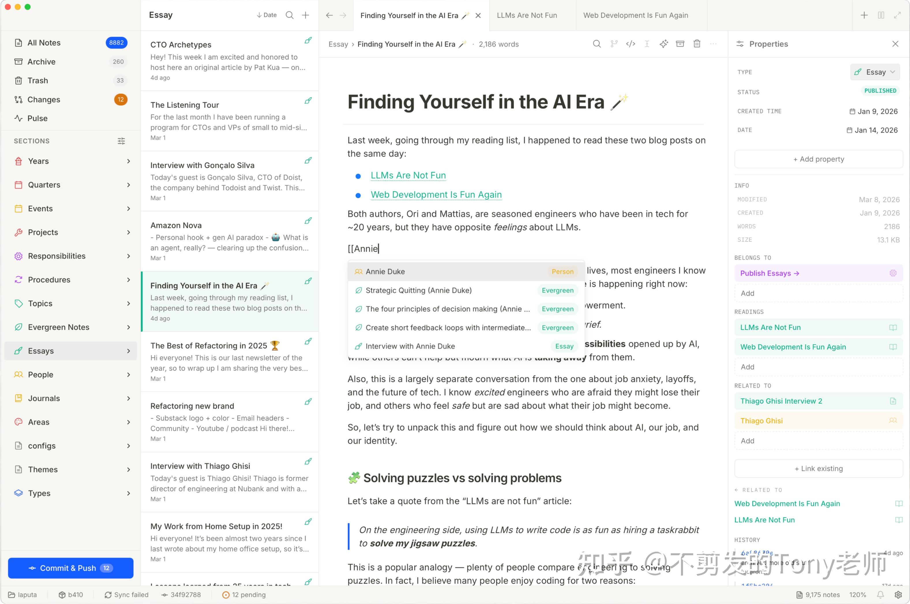
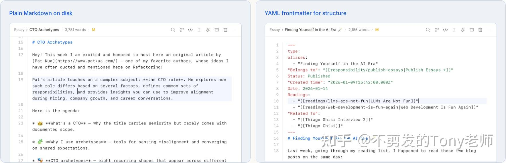
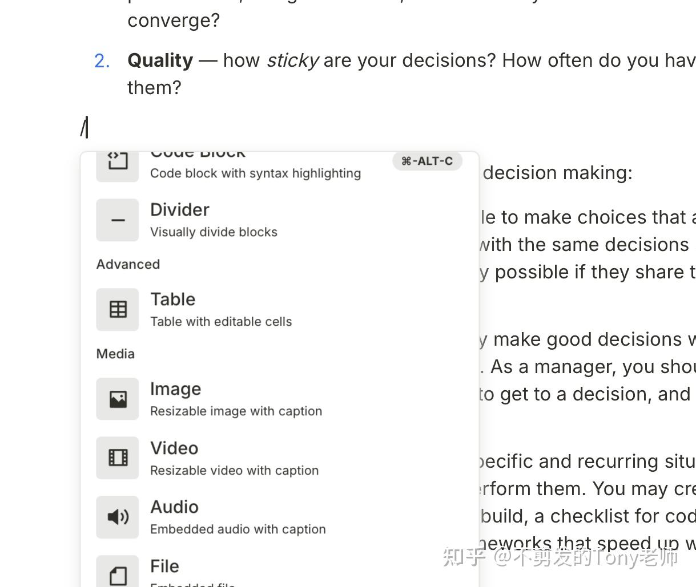
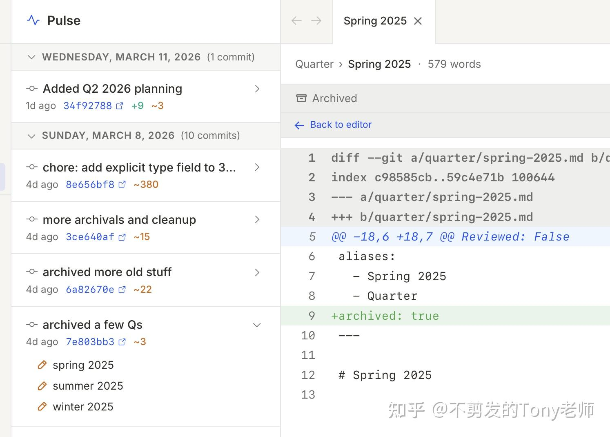
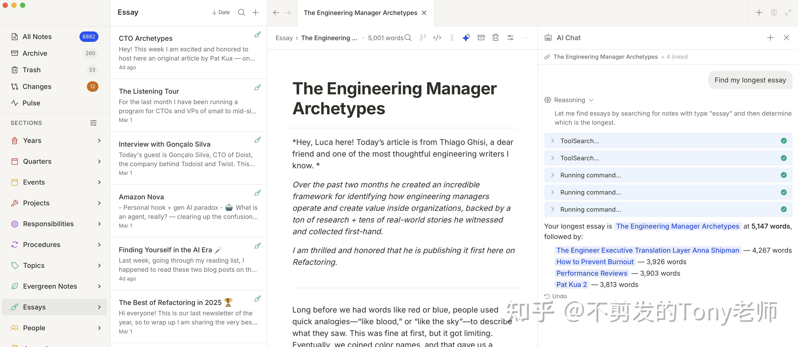
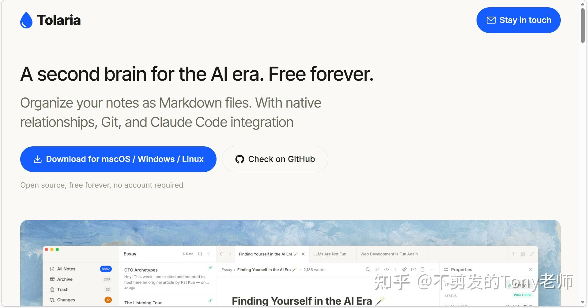
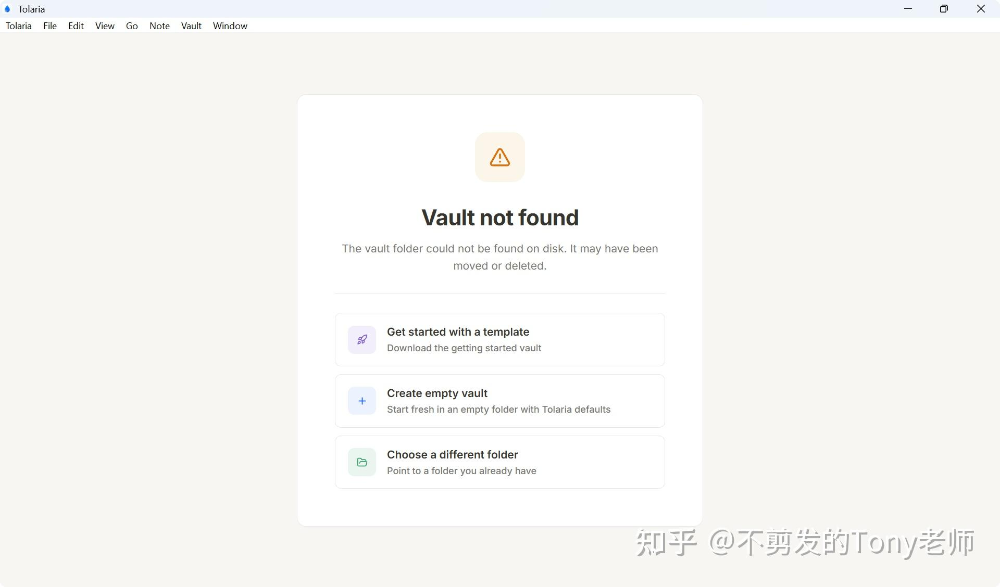

[Tolaria](https://link.zhihu.com/?target=https%3A//tolaria.md/) 是一款面向 AI 时代的知识管理工具，具有本地优先、Markdown 语法、Git 版本控制、AI 原生集成的设计理念，完全开源且永久免费。

Tolaria 采用 TypeSript/JavaScript + Rust 语言开发，遵循 AGPL 3.0 开源协议，代码托管在 GitHub：

[https://github.com/refactoringhq/tolaria](https://link.zhihu.com/?target=https%3A//github.com/refactoringhq/tolaria)

### 功能特性

-   **支持跨平台**：Tolaria 桌面应用支持 macOS、Windows 以及 Linux 操作系统。
-   **本地文件架构**：每篇笔记都是一个 Markdown 文件，使用 YAML Frontmatter 描述结构化元数据；支持使用任意编辑器查看、搜索、备份文件 ；原生支持 Git 版本管理。

-   **现代化编辑器**：提供类似 Notion 的块编辑体验，支持斜杠命令、Wikilinks（双向链接）自动补全、笔记原生关系、拖拽插入图片、键盘优先操作等。

-   **Git 深度集成**：Tolaria 内置完整 Git 客户端，可以直接在应用内提交、推送、查看历史；支持单篇笔记的变更历史；非常适合多设备同步与长期知识演进。

-   **AI 工具集成**：Tolaria 提供完整 MCP Server，可以让 CLI 工具和 AI 助手（Claude Code、Codex CLI、Gemini CLI）直接读取、理解、修改笔记。

### 下载安装

Tolaria 官方提供了下载链接：

[https://tolaria.md/](https://link.zhihu.com/?target=https%3A//tolaria.md/)

安装完成之后运行 tolaria.exe（Windows）：

