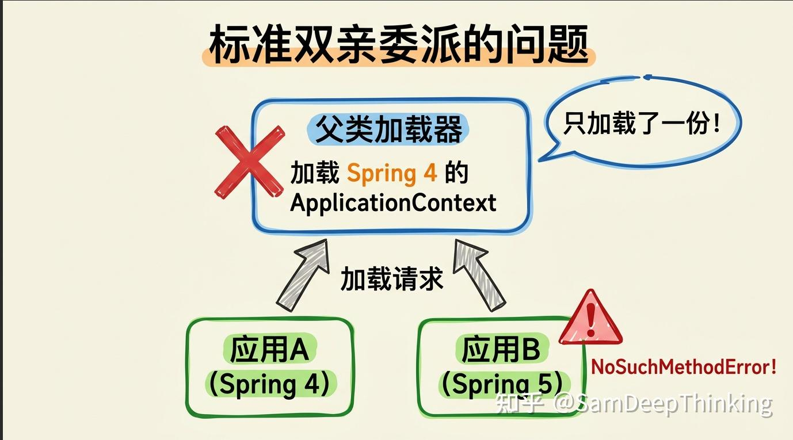
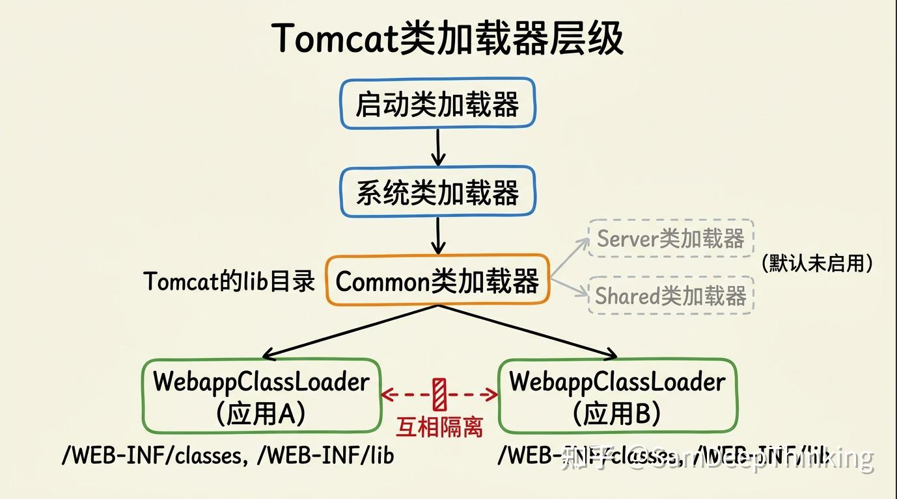
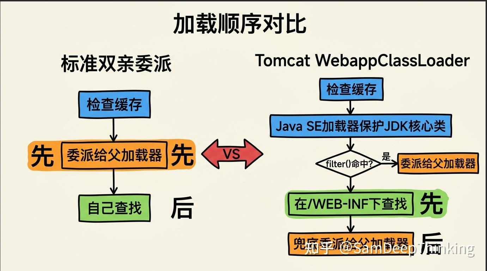
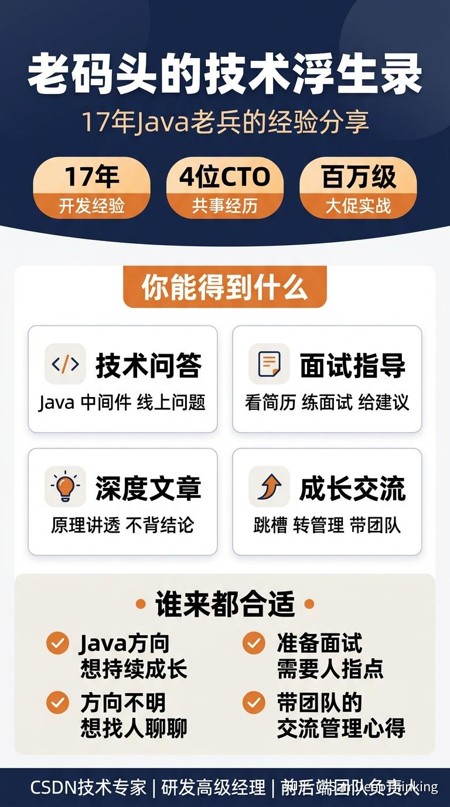

> Tomcat必须打破双亲委派的根本原因是：**Web容器需要让不同应用的「同名类」互相隔离，各用各的版本，互不干扰。**

一个Tomcat实例上同时跑着多个Web应用，应用A依赖Spring 4，应用B依赖Spring 5。如果类加载走标准的双亲委派模型，同一个全限定名的类只会被加载一次。Spring 4和Spring 5里都有`org.springframework.context.ApplicationContext`这个类，版本不同、实现不同，双亲委派会把它交给上层的公共类加载器去加载，结果只加载了一份，两个应用里必定有一个会出问题。

下面从问题场景、层级设计、源码实现三个层面拆分来看一下。

### 先回忆一下双亲委派

标准的双亲委派规则很简单：一个类加载器收到加载请求后，不自己动手，先把请求往上传给父加载器。父加载器也一样，继续往上传。一直传到最顶层的启动类加载器，它加载不了，再一层一层退回来，轮到自己试。

这套机制的好处是保证了类的唯一性。不管你在哪个地方触发加载`java.lang.String`，最终都会由启动类加载器来加载，不会出现两份String。

单应用场景下这没问题，到了Web容器就不够用了。

### 标准双亲委派在Web容器里会出什么问题

有三个。

**应用之间的隔离问题。** 前面说的Spring版本冲突就是最典型的例子。两个应用用了同一个类库的不同版本，双亲委派会让父加载器统一加载，两个应用共享同一份Class对象。版本不兼容的类混在一起用，运行时报NoSuchMethodError或者ClassNotFoundException。

**应用和容器之间的隔离问题。** Tomcat自身运行也需要依赖一些第三方库。如果Tomcat内部用的库版本和某个应用的库版本冲突了，按双亲委派的规则，Tomcat的类先被加载，应用就只能被迫用Tomcat的版本。这不合理，容器不应该影响应用的类库选择。

**应用之间的共享问题。** 隔离也并不一定就是一刀切的。有些类库确实应该被所有应用共享，比如Servlet API。如果每个应用各自加载一份`javax.servlet.http.HttpServlet`，不同应用加载出来的是不同的Class对象，跨应用传参数会出现类型转换异常。这些规范级别的类必须保证全局只有一份。



三个问题归结成一句话就是：

> Web容器需要一套既能「隔离」又能「共享」的类加载机制，标准双亲委派只能做到共享，做不到隔离。

### Tomcat的类加载器层级设计

Tomcat的解决思路是设计一套多层的类加载器结构，每一层有明确的职责边界。

最上面是JVM自带的启动类加载器和系统类加载器，跟标准JVM一样，没有变化。

往下是Tomcat自己创建的Common类加载器。它负责加载Tomcat和所有Web应用都能看到的公共类，比如Servlet API、Tomcat自身的核心类库。这些类放在Tomcat安装目录的lib文件夹下。

Common类加载器再往下，就是每个Web应用各自独立的WebappClassLoader。应用A有自己的WebappClassLoader实例，应用B也有自己的。它们之间是平级关系，互相看不到对方加载的类。这就实现了应用间的隔离。

在Tomcat的`Bootstrap`类里能看到这个层级是怎么创建的：

```java
private void initClassLoaders() {
    // 创建Common类加载器，父加载器为系统类加载器
    commonLoader = createClassLoader("common", null);
    if (commonLoader == null) {
        commonLoader = this.getClass().getClassLoader();
    }
    // Server类加载器，父加载器为Common
    catalinaLoader = createClassLoader("server", commonLoader);
    // Shared类加载器，父加载器为Common
    sharedLoader = createClassLoader("shared", commonLoader);
}
```

这里除了Common之外，还有Server和Shared两个加载器。Server加载器只对Tomcat容器内部可见，Web应用看不到。Shared加载器对所有Web应用可见，可以放多个应用需要共享的类库。不过默认配置下，这两个加载器都没有单独配置加载路径，等于直接复用了Common加载器。

它们的加载路径在`catalina.properties`里配置：

```java
common.loader="${catalina.base}/lib","${catalina.base}/lib/*.jar","${catalina.home}/lib","${catalina.home}/lib/*.jar"
server.loader=
shared.loader=
```

`server.loader`和`shared.loader`为空时，`createClassLoader`方法会直接返回传入的父加载器（即Common加载器）。只有你手动填上路径，Tomcat才会真正创建独立的Server和Shared加载器实例。

看一下`createClassLoader`里的这段逻辑就清楚了：

```java
private ClassLoader createClassLoader(String name, ClassLoader parent) throws Exception {
    String value = CatalinaProperties.getProperty(name + ".loader");
    // 配置为空，直接返回父加载器
    if ((value == null) || (value.equals(""))) {
        return parent;
    }
    // 配置不为空，才真正创建新的类加载器实例
    // ...
    return ClassLoaderFactory.createClassLoader(repositories, parent);
}
```



因此：

> **公共的东西放上面共享，私有的东西放下面隔离。** 层级本身就能解决共享和隔离的需求分层，但光有层级还不够，还得改类加载的查找顺序。

### loadClass源码：Tomcat到底怎么打破的

标准双亲委派是「先问父加载器，父加载器找不到再自己找」。Tomcat的WebappClassLoader把这个顺序反过来了：**先在自己的Web应用目录下找，找不到再问父加载器。**

这个逻辑在`WebappClassLoaderBase`的`loadClass`方法里。去掉日志和异常处理后，核心流程是这样的：

```java
public Class<?> loadClass(String name, boolean resolve)
        throws ClassNotFoundException {
    synchronized (getClassLoadingLock(name)) {
        Class<?> clazz = null;

        // 检查本地缓存，这个类是否已经被自己加载过
        clazz = findLoadedClass0(name);
        if (clazz != null) {
            return clazz;
        }

        // 检查JVM级别的缓存
        clazz = findLoadedClass(name);
        if (clazz != null) {
            return clazz;
        }

        // 尝试用Java SE的类加载器加载
        // 这一步是安全防线，防止Web应用覆盖JDK核心类
        ClassLoader javaseLoader = getJavaseClassLoader();
        URL url = javaseLoader.getResource(resourceName);
        if (url != null) {
            clazz = javaseLoader.loadClass(name);
            if (clazz != null) {
                return clazz;
            }
        }

        // 判断是否需要委派给父加载器
        boolean delegateLoad = delegate || filter(name, true);

        // 如果delegate=true或者命中了filter规则，先交给父加载器
        if (delegateLoad) {
            clazz = Class.forName(name, false, parent);
            if (clazz != null) {
                return clazz;
            }
        }

        // 在自己的/WEB-INF/classes和/WEB-INF/lib下查找
        clazz = findClass(name);
        if (clazz != null) {
            return clazz;
        }

        // 前面没委派过的话，现在兜底委派给父加载器
        if (!delegateLoad) {
            clazz = Class.forName(name, false, parent);
            if (clazz != null) {
                return clazz;
            }
        }
    }
    throw new ClassNotFoundException(name);
}
```

这段代码里有几个值得注意的设计。

Java SE类加载器那一步是一个硬性的安全保底。不管`delegate`怎么配，JDK核心类（`java.lang.String`、`java.util.List`这些）永远由Java SE的类加载器来加载。Web应用就算在自己的lib下放了一个`java.lang.String.class`，也加载不进去。Tomcat在这里先用`getResource`探测一下这个类是否属于Java SE，如果是就直接交给Java SE加载器，避免抛出不必要的`ClassNotFoundException`。

`delegate`属性默认是`false`。`false`的意思是不走标准委派，跳过父加载器，直接去自己的Web应用目录下找。只有当`delegate`为`true`，或者`filter()`方法返回`true`时，才会先委派给父加载器。

最后两步的顺序是整个方法的关键。默认情况下（`delegate=false`），会先执行`findClass`在本地查找，找不到了才兜底委派给父加载器。这就是打破双亲委派的核心动作：**把「先父后子」变成了「先子后父」。**

对比一下标准双亲委派和Tomcat的加载顺序：

| 步骤 | 标准双亲委派 | Tomcat WebappClassLoader |
| ----- | ----- | ----- |
| 1 | 检查缓存 | 检查缓存 |
| 2 | 委派给父加载器 | 用Java SE加载器保护JDK核心类 |
| 3 | 父加载器找不到，自己找 | 在/WEB-INF/classes和/WEB-INF/lib下找 |
| 4 | 找不到，抛异常 | 自己找不到，再委派给父加载器 |


### 哪些类不能被打破

Tomcat打破双亲委派不是无条件的。有些类必须由父加载器统一加载，不允许Web应用覆盖。

这个过滤逻辑在`filter()`方法里。它检查类名的包前缀，对特定包名下的类强制返回`true`，让这些类走委派路径：

```java
protected boolean filter(String name, boolean isClassName) {
    if (name.startsWith("javax")) {
        // javax.servlet.*、javax.el.*、javax.websocket.*等
        // Servlet规范相关的类，强制委派
        if (name.startsWith("servlet.", 6) ||
                name.startsWith("el.", 6) ||
                name.startsWith("websocket.", 6)) {
            return true;
        }
    } else if (name.startsWith("org")) {
        if (name.startsWith("apache.", 4)) {
            // org.apache.catalina.*、org.apache.tomcat.*
            // org.apache.jasper.*、org.apache.coyote.*等
            // Tomcat内部的核心类，强制委派
            if (name.startsWith("catalina.", 11) ||
                    name.startsWith("tomcat.", 11) ||
                    name.startsWith("jasper.", 11) ||
                    name.startsWith("coyote.", 11)) {
                return true;
            }
        }
    }
    return false;
}
```

被`filter()`命中的类，会在`loadClass`里被直接委派给父加载器，不会走到本地查找的那一步。

这意味着：你不能在Web应用里放一个自己改过的`javax.servlet.http.HttpServlet`来替换Tomcat提供的版本。Servlet规范的类和Tomcat自身的类必须全局唯一，这是安全底线。

值得注意的是，`filter()`里有一个例外：`javax.servlet.jsp.jstl.*`（JSTL相关的类）没有被强制委派，Web应用可以自带JSTL实现。同样，`org.apache.tomcat.jdbc.*`也没有被强制委派，应用可以用自己的数据库连接池版本。Tomcat在这些细节上的处理是很精确的，只锁住必须锁的，其他的放开。

> **打破双亲委派也需要控制好，要做到在安全边界内给应用更多自主权。**

### 面试怎么答

这个问题面试出现频率不低，给一个可以直接拿去用的回答：

> Tomcat作为Web容器，一个实例上可以部署多个Web应用。如果用标准双亲委派，同名类只会被父加载器加载一份，不同应用用了同一个类库的不同版本就会冲突。Tomcat的做法是为每个Web应用创建独立的WebappClassLoader，并且重写了loadClass方法，把加载顺序从「先父后子」改成了「先子后父」。默认情况下，WebappClassLoader会先在自己的/WEB-INF/classes和/WEB-INF/lib下查找类，找不到才委派给父加载器。这样不同应用就可以各自加载自己版本的类库，互不干扰。同时Tomcat通过filter()方法保证了JDK核心类、Servlet API、Tomcat内部类不会被Web应用覆盖。

面试官如果追问细节，可以补充两点：Tomcat的类加载器层级是启动类加载器 → 系统类加载器 → Common类加载器 → WebappClassLoader，Common负责加载所有应用共享的类库；`delegate`属性可以把WebappClassLoader切回标准委派模式，`filter()`方法控制哪些包名下的类强制走委派。

### 总结

-   理解Tomcat打破双亲委派的根本原因：多应用部署下的类隔离需求，标准双亲委派只能共享不能隔离
-   清楚Tomcat类加载器的层级设计：启动类加载器 → 系统类加载器 → Common → WebappClassLoader，公共类放上面共享，应用类放下面隔离

这篇内容算是比较全面的了，希望可以帮助到你。

如果你有疑惑，想微信单对单跟我沟通一下，也可以的。我最近刚开了知识星球，感兴趣的可以加入。具体星球有什么内容以及它已经帮到了什么人，可以看一下下面两篇：

-   [做了17年Java开发，我能帮到你什么](https://zhuanlan.zhihu.com/p/2023356820547184529)
-   [最近几天我帮职场人解决了什么问题](https://zhuanlan.zhihu.com/p/2024530597503145397)

目前我的星球有优惠活动。

-   [老码头的技术浮生录](https://link.zhihu.com/?target=https%3A//t.zsxq.com/GOrJK)

