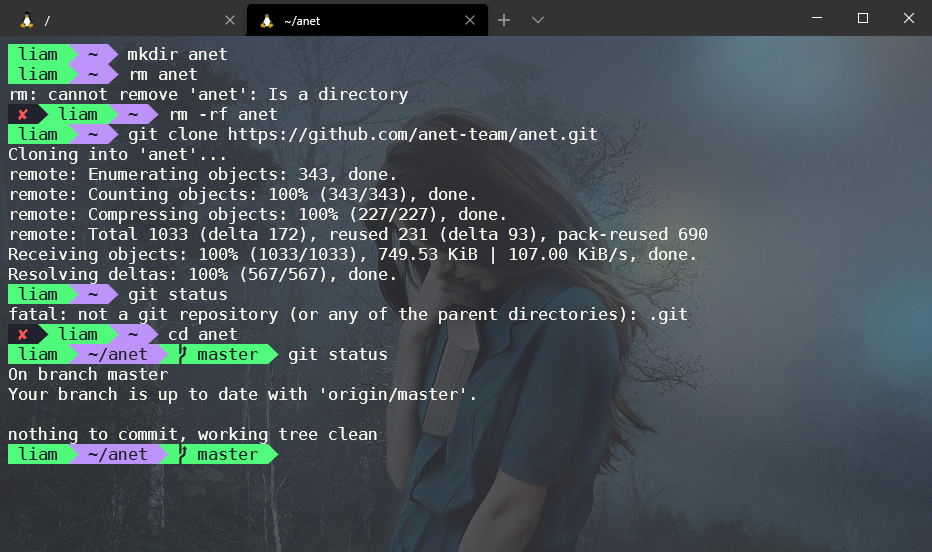
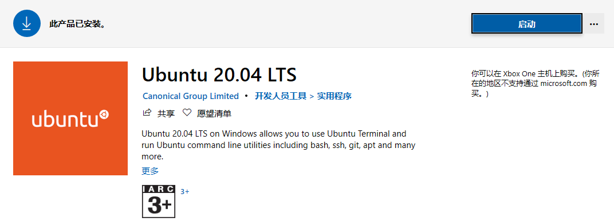
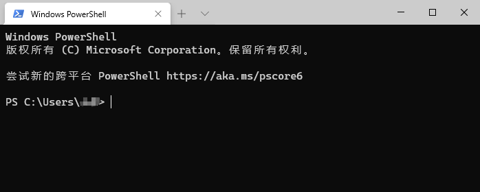
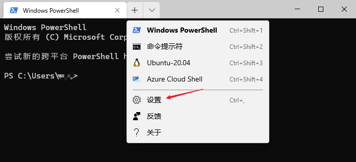
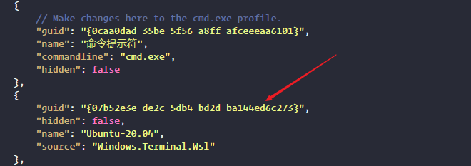
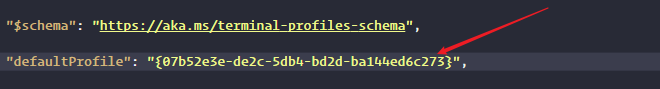
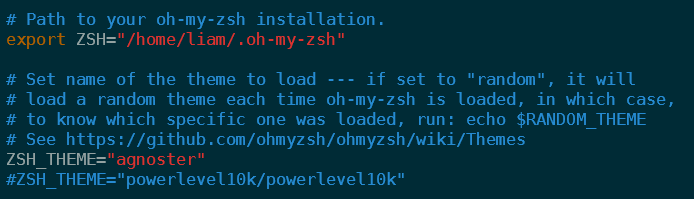
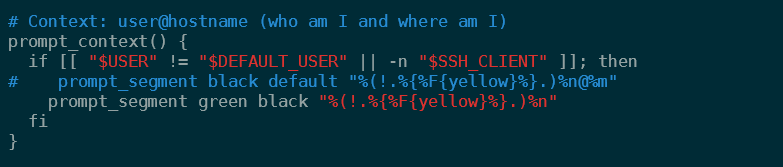
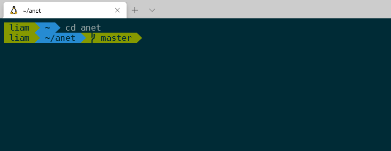
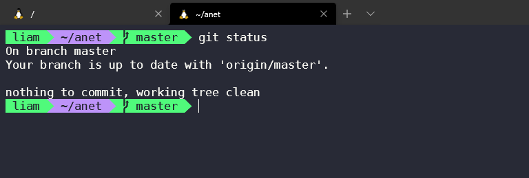

自从 Windows Terminal 正式发布后就再没有用过 Windows 系统自带的终端了。主要是 Terminal 简洁且灵活，更重要的是支持特殊字体，通过一些简单的配置可以使得终端看起来更舒适养眼。

自从 Win 10 有了 Linux 子系统（WSL），早就把电脑上的 vmware 虚拟机软件卸载了。WSL 体验之好，谁用谁知道。

先给大家看看我个人的配置效果图：



## **安装 WSL 2**

**WSL**，Windows Subsystem for Linux（适用于 Linux 的 Windows 子系统）的简写。它有两个版本，WSL 1 和 WSL 2。 建议使用 WSL 2，它具有更好的整体性能。

安装 WSL 2，对不同架构的 CUP 有不同的 Win10 版本要求。为了简单起见，你只需确保你的 Win10 版本号为 2004（内部版本19041或更高）即可。PS：使用 `win + r` 输入 `winver` 可快速查看 Windows 版本。

如果你的 Win10 版本号低于 2004，可使用 Windows 10 易升工具手动升级。下载 Windows 10 易升工具：

```bash
https://www.microsoft.com/zh-cn/software-download/windows10
```

下载下来后双击运行，等待完成升级即可（升级过程比较漫长）。

安装 WSL 2 之前，必须启用“虚拟机平台”可选功能。使用管理员身份打开 PowerShell，执行以下命令：

```bash
dism.exe /online /enable-feature /featurename:VirtualMachinePlatform /all /norestart
```

接下来需要安装 Linux 分发版本。打开微软应用商店，搜索 Ubuntu，在列表中选择最新的长期支持版本 20.04 LTS 并安装。



使用任一终端，输入以下命令查看 WSL 版本，确保 WSL 的版本为 2.0：

```bash
$ wsl -l -v
  NAME            STATE           VERSION
* Ubuntu-20.04    Stopped         2
```

如果你之前安装过 WSL，当前不是 WSL 2 版本，可以通过以下命令设置 WSL 的默认版本：

```text
wsl --set-version Ubuntu-20.04 2
```

PS：从 WSL 1 更新到 WSL 2 可能需要几分钟才能完成，具体取决于目标分发版的大小。

## **安装 Terminal**

打开微软应用商店，搜索“Terminal”，安装，打开后的界面是这样的：



默认打开的是 PownerShell 终端，我们可以设置为默认打开 Ubuntu 终端。点击标签右边的下拉三角，选择设置：



会打开一个 JSON 配置文件，在 `profiles->list` 中找到 Ubuntu 的 guid 并复制。



将它粘贴为文件开头的 `defaultProfile` 的值：



## **安装 oh-my-zsh**

我们需要先安装一些额外的字体来支持 oh-my-zsh 显示特殊的符号。打开 PowerShell，依次执行如下命令 Powerline 字体集合：

```bash
git clone https://github.com/powerline/fonts.git
cd fonts
.\install.ps1
```

接着安装 zsh：

```bash
sudo apt update
sudo apt install git zsh -y
```

再安装 oh-my-zsh：

```bash
sh -c "$(curl -fsSL https://raw.githubusercontent.com/ohmyzsh/ohmyzsh/master/tools/install.sh)"
```

此步如果报如下错误：

```bash
curl: (7) Failed to connect to raw.githubusercontent.com port 443: Connection refused
```

解决办法有很多种，请自行解决。

安装完 oh-my-zsh 后，编辑 `~/.zshrc` 文件，将主题设置为 `agnoster`：



再次打开 Terminal 的 JSON 配置文件，在 `schemes` 中添加一个主题，主题名随意，这里为 `wsl2`：

```json
"schemes": [
    {
        "name" : "wsl2",
        "background" : "#002B36",
        "black" : "#002B36",
        "blue" : "#268BD2",
        "brightBlack" : "#657B83",
        "brightBlue" : "#839496",
        "brightCyan" : "#D33682",
        "brightGreen" : "#B58900",
        "brightPurple" : "#EEE8D5",
        "brightRed" : "#CB4B16",
        "brightWhite" : "#FDF6E3",
        "brightYellow" : "#586E75",
        "cyan" : "#2AA198",
        "foreground" : "#93A1A1",
        "green" : "#859900",
        "purple" : "#6C71C4",
        "red" : "#DC322F",
        "white" : "#93A1A1",
        "yellow" : "#B58900"
    }
],
```

然后在该 JSON 文件中把 wsl 终端的主题设置为该 `wsl2` 主题，并把字体改为你喜欢的一个 Powerline 字体：


最后一步，再做一点点美化：把命令行的机器名称去掉，并调整用户名的背景色。编辑 agnoster 主题文件：

```bash
vi ~/.oh-my-zsh/themes/agnoster.zsh-theme
```

把 92 行修改为：

```bash
prompt_segment green black "%(!.%.)%n"
```

修改后如下：



关闭 Terminal 再重新打开，效果如下：



配置完成！

当然，你也可以去 Google 自己喜欢的主题，比如更为鲜亮的 Dracula 主题：



如若你在安装配置过程中遇到问题，请留言。