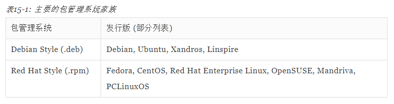
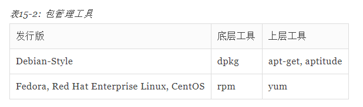

这是个很有意思的问题，我刚接触到Ubuntu的时候便在各种教程中看到apt和apt-get的身影，apt和apt-get有什么区别这个问题也随之浮现在我脑海中，是我作为Linux初学者所遇到的第一个问题。

所以我想写一个较为详细回答，算是现在的我给以前的我的一个解答。

## 首先，回答本问题，apt install和apt-get install的区别是什么？

如果在非交互式脚本中运行apt install，就会提示**没有稳定**的CLI 接口。

所以要在脚本中安装软件，用apt-get **保险**一些，如果是自己在终端中使用命令行，显然是使用apt 更方便一些。

  

如果想继续了解Linux的各种包管理软件的一些区别，可以继续往下看。

dpkg（底层工具）->apt-get（上层工具）->apt（apt-get的再封装）

## 理解包管理系统这个概念。

Linux 发行版本质量最重要的决定因素是**软件包管理系统**和其**支持社区的持久性**。

随着我们花费更多的时间在 Linux 上，我们会发现各种软件的**更新速度是非常快的**。大多数一线 Linux 发行版每隔六个月发布一个新版本，并且有许多独立的程序每天都会更新。为了能和这些多如牛毛的软件保持联系，我们需要一些好工具来进行软件包管理。

## Linux包管理系统DPKG和RPM

不同的 Linux 发行版使用不同的包管理系统，一般而言，大多数发行版分别属于两大包管理技术阵营： Debian 的”.deb”，和红帽的”.rpm”。

**dpkg :**这个机制最早是由Debian Linux社群所开发出来的﹐通过dpkg 的机制，

Debian提供的软件就能够简单的安装起来，同时还能提供安装后的软件信息。只要是衍生于Debian 的其他Linux distributions 大多使用dpkg这个机制来管理软件的，包括B2D, Ubuntu等等。

**RPM:**这个机制最早是由Red Hat这家公司开发出来的﹐后来实在很好用﹐因此很多distributions 就使用这个机制来作为软件安装的管理方式。包括Fedora, CentOS, SuSE等等知名的开发商都是使用RPM。

软件包管理系统通常由两种工具类型组成：**底层工具**用来处理这些任务，比方说安装和删除软件包文件， 和**上层工具**，完成元数据搜索和依赖解析。

  

## apt-get

**Advanced Package Tool**，又名**apt-get**，是一款适用于[Unix](https://link.zhihu.com/?target=https%3A//baike.baidu.com/item/Unix)和[Linux](https://link.zhihu.com/?target=https%3A//baike.baidu.com/item/Linux)系统的[应用程序管理器](https://link.zhihu.com/?target=https%3A//baike.baidu.com/item/%25E5%25BA%2594%25E7%2594%25A8%25E7%25A8%258B%25E5%25BA%258F%25E7%25AE%25A1%25E7%2590%2586%25E5%2599%25A8/16063616)。最初于1998年发布，用于检索应用程序并将其加载到Debian Linux系统。Apt-get成名的原因之一在于其出色的**解决软件依赖关系**的能力。其通常使用.deb-formatted文件，但经过修改后可以使用apt-rpm处理红帽的Package Manager（RPM）文件。

apt-get主要用于自动从互联网的软件仓库中搜索、安装、升级、卸载软件或操作系统。如果你已阅读 apt-get 命令指南，可能已经遇到过许多类似的命令，如 apt-cache、apt-config 等。这些命令都比较低级又包含众多功能，普通的 Linux 用户也许永远都不会使用到。换种说法来说，**最常用的 Linux 包管理命令都被分散在了 apt-get、apt-cache 和 apt-config 这三条命令当中**。

**apt 命令的引入就是为了解决命令过于分散的问题**，它包括了 apt-get 命令出现以来使用最广泛的功能选项，以及 apt-cache 和 apt-config 命令中很少用到的功能。

  

## apt

apt是一个命令行实用程序，用于在Ubuntu、Debian和相关Linux发行版上安装、更新、删除和管理deb软件包。

Apt，可以基本解决依赖问题并检索需要的软件包，可与dpkg一起工作。Apt很强大，主要在命令行(控制台/[terminal](https://link.zhihu.com/?target=https%3A//wiki.debian.org/terminal))下使用。但是，也有很多**GUI/图形化**工具，让使用者不必接触命令行。

**简单来说就是：apt = apt-get、apt-cache 和 apt-config 中最常用命令选项的集合**。

  

## dpkg和apt-get的区别

**dpkg:**用来安装.deb文件时，不会解决模块的**依赖关系**，且不会关心ubuntu的软件仓库内的软件，可以用于安装**本地**的deb文件。

**apt-get:**会解决和安装模块的依赖问题，并会咨询软件仓库，但不会安装**本地**的deb文件，apt-get是建立在dpkg之上的软件管理工具。

  

## apt 与 apt-get 之间的区别

1.apt 命令是对之前的apt-get apt-cache 等的封装，提供更加统一，更加适合**终端用户**使用的接口。

2.apt 具有更**精减**但足够的命令选项，而且参数选项的组织方式更为有效。

3.apt是为交互使用而设计的。最好在shell脚本中使用apt-get和apt-cache，因为它们在不同版本之间向后兼容，并且有更多选项和功能。

对于基本命令，**apt和apt-get**两个工具的语法是相同的。

  

## **apt 命令** **取代的apt-get命令** **命令的功能**

apt install | apt-get install | 安装软件包

apt remove | apt-get remove | 移除软件包

apt purge | apt-get purge | 除软件包及配置文件

apt update | apt-get update | 刷新存储库索引

apt upgrade | apt-get upgrade | 升级所有可升级的软件包

apt autoremove | apt-get autoremove | 自动删除不需要的包

apt full-upgrade | apt-get dist-upgrade | 在升级软件包时自动处理依赖关系

apt search | apt-cache search | 搜索应用程序

apt show | apt-cache show | 显示安装细节