> 流量洪峰下要做好高服务质量的架构是一件具备挑战的事情，本文是B站技术总监毛剑老师在「云加社区沙龙online」的分享整理，详细阐述了从Google SRE的系统方法论以及实际业务的应对过程中出发，一些体系化的可用性设计。对我们了解系统的全貌、上下游的联防有更进一步的帮助。

[如何成为一名优秀架构师\_腾讯视频](https://link.zhihu.com/?target=https%3A//v.qq.com/x/page/j0958uemp97.html%3Fpcsharecode%3D%26sf%3Duri)

## **一、负载均衡**

负载均衡具体分成两个方向，一个是前端负载均衡，另一个是数据中心内部的负载均衡。

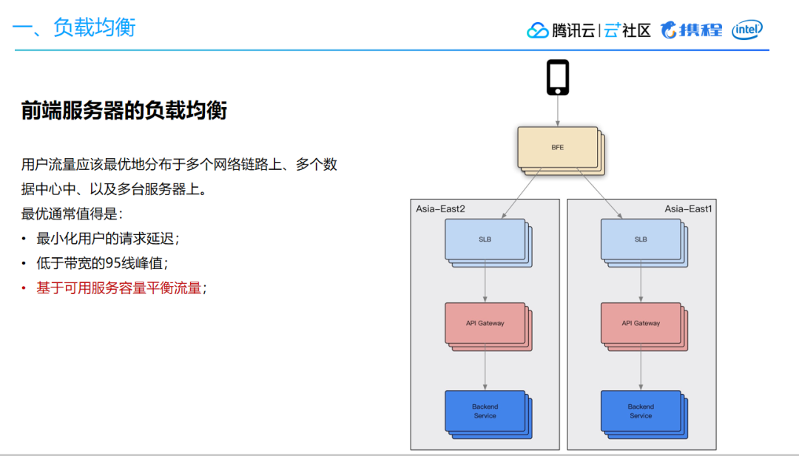

前端负载均衡方面，一般而言用户流量访问层面主要依据DNS，希望做到最小化用户请求延迟。将用户流量最优地分布在多个网络链路上、多个数据中心、多台服务器上，通过动态CDN的方案达到最小延迟。以上图为例，用户流量会先流入BFE的前端接入层，第一层的BFE实际上起到一个路由的作用，尽可能选择跟接入节点比较近的一个机房，用来加速用户请求。然后通过API网关转发到下游的服务层，可能是内部的一些微服务或者业务的聚合层等，最终构成一个完整的流量模式。基于此，前端服务器的负载均衡主要考虑几个逻辑：

-   第一，尽量选择最近节点；
-   第二，基于带宽策略调度选择API进入机房；
-   第三，基于可用服务容量平衡流量。  
    

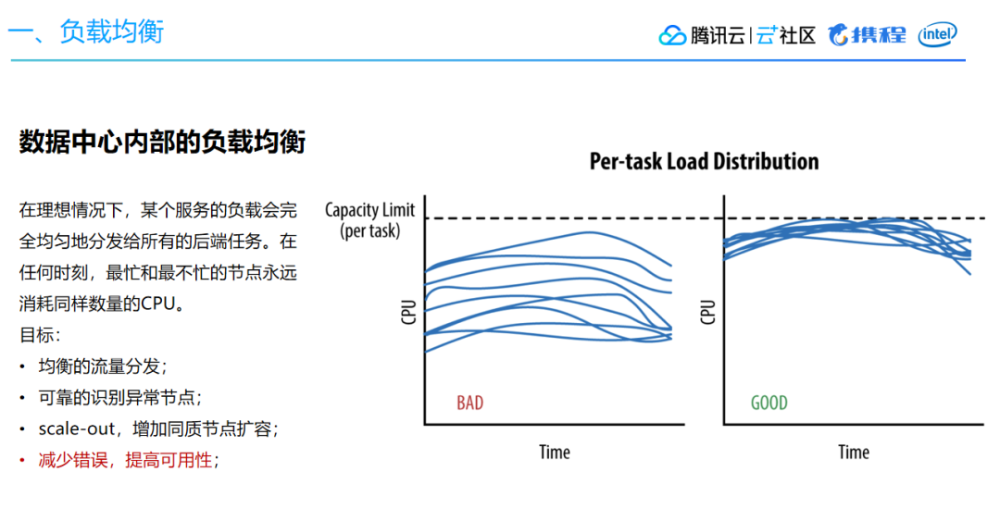

数据中心内部的负载均衡方面，理想情况下会像上图右边显示那样，最忙和最不忙的节点所消耗的CPU相差幅度较小。但如果负载均衡没做好，情况可能就像上图左边一样相差甚远。由此可能导致资源调度、编排的困难，无法合理分配容器资源。因此，数据中心内部负载均衡主要考虑：

-   均衡流量分发；
-   可靠识别异常节点；
-   scale-out，增加同质节点以扩容；
-   减少错误，提高可用性。

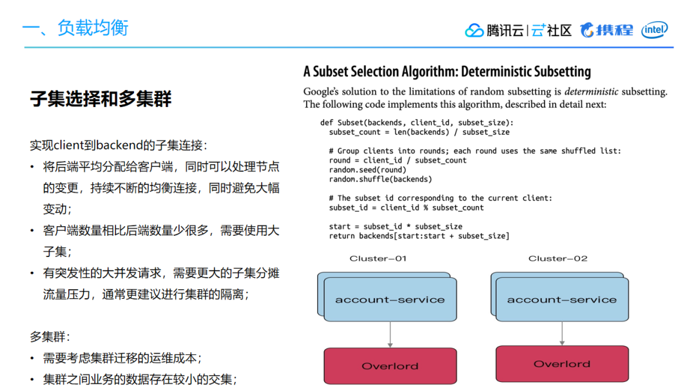

我们此前通过同质节点来扩容就发现，内网服务出现CPU占用率过高的异常，通过排查发现背后RPC点到点通信间的 health check 成本过高，产生了一些问题。另外一方面，底层的服务如果只有单套集群，当出现抖动的时候故障面会比较大，因此需要引入多集群来解决问题。通过实现 client 到 backend 的子集连接，我们做到了将后端平均分配给客户端，同时可以处理节点变更，持续不断均衡连接，避免大幅变动。多集群下，则需要考虑集群迁移的运维成本，同时集群之间业务的数据存在较小的交集。

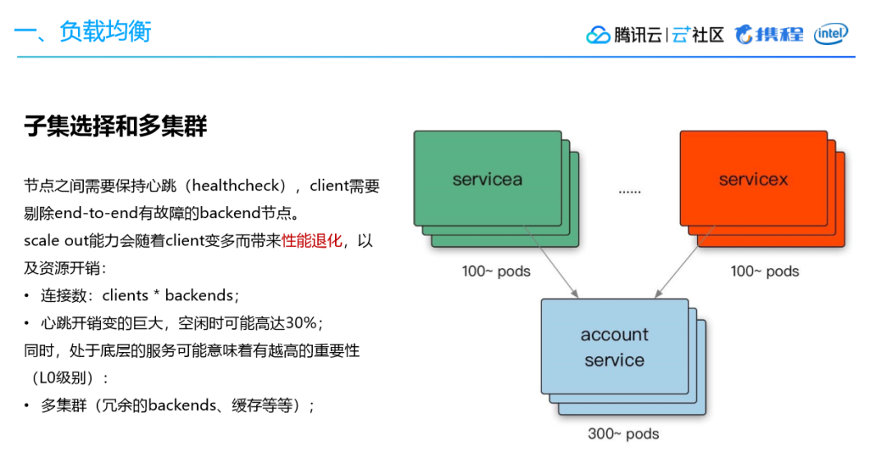

回到CPU忙时、闲时占用率过大的问题，我们会发现这背后跟负载均衡算法有关。第一个问题，对于每一个qps，实际上就是每一个query、查询、API请求，它们的成本是不同的。节点与节点之间差异非常大，即便你做了均衡的流量分发，但是从负载的角度来看，实际上还是不均匀的。第二个问题，存在物理机环境上的差异。因为我们通常都是分年采购服务器，新买的服务器通常主频CPU会更强一些，所以服务器本质上很难做到强同质。

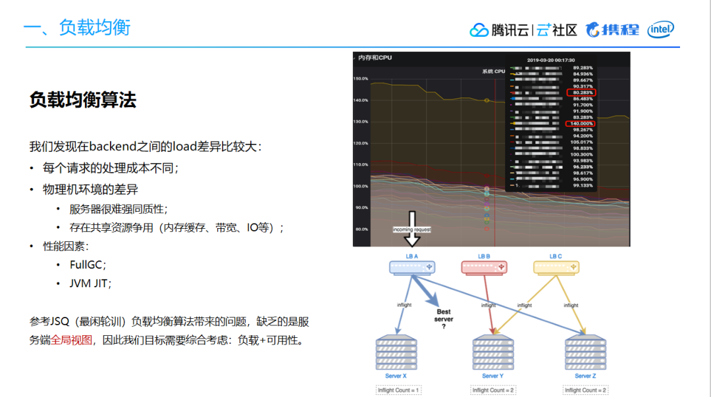

基于此，参考JSQ（最闲轮训）负载均衡算法带来的问题，发现缺乏的是服务端全局视图，因此我们的目标需要综合考虑负载和可用性。我们参考了《The power of two choices in randomized load balancing》的思路，使用the choice-of-2算法，随机选取的两个节点进行打分，选择更优的节点：

-   选择backend：CPU，client：health、inflight、latency作为指标，使用一个简单的线性方程进行打分；
-   对新启动的节点使用常量惩罚值（penalty），以及使用探针方式最小化放量，进行预热；
-   打分比较低的节点，避免进入“永久黑名单”而无法恢复，使用统计衰减的方式，让节点指标逐渐恢复到初始状态（即默认值）。

通过优化负载均衡算法以后，我们做到了比较好的收益。

## **二、限流**

避免过载，是负载均衡的一个重要目标。随着压力增加，无论负载均衡策略如何高效，系统某个部分总会过载。我们优先考虑优雅降级，返回低质量的结果，提供有损服务。在最差的情况，妥善的限流来保证服务本身稳定。

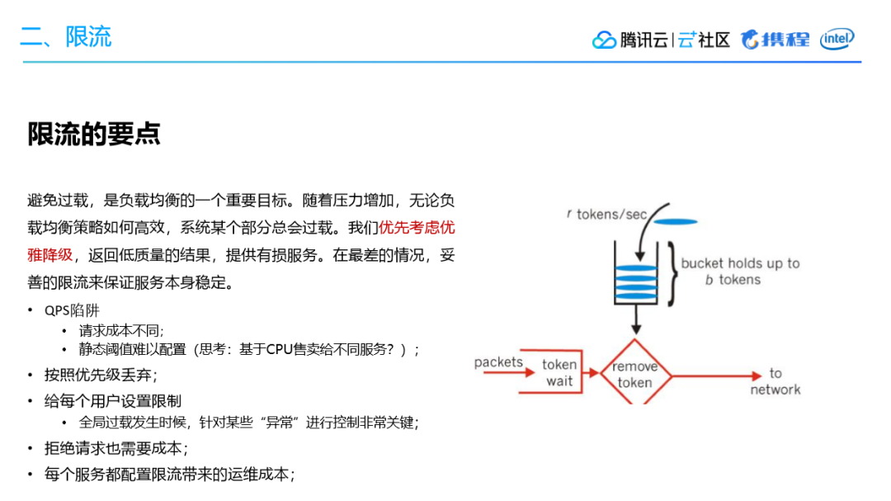

限流这块，我们认为主要关注以下几点：

-   一是针对qps的限制，带来请求成本不同、静态阈值难以配置的问题；
-   二是根据API的重要性，按照优先级丢弃；
-   三是给每个用户设置限制，全局过载发生时候，针对某些“异常”进行控制非常关键；
-   四是拒绝请求也需要成本；
-   五是每个服务都配置限流带来的运维成本。

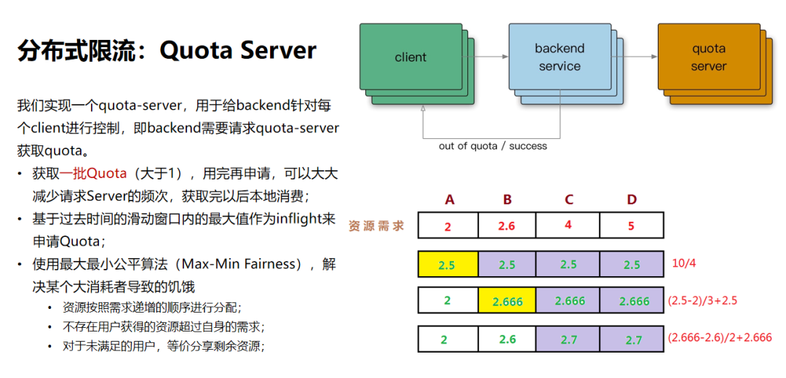

在限流策略上，我们首先采用的是分布式限流。我们通过实现一个quota-server，用于给backend针对每个client进行控制，即backend需要请求quota-server获取quota。这样做的好处是减少请求Server的频次，获取完以后直接本地消费。算法层面使用最大最小公平算法，解决某个大消耗者导致的饥饿。

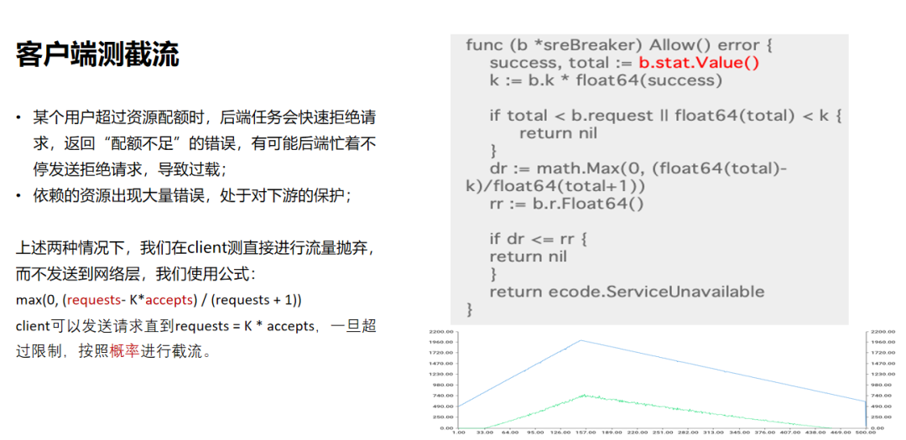

在客户端侧，当出现某个用户超过资源配额时，后端任务会快速拒绝请求，返回“配额不足”的错误，有可能后端忙着不停发送拒绝请求，导致过载和依赖的资源出现大量错误，处于对下游的保护两种状况，我们选择在client侧直接进行流量，而不发送到网络层。我们在Google SRE里学到了一个有意思的公式，max(0, (requests- K\*accepts) / (requests + 1))。通过这种公式，我们可以让client直接发送请求，一旦超过限制，按照概率进行截流。

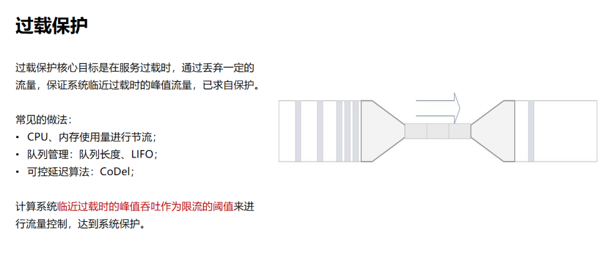

在过载保护方面，核心思路就是在服务过载时，丢弃一定的流量，保证系统临近过载时的峰值流量，以求自保护。常见的做法有基于CPU、内存使用量来进行流量丢弃；使用队列进行管理；可控延迟算法：CoDel 等。简单来说，当我们的CPU达到80%的时候，这个时候可以认为它接近过载，如果这个时候的吞吐达到100，瞬时值的请求是110，我就可以丢掉这10个流量，这种情况下服务就可以进行自保护，我们基于这样的思路最终实现了一个过载保护的算法。

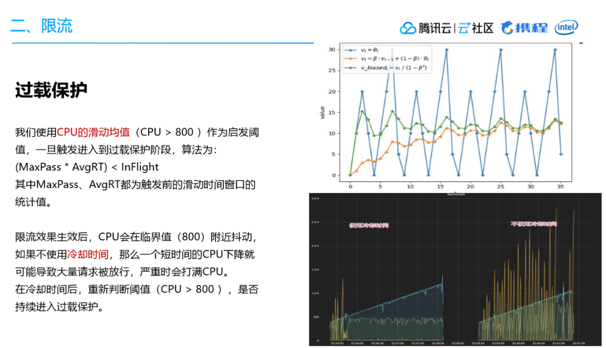

我们使用CPU的滑动均值（CPU > 800 ）作为启发阈值，一旦触发就进入到过载保护阶段。算法为：(MaxPass \* AvgRT) < InFlight。其中MaxPass、AvgRT都为触发前的滑动时间窗口的统计值。

限流效果生效后，CPU会在临界值（800）附近抖动，如果不使用冷却时间，那么一个短时间的CPU下降就可能导致大量请求被放行，严重时会打满CPU。在冷却时间后，重新判断阈值（CPU > 800 ），是否持续进入过载保护。

## **三、重试**

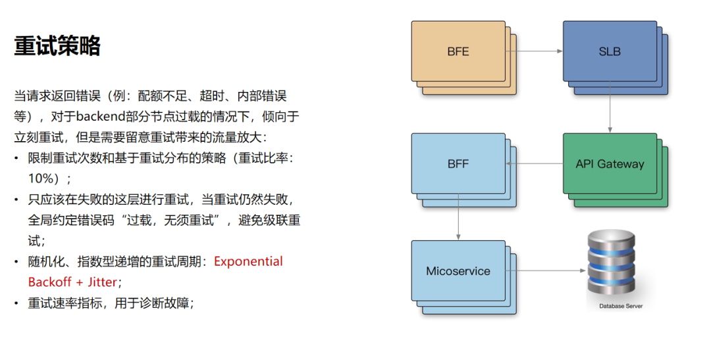

  

流量的走向，一般会从BFE到SLB然后经过API网关再到BFF、微服务最后到数据库，这个过程要经过非常多层。在我们的日常工作中，当请求返回错误，对于backend部分节点过载的情况下，我们应该怎么做？

-   首先我们需要限制重试的次数，以及基于重试分布的策略；
-   其次，我们只应该在失败层进行重试，当重试仍然失败时，我们需要全局约定错误码，避免级联重试；
-   此外，我们需要使用随机化、指数型递增的充实周期，这里可以参考Exponential Backoff和Jitter；
-   最后，我们需要设定重试速率指标，用于诊断故障。

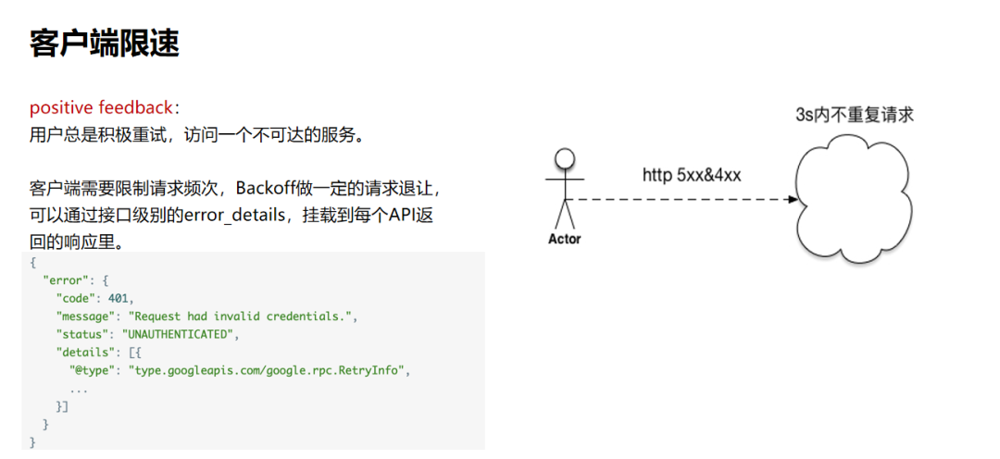

而在客户端侧，则需要做限速。因为用户总是会频繁尝试去访问一个不可达的服务，因此客户端需要限制请求频次，可以通过接口级别的error\_details，挂载到每个API返回的响应里。

## **四、超时**

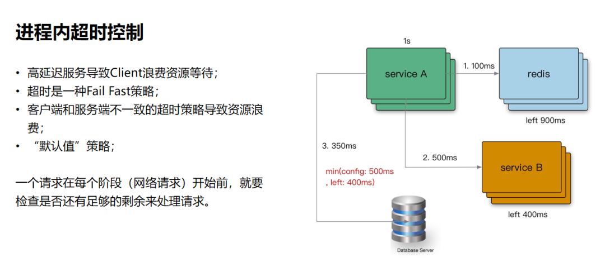

我们之前讲过，大部分的故障都是因为超时控制不合理导致的。首当其冲的是高并发下的高延迟服务，导致client堆积，引发线程阻塞，此时上游流量不断涌入，最终引发故障。所以，从本质上理解超时它实际就是一种Fail Fast的策略，就是让我们的请求尽可能消耗，类似这种堆积的请求基本上就是丢弃掉或者消耗掉。另一个方面，当上游超时已经返回给用户后，下游可能还在执行，这就会引发资源浪费的问题。再一个问题，当我们对下游服务进行调优时，到底如何配置超时，默认值策略应该如何设定？生产环境下经常会遇到手抖或者错误配置导致配置失败、出现故障的问题。所以我们最好是在框架层面做一些防御性的编程，让它尽可能让取在一个合理的区间内。 进程内的超时控制，关键要看一个请求在每个阶段（网络请求）开始前，检查是否还有足够的剩余来处理请求。另外，在进程内可能会有一些逻辑计算，我们通常认为这种时间比较少，所以一般不做控制。

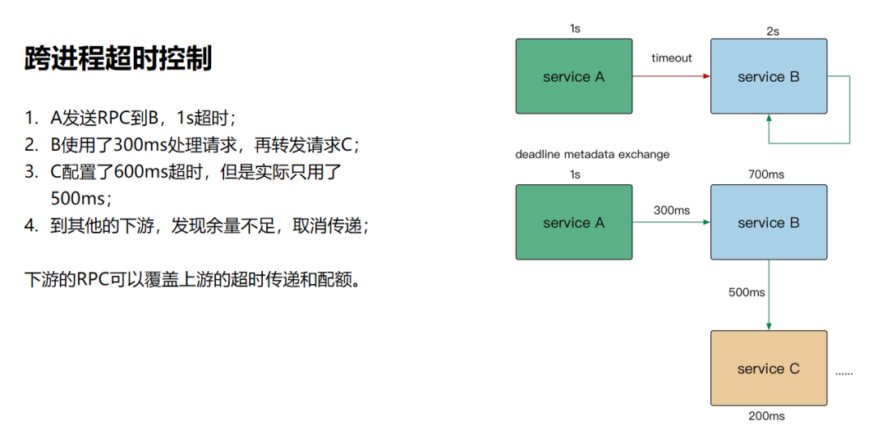

现在很多RPC框架都在做跨进程超时控制，为什么要做这个？跨进程超时控制同样可以参考进程内的超时控制思路，通过RPC的源数据传递，把它带到下游服务，然后利用配额继续传递，最终使得上下游链路不超过一秒。

## **五、应对连锁故障**

结合我们上面讲到的四个方面，应对连锁故障，我们有以下几大关键点需要考虑。

第一，我们需要尽可能避免过载。因为节点一个接一个挂了的话，最终服务会雪崩，有可能机群都会跟着宕掉，所以我们才提到要做自保护。

第二，我们通过一些手段去做限流。它可以让某一个client对服务出现高流量并发请求时进行管控，这样的话服务也不容易死。另外，当我们无法正常服务的时候，还可以做有损服务，牺牲掉一些非核心服务去保证关键服务，做到优雅降级。

第三，在重试策略上，在微服务内尽可能做退避，尽可能要考虑到重试放大的流量倍数对下游的冲击。另外还要考虑在移动端用户用不了某个功能的情况下，通常会频繁刷新页面，这样产生的流量冲击，我们在移动端也要进行配合来做流控。

第四，超时控制强调两个点，进程内的超时和跨进程的传递。最终它的超时链路是由最上层的一个节点决定的，只要这一点做到了，我觉得大概率是不太可能出现连锁故障的。

第五，变更管理。我们通常情况下发布都是因为一些变更导致的，所以说我们在变更管理上还是要加强，变更流程中出现的破坏性行为应该要进行惩罚，尽管是对事不对人，但是还是要进行惩罚以引起重视。

第六，极限压测和故障演练。在做压测的时候，可能压到报错就停了。我建议最好是在报错的情况下，仍然要继续加压，看你的服务到底是一个什么表现？它能不能在过载的情况下提供服务？在上了过载保护算法以后，继续加压，积极拒绝，然后结合熔断的话，可以产生一个立体的保护效果。 经常做故障演练可以产生一个品控手册，每个人都可以学习，经常演练不容易慌乱，当在生产环境中真的出现问题时也可以快速投入解决。

第七，考虑扩容、重启、消除有害流量。

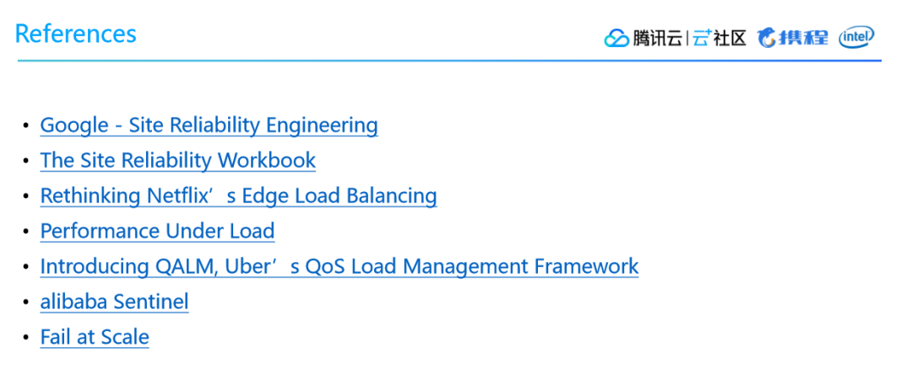

如上图所示的参考，就是对以上几个策略的经典补充，也是解决各种服务问题的玄学

*「云加社区」公众号回复「在线沙龙」获取PPT下载链接~*

## **六、Q&A**

Q：请问负载均衡依据的metric是什么？

A：主要是基于两个纬度，backend是负载即cpu或者load，client是health、inflight、latency。

  

Q：BFE到SLB是走公网还是专线？BFE 是部署在哪里的？一般怎么部署？

A：公网、专线都存在，BFE（边缘加速）一般会覆盖国内各个省份和重要城市。

  

Q：如果client就几千量级，每10s pingpong 一下，其实也就几百 qps？会造成蛮高的cpu开销？

一个观众问：负载均衡：clients\_num\*servers\_num 量级多大？？另一个观众说：clients\_num\*servers\_num 应该有20万的量。

  

A：这里面开销可以理解为两个纬度，backend的压力取决于上游有多少client，以及client可能还有连接池（不过gRPC是单连接多路复用），另外就是client，在下游backend量级大的时候，本身发出去的pingpong请求也不少。

  

Q：多集群成本怎么考虑的？分集群还是隔离部署？

A：多集群针对核心（L0）的服务，冗余backend，以及cache等资源，我们通常在PaaS平台针对某个appid的backend支持cluster的概念即隔离多套resource pool或者仅仅是单纯的容器数量翻倍；

  

Q：运维会比较麻烦的吧？

A：多集群的运维，更多是PaaS平台需要支持，实际上对日常运维感知不强；

  

Q：公司API网关，一般会按照业务系统分吗?还是整个公司就一个API网关？

A：API Gateway、以及业务BFF我们都会按照业务来隔离；

  

Q：多集群在切换的时候是否平滑？是否有阻塞的点？

A：多集群的切换，在使用子集算法后，是无感知的，相当于集群01出现故障，我们需要剔除整个集群的情况下，可以在服务发现注册上禁用节点即可，在这个变更操作中可以考虑阻塞（比如下线部分集群01的节点）；

  

Q：预热是怎么做的？

A：JVM系的服务，早期做法是，手工代码或者接口请求来预热，之后再放行流量（Readiness放行），之后是通过负载均衡里面的new startup server 惩罚进行小流量放行来自动预热；其他场景考虑自己手动预热，比如load local file 作为cache等；

  

Q：探针请求是选取一定比例的正常业务请求吗？这一部分请求如果失败了是怎么处理？

A：探针请求就是业务正常请求，当量足够小（比如只有1个），通常服务不会过载，可能会比avg lag稍高一些，但是不太会超时；

  

Q：除了请求的时候被动的获取节点数据之外还有其他主动拉取的机制吗？被动拉取会不会不太全？

A：1.、当Quota耗尽；2、当申请Quota的Lease接近过期； 两个情况都会去申请；如果被动真的拉取失败，比如QuotaServer故障，可以考虑降级为本地策略，甚至直接放行；

  

Q：当数据中心的同一时间节点的访问量，处在高并发的状态下，怎么去尽量保证和优化这个访问体验？

A：数据中心级别的流量调度，是需要综合考虑 用户体验，以及机房是否过载，这也是GSLB（Global Software Load Balancer）需要来考虑流量调度的；

  

Q：上下游如何理解？是请求流还是响应流阿？

A：上下游指的是：A->B，那么A就是上游，B就是下游；

  

Q：这些功能现有的微服务框架不能解决么？

A：现有的微服务框架，更多是留出Stub，需要你自己来对接QuotaServer，这里更多讲QuotaServer如何更好的实现；

  

Q：过载保护和过负荷保护在实际操作中有区别吗？

A：应该没有；

  

Q：有没有重试统计的数据啊？

A：PPT里也提到了，我们最好能够在采集Metric的时候区分正常、重试的QPS Metric；

  

Q：实际上对于网络抖动而言，重试没啥用？因为你重试的时候，其实也是大概率有问题的？

A：好问题，实际上我们在对待Cache访问失败（非Cache Miss），我们的go code generator会考虑这个case，认为网络问题可能是短时间内的处于Incast congestion，会放弃本次 cache miss 的数据回填；

做的更好可以考虑类似tcp 滑动窗口，细节可以参考下《Scaling Memcache At Facebook》；

  

Q：客户端统计的逻辑太多了呀？应该有类似sidecar或者cl5 agent来做这些事情吧？

A：这个client可以理解为：1、smart client，就是rpc直连；2、service mesh，就是agent呢；所以这里更多强调的是思路；

  

Q：你们的幂等是怎么做的呢？

A：retry幂等通常是需要业务来处理的，所以retry确实有一定的副作用；

  

Q：这个很简单吧，缺省叠加设置个总会话超时？

A：对的，从入口层设置一个全会话超时，但是要做到位，需要内部各个组建协同，否则一个request内部的多个异步流占用的thread可能无法立即被cancel；

  

Q：赖一个公共etcd的负载信息，服务之间没有直接的路由信息交流，都单独和这个中心节点交互？能不能比较一下优劣，其实我听完之后还是倾向于这种中心化方法。

A：微服务讲究去中心化，参考Netflix文章里提到的，为啥不依赖一个中心化的方法来解决，因为太重了；

  

Q：请推荐一个这些细节处理比较好的rpc框架吧

A：

  

Q：超时传递,这要求太严格了,有一个节点出问题就不行了？

A：这个策略可以被替换的，看你自己业务需要；

  

Q：能不能一个服务lag太高然后链路断了啊

A：这个靠client基于你延迟的数据影响负载均衡的流量调度，如果失败率高靠的是熔断放弃这个节点的部分流量以换取更好的延迟；

  

Q：不过很多业务不需要这么严格吧？

A：对，但是连锁故障通常都是latency导致，很有可能是不那么重要的服务被依赖导致；

  

Q：服务一般是怎么设置自己的 SLA 的？

A：主动在API IDL重描述自己的SLA（pt95 多少ms），也有上游需要你达到多少ms，看业务场景呢；

  

Q：是否要引进混沌工程来提高整体系统的可用性？

A：只有靠不断的演练，Google 是有定期的Dirt灾难恢复测试，我建议是做的，但是要可控；

  

Q：毛总APIGateway 是自建还是开源的？

A：我们目前使用Envoy；

  

Q：openresty b站应用的多么

A：不算多；

  

Q：B站的ddos 策略是怎么做的

A：一旦你有了边缘节点，就可以结合GSLB 来做流量调度，被打的节点可以立马被摘除；

  

Q：哪些组件是云上的？哪些是自建的？

A：都是自建为主，但是我们PaaS/CDN是混合云；

  

Q：RPC meta 取 CPU 占用性能不会有问题么？

A：Background的thread/goroutine获取，暴露一个全局变量读取即可；

  

Q：压测QPS，往往跟线上的数据不太一致，这个有什么好的压测方案呢，压测可能达到1000，但其实线上到600就开始异常告警了？

A：可以了解下各个公司的全链路压测实践；

  

Q：像直播这种无法预测的量怎么估量？

A：还是要前置做好预案，通常大型活动才可能爆发增长；日常的突发流量靠Bypaas的监控来做cache预热等；

  

Q：想听听B站的幂等性方案，服务幂等性成本性最低的方案

A：基于业务transactionid，来做处理吧，这个比较偏业务呢，没有最佳实践；

  

Q：数据中心内k8s负载均衡怎么做的呢? LB绑NodePort吗？

A：我们不依赖k8s 原生的lb，是rpc框架里实现的lb；

  

Q：节点心跳导致性能消耗，现在是怎么处理的？不使用ping pong吗？

A：现在使用子集算法；

  

Q：用户频繁点击，前后端统一引导向不可达页面，要是被别人爆破接口咋办

A：cc/waf就可以被派上来来，提取特征来进行管控；

  

Q：请问限流的阈值如何确定呢？通过压测吗？

A：是的，极限压测；

  

Q：B站服务发现是怎么实现的

A：我们自己研发的[http://github.com/bilibili/discovery](https://link.zhihu.com/?target=http%3A//github.com/bilibili/discovery)；

  

Q：最顶层的超时怎么确定？是否可以根据延迟分布允许超时按照比例

A：对用户体验的通常都不建议超过1s（全链路），所以看业务的需要；其他超时我们更多是95线来设定；

  

Q：集群冗余 故障之后都需要手动切换的吗？

A：自动切换的，参考上面的回答；

  

Q：主播有没有技术博客

A：哈哈哈，不喜欢写，喜欢Social，或者Meetup，大会；

  

Q：HA考虑跨区多活架构有经验可分享么？

A：这个问题比较大，多活的架构业内也有不少公司有参考呢；

  

Q：超时传递会不会影响性能？

A：没有太大的开销，因为仅仅是元数据传递；

  

Q：pingpong健康检查是一个固定时间？

A：是的，固定时间；

  

Q：大仓库除了bazel还有其他方案嘛

A：k8s prow 可以了解下，我们基于prow做到了label级别的并行编译；但是一般非基础库的修改编译单个产物，go足够快了。

  

Q：正反馈循环没讲啊，是什么呢？

A：就是用户失败了，就猛刷刷刷。。

  

Q：BFF是什么组件？

A：bilibili frontend，实际就是边缘节点，用来做动态CDN加速的；

  

Q：如果要多节点服务器怎么同步数据？

A：数据中心的更多是cache如何一致，可以看看我之前对外的关于分布式缓存的分享；

  

Q：多少人开发的这个系统

A：基础库是零散的owner贡献，core committer也就2-3个；

  

Q：有没有做根据业务重要性来降级的策略, 保核心业务, 丢次要业务请求, 请求重要性是如何传递给各微服务的

A;需要有的，不同重要性可以基于传递到各个微服务下游，同时不同重要性load shedding的阈值可以不同，限流的配额可以不同；

  

Q：子集算法 是在nginx上实现吗？ 刚才说的假如1W个clinet 对1W个backend 对于每一个clinet都要分配动态子集 这个借用了hash算法吗？可以展开说下怎么做吗？

A：参考下google sre；

  

Q：客户端测截流 => 怎么识别客户端配额不足?

A：基于统一的错误吗，比如我们假定509表示配额不足，那么基于509就要更定熔断器的统计指标；

  

Q：请问用户接入点的质量和容量是怎么平衡的呢?

A：做线性公式来做取舍和调度，最终需要构建数学模型；

  

Q：必须限流吗？不限流就只能加机器了吧？

A：对，限流是紧急应对，那么接下来就要扩容了

  

Q：怎么样才能像你一样牛？怎么才能成为总监呢

A：不会摄影的程序员，不是好总监。

  

Q：B站有动态扩容策略是什么？连锁故障如何快速排查？

A：auto-scaling我们paas正在跟进，连锁故障其实优先考虑：1、最佳是否有release；2、靠谱的apm tracing系统；3、靠谱的统一的指标大盘（我们所有微服务、所有语言，做了监控指标统一和收敛）这样运维可以cross多个微服务诊断，并且dashboard一致；

  

Q：service mesh b站有用到吗？目前我看大部分的技术文章都是概念阶段？有什么文章推荐看下吗？

A：我们还没有，我们思路是先把中间件全部gRPC化，先把协议收敛，下一步再考虑是否mesh；

  

Q：gc带来的时延抖动怎么处理的呢？

A：go gc抖动可接受？另外还是靠负载均衡，因为client测指标回立马变化，因为gc延迟回增加，cpu会高；

  

Q：过载保护: 自适应过载保护怎么实现呢,有服务治理平台监控CPU/MEM 动态下发流控指令，RPC丢弃请求?

A：过载保护，是每个backend自己基于cpu/memory来决定的，不依赖其他组件，读取cpu和memory在cgroup下要注意才坑真的很麻烦，另外cpuset、cpu cfs nolimit一堆兼容逻辑；

  

Q：rpc连接分配，路由负载均衡，rpc本身不是提供了策略了，为什么还要自己做?

A：rpc提供的都是rr、rand，基本上不可用；

  

Q：基于CPU和流量等进行流控(比如Qps，快速拒绝等) 如果上面部署了好几个服务，这个如何权衡呢？

A：docker化？

  

Q：请问一下日志管理是怎么做的？

A：写盘，然后被采集到统一日志平台；

  

Q：底层服务互调要经过网关吗？

A：不经过，API Gateway/BFF 都是应对外网流量（我们也叫南北流量），内部流量（东西流量）通常都是rpc直连或者是mesh sidecar。

## **讲师简介**

毛剑，bilibili技术总监，[腾讯云最具价值专家（TVP）](https://link.zhihu.com/?target=http%3A//mp.weixin.qq.com/s%3F__biz%3DMzI2NDU4OTExOQ%3D%3D%26mid%3D2247490412%26idx%3D2%26sn%3De59961db7cd4400de3a19528756754e1%26chksm%3Deaab013cdddc882a042fb54af03696a9eb8e4e0fe3fb45b9d08005c5155951fc6100ad9ca2e4%26scene%3D21%23wechat_redirect)。负责bilibili数据平台部，拥有近十年的服务端研发经验。擅长高性能、高可用的服务端研发，熟悉Go、Java、C等语言。在B站参与了，从巨石架构到微服务的完整转型，包含微服务治理、微服务可用性设计，微服务数据一致性设计，微服务中间件，微服务监控，微服务日志收集，微服务负载均衡，和微服务RPC框架开发等。开源业内比较有影响力的项目：

[goim https://github.com/Terry-Mao/goim](https://link.zhihu.com/?target=https%3A//github.com/Terry-Mao/goim) 分布式IM长连接广播服务；

[bfs https://github.com/Terry-Mao/bfs](https://link.zhihu.com/?target=https%3A//github.com/Terry-Mao/bfs) 分布式小文件存储；