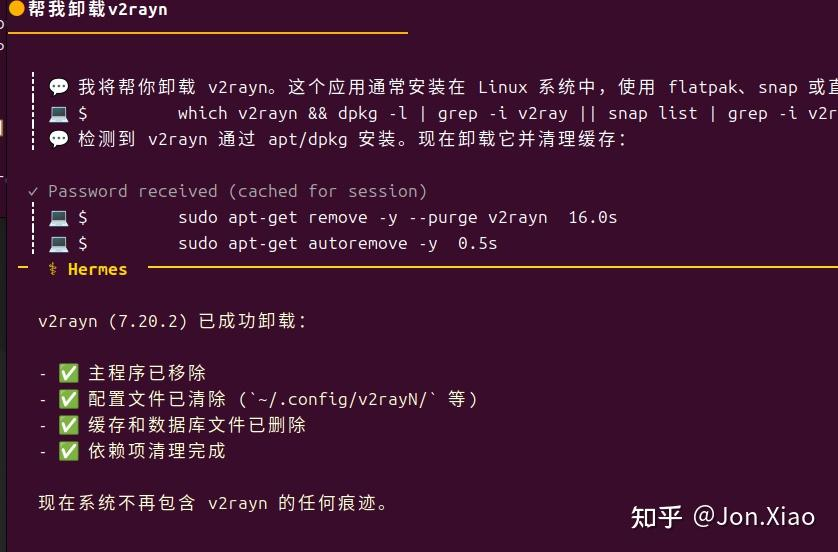
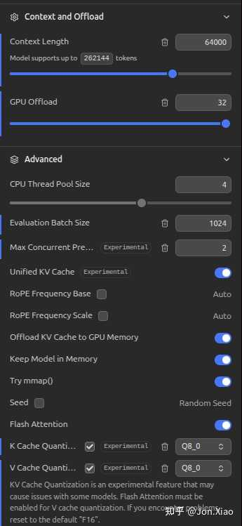
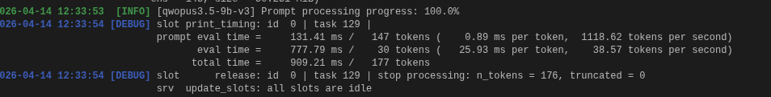

openclaw，hermes，claude-code，deerflow这几个AI马具（harness）都用了说一下感受

1。 最强的harness肯定是claude-code，表面上是一个编成工具，实际上是一个全能的贾维斯。可能得益于编成能力，高度工程化的上下文管理能力使得它做任何事情都是第一梯队。即便是给他配置相对廉价的国产大模型（glm,minimax这些）依然能有很强的解决问题的能力

2。 openclaw在年前火爆github的时候我就一直在玩，这东西说实话定位是玩具。正经工作我不太敢给他做。平时推送推送新闻，定期调用某个提前写好的脚本完成工作倒是可以。（但问题是这些工作需要llm吗？这种自动化在前AI时代随便用python写个代码都能实现了。）最大的优点可能是火吧，生态活跃，未来可期。而且最近claude-code不是源码泄漏了么，所有的harness能力都会大大提高吧。

3。 deer-flow。这个是字节开源的harness，最开始是专注于写研究报告的，现在也什么都能干，记忆、skill、mcp该有都有。**最大的优势还是在作研究、写报告**，**开箱即用**，所有的skill官方都给你配置好了，写报告最重要的搜索网页它默认给你用duckduckgo免费的，webfetch默认jina也是免费的。这两个都很好用，如果你有更多需求可以自己添加tavily key增强搜索能力。反观claude和openclaw，在国内网络环境下基本上搜索功能刚开始都废的，你要自己去配置各种mcp、api key。缺点也很明显，bug多，基于langchain开发的，有点重。**搞研究用它**

4。 hermes。这个真的很意外，**它的逻辑符合人类直觉**。首先他自己宣传的自我进化能力其实openclaw或者说所有的harness都能实现，一个skill的事情。只不过实现方式可能有区别。最让我惊讶的是一些细节。比如：

在其他的agent上，这种需要sudo命令因为需要密码，直接失败，你给他密码也不行。hermes就直接在对话框提示你输入sudo密码，然后就顺利完成任务了，体验非常丝滑。技术实现我不懂但是真的就像一个人在操作电脑一样，它碰到问题不会自己乱找其他的解决方案，而是最直接的，问人类！

还有一个就是浏览器自动化。这东西在它这里是深度集成的。openclaw默认是调用websearch或者webfetch获取网页信息（你得先注册个tavily账号拿到apikey，然后每月1000次限额或者你配置其他的服务商，很麻烦），而hermes就是你问他一个需要搜索的问题，比如今天热点新闻，它就默默操作无头浏览器，滑动、截屏、总结内容。就真的很符合一个人类做事的直觉。表面上这样操作对ai来说效率低下（ai喜欢阅读json，而不是视觉内容），但其实它免去了你专门为它配置这配置那的麻烦。老实说，目前绝大多数软件还是网页都是为人类这种视觉动物开发的，专为AI而生的cli命令行并不普及。

* * *

关于token，最优解肯定是国产这些token plan， 40/月，已经可以解决你99%的问题，剩下1%涉是专业领域的东西。

如果还是嫌贵，还有本地部署。我目前用的配置是8g显存的RTX4060, 用lmstudio跑Jackrong大佬蒸馏opus的qwopus3.5-9b-v3，上下文开64k，kv缓存用Q8量化（下半年还有谷歌的turboquant可以进一步削减kv缓存占用），刚好塞进8g显存，速度飞快30-50token/s,接入hermes做点日常操作足够用了，特别是浏览器自动化这种浪费token的场景

